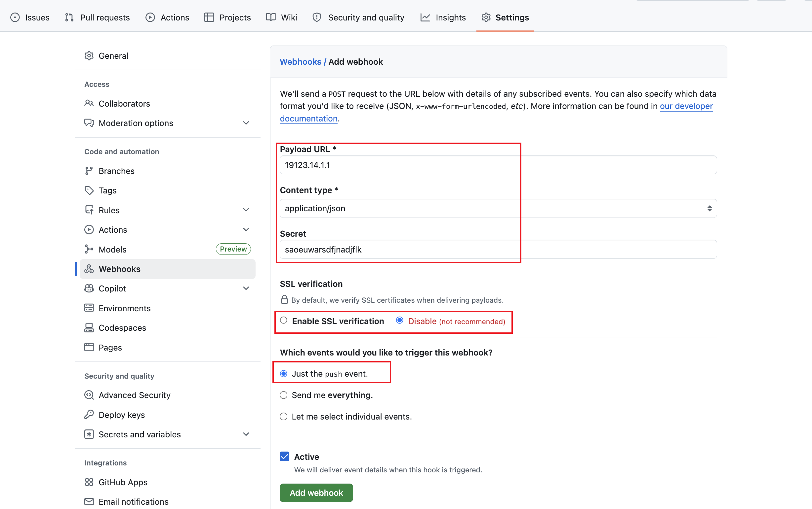
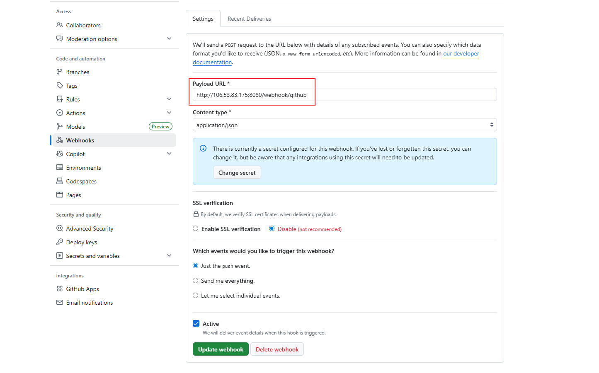
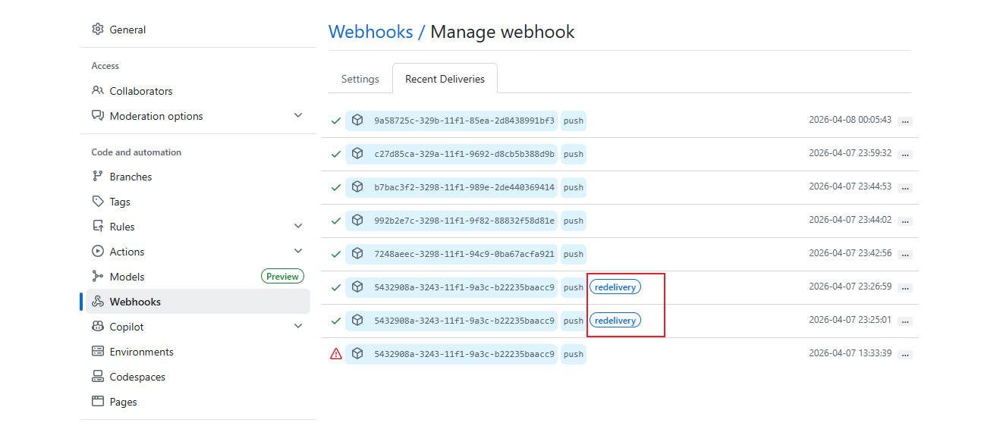
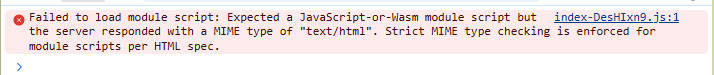

# GitHub Pages CI/CD 教程

“纯前端 Vite + React 项目”的 CI/CD。

- CI：在 GitHub Actions 上对 PR / main push 自动跑 lint + 单测 + build
- CD：main 分支 push 后，GitHub 通过 Webhook 通知你的服务器，由服务器执行拉代码、测试、构建与部署

## 1. 创建 Vite + React 项目

新建文件夹，执行命令。

```bash
npm create vite@latest . -- --template react-ts
```

- 点号代表「当前目录」。即不在新文件夹里生成，直接在你现在打开的这个文件夹创建项目
- 分隔符：告诉 npm 后面的参数直接传给 Vite，不是 npm 自己用
- `--template`：指定项目模板

完整含义：使用 npm 调用最新版 Vite 脚手架，在当前目录直接生成一个 React + TypeScript 模板项目。

创建后，要保证：

- `package.json` 存在
- `npm run build` 能跑通

## 2. 配置单元测试(Vitest + Testing Library)

安装依赖：

```bash
npm i -D vitest jsdom @testing-library/react @testing-library/jest-dom
```

4 个核心依赖作用：

- vitest: 现代化的 JavaScript/TypeScript 测试框架，基于 Vite 构建
- jsdom: 在 Node.js 环境中模拟完整的浏览器 DOM 环境
- @testing-library/react: 专门用于测试 React 组件的工具库
- @testing-library/jest-dom: 为 Vitest 提供 DOM 相关的匹配器。它提供了一些功能更强大，语法更简洁易懂的方法，对DOM对象进行相关的判断匹配

生成的 `vite.config.ts` 配置如下：

```ts
import { defineConfig } from 'vite'
import react from '@vitejs/plugin-react'

// https://vite.dev/config/
export default defineConfig({
  plugins: [react()],
})
```

项目根目录手动创建 `vitest.config.ts`:

```ts
import { defineConfig } from 'vitest/config'

export default defineConfig({
  test: {
    // 模拟浏览器环境，支持 DOM 操作
    environment: 'jsdom',
    // 加载测试初始化文件
    setupFiles: './src/setupTests.ts',
  },
})
```

src 目录下新增文件 `src/setupTests.ts`:

```ts
import '@testing-library/jest-dom/vitest'
```

`package.json` 的 `scripts` 保证有以下命令：

```json
"scripts": {
  "dev": "vite",
  "build": "tsc -b && vite build",
  "lint": "eslint .",
  "preview": "vite preview",
  "test": "vitest",
  "test:ci": "vitest run"
},
```

添加一个最小测试用例：`src/__tests__/smoke.test.tsx`

```tsx
// 导入测试工具
// render: 用于将 React 组件渲染到测试环境中
// screen: 提供查询渲染后 DOM 元素的方法
import { render, screen } from '@testing-library/react'

// 导入测试框架函数
// test: 定义测试用例
// expect: 用于创建断言
import { test, expect } from 'vitest';

// 定义测试用的 React 组件
// 这是一个简单的函数组件，返回一个包含文本的 h1 标题
function Hello() {
  return <h1>Hello Vite + React</h1>
}

// 定义测试用例
// 测试名称: 'renders' - 测试组件是否能正确渲染
test('renders', () => {
  // 执行阶段：渲染 Hello 组件到测试环境
  render(<Hello />)
  
  // 断言阶段：验证组件是否正确渲染
  // 1. screen.getByRole('heading', { name: 'Hello Vite + React' })
  //    - 通过 ARIA 角色 'heading' (标题) 查找文本内容为 'Hello Vite + React' 的元素
  // 2. .toBeInTheDocument()
  //    - 验证找到的元素是否存在于 DOM 中
  expect(screen.getByRole('heading', { name: 'Hello Vite + React' })).toBeInTheDocument()
})
```

初始化项目结构如下：


本地验证：

```bash
npm run test:ci
```

测试用例可以通过。


## 3. 配置 GitHub Actions 的 CI 文件

在根目录创建 CI 配置文件 `.github/workflows/ci.yml`，让 GitHub Actions 能够自动完成代码lint、测试test、构建build任务。

```yml
# 工作流名称
name: CI

# 触发条件
on:
  pull_request:  # 当有 PR 时触发
  push:          # 当有推送时触发
    branches: [master, main]  # 仅在 master 和 main 分支触发

# 权限设置
permissions:
  contents: read  # 只读权限

# 并发控制
concurrency:
  group: ci-${{ github.ref }}  # 并发组名
  cancel-in-progress: true     # 取消正在进行的相同任务

# 任务定义
jobs:
  vite_react:  # 任务名称
    # 指定 CI 工作流运行的操作系统环境，使用最新版本的 Ubuntu Linux 操作系统
    # 为整个 CI 工作流提供运行环境，确保所有命令和操作都在一致的系统环境中执行
    # Ubuntu 是 GitHub Actions 最常用的环境，因为它稳定且支持大多数开发工具
    runs-on: ubuntu-latest
    # env:
    #   FORCE_JAVASCRIPT_ACTIONS_TO_NODE24: true  # 强制使用 Node.js 24
    
    steps:  # 执行步骤
      # 将仓库中的代码文件复制到 CI 运行环境中
      - uses: actions/checkout@v5  # 检出代码（支持 Node.js 24）
      
      - uses: actions/setup-node@v5  # 设置 Node.js（支持 Node.js 24）
        with:  # 配置参数
          node-version: 24
          cache: npm
      
      # 执行命令
      - run: npm --version
      - run: npm ci  # 安装依赖（使用 package-lock.json 锁定版本）
      - run: npm run lint --if-present # 有定义 lint 命令才会执行
      - run: npm run test:ci  # 运行测试
      - run: npm run build    # 构建项目
```

在 GitHub 上创建一个新的仓库，复制仓库地址。

本地项目初始化 git，并关联远程仓库推送代码。

```bash
git init

git add .

git commit -m 'feat: init'

git remote add origin xxxx

git push -u origin master
```

- `-u` 参数是 `--set-upstream` 的简写形式，用于设置上游分支。第一次推送本地分支到远程仓库时，会建立分支联系，后续执行 `git push` 就会自动匹配分支。

提交代码后，CI 就会自动执行。


## 4. 服务器准备 webhook 部署器

CD 的关键点：

- GitHub 只负责把“发生了 push”这件事通知到你的服务器（Webhook）
- 服务器负责真正执行：拉取代码 → 安装依赖 → 跑测试 → 构建 → 重启/更新服务
- 必须校验 Webhook 签名，防止被伪造请求触发部署

服务器的前置条件：

- Node.js 20（或你项目要求的版本）
- git、npm
- 一个用于部署的目录，例如 `/srv/vite-app`
- 一个用于跑 Webhook 服务的端口（建议只在内网监听，由 Nginx 反代到公网）
- 一个用于对外提供静态文件的目录，例如 `/var/www/vite-app`

服务器部署目录初始化：

```bash
sudo mkdir -p /srv/vite-app
sudo chown -R $USER:$USER /srv/vite-app
cd /srv/vite-app
git clone <仓库地址> .
```

先在服务器验证一下是否能正常运行：

```bash
npm install
npm run test:ci
npm run build
```

## 5. 配置 GitHub Webhook（触发服务器执行CD）

在 GitHub 仓库：Settings → Webhooks → Add webhook。

- Payload URL：`http://你的域名（或服务器公网IP）/webhook/github`。
- Content type：application/json
- Secret：设置一个强随机字符串（例如 32+ 位），可以使用 base64 生成
- Which events：选 Just the push event
- Active：勾选

记下这个 Secret，后面用于服务器校验签名。



webhook创建成功，如有报错是正常的，这是因为我们服务器端的接口还没有通。

## 6. 实现 Webhook Receiver

推荐 Node 内置 http，无额外依赖。

在服务器的 `/srv/vite-app/scripts/webhook-server.cjs` 路径创建一个 Webhook 服务 webhook-server.cjs。

示例代码用 Node 内置模块，重点是“原始 body 的 HMAC 校验”与“只处理 master 的 push”。

注意：

- 如果主分支名称不是 master 的话，请自行修改，比如修改为 main。
- 如果包管理工具不是 npm，请自行修改对应命令。

```js
const http = require('http')
const crypto = require('crypto')
const { spawn } = require('child_process')

const PORT = Number(process.env.PORT || 9000)
const HOST = process.env.HOST || '127.0.0.1'
const WEBHOOK_SECRET = process.env.WEBHOOK_SECRET || ''
const DEPLOY_DIR = process.env.DEPLOY_DIR || '/srv/vite-app'
const DIST_DIR = process.env.DIST_DIR || '/var/www/vite-app'

function hmacSha256(secret, bodyBuffer) {
  const hmac = crypto.createHmac('sha256', secret)
  hmac.update(bodyBuffer)
  return `sha256=${hmac.digest('hex')}`
}

function safeEqual(a, b) {
  const aBuf = Buffer.from(a)
  const bBuf = Buffer.from(b)
  if (aBuf.length !== bBuf.length) return false
  return crypto.timingSafeEqual(aBuf, bBuf)
}

function runDeploy() {
  const cmd = [
    'set -euo pipefail',
    `cd "${DEPLOY_DIR}"`,
    'git fetch --all --prune',
    'git reset --hard origin/master',
    'npm install --frozen-lockfile',
    'npm run test:ci',
    'npm run build',
    `mkdir -p "${DIST_DIR}"`,
    `rsync -a --delete "${DEPLOY_DIR}/dist/" "${DIST_DIR}/"`,
    'systemctl reload nginx || true',
  ].join('\n')

  const child = spawn('bash', ['-lc', cmd], {
    stdio: 'inherit',
    env: process.env,
  })

  child.on('exit', (code) => {
    process.exitCode = code === 0 ? 0 : 1
  })
}

const server = http.createServer((req, res) => {
  if (req.method !== 'POST' || req.url !== '/webhook/github') {
    res.statusCode = 404
    res.end('Not Found')
    return
  }

  const signature = req.headers['x-hub-signature-256']
  const event = req.headers['x-github-event']

  const chunks = []
  req.on('data', (d) => chunks.push(d))
  req.on('end', () => {
    const body = Buffer.concat(chunks)

    if (!WEBHOOK_SECRET) {
      res.statusCode = 500
      res.end('Server not configured')
      return
    }

    if (typeof signature !== 'string') {
      res.statusCode = 400
      res.end('Missing signature')
      return
    }

    const expected = hmacSha256(WEBHOOK_SECRET, body)
    if (!safeEqual(signature, expected)) {
      res.statusCode = 401
      res.end('Invalid signature')
      return
    }

    if (event !== 'push') {
      res.statusCode = 200
      res.end('Ignored')
      return
    }

    let payload
    try {
      payload = JSON.parse(body.toString('utf8'))
    } catch {
      res.statusCode = 400
      res.end('Invalid JSON')
      return
    }

    if (payload.ref !== 'refs/heads/master') {
      res.statusCode = 200
      res.end('Ignored branch')
      return
    }

    res.statusCode = 200
    res.end('OK')

    runDeploy()
  })
})

server.listen(PORT, HOST, () => {
  process.stdout.write(`listening on http://${HOST}:${PORT}\n`)
})
```

构建产物同步：

构建产物在 `/srv/vite-app/dist` 目录下，但通过了 rsync 命令同步到 `/var/www/vite-app` 目录下。

同步阶段，执行 `rsync -a --delete "${DEPLOY_DIR}/dist/" "${DIST_DIR}/"`。

- `DEPLOY_DIR`：部署目录
- `DIST_DIR`：静态文件服务目录
- `rsync -a`：以归档模式同步，保留权限、时间戳等元数据
- `--delete`：删除目标目录中存在，但源目录中不存在的文件，避免多余的历史文件。

要点：

- 一定要用“原始 body”计算签名，不能先 JSON parse 再 stringify
- 只响应 push，并限制 ref === refs/heads/master
- Webhook 服务建议只监听 127.0.0.1，由 Nginx 反代对外

## 7. 用 pm2 托管 Webhook 服务

### 7.1 安装 pm2

在服务器上全局安装 pm2。

```bash
npm i -g pm2
```

### 7.2 用 pm2 启动 Webhook 服务

创建 pm2 配置文件: `/srv/vite-app/ecosystem.config.cjs`。

```js
module.exports = {
  apps: [
    {
      name: 'github-webhook',
      script: '/srv/vite-app/scripts/webhook-server.cjs',
      exec_mode: 'fork',
      instances: 1,
      env: {
        PORT: '9000',
        HOST: '0.0.0.0',
        WEBHOOK_SECRET: '替换为你的Secret',
        DEPLOY_DIR: '/srv/vite-app',
        DIST_DIR: '/var/www/vite-app',
      },
    },
  ],
}
```

启动 pm2，查看状态。

```bash
cd /srv/vite-app
pm2 start ecosystem.config.cjs
pm2 status
pm2 logs github-webhook
```

### 7.3 设置开机自启

```bash
pm2 save
pm2 startup
```

## 8. 用 Docker Compose 启动 Nginx（静态站点 + Webhook 反代）

这里用 Docker Compose 跑一个 Nginx 容器来做两件事：

- 静态站点：把构建产物目录（例如 /var/www/vite-app）挂载进容器对外提供访问
- Webhook 反代：把 /webhook/github 转发到宿主机上的 Webhook 服务（pm2 跑的 127.0.0.1:9000）

创建目录：

```bash
sudo mkdir -p /srv/vite-app/docker/nginx
sudo chown -R $USER:$USER /srv/vite-app/docker
```

创建文件：`/srv/vite-app/docker/docker-compose.yml`

```yml
services:
  nginx:
    image: nginx:alpine
    container_name: vite-app-nginx
    ports:
      - "${NGINX_PORT:-8080}:80"
    extra_hosts:
      - "webhook-host:host-gateway"
    volumes:
      - ./nginx/default.conf:/etc/nginx/conf.d/default.conf:ro
      - /var/www/vite-app:/usr/share/nginx/html:ro
    restart: unless-stopped
```

创建文件：`/srv/vite-app/docker/nginx/default.conf`

```bash
server {
    listen 80;
    server_name _;

    root /usr/share/nginx/html;
    index index.html;

    location = /index.html {
        add_header Cache-Control "no-cache, no-store, must-revalidate";
        add_header Pragma "no-cache";
        add_header Expires "0";
        try_files $uri =404;
    }

    location / {
        try_files $uri $uri/ /index.html;
    }

    location /webhook/github {
        proxy_request_buffering off;
        proxy_buffering off;

        proxy_pass http://webhook-host:9000/webhook/github;
        proxy_set_header Host $host;
        proxy_set_header X-Real-IP $remote_addr;
        proxy_set_header X-Forwarded-For $proxy_add_x_forwarded_for;
        proxy_set_header X-Forwarded-Proto $scheme;
    }
}
```

启动 Nginx 服务。

```bash
cd /srv/vite-app/docker
docker compose up -d
docker compose ps
docker compose logs -f nginx
```

验证：
- 访问站点：`http://你的服务器公网IP/（或域名）`
- Webhook 保持配置不变：`https://你的域名:端口号/webhook/github`（如果没上 HTTPS，可以先用 http:// 验证）

## 9. 总结梳理

### 9.1 目录结构

1. 核心部署目录

```bash
/srv/vite-app/                  # 项目部署根目录
├── .git/                       # Git 仓库
├── package.json                # 项目配置文件
├── node_modules/              # Node.js 依赖
├── dist/                      # 构建产物（由 npm run build 生成）
├── scripts/
│   └── webhook-server.cjs     # Webhook 服务脚本
├── ecosystem.config.cjs       # PM2 配置文件
└── docker/
    ├── docker-compose.yml     # Docker Compose 配置
    └── nginx/
        └── default.conf       # Nginx 配置文件
```

2. 静态文件服务目录

```bash
/var/www/vite-app/             # 静态文件根目录
├── index.html                 # 主页面
├── assets/                    # 静态资源（JS、CSS、图片等）
└── ...                       # 其他构建产物
```

### 9.2 Linux 命令梳理

#### 目录管理命令

```bash
sudo mkdir -p /srv/vite-app          # 创建部署目录
sudo chown -R $USER:$USER /srv/vite-app  # 设置目录权限
sudo mkdir -p /var/www/vite-app      # 创建静态文件目录
sudo mkdir -p /srv/vite-app/docker/nginx  # 创建 Docker 配置目录
```

#### Git 命令

```bash
git init                            # 初始化 Git 仓库
git add .                           # 添加所有文件到暂存区
git commit -m 'feat: init'          # 提交代码
git remote add origin <仓库地址>     # 添加远程仓库
git push -u origin master           # 推送到远程仓库
git clone <仓库地址> .              # 克隆仓库到当前目录
git fetch --all --prune             # 拉取最新代码并清理本地不存在的分支
git reset --hard origin/master      # 强制重置到远程 master 分支
```

#### Node.js/npm 命令

```bash
npm create vite@latest . -- --template react-ts  # 创建 Vite 项目
npm i -D vitest jsdom @testing-library/react @testing-library/jest-dom  # 安装开发依赖
npm run build                       # 构建项目
npm run test:ci                     # 运行测试
npm ci                              # 安装依赖（CI 环境）
npm install                         # 安装依赖（本地）
npm install --frozen-lockfile       # 安装依赖（锁定版本）
npm run lint --if-present           # 运行代码检查
npm i -g pm2                        # 全局安装 PM2
```

#### PM2 进程管理命令

```bash
pm2 start ecosystem.config.cjs      # 启动应用
pm2 status                          # 查看状态
pm2 logs github-webhook             # 查看日志
pm2 save                            # 保存进程配置
pm2 startup                         # 设置开机自启
```

#### Docker/Docker Compose 命令

```bash
docker compose up -d                # 后台启动服务
docker compose ps                   # 查看容器状态
docker compose logs -f nginx        # 查看 Nginx 日志
```

#### 文件同步命令

```bash
rsync -a --delete "/srv/vite-app/dist/" "/var/www/vite-app/"  # 同步构建产物
```

#### 系统命令

```bash
systemctl reload nginx || true      # 重新加载 Nginx 配置
```

## 10. 遇到的问题

### GitHub webhook 请求失败

问题：服务器站点 `http://xxx:8080/` 访问正常，但 GitHub 触发 webhook 请求失败。

原因：GitHub webhook 设置的路径有误，设置成了 `http://xxx/webhook/github`，并且没有重新触发请求。

解决方法：

- GitHub webhook 设置的路径，修改为 `http://xxx:8080/webhook/github`，要增加端口号 8080，nginx 对外暴露的端口号是 8080

- 修改完路径后，要手动重新触发 GitHub webhook 请求！！！，点击 `redelivery` 按钮。






### 服务器拉取代码超时

问题：服务器 git pull 拉取代码超时，提示 `fatal: unable to access 'https://github.com/xxx.git/': Failed to connect to github.com port 443 after 132515 ms: Couldn't connect to server`。

原因：服务器连接不上 GitHub，被墙了，拉取不到代码。

解决方法：使用 SSH 密钥连接 GitHub。

生成服务器 SSH 密钥（给 GitHub 授权），全程按回车，不用输入东西。

```bash
ssh-keygen -t ed25519 -C "github"
```

查看并复制公钥。

```bash
cat /root/.ssh/id_ed25519.pub
```

去 GitHub 粘贴设置公钥，打开 GitHub → 右上角头像 → Settings → SSH and GPG keys → New SSH key。

- Title 随便填：server
- Key 类型：Authentication key
- Key 内容：粘贴刚才复制的那串

把服务器的仓库地址修改为 SSH 地址。

```bash
git remote set-url origin git@github.com:xxx.git
```

### 访问服务器站点，JS资源请求错误

问题：

服务器接收到了 GitHub webhook 的通知，并且自动构建，但是访问服务器站点，JS资源请求错误，控制台出现了 `Failed to load module script: Expected a JavaScript-or-Wasm module script but the server responded with a MIME type of "text/html". Strict MIME type checking is enforced for module scripts per HTML spec.` 的报错。



解释：

这个报错的意思是，浏览器请求 JS/CSS 文件，但 Nginx 返回了 HTML 页面（404 页面）。这是因为 nginx 找不到路径对应的文件，就会返回 index.html，浏览器把 html 当作 JS 执行，就会报这个错。

原因：

在 `vite.config.ts` 文件中，我添加了 `base: '/githubcicd/'` 这行配置，导致静态资源请求路径变成了 `/githubcicd/assets/xxx.js`。

但是 nginx 的根目录是 `/`，没有 `/githubcicd/` 这个路径，所以 nginx 返回 index.html。

没有问题的路径：`http://106.53.83.175:8080/assets/index-NpvInvDU.js`。

有问题的路径：`http://106.53.83.175:8080/githubcicd/assets/index-NpvInvDU.js`。

解决办法：

把 `vite.config.ts` 中的 `base: '/githubcicd/'` 删掉。


