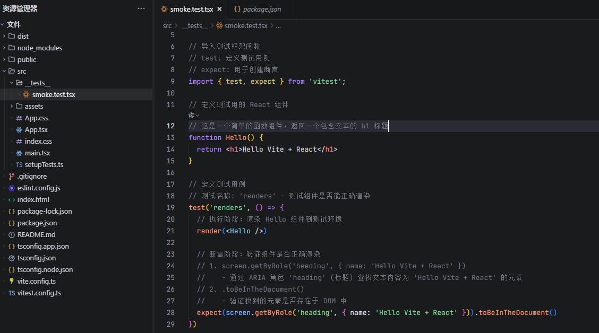
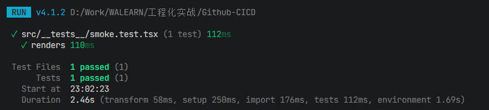
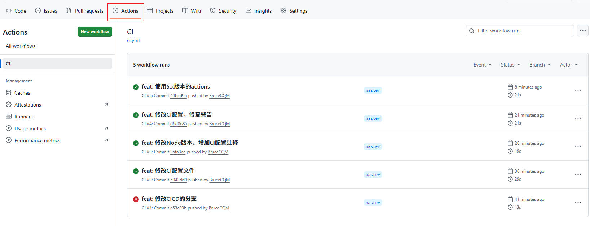

# GitHub Pages CI/CD 教程

“纯前端 Vite + React 项目”的 CI/CD。

- CI：在 GitHub Actions 上对 PR / main push 自动跑 lint + 单测 + build
- CD：main 分支 push 后，GitHub 通过 Webhook 通知你的服务器，由服务器执行拉代码、测试、构建与部署

## 1. 创建 Vite + React 项目

新建文件夹，执行命令。

```bash
npm create vite@latest . -- --template react-ts
```

- 点号代表「当前目录」。即不在新文件夹里生成，直接在你现在打开的这个文件夹创建项目
- 分隔符：告诉 npm 后面的参数直接传给 Vite，不是 npm 自己用
- `--template`：指定项目模板

完整含义：使用 npm 调用最新版 Vite 脚手架，在当前目录直接生成一个 React + TypeScript 模板项目。

创建后，要保证：

- `package.json` 存在
- `npm run build` 能跑通

## 2. 配置单元测试(Vitest + Testing Library)

安装依赖：

```bash
npm i -D vitest jsdom @testing-library/react @testing-library/jest-dom
```

4 个核心依赖作用：

- vitest: 现代化的 JavaScript/TypeScript 测试框架，基于 Vite 构建
- jsdom: 在 Node.js 环境中模拟完整的浏览器 DOM 环境
- @testing-library/react: 专门用于测试 React 组件的工具库
- @testing-library/jest-dom: 为 Vitest 提供 DOM 相关的匹配器。它提供了一些功能更强大，语法更简洁易懂的方法，对DOM对象进行相关的判断匹配

生成的 `vite.config.ts` 配置如下：

```ts
import { defineConfig } from 'vite'
import react from '@vitejs/plugin-react'

// https://vite.dev/config/
export default defineConfig({
  plugins: [react()],
})
```

项目根目录手动创建 `vitest.config.ts`:

```ts
import { defineConfig } from 'vitest/config'

export default defineConfig({
  test: {
    // 模拟浏览器环境，支持 DOM 操作
    environment: 'jsdom',
    // 加载测试初始化文件
    setupFiles: './src/setupTests.ts',
  },
})
```

src 目录下新增文件 `src/setupTests.ts`:

```ts
import '@testing-library/jest-dom/vitest'
```

`package.json` 的 `scripts` 保证有以下命令：

```json
"scripts": {
  "dev": "vite",
  "build": "tsc -b && vite build",
  "lint": "eslint .",
  "preview": "vite preview",
  "test": "vitest",
  "test:ci": "vitest run"
},
```

添加一个最小测试用例：`src/__tests__/smoke.test.tsx`

```tsx
// 导入测试工具
// render: 用于将 React 组件渲染到测试环境中
// screen: 提供查询渲染后 DOM 元素的方法
import { render, screen } from '@testing-library/react'

// 导入测试框架函数
// test: 定义测试用例
// expect: 用于创建断言
import { test, expect } from 'vitest';

// 定义测试用的 React 组件
// 这是一个简单的函数组件，返回一个包含文本的 h1 标题
function Hello() {
  return <h1>Hello Vite + React</h1>
}

// 定义测试用例
// 测试名称: 'renders' - 测试组件是否能正确渲染
test('renders', () => {
  // 执行阶段：渲染 Hello 组件到测试环境
  render(<Hello />)
  
  // 断言阶段：验证组件是否正确渲染
  // 1. screen.getByRole('heading', { name: 'Hello Vite + React' })
  //    - 通过 ARIA 角色 'heading' (标题) 查找文本内容为 'Hello Vite + React' 的元素
  // 2. .toBeInTheDocument()
  //    - 验证找到的元素是否存在于 DOM 中
  expect(screen.getByRole('heading', { name: 'Hello Vite + React' })).toBeInTheDocument()
})
```

初始化项目结构如下：



本地验证：

```bash
npm run test:ci
```

测试用例可以通过。



## 3. 配置 GitHub Actions 的 CI 文件

在根目录创建 CI 配置文件 `.github/workflows/ci.yml`，让 GitHub Actions 能够自动完成代码lint、测试test、构建build任务。

```yml
# 工作流名称
name: CI

# 触发条件
on:
  pull_request:  # 当有 PR 时触发
  push:          # 当有推送时触发
    branches: [master, main]  # 仅在 master 和 main 分支触发

# 权限设置
permissions:
  contents: read  # 只读权限

# 并发控制
concurrency:
  group: ci-${{ github.ref }}  # 并发组名
  cancel-in-progress: true     # 取消正在进行的相同任务

# 任务定义
jobs:
  vite_react:  # 任务名称
    # 指定 CI 工作流运行的操作系统环境，使用最新版本的 Ubuntu Linux 操作系统
    # 为整个 CI 工作流提供运行环境，确保所有命令和操作都在一致的系统环境中执行
    # Ubuntu 是 GitHub Actions 最常用的环境，因为它稳定且支持大多数开发工具
    runs-on: ubuntu-latest
    # env:
    #   FORCE_JAVASCRIPT_ACTIONS_TO_NODE24: true  # 强制使用 Node.js 24
    
    steps:  # 执行步骤
      # 将仓库中的代码文件复制到 CI 运行环境中
      - uses: actions/checkout@v5  # 检出代码（支持 Node.js 24）
      
      - uses: actions/setup-node@v5  # 设置 Node.js（支持 Node.js 24）
        with:  # 配置参数
          node-version: 24
          cache: npm
      
      # 执行命令
      - run: npm --version
      - run: npm ci  # 安装依赖（使用 package-lock.json 锁定版本）
      - run: npm run lint --if-present
      - run: npm run test:ci  # 运行测试
      - run: npm run build    # 构建项目
```

在 GitHub 上创建一个新的仓库，复制仓库地址。

本地项目初始化 git，并关联远程仓库推送代码。

```bash
git init

git add .

git commit -m 'feat: init'

git remote add origin xxxx

git push -u origin master
```

- `-U` 参数是 `--set-upstream` 的简写形式，用于设置上游分支。第一次推送本地分支到远程仓库时，会建立分支联系，后续执行 `git push` 就会自动匹配分支。

提交代码后，CI 就会自动执行。

