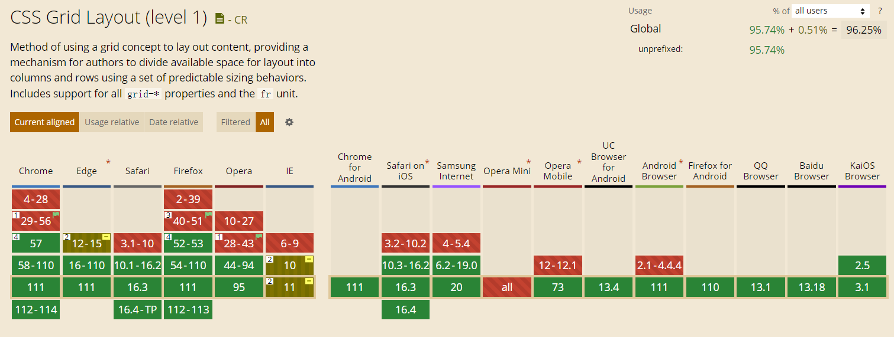

# grid 布局

:::warning grid 布局
最牛逼的 CSS 布局方式
:::

## grid 布局概述

`flex` 弹性布局是一维布局，`grid` 网格布局是二维布局。

开启方式：元素添加 `display: grid` 或 `display: inline-grid` 。

开启 `grid` 布局的元素，称为容器，其子元素变成容器成员，称为 `grid` 项目。

`grid` 布局原理：通过设置容器和项目的属性，来控制子盒子的位置和排列方式。

## grid 布局容器盒子常见属性

### display

创建 `grid` 布局容器。

| 属性值      | 含义               |
| ----------- | ------------------ |
| grid        | 容器元素为块级元素 |
| inline-grid | 容器元素为行内元素 |

### grid-template-columns & grid-template-rows

`grid-template-columns` 设置列宽，`grid-template-rows` 设置行高。用法类似，以前者为例进行说明。

#### 设置固定列宽行高

`grid-template-columns: 30px 40px 50px` 表示一共三列，列宽分别为 30px 40px 50px。

```css
.father {
  display: grid;
  /*  一共三列，列宽分别为 30px 40px 50px */
  grid-template-columns: 30px 40px 50px;
  /*  一共两行，行高分别为 30px 40px 50px  */
  grid-template-rows: 30px 40px 50px;
}
```

#### repeat()

见名知义，重复声明。

第一个参数为重复个数，第二个参数为宽度或高度。

`grid-template-columns: repeat(3, 50px)` 表示一共三列，列宽为 50px。

```css
.father {
  display: grid;
  /* grid-template-columns: 50px 50px 50px; */
  /* 一共三列，列宽为 50px */
  grid-template-columns: repeat(3, 50px);
  grid-template-rows: 30px 40px 50px;
}
```

#### auto-fill

尽可能填满每一行或每一列。只要网格容器够大，尽可能容纳更多单元格。

`grid-template-columns: repeat(auto-fill, 50px)` 表示每列宽度为 50px，数量不固定，每一行尽量容纳更多列。

```css
.father {
  display: grid;
  /* 每列宽度为 50px，数量不固定，每一行尽量容纳更多列 */
  grid-template-columns: repeat(auto-fill, 50px);
  /* 每行高度为 30px，数量不固定，每一列尽量容纳更多行 */
  grid-template-rows: repeat(auto-fill, 30px);
}
```

#### fr

`fr` 指明占容器剩余空间的份数，类似于 `flex` 布局的 `flex-grow` 属性。

`grid-template-columns: 30px 1fr 2fr` 表示第一列宽度为 30px，第二列和第三列分别占剩余宽度的 1/3、2/3

```css
.father {
  display: grid;
  /* 第一列宽度为 30px，第二列和第三列分别占剩余宽度的 1/3、2/3 */
  grid-template-columns: 30px 1fr 2fr;
}
```

#### minmax()

设置单元格最小和最大的宽度或高度。

```css
.father {
  display: grid;
  /* 最小 40px，但不能大于第二列宽度的 2 倍 */
  grid-template-columns: 30px 1fr minmax(40px, 2fr);
  /* 至少 120px，还有空余则一起等分 */
  grid-template-columns: repeat(auto-fill, minmax(120px, 1fr));
}
```

#### auto

由浏览器决定具体的宽度或高度。

```css
.father {
  display: grid;
  /* 第二列的宽度由浏览器决定 */
  grid-template-columns: 30px auto 40px;
}
```

### row-gap

设置行间距。

```css
.father {
  display: grid;
  row-gap: 10px;
}
```

### column-gap

设置列间距。

```css
.father {
  display: grid;
  column-gap: 14px;
}
```

### gap

`row-gap` 和 `column-gap` 的简写形式。

```css
.father {
  display: grid;
  /* 行间距 10px，列间距 20px */
  gap: 10px 20px;
}
```

### justify-content

设置单元格项目在网格容器里的水平排列方式，类似 `flex` 布局的 `justify-content` 属性。

| 属性值        | 含义                                               |
| ------------- | -------------------------------------------------- |
| start         | 从头开始                                           |
| end           | 从尾部开始                                         |
| center        | 水平居中                                           |
| space-around  | 平分剩余空间                                       |
| space-between | 两侧单元格贴边，再平分剩余空间                     |
| space-evenly  | 单元格之间等间距，且两侧单元格和容器也是相同的距离 |
| stretch       | 单元格没指定列宽，拉伸占满整行                     |

`space-around`、`space-between`、`space-evenly` 演示案例[图片](https://juejin.cn/post/6854573220306255880)：


### align-content

设置单元格项目在网格容器里的竖直方向的排列方式，类似 `flex` 布局的 `align-items` 属性。

属性值和 `justify-content` 相同。

### grid-auto-rows

设置除了 `grid-template-row` 定义的行以外的行的高度。

```css
.father {
  display: grid;
  /* 第一和第二行高度为 30px、40px */
  grid-template-rows: 30px 40px;
  /* 其他行的高度都为 60px */
  grid-auto-rows: 60px;
}
```

### grid-auto-columns

设置除了 `grid-template-columns` 定义的列以外的列的宽度。

```css
.father {
  display: grid;
  /* 第一和第二列宽度为 30px、40px */
  grid-template-columns: 30px 40px;
  /* 其他列的宽度都为 60px */
  grid-auto-columns: 60px;
}
```

## grid 布局兼容性


