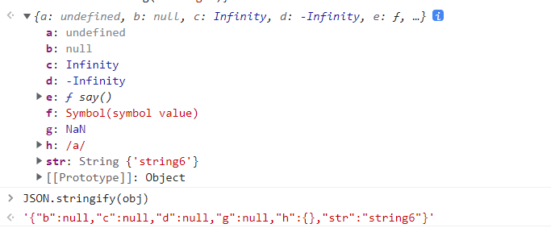

# 前端编程题

## debounce 防抖

防抖原理：连续触发事件，只有最后一次事件被触发 n 秒之后才会执行回调，是解决事件回调频繁调用的手段之一。

实现思路：

- 事件触发，设置定时器，在 n 秒之后调用回调
- 若 n 秒之内再次触发事件，则清空定时器并重新设置

注意事项：`this` 指向的修正、参数的正确传递。

```js
function debounce(func, wait) {
  let timeout = null;

  return function() {
    const context = this;
    const args = arguments;

    if (timeout) {
      clearTimeout(timeout);
      timeout = null;
    }

    timeout = setTimeout(function() {
      func.apply(context, args);
    }, wait)
  }
}
```

## throttle 节流

节流原理：连续触发事件，每隔 n 秒执行一次回调，解决事件回调频繁调用的手段之一。

实现思路：主要有两种，使用时间戳判断和定时器。

### 时间戳

主要流程：
- 一个变量 `now` 记录当前事件触发的时间戳，一个变量 `previous` 记录上一次触发的时间戳
- 事件触发，判断 `now` 与 `previous` 的差值是否大于时间间隔 `wait`。若大于则调用回调函数，并将 `previous` 更新为 `now` 的值
- 若 n 秒内再次触发事件，由于存在时间差节流阀，不会再次调用回调函数

```js
function throttle(func, wait) {
  let previous = 0;

  return function () {
    const context = this;
    const args = arguments;
    const now = +new Date();

    if (now - previous >= wait) {
      func.apply(context, args);
      previous = now;
    }
  };
}
```

### 定时器

主要流程：
- 事件触发，设置定时器，在 n 秒之后执行回调函数并清空定时器
- 若 n 秒内再次触发事件，不会做任何动作

```js
function throttle(func, wait) {
  let timer = null;

  return function () {
    const context = this;
    const args = arguments;
    if (!timer) {
      timer = setTimeout(() => {
        func.apply(context, args);
        clearTimeout(timer);
        timer = null;
      }, wait);
    }
  };
}
```

### 结合体

时间戳和定时器方式各有独特的效果：时间戳会在事件触发的时候立即执行一次回调函数，定时器方式会在停止触发事件之后再执行一次回调函数。

这就是 `lodash` 和 `underscore` 工具库 `throttle` 方法的 `leading` 和 `trailing` 配置参数。

[Lodash throttle](https://www.lodashjs.com/docs/lodash.throttle#_throttlefunc-wait0-options){link=card}

```js
function throttle(func, wait, option) {
  if (typeof option !== 'object') {
    option = {};
  }
  let previous = 0;
  let timer = null;
  const { leading, trailing } = option;

  const throttled = function () {
    const context = this;
    const args = arguments;
    const now = +new Date();
    if (previous === 0 && leading === false) {
      previous = now;
    }
    const remaining = wait - (now - previous);

    if (remaining <= 0) {
      // 若时间戳先执行了，清空定时器
      if (timer) {
        clearTimeout(timer);
        timer = null;
      }
      func.apply(context, args);
      previous = now;
      return;
    }
    if (!timer && trailing === true) {
      timer = setTimeout(() => {
        // 若定时器先执行了，更新previous时间
        previous = +new Date();
        func.apply(context, args);
        clearTimeout(timer);
        timer = null;
      }, remaining);
    }
  };

  return throttled;
}
```

注意，若时间戳先执行了，则要清空定时器，若定时器先执行了，则要更新previous时间。否则如果不断触发事件，会出现执行两次回调的情况。

## unique 去重

数组去重，经典中的经典。

### 双重循环

双重循环，最原始同时也是兼容性最好的版本。

```js
function unique1(arr) {
  const res = [];
  for(let i = 0;i < arr.length;i++) {
    // 注意这里用 var，否则下面的判断无法取到 j
    // 当然也可以在外层定义好
    for(var j = 0;j < res.length;j++) {
      if(arr[i] === res[j]) {
        break;
      }
    }
    if(j === res.length) {
      res.push(arr[i]);
    }
  }
  return res;
}
```

使用数组的 `indexOf` 方法，可以简化代码。

```js
function unique2(arr) {
  const res = [];
  for(let i = 0;i < arr.length;i++) {
    if(res.indexOf(arr[i]) === -1) {
      res.push(arr[i]);
    }
  }
  return res;
}
```

### `underscore` 版本

`underscore` 的去重方法主要有两个额外参数：`isSorted` 和 `iteratee`。

`isSorted` 参数标识待去重的数组是否已经排好序，如果是排序好的数组使用更快捷的方法（判断当前元素是否与前一个元素相同，相同即重复，只需一次遍历）进行去重。

`iteratee` 传递一个自定义函数，对于数组每一个元素，是对该函数处理后的返回值进行比较，达到自定义去重规则的效果。

```js
function unique3(arr, isSorted, iteratee) {
  const res = [];
  // 存储自定义函数处理后的值
  const dealValueArr = [];
  // 排序情况下的前一个值
  const previousValue = undefined;

  for(let i = 0;i < arr.length;i++) {
    const value = arr[i];
    const dealValue = iteratee ? iteratee(value) : value;

    if(isSorted) {
      // 若是第一个元素或者和前一个元素不相同
      if(i === 0 || value !== previousValue) {
        res.push(value);
      }
      previousValue = value;
    } else if(iteratee) {
      if(dealValueArr.indexOf(dealValue) === -1) {
        // 注意res压入的是原始数组的值，不是经自定义函数处理后的返回值
        res.push(value);
        dealValueArr.push(dealValue);
      }
    } else {
      if(res.indexOf(value) === -1) {
        res.push(value);
      }
    }
  }
  return res;
}
```

### Object 键值对

该方法的主要思路是：把数组元素作为 key 值存入一个对象里面，在判断一个元素是否重复时，只需要看对象是否存在这个元素的 key 值。

`typeof item + JSON.stringify(item)` 的处理是为了保证 key 值唯一。

```js
function unique4(arr) {
  const obj = {};
  return arr.filter(function(item, index, array) {
    const keyValue = typeof item + JSON.stringify(item);
    return obj.hasOwnProperty(keyValue) ? false : (obj[keyValue] = true)
  })
}
```

### 不能 JSON 序列化的特殊值

json 是独立于编程语言的数据存储和表示格式，也就是说它只能存储各个语言通用的东西，JavaScript 特有的一些值无法正确 JSON 序列化。



:::tip
如图，`undefined`、JS 方法、`Symbol` 类型值经过 `stringify()` 处理后都丢失了。

`Infinity`、`NaN` 和数字相关的特殊值转换成了 `null`。

正则表达式转换成了空对象 `{}`。
:::

### 利用 ES6 新特性

扩展运算符天下无双。

```js
function unique5(arr) {
  return [...new Set(arr)];
}
```
