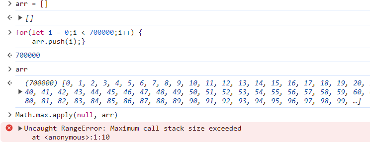

# JavaScript 碎碎念

## JS 函数参数长度限制

在不同的 JavaScript 引擎里，会有不同的函数参数长度限制。

如果传入大量参数，例如上万个参数，函数的调用结果是不确定的，这取决于引擎如何处理。

大部分引擎会抛出异常，但也可能有其它行为，没有规范要求各个引擎应该怎么做。



如果函数参数过多，可以分片分批处理。

```js
function minOfArray(arr) {
  let min = Infinity;
  const QUANTUM = 32768;

  for (let i = 0; i < arr.length; i += QUANTUM) {
    const submin = Math.min.apply(
      null,
      arr.slice(i, Math.min(i + QUANTUM, arr.length)),
    );
    min = Math.min(submin, min);
  }

  return min;
}

const min = minOfArray([5, 6, 2, 3, 7]);
```

[Function.prototype.apply()](https://developer.mozilla.org/zh-CN/docs/Web/JavaScript/Reference/Global_Objects/Function/apply){link=card}