# 性能优化专项学习

## 性能优化概述

开发困扰：

1. 对页面性能不够重视，导致用户体验不佳，出现崩溃、卡顿、白屏问题。
2. 不懂怎么分析页面性能瓶颈，无法进行针对性优化。
3. 不理解优化的原理，只能照搬资料，优化效果不佳，甚至是反效果。

性能优化对用户体验非常重要，对转化率提升具有重要意义，对业务提升具有重要价值，特别是低端机型。

系统掌握前端性能优化，为自己个人增值，提升自己开发页面的性能体验，提升自己负责业务的业务量。

## 性能指标

### 性能指标概述

性能是用户在页面加载和运行时的直观体验（感觉），但我们优化的时候，不能用感觉去衡量性能怎么样，必须要用可衡量的值去判断性能优化结果，这就是性能的指标。了解性能指标，可以给优化过程制定明确目标。

常见性能指标如下：

- 首屏时间（最常用）：页面以多快的速度加载和渲染元素到页面上。

- 加载后的响应时间：页面加载和执行 JS 代码后多久能响应用户交互。

- 视觉稳定时间：页面什么时候变稳定，变得不影响观看交互。

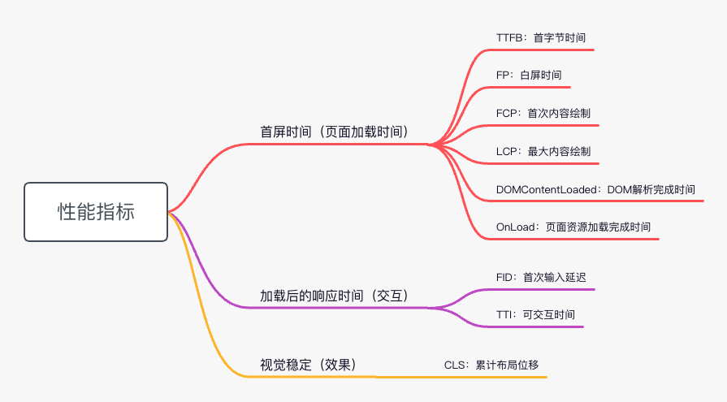

### 首屏时间

首屏时间最大程度决定了网页的用户体验，是性能中最关注的部分，首屏时间使用哪个指标衡量，目前没有固定的标准。

目前首屏时间常用的指标主要有 FMP 和 LCP。

|指标|含义|问题|
|--|--|--|
|FP:First Paint，首次绘制|白屏时间，它代表浏览器第一次向屏幕传输像素的时间，也就是页面在屏幕上首次发生视觉变化的时间|像素的改变不够直观，代表首屏时间过于单薄，不是用户关注的内容|
|FCP:First Contentful Paint，首次内容绘制|测量页面从开始加载到页面内容的任何部分在屏幕上完成渲染的时间|内容仅包括文本、图像（包括背景图像）、svg 元素或非白色的 canvas 元素，不一定是用户关注的真正内容。背景、loading|
|LCP:Largest Contentful Paint，最大内容绘制|测量页面开始加载到最大文本块内容或图片显示在页面中的时间|存在兼容性问题，低版本安卓和IOS不支持|
|FMP:First Meaningful Paint，首次有意义绘制|首次有意义的绘制，是页面主要内容出现在屏幕上的时间|什么是主要内容？目前尚无标准化的定义|
|DOMContentLoaded|当初始的 HTML 文档被完全加载和解析完成之后，DOMContentLoaded 事件被触发，而无需等待样式表、图像和子框架的完全加载|SPA 页面，index.html 加载完成后，DOMContentLoaded 即被触，但页面空白|
|OnLoad|当整个页面及所有依赖资源如样式表和图片都已完成加载时，将触发load事件|SPA 页面，index.html 加载完成后，OnLoad即被触发，但页面空白|

### 优化目标

性能指标目标：FMP或者LCP 指标在 P95 分位上达到 3.5S。也就是前 95% 的用户首屏时间需要在 3.5S 内。

从 2 个维度进行提升：

- 「真的快」：可以客观衡量的指标，像首屏时间、网页访问时间、交互响应时间、跳转页面时间。
- 「觉得快」：用户主观感知的性能，通过视觉引导等手段转移用户对等待时间的关注。

## 性能优化工具

每个业务工程都有其不同的地方，需要针对分析和优化。学会怎么分析性能瓶颈，这是性能优化的前提。从复杂系统中找到性能问题的关键所在，这是性能优化的第一步。

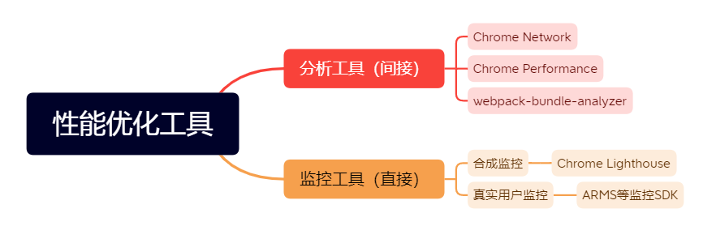

- 分析工具：一般都是本地对性能某一方面进行分析，比如打包情况、资源大小、请求顺序、JS执行情况等。

- 合成监控：一种模拟网页加载或者脚本运行来测量性能指标的方式，输出网页性能报告。这种方式的价值在于提前发现可能存在的性能问题，不依赖于用户上报。用于在本地开发时提前发现一些性能问题。单个样本，不全面。

- 真实用户监控：记录用户真实操作的一种被动监控，它的特点是记录真实用户在网页交互中的性能数据。反映用户使用的真实情况，和用户设备、网速、环境等息息相关。群体样本，客观全面。

### Chrome Network

Chrome 浏览器 F12 开发者工具中 Network 标签。

Chrome Network：显示网络资源加载耗时及顺序，能看到资源的名称、状态、使用的协议(http1/http2)、资源类型、资源大小、资源时间线等情况。

可以发现一些常见问题：某个 js 文件过大，成为性能瓶颈；接口请求存在依赖关系，串行请求；存在一些很琐碎的小文件，几百B的 js 文件。

### Chrome Performance

Chrome 浏览器 F12 开发者工具中 Performance 标签，可以观察页面渲染表现及JS执行情况。

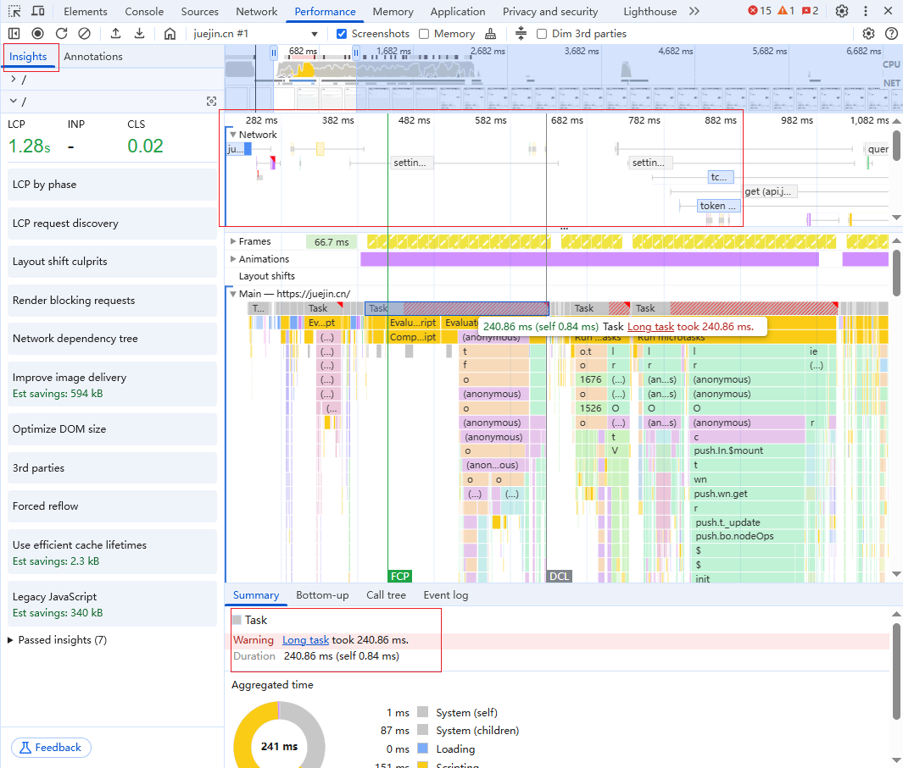

- 请求瀑布图：瀑布图的横轴是时间轴，瀑布图上有很多五颜六色的色块，不同颜色代表不同的资源。通过分析资源的顺序、请求分布和请求详情，得出一些优化结论。

- 主线程火焰图：分析具体函数耗时，面板中会有很多Task，如果是Long Task右上角会被标红，可选择放大查看具体耗时点。

- 详情饼图：用于展示各种类型任务的耗时占比，可以看出下载、执行、渲染、空闲等时间。

在左侧的 insights 面板里面，可以看到瓶颈和优化措施。

[Chrome Performance 页面性能分析指南](https://zhuanlan.zhihu.com/p/163474573){link=card}

### webpack-bunld-analyzer

以视图的方式显示 webpack 输出文件的大小，可视化帮我们分析打包体积和包的组成，让我们可以用针对性的分包合包构建策略优化我们的模块bundle。

分析步骤：

1. 查看哪个包比较大。

2. 分析包的组成，查看组成是否合理，是否能够缩小体积。

比如：vendor 把大部分 node_modules 的库都打包进来，体积太大，首屏不一定使用的也打包进来，任何依赖的改变也容易改变 hash 值，影响缓存，对首屏影响很大。

### Lighthouse

Lighthouse：是谷歌开发的合成测试工具(自动集成在devtools中) ，它既可以作为浏览器插件运行，也可以作为 cli 脚本，甚至以程序化的方式运行在你的 Node.js 代码中。它通过一系列的规则来对网页进行评估分析，最终给出一份评估报告。

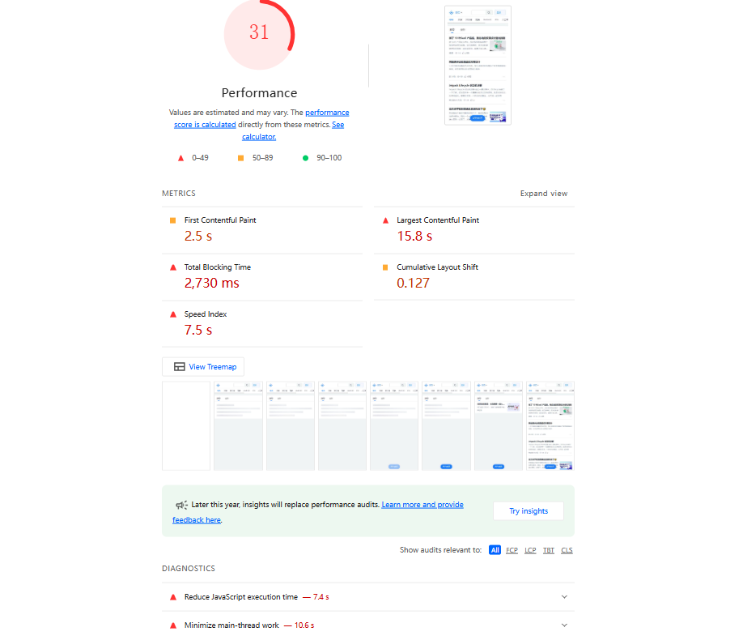

[前端性能测试工具 Lighthouse(灯塔)使用](https://juejin.cn/post/7220230543005253691){link=card}

[利用LightHouse进行合理的页面性能优化，看这一篇就够了！](https://blog.csdn.net/Zong_0915/article/details/131773108){link=card}

### ARMS 监控工具

ARMS监控工具：ARMS前端监控专注于对Web场景、Weex场景和小程序场景的监控，从页面打开速度（测速）、页面稳定性（JS诊断错误）和外部服务调用成功率（API）这三个方面监测Web和小程序页面的健康度。

## 性能优化概述

页面打开，是浏览器通过网络从服务器请求具有一定大小的资源，并且展示的过程。

性能优化可以归结为 3 类优化方向：

- 请求越快：加快请求。

- 资源越小：减小内容。

- 越早展示：提前渲染。

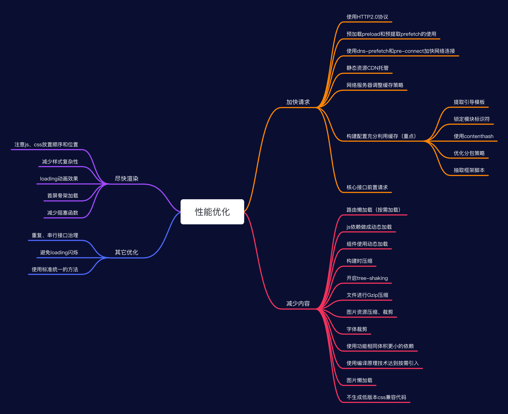

## 优化1：加快请求

### 使用HTTP2.0协议

HTTP2.0 协议的优化：

- 二进制分帧：采用二进制格式传输数据，解析更高效。

- 多路复用：同一个域名下只需要建立一个 HTTP 连接，单个连接可以承载任意数量的双向数据流。

- 头部压缩：对 HTTP 头采用 HPACK 进行压缩传输，节省流量；对于相同头信息，不重复发送。

使用HTTP1.1的效果--串行、阶梯式请求，同时发起请求少，一个接一个，慢。

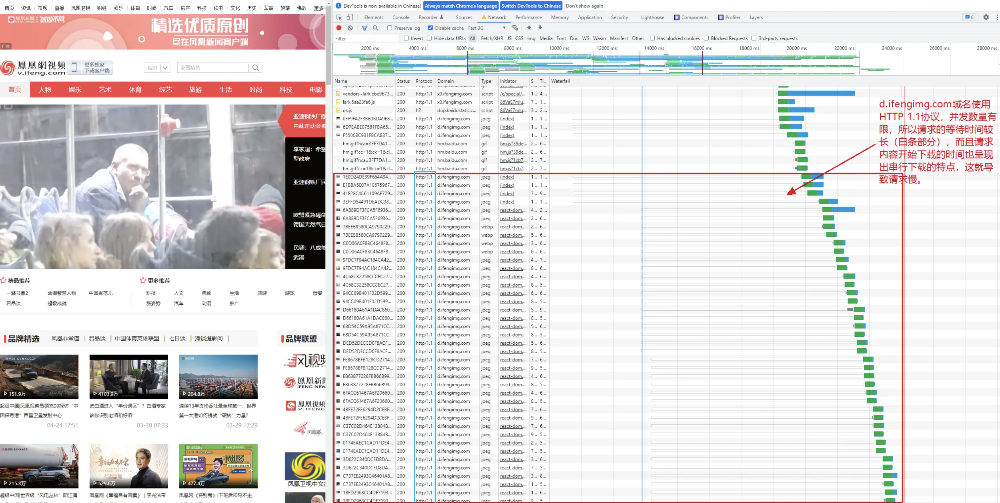

使用HTTP2.0的效--并发请求，同时发起的请求多，快。

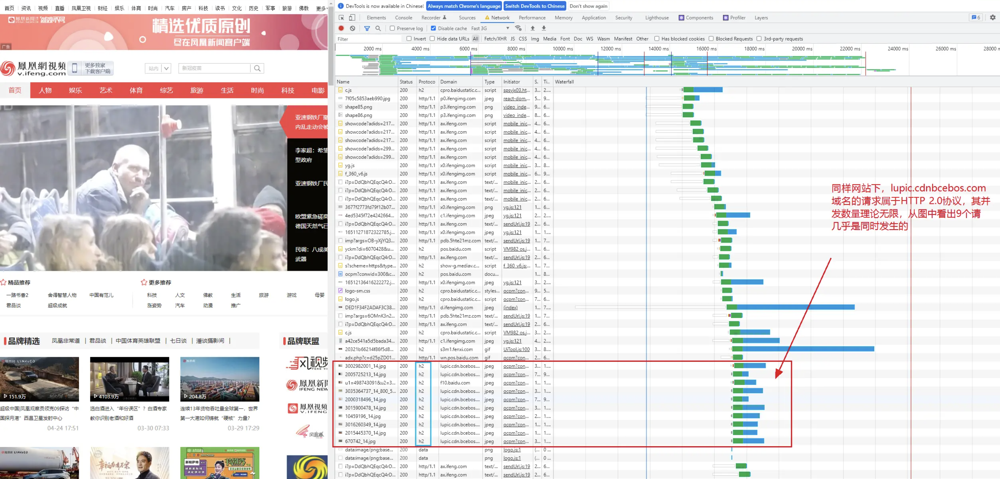

从 HTTP1.1 升级到 HTTP2.0 之后，首屏时间降低了 20% 左右，效果显著。

升级 HTTP2.0 需要 CDN 开启 HTTP2.0，NG 安装 HTTP2.0 插件。同时需要注意兼容性问题。

### 使用预加载preload和预提取prefetch

preload 是为了尽早加载首屏需要的关键资源（强制尽快），从而提升页面渲染性能(css,js,image,viedo,audio,fonts等等)，这个加载跟页面解析是并行的（与HTTP2.0使用），不会阻塞页面本身的加载。

prefetch 是在浏览器空闲的时候下载将来可能访问的资源，需要业务逻辑中进行判断做按需加载。目前前端业务基本用得少，有部分用了react-lodable 或者 component-lodable 的可以设置。

使用 Webpack 的 PreloadWebpackPlugin 插件，对关键资源进行预加载，提高页面加载速度，同时也可以对非关键资源进行预提取。

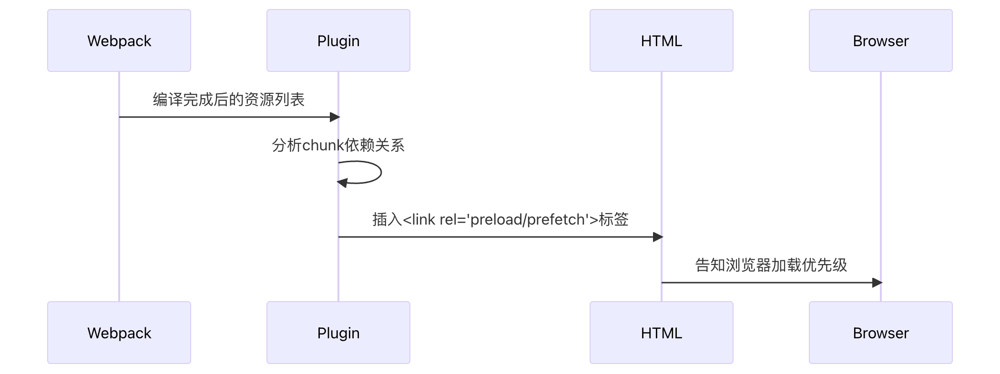

```js
module.exports = {
  plugins: [
    new PreloadWebpackPlugin({
      // 指定预加载
      rel: 'preload',
      // 对所有代码块进行预加载
      include: 'allChunks',
      // 黑名单，不处理
      fileBlacklist: [/\.map$/, /hot-update\.js$/, /runtime\..*\.js$/],
      // 白名单，优先级最高，若指定了白名单，只处理白名单的内容
      // 白名单指定关键的公共资源，如：chunk-vendors.js
      fileWhitelist: [/chunk-/]
    }),
  ]
}
```

:::warning 思考：对公共的bundle，preload是否对性能一定有提升？
一般情况下有提升。preload 资源是提前加载，公共的 bundle 是业务页面必须加载的，使用 preload 能充分利用 html 解析、index.js 加载解析的时间提前加载，提升首屏显示。

但是，如果 index.js 中有前置请求接口，那 preload 资源可能会把前置请求接口挤掉，让你前置请求失效。因为在某些浏览器内核，preload 资源是最高优先级。

比如，A 页面的性能瓶颈其实是某个接口，因为 preload 资源导致前置接口请求没有提前。大部分时候，页面的 js、css 都能击中缓存，preload 资源节约的时间比不上提前请求接口的时间。

因此，此时不要对公共 bundle 进行 preload，从而让接口能够提前发起，更能优化性能。

但需要注意，部分浏览器内核可能对请求数量有限制，所以这么设置后，可能前置请求和 bundle 也不是并发的。甚至在某些低端机型中，就算 bundle 不设置 preload，它也会在接口请求之前加载。

所以说，同一个优化措施，对不同模块效果不一样，甚至不同浏览器内核效果都不一样，优化措施要对比论证、客观分析。

没有一招打遍天下的措施。
:::

### 使用dns-prefetch和preconnect加快网络连接

DNS 解析也是开销，通常浏览器查找一个给定域名的 IP 地址要花费 20~120 毫秒，在完成域名解析之前，浏览器不能从服务器加载到任何东西。

那么如何减少域名解析时间，加快页面加载速度呢？可以对业务项目的主要的域名进行 dns 预解析。同理可以对 tcp 进行预连接。

```html
<link rel="dns-prefetch" href="https://example.com">
<link rel="preconnect" href="https://fonts.googleapis.com">
```

|特性|preconnect|dns-prefetch|
|--|--|--|
|优化阶段|	提前建立连接（TCP + TLS）|	提前解析 DNS|
|资源消耗|	相对较高（涉及 TCP 和 TLS 过程）|	相对较低（仅 DNS 解析）|
|适用场景|	明确关键跨域资源的域名，追求极致连接速度	|不确定具体资源或有多个潜在域名，先优化 DNS 解析|
|优先级|	较高（对关键资源效果显著）|	较低（作为基础优化手段）|

最佳实践建议

- 组合使用：对于一些非常关键的跨域资源域名，可以同时使用 preconnect 和 dns-prefetch，先通过 dns-prefetch 解析 DNS，再用 preconnect 建立连接（不过要注意浏览器对连接数量等的限制，避免过度优化导致问题）。

- 按需添加：不要滥用，只对真正会用到的、对性能有重要影响的域名使用，避免不必要的资源浪费（如浏览器连接数占用、DNS 解析请求过多等）。

- 监测效果：可以使用浏览器的开发者工具（如 Chrome 的 Lighthouse 审计、Network 面板等）来观察使用这些属性后资源加载性能的变化，评估优化效果。

### 静态资源CDN托管

CDN 的全称是 Content Delivery Network，即内容分发网络。CDN 服务商将源站的资源缓存到遍布全国的高性能加速节点上，当用户访问相应的业务资源时，用户会被调度至最接近的节点最近的节点 ip 返回给用户，使内容能够传输的更快，更加稳定。可以提升首次请求的响应能力。

CDN作为静态资源文件的分发，做好静态资源的缓存工作，就能加快网站的加载速度，比如前端文件、图片、JS脚本等。公司购买的云服务，本身就有CDN 的服务。

### 网络服务器调整缓存策略

- css、js、图片文件，通过webpack构建之后，文件名全部加上了hash，只要文件内容变化，文件名一定会变化，因此这部分文件为充分利用缓存，设置超长缓存（比如半年、一年）来提升页面性能。

- html文件（一般是工程的首页代码）由于无法添加hash，为避免发版之后长时间才更新文件，只能设置短时间（比如10分钟）短缓存，在一定程度上利用缓存。

- 有些文件名不会更新的JS文件、css文件，比如 `no-change-script.js`，就算发版了，文件名也不会变化。针对此类文件可以约定文件名 `.cc` 结尾，nginx 中设定 `.cc` 结尾的文件名设置为十分钟短缓存，避免无法更新文件。

### 构建配置充分利用缓存

充分利用缓存，减少重复资源的请求。要求项目与项目间公共的资源尽量能复用，每次打包的 bundle 尽量不变。主要是从构建配置上面进行处理。

#### 1. 提取引导模板(extracting boilerplate)

在 Webpack 中，"提取引导模板" (extracting boilerplate) 是指将 Webpack 的运行时代码(runtime) 和模块管理逻辑从主应用程序代码中分离出来。目的是提升长期缓存效率和应用加载性能。

runtime 指的是 webpack 的运行环境(具体作用就是模块解析、加载) 和 模块信息清单, 模块信息清单在每次有模块变更(hash 变更)时都会变更，比如页面新引一个组件，runtime chunk就会改变。

如果runtime chunk不单独拿出来，就会放到 `index.hash.js` bundle中，每次改变业务代码，会改变 `index.hash.js` 文件(首页必须)，缓存就失效了，导致每次发版都要重新请求 `index.hash.js` 文件，无法利用缓存。

设置runtimeChunk之后，webpack就会生成一个个 `runtime~xxx.js` 的文件。将 runtime 文件独立抽出来后，依赖的加载一般不影响 app.js bundle了（除非修改了 app.jsx）。

一般来说，**runtime bundle 都非常小，单独发送请求并不划算**。因为重新发版后 index.html 必须更新（里面bundle和版本号改变，且设置了 5min 缓存时间），所以把 runtime 集成到 index.html 入口文件是个巧妙的处理方式。通过 script-ext-html-webpack-plugin 实现。

```js
module.exports = {
  optimization: {
    runtimeChunk: 'single',
  },
  plugins: [
    new ScriptExtHtmlWebpackPlugin({
      inline: /runtime\..*\.js$/, // 匹配 runtime 文件名
    }),
    new PreloadWebpackPlugin({
      rel: 'preload',
      fileBlacklist: [/runtime\..*\.js$/], // 要从 preload 剔除 runtime 文件
    }),
  ]
}
```

#### 2. 避免module id和chunk id以默认的方式自增，锁定模块标识符

这一点不太理解。

module 就是没有被编译之前的代码，通过 webpack 的根据文件引用关系生成 chunk 文件，webpack 处理好 chunk 文件后，生成运行在浏览器中的代码 bundle。

一个module id是一个模块的唯一标识符，module的改变会引起chunk的改变，最终引起bundle的改变，这是一个连锁反应。需要尽量避免module的大规模改变。

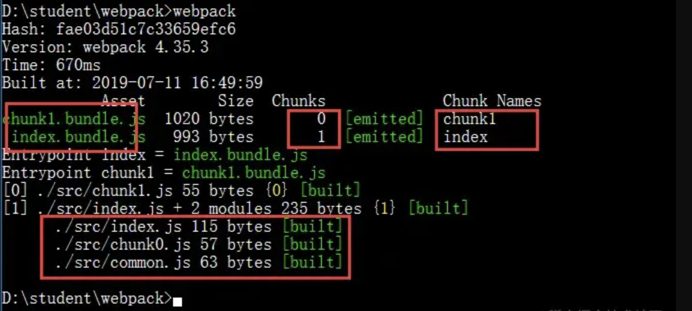

问题：如果不显式设置，默认module id是一个数值，其他module id以自增的方式依次用数字命名，模块的增加和减少，代码的改动，都会批量改变module id的值，最终引起大部分bundle文件名的改变。可能就会出现，改了几行代码，整个模块所有文件缓存都会失效的情况。

解决：要使用唯一的标记替换module id，让module id不再以自增的方式改变，用hash替代，与文件内容相关。只有代码改变的module被重新打包，其他无关的bundle名字不变。

```js
optimization: {
  runtimeChunk: 'single',
  moduleIds: 'hashed',
  namedChunks: true,
}
```

#### 3. 使用contenthash避免jsx、图片、css的改变带来的变化

filename：对应于 entry 里面生成出来的文件名。

chunkFilename：chunkFilename 就是未被列在 entry 中，但有些场景需要被打包出来的文件命名配置。比如按需加载（异步）模块的时候。

原来使用 hash 命名，每次构建都容易引起整个项目页面 bundle 的改变。所以调整成使用 contenthash。不同值的含义:

- hash：计算与整个项目的构建相关；
- chunkhash：计算与同一 chunk 内容相关；
- contenthash：计算与文件内容本身相关。

```js
output: {
  filename: '[name].[hash:8].js',
  chunkFilename: '[name].[contenthash:8].js'
},
imageUrlLoaderOption: {
  limit: 1, // 所有image都不转换为base64
  name: 'static/images/[name].[contenthash:8].[ext]'
},
miniCssExtractPluginOption: {
  filename: 'css/[name].[contenthash:8].css',
  chunkFilename: 'css/[name].[contenthash:8].css'
},
```

#### 4. 修改optimization.splitChunks 配置，优化分包策略

充分利用缓存，减少重复资源的请求。这就要求项目与项目间公共的资源尽量能复用，以及每次发版打包的 bundle 尽量不变。主要是从构建上面进行处理，策略原则：

- 不变的依赖尽量一起打包，利用缓存，减少HTTP请求次数。比如 mobx-h5、swiper 等几乎不变的三方包。

- 相关的依赖尽量一起打包，降低依赖批量变化带来的影响。比如和人脸识别相关的依赖一起打包。

- 合并体积小的 chunk 文件，像几KB甚至几B的文件。小文件的请求开销比下载时间更久，因为网络下载速度是逐步爬升的，需要充分利用提升后稳定的网速，50KB的文件和100KB的时间差距可能只有0.2倍。

- 不要让某个文件成为瓶颈，避免单个文件体积过大，拖慢页面加载速度，尽量让多个大小均匀的包并发请求，较多的请求数更能抢占网速。一个包最多在100KB。当然前提是，使用二零HTTP2.0，并发请求没有限制的情况下，否则在HTTP 1.1的情况下，不拆包更合理，因为拆包多请求可能会更慢。

```js
splitChunks: {
  cacheGroups: {
    // 调试组件单独打包
    vconsole: {
      test: /[\\/]node_modules[\\/]vconsole[\\/]dist.*/,
      name: 'vconsole',
      chunks: 'all',
      minChunks: 1,
      priority: 1000,
    },
    fixed: {
      // 很少变化的依赖
      test: /[\\/]node_modules[\\/](mobx-h5|mobx-common|async-await)|swiper)[\\/]/,
      name: 'bundle-fixed',
      chunks: 'all',
      priority: 900,
      reuseExistingChunk: true
    },
    ui: {
      // UI组件库
      test: /[\\/]node_modules[\\/](UI)/,
      name: 'bundle-ui',
      chunks: 'all',
      minChunks: 2,
      priority: 850,
      reuseExistingChunk: true
    },
    face: {
      // 人脸识别相关包
      test: /[\\/]node_modules[\\/](face)/,
      name: 'bundle-face',
      chunks: 'all',
      priority: 800,
      reuseExistingChunk: true
    },
    common: {
      // 其它第三方包
      test: /[\\/]node_modules[\\/]/,
      name: 'bundle-common',
      chunks: 'all',
      minChunks: 2,
      priority: 500,
      reuseExistingChunk: true
    },
    commontemp: {
      // temp打入bundle-temp中，避免index.xx.js过大以及减少请求
      test: /[\\.]temp/,
      name: 'bundle-temp',
      chunks: 'all',
      minChunks: 2,
      priority: 400,
      reuseExistingChunk: true
    },
    mergeChunkCss: {
      // 合并零碎的css小文件
      test: /[\\/]node_modules[\\/].*\.(sc|c|sa|le)ss$/,
      name: 'bundle-common',
      chunks: 'all',
      minChunks: 2,
      priority: 1000,
      reuseExistingChunk: true,
      minSize: 0
    },
  }
}
```

#### 5. 抽取业务框架的代码成独立脚本

把各个业务模块，都需要使用的重复代码抽离成独立的js脚本，不同项目通过脚本引入的方式进行引用。

不同业务项目跳转时，由于页面缓存的存在，重复的依赖不需要再次下载，节约网络开销，加快了页面打开的速度。

```html
<!-- index.html -->
<link rel="preload" as="script" href="./common.js">
```

### 核心接口前置请求

核心接口前置到 app.xxx.js 中请求，让接口请求和 chunk-xx.hash.js 等资源请求并发，尽快加快请求速度。数据存储在全局变量中，进一步减低请求次数。

也就是让核心的接口在执行 app.xxx.js 的时候就发起请求，尽可能提前。

```js
// app.jsx
// 核心接口前置请求
requestOne();
class App extends Component {}
```

## 优化2：减少请求内容

### 路由懒加载（动态加载）

单页应用可通过前端路由动态按需加载 page 页面，这是 Taro 编译配置默认提供的能力。

实现前提：ES6 的动态地加载模块，import()。

调用 import() 之处，被请求的模块和它引用的所有子模块，会分离到一个单独的 chunk 中。

```js
render() {
  return <Router
    routes={[
      {
        path: '/pages/index/index',
        componentLoader: () => import( /* webpackChunkName: "index" */ './pages/index/index'),
        isIndex: true,
      },
      {
        path: '/pages/detail/detail',
        componentLoader: () => import( /* webpackChunkName: "detail" */ './pages/detail/detail'),
        isIndex: false,
      }
      ...
    ]}
  />
}
```

### JS依赖做成动态加载（require实现）

对于一些 js 的 sdk 文件，不同渠道需要的 SDK 不同。微信渠道需要的是微信渠道的 SDK，支付宝生活号需要 alipay 的 sdk，可以做成动态按需加载。

```js
function getSDK() {
  let channel = '';
  if (isWechat()) {
    channel = 'wechat';
  } else if (isAlipay()) {
    channel = 'alipay';
  }
  return require(`./lib/${channel}/js-sdk.js`).default;
}
```

比如原来某个页面通过 import 使用了 pdfh5 这个依赖，差不多1M大小，如果没有做特殊的处理，会构建的时候被直接被进vendor bundle中，必定会影响首页的加载。

但只有个别页面需要这个依赖包，这个页面流程不一定被触发，所以使用 require 做成动态加载对其他页面来说更加合理。

```js
let pdfh5 = null;
if (process.env.NODE_ENV === 'h5') {
  pdfh5 = require('pdfh5');
  require('pdfh5/css/pdfh5.css');
}
```

### 组件做成动态加载

taro 1.x 并不支持动态 import 组件，所以无法使用类 react 的动态 import。但可以使用第三方库 `react-loadable` 和 `@loadable/component`。

一般来说，非首屏的依赖组件可以动态加载。动态加载的组件通常可以设置为 prefetch，让浏览器闲时加载。

```js
import Loadable from 'react-loadable';

const loading = () => null;
const MyComponentLazy = isH5 ? Loadable({ loader: () => import(/* webpackChunkName: "lazy_comp" */ /* webpackPrefetch: true */ './my-component'), loading}) : null;
```

### 代码压缩

- 配置 Csso 插件对 CSS 文件进行压缩
- HtmlWebpackPlugin 压缩 Html 文件
- 配置 terser-webpack-plugin 插件对 JS 文件进行压缩

### 开启Tree-shaking

构建时，打掉依赖中没有被引用的代码。由于项目中使用了 Babel，Babel 的预案（preset）默认会将任何模块类型都转译成 CommonJS 类型，为了 tree shaking 可以生效，需要给 babel 配置设置 `modules： false`，否则 treeshaking 不会生效。

```json
// .babelrc
{
  "presets": [
    [
      "env",
      {
        "modules": false
      }
    ]
  ]
}
```

注意：export default 通常导出的是一个对象，「无法通过静态分析判断出一个对象的哪些变量未被使用，所以 tree-shaking 只对使用 export 导出的变量生效」，所以一般建议不用 export default。

默认导出通常导出一个对象/函数，Tree-shaking 难以判断其内部哪些属性未被使用；而命名导出可精确识别未使用的独立成员。

```js
// utils.js（默认导出对象，无法摇掉未使用的方法）
export default {
  add: (a, b) => a + b,
  unused: () => '未使用的方法' // Tree-shaking 无法移除！
};

// 导入（只能整体导入，无法单独导入 add）
import utils from './utils';
utils.add(1, 2); // 虽然只用到 add，但 unused 仍会被打包
```

```js
// utils.js（命名导出独立方法）
export const add = (a, b) => a + b;
export const unused = () => '未使用的方法'; // 未被导入，会被 Tree-shaking 移除

// 导入（只导入需要的成员）
import { add } from './utils'; // 仅 add 会被打包，unused 被摇掉
add(1, 2);
```

### 文件进行Gzip压缩

Gzip 是一种数据的压缩格式，或者说是一种文件格式。服务器对文件进行 gzip 压缩后，再进行传输，浏览器收到资源后再解压的过程，达到减少网络实际传输数据的大小的目的。Gzip 压缩通常能减少2/3的体积，这对性能提升非常可观。

需要让资源服务器在 Content-Encoding 指定gzip，并返回 gzip 文件，运维配置。

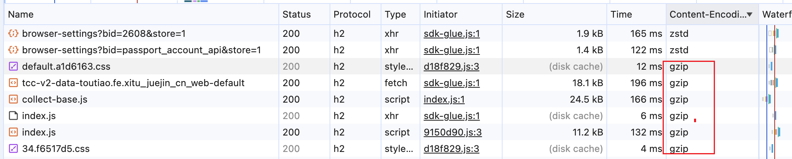

### 图片资源压缩裁剪

对项目自带图片，可以通过
https://tinypng.com/ 手工压缩大小，一般来说，对图片的压缩效果都在50%以上。除了通过在线网站手动压缩，也可以通过配置 image-webpack-loader 插件进行自动化压缩。

```js
module.exports = {
  module: {
    rules: [
      {
        test: /\.(png|jpe?g|gif)$/,
        use: [
          {
            loader: 'image-webpack-loader',
            options: {
              disable: process.env.NODE_ENV === 'development',
              // 调试模式下跳过压缩
              bypassOnDebug: true,
              // 启用渐进式JPEG，图片会逐步显示
              mozjpeg: {
                progressive: true
              },
              optipng: {
                // 禁用 optipng 压缩
                enabled: false
              },
              pngquant: {
                // 压缩质量范围：65%-90%
                quality: [0.65, 0.9],
                // 压缩速度等级（1-11，4是平衡点）
                speed: 4
              },
              gifsicle: {
                // 优化等级（1-3，3是最高级别）
                optimizationLevel: 3,
                // 颜色数量限制为32色
                colors: 32
              }
            }
          }
        ]
      }
    ]
  }
}
```

对在线图片，比如配置的图片，部分图片过大，导致页面展示效果不好，为解决该问题，对在线图片进行代理请求，先请求到 picasso.com 服务器，由该服务器对图片进行压缩处理再返回，提高图片打开速度，而且后续再请求，存在缓存。

### 字体裁剪

设计稿中的特殊字体，直接引入改字体的字体库 `.ttf` 文件，字体文件通常都会有几 M 大小，加载速度很慢，体验会十分不好。

font-spider 是一个用于压缩网页字体文件的工具，它会搜索当前页面所有使用 @font-face 的字体，然后执行 font-spider 压缩的时候，将字体包中没用用到的文字全部排除，只留下要使用的部分文字已达到压缩的目的。

```css
@font-face {
  font-family: 'icon-font';
  src: url("./static/iconBold.ttf");
}
```

### 使用功能相同但体积更小的依赖

Moment.js 是一个大而全的 JS 时间库，虽然很大地方便了我们处理日期和时间。但时间久远，设计陈旧，导致 Moment.js 体积太大了(200k+)，可能一般项目也只使用到了几个常用的API，而 tree shaking 对 Moment 无效。

可以使用 dayjs 替代moment，dayjs 实现了 moment 的大多数功能，Api 基本一致，压缩后体积却不到 2k，是优秀的替代方案，且多数情况下，dayjs 可以完美的替代。实际上，moment 官方也推荐使用其他工具替换。

### 使用编译原理技术达到按需引入

原来 UI 组件库的 CSS 文件会被全部打包进来，但实际上，我们并非使用全部组件，所以有部分组件的样式是不需要的。

可以通过编译原理去分析代码，分析代码总共调用了哪些组件（按照一定的规则去匹配），然后把这部分组件的样式按需引入进来。

```js
import { parse } from '@babel/parser';
import traverse from '@babel/traverse';

function getComponents(pathList: Array<string>, UIName: string) {
  pathList.forEach((fPath) => {
    const data = fs.readFileSync(fPath, 'utf-8');
    let ast: any = '';
    try {
      ast = parse(data, {
        sourceType: 'module',
        plugins: ['decorators-legacy', 'jsx', 'typescript', 'classProperties']
      });
    } catch (parseError) {
      console.log(`${fPath}语法分析出错`);
    }
    if (!ast) return;
    traverse(ast, {
      ImportDeclaration: (obj) => {
        const { node } = obj;
        const { value } = obj.node.source;
        if (value.indexOf(`/${UIName}`) > -1) {
          node.specifiers.forEach((spec) => {
            const { name } = (spec as any).imported;
            // addUseToFile(`${fPath}中使用了${name}组件`);
            if (!componentSet.has(name)) {
              componentSet.add(name);
              const cssFileName = transformComponentName2CssName(name, UIName);
              const cssTruePath = getComponentCssTruePath(cssFileName, UIName);
              const cssExists = fs.existsSync(cssTruePath);
              if (cssExists) {
                const cssPath = getComponentCssPath(cssFileName, UIName);
                addCSSToFile(UIName, name, cssPath);
              } else {
                console.log(`${UIName}:${name}组件没有CSS文件,请检查改组件是否无CSS文件或者CSS文件命名是否规范`);
              }
            }
          });
        }
      }
    });
  });
}
```

工作流程示例：

假设有一个文件包含以下代码：

```js
import { Button, Modal, Input } from 'eui';
```

1. parse 将代码解析成AST树形结构
2. traverse 遍历AST，找到 ImportDeclaration 节点
3. 检测到导入来源包含 /eui
4. 提取组件名：['Button', 'Modal', 'Input']
5. 为每个组件生成对应的CSS路径：
- Button → button.scss
- Modal → modal.scss
- Input → input.scss
6. 将CSS导入语句添加到 app.scss 文件中

最终在 app.scss 文件中，自动添加样式：

```scss
@import '~eui/dist/style/components/button.scss';
@import '~eui/dist/style/components/modal.scss';
@import '~eui/dist/style/components/input.scss';
```

### 图片懒加载技术

页面启动只加载首屏的图片，这样能明显减少了服务器的压力和流量，也能够减小浏览器的负担。

如果页面上所有的图片都需要加载，由于图片数目较大，等待时间很长这就严重影响用户体验。

一般通过 IntersectionObserver 监听视口的方式，先用占位图显示图片，如果监听到视口到达了目标区，则使用JS下载图片并显示。

### 设置postcss配置，不生成低版本css兼容代码

```js
module: {
  postcss: {
    autoprefixer: {
      enable: true,
      config: {
        browsers: ['Android >= 5', 'ios >= 12']
      }
    }
  }
}
```

## 优化3：尽快渲染

1. 外链 CSS 放在 head，js 脚本放在底部。

2. 使用 flexbox，与传统盒子模型相比，更简洁、而且渲染更快。

3. 减少样式复杂性和计算的范围，使用 BEM。

比如：`.box:nth-last-child(-n+1) .title {  /* styles */ }`。先询问是否有title类，其父元素恰好是负第 N 个子元素加上 1 个带 box 类的元素？需要大量计算。

更好的样式选择器，直接设置类名，更快寻找。

`.box:nth-last-child(-n+1) .title {  /* styles */ }  ==>  .box__title--last-child {  /* styles */ } `

4. 增加 loding 动画效果，提前显示动画，降低用户白屏感受时间。

5. 首屏骨架加载：显示页面大致结构，缩短白屏时间，让页面看起来快。页面真正显示之前会有个大致内容闪烁，让客户觉得页面已经在显示中，转移用户对时间的关注，降低用户焦虑。

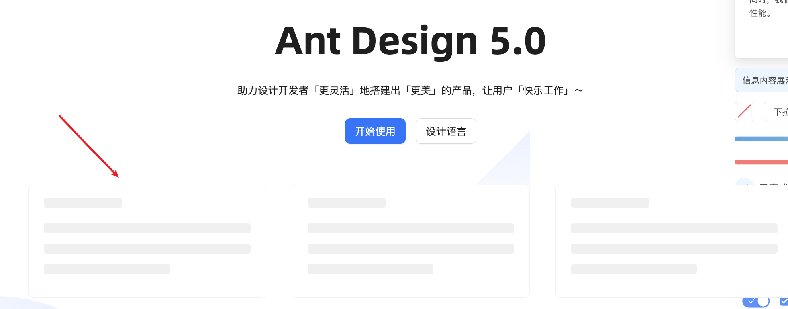

6. 减少阻塞函数，对主流程的依赖进行解耦。

比如首页依赖某些运营事件触发完，才去触发主流程的产品筛选等流程，最终才能显示页面。这样就会导致主流程被阻塞，从而导致页面加载变慢。

因此，应该要把主流程和其它事件解耦，避免其它事件对主流程的阻塞，让主流程和其它事件同时进行。

另外，还有一些接口依赖的问题，比如主流程的某个接口调用要等上一个接口调用完成（await）才开始。这种滥用的接口串行请求是否真的必须？真的存在强依赖关系吗？如果并不是必要的完全可以让主流程接口提前请求，而不是非要等待某个接口请求完成。

## 其它优化

1. 减少串行接口请求，合并相同接口请求。

2. 首页背景颜色固定灰色，避免背景颜色（默认白色）切换。

3. 杜绝非页面，脚本发起的请求开启 loading，也就是不让 loading 闪烁，提升客户感官。

4. 使用平台组封装的标准、统一api，删除各业务自己开发的 api，比如fetch，减少业务代码。

## 案例分析1-前置请求没有生效

在 app.jsx 文件里，前置的用户相关接口请求没有生效。按理想情况，前置的接口请求应该要和 chunk-xxx.js/css 这些包一块并发请求的，但实际情况是，接口请求在包请求之后。

```jsx
requestOne();

class App extends Component {}
Taro.render(<App />, document.getElementById('app'));
```

去询问 AI，提供下思路：

> 在一个taro1.x的spa工程中，我在 `app.[hash].js` 中发起接口请求，但从 performance 面板发现，接口请求是在其他 chunkjs 加载完成后才会发起，而不是在 `app.[hash].js` 执行到请求接口的时候发起，按道理来说请求的线程和 js 执行线程不同，不需要等待所有chunk加载完成才发起请求。

AI 提供的排查思路：

1. 如果 fetchData() 中包含依赖其他 Chunk 的代码(如需要某个模块的变量)，可能会因 Chunk 未加载完成而触发动态导入的等待，导致请求延迟。

从 webpack-bundle-analyzer 可以分析看到，前置请求函数 requestOne，所有依赖相关的模块代码，都被打入了 app.xx.js 中。使用的 API 也来自于公共框架线上脚本，所以理论上来说，它并不需要依赖其他公共的 chunk，所以并不是因为依赖才导致接口请求被滞后。

2. 浏览器并发连接限制：同一域名下同时请求数量有限。

已经使用了 HTTP2.0，请求数量限制不会那么少。

3. 主线程繁忙：虽然网络请求由浏览器内核处理，但回调函数需要等待主线程空闲。

不会是这个原因，app.js 执行是最高线程，而且请求线程和主线程并不冲突。

4. 请求优先级：浏览器会优先加载 CSS/JS 等阻塞渲染的资源。

可能和这个有关系，目前看来是设置了 preload 的资源先加载了，阻塞了接口请求。

继续分析第 4 个原因。询问 AI：preload 的脚本会阻塞 app.hash.js 里的接口请求吗？

> 2.浏览器优先级调度(间接阻塞)
> 
> 原理: preload 的资源被标记为最高优先级，浏览器会优先下载它们。若接口请求与 preload 资源同时触发，请求可能被降级，导致延迟。
> 
> 验证方法: 使用 Chrome DevTools 的 Performance 面板观察网络瀑布图，检査 preload 资源与接口请求的时间线。

看来就是 preload 资源导致的，去修改 webpack 配置。

```js
// 原来的配置：所有chunk都加上preload
module.exports = {
  plugins: [
    new PreloadWebpackPlugin({
      rel: 'preload',
      include: 'allChunks',
      fileBlacklist: [/runtime\./,/\.map$/, /vconsole\./],
    })
  ]
}

// 修改后的配置：只在初始加载的资源加上preload
module.exports = {
  plugins: [
    new PreloadWebpackPlugin({
      rel: 'preload',
      include: 'initial', // 只包含初始加载的资源
      fileBlacklist: [/runtime\./],
    })
  ]
}
```

修改完之后，接口请求和其它 chunk 并发请求了。