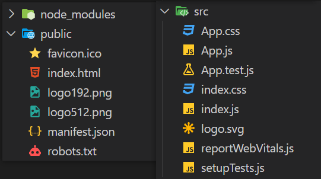

# React 脚手架

## 创建 React 项目

- 全局安装 React 脚手架：`npm i -g create-react-app`
- 创建项目：`create-react-app 项目名称`
- 进入文件夹：`cd 项目名称`
- 启动项目：`npm start`

上述方式已经过时，改用下方命令。详见[官方说明](https://create-react-app.dev/docs/getting-started)。

```shell
npx create-react-app my-app
cd my-app
npm start
```

## React 脚手架项目结构

`public` ：静态资源文件

- `manifest.json` ：应用加壳（把网页变成安卓/IOS 软件）的配置文件
- `robots.txt` ：爬虫协议文件

`src` ：源码文件

- `App.test.js` ：用于给 `App` 组件做测试，一般不用
- `index.js` ：入口文件
- `reportWebVitals.js` ：页面性能分析文件，需要 `web-vitals` 库支持
- `setupTests.js` ：组件单元测试文件，需要 `jest-dom` 库支持



`index.html` 代码分析：

```html
<!DOCTYPE html>
<html lang="en">
  <head>
    <meta charset="utf-8" />
    <!-- %PUBLIC_URL% 代表 public 文件夹的路径 -->
    <link rel="icon" href="%PUBLIC_URL%/favicon.ico" />
    <!-- 开启理想视口，用于做移动端网页的适配 -->
    <meta name="viewport" content="width=device-width, initial-scale=1" />
    <!-- 用于配置浏览器页签+地址栏的颜色(仅支持安卓手机浏览器) -->
    <meta name="theme-color" content="red" />
    <!-- 网站描述 -->
    <meta name="description" content="Web site created using create-react-app" />
    <!-- 用于指定网页添加到手机主屏幕后的图标 -->
    <link rel="apple-touch-icon" href="%PUBLIC_URL%/logo192.png" />
    <!-- 应用加壳时的配置文件 -->
    <link rel="manifest" href="%PUBLIC_URL%/manifest.json" />
    <title>React App</title>
  </head>
  <body>
    <!-- 若浏览器不支持 js 则展示标签中的内容 -->
    <noscript>You need to enable JavaScript to run this app.</noscript>
    <div id="root"></div>
  </body>
</html>
```

## 样式的模块化

样式的模块化可用于解决样式冲突的问题。该方法比较麻烦，实际开发用的比较少。用 `less` 就能解决了。

`component/Hello` 文件下的 `index.css` 改名为 `index.module.css` 。

```css
.title {
  background-color: orange;
}
```

`Hello` 组件导入样式：

```jsx
import { Component } from 'react'
import hello from './index.module.css'

export default class Hello extends Component {
  render() {
    return <h2 className={hello.title}>Hello,React!</h2>
  }
}
```

## TodoList 案例总结

1. 拆分组件、实现静态组件，注意：`className` 、`style` 的写法

2. 动态初始化列表，如何确定将数据放在哪个组件的 `state` 中？

- 某个组件使用：放在其自身的 `state` 中
- 某些组件使用：放在他们共同的父组件 `state` 中，即**状态提升**

3. 关于父子之间通信：

- 父传子：直接通过 `props` 传递
- 子传父：父组件通过 `props` 给子组件传递一个函数，子组件调用该函数

```js
// 父组件
class Father extends Component {
  state: {
    todos: [{ id: '001', name: '吃饭', done: true }],
    flag: true,
  }

  addTodo = (todo) => {
    const { todos } = this.state
    const newTodos = [todo, ...todos]
    this.setState({ todos: newTodos })
  }

  render() {
    return <List todos={this.state.todos} addTodo={this.addTodo} />
  }
}

// 子组件
class Son extends Component {
  // 由于 addTodo 是箭头函数，this 指向父组件实例对象，因此子组件调用它相当于父组件实例在调用
  handleClick = () => {
    this.props.addTodo({ id: '002', name: '敲代码', done: false })
  }

  render() {
    return <button onClick={this.handleClick}>添加</button>
  }
}
```

4. 注意 `defaultChecked` 和 `checked` 的区别，类似的还有：`defaultValue` 和 `value`

5. 状态在哪里，操作状态的方法就在哪里
