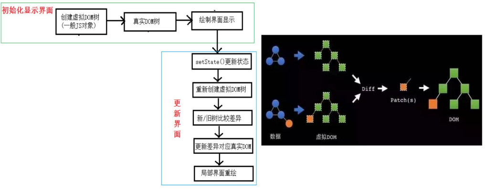

# React 面向组件编程

## 函数式组件

```html
<script type="text/babel">
  //1.创建函数式组件
  function MyComponent() {
    //此处的 this 是 undefined，因为 babel 编译后开启了严格模式
    console.log(this)
    return <h2>我是用函数定义的组件(适用于【简单组件】的定义)</h2>
  }
  //2.渲染组件到页面
  ReactDOM.render(<MyComponent />, document.getElementById('test'))
</script>
```

要点：

- 组件名称首字母必须大写，否则会解析成普通标签导致报错，详见 JSX 语法规则
- 函数需返回一个虚拟 DOM
- 渲染组件时需要使用标签形式，同时标签必须闭合

渲染组件的过程：

- React 解析标签，寻找对应组件
- 发现组件是函数式组件，则调用函数，将返回的虚拟 DOM 转换为真实 DOM ，并渲染到页面中

## 类式组件

```html
<script type="text/babel">
  // 创建类式组件
  class MyComponent extends React.Component {
    render() {
      console.log('render中的this：', this)
      return <h2>我是用类定义的组件(适用于【复杂组件】的定义)</h2>
    }
  }
  ReactDOM.render(<MyComponent />, document.getElementById('test'))
</script>
```

组件渲染过程：

- React 解析组件标签，寻找组件
- 发现是类式组件，则 `new` 该类的实例对象，通过实例调用原型上的 `render` 方法
- 将 `render` 返回的虚拟 DOM 转为真实 DOM ，渲染到页面上

## 组件实例核心属性 state

`state` 是组件实例对象最重要的属性，值为对象。又称为状态机，通过更新组件的 `state` 来更新对应的页面显示。

要点：

- 初始化 `state`
- React 中事件绑定
- `this` 指向问题
- `setState` 修改 `state` 状态
- `constructor` 、`render` 、自定义方法的调用次数

```html
<script type="text/babel">
  class Weather extends React.Component {
    // 调用一次
    constructor(props) {
      super(props)
      // 初始化 state
      this.state = { isHot: true, wind: '微风' }
      // 解决 this 指向问题
      this.changeWeather = this.changeWeather.bind(this)
    }
    // 调用 1+N 次
    render() {
      // 读取状态
      const { isHot } = this.state
      return <h1 onClick={this.changeWeather}>今天天气 {isHot ? '炎热' : '凉爽'}</h1>
    }
    // 点一次调一次
    changeWeather() {
      const isHot = this.state.isHot
      // 对 state 的修改是一种合并而非替换，即 wind 依然存在
      this.setState({ isHot: !isHot })
    }
  }

  ReactDOM.render(<Weather />, document.getElementById('test'))
</script>
```

简化版：

```html
<script>
  class Weather extends React.Component {
    state = { isHot: true, wind: '微风' }

    render() {
      const { isHot } = this.state
      return <h2 onClick={this.changeWeather}>天气{isHot ? '炎热' : '凉爽'}</h2>
    }

    // 采用箭头函数 + 赋值语句形式
    changeWeather = () => {
      const isHot = this.state.isHot
      this.setState = { isHot: !isHot }
    }
  }

  ReactDOM.render(<Weather />, document.getElementById('test'))
</script>
```

## 组件实例核心属性 props

每个组件对象都有 `props` 属性，组件标签的属性都保存在 `props` 中。

`props` 是只读的，不能修改。

### props 基本使用

```html
<script type="text/babel">
  class Person extends React.Component {
    render() {
      const { name, age, sex } = this.props
      return (
        <ul>
          <li>姓名：{name}</li>
          <li>性别：{sex}</li>
          <li>年龄：{age}</li>
        </ul>
      )
    }
  }

  // 类似于标签属性传值
  ReactDOM.render(<Person name="Lily" age={19} sex="男" />, document.getElementById('test'))
</script>
```

### 批量传递 props

```html
<script type="text/babel">
  class Person extends React.Component {
    render() {
      const { name, age, sex } = this.props
      return (
        <ul>
          <li>姓名：{name}</li>
          <li>性别：{sex}</li>
          <li>年龄：{age}</li>
        </ul>
      )
    }
  }

  const obj = { name: 'Ben', age: 21, sex: '女' }
  ReactDOM.render(<Person {...obj} />, document.getElementById('test'))
</script>
```

### 限制 props

在 `React 15.5` 以前，`React` 身上有一个 `PropTypes` 属性可直接使用，即 `name: React.PropTypes.string.isRequired` ，没有把 `PropTypes` 单独封装为一个模块。

从 `React 15.5` 开始，把 `PropTypes` 单独封装为一个模块，需要额外导入使用。

```html
<!-- 引入prop-types，用于对组件标签属性进行限制 -->
<script type="text/javascript" src="../js/prop-types.js"></script>

<script type="text/babel">
  class Person extends React.Component {
    render() {
      const { name, age, sex } = this.props
      return (
        <ul>
          <li>姓名：{name}</li>
          <li>性别：{sex}</li>
          <li>年龄：{age}</li>
        </ul>
      )
    }
  }

  // 类型和必要性限制
  Person.propTypes = {
    name: PropTypes.string.isRequired,
    sex: PropTypes.string,
    age: PropTypes.number,
    // 限制 speak 为函数
    speak: PropTypes.func,
  }

  // 指定默认值
  Person.defaultProps = {
    sex: 'male',
    age: 19,
  }

  ReactDOM.render(<Person name="Vue" sex="male" age={11} speak={speak} />, document.getElementById('test'))

  function speak() {
    console.log('speaking...')
  }
</script>
```

### props 的简写形式

`Person.propTypes` 和 `Person.defaultProps` 可以看作在类身上添加属性，利用 `static` 关键词就能在类内部进行声明。因此所谓简写只是从类外部移到类内部。

```html
<!-- 引入prop-types，用于对组件标签属性进行限制 -->
<script type="text/javascript" src="../js/prop-types.js"></script>

<script type="text/babel">
  class Person extends React.Component {
    static propTypes = {
      name: PropTypes.string.isRequired,
      sex: PropTypes.string,
      age: PropTypes.number,
      // 限制 speak 为函数
      speak: PropTypes.func,
    }
    static defaultProps = {
      sex: 'male',
      age: 19,
    }

    render() {
      const { name, age, sex } = this.props
      return (
        <ul>
          <li>姓名：{name}</li>
          <li>性别：{sex}</li>
          <li>年龄：{age}</li>
        </ul>
      )
    }
  }

  ReactDOM.render(<Person name="Vue" sex="male" age={11} speak={speak} />, document.getElementById('test'))

  function speak() {
    console.log('speaking...')
  }
</script>
```

### 类式组件的构造器与 props

[官网文档说明](https://zh-hans.reactjs.org/docs/react-component.html#constructor)

构造函数一般用在两种情况：

- 通过给 `this.state` 赋值对象来初始化内部 `state`
- 为事件处理函数绑定实例

```js
constructor(props) {
  super(props)
  // 初始化 state
  this.state = { isHot: true, wind: '微风' }
  // 解决 this 指向问题
  this.changeWeather = this.changeWeather.bind(this)
}
```

因此构造器一般都不需要写。如果要在构造器内使用 `this.props` 才声明构造器，并且需要在最开始调用 `super(props)` ：

```js
constructor(props) {
  super(props)
  console.log(this.props)
}
```

### 函数式组件使用 props

由于函数可以传递参数，因此函数式组件可以使用 `props` 。

```html
<!-- 引入prop-types，用于对组件标签属性进行限制 -->
<script type="text/javascript" src="../js/prop-types.js"></script>

<script type="text/babel">
  function Person(props) {
    const { name, age, sex } = props
    return (
      <ul>
        <li>姓名：{name}</li>
        <li>性别：{sex}</li>
        <li>年龄：{age}</li>
      </ul>
    )
  }
  Person.propTypes = {
    name: PropTypes.string.isRequired,
    sex: PropTypes.string,
    age: PropTypes.number,
  }

  Person.defaultProps = {
    sex: '男',
    age: 18,
  }

  ReactDOM.render(<Person name="jerry" />, document.getElementById('test'))
</script>
```

## 组件实例核心属性 refs

通过定义 `ref` 属性可以给标签添加标识。

### 字符串形式的 ref

这种形式已过时，效率不高，[官方](https://zh-hans.reactjs.org/docs/refs-and-the-dom.html#legacy-api-string-refs)不建议使用。

```html
<script type="text/babel">
  class Demo extends React.Component {
    showData = () => {
      const { input1 } = this.refs
      alert(input1.value)
    }
    render() {
      return (
        <div>
          <input ref="input1" type="text" placeholder="点击按钮提示数据" />
          &nbsp;
          <button onClick={this.showData}>点我提示左侧的数据</button>&nbsp;
        </div>
      )
    }
  }

  ReactDOM.render(<Demo />, document.getElementById('test'))
</script>
```

### 回调形式的 ref

要点：

- `c => this.input1 = c` 就是给组件实例添加 `input1` 属性，值为节点
- 由于是箭头函数，因此 `this` 是 `render` 函数里的 `this` ，即组件实例

```html
<script type="text/babel">
  class Demo extends React.Component {
    showData = () => {
      const { input1 } = this
      alert(input1.value)
    }
    render() {
      return (
        <div>
          <input
            ref={(c) => {
              this.input1 = c
            }}
            type="text"
            placeholder="点击按钮提示数据"
          />
          &nbsp;
          <button onClick={this.showData}>点我提示左侧的数据</button>&nbsp;
        </div>
      )
    }
  }

  ReactDOM.render(<Demo />, document.getElementById('test'))
</script>
```

关于回调 `ref` 执行次数的问题，[官网](https://zh-hans.reactjs.org/docs/refs-and-the-dom.html#caveats-with-callback-refs)描述：

::: tip
如果 `ref` 回调函数是以内联函数的方式定义的，在更新过程中它会被执行两次，第一次传入参数 `null`，然后第二次会传入参数 DOM 元素。这是因为在每次渲染时会创建一个新的函数实例，所以 React 清空旧的 `ref` 并且设置新的。通过将 `ref` 的回调函数定义成 `class` 的绑定函数的方式可以避免上述问题，但是大多数情况下它是无关紧要的。
:::

即内联函数形式，在更新过程中 `ref` 回调会被执行两次，第一次传入 `null` ，第二次传入 DOM 元素。若是下述形式，则只执行一次。但是对功能实现没有影响，因此一般也是用内联函数形式。

```html
<script type="text/babel">
  //创建组件
  class Demo extends React.Component {
    state = { isHot: false }

    changeWeather = () => {
      const { isHot } = this.state
      this.setState({ isHot: !isHot })
    }

    saveInput = (c) => {
      this.input1 = c
      console.log('@', c)
    }

    render() {
      const { isHot } = this.state
      return (
        <div>
          <h2>今天天气很{isHot ? '炎热' : '凉爽'}</h2>
          <input ref={this.saveInput} type="text" />
        </div>
      )
    }
  }

  ReactDOM.render(<Demo />, document.getElementById('test'))
</script>
```

### createRef API

该方式通过调用 `React.createRef` 返回一个容器用于存储节点，且一个容器只能存储一个节点。

```html
<script type="text/babel">
  class Demo extends React.Component {
    myRef = React.createRef()
    myRef2 = React.createRef()

    showData = () => {
      alert(this.myRef.current.value)
    }

    showData2 = () => {
      alert(this.myRef2.current.value)
    }
    render() {
      return (
        <div>
          <input ref={this.myRef} type="text" placeholder="点击按钮提示数据" />
          &nbsp;
          <button onClick={this.showData}>点我提示左侧的数据</button>&nbsp;
          <input onBlur={this.showData2} ref={this.myRef2} type="text" placeholder="失去焦点提示数据" />
          &nbsp;
        </div>
      )
    }
  }

  ReactDOM.render(<Demo />, document.getElementById('test'))
</script>
```

### 事件处理

- React 使用自定义事件，而非原生 DOM 事件，即 `onClick、onBlur` ：为了更好的兼容性
- React 的事件通过事件委托方式进行处理：为了高效
- 通过 `event.target` 可获取触发事件的 DOM 元素：勿过度使用 `ref`

当触发事件的元素和需要操作的元素为同一个时，可以不使用 `ref` ：

```js
class Demo extends React.Component {
  showData2 = (event) => {
    alert(event.target.value)
  }

  render() {
    return (
      <div>
        <input onBlur={this.showData2} type="text" placeholder="失去焦点提示数据" />
        &nbsp;
      </div>
    )
  }
}
```

## 受控 & 非受控组件

包含表单的组件分类：

- 非受控组件：现用现取。即需要使用时，再获取节点得到数据
- 受控组件：类似于 Vue 双向绑定的从视图层绑定到数据层

尽量使用受控组件，因为非受控组件需要使用大量的 `ref` 。

```js
// 非受控组件
class Login extends React.Component {
  handleSubmit = (event) => {
    event.preventDefault()
    const { username, password } = this
    alert(`用户名是：${username.value}, 密码是：${password.value}`)
  }
  render() {
    return (
      <form onSubmit={this.handleSubmit}>
        用户名：
        <input ref={(c) => (this.username = c)} type="text" name="username" />
        密码：
        <input ref={(c) => (this.password = c)} type="password" name="password" />
        <button>登录</button>
      </form>
    )
  }
}
```

```js
// 受控组件
class Login extends React.Component {
  state = {
    username: '',
    password: '',
  }

  saveUsername = (event) => {
    this.setState({ username: event.target.value })
  }

  savePassword = (event) => {
    this.setState({ password: event.target.value })
  }

  handleSubmit = (event) => {
    event.preventDefault()
    const { username, password } = this.state
    alert(`用户名是：${username}, 密码是：${password}`)
  }

  render() {
    return (
      <form onSubmit={this.handleSubmit}>
        用户名：
        <input onChange={this.saveUsername} type="text" name="username" />
        密码：
        <input onChange={this.savePassword} type="password" name="password" />
        <button>登录</button>
      </form>
    )
  }
}
```

对上述受控组件的代码进行优化，希望把 `saveUsername` 和 `savePassword` 合并为一个函数。

要点：

- 高阶函数：参数为函数或者返回一个函数的函数，如 `Promise、setTimeout、Array.map()`
- 函数柯里化：通过函数调用继续返回函数的方式，实现多次接收参数最后统一处理的函数编码形式

```js
// 函数柯里化
function sum(a) {
  return (b) => {
    return (c) => {
      return a + b + c
    }
  }
}
```

```js
// 使用高阶函数和柯里化写法
class Login extends React.Component {
  state = {
    username: '',
    password: '',
  }

  saveFormData = (dataType) => {
    return (event) => {
      this.setState({ [dataType]: event.target.value })
    }
  }

  handleSubmit = (event) => {
    event.preventDefault()
    const { username, password } = this.state
    alert(`用户名是：${username}, 密码是：${password}`)
  }
  render() {
    return (
      <form onSubmit={this.handleSubmit}>
        用户名：
        <input onChange={this.saveFormData('username')} type="text" name="username" />
        密码：
        <input onChange={this.saveFormData('password')} type="password" name="password" />
        <button>登录</button>
      </form>
    )
  }
}
```

```js
// 不使用柯里化写法
class Login extends React.Component {
  state = {
    username: '',
    password: '',
  }

  saveFormData = (dataType, event) => {
    this.setState({ [dataType]: event.target.value })
  }

  handleSubmit = (event) => {
    event.preventDefault()
    const { username, password } = this.state
    alert(`用户名是：${username}, 密码是：${password}`)
  }
  render() {
    return (
      <form onSubmit={this.handleSubmit}>
        用户名：
        <input onChange={(event) => this.saveFormData('username', event)} type="text" name="username" />
        密码：
        <input onChange={(event) => this.saveFormData('password', event)} type="password" name="password" />
        <button>登录</button>
      </form>
    )
  }
}
```

## 生命周期

### 生命周期旧版

**初始化阶段**：`ReactDOM.render()` 触发的初次渲染

- `constructor`
- `componentWillMount`
- `render`
- `componentDidMount`

**更新阶段**

1. 父组件重新 `render` 触发的更新

- `componentWillReceiveProps`
- `shouldComponentUpdate` ：控制组件是否更新的阀门，返回值为布尔值，默认为 `true` 。若返回 `false` ，则后续流程不会进行。
- `componentWillUpdate`
- `render`
- `componentDidUpdate`

2. 组件内部调用 `this.setState()` 修改状态

- `shouldComponentUpdate`
- `componentWillUpdate`
- `render`
- `componentDidUpdate`

3. 组件内部调用 `this.forceUpdate()` 强制更新

- `componentWillUpdate`
- `render`
- `componentDidUpdate`

**卸载阶段**：`ReactDOM.unmountComponentAtNode()` 触发

- `componentWillUnmount`


### 生命周期新版

[更改内容](https://zh-hans.reactjs.org/blog/2018/03/27/update-on-async-rendering.html)：

- 废弃三个钩子：`componentWillMount` 、`componentWillReceiveProps` 、 `componentWillUpdate` 。在新版本中这三个钩子需要加 `UNSAFE_` 前缀才能使用，后续可能会废弃。
- 新增两个钩子（实际场景用得很少）：`getDerivedStateFromProps` 、`getSnapshotBeforeUpdate`


[static getDerivedStateFromProps(props, state)](https://zh-hans.reactjs.org/docs/react-component.html#static-getderivedstatefromprops)：

- 需使用 `static` 修饰
- 需返回一个对象更新 `state` 或返回 `null`
- 适用于如下情况：`state` 的值任何时候都取决于 `props`

[getSnapshotBeforeUpdate(prevProps, prevState)](https://zh-hans.reactjs.org/docs/react-component.html#getsnapshotbeforeupdate)：

- 在组件更新之前获取快照
- 得组件能在发生更改之前从 DOM 中捕获一些信息（如滚动位置）
- 返回值将作为参数传递给 `componentDidUpdate()`

```js
static getDerivedStateFromProps(props,state){
  console.log('getDerivedStateFromProps',props,state);
  return null
}

getSnapshotBeforeUpdate(){
  console.log('getSnapshotBeforeUpdate');
  return 'atguigu'
}

componentDidUpdate(preProps,preState,snapshotValue){
  console.log('componentDidUpdate',preProps,preState,snapshotValue);
}
```

```js
// getSnapshotBeforeUpdate 案例
class NewsList extends React.Component {
  state = { newsArr: [] }

  componentDidMount() {
    setInterval(() => {
      //获取原状态
      const { newsArr } = this.state
      //模拟一条新闻
      const news = '新闻' + (newsArr.length + 1)
      //更新状态
      this.setState({ newsArr: [news, ...newsArr] })
    }, 1000)
  }

  getSnapshotBeforeUpdate() {
    return this.refs.list.scrollHeight
  }

  componentDidUpdate(preProps, preState, height) {
    this.refs.list.scrollTop += this.refs.list.scrollHeight - height
  }

  render() {
    return (
      <div className="list" ref="list">
        {this.state.newsArr.map((n, index) => {
          return (
            <div key={index} className="news">
              {n}
            </div>
          )
        })}
      </div>
    )
  }
}
ReactDOM.render(<NewsList />, document.getElementById('test'))
```

### 最重要的三个钩子

- `render` ：初始化渲染和更新渲染
- `componentDidMount` ：进行初始化，如开启定时器、发送网络请求、订阅消息
- `componentWillUnmount` ：进行收尾，如关闭定时器、取消订阅消息

## 虚拟 DOM 与 Diff 算法



**`key` 的作用：**

`key` 是虚拟 DOM 对象的标识，可提高页面更新渲染的效率。

当状态中的数据发生变化时，React 会根据新数据生成新的虚拟 DOM ，接着对新旧虚拟 DOM 进行 Diff 比较，规则如下：

- 旧虚拟 DOM 找到和新虚拟 DOM 相同的 key：
  - 若内容没变，直接复用真实 DOM
  - 若内容改变，则生成新的真实 DOM ，替换页面中之前的真实 DOM
- 旧虚拟 DOM 未找到和新虚拟 DOM 相同的 key：根据数据创建新的真实 DOM ，渲染到页面

**使用 `index` 作为 `key` 可能引发的问题：**

- 若对数据进行逆序添加、逆序删除等破坏顺序的操作，会进行没有必要的真实 DOM 更新。界面效果没问题，但效率低下。
- 如果结构中包含输入类的 DOM（如 input 输入框） ，则会产生错误的 DOM 更新。
- 若不存在对数据逆序添加、逆序删除等破坏顺序的操作，则没有问题。

```js
// 使用 index 作为 key 引发的问题
class Person extends React.Component {
  state = {
    persons: [
      { id: 1, name: '小张', age: 18 },
      { id: 2, name: '小李', age: 19 },
    ],
  }

  add = () => {
    const { persons } = this.state
    const p = { id: persons.length + 1, name: '小王', age: 20 }
    this.setState({ persons: [p, ...persons] })
  }

  render() {
    return (
      <div>
        <h2>展示人员信息</h2>
        <button onClick={this.add}>添加小王</button>
        <h3>使用index作为key</h3>
        <ul>
          {this.state.persons.map((personObj, index) => {
            return (
              <li key={index}>
                {personObj.name}---{personObj.age}
                <input type="text" />
              </li>
            )
          })}
      </div>
    )
  }
}
```
