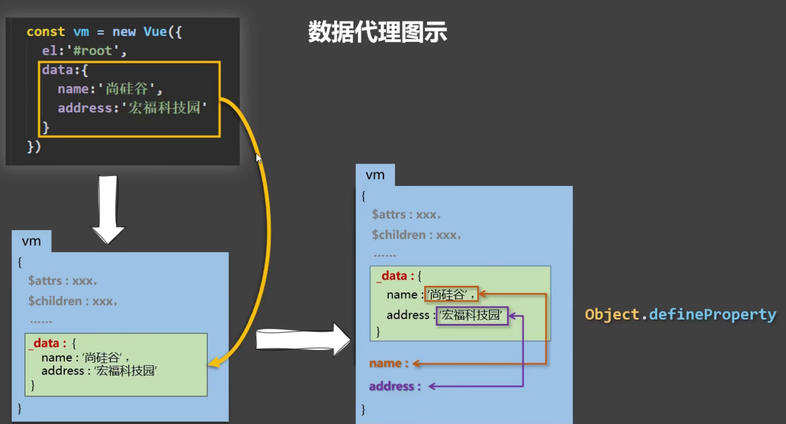
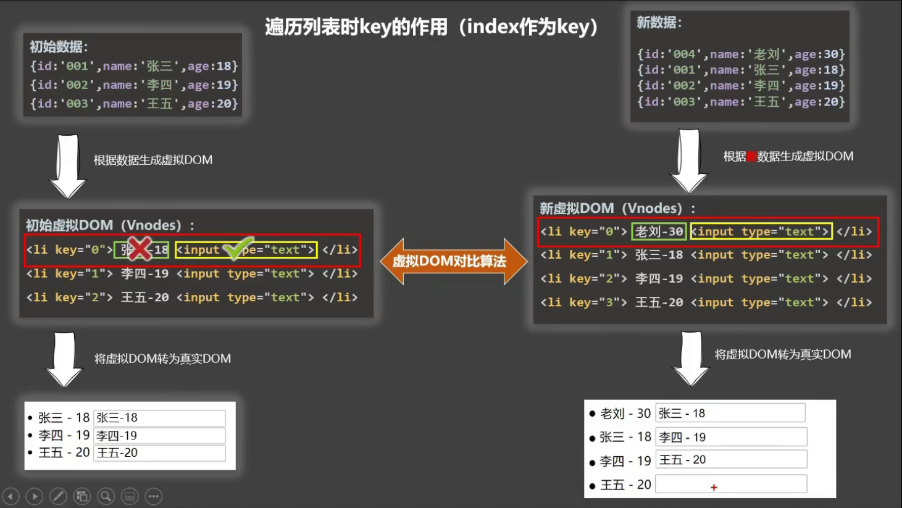

# Vue 核心基础

[官网传送门](https://v2.cn.vuejs.org/)

::: tip
Vue 是动态构建用户界面的渐进式 JavaScript 框架 <br>
Vue 借鉴 Angular 的模板和数据绑定技术，React 的组件化和虚拟 DOM 技术
:::

## 数据代理

### `Object.defineProperty()` 的使用

```js
let person = {
  name: 'Vue',
  sex: 'none',
}
let number = 19

// 配置一
// 参数：对象、属性名、配置
Object.defineProperty(person, 'age', {
  // 属性值
  value: 21,
  // 属性是否可修改
  writable: true,
  // 属性是否可枚举（遍历）
  enumerable: true,
  // 属性是否可删除
  configurable: true,
})

Object.keys(person)

// 配置二
// getter、setter 不能和 value、writable 同时指定
Object.defineProperty(person, 'age', {
  enumberable: true,
  configurable: true,

  get() {
    console.log('age 属性被读取')
    return number
  }

  set(value) {
    console.log('age 属性被修改', value)
    number = value
  }
})
```

### 何为数据代理

数据代理：通过一个对象对另一个对象的属性进行操作

```js
let obj = { a: 21 }
let obj2 = { b: 10 }

Object.defineProperty(obj2, 'a', {
  get() {
    return obj.a
  }
  set(value) {
    obj.a = value
  }
})

obj2.a // 21
obj2.a = 1000
obj.a // 1000
```

### Vue 中的数据代理



Vue 中通过 vm 实例对象代理对 data 对象属性的操作，让我们更方便操作 data 中的数据。

data 中的数据实际上被存在 `vm._data` 属性上，如果不进行代理，使用起来很不方便。

通过 `Object.defineProperty()` 给 vm 添加属性，并且指定 getter 和 setter，通过 getter 和 setter 访问和修改 data 对应是属性。

## Vue 监测数据的原理

> 监测数据，即 Vue 是如何监听数据发生变化，从而重新解析模板渲染页面的。Vue 会监测 data 中所有层级的数据。

### Vue 监测对象数据

- 原理：通过 `Object.defineProperty()` 为属性添加 `getter`、`setter` ，对属性的读取、修改进行拦截，即数据劫持
- 存在问题：
  - 对象新增加的属性，默认不做响应式处理
  - 对象删除属性，也不是响应式的
- 解决办法，使用如下 [API](https://v2.cn.vuejs.org/v2/api/#Vue-set) ：
  - `Vue.set(target, propertyName/index, value)`
  - `vm.$set(target, propertyName/index, value)`
  - `Vue.delete(target, propertyName/index)`
  - `vm.$delete(target, propertyName/index)`
- `Vue.set()` 和 `vm.$set()` 不能给 vm 或 vm 的根数据对象添加属性（即 data）

```js
// 简单模拟实现对象的数据监测，Vue 更完善
// Vue 通过 vm.name 即可修改
// Vue 实现深层监听
let person = {
  name: 'Vue',
  age: 99
}

function Observer(obj) {
  const keys = Object.keys(obj)

  keys.forEach(key => {
    Object.defineProperty(this, key, {
      get() {
        return obj[key]
      }
      set(value) {
        console.log('数据被修改，重新解析模板...')
        obj[key] = value
      }
    })
  })
}

let vm = {}
let observer = new Observer(person)
vm._data = observer
```

### Vue 监测数组

- 原理：通过重写数组的 API 实现拦截：`push()、pop()、shift()、unshift()、splice()、sort()、reverse()`
- 7 个 API 之所以是响应式的，是因为 Vue 对这些方法进行了[包裹](https://v2.cn.vuejs.org/v2/guide/list.html#%E6%95%B0%E7%BB%84%E6%9B%B4%E6%96%B0%E6%A3%80%E6%B5%8B)，即二次封装。做了两件事：调用对应的原生方法更新数组 & 重新解析模板更新页面
- 存在问题：
  - 直接通过数组下标修改是[非响应式的](https://v2.cn.vuejs.org/v2/guide/reactivity.html#%E5%AF%B9%E4%BA%8E%E6%95%B0%E7%BB%84)
- 解决办法：
  - 使用 7 个 API 修改数组
  - `Vue.set()`、`vm.$set()`
  - `Vue.delete()`、`vm.$delete()`
- [思否文章](https://segmentfault.com/a/1190000015783546)

## 插值语法

```html
<p>用户名：{{ username }}</p>
<p>密码{{ password }}</p>

<!-- {{}} 支持简 JS 表达式 -->
<p>{{ flag ? 111 : 000}}</p>
```

```js
data() {
  return {
    username: 'docsify',
    password: 55520,
    flag: true
  }
}
```

## 属性绑定指令 v-bind

```html
<input type="text" v-bind:placeholder="desc" />

<!-- v-bind 简写形式 -->


<!-- v-bind 支持 JS 表达式 -->
<div :id="'hello' + 1"></div>
```

```js
data() {
  return {
    desc: '请输入用户名',
    url: 'www.baidu.com',
    name: 'hello'
  }
}
```

## 双向绑定指令 v-model

`v-model` 用于表单元素如 `input`，`textarea`，`select` 。

### v-model 基础用法

```html
<p>{{ username }}</p>
<input type="text" v-model:value="username" />
<input type="text" v-model="username" />

<p>{{ province }}</p>
<select v-model="province">
  <option value="">请选择</option>
  <option value="1">北京</option>
  <option value="2">上海</option>
  <option value="3">广州</option>
</select>
```

### v-model 指令修饰符

| 修饰符  | 作用                               | 示例                             |
| ------- | ---------------------------------- | -------------------------------- |
| .number | 将用户输入转为数值类型             | `<input v-model.number="age" />` |
| .trim   | 删除输入的首尾空白字符             | `<input v-model.trim="msg">`     |
| .lazy   | 当失去焦点时，才更新数据，类似防抖 | `<input v-model.lazy="msg">`     |

### v-model 收集表单数据

- `<input type="text"/>` ，收集的是 `value` 值，用户输入的就是 `value` 值。
- `<input type="radio"/>` ，收集的是 `value` 值，且要给标签配置 `value` 值。
- `<input type="checkbox"/>`
  - 没有配置 `value` 属性，收集的就是 `checked`
  - 配置了 `value` 属性:
    - `v-model` 的初始值是非数组，那么收集的就是 `checked`
    - `v-model` 的初始值是数组，那么收集的的就是 `value` 组成的数组

```html
<div id="root">
  <form @submit.prevent="demo">
    账号：<input type="text" v-model.trim="userInfo.account" />

    密码：<input type="password" v-model="userInfo.password" />

    年龄：<input type="text" v-model.number="userInfo.age" />

    性别： 男<input type="radio" name="sex" v-model="userInfo.sex" value="male" />

    女<input type="radio" name="sex" v-model="userInfo.sex" value="female" />

    爱好： 学习<input type="checkbox" v-model="userInfo.hobby" value="study" />

    打游戏<input type="checkbox" v-model="userInfo.hobby" value="game" />

    吃饭<input type="checkbox" v-model="userInfo.hobby" value="eat" />

    所属校区
    <select v-model="userInfo.city">
      <option value="">请选择校区</option>
      <option value="beijing">北京</option>
      <option value="shanghai">上海</option>
      <option value="shenzhen">深圳</option>
      <option value="wuhan">武汉</option>
    </select>

    其他信息：
    <textarea v-model.lazy="userInfo.other"></textarea>
    <input type="checkbox" v-model="userInfo.agree" />阅读接受协议
    <button>提交</button>
  </form>
</div>
```

```js
data() {
  return {
    userInfo:{
      account:'',
      password:'',
      age:18,
      sex:'female',
      hobby:[],
      city:'beijing',
      other:'',
      agree:''
    }
  }
},
methods: {
  demo() {
    console.log(JSON.stringify(this.userInfo))
  }
}
```

## 事件绑定指令 v-on

### v-on 基础用法

```html
<p>count的值：{{ count }}</p>
<button v-on:click="add">+1</button>

<!-- v-on 缩写形式 -->
<button @click="add">+1</button>
```

```js
data() {
  return {
    count: 1
  }
},
methods: {
  add() {
    this.count++
  }
}
```

### 事件参数对象

如果事件处理函数没有传参，则默认会传一个时间参数对象 `$event` ，通过它可以获取触发事件的元素，并进行相关操作。

```js
methods: {
  add(e) {
    e.target.style.backgroundColor = 'red'
    this.count++
  }
}
```

如果事件处理函数传递参数了，则默认的 `$event` 会被覆盖，需要手动进行传递。

```html
<button @click="add(2, $event)">+1</button>
```

```js
methods: {
  add(step, e) {
    e.target.style.backgroundColor = 'red'
    this.count += step
  }
}
```

### 事件修饰符

| 事件修饰符   | 说明                                                   |
| ------------ | ------------------------------------------------------ |
| **.prevent** | 阻止默认行为，如 a 链接跳转、表单提交                  |
| **.stop**    | 阻止事件冒泡                                           |
| .once        | 绑定的事件只触发 1 次                                  |
| .capture     | 以捕获模式触发事件处理函数                             |
| .self        | 只有在 `event.target` 是当前元素自身时触发事件处理函数 |
| .passive     | 事件的默认行为立即执行，无需等待事件回调执行完毕       |

```html
<a href="www.baidu.com" @click.prevent="fn">阻止链接跳转</a>

<div @click.stop="handleClick">阻止事件冒泡</div>

<!-- .passive ：如 `onwheel` 鼠标滚轮事件，是先执行事件的回调再进行滚动。 -->

如果回调比较耗时，那么会等一段时间才发生滚动。 添加 .passive 后，则先进行滚动再执行回调。
```

### 按键修饰符

1. Vue 中常用的按键别名：

- 回车 => enter
- 删除 => delete (捕获“删除”和“退格”键)
- 退出 => esc
- 空格 => space
- 换行 => tab (特殊，必须配合 keydown 去使用)
- 上 => up
- 下 => down
- 左 => left
- 右 => right

2. Vue 未提供别名的按键，可以使用按键原始的 `key` 值去绑定，但注意要转为 kebab-case（短横线命名）

3. 系统修饰键（用法特殊）：ctrl、alt、shift、meta（即 win 键）

- 配合 keyup 使用：按下修饰键的同时，再按下其他键，随后释放其他键，事件才被触发。
- 配合 keydown 使用：正常触发事件。

4. 可使用 keyCode 去指定具体的按键，此法不推荐，因为 keyCode 以后可能废除

5. `Vue.config.keyCodes.自定义键名 = 键码` ，可以去定制按键别名

```html
<input type="text" @keyup.enter="submit" />
<input type="text" @keyup.esc="back" />
<input type="text" @keydown.tab="showInfo" />
<input type="text" @keyup.caps-lock="showInfo" />

<input type="text" @keyup.huiche="showInfo" />
<input type="text" @keyup.13="showInfo" />
<script>
  Vue.config.keyCodes.huiche = 13
</script>
```

## 条件渲染指令

### 基础用法

```html
<p v-if="status === 200">success</p>
<p v-else-if="status === 201">xxx</p>
<p v-else>yyy</p>

<p v-show="status === 404">error</p>

<!-- template 只能和 v-if 搭配使用 -->
<template v-if="status === 200">
  <p>111</p>
  <p>222</p>
  <p>333</p>
</template>
```

### v-if 和 v-show 的区别

实现原理不同：

- `v-if` 通过创建或删除 DOM 元素来控制元素的显示与隐藏
- `v-show` 通过添加或删除元素的 `style="display: none"` 样式来控制元素的显示与隐藏

性能消耗不同：

- `v-if` 切换开销更高，如果运行时条件很少改变，使用 `v-if` 更好
- `v-show` 初始渲染开销更高，如果切换频繁，使用 `v-show` 更好

## 列表渲染指令 v-for

### 基本用法

```html
<!-- 遍历数组 -->
<ul>
  <li v-for="(item, index) in list" :key="item.id">{{ item.name }}</li>
</ul>

<!-- 遍历对象 -->
<ul>
  <li v-for="(value, key) in obj" :key="key">{{ key }} - {{ value }}</li>
</ul>

<!-- 遍历字符串 -->
<ul>
  <li v-for="(char, index) in str" :key="index">{{ index }} - {{ char }}</li>
</ul>

<!-- 遍历次数 -->
<ul>
  <li v-for="(number, index) in 5" :key="index">{{ index }} - {{ number }}</li>
</ul>
```

```js
data() {
  return {
    list: [...],
    obj: {
      name: 'Bruce',
      age: 88,
      sex: 'unknown'
    },
    str: 'hello vue'
  }
}
```

### `key` 的作用

**`key` 的作用：**

- 当列表的数据变化时，默认情况下，vue 会尽可能的复用已存在的 DOM 元素，从而提升渲染的性能。但这种默认的性能优化策略，会导致有状态的列表无法被正确更新。
- 为了给 vue 一个提示，以便它能跟踪每个节点的身份，从而在保证有状态的列表被正确更新的前提下，提升渲染的性能。此时，需要为每项提供一个唯一的 key 属性。
- `key` 是虚拟 DOM 对象的标识，可提高页面更新渲染的效率。当数据变化时，Vue 会根据新数据生成新的虚拟 DOM，随后进行新旧虚拟 DOM 的差异比较

**比较规则**

- 旧虚拟 DOM 找到和新虚拟 DOM 相同的 key：
  - 若内容没变，直接复用真实 DOM
  - 若内容改变，生成新的真实 DOM，替换旧的真实 DOM
- 旧虚拟 DOM 未找到和新虚拟 DOM 相同的 key：创建新的真实 DOM，渲染到页面

**`key` 的注意事项：**

- key 的值只能是**字符串**或**数字**类型
- key 的值必须具有唯一性（即：key 的值不能重复）
- 建议把数据项 id 属性的值作为 key 的值（因为 id 属性的值具有唯一性）
- 使用 index 的值当作 key 的值没有意义（因为 index 的值不具有唯一性）
- 建议使用 v-for 指令时一定要指定 key 的值（既提升性能、又防止列表状态紊乱）



## 其它内置指令

### v-text

`v-text` 指令会覆盖元素默认值。

```html
<p v-text="username">这段内容会被覆盖</p>
```

```js
data() { return { username: "Bruce" } }
```

### v-html

> v-html 存在安全问题，容易导致 XSS 攻击

```html
<p v-html="desc">原本内容被覆盖</p>
```

```js
data() {
  return {
    desc: '<h1 style="color: red">红色标题</h1>'，
    str: '<a href="http://www.baidu.com?"+document.cookie>兄弟我找到你想要的资源了，快来！</a>'
  }
}
```

### v-cloak

- 本质是一个特殊属性，Vue 实例创建完毕并接管容器后，会删除 `v-cloak` 属性
- 使用 CSS 配合 `v-cloak` 可解决网速慢时页面展示 {{ xx }} 的问题

```css
[v-cloak] {
  display: none;
}
```

```html
<h2 v-cloak>{{ username }}</h2>
```

### v-once

- `v-once` 所在节点初次渲染后就成为静态内容
- 即数据变化不会引起 `v-once` 所在节点内容的更新，可用于优化性能

```html
<h2 v-once>初次的内容：{{ content }}</h2>
<h2>最新的内容：{{ content }}</h2>
```

### v-pre

- 跳过所在节点的编译过程
- 没有使用插值语法等特殊语法的节点，可用其跳过编译过程，加快编译

```html
<h2 v-pre>Vue 内置指令</h2>
<p>用户名：{{ username }}</p>
```

## 过滤器

- 过滤器常用于文本的格式化，可用在插值表达式和 `v-bind` 属性绑定。
- 过滤器只在 `vue 2.x` 和 `vue 1.x` 中支持，`vue 3.x` 废弃了过滤器，官方建议使用计算属性或方法代替过滤器。

### 基本使用

```html
<!-- 在 JS 表达式尾部通过管道符进行调用-->
<p>{{ message | capitalize }}</p>

<div :id="rawId | formatId"></div>
```

```js
// 定义私有过滤器
filters: {
  capitalize(str) {
    return str.charAt(0).toUpperCase() + str.slice(1)
  }
}
```

```js
// 在 main.js 中定义全局过滤器
Vue.filter('capitalize', (str) => {
  return str.charAt(0).toUpperCase() + str.slice(1)
})
```

如果私有过滤器和全局过滤器冲突，按照就近原则调用私有过滤器。

### 连续调用多个过滤器

过滤器从左往右调用，前一个过滤器的结果交给下一个过滤器继续处理。

```html
<p>{{ text | capitalize | maxLength }}</p>
```

### 过滤器传参

```html
<p>{{ message | myFilter(arg1, arg2) }}</p>
```

```js
// 第一个参数永远都是管道符前的值
Vue.filter('myFilter', (value, arg1, arg2) => {
  ...
})
```

## computed 计算属性

- 定义：使用的属性不存在，要通过已有属性计算得到
- 原理：底层使用了 `Object.defineProperty()` 提供的 getter 和 setter
- getter 何时执行：
  - 初次读取时执行一次
  - 依赖的数据发生改变时执行
- 优点：与 `methods` 相比，有缓存机制，效率更高
- 若计算属性要修改，必须声明 setter 响应修改，且 setter 中要引起依赖的数据发生改变

```html
<span>{{ fullName }}</span>
```

```js
// 完整写法
computed: {
  fullName: {
    get() {
      // 计算属性依赖于已有属性得到
      return this.firstName + '-' + this.lastName
    }
    set(value) {
      // setter 中要引起依赖数据的变化
      const arr = value.split('-')
      this.firstName = arr[0]
      this.lastName = arr[1]
    }
  }
}

// 简写形式
// 只有明确计算属性不需要被修改时，才能用简写形式，即没有 setter
computed: {
  fullName() {
    return this.firstName + this.lastName
  }
}
```

## watch 侦听器

`watch` 侦听器允许开发者监视数据的变化，针对数据的变化做特定的操作。

> 侦听器可以监听普通属性和计算属性
>
> `computed` 能完成的功能，`watch` 也能
>
> `watch` 能完成的功能，`computed` 不一定，如异步操作

- Vue 管理的函数写成普通函数，使其 `this` 指向 vue 实例对象
- 不被 Vue 管理的函数写成箭头函数（定时器回调、`ajax` 回调、`Promise` 回调），这样其 `this` 才是 vue 实例对象

```js
// watch 简写形式
export default {
  data() {
    return {
      username: '',
    }
  },
  watch: {
    username(newVal, oldVal) {
      console.log('新值: ', newVal)
      console.log('旧值: ', oldVal)
    },
  },
}
```

默认情况下，组件在初次加载完毕后不会调用 `watch` 侦听器。如果想让 `watch` 侦听器立即被调用，需要使用 `immediate` 选项：

```js
watch: {
  // 对象形式的侦听器
  username: {
    // handler 属性是固定写法
    handler(newVal, oldVal) {
      ...
    },
    immediate: true
  }
}
```

当 `watch` 侦听的是一个对象，如果对象中的属性值发生了变化，则无法被监听到。此时需要使用 `deep` 选项进行**深度监听**：

```js
export default {
  data() {
    return {
      info: { username: 'admin' },
    }
  },
  watch: {
    info: {
      handler(newVal) {
        console.log(newVal)
      },
      deep: true,
    },
  },
}
```

若只想监听对象里单个属性的变化，代码如下：

```js
export default {
  data() {
    return {
      info: { username: 'admin' },
    }
  },
  watch: {
    // 记得加引号
    'info.username': {
      handler(newVal) {
        console.log(newVal)
      },
    },
  },
}
```

通过 Vue 实例的 `$watch` 监听：

```js
const vm = new Vue({...})

vm.$watch('isHot',{
  immediate: true,
  deep: true,
  handler(newValue,oldValue) {
    console.log(newValue, oldValue)
  }
})

vm.$watch('isHot',function(newValue,oldValue) {
  console.log(newValue, oldValue)
})
```

## 动态绑定 class 和 style

通过动态绑定 `class` 属性和行内 `style` 样式，可动态操作元素样式。

### 动态绑定 class 类名

- 字符串写法：类名不确定，要动态获取
- 对象写法：要绑定多个样式，个数不确定，名字也不确定
- 数组写法：要绑定多个样式，个数确定，名字也确定，但不确定用不用

```css
<style>
  .happy {
    ...;
  }
  .sad {
    ...;
  }
</style>
```

```html
<div class="basic" :class="mood" @click="changeMood">字符串写法</div>
<div class="basic" :class="arr">数组写法</div>
<div class="basic" :class="classObj">对象写法</div>
```

```js
export default {
  data() {
    return {
      mood: 'happy',
      arr: ['happy', 'sad'],
      classObj: {
        happy: true,
        sad: false,
      },
    }
  },
  methods: {
    changeMood() {
      this.mood = 'sad'
    },
  },
}
```

### 动态绑定 style 样式

`css` 属性名既可以用驼峰形式，也能用短横线形式（需要使用引号括起来）。

```html
<div :style="{color: active, fontSize: fsize + 'px', 'background-color': bgcolor}">对象写法</div>
<div :style="styleObj">对象写法</div>

<div :style="[styleObj, styleObj2]">数组写法（用得少）</div>
```

```js
data() {
  return {
    active: 'red',
    fsize: 30,
    bgcolor: 'yellow',
    styleObj: {
      color: 'active',
      'font-size': '20px'
    },
    styleObj2: {
      backgroundColor: 'yellow'
    }
  }
}
```

## vue 生命周期

vue 生命周期是指一个组件从创建、运行、销毁的整个过程。每个阶段对应着不同的生命周期钩子。

生命周期钩子也可理解为：Vue 在特定的时刻调用特定的函数。

除了图中 8 个钩子，还有 `nextTick`，`activated`，`deactivated`

关于销毁过程：

- 销毁后借助 Vue 开发者工具看不到任何信息。
- 销毁后自定义事件会失效，但原生 DOM 事件依然有效。
- 一般不在 `beforeDestroy` 操作数据，因为即便操作数据，也不会再触发更新流程


