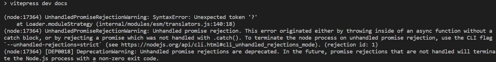

# vitepress 踩坑记录

## 运行报错

运行 `npm run dev` 或 `npm run build` 报 `UnhandledPromiseRejectionWarning: Unhandled promise rejection` 错误。

原因：node 版本太低，是 vitepress 最低 node 版本是 16，我使用了 12 版本的。

解决方法：使用 nvm 切换 node 版本。