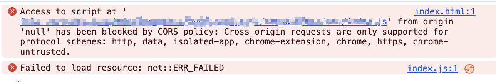

# vite

## vite 原理

**webpack 通过分析 js 中的 require 语句，得出当前 js 文件所有的依赖文件，通过递归的方式层层分析后，得到整个项目的依赖关系图。对图中不同的文件执行不同的 loader，比如使用 css-loader 解析 css 代码，最后基于这个依赖关系图读取到整个项目中的所有文件代码，进行打包处理后交给浏览器执行**。

这样的构建过程，导致在调试代码之前，需要等待 webpack 的依赖收集过程，而当项目代码体量很大的时候，这个依赖收集的过程往往需要等待几十秒甚至几分钟，开发体验很差。

如果有办法做到更少的代码打包就好了！于是 bundless 的打包思路就诞生了，vite 便是这种思路。

## webpack 核心：script 模块化

我们需要打包工具的核心原因，就是浏览器在执行代码的时候，本身没有一个很好的方式去读懂我们项目中各个文件的引用关系。

因此 webpack 把所有文件的引用关系都梳理好，并且将项目中所有文件的代码打包到一起，交给浏览器。浏览器找到入口文件执行即可。

但随着浏览器的进步，它开始能够读懂一些模块化的引入语法了。

```js
// index.js
import { add } from './index2.js';

console.log('add：', add(1, 2));

// index2.js
export const add = (a, b) => {
  return a + b;
};
```

```html
<!DOCTYPE html>
<html lang="en">
<head>
  <meta charset="UTF-8">
  <meta name="viewport" content="width=device-width, initial-scale=1.0">
  <title>Document</title>
</head>
<body>
  <script type="module" src="./index.js"></script>
</body>
</html>
```

如今，浏览器是可以正常运行这份代码的。那么浏览器是怎么处理这些文件的引用关系的？


浏览器会将 import 语句处理成一个个 http 网络请求，去获取 import 引入的各个模块。

因为浏览器现在可以通过 `type="module"` 的方式读懂项目中文件的模块化引入，因此，bundless 的思想得以发展。

:::danger HTML 引用 JS 模块报错
HTML 引用了带有 import 语句的 js 文件，浏览器直接打开会报跨域的错误。



原本来自相同的目录或子目录的本地文件是同源的，但是这有安全隐患，后面浏览器将所有本地文件视为不透明来源，因此加载**包含本地资源**的本地文件会导致 CORS 错误。

相关链接：[原因：CORS request not HTTP](https://developer.mozilla.org/zh-CN/docs/Web/HTTP/CORS/Errors/CORSRequestNotHttp)

解决办法：开启一个本地服务器，访问本地文件。最简便的方式就是安装 `Live Server` 插件，右键点击 HTML 文件，选择 `Open with Live Server`，一键打开。

相关链接：[引用import的JS报错：Access to script at 'file:' from origin 'null' has been blocked by CORS policy（3种解决手段）](https://blog.csdn.net/u013946061/article/details/106077527)
:::

## vite 依赖预构建

- 默认情况下，vite 会将 package.json 中生产依赖（dependencies）进行预构建，并将构建的内容缓存在 node_modules 的 `.vite` 文件中。启用 DevServer 时直接请求缓存的内容。

- 在 vite.config.js 中的 optimizeDeps 选项可以选择需要或不需要进行预构建的依赖的名称，vite 会根据该选项来确定是否对该依赖进行预构建。

- 在启动时添加 `--force options`，可以用来强制重新进行依赖预构建。

### 背景

- vite 中每个 import 都回触发一个请求，在依赖层级很深，涉及模块较多的情况下会出现很多的请求。

- 在 Chrome 中，同一个域名下只能同时支持 6 个 http 请求。

以上两个原因导致页面加载比较缓慢，与 vite 主导的性能优势相违背。

### 预构建做的事情

- 将其它格式（如 UMD、commonJS）的产物转换为 ESM 格式，使其在浏览器通过 `<script type="module"></script>` 的方式正常加载。

- 打包第三方库的代码，将各个第三方库分散的文件合并到一起，减少 HTTP 请求数量，避免页面加载性能劣化。

- 在 vite 中可以直接通过依赖名称引入依赖，这是因为 vite 在依赖处理的过程中，如果看到了有非绝对路径或者相对路径的引用，它会开启路径补全。如：

```js
import _ from 'lodash';
// 补全为
import _ from "/node_modules/.vite/lodash";
```

这些事情全部由性能优异的 esbuild 完成，因此也不会有明显的打包性能问题，反而是 vite 项目启动飞快的一个核心原因。

对于依赖的请求结果，vite 的 devserver 会做强缓存处理。

[vite依赖预构建](https://juejin.cn/post/7218129062745178168){link=card}

[Vite依赖预构建](https://juejin.cn/post/7112718640977281055){link=card}

## vite 的原理和手动实现

[面试官：”Vite为什么快？“](https://juejin.cn/post/7280747221510144054){link=card}