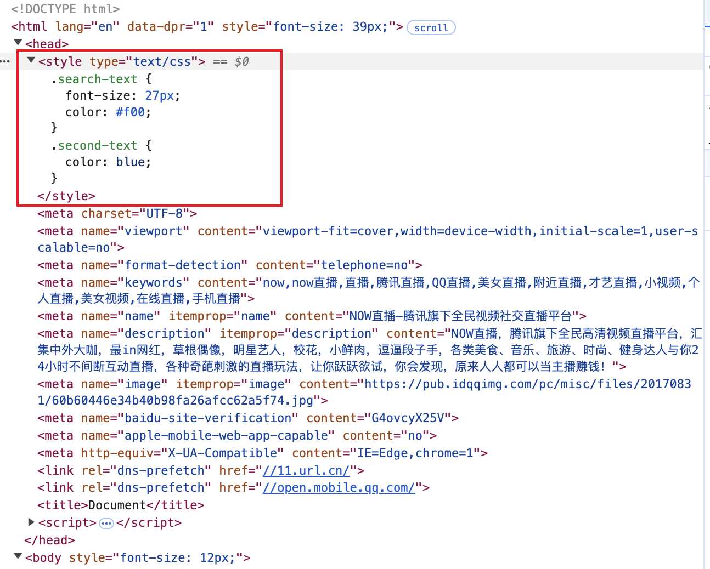
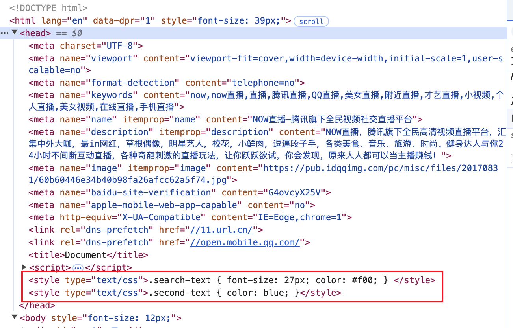
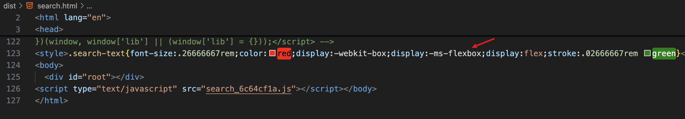

# webpack 实战

本文内容是极客时间[《玩转webpack》](https://time.geekbang.org/course/intro/100028901)课程的内容整理笔记。

## postcss插件autoprefixer自动补齐css属性前缀

根据 Can I Use 规则（ https://caniuse.com/ ），决定是否增加css属性前缀。

所需依赖：postcss-loader autoprefixer。

安装依赖：

```bash
npm i postcss-loader@3.0.0 autoprefixer@9.5.1 -D
```

增加配置：

```js
// webpack.config.js
module.exports = {
  module: {
    rules: [
      {
        test: /.less$/,
        use: [
          'style-loader',
          "css-loader",
          "less-loader",
          {
            loader: "postcss-loader",
            options: {
              plugins: () => [
                require("autoprefixer")({
                  browsers: ["last 6 version", ">1%", "ios 4"],
                }),
              ],
            },
          },
        ],
      },
    ]
  }
}
```

## 静态资源内联

所谓静态资源内联，就是在 HTML 文件中引入静态资源，比如图片、js、css等。

资源内联的意义：

1、代码层面

- 页面框架的初始化脚本

- 上报相关打点

- css 内联可避免页面闪动

2、请求层面

- 减少 HTTP 请求次数。小图片或者字体可以内联到 HTML 中，使用 url-loader。

### HTML、js内联

所需依赖：raw-loader。

HTML 内联：`${require('raw-loader!./meta.html')}`。

JS 内联：`<script>${require('raw-loader!babel-loader!../../node_modules/lib-flexible/flexible.js')}</script>`。

安装依赖，raw-loader 选择安装 0.5.x 的版本，高版本有问题。

```bash
npm i raw-loader@0.5.1 -D
```

HTML 文件使用 raw-loader：

```shell
.
├── src
│   ├── index
│   │   ├── index.html
│   │   └── index.js
|   |
│   ├── search
│       ├── index.html
|       ├── index.js
|       ├── search.less
│       └── meta.html
├── .gitignore
├── package.json
├── webpack.prod.js
...
```

```html
<!-- src/search/meta.html -->
<meta charset="UTF-8">
<meta name="viewport" content="viewport-fit=cover,width=device-width,initial-scale=1,user-scalable=no">
<meta name="format-detection" content="telephone=no">
<meta name="keywords" content="now,now直播,直播,腾讯直播,QQ直播,美女直播,附近直播,才艺直播,小视频,个人直播,美女视频,在线直播,手机直播">
<meta name="name" itemprop="name" content="NOW直播—腾讯旗下全民视频社交直播平台"><meta name="description" itemprop="description" content="NOW直播，腾讯旗下全民高清视频直播平台，汇集中外大咖，最in网红，草根偶像，明星艺人，校花，小鲜肉，逗逼段子手，各类美食、音乐、旅游、时尚、健身达人与你24小时不间断互动直播，各种奇葩刺激的直播玩法，让你跃跃欲试，你会发现，原来人人都可以当主播赚钱！">
<meta name="image" itemprop="image" content="https://pub.idqqimg.com/pc/misc/files/20170831/60b60446e34b40b98fa26afcc62a5f74.jpg"><meta name="baidu-site-verification" content="G4ovcyX25V">
<meta name="apple-mobile-web-app-capable" content="no">
<meta http-equiv="X-UA-Compatible" content="IE=Edge,chrome=1">
<link rel="dns-prefetch" href="//11.url.cn/">
<link rel="dns-prefetch" href="//open.mobile.qq.com/">

<!-- src/search/index.html -->
<!DOCTYPE html>
<html lang="en">
<head>
  <!-- 引入meta.html文件的内容 -->
  ${require('raw-loader!./meta.html')}
  <title>Document</title>
  <!-- 引入lib-flexible的flexible.js文件，babel-loader转化ES6语法 -->
  <script>${require('raw-loader!babel-loader!../../node_modules/lib-flexible/flexible.js')}</script>
</head>
<body>
  <div id="root"></div>
</body>
</html>
```

### css内联

#### 方案一：使用 style-loader。

```js
module.exports = {
  module: {
    rules: [
      {
        test: /.scss$/,
        use: [
          {
            loader: 'style-loader',
            options: {
              // 样式插入到head标签顶部，bottom就是head的底部
              insertAt: 'top',
              // 将所有的style标签合并成一个
              singleton: true,
            }
          },
          'css-loader',
          'scss-loader',
        ]
      }
    ]
  }
}
```

样式插入到head标签顶部，所有style标签合并成一个：



样式插入到head标签底部，style标签不合并：



#### 方案二：使用 html-inline-css-webpack-plugin。

核心思路是：将页面打包过程的产生的所有 CSS 提取成一个独立的文件，然后将这个 CSS 文件内联进 HTML head 里面。这里需要借助 mini-css-extract-plugin 和 html-inline-css-webpack-plugin 来实现 CSS 的内联功能。

安装依赖：

```bash
npm i html-inline-css-webpack-plugin@1.2.1 mini-css-extract-plugin@0.6.0 -D
```

修改配置：

```js
module.exports = {
  module: {
    rules: [
      {
        test: /.less$/,
        use: [
          MiniCssExtractPlugin.loader,
          "css-loader",
          "less-loader",
        ],
      },
    ]
  }
  plugins: [
    new MiniCssExtractPlugin({
        filename: '[name]_[contenthash:8].css'
    }),
    new HtmlWebpackPlugin(),
    new HTMLInlineCSSWebpackPlugin()
  ]
};
```

注：html-inline-css-webpack-plugin 需要放在 html-webpack-plugin 后面。



#### 两种方式区别

使用 html-inline-css-webpack-plugin，生成的 html 静态文件中已经引入了样式。

而 style-loader 生成的 html 文件本身是没有引入样式的，是在运行 html 文件的时候动态引入，因此查看网页源代码可以看到样式引入。

:::warning
style-loader 插入样式是一个动态的过程，你可以直接查看打包后的 html 源码，并不会看到 html 有 style 样式的。

css-loader 的作用是将 css 转换成 commonjs 对象，也就是样式代码会被放到 js 里面去了。style-loader 是代码运行时动态的创建 style 标签，然后将 css style 插入到 style 标签里面去，对应的源码：https://github.com/webpack-contrib/style-loader/blob/master/src/runtime/injectStylesIntoStyleTag.js#L260

html-inline-css-webpack-plugin CSS 内联的思路是：先将 css 提取打包成一个独立的 css 文件（使用MiniCssExtractPlugin.loader），然后读取提取出的 css 内容注入到页面的 style 里面去。这个过程在构建阶段完成。
:::

### 更多文章

[webpack4如何实现资源内联](https://github.com/cpselvis/blog/issues/5){link=static}

## 多页面应用打包通用方案

多页面应用（MPA）概念：每⼀次⻚⾯跳转的时候，后台服务器都会给返回⼀个新的 html ⽂档，这种类型的⽹站也就是多⻚⽹站，也叫做多⻚应⽤。

现状：每多一个页面，都需要修改 webpack 配置，在 entry 中增加一个入口，同时要增加一个 html-webpack-plugin 配置，删除一个页面也是同理，非常麻烦。

多页面打包期望效果：增加或删除页面，不需要手动修改 webpack 配置，可以自动生成配置。

主要思路：读取指定目录下的文件（这个目录路径是需要提前约定好的，比如都是按照 `src/search/index.js` 这样的方式组织文件目录，入口文件名都约定为 `index.js`），在打包的时候动态设置 entry 和 html-webpack-plugin 配置。

需要使用到的依赖：[glob](https://www.npmjs.com/package/glob/v/7.2.3)。使用 `glob.sync()` 方法匹配所有满足条件的文件路径。

安装依赖：

```bash
npm i glob@7.1.4 -D
```

修改 webpack 配置，动态匹配 src 目录下每个页面的 index 文件路径，然后设置 entry 和 html-webpack-plugin 配置。

```js
const setMPA = () => {
  const entry = {};
  const htmlWebpackPlugins = [];

  // ['C:/Users/xxx/src/index/index.js','C:/Users/xxx/src/search/index.js']
  const entryFile = glob.sync(path.join(__dirname, './src/*/index.js'));
  Object.keys(entryFile).map(value => {
    // 'C:/Users/xxx/src/search/index.js'
    const entryFile = entryFile[value];
    // [
    //   'src/search/index.js',
    //   'search',
    //   index: 81,
    //   input: 'C:/Users/xxx/src/search/index.js',
    //   groups: undefined
    // ]
    const match = entryFile.match(/src\/(.*)\/index\.js/);
    const pageName = match && match[1];
    entry[pageName] = entryFile;
    htmlWebpackPlugins.push(new HtmlWebpackPlugin({
      template: path.join(__dirname, `src/${pageName}/index.html`),
      filename: `${pageName}.html`,
      // 指定生成的html要使用哪些chunk
      chunks: [pageName],
      // css、js自动注入到html中
      inject: true,
      minify: {
        html5: true,
        collapseWhitespace: true,
        preserveLineBreaks: false,
        minifyCSS: true,
        minifyJS: true,
        removeComments: false,
      },
    }))
  })

  return {
    entry,
    htmlWebpackPlugins,
  }
}

const { entry, htmlWebpackPlugins } = setMPA();

module.exports = {
  entry,
  plugins: [
    ...htmlWebpackPlugins,
    new HTMLInlineCSSWebpackPlugin(),
    new CleanWebpackPlugin(),
  ]
}
```
