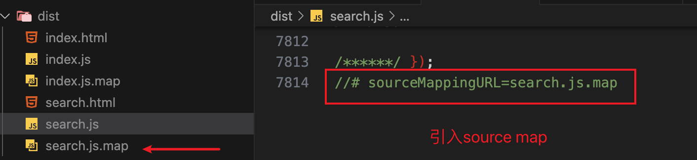
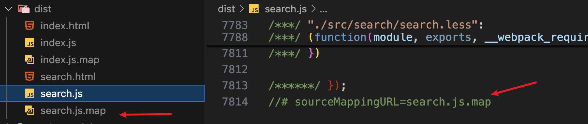

# webpack 实战

本文内容是极客时间[《玩转webpack》](https://time.geekbang.org/course/intro/100028901)课程的内容整理笔记。

## 解析 ES6

webpack 不能识别 ES6 语法，因此需要使用 babel-loader 进行转换。

使用 babel-loader，需要增加 `.babelrc` 增加配置。比如：

```json
{
  // 一个preset可以理解为是一系列plugin的集合
  "presets": [
    "@babel/preset-env",
  ],
  // 一个plugin可以理解为一个功能
  "plugins": [
    "@babel/proposal-class-properties",
  ]
}
```

安装依赖：

```bash
npm i @babel/core@7.26.0 @babel/preset-env@7.26.0 babel-loader@8.0.5 -D
```

创建 `.babelrc` 文件，增加 ES6 配置：

```json
{
  "presets": [
    // es6的babel配置
    "@babel/preset-env",
  ]
}
```

修改 webpack 配置：

```js
module.exports = {
  module: {
    rules: [
      test: /.js$/,
      use: 'babel-loader',
    ]
  }
}
```

## 解析 React JSX

所需依赖：react、react-dom、@babel/preset-react。

安装依赖：

```bash
npm i react@16.8.6 react-dom@16.8.6 @babel/preset-react@7.0.0 -D
```

`.babelrc` 文件增加 React 的 babel preset 配置。

```js
{
  "presets": [
    // es6的babel配置
    "@babel/preset-env",
    // react的babel配置
    "@babel/preset-react",
  ]
}
```

## 代码压缩

### JS 代码压缩

在 webpack4 中，已经内置了 uglify-webpack-plugin 这个插件，打包出来的 JS 文件默认已经压缩过，无需再手动调用。

当然也可以手动调用，去修改它的配置参数，比如开启并行压缩。

### CSS 代码压缩

所需依赖：optimize-css-assets-webpack-plugin、cssnano 预处理器。

安装依赖：

```bash
npm i optimize-css-assets-webpack-plugin@5.0.1 cssnano@4.1.10 -D
```

修改配置：

```js
const OptimizeCSSAssetsPlugin = require('optimize-css-assets-webpack-plugin');

module.exports = {
  plugins: [
    new OptimizeCSSAssetsPlugin({
      assetNameRegExp: /\.css$/g,
      cssProcessor: require('cssnano'),
    })
  ]
}
```

### HTML 文件压缩

所需插件：html-webpack-plugin，设置压缩参数。

安装依赖：

```bash
npm i html-webpack-plugin@3.2.0 -D
```

修改配置：

```js
const HtmlWebpackPlugin = require('html-webpack-plugin');

module.exports = {
  plugins: [
    new HtmlWebpackPlugin({
      template: path.join(__dirname, "src/search/index.html"),
      filename: "search.html",
      // 指定生成的html要使用哪些chunk
      chunks: ["search"],
      // css、js自动注入到html中
      inject: true,
      // 设置HTML文件的压缩参数
      minify: {
        html5: true,
        collapseWhitespace: true,
        preserveLineBreaks: false,
        minifyCSS: true,
        minifyJS: true,
        removeComments: false,
      },
    })
  ]
}
```

## 自动清理构建目录产物

不太优雅的做法：通过 npm scripts 清理构建目录，在执行打包命令之前先删除目录。

```bash
rm -rf ./dist && webpack

rimraf ./dist && webpack
```

使用插件：clean-webpack-plugin。

安装依赖：

```bash
npm i clean-webpack-plugin@2.0.2 -D
```

修改配置：

```js
const CleanWebpackPlugin = require('clean-webpack-plugin');

module.exports = {
  plugins: [
    new CleanWebpackPlugin(),
  ]
}
```

## postcss插件autoprefixer自动补齐css属性前缀

根据 Can I Use 规则（ https://caniuse.com/ ），决定是否增加css属性前缀。

所需依赖：postcss-loader autoprefixer。

安装依赖：

```bash
npm i postcss-loader@3.0.0 autoprefixer@9.5.1 -D
```

增加配置：

```js
// webpack.config.js
module.exports = {
  module: {
    rules: [
      {
        test: /.less$/,
        use: [
          'style-loader',
          "css-loader",
          "less-loader",
          {
            loader: "postcss-loader",
            options: {
              plugins: () => [
                require("autoprefixer")({
                  browsers: ["last 6 version", ">1%", "ios 4"],
                }),
              ],
            },
          },
        ],
      },
    ]
  }
}
```

## 静态资源内联

所谓静态资源内联，就是在 HTML 文件中引入静态资源，比如图片、js、css等。

资源内联的意义：

1、代码层面

- 页面框架的初始化脚本

- 上报相关打点

- css 内联可避免页面闪动

2、请求层面

- 减少 HTTP 请求次数。小图片或者字体可以内联到 HTML 中，使用 url-loader。

### HTML、js内联

所需依赖：raw-loader。

HTML 内联：`${require('raw-loader!./meta.html')}`。

JS 内联：`<script>${require('raw-loader!babel-loader!../../node_modules/lib-flexible/flexible.js')}</script>`。

安装依赖，raw-loader 选择安装 0.5.x 的版本，高版本有问题。

```bash
npm i raw-loader@0.5.1 -D
```

HTML 文件使用 raw-loader：

```shell
.
├── src
│   ├── index
│   │   ├── index.html
│   │   └── index.js
|   |
│   ├── search
│       ├── index.html
|       ├── index.js
|       ├── search.less
│       └── meta.html
├── .gitignore
├── package.json
├── webpack.prod.js
...
```

```html
<!-- src/search/meta.html -->
<meta charset="UTF-8">
<meta name="viewport" content="viewport-fit=cover,width=device-width,initial-scale=1,user-scalable=no">
<meta name="format-detection" content="telephone=no">
<meta name="keywords" content="now,now直播,直播,腾讯直播,QQ直播,美女直播,附近直播,才艺直播,小视频,个人直播,美女视频,在线直播,手机直播">
<meta name="name" itemprop="name" content="NOW直播—腾讯旗下全民视频社交直播平台"><meta name="description" itemprop="description" content="NOW直播，腾讯旗下全民高清视频直播平台，汇集中外大咖，最in网红，草根偶像，明星艺人，校花，小鲜肉，逗逼段子手，各类美食、音乐、旅游、时尚、健身达人与你24小时不间断互动直播，各种奇葩刺激的直播玩法，让你跃跃欲试，你会发现，原来人人都可以当主播赚钱！">
<meta name="image" itemprop="image" content="https://pub.idqqimg.com/pc/misc/files/20170831/60b60446e34b40b98fa26afcc62a5f74.jpg"><meta name="baidu-site-verification" content="G4ovcyX25V">
<meta name="apple-mobile-web-app-capable" content="no">
<meta http-equiv="X-UA-Compatible" content="IE=Edge,chrome=1">
<link rel="dns-prefetch" href="//11.url.cn/">
<link rel="dns-prefetch" href="//open.mobile.qq.com/">

<!-- src/search/index.html -->
<!DOCTYPE html>
<html lang="en">
<head>
  <!-- 引入meta.html文件的内容 -->
  ${require('raw-loader!./meta.html')}
  <title>Document</title>
  <!-- 引入lib-flexible的flexible.js文件，babel-loader转化ES6语法 -->
  <script>${require('raw-loader!babel-loader!../../node_modules/lib-flexible/flexible.js')}</script>
</head>
<body>
  <div id="root"></div>
</body>
</html>
```

### css内联

#### 方案一：使用 style-loader。

```js
module.exports = {
  module: {
    rules: [
      {
        test: /.scss$/,
        use: [
          {
            loader: 'style-loader',
            options: {
              // 样式插入到head标签顶部，bottom就是head的底部
              insertAt: 'top',
              // 将所有的style标签合并成一个
              singleton: true,
            }
          },
          'css-loader',
          'scss-loader',
        ]
      }
    ]
  }
}
```

样式插入到head标签顶部，所有style标签合并成一个：


样式插入到head标签底部，style标签不合并：


#### 方案二：使用 html-inline-css-webpack-plugin。

核心思路是：将页面打包过程的产生的所有 CSS 提取成一个独立的文件，然后将这个 CSS 文件内联进 HTML head 里面。这里需要借助 mini-css-extract-plugin 和 html-inline-css-webpack-plugin 来实现 CSS 的内联功能。

安装依赖：

```bash
npm i html-inline-css-webpack-plugin@1.2.1 mini-css-extract-plugin@0.6.0 -D
```

修改配置：

```js
module.exports = {
  module: {
    rules: [
      {
        test: /.less$/,
        use: [
          MiniCssExtractPlugin.loader,
          "css-loader",
          "less-loader",
        ],
      },
    ]
  }
  plugins: [
    new MiniCssExtractPlugin({
        filename: '[name]_[contenthash:8].css'
    }),
    new HtmlWebpackPlugin(),
    new HTMLInlineCSSWebpackPlugin()
  ]
};
```

注：html-inline-css-webpack-plugin 需要放在 html-webpack-plugin 后面。


#### 两种方式区别

使用 html-inline-css-webpack-plugin，生成的 html 静态文件中已经引入了样式。

而 style-loader 生成的 html 文件本身是没有引入样式的，是在运行 html 文件的时候动态引入，因此查看网页源代码可以看到样式引入。

:::warning
style-loader 插入样式是一个动态的过程，你可以直接查看打包后的 html 源码，并不会看到 html 有 style 样式的。

css-loader 的作用是将 css 转换成 commonjs 对象，也就是样式代码会被放到 js 里面去了。style-loader 是代码运行时动态的创建 style 标签，然后将 css style 插入到 style 标签里面去，对应的源码：https://github.com/webpack-contrib/style-loader/blob/master/src/runtime/injectStylesIntoStyleTag.js#L260

html-inline-css-webpack-plugin CSS 内联的思路是：先将 css 提取打包成一个独立的 css 文件（使用MiniCssExtractPlugin.loader），然后读取提取出的 css 内容注入到页面的 style 里面去。这个过程在构建阶段完成。
:::

### 更多文章

[webpack4如何实现资源内联](https://github.com/cpselvis/blog/issues/5){link=static}

## 多页面应用打包通用方案

多页面应用（MPA）概念：每⼀次⻚⾯跳转的时候，后台服务器都会给返回⼀个新的 html ⽂档，这种类型的⽹站也就是多⻚⽹站，也叫做多⻚应⽤。

现状：每多一个页面，都需要修改 webpack 配置，在 entry 中增加一个入口，同时要增加一个 html-webpack-plugin 配置，删除一个页面也是同理，非常麻烦。

多页面打包期望效果：增加或删除页面，不需要手动修改 webpack 配置，可以自动生成配置。

主要思路：读取指定目录下的文件（这个目录路径是需要提前约定好的，比如都是按照 `src/search/index.js` 这样的方式组织文件目录，入口文件名都约定为 `index.js`），在打包的时候动态设置 entry 和 html-webpack-plugin 配置。

需要使用到的依赖：[glob](https://www.npmjs.com/package/glob/v/7.2.3)。使用 `glob.sync()` 方法匹配所有满足条件的文件路径。

安装依赖：

```bash
npm i glob@7.1.4 -D
```

修改 webpack 配置，动态匹配 src 目录下每个页面的 index 文件路径，然后设置 entry 和 html-webpack-plugin 配置。

```js
const setMPA = () => {
  const entry = {};
  const htmlWebpackPlugins = [];

  // ['C:/Users/xxx/src/index/index.js','C:/Users/xxx/src/search/index.js']
  const entryFile = glob.sync(path.join(__dirname, './src/*/index.js'));
  Object.keys(entryFile).map(value => {
    // 'C:/Users/xxx/src/search/index.js'
    const entryFile = entryFile[value];
    // [
    //   'src/search/index.js',
    //   'search',
    //   index: 81,
    //   input: 'C:/Users/xxx/src/search/index.js',
    //   groups: undefined
    // ]
    const match = entryFile.match(/src\/(.*)\/index\.js/);
    const pageName = match && match[1];
    entry[pageName] = entryFile;
    htmlWebpackPlugins.push(new HtmlWebpackPlugin({
      template: path.join(__dirname, `src/${pageName}/index.html`),
      filename: `${pageName}.html`,
      // 指定生成的html要使用哪些chunk
      chunks: [pageName],
      // css、js自动注入到html中
      inject: true,
      minify: {
        html5: true,
        collapseWhitespace: true,
        preserveLineBreaks: false,
        minifyCSS: true,
        minifyJS: true,
        removeComments: false,
      },
    }))
  })

  return {
    entry,
    htmlWebpackPlugins,
  }
}

const { entry, htmlWebpackPlugins } = setMPA();

module.exports = {
  entry,
  plugins: [
    ...htmlWebpackPlugins,
    new HTMLInlineCSSWebpackPlugin(),
    new CleanWebpackPlugin(),
  ]
}
```

## 使用 source map

什么是 source map：source map 是一个信息文件，记录这转换后的代码与转换前的代码的位置对应关系。有了它，代码报错的时候，浏览器就可以直接显示原始代码，而不是转换后的代码。为开发者调试提供了很大方便。

[JavaScript Source Map 详解](https://www.ruanyifeng.com/blog/2013/01/javascript_source_map.html){link=static}

一般在开发环境开启 source map，在生产环境关闭，避免泄露源代码。

线上排查问题可以将 source map 上传到错误监控系统。

source map 关键字：

- eval：使用 eval 包裹模块代码。

- source map：产生 `.map` 文件。

- cheap：不包含列信息。

- inline：将 `.map` 作为 DataURI 嵌入，不单独生成 `.map` 文件。

- module：包含 loader 的 source map。


在 webpack 配置中，通过设置 `devtool` 参数来开启 source map。

```js
module.exports = {
  devtool: 'source-map',
}
```

不同类型的 source map 的区别：

### `devtool: 'eval'`

每个模块的代码用 `eval()` 包裹，不会生成 source map 文件。这种方式可以加快构建速度，但调试时只能看到编译后的代码，无法看到原始代码。


### `devtool: 'source-map'`

会生成一个单独的 source map 文件，包含完整的信息，体积较大。调试的时候可以看到原始代码。




### `devtool: 'cheap-source-map'`

生成不包含列信息，只包含行信息的 source map 文件，体积会小一些。调试时只能看到编译后的代码，无法看到原始代码。




### `devtool: 'inline-source-map'`

不单独生成 source map 文件，将 source map 作为 DataURI 嵌入到 bundle 中，会大大增加 bundle 的体积，调试时可以看到原始代码。


## 提取页面公共资源

### html-webpack-externals-plugin

思路：将 React、react-dom 等基础库通过 cdn 引入，不打入 bundle 中。

所需插件：html-webpack-externals-plugin。用于将外部资源（如 CDN 上的库）引入到项目中，而不需要将这些库打包进最终的输出文件中。

安装插件：

```bash
npm i html-webpack-externals-plugin@3.8.0 -D
```

修改 webpack 配置：

```js
module.exports = {
  plugins: [
    new HtmlWebpackExternalsPlugin({
      externals: [
        {
          // 指定要引入的模块名称，和 import ... from "xxx" 中的 xxx 对应
          module: "react",
          // 模块的加载地址
          entry: "https://unpkg.com/react@16/umd/react.development.js",
          // 指定模块在全局作用域中的变量名
          global: "React",
        },
        {
          module: "react-dom",
          entry: "https://unpkg.com/react-dom@16/umd/react-dom.development.js",
          global: "ReactDOM",
        }
      ]
    })
  ]
}
```

生成的 html 中会自动通过 script 标签引入基础包。


### SplitChunksPlugin

SplitChunksPlugin 是 webpack 内置的一个插件，用于分离代码块，无需另外安装。

使用 SplitChunksPlugin 分离基础库和公共业务模块。

修改配置：

```js
const setMPA = () => {
  const entry = {};
  const htmlWebpackPlugins = [];
  const entryFiles = glob.sync(path.join(__dirname, './src/*/index.js'));
  Object.keys(entryFiles).map((index) => {
    const entryFile = entryFiles[index];
    const match = entryFile.match(/src\/(.*)\/index\.js/);
    const pageName = match && match[1];
    entry[pageName] = entryFile;

    htmlWebpackPlugins.push(new HtmlWebpackPlugin({
      template: path.join(__dirname, `src/${pageName}/index.html`),
      filename: `${pageName}.html`,
      // 指定生成的html要使用哪些chunk
      // 要使用分包的chunk，需要额外指定
      // 顺序一般是基础库、公共业务、页面对应chunk
      chunks: ['vendors', 'commons', pageName],
      inject: true,
    }));
  })

  return {
    entry,
    htmlWebpackPlugins,
  }
}

module.exports = {
  optimization: {
    splitChunks: {
      // 最小体积，包大小大于minSize才会提取出来，单位是Bytes字节
      minSize: 0,
      cacheGroups: {
        // 如果设置了name，打包的chunk会命名为name，否则使用键名作为chunk名称
        vendors: {
          test: /(react|react-dom)/,
          // test: /[\\/]node_modules[\\/](react|react-dom)/,
          // 如果要使用，需要把name对应的属性添加到htmlWebpackPlugin的chunk参数数组里
          name: 'vendors',
          chunks: 'all',
        },
        commons: {
          name: 'commons',
          chunks: 'all',
          // 至少引用2次才提取
          minChunks: 2,
        }
      },
    }
  }
}
```

两段正则的区别：

- `/(react|react-dom)/`：匹配路径中包含 `react` 或 `react-dom` 的模块，匹配规则更加宽松，一般 react 和 react-dom 都在 node_modules 目录下。

- `/[\\/]node_modules[\\/](react|react-dom)/`：匹配 node_modules 目录下的 react 和 react-dom 模块，匹配规则更加严格。一般建议使用匹配更严格的写法，避免匹配到其它路径的模块。

## 代码分割与动态import

对于⼤的 Web 应⽤来讲，将所有的代码都放在⼀个⽂件中显然是不够有效的，特别是当你的某些代码块是在某些特殊的时候才会被使⽤到。

webpack 有⼀个功能就是将你的代码库分割成 chunks（语块），当代码运⾏到需要它们的时候再进⾏加载。

代码分割的场景：

- 抽离公共代码，比如基础包、公共业务模块等。

- 脚本懒加载，使得初始下载的代码体积更小。

懒加载 JS 脚本的方式：

- CommonJS：require 语句。require 语句本身就支持动态引入模块的。

- ES6：动态 import。目前没有原生支持，需要 babel 转换。

#### 动态 import 的使用

安装插件：

```bash
npm i @babel/plugin-syntax-dynamic-import@7.2.0 -D
```

增加 `.babelrc` 文件配置：

```js
{
  "presets": [
    // es6的babel配置
    "@babel/preset-env",
    // react的babel配置
    "@babel/preset-react",
  ],
  "plugins": [
    // 动态 import 配置
    "@babel/plugin-syntax-dynamic-import"
  ]
}
```

增加 Text 组件：

```jsx
// text.js
import React from 'react';

export default () => <div>动态 import</div>
```

点击动态引入 Text 组件：

```js
class Search extends React.Component {
  state = {
    Text: null,
  }

  loadComponent = () => {
    // 动态加载Text组件
    import('./text.js').then((Text) => {
      this.setState({ Text: Text.default });
    })
  }

  render() {
    const { Text } = this.state;
    return <div className='search-text'>
      Search Text
      { Text ?  <Text /> : null }
      
    </div>
  }
}
```

运行效果：点击图片后会使用 jsonp 方式请求 JS 文件。


## Tree-shaking 的使用和原理分析

### 概念

什么是 Tree-shaking 摇树优化？

Tree-shaking 是指对没有使用的代码进行删除，减小打包体积。

在 Webpack 打包时，1个模块可能会有多个方法，只要其中某个方法被使用到了，整个文件都会被打到 bundle 里面去。这些没用的冗余方法实际上没必要打包进去。Tree-shaking 就是只把使用到的方法打入 bundle，没有使用的方法会在 uglify 阶段被删除掉。

webpack 默认支持 Tree-shaking，在生产模式下自动开启 Tree-shaking。把 mode 设置为 none，就会关闭 tree-shaking。

要求：必须使用 ES6 语法，CJS 的方式不支持。

### 原理

DCE（Dead Code Elimination，死代码消除）：

- 代码不会执行，不可到达。

```js
if (false) {
  console.log('不会执行');
}
```

- 代码执行的结果不会被用到。例如函数的执行返回结果，没有赋值给一个变量。

- 代码只会影响死变量。例如有一段代码修改了某个变量，但是这个变量没有被用到。

Tree-shaking 通过 DCE 分析哪些代码是没用的，然后删除。

Tree-shaking 原理利用了 ES6 模块的特点：

- `import` 语句只能在模块的顶层出现。

- `import` 的模块名称只能是字符串常量。不能动态设置 import 的内容。

- `import` 一个模块之后，不能对它进行修改。

CJS 可以根据不同的条件去 require 不同的模块，因此不能进行 Tree-shaking。

Tree-shaking 其实是对代码进行静态分析，在编译的过程中，哪些模块的代码会使用到，是需要确定下来的。不能在运行时才去分析哪些代码使用到。接着对没有使用到的代码在 uglify 阶段进行擦除。

### 注意点

Tree-shaking 对代码有要求：里面的函数不能有副作用，否则 Tree-shaking 会失效。

:::warning 什么是副作用？
副作用这个概念来源于函数式编程(FP)，纯函数是没有副作用的，也不依赖外界环境或者改变外界环境。纯函数的概念是：接受相同的输入，任何情况下输出都是一样的。

非纯函数存在副作用，副作用就是：相同的输入，输出不一定相同。或者这个函数会影响到外部变量、外部环境。

函数如果调用了全局对象或者改变函数外部变量，则说明这个函数有副作用。
:::

```js
export function pureFunction(a, b) {
    return a + b;
}

export function impureFunction(data) {
    console.log('Logging data:', data);
    return data.length;
}
```

- pureFunction: 这是一个纯函数，因为它只根据输入参数计算结果，并且没有其他副作用。这种函数适合 Tree-shaking。

- impureFunction: 这是一个有副作用的函数，因为它调用了 console.log，这会导致外部状态的变化，并且返回的结果也可能不相同。这种函数不适合 Tree-shaking。

#### 为什么有副作用的函数会影响 Tree-shaking？

Tree-shaking 是一种优化技术，它通过静态分析代码来移除未使用的代码。如果一个函数有副作用，编译器无法确定这个函数是否会被执行，因此会保留这个函数以确保程序的正确性。

例如，如果我们只导入并使用 pureFunction，但不使用 impureFunction，Tree-shaking 会尝试移除 impureFunction 以减少最终打包的文件大小。但由于 impureFunction 有副作用，编译器会保留它，以防止潜在的副作用影响程序的行为。

为了使 Tree-shaking 更有效，尽量编写无副作用的纯函数。如果有副作用的函数，确保它们被显式地调用，而不是依赖于静态分析来决定是否保留。

[谈谈tree-shaking](https://juejin.cn/post/6956522989810614308){link=static}

## Scope Hoisting

Webpack 的 Scope Hoisting 是一种优化技术，旨在减少打包后的代码体积并提高执行效率。具体来说，它有以下几个特点：

- 作用域提升：将多个模块的代码合并成一个大的函数，从而减少函数调用的开销。
- 减少模块包装：通常每个模块会被包裹在一个函数中，Scope Hoisting 可以去掉这些多余的函数包装，直接将模块代码串联起来。
- 依赖分析：Webpack 会分析模块之间的依赖关系，确保合并后的代码仍然能够正确执行。

注意事项：

- 兼容性：某些动态导入（如 import()）可能不支持 Scope Hoisting。
- 副作用：确保模块没有副作用，否则可能会导致意外的行为。可以通过 sideEffects 字段在 package.json 中声明模块是否有副作用。

举个例子，假设有三个模块：

```js
// a.js
export function add(a, b) {
  return a + b;
}

// b.js
import { add } from './a';

export function multiply(a, b) {
  return add(a, b) * 2;
}

// c.js
import { multiply } from './b';

console.log(multiply(1, 2));
```

没有启用 Scope Hoisting 时，webpack 会给每个模块生成一个独立的函数包装，如下所示：

```js
// 生成的打包文件
(function(modules) {
  function require(id) {
    const module = { exports: {} };
    modules[id](module, module.exports, require);
    return module.exports;
  }

  require(0);
})({
  0: function(module, exports, require) {
    const { multiply } = require(1);
    console.log(multiply(1, 2));
  },
  1: function(module, exports, require) {
    const { add } = require(2);
    function multiply(a, b) {
      return add(a, b) * 2;
    }
    module.exports = { multiply };
  },
  2: function(module, exports, require) {
    function add(a, b) {
      return a + b;
    }
    module.exports = { add };
  }
});
```

当我们启用 Scope Hoisting 时，Webpack 会尝试将这些模块的代码合并成一个大的函数，减少函数调用的开销。生成的结果可能如下：

```js
(function() {
  function add(a, b) {
    return a + b;
  }

  function multiply(a, b) {
    return add(a, b) * 2;
  }

  console.log(multiply(1, 2));
})();
```

传统打包：

- 每个模块都有一个独立的函数包装。
- 模块之间通过 require 函数进行依赖管理。
- 代码体积较大，执行时有额外的函数调用开销。

Scope Hoisting：

- 模块代码被合并成一个大的函数。
- 模块之间的依赖关系通过直接调用实现。
- 代码体积更小，执行效率更高。