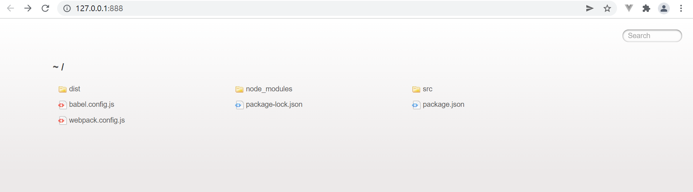
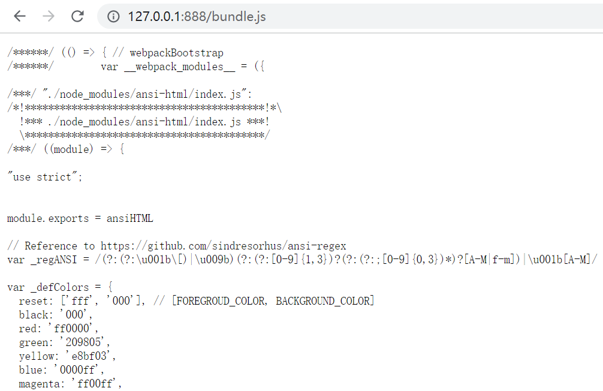

# Webpack

## Webpack 是什么

Webpack 是一个 JavaScript 应用程序静态模块打包工具，可以把互相依赖的 HTML、JS、CSS、图片、字体等资源文件经过一系列的处理，打包成静态的前端项目，生成一个或多个捆绑包（bundle），这些 bundle 可以直接在浏览器上运行。

Webpack 的主要功能包括：

1. 模块打包：Webpack 可以将项目中的各种模块进行静态分析，并将它们打包成一个或多个 bundle。这使得管理项目中的模块变得更加方便，同时也能提高页面加载速度，因为浏览器可以并行加载多个资源。
2. 代码转换：Webpack 可以处理 JavaScript、TypeScript、CSS、SCSS、LESS 等不同类型的文件，并通过 loader 转换它们，例如使用 Babel loader 将 ES6/ES7 代码转换为 ES5，或者使用 CSS loader 和 Style loader 将 CSS 嵌入到 JavaScript 中，再通过 JS 将 CSS 添加到 DOM 中。
3. 模块依赖分析：Webpack 能够分析模块之间的依赖关系，包括直接依赖和间接依赖，然后构建出依赖关系树，以确保在打包时正确地引入依赖的模块。
4. 代码拆分：Webpack 允许将代码拆分成多个 bundle，从而实现按需加载，提高页面加载性能。这对于大型应用程序特别有用，因为它们可能包含大量的代码，但并非所有代码都需要在初始加载时下载。
5. 插件系统：Webpack 提供了丰富的插件系统，使得开发者能够扩展其功能，例如，HtmlWebpackPlugin 生成 HTML 文件，UglifyJsPlugin 压缩 JS 代码。
6. 开发服务器：Webpack 提供了一个开发服务器，可以在本地快速启动一个服务器，支持热模块替换（Hot Module Replacement），使得开发过程更加高效。

## Webpack 初体验

### 初始化项目

```bash
npm init -y
```

项目结构如下。

```shell
.
├── node_modules
├── src
│ │── index.js
│ │── data.js
├── index.html
├── package.json
├── package-lock.json
```

### 安装 webpack

`-D` 是 `--save-dev` 的缩写，表示开发时依赖，只在项目开发阶段用到。
`-S` 是 `--save` 的缩写，表示运行时依赖，即项目打包发布运行时要用到。

Webpack 只在项目开发阶段用到，因此使用 `-D` 参数。

```bash
npm install webpack webpack-cli -D
```

### 书写代码

```js
// index.js
import { getList } from './data'

console.log(getList())
```

```js
// data.js
export function getList() {
  return ['111', '222', '333']
}
```

```html
<!DOCTYPE html>
<html lang="en">
  <head>
    <meta charset="UTF-8" />
    <meta name="viewport" content="width=device-width, initial-scale=1.0" />
    <title>Document</title>
  </head>
  <body>
    <h1>hello webpack</h1>
    <script src="./dist/main.js"></script>
  </body>
</html>
```

### 运行打包命令

```bash
npx webpack
```

打包完成后，就会生成 dist 文件夹，入口文件默认是 main.js。

打包生成的内容如下。

```bash
# main.js
(() => {'use strict';console.log(['111', '222', '333'])})();
```

运行 index.html 文件即可看到页面效果以及控制台打印的文字。

## 配置 webpack

1. 项目根目录中创建 webpack.config.js 配置文件，初始化基本配置：

```javascript
module.exports = {
  // mode 用于指定构建模式，可选值有 development 和 production
  mode: 'development',
}
```

2. 在 `package.json` 文件的 `scripts` 节点下，新增 `dev` 脚本：

```javascript
"scripts" :{
  // 配置好后就能通过 npm run dev 命令执行打包过程
  "dev": "webpack"
}
```

3. 在终端中运行 `npm run dev` 命令，即可启动 webpack 进行项目的打包构建

#### mode 的可选值

- `development`
  - 代表开发环境
  - 不会对打包生成的文件进行**代码压缩**和**性能优化**
  - 打包速度快，适合开发阶段使用
- `production`
  - 代表生产环境
  - 会对打包生成的文件进行代码压缩和性能优化
  - 打包速度慢，仅推荐在发布阶段使用

#### webpack.config.js 文件的作用

webpack.config.js 是 webpack 的配置文件。webpack 在真正开始打包构建之前，会先读取这个配置文件，从而基于给定的配置，对项目进行打包。

#### webpack 中的默认约定

在 webpack 4.x 和 5.x 版本中，默认约定：

- 默认打包入口文件为 `src/index.js`
- 默认输出文件路径为 `dist/main.js`

#### 自定义打包入口和出口

在 webpack.config.js 配置文件中，通过 `entry` 节点指定打包入口，`output` 节点指定打包出口。

```javascript
const path = require('path')

module.exports = {
  entry: path.join(__dirname, './src/index.js'),
  output: {
    path: path.join(__dirname, './dist'), // 输出文件的存放路径
    filename: 'bundle.js', // 输出文件的名称
  },
}
```

## webpack 的插件

### webpack-dev-server

webpack-dev-server 让 webpack 能监听项目源码的变化，从而自动打包构建。

#### 安装 webpack-dev-server

```bash
npm install webpack-dev-server@3.11.2 -D
```

#### 配置 webpack-dev-server

1. 修改 `package.json -> scripts` 的 `dev` 命令：

```js
"scripts": {
  "dev": "webpack serve"
}
```

2. 运行 `npm run dev` 命令，重新打包项目
3. 浏览器访问 `http://localhost:8080` 地址，查看打包效果

#### 打包生成的文件在何处

- 配置 webpack-dev-server 之后，打包生成的文件存放到**内存**中，而不再是存放到物理磁盘上
- 提高实时打包输出的性能



#### 如何访问打包生成的文件

webpack-dev-server 生成的文件默认放在项目根目录中，是虚拟不可见的。

- 在 `/` 后跟上要访问的文件名称，即可访问内存中的文件
- 如 `bundle.js` 表示访问 webpack-dev-server 生成到内存中的 bundle.js 文件



### html-webpack-plugin

html-webpack-plugin 是 webpack 中的 HTML 插件，可以通过此插件自定制 index.html 页面的内容。
通过 html-webpack-plugin 插件，将 src 目录下的 index.html 首页，复制到项目根目录中。

#### 安装 html-webpack-plugin

```bash
npm install html-webpack-plugin@5.3.2 -D
```

#### 配置 html-webpack-plugin

在 webpack.config.js 进行配置：

```js
const HtmlPlugin = require('html-webpack-plugin')

const htmlPlugin = new HtmlPlugin({
  template: './src/index.html', // 指定原文件的路径
  filename: './index.html' // 指定生成文件的路径
})

module.exports => {
  mode: 'development',
  plugins: [htmlPlugin]
}
```

#### html-webpack-plugin 生成的文件

- 通过 html-webpack-plugin 复制到项目根目录中的 index.html 页面，也被放到内存中
- 生成的 index.html 页面，自动注入打包的 bundle.js 文件

### devServer 节点

通过 webpack.config.js 文件的 `devServer` 节点对 webpack-dev-server 插件进行更多的配置。

```js
devServer: {
  open: true, // 初次打包完成后，自动打开浏览器
  host: '127.0.0.1', // 访问地址
  port: 80 // 访问端口号
}
```

## webpack 的 loader 加载器

### loader 概述

webpack 默认只能打包 `.js` 结尾的模块，其他模块需要调用对应的 loader 加载器才能进行打包，即**协助 webpack 打包特定的文件模块**。

- `css-loader` 可打包 `.css` 文件
- `less-loader` 可打包 `.less` 文件
- `babel-loader` 可打包 webpack 无法处理的 JS 高级语法

### loader 调用过程


### 打包 css 文件

1. 运行 `npm i style-loader@3.0.0 css-loader@5.2.6 -D` 命令，安装 loader
2. 在 webpack.config.js 文件的 `module->rules` 数组添加规则：

```javascript
module: {
  rules: [{ test: /\.css$/, use: ['style-loader', 'css-loader'] }]
}
```

- `test` 表示匹配的文件类型，`use` 表示对应调用的 loader
- `use` 数组的 loader 顺序是固定的
- loader 调用顺序是**从后往前**

### 打包 less 文件

1. 运行 `npm i less-loader@10.0.1 less@4.1.1 -D` 命令
2. 在 webpack.config.js 文件的 `module->rules` 数组添加规则：

```js
module: {
  rules: [{ test: /\.less$/, use: ['style-loader', 'css-loader', 'less-loader'] }]
}
```

### 打包与 URL 路径相关的文件

1. 运行 `npm i url-loader@4.1.1 file-loader@6.2.0 -D` 命令
2. 在 webpack.config.js 文件的 `module->rules` 数组添加规则：

```js
module: {
  rules: [{ test: /\.jpg|png|gif$/, use: ['url-loader?limit=22229'] }]
}
```

- `limit` 用于指定图片大小，单位是 byte
- 只有 `<= limit` 大小的图片才会被转为 [base64 格式](https://www.cnblogs.com/ranyonsue/p/8615824.html)的图片

### 打包 JS 文件的高级语法

1. 运行 `npm i babel-loader@8.2.2 @babel/core@7.14.6 @babel/plugin-proposal-decorators@7.14.5 -D` 安装 babel
2. 在 webpack.config.js 文件的 `module->rules` 数组添加规则：

```js
module: {
  rules: [{ test: /\.js$/, use: 'babel-loader', exclude: /node_modules/ }]
}
```

3. 配置 babel：在项目根目录下，创建名为 babel.config.js 的配置文件，定义 Babel 的配置项：

```js
module.exports = {
  // 声明 babel 可用的插件
  plugins: [['@babel/plugin-proposal-decorators', { legacy: true }]],
}
```

## 打包发布

### 为何需要打包发布

- 开发环境下，打包生成的文件存放于内存中，无法得到最终打包生成的文件
- 开发环境下，打包生成的文件不会进行代码压缩和性能优化

### 配置 webpack 的打包发布

在 package.json 文件的 `scripts` 节点，新增 `build` 命令：

```json
"scripts": {
  "dev": "webpack serve",
  "build": "webpack --mode production"
}
```

- `--model` 指定 webpack 的运行模式，会覆盖 webpack.config.js 中的 `model` 选项

### 把 JS 文件统一生成到 js 目录

在 webpack.config.js 配置文件的 `output` 节点中，进行配置:

```js
ouput: {
  path: path.join(__dirname, 'dist'),
  // 将 bundle.js 文件存放到 dist 目录的 js 子目录中
  filename: 'js/bundle.js',
}
```

### 把图片统一生成到 image 目录

修改 webpack.config.js 中的 `url-loader` 配置项，新增 `outputPath` 选项指定图片文件的输出路径：

```js
{
  test: /\.jpg|png|gif$/,
  use: {
    loader: 'url-loader',
    options: {
      limit: 23333,
      // 指明生成的图片存到 dist 目录下的 image 子目录中
      outputPath: 'image'
    }
  }
}
```

### 自动清理 dist 目录下的旧文件

1. 安装 clean-webpack-plugin 插件

```bash
npm install clean-webpack-plugin@3.0.0 -D
```

2. 在 webpack.config.js 文件中进行配置：

```js
const { CleanWebpackPlugin } = require('clean-webpack-plugin')

// plugins 节点挂载 CleanWebpackPlugin 实例对象
plugins: [htmlPlugin, new CleanWebpackPlugin()]
```

### 企业级项目打包发布

企业级项目打包发布的流程更复杂：

- 生成打包报告，根据报告分析具体的优化方案
- Tree-Shaking
- 为第三方库启用 CDN 加载
- 配置组件的按需加载
- 开启路由懒加载
- 自定制首页内容

### 打包后双击 index.html 查看效果

项目 `npm run build` 打包之后，默认情况下在本地双击 `dist/index.html` 是无法看到项目效果的，如果想要看到效果需要进行配置。 `vue.config.js`文件将 `publicPath` 改为 `'./'` 即可，默认为 `'/'` 。

```js
module.exports = {
  publicPath: './',
}
```

## Source Map

### Source Map 为何物

Source Map 就是一个信息文件，里面储存着位置信息，它存储着压缩混淆后的代码，所对应的转换前的位置。当我们运行打包生成的代码出错时，就能通过报错信息定位到**源码的出错位置**。

### Source Map 最佳实践

开发环境下：

- `devtool` 设置为 `eval-source-map`
- 显示源码报错的行数
- 可以精准定位到具体的错误行

生产环境下：

- 关闭 Source Map 或把 `devtool` 设置为 `nosources-source-map`
- 只会显示源码中报错的行数，不会暴露源码
- 防止源码泄露，提高网站安全性

```js
// webpack.config.js 文件
module.exports = {
  mode: 'development',
  devtool: 'eval-source-map',
}
```
