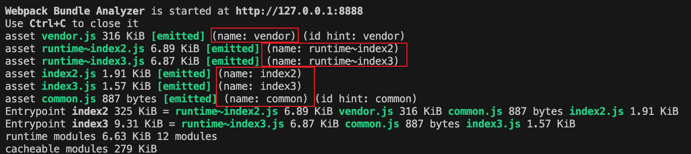
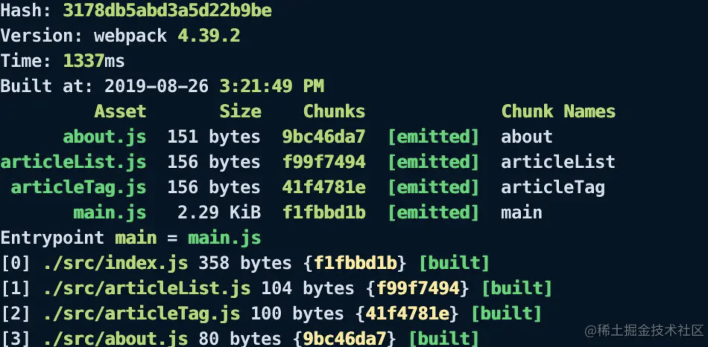

# webpack 深入学习

## webpack 与其它打包工具的不同

在浏览器中运行 JavaScript 有两种方法。

第一种方式，引用一些脚本来存放每个功能。这种方案很难扩展，因为加载太多脚本会导致网络瓶颈。

第二种方式，使用一个包含所有项目代码的大型 js 文件，但这会导致作用域、文件大小、可读性和可维护性方面的问题。

立即调用函数表达式（IIFE）的出现解决了大型项目的作用域问题。当脚本文件被封装在 IIFE 内部时，可以安全地拼接或安全地组合所有文件，而不必担心作用域冲突。因此诞生了一批 Gulp、Grunt 等任务执行器。

但是这样修改一个文件意味着必须重新构建整个文件，拼接可以做到容易地跨文件重用脚本，但却使构建结果的优化变得更加困难。如何判断代码是否实际被使用？即使你只用到 loadash 中的某个函数，也必须在构建结果中加入整个库，接着将它们压缩到一起。如何 treeshake 代码依赖？难以大规模地实现延迟加载代码块，这需要开发人员手动地进行大量工作。

[为什么选择webpack](https://webpack.docschina.org/concepts/why-webpack/){link=card}

## webapck 工作原理

通过 `fs.readFileSync` 读取入口文件，然后通过 `@bable/parser` 获取 ast 抽象语法树，借助 `@babel/core` 和 `@babel/preset-env`，把 ast 语法树转换成合适的代码，最后输出一个文件对象。

它会以一个或多个文件作为打包的入口，在 webpack 处理不同模块依赖时，会将代码分割成多个 chunk，每个 chunk 包含一个或多个模块，最后将整个项目所有文件编译组合成一个或多个 bundle 输出出去。

一个 bundle 可以包含多个 chunk，也可以只包含一个 chunk。

## chunk

chunk 代码块，是 webpack 根据功能拆分出来的。webpack 在处理模块依赖关系时，会将代码分割成多个 chunk，每个 chunk 包含一个或多个模块。

chunk 的生成是由 webpack 的代码分割功能实现的，可以手动配置或自动分割。chunk 是 webpack 的内部概念，不会直接输出到文件系统中。

默认情况下，webpack 会在 dist 输出 chunk 生成的 bundle，文件名就是 chunk 名称。该名称最终会体现在 bundle 的命名上，最终随着 bundle 输出。

### entry 生成 chunk

output.filename 配置输出 chunk 名字。

### 按需加载（异步）产生的 chunk

按需加载（异步）的模块也会产生 chunk，这个 chunk 名称可以在代码中使用 webpackChunkName 自行定义。

如果需要打包时使用 chunk 名称，则需要在 output.chunkFilename 中引用。

```js
module.exports = {
  output: { chunkFilename: "[name].js" },
}

import(/* webpackChunkName: "async-model" */ "./async-model");
```

### 代码分割产生的 chunk

在 webpack5 中代码分割使用 SplitChunkPlugin 插件实现，这个插件内置在 webpack 中，使用时直接用配置的方式即可。

代码分割时也会产生 chunk。

```js
// webpack.config.js
module.exports = {
  entry: {
    index2: './src/index2.js',
    index3: './src/index3.js'
  },
  optimization: {
    // 取值 'multiple' 或 true 都可，根据入口产生多个运行时chunk
    runtimeChunk: 'multiple',
    splitChunks: {
      chunks: 'all',
      cacheGroups: {
        vendor: {
          name: 'vendor',
          test: /node_modules/,
          priority: 10,
          reuseExistingChunk: true,
        },
        common: {
          name: 'common',
          minSize: 0,
          minChunks: 2,
          priority: -10,
          reuseExistingChunk: true
        }
      },
    }
  }
}

// index.js
console.log('🥬  ', 111);

// index2.js
import "./index";
import $ from 'jquery';
console.log('🥬 222 ', $);

// index3.js
import "./index";
console.log('🥬 333 ');
```

上述代码，总共会产生 6 个chunk。

- 两个入口分别分配到名称为 index2 和 index3 的 chunk 中。

- `runtimeChunk: 'multiple'` 的升明，会抽离 webpack 运行时代码到单独的 chunk 中。有两个入口，因此有两份运行时 chunk。

- jquery 符合 cacheGroups.vendor 规则，抽离到名为 vendor 的 chunk 中。

- index.js 符合 cacheGroups.common 规则，抽离到名为 common 的 chunk 中。



## bundle

bundle 是 webpack 输出的最终文件，包含了所有的代码和依赖，可以直接在浏览器中运行。

bundle 就是最终输出一个或多个的文件，大部分情况下一个 chunk 至少会产生一个 bundle，但不完全是一对一的关系。

比如我们在模块中引用图片，又经过 url-loader 打包到外部；或者是引用了样式，通过 extract-text-webpack-plugin 抽离出来，这样一个 chunk 就会出现产生多个 bundle 的情况。

在 webpack 中，可以通过配置来控制 bundle 的数量和大小。

简而言之，bundle 是 chunk 在构建完成的呈现。

## chunk 和 bundle 的区别

简单来说，chunk 是 webpack 在处理模块依赖关系时产生的中间文件，而 bundle 则是最终的输出文件。chunk 是 webpack 内部的概念，不会直接输出到文件系统中，而 bundle 则是 webpack 输出的最终文件，可以直接在浏览器中运行。

:::tip
module、chunk、bundle 其实就是同一份代码，在不同转换场景下的三个名称。

我们直接写出来的是 module，webpack 处理时是 chunk，最后生成的浏览器可直接运行的是 bundle。
:::


index.css 和 common.js 在 index.js 中被引⼊，打包⽣成的 index.bundle.css 和n index.bundle.js 都属于 chunk 0，utils.js 因为是独⽴打包的，它⽣成的 utils.bundle.js 属于 chunk 1。

⼀般来说⼀个 chunk 对应⼀个 bundle，⽐如上图中的 utils.js -> chunks 1 -> utils.bundle.js；但也有例外，⽐如说上图中，就⽤ MiniCssExtractPlugin 从 chunks 0 中抽离出了 index.bundle.css ⽂件。

[webpack 中module、chunk 、bundle 的区别](https://juejin.cn/post/7005530386641977374){link=card}

[webpack——module、chunk和bundle的区别](https://blog.csdn.net/qq_17175013/article/details/119753186){link=card}

## filename & chunkFilename

通过 output 的 filename 和 chunkFilename 控制 chunk 输出的 bundle 命名。

[output中chunkFilename和filename的区别](https://juejin.cn/post/6844904166150651917){link=card}

MiniCssExtractPlugin 也同样有这些字段：

[Webpack - css 文件的代码分割](https://github.com/VenenoFSD/Learn-Webpack4/issues/17){link=card}

## 命名(hash)

webpack 文件打包一般有三种 hash：hash、chunkhash、contenthash。

- hash 是项目级别的，使用 hash 的缺点是，加入只修改了其中一个文件，但是所有文件的文件名里的 hash 都是相同的。

- chunkhash 根据不同的入口文件(entry)进行依赖文件解析，构建对应的 chunk，生成对应的哈希值。

- contenthash 是针对文件内容级别的，只有自己模块的内容改变，哈希值才会改变。

[从源码看webpack的hash策略](https://juejin.cn/post/6844903942384517127){link=card}

[webpack中文件打包 hash、chunkhash、contenthash 的区别](https://juejin.cn/post/7078589390422802440){link=card}

可以使用 webpack 提供的模板字符串定义 bundle 文件名，下面是常用的模板字符串。

|模板|描述|稳定性|
|--|--|--|
|[name]|chunk 的名称|只要chunk名称不修改就不会变化|
|[hash]|根据所有 chunk 生成的 hash|工程某个chunk被修改就会引起变化|
|[chunkhash]|根据chunk生成的hash值|某个chunk被修改，只会引起被修改的chunk的hash|
|[contenthash]|根据bundle内容生成的hash|chunk中某个bundle被修改，只会引起被修改的bundle的hash|

:::warning 注意事项
1. JS 文件的指纹设置 `'[name][chunkhash:8].js'`。

JS 文件为什么不用 contenthash？

因为 JS 引入了 css 模块，若 css 改变，css 使用的是 contenthash，那么 css 的指纹变了。但对于引入 css 的 JS 模块来说，它的内容是没有发生变化的。

因此如果 js 文件使用 contenthash，则 js 模块的指纹不变，导致 js 无法引入更新后的 css 文件。

2. css 文件的指纹设置 `'[name][contenthash:8].css'`。

css 文件为什么不用 chunkhash？

js 使用的是 chunkhash，如果 js 模块发生改变，则 chunkhash 也会改变，导致它引入的 css 模块的 chunkhash 也跟着改变。

但这是不合理的，因为 css 文件本身的内容并没有发生改变。

因此 css 使用 contenthash，只与其自身内容有关，无视被哪个 js 模块引用。

3. Images/Fonts 的指纹设置 `'[name][hash:8].[ext]'`。

注意，图片字体的 hash，和 css、js 的 hash 概念不同，是按内容生成的，不是按编译生成的。
:::

## chunkId

webpack 在随着 chunk 生成 bundle 时，会输出一个 chunkId。



生产环境下 chunkId 是以自增的数字命名，因此增加 chunk 或减少 chunk 时，会导致顺序乱掉。

chunkId 变了，那么引用到该 chunkId 的文件内容也变了，导致缓存失效。因此我们要固定 chunkId。

chunkId 生成策略：

- false：不使用任何算法，通过插件提供自定义算法。

- natural：自然数 ID。

- named：使用 name 值作为 ID，可读性高。

- size：数字 ID，依据最小的初始下载大小。

- total-size：数字 ID，依据最小的总下载大小。

- deterministic: 在不同的编译中不变的短数字 ID。有利于长期缓存，生产模式默认开启。

```js
module.exports = {
  optimization: {
    chunkIds: 'deterministic',
  }
}
```

[深入理解webpack的chunkId对线上缓存的思考](https://juejin.cn/post/6844903924818771981){link=card}

## manifest

webpack manifest 是一个特殊的文件，它用于记录 webpack 编译后的所有资产（包括 JavaScript、css、图像等）的映射关系。这个映射关系可以帮助我们在代码中更方便地引用这些资产，并且在更新资产时，不用担心因为引用资源的路径改变导致的问题。

通常情况下，webpack manifest 会在生产构建中启用，并将其写入到磁盘的一个特定位置，以便在运行时可以快速访问。在生产环境使用 webpack manifest 可以提高应用程序的性能和可靠性。

## 常用的 loader 和 plugin

### loader

- babel-loader：把 ES6 转换成 ES5

- less-loader：将less代码转换成CSS

- css-loader：加载 CSS，⽀持模块化、压缩、⽂件导⼊等特性

- style-loader：把 CSS 代码注⼊到 JavaScript 中，通过 DOM 操作去加载 CSS

- eslint-loader：通过 ESLint 检查 JavaScript 代码

- vue-loader：加载 Vue.js 单⽂件组件

- cache-loader: 可以在⼀些性能开销较⼤的 Loader 之前添加，⽬的是将结果缓存到磁盘⾥

- file-loader：把⽂件输出到⼀个⽂件夹中，在代码中通过相对 URL 去引⽤输出的⽂件 (处理图⽚和字体)

- url-loader：与 file-loader 类似，区别是⽤户可以设置⼀个阈值，⼤于阈值时返回其 publicPath，⼩于阈值时返回⽂件 base64 形式编码 (处理图⽚和字体)

### plugin

- CopyWebpackPlugin：将单个⽂件或整个⽬录复制到构建⽬录

- HtmlWebapckPlugin：简单创建 HTML ⽂件，⽤于服务器访问

- MiniCssExtractPlugin: 分离样式⽂件，CSS 提取为独⽴⽂件，⽀持按需加载 (替代extract-text-Webpack-plugin)

- ParallelUglifyPlugin: 多进程执⾏js代码压缩，提升构建速度

- TerserWebpackPlugin，多进程执⾏js代码压缩，⽀持抽离注释⽂件以及⽀持多种压缩⽅式（terserMinify、UglifyJS、SWC等）

- postcss-sprites：自动生成精灵图

[使用 webpack 的各种插件提升你的开发效率](https://juejin.cn/post/6844903795512573966){link=card}