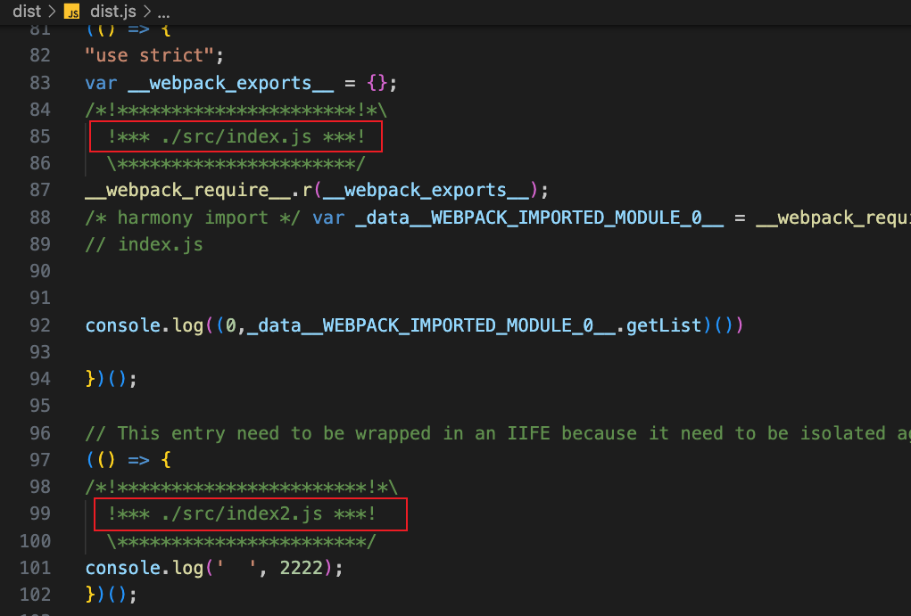
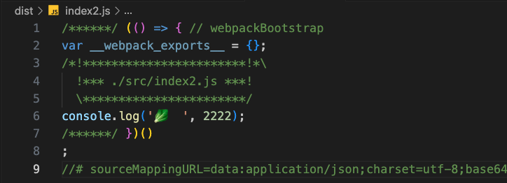
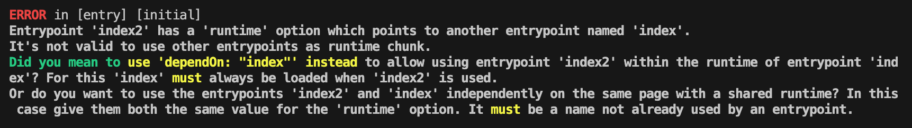
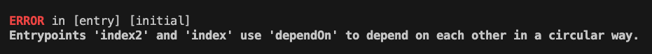

# webpack 深入学习

## webpack 是什么

webpack 是一个强大的模块打包工具，用于处理和打包 JavaScript 应用程序的依赖关系。它能够把许多分散的模块按照依赖关系打包成一个或多个捆绑包（bundle），这些 bundle 可以直接在浏览器中运行。

:::tip [webpack](https://www.webpackjs.com/concepts/)
本质上，webpack 是一个用于现代 JavaScript 应用程序的静态模块打包工具。当 webpack 处理应用程序时，它会在内部从一个或多个入口点构建一个依赖图，然后将项目中所需的每个模块组合成一个或多个 bundles。它们都是静态资源，用于展示你的内容。
:::

从而减少页面的请求次数和加载时间，提高网页的性能和用户体验。

它的主要功能如下：

1. 模块化管理。webpack 支持多种模块化方案，包括 CommonJS、AMD、ES6 模块等。可以将多个模块打包成一个或多个文件，使代码更加清晰、易于维护和重用。

2. 自动化构建。webpack 提供了丰富的插件和工具，可以自动化完成**编译、打包、压缩、混淆**等一系列操作，大大提高了前端开发的效率和质量。

3. 资源优化。webpack 可以对不同类型的资源进行优化，如脚本、样式、图片、字体等，可以**自动压缩、合并、缓存**等，从而减少页面的请求次数和加载时间，提高网页的性能和用户体验。

4. 插件机制。webpack 提供了强大的插件机制，可以通过插件扩展，定制自己的构建流程和功能，满足不同项目的需求。

5. 社区支持。webpack 有庞大的社区支持，提供了丰富的文档、教程和示例，可帮助开发者快速入门和解决问题。

## 入口(entry)

### 单入口

用法：`entry: string | [string]`。

```js
// 简写形式
module.exports = {
  entry: './src/index.js',
}

// 完整形式
module.exports = {
  entry: {
    main: './src/index.js',
  },
}
```

可将一个文件路径的数组作为 entry 的属性值，此时创建了 `multi-main entry`。

这样可以一次性注入多个依赖文件，并将他们的依赖关系绘制在一个 chunk 中。

```js
// 简写形式
module.exports = {
  entry: ['./src/index.js', './src/index2.js'],
}

// 完整形式
module.exports = {
  entry: {
    main: ['./src/index.js', './src/index2.js'],
  },
}
```

可以看到，这两个文件被打包在同一个 chunk 中。



### 对象语法

#### 基本使用

用法：`entry: { <entryChunkName> string | [string] } | {}`。

对象语法指定**将哪些文件打包在同一个 chunk 中**，生成多个 chunk。

注意，使用多个入口的对象语法，必须对应地使用输出(output)多个出口的写法。

否则报错，`Error: Conflict: Multiple chunks emit assets to the same filename dist.js (chunks index and index2)`。

```js
module.exports = {
  entry: {
    index: './src/index.js',
    index23: ['./src/index2.js', './src/index3.js'],
  },
  output: {
    filename: '[name].js', // 指定打包后的文件名
    path: path.resolve(__dirname, 'dist'),
  },
}
```

打包后，生成了2个chunk。


:::danger TIP
“webpack 配置的可扩展” 是指，这些配置可以重复使用，并且可以与其他配置组合使用。这是一种流行的技术，用于将关注点从环境(environment)、构建目标(build target)、运行时(runtime)中分离。然后使用专门的工具（如 webpack-merge）将它们合并起来。

当你通过插件生成入口时，你可以传递空对象 {} 给 entry。
:::

### 描述入口的对象

入口的对象语法有如下的属性。

- `dependOn`：当前入口所依赖的入口。它们必须在该入口加载前被加载。
- `filename`：指定要输出的文件名称。
- `import`：启动时需加载的模块。
- `library`：指定 library 选项，为当前 entry 构建一个 library。
- `runtime`：运行时 chunk 的名字。如果设置了，会创建一个新的运行时 chunk。在 webpack 5.43.0 后可将其设为 false，以避免一个新的运行时 chunk。
- `publicPath`：当该入口的输出文件在浏览器被引用时，为它们指定一个公共 URL 地址。详见 [ouput.publicPath](https://www.webpackjs.com/configuration/output/#outputpublicpath)。

```js
module.exports = {
  entry: {
    index: './src/index.js',
    index2: {
      // dependOn: 'index',
      import: './src/index2.js',
    },
  },
}
```

上述配置，设置了 `dependOn` 前后的区别如下。




:::danger 注意事项
1. `runtime` 和 `dependOn` 不能在同一个入口上同时使用，否则配置无效，且会抛出错误。

```js
module.exports = {
  entry: {
    index: './src/index.js',
    index2: {
      runtime: 'run2',
      dependOn: 'index',
      import: './src/index2.js',
    },
  },
}
```


2. `runtime` 不能指向已经存在的入口名称，否则会报错。

```js
module.exports = {
  entry: {
    index: './src/index.js',
    index2: {
      runtime: 'index',
      import: './src/index2.js',
    },
  },
}
```



3. `dependOn` 不能循环引用，否则会报错。

```js
module.exports = {
  entry: {
    index: './src/index.js',
    index2: {
      runtime: 'index',
      import: './src/index2.js',
    },
  },
}
```


:::

## 入口常见场景

### 分离APP和vendor(第三方库)入口

```js
module.exports = {
  entry: {
    app: './src/app.js',
    vendor: './src/vendor.js'
  },
}
```

配置了 2 个单独的入口点。

这样就可在 `vendor.js` 中存入未做修改的必要 library 或文件（如 Bootstrap、jQuery、图片等），将它们打包在一起生成单独的 chunk。

:::warning 注意事项
在 webpack < 4 的版本中，通常将 vendor 作为一个单独的入口起点添加到 entry 选项中，以将其编译为一个单独的文件（与 `CommonsChunkPlugin` 结合使用）。

而在 webpack 4 中不鼓励这样做。而是使用 `optimization.splitChunks` 选项，将 vendor 和 app(应用程序) 模块分开，并为其创建一个单独的文件。不要为 vendor 或其他不是执行起点创建 entry。
:::

### 多页面应用程序

```js
module.exports = {
  entry: {
    pageOne: './src/pageOne/index.js',
    pageTwo: './src/pageTwo/index.js',
    pageThree: './src/pageThree/index.js',
  },
};
```

告诉 webpack 需要三个独立分离的依赖图。

在多页面应用程序中，server 会拉取一个新的 HTML 文档给你的客户端。页面重新加载此新文档，并且资源被重新下载。然而，这给了我们特殊的机会去做很多事，例如使用 `optimization.splitChunks` 为页面间共享的应用程序代码创建 bundle。由于入口起点数量的增多，多页应用能够复用多个入口起点之间的大量代码/模块，从而可以极大地从这些技术中受益。

[webpack多页面打包实践](https://zhuanlan.zhihu.com/p/109527475){link=card}

[webpack 拆包：关于 splitChunks 的几个重点属性解析](https://segmentfault.com/a/1190000042093955){link=card}

## 出口(output)

`output` 属性用于配置 webpack 打包生成的文件输出到哪里，以及如何命名这个文件。

输出文件路径和文件名默认值是 ``./dist/main.js`。

```js
const path = require('path');
module.exports = {
  output: {
    filename: 'bundle.js', // 指定打包后的文件名
    path: path.resolve(__dirname, 'dist'), // 指定打包文件生成的目录
  },
}
```

如果 entry 配置了多个入口起点，则需使用占位符确保每个输出文件具有唯一的名称。否则会报错。

`[name]` 是指入口文件的文件名，`[contenthash]` 是指根据文件内容生成的 hash 值，`[contenthash:8]` 表示只取前 8 位。

```js
const path = require('path');
module.exports = {
  output: {
    filename: '[name].[contenthash:8].js', // 指定打包后的文件名
    path: path.resolve(__dirname, 'dist'), // 指定打包文件生成的目录
  },
}
```

## loader

loader 好文。

[看完这篇webpack-loader，不再怕面试官问了](https://juejin.cn/post/6844904054393405453){link=card}

[Loader原理](https://learn.fuming.site/front-end/Webpack/origin/loader.html){link=card}

### 概述

webpack 只能处理打包 JavaScript 和 JSON 文件，这是 webpack 开箱可用的自带能力。

loader 让 webpack 能够处理其他类型的文件，并将它们转换为有效模块，以供应用程序使用，以及被添加到依赖图中。

一个 loader 的职责是单一的，只需要完成一种转换。若一个源文件需要经历多步转换才能正常使用，就要通过多个 loader 去转换。在调用多个 loader 处理一个文件时，每个 loader 会链式执行，第一个 loader 会拿到需要处理的原内容。上一个 loader 处理后的结果会传递给下一个 loader，最后一个 loader 将处理完成的最终结果返回给 webpack。

因此，在开发一个 loader 的时候，请保持其职责的单一性，只需要关注输入和输出。

### 基本使用

loader 有两个属性。

- `test`：用于匹配要处理的文件。

- `use`：用于指定在进行转换时，要使用的 loader。

```js
module.exports = {
  module: {
    rules: [
      { test: /\.txt$/, use: 'raw-loader' },
    ]
  }
}
```

上述配置，对一个单独的 module 对象定义了 rules 属性。这告诉 webpack 编译器(compiler) 如下信息：

> ”嘿，webpack 编译器，当你碰到 「在 `require()/import` 语句中被解析为 `.txt` 的路径」时，在你对它打包之前，先 use(使用) `raw-loader` 转换一下。“

`/\.txt$/` 与 `'/\.txt$/'`、`"/\.txt$/"` 不一样。前者表示 webpack 匹配任何以 .txt 结尾的文件，后者表示 webpack 匹配具有绝对路径 '.txt' 的单个文件。

如果不用正则表达式，使用字符串的形式匹配，必须填入正确的绝对路径，让 webpack 可以正确匹配到对应的文件。

```js
module.exports = {
  module: {
    rules: [
      { test: '/Users/xxx/Documents/webpackTest/src/index.css', use: 'css-loader' },
    ]
  }
}
```

`'./index.css'` 会如下报错。


### 多个loader转换

如果配置了多个 loader，loader 的执行顺序是从右到左，从下到上。

```js
module.exports = {
  module: {
    rules: [
      // 从右到左
      { test: /\.css$/, use: ['style-loader', 'css-loader'] },
      // 从下到上，其实也是从右到左，use属性都是数组
      {
        test: /\.css$/,
        use: [
          { loader: 'style-loader' },
          {
            loader: 'css-loader',
            options: {
              modules: true,
            },
          },
          { loader: 'sass-loader' },
        ],
      },
    ]
  }
}
```

## 手撸 loader

### 基础结构

webpack 是运行在 Node.js 之上的，一个 loader 就是一个 Node.js 模块，这个模块需要导出一个函数。

这个函数的职责就是获取处理前的原内容，对原内容执行转换逻辑后，返回处理后的内容。

```js
module.exports = function(source) {
  // source 为 compiler 传递给 Loader 的⼀个⽂件的原内容
  // 该函数需要返回处理后的内容
  // 这⾥简单起⻅，直接把原内容返回，相当于该 loader 没有做任何转换
  return source;
}
```

由于 loader 运行在 Node.js 中，因此可以调用任何 Node.js 自带的 API，或安装第三方模块进行调用。

### 获得 loader 的 options