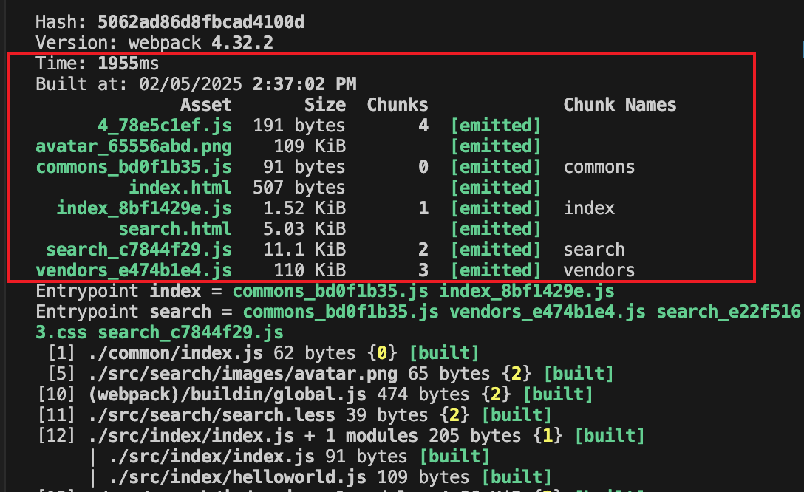
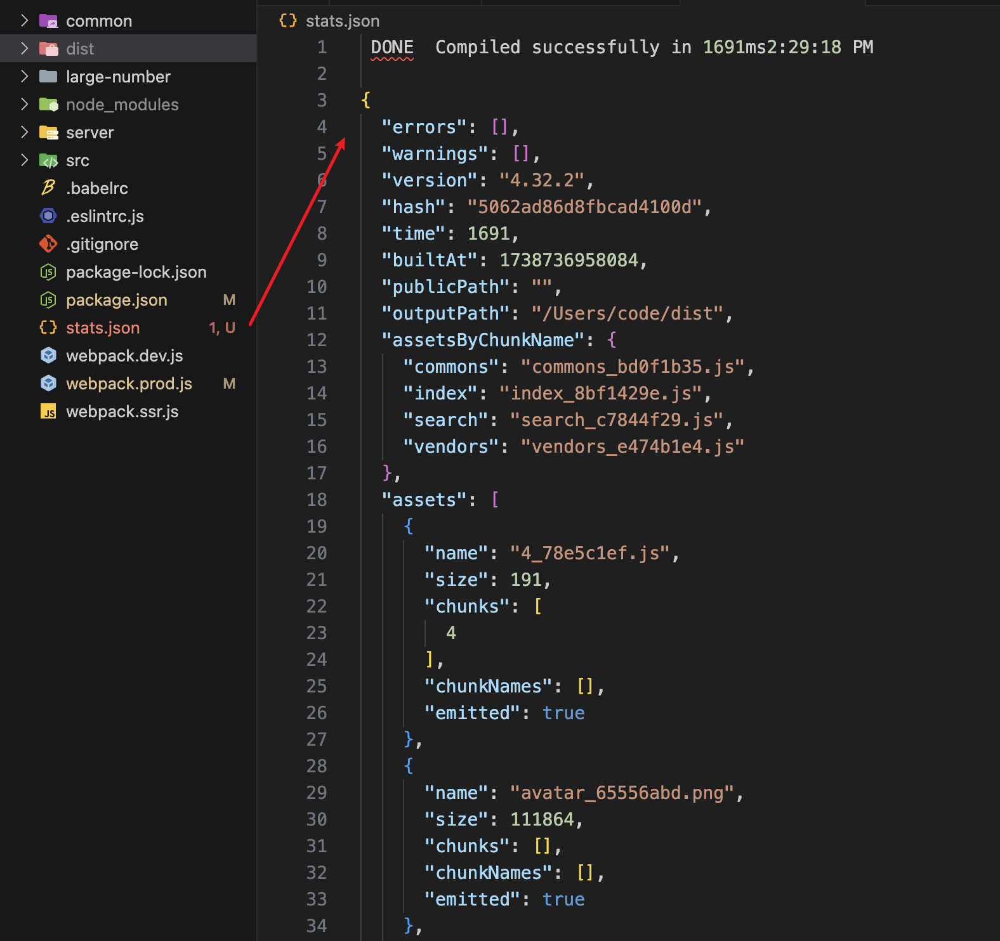

# webpack 构建速度和体积优化

## 使用webpack内置的stats分析体积

webpack 的内置对象 stats 存储着构建的统计信息，包括构建花费的总时间、每个模块的大小等。

webpack 每次构建完成打印出来的内容就是 stats 的统计信息，需要删掉 `stats: "errors-only"` 等精简 stats 输出的配置。



也可以把 stats 以 JSON 文件的形式输出到磁盘，在 package.json 文件中增加 scripts 配置项：

```json
"scripts": {
  "build:stats": "webpack --config webpack.prod.js --json > stats.json"
}
```



stats 分析构建包体积的缺陷是，只能看到最终的构建包体积大小，分析的颗粒度太大，看不出问题所在，不知道是什么原因导致构建包体积大，看不出哪个模块比较大，也看不出哪一个 loader 执行比较耗时。