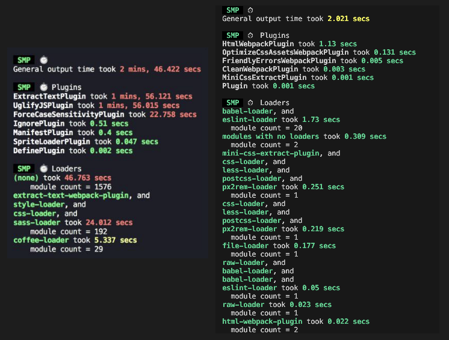
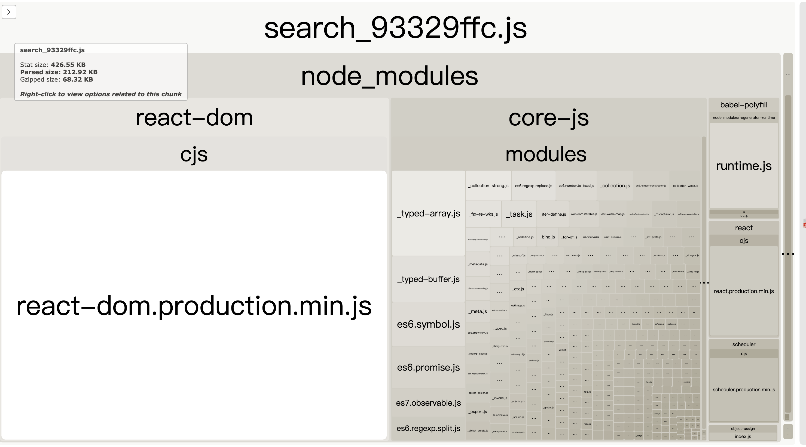
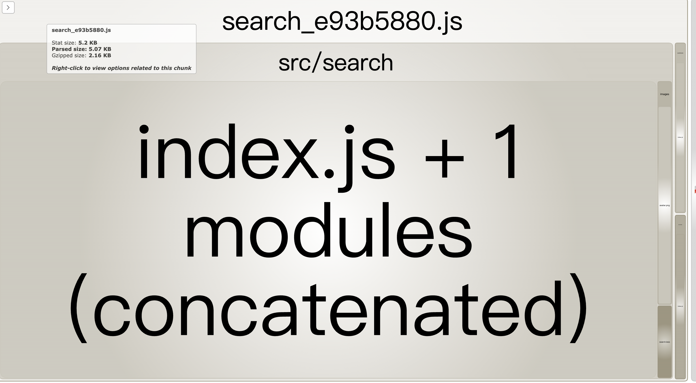
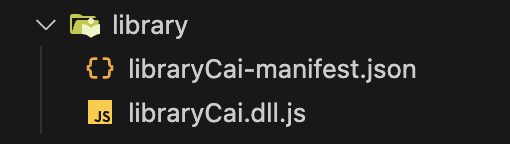
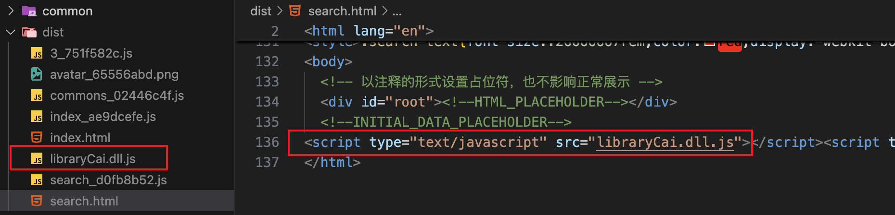
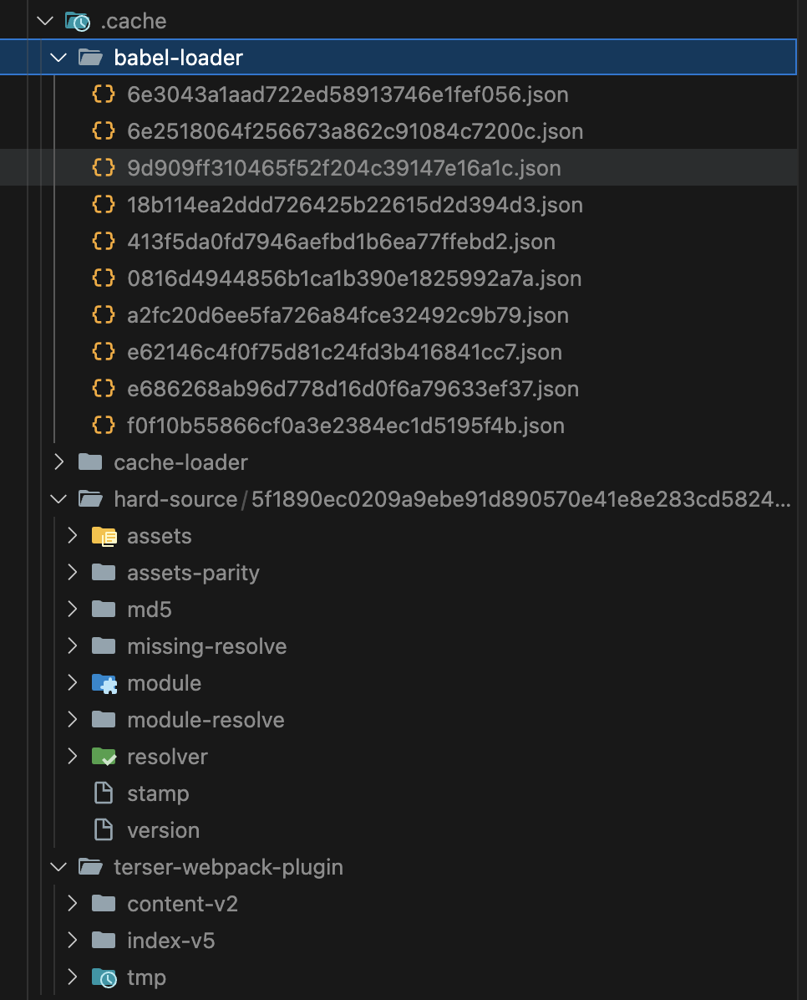
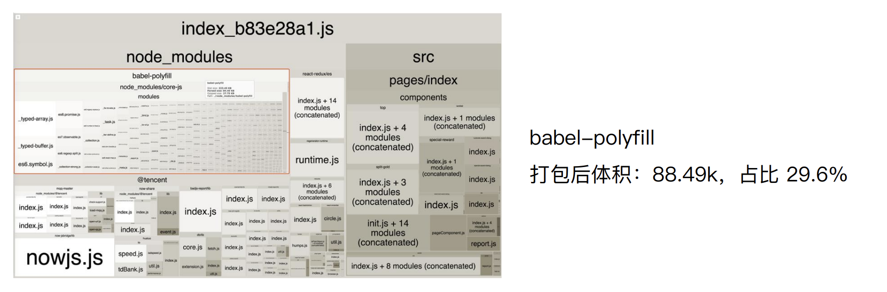
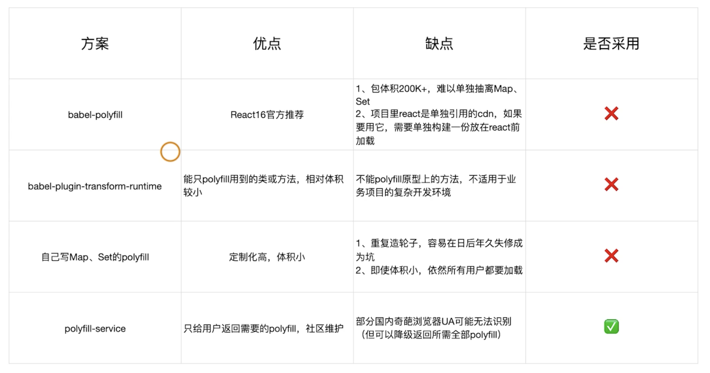

# webpack 构建速度和体积优化

[玩转 webpack，使你的打包速度提升 90%](https://juejin.cn/post/6844904071736852487){link=card}

## 使用webpack内置的stats分析体积

webpack 的内置对象 stats 存储着构建的统计信息，包括构建花费的总时间、每个模块的大小等。

webpack 每次构建完成打印出来的内容就是 stats 的统计信息，需要删掉 `stats: "errors-only"` 等精简 stats 输出的配置。


也可以把 stats 以 JSON 文件的形式输出到磁盘，在 package.json 文件中增加 scripts 配置项：

```json
"scripts": {
  "build:stats": "webpack --config webpack.prod.js --json > stats.json"
}
```


stats 分析构建包体积的缺陷是，只能看到最终的构建包体积大小，分析的颗粒度太大，看不出问题所在，不知道是什么原因导致构建包体积大，看不出哪个模块比较大，哪一个组件比较大，也看不出哪一个 loader 执行比较耗时。

## 构建速度分析: speed-measure-webpack-plugin

speed-measure-webpack-plugin 是一个 webpack 插件，可以分析打包总耗时，以及每个插件以及 loader 的耗时情况。

安装依赖：

```bash
npm install speed-measure-webpack-plugin@1.3.1 -D
```

修改 webpack 配置，使用 speed-measure-webpack-plugin 对象的 `wrap()` 方法将 webpack 配置对象包裹起来即可。

```js
const SpeedMeasureWebpackPlugin = require('speed-measure-webpack-plugin');
const smp = new SpeedMeasureWebpackPlugin();
module.exports = smp.wrap({
  plugins: [],
});
```

结果示例：



我们需要重点关注红色部分，这些是比较耗时的插件和 loader，接着针对性进行优化。

- UglifyJSPlugin 插件比较耗时，耗费了1分56秒。可以思考有没有更加高效的压缩 JS 的方法，例如可以开启并行压缩。

- sass-loader 耗费了24秒，可以考虑采用 less 会不会更加合理？可以对比两者的耗时。

- ExtractTextPlugin 插件也耗费了1分56秒，可以深入阅读插件的源码，看是否有可以优化的地方，根据团队实际的情况，将插件 fork 过来进行优化。

## 体积分析：webpack-bundle-analyzer

可以分析第三方模块、业务组件代码大小。

安装依赖：

```bash
npm install webpack-bundle-analyzer@3.3.2 -D
```

修改 webpack 配置：

```js
// require('webpack-bundle-analyzer') 导入的是一个对象
// require('webpack-bundle-analyzer').BundleAnalyzerPlugin 才是构造函数
const { BundleAnalyzerPlugin } = require('webpack-bundle-analyzer');

module.exports = {
  plugins: [
    new BundleAnalyzerPlugin(),
  ]
}
```



可以看到，React 相关内容和 babel-polyfill 占了很大的体积，可以针对性进行优化。例如通过 CDN 引入，就不用打到 bundle 中了。



除了公共包，如果有某些组件体积很大，可以使用懒加载的方式引入，就不用打到主包中。

## 速度优化：使用高版本的webpack和Node.js

要提升构建速度，推荐使用高版本的 webpack 和 Node.js。

webpack4 的构建时间会比 webpack3 降低 60%~98%。

高版本的 webpack 推荐使用高版本的 Node.js，高版本的 V8 引擎做了更多优化。

- V8带来的优化：for of 替代 forEach、Map 和 Set 替代 Object、includes 替代 indexOf。

- 使用更快的 md4 hash 算法。

- webpack AST 可以直接从 loader 传递给 AST，减少解析时间。

- 使用字符串方法替代正则表达式。

## 多进程多实例构建

多进程多实例并行解析资源，对于复杂的项目，可以显著提高构建速度。

可选方案：

- HappyPack：为 webpack3 编写的多进程构建插件，后续已经没有维护，webpack4 不推荐使用。

- thread-loader：webpack4 官方推出的多进程构建 loader，推荐使用。

- parallel-webpack

### HappyPack

原理：每次 webapck 解析一个模块，HappyPack 会将它及它的依赖分配给 worker 线程中。

安装依赖，在 webpack4 中要使用 5.x 版本。

```bash
npm install happypack@5.0.1 -D
```

修改 webpack 配置：

```js
const HappyPack = require('happypack');

module.exports = {
  module: {
    rules: [
      {
        test: /\.js$/,
        use: 'happypack/loader',
      },
    ],
  },
  plugins: [
    new HappyPack({
      loaders: ['babel-loader'],
    })
  ]
}
```

### thread-loader

原理：每次 webpack 解析一个模块，threadloader 会将它及它的依赖分配给 worker 线程中。

安装依赖：

```bash
npm install thread-loader@2.1.2 -D
```

修改 webpack 配置：

```js
module.exports = {
  module: {
    rules: [
      {
        test: /\.js$/,
        use: [
          {
            loader: 'thread-loader',
            options: { 
              workers: 3,
              workerParallelJobs: 50,
              poolTimeout: 2000,
            },
          },
          'babel-loader',
        ]
      }
    ]
  }
}
```

参数说明：

- workers: 并行工作的线程数。通常设置为 CPU 核心数减一。

- workerParallelJobs: 每个线程可以并行处理的任务数。

- poolTimeout: 当一个工作线程空闲超过这个时间（以毫秒为单位）时，它会被终止。设置为 2000 毫秒是一个合理的默认值。

只有支持多线程处理的 loader 才能使用 thread-loader，比如 `babel-loader`、`css-loader`、`ts-loader`。

```js
module.exports = {
  module: {
    rules: [
      {
        test: /\.css$/,
        use: [
          {
            loader: 'thread-loader',
            options: [
              workers: 3,
            ],
          },
          'style-loader',
          'css-loader',
        ]
      }
    ]
  }
}
```

:::danger 注意事项
- 启动开销: 启动线程是有开销的，因此对于非常小的任务，使用 thread-loader 可能会增加构建时间。确保你的任务足够耗时，才能从多线程中获益。

- 内存使用: 每个线程都会占用一定的内存，因此在配置 workers 时要考虑到你的系统内存限制。

- 兼容性: 确保你使用的**加载器**支持多线程处理。大多数现代加载器都支持，但最好检查一下文档。
:::

## 多进程并行压缩代码

并行压缩代码，也可以提高构建速度。

### parallel-uglify-plugin 插件

```js
const ParallelUglifyPlugin = require('webpack-parallel-uglify-plugin');

module.exports = {
  plugins: [
    new ParallelUglifyPlugin({
      uglifyJS: {
        output: {
          beautify: false,
          comments: false,
        },
        compress: {
          warnings: false,
          drop_console: true,
          collapse_vars: true,
          reduce_vars: true,
        }
      }
    })
  ]
}
```

### uglify-webpack-plugin 插件

开启 parallel 参数。

```js
const UglifyJsPlugin = require('uglifyjs-webpack-plugin');

module.exports = {
  plugins: [
    new UglifyJsPlugin({
      uglifyOptions: {
        warnings: false,
      },
      parallel: true
    })
  ]
}
```

### terser-webpack-plugin 插件※

terser-webpack-plugin 开启 parallel 参数。推荐使用该方法。

安装依赖：

```bash
npm install terser-webpack-plugin@1.3.0 -D
```

修改配置：

```js
const TerserPlugin = require('terser-webpack-plugin');

module.exports = {
  optimization: {
    minimizer: [
      new TerserPlugin({
        parallel: true
      })
    ]
  }
}
```

## DLL预编译资源模块

### 概述

之前提过2种分离基础包的方式，一种是使用 html-webpack-externals-plugin 插件，通过 CDN 引入；一种是通过 splitChunks 进行分包。

但这两种都有一定的缺点。

- html-webpack-externals-plugin 插件：抽离出来的包会以 script 标签的形式引入，如果项目的基础包和公共业务模块数量多起来，就会增加大量的 script 标签；而且每个包都需要在 webpack 配置中增加一条配置项，一个基础库需要指定一个 CDN，还有业务包，使用起来不方便。

- splitChunks：splitChunks 没有 html-webpack-externals-plugin 的缺点，但是每次构建的时候都需要对抽离出来的基础包进行分析编译，而这些基础包一般都是很少改动的，没有必要每次构建都进行编译。

DLL 是 webpack 内置的两个插件，用于将基础包预先编译成单独的 DLL（Dynamic Link Library）文件，后续构建时直接使用 DLL 文件，而不需要再次编译基础包，从而加快打包速度。包括 DLLPlugin 和 DLLReferencePlugin 两个插件。

DLLPlugin：

- 预编译基础库：将不常变化的基础库、业务模块预编译成一个或多个 DLL 文件。

- 提高构建速度：通过预编译，后续的构建过程不需要再重新编译这些基础库，从而加快构建速度。

DLLReferencePlugin：

- 引用预编译好的 DLL 文件，避免每次构建重新编译基础库。

### 用法

新增 dll 配置文件 webpack.dll.js：

```js
const path = require('path');
const webpack = require('webpack');

module.exports = {
  entry: {
    // 指定要分离的基础包；要分离业务包，增加一条key即可
    libraryCai: ['react', 'react-dom'],
    // commonLibrary: ['ui', 'xxx']
  },
  output: {
    filename: '[name].dll.js',
    path: path.join(__dirname, 'library'),
    library: '[name]',
  },
  plugins: [
    new webpack.DllPlugin({
      // DllPlugin的name需要和output的library保持一致
      name: '[name]',
      path: path.join(__dirname, 'library/[name]-manifest.json')
    })
  ]
}
```

package.json 文件增加 scripts 命令：

```json
{
  "scripts": {
    "dll": "webpack --config webpack.dll.js"
  }
}
```

运行 `npm run dll` 命令，就可以生成 dll 文件和 manifest 描述文件。



修改 webpack 配置文件，使用 DLLReferencePlugin 引用编译好的 dll 文件。如果需要引入多个 dll 文件，要书写多个 DLLReferencePlugin 配置。

```js
const webpack = require('webpack');

module.exports = {
  plugins: [
    new webpack.DllReferencePlugin({
      manifest: require('./library/libraryCai-manifest.json'),
    }),
    // new webpack.DllReferencePlugin({
    //   manifest: require('./library/commonLibrary-manifest.json'),
    // }),
  ]
}
```

📢注意：打包生成的 html 文件中需要通过 script 标签引入 `libraryCai.dll.js` 文件，否则会报错 `libraryCai is not defined`。

可以使用 add-asset-html-webpack-plugin 插件，自动将 dll 文件插入到 html 文件中。

:::tip add-asset-html-webpack-plugin
add-asset-html-webpack-plugin 是一个 Webpack 插件，用于将指定的静态资源（如 DLL 文件、CSS 文件等）自动注入到生成的 HTML 文件中。
:::


安装依赖：

```bash
npm install add-asset-html-webpack-plugin -D
```

修改配置：

```js
const webpack = require('webpack');
const AddAssetHtmlPlugin = require('add-asset-html-webpack-plugin');

module.exports = {
  plugins: [
    // 将静态资源文件以script标签形式加入到html文件中，可以引入多个
    new AddAssetHtmlPlugin([
      { filepath: require.resolve('./library/libraryCai.dll.js') },
      { filepath: require.resolve('./library/commmonLibrary.dll.js') },
    ]),
    new webpack.DllReferencePlugin({
      manifest: require('./library/libraryCai-manifest.json'),
    }),
  ]
}
```

add-asset-html-webpack-plugin 会把指定的资源文件复制到 dist 目录中，因此生成的 html 文件即可自动引入，不用担心路径问题。



:::warning 问答
1、dll的方式好像在webpack4里面应用的不是很多了，webpack4已经做了优化，我查看了下vue-cli以及create-react-app都抛弃了这个配置，具体原因地址：https://github.com/vuejs/vue-cli/issues/1205

是的，如果项目使用了 Webpack4，确实对 dll 的依赖没那么大，使用 dll 相对来说提升也不是特别明显。而且有 hard-source-webpack-plugin 可以极大提升二次构建速度。

不过从实际前端工程中来说， dll 还是很有必要掌握的。对于一个团队而言，基本是采用相同的技术栈，要么 React、要么Vue 等等。这个时候，通常的做法都是把公共框架打成一个 common bundle 文件供所有项目使用。比如我们团队会将 react、react-dom、redux、react-redux 等等打包成一个公共库。dll 可以很好的满足这种场景：将多个npm包打成一个公共包。因此团队里面的分包方案使用 dll 还是很有价值，常见的会从整个工程的角度分为基础包（react、redux等）、业务公共包（所有业务都要用到的监控上报脚本、页面初始化脚本）、某个业务的js。

2、dllplugin和splitChunks可以一起用吗?有没有什么区别和联系?

可以一起使用。 DllPlugin 通常用于基础包（框架包、业务包）的分离。

SplitChunks 虽然也可以做 DllPlugin 的事情，但是更加推荐使用 SplitChunks 去提取页面间的公共 js 文件。因为使用 SplitChunks 每次去提取基础包还是需要耗费构建时间的，如果是 DllPlugin 只需要预编译一次，后面的基础包时间都可以省略掉。

3、webpack5 已经不需要这样做了
https://github.com/webpack/webpack/issues/6527
:::

## 启用缓存提升二次构建速度

常见缓存思路：

- babel-loader 开启缓存

- terser-webpack-plugin 开启缓存

- 使用 cache-loader 缓存其它 loader 的输出结果

- 使用 hard-source-webpack-plugin 缓存构建过程中间结果

### babel-loader

babel-loader 缓存路径为：`node_modules/.cache/babel-loader`。

```js
module.exports = {
  module: {
    rules: [
      {
        test: /\.js$/,
        use: [
          {
            loader: 'babel-loader',
            options: {
              // 开启缓存
              cacheDirectory: true,
              // 是否压缩缓存文件。false不压缩，可以提高缓存读写速度，但会占用更多磁盘空间
              cacheCompression: false,
            }
          }
        ]
      }
    ]
  }
}
```

### terser-webpack-plugin

terser-webpack-plugin 缓存路径为：`node_modules/.cache/terser-webpack-plugin`。

```js
const TerserPlugin = require('terser-webpack-plugin');
module.exports = {
  plugins: [
    new TerserPlugin({
      parallel: true,
      // 开启压缩缓存
      cache: true,
    })
  ]
}
```

### cache-loader

cache-loader 用于缓存其他加载器的输出结果，从而加快构建速度。它适用于那些处理时间较长的加载器，比如 babel-loader、ts-loader 或 sass-loader。

cache-loader 缓存路径为：`node_modules/.cache/cache-loader`。

安装依赖：

```bash
npm install cache-loader -D
```

修改配置，以缓存 babel-loader 为例：

```js
module.exports = {
  module: {
    rules: [
      {
        test: /\.js$/,
        use: [
          'cache-loader',
          'babel-loader',
          'eslint-loader',
        ]
      }
    ]
  }
}
```

### hard-source-webpack-plugin

hard-source-webpack-plugin 通过缓存构建过程中生成的中间产物，提高后续构建的速度。

hard-source-webpack-plugin 缓存路径为：`node_modules/.cache/hard-source`。

安装依赖：

```bash
npm install hard-source-webpack-plugin@0.13.1 -D
```

修改配置：

```js
const HardSourceWebpackPlugin = require('hard-source-webpack-plugin');
module.exports = {
  plugins: [
    new HardSourceWebpackPlugin(),
  ]
}
```

缓存结果：



## 缩小构建目标

webpack 在构建的时候，其实没有必要所有文件都进行处理和转换。比如，node_modules 里的第三方库 js 文件其实可以不用解析的，能发布到 npm 上的包质量一般都比较好，差的包我们也不会使用。因此，可以给 babel-loader 排除掉 node_modules 目录下的文件。

可以使用 `include` 和 `exclude` 字段，并且要设置绝对路径。

```js
const path = require('path');
module.exports = {
  module: {
    rules: [
      {
        test: /\.js$/,
        use: 'babel-loader',
        // 指定babel-loader只处理src目录下的文件
        // 必须要指定绝对路径，path.resolve就是生成绝对路径
        include: path.resolve('src'),
        // exclude: path.resolve('node_modules'),
      }
    ]
  }
}
```

## 减小搜索范围

使用 resolve 配置，可以减少搜索路径，提高构建速度。

```js
const path = require('path');
module.exports = {
  resolve: {
    // 指定查找路径，直接到指定路径查找React，减少查找时间
    alias: {
      react: path.resolve(__dirname, './node_modules/react/umd/react.production.min.js'),
      'react-dom': path.resolve(__dirname, './node_modules/react-dom/umd/react-dom.production.min.js'),
    },
    // 没有后缀名的文件，去寻找文件名加.js的文件
    extensions: ['.js'],
    // 查找package.json的main字段内容作为入口文件
    mainFields: ['main'],
    // 添加modules字段，指定模块查找的目录顺序
    // 减小模块搜索层级
    modules: [path.resolve(__dirname, 'src'), 'node_modules'],
  },
}
```

## 擦除无用css

Tree-shaking 是擦除无用的 js 内容，同样的，我们可以使用 PurgeCSS 来擦除无用的 css，从而减小 css 文件体积。

purgecss-webpack-plugin 插件需要和 mini-extract-css-plugin 插件一起使用。

安装依赖：

```bash
npm install purgecss-webpack-plugin@1.5.0 -D
```

修改配置：

```js
const path = require('path');
const MiniCssExtractPlugin = require('mini-css-extract-plugin');
const PurgeCSSPlugin = require('purgecss-webpack-plugin');

const PATHS = {
  // PurgecssPlugin插件需要传绝对路径
  src: path.resolve(__dirname, 'src'),
}
module.exports = {
  plugins: [
    new MiniCssExtractPlugin({
      name: '[name]_[contenthash:8].css',
    }),
    new PurgecssPlugin({
      path: glob.sync(`${PATHS.src}/**/*`, { nodir: true }),
    })
  ],
}
```

``path: glob.sync(`${PATHS.src}/**/*`, { nodir: true })`` 表示匹配 src 目录下所有的文件。

`nodir: true` 的作用：确保只返回文件路径，而不包括目录路径。如果包含目录路径，可能会导致不必要的处理或错误，因此通常只需要文件路径。


## 图片压缩

使用 Node 库的 imagemin 或者 tinypng API。

Imagemin 的优点：有很多定制选项、可以引入更多第三方优化插件，例如pngquant、可以处理多种图片格式。

Imagemin 的压缩原理： 

- pngquant: 是一款PNG压缩器，通过将图像转换为具有alpha通道（通常比24/32位PNG文件小60-80％）的更高效的8位PNG格式，可显著减小文件大小。

- pngcrush:其主要目的是通过尝试不同的压缩级别和PNG过滤方法来降低PNGIDAT数据流的大小。

- optipng:其设计灵感来自于pngcrush。optipng可将图像文件重新压缩为更小尺寸，而不会丢失任何信息。

- tinypng:也是将24位png文件转化为更小有索引的8位图片，同时所有非必要的metadata也会被剥离掉。

安装依赖：

```bash
npm install image-webpack-loader -D
```

修改配置：

```js
module.exports = {
  module: {
    rules: [
      {
        test: /\.(jpeg|png|gif|svg)$/,
        use: [
          {
            loader: 'file-loader',
            options: {
              name: '[name]_[hash:8].[ext]',
            },
          },
          {
            loader: 'image-webpack-loader',
            options: {
              mozjpeg: {
                progressive: true,
              },
              optipng: {
                enabled: false,
              },
              pngquant: {
                quality: [0.65, 0.90],
                speed: 4,
              },
              gifsicle: {
                interlaced: false,
              },
              webp: {
                quality: 75,
              },
            },
          },
        ]
      }
    ]
  }
}
```

没有试成功，运行报错，没有解决。

试了几种方式，都不行：

[webpack loader 使用之 image-webpack-loader (图片压缩)](https://blog.csdn.net/weixin_42508745/article/details/131181236){link=static}

[image-webpack-loader下载报错问题](https://blog.csdn.net/qq_28222917/article/details/129488186){link=static}

## 使用动态polyfill服务

polyfill 是让旧版浏览器能够使用 js 新特性的方式。比如某些浏览器不能使用 Promise，polyfill 就会使用旧版本的 js 语法实现 Promise，提供给浏览器使用。

如果把 polyfill 都打包进去，占用的体积会很大。



但目前其实大部分的用户浏览器都可以支持 js 新特性，为了少部分用户的兼容性，所有用户都要加载 polyfill，其实很没有必要。

下面是 Promise 的支持情况，类似的还有 Map、Set 等。


polyfill 的几种方案：



第三种方案是自己把常用的 polyfill 封装起来，就不需要把所有特性都加载，可以减小体积。但仍然需要所有用户都加载，而且如果以后需要增加特性，需要重新发布版本，不太灵活。

更加优雅的方案是使用 polyfill-service，浏览器会请求 polyfill-service，它会根据请求 UA 判断用户浏览器的版本，自动加载对应的 polyfill。从而做到按需引用 Polyfill。

如何使用动态 polyfill service？

- polyfill.io 官方提供的服务

- 自建 polyfill 服务

polyfill service 的缺点：某些奇葩浏览器可能无法正确识别 UA，从而无法加载 polyfill。

解决方案：如果判断失败，就加载全部的 polyfill，这是降级方案。