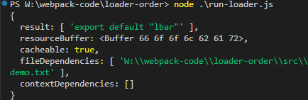
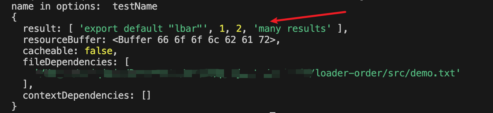
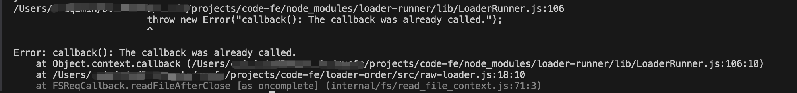
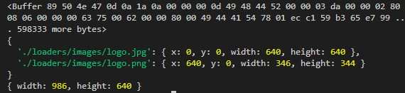

# 编写loader和插件

## loader 的链式调用和执行顺序

loader 的定义：loader 是一个导出为函数的 JavaScript 模块。

```js
module.exports = function(source) {
  return source;
}
```

多 loader 的执行顺序：多个 loader 是串行执行的，前一个 loader 执行完成的结果传递给后一个 loader，并且顺序从后到前。

为什么 loader 的执行顺序是从后到前的？

函数组合的两种做法：

- Unix 中的 pipline

- Compose（webpack采取的是这种），`compose = (f, g) => (...args) => f(g(...args))`。g() 的执行结果传递给 f()。

## 使用 loader-runner 进行 loader 调试

loader-runner 允许在不安装 webpack 的情况下运行 loaders。

作用：

- 作为 webpack 的依赖，webpack 内部也是使用它来执行 loader。

- 进行 loader 的开发的调试。

loader-runner 的使用：

```js
import { runLoaders } from 'loader-runner';

runLoaders({
  resource: '/abs/path/to/file.txt?query', // String: 资源的绝对路径(可以增加查询字符串)
  loaders: ['/abs/path/to/loader.js?query'], // String[]: loader 的绝对路径(可以增加查询字符串)
  context: { minimize: true }, // 基础上下文之外的额外 loader 上下文
  readResource: fs.readFile.bind(fs), // 读取资源的函数
}, function(err, result) {
  // err: Error?
  // result.result: Buffer | String
};)
```

开发一个 raw-loader。

安装 loader-runner：`npm install loader-runner@3.0.0 -S`。

```js
// src/raw-loader.js
module.exports = function (source) {
  const json = JSON.stringify(source)
    .replace('foo', '')
    .replace(/\u2028/g, '\\u2028') // 为了安全起见，ES6模板字符串的问题
    .replace(/\u2029/g, '\\u2029');

  return `export default ${json}`;
};
```

```js
// src/demo.txt
foobar
```

使用 loader-runner 调试 loader：

```js
// run-loader.js
const { runLoaders } = require('loader-runner');
const fs = require('fs');
const path = require('path');

runLoaders({
  resource: path.join(__dirname, './src/demo.txt'),
  loaders: [
    path.join(__dirname, './src/raw-loader.js'),
  ],
  context: {
    minimize: true,
  },
  readResource: fs.readFile.bind(fs),
}, (err, result) => {
  err ? console.log(err) : console.log(result);
});
```

运行查看结果：`node run-loader.js`。



## 更复杂的 loader 开发场景

### loader 获取参数

通过 loader-utils 的 getOptions 方法获取 loader 的参数。

安装 loader-utils 依赖。

```bash
npm install loader-utils@1.2.3
```

配置里面给 loader 传递参数。

```js
const { runLoaders } = require('loader-runner');
const fs = require('fs');
const path = require('path');

runLoaders({
  resource: path.join(__dirname, './src/demo.txt'),
  loaders: [
    {
      loader: path.join(__dirname, './src/raw-loader.js'),
      // loader 的参数
      options: {
        name: 'testName',
      },
    },
  ],
  context: {
    minimize: true,
  },
  readResource: fs.readFile.bind(fs),
}, (err, result) => {
  err ? console.log(err) : console.log(result);
});
```

编写 loader 的时候调用 getOptions 方法获取参数。

```js
const loaderUtils = require('loader-utils');

module.exports = function(source) {
  const options = loaderUtils.getOptions(this);
  console.log(options.name);
}
```

### loader 异常处理

方式一：loader 内部直接抛出一个错误。

方式二：调用 `this.callback()` 方法传递错误，方法第一个参数传递错误，第二个参数传递返回结果。

```bash
this.callback(err: Error | null, content: string | Buffer, sourceMap?: SourceMap, meta?: any)
```

```js
module.exports = function(source) {
  const json = JSON.stringify(source)
    .replace(/\u2028/g, '\\u2028') // 为了安全起见，ES6模板字符串的问题
    .replace(/\u2029/g, '\\u2029');

  // 方式一：直接抛出Error
  // throw new Error('test error');

  // 方式二：调用this.callback传递错误
  this.callback(new Error('test error'), json);
}
```

### loader 返回结果

loader 返回结果有两种方式：同步处理、异步处理。

同步处理，调用 `this.callback()` 方法。异步处理，调用 `this.async()` 方法返回的 callback 函数。

先看同步处理，之前在 raw-loader 中，是直接返回 json 字符串。

```js
module.exports = function(source) {
  const json = JSON.stringify(source)
    .replace(/\u2028/g, '\\u2028') // 为了安全起见，ES6模板字符串的问题
    .replace(/\u2029/g, '\\u2029');
  
  return `export default ${json}`;
}
```

这其实也是一种同步处理的方式，不过不太标准，标准的是使用 `this.callback()` 方法。没有错误处理，第一个参数传递 null，第二个参数把返回结果传递进去。

而且，使用 `this.callback()` 方法，可以返回多个结果。

```js
module.exports = function(source) {
  const json = JSON.stringify(source)
    .replace(/\u2028/g, '\\u2028')
    .replace(/\u2029/g, '\\u2029');
  
  this.callback(null, `export default ${json}`);
  // this.callback返回多个结果
  this.callback(null, `export default ${json}`, 1, 2, 'many results');
}
```



接下来看异步处理，异步处理，需要调用 `this.async()` 方法，返回一个 callback 函数。传参和 `this.callback()` 一样。

```js
const loaderUtils = require('loader-utils');
const path = require('path');
const fs = require('fs');

module.exports = function (source) {
  // this.async返回异步处理函数
  const callback = this.async();
  fs.readFile(path.join(__dirname, './async.txt'), 'utf-8', (err, data) => {
    if (err) {
      callback(err, '');
      return;
    }
    // 异步处理结果
    callback(null, data, 'async usage');
  });
};
```

### loader 同步异步处理混用

情况一：在同步情况中，调用异步处理函数，是没有问题的。

```js
// 在同步情况中，调用异步处理函数
module.exports = function(source) {
  const json = JSON.stringify(source)
    .replace(/\u2028/g, '\\u2028')
    .replace(/\u2029/g, '\\u2029');
  
  const callback = this.async();
  callback(null, `export default ${json}`, 1, 2, 'many results');
}
```

情况二：在异步情况中，调用同步处理函数，会报错 `Error: callback(): The callback was already called.`。

猜测是同步处理的 `this.callback()` 方法，在 loader 的末尾其实也是会隐式调用的，所以等读取文件操作完成后，再调用就会报错重复调用。

如果只调用异步处理的 `this.async()` 方法，就会阻断这个隐式调用。

```js
// 在异步情况中，调用同步处理函数
const loaderUtils = require('loader-utils');
const path = require('path');
const fs = require('fs');

module.exports = function (source) {
  fs.readFile(path.join(__dirname, './async.txt'), 'utf-8', (err, data) => {
    this.callback(null, data, 'async usage666');
  });
};
```



情况三：同时调用同步和异步处理函数，也会报错 `Error: callback(): The callback was already called.`。

这两个不能同时调用。

```js
const loaderUtils = require('loader-utils');
const path = require('path');
const fs = require('fs');

module.exports = function (source) {
  fs.readFile(path.join(__dirname, './async.txt'), 'utf-8', (err, data) => {
    this.callback(null, data, 'async usage666');
  });
  this.callback(null, 'sync usage');
};
```

### loader 输出文件

loader 通过调用 `this.emitFile()` 方法，将内容输出为文件。通常回和 `loaderUtils.interpolateName()` 方法结合使用。

`loaderUtils.interpolateName()` 方法功能是，根据文件内容、和其它参数生成一个唯一的文件名。

`this.emitFile` 文件输出的路径就是 webpack 配置 `output.path` 指定的目录。

```js
const loaderUntils = require('loader-utils');

module.exports = function(source) {
  // index.a3fs.js
  const fileName = loaderUntils.interpolateName(this, '[name].[hash:4].[ext]', source)
  this.emitFile(fileName, source);
  return source;
}
```

:::warning 评论留言
1. loader-utils 3.0.0 版本已经移除getOptions方法，详见：https://github.com/webpack/loader-utils/blob/master/CHANGELOG.md
:::

## 开发自动合成雪碧图的loader

支持的语法：

```css
.img1 {
  background: url(./images/logo.jpg?__sprite);
}
.img2 {
  background: url(./images/logo.png?__sprite);
}
/* 变成 */
.img1 {
  background: url(./images/sprite.png);
}
```

如何将两张图片合为一张？使用 [spritesmith](https://www.npmjs.com/package/spritesmith)。

使用示例：

```js
const Spritesmith = require('spritesmith');
const fs = require('fs');
const path = require('path');

const sprites = ['./loaders/images/logo.jpg', './loaders/images/logo.png'];

Spritesmith.run({ src: sprites }, (err, result) => {
  // 合成后图片的buffer数据
  console.log(result.image);
  // 每张图片的左上角坐标信息
  console.log(result.coordinates);
  // 合成后图片的大小
  console.log(result.properties);
  fs.writeFileSync(path.join(__dirname, './loaders/images/sprite.png'), result.image);
});
```



开始编写 sprite-loader.js。

```js
const Spritesmith = require('spritesmith');
const fs = require('fs');
const path = require('path');

module.exports = function (source) {
  const callback = this.async();
  // 匹配出所有带有 __sprite 后缀的css语句
  const imgs = source.match(/url\((\S*)\?__sprite/g);
  const matchedImgs = [];
  
  for (let i = 0;i < imgs.length;i++) {
    const img = imgs[i].match(/url\((\S*)\?__sprite/)[1];
    // 截取每张图片的路径，并且拼成绝对路径
    matchedImgs.push(path.join(__dirname, img));
  }

  Spritesmith.run({
    src: matchedImgs
  }, (err, result) => {
    fs.writeFileSync(path.join(process.cwd(), 'dist/sprite.jpg'), result.image);
    // 将css图片的路径替换为合成后的图片路径
    source = source.replace(/url\((\S*)\?__sprite/g, (match) => {
      return `url("dist/sprite.jpg"`;
    });
    // 修改css文件内容
    fs.writeFileSync(path.join(process.cwd(), 'dist/index.css'), source);
    callback(null, source);
  });
}
```

```js
// run-loader.js
const { runLoaders } = require('loader-runner');
const fs = require('fs');
const path = require('path');

runLoaders({
  resource: path.join(__dirname, './loaders/index.css'),
  loaders: [
    path.join(__dirname, './loaders/sprite-loader.js'),
  ],
  context: {
    minimize: true,
  },
  readResource: fs.readFile.bind(fs),
}, (err, result) => {
  if (err) {
    console.log(err);
  } else {
    console.log(result);
  }
});
```

```css
.img1 {
  background: url(./images/logo.jpg?__sprite);
}
.img2 {
  background: url(./images/logo.png?__sprite);
}
```

运行完成后，index.css 文件内容变为如下，并且生成了合并后的图片。

```css
.img1 {
  background: url("dist/sprite.jpg");
}
.img2 {
  background: url("dist/sprite.jpg");
}
```