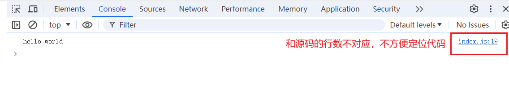
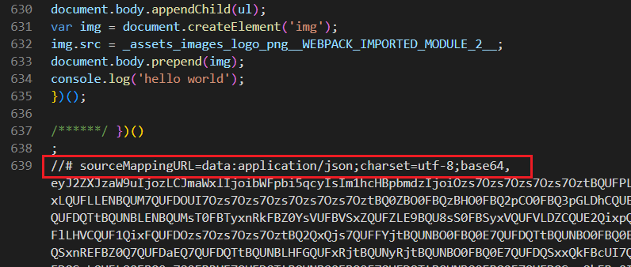
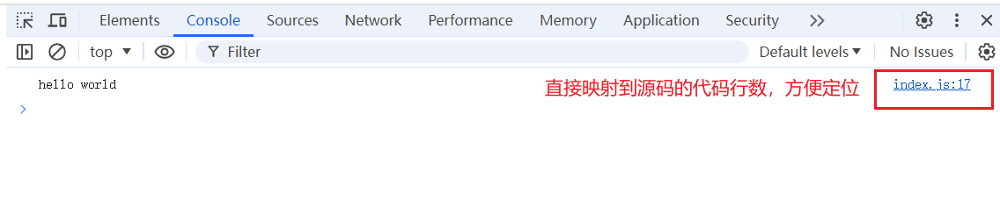
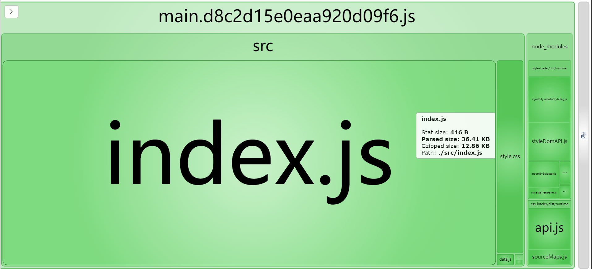

# Webpack 极速入门

## Webpack 初体验

### 初始化项目

```bash
npm init -y
```

项目结构如下。

```shell
.
├── node_modules
├── src
│ │── index.js
│ │── data.js
├── index.html
├── package.json
├── package-lock.json
```

### 安装 webpack

`-D` 是 `--save-dev` 的缩写，表示开发时依赖，只在项目开发阶段用到。
`-S` 是 `--save` 的缩写，表示运行时依赖，即项目打包发布运行时要用到。

Webpack 只在项目开发阶段用到，因此使用 `-D` 参数。

```bash
npm install webpack webpack-cli -D
```

### 书写代码

```js
// index.js
import { getList } from './data'

console.log(getList())
```

```js
// data.js
export function getList() {
  return ['111', '222', '333']
}
```

```html
<!DOCTYPE html>
<html lang="en">
  <head>
    <meta charset="UTF-8" />
    <meta name="viewport" content="width=device-width, initial-scale=1.0" />
    <title>Document</title>
  </head>
  <body>
    <h1>hello webpack</h1>
    <script src="./dist/main.js"></script>
  </body>
</html>
```

### 运行打包命令

```bash
npx webpack
```

打包完成后，就会生成 dist 文件夹，入口文件默认是 main.js。

打包生成的内容如下。

```bash
# main.js
(() => {'use strict';console.log(['111', '222', '333'])})();
```

运行 index.html 文件即可看到页面效果以及控制台打印的文字。

## Webpack 基本配置

Webpack 相关配置写在 `webpack.config.js` 文件中。

```js
const path = require('path')

module.exports = {
  mode: 'development', // 打包模式，取值有development、production
  devtool: 'inline-source-map', // 方便查看打包后的代码
  entry: './src/index.js', // 指定打包的入口文件
  output: {
    filename: 'dist.js', // 指定打包后的文件名
    path: path.resolve(__dirname, 'dist'), // 指定打包文件生成的目录
  },
}
```

## ouput 配置项

基本使用。

```js
const path = require('path')

module.exports = {
  output: {
    filename: 'dist.js', // 指定打包后的文件名
    path: path.resolve(__dirname, 'dist'), // 指定打包文件生成的目录
  },
}
```

为了防止浏览器缓存文件，需要给打包生成的文件名添加 hash 值。

`[name]` 表示打包后的文件名和原本入口文件名保持一致，也可以写死。

`[contenthash]` 表示打包后的文件名添加一串哈希值。当文件内容发生变化时，hash 值也会发生变化。如果文件内容没有变化，则 hash 值不变。

```js
module.exports = {
  output: {
    filename: '[name].[contenthash].js',
  },
}
```

## devtool 配置项

`devtool: 'inline-source-map'` 的作用：

1. 源码映射：启用源码映射功能，它帮助开发者在浏览器的开发者工具中将编译、压缩后的代码映射回原始源代码。这对于调试是非常有用的，因为源码映射能让你在压缩或转换过的代码里直接看到源代码的上下文。

2. 内联方式

- 这里的 `inline-source-map` 指定了源码映射将以内联的方式生成。这意味着源码映射数据会直接嵌入到打包生成的每个 bundle 文件中，而不是作为一个单独的 .map 文件存在。这种方式使得部署和分享变得更加便捷，因为你不需要额外上传或管理映射文件。

- 当 Webpack 完成打包后，生成的文件不仅包含了转换和打包后的代码，还会在**文件末尾附加一段 Base64 编码**的源码映射数据。这段数据就是源码映射信息，但是是以内联形式存在的，无需单独下载 .map 文件。

3. 便于调试：特别是对于开发环境而言，这个配置让开发者可以直接在浏览器中查看和调试原始的、未经过 Webpack 处理的源代码，而不需要去解析经过转译（如 Babel 转换 ES6+语法）、压缩或合并后的代码，大大提升了开发效率和调试体验。

```js
module.exports = {
  devtool: 'inline-source-map', // 源码映射
}
```



映射后生成的 base64 映射数据：





## loader：rules 配置项

Webpack 默认只能打包 js、JSON 文件，对于其它类型的文件，如 CSS、图片、字体等，Webpack 不支持直接处理，需通过使用 loader 来扩展它的处理能力。

### CSS 文件

要打包处理 CSS 文件，需要安装 `style-loader`、`css-loader` 两个 loader。

Webpack 的 loader 基本都只有开发时才用得到，因此使用 `-D` 参数。

安装 loader。

```bash
npm install style-loader css-loader -D
```

配置 loader。

```js
const path = require('path')

module.exports = {
  mode: 'development',
  entry: './src/index.js',
  output: {
    filename: 'dist.js',
    path: path.resolve(__dirname, 'dist'),
  },
  module: {
    rules: [
      {
        // 匹配 css 文件
        test: /\.css$/i,
        // 对于 css 文件，使用 style-loader、css-loader
        use: ['style-loader', 'css-loader'],
      },
    ],
  },
}
```

### 图片

对于图片，Webpack 已经有内置的 loader，可以直接使用，无需安装。

```js
module.exports = {
  module: {
    rules: [
      {
        // 匹配图片后缀名
        test: /\.(png|svg|jpg|jpeg|gif)$/i,
        // 内置的loader的写法
        type: 'asset/resource',
        // 定义输出文件的名称和路径
        // 表示生成的图片放在dist/images目录下，文件名和扩展名保持原样
        // 如果没有这段配置，则图片放在dist目录下，文件名随机生成
        generator: {
          filename: 'images/[name][ext]',
        },
      },
    ],
  },
}
```

### babel-loader

将 ES6 语法转换为 ES5 语法，以便兼容旧浏览器。

安装 loader。

```bash
npm i babel-loader @babel/core @babel/preset-env -D
```

配置 loader。

```js
module.exports = {
  module: {
    rules: [
      {
        test: /\.js$/,
        // 不处理node_modules下的文件
        exclude: /node_modules/,
        use: {
          loader: 'babel-loader',
          // 给loader传递配置
          options: {
            presets: ['@babel/preset-env'],
          },
        },
      },
    ],
  },
}
```

## 插件：plugins 配置项

### 生成 HTML：html-webpack-plugin

使用 html-webpack-plugin，可自动生成 HTML 文件，并自动引入打包后的 JS 文件。

安装插件。

```bash
npm install html-webpack-plugin -D
```

配置插件。

```js
const HtmlWebpackPlugin = require('html-webpack-plugin')

module.exports = {
  plugins: [
    new HtmlWebpackPlugin({
      // 修改html文件标题
      title: '这是标题',
      // 执行HTML模板
      template: './src/pages/page1/index.html',
      // 指定生成的HTML要引入的chunk，与entry配置对应
      chunks: ['page1'],
    }),
  ],
}
```

### 可视化分析工具：webpack-bundle-analyzer

用可视化的方式展示、分析打包后的代码大小。

安装插件。

```bash
npm install webpack-bundle-analyzer -D
```

配置插件。

```js
// require('webpack-bundle-analyzer') 导入的是一个对象
// require('webpack-bundle-analyzer').BundleAnalyzerPlugin 才是构造函数
const BundlePlugin = require('webpack-bundle-analyzer').BundleAnalyzerPlugin

module.exports = {
  plugins: [new BundlePlugin()],
}
```

运行 `npx webpack` 打包后，会自动打开可视化图表。



## 压缩优化：optimization 配置项

### 压缩代码：terser-webpack-plugin

压缩生成的代码。生成的代码会去掉空格，变量名也会变短。

安装插件。

```bash
npm install terser-webpack-plugin -D
```

配置插件。

```js
const TerserPlugin = require('terser-webpack-plugin')

module.exports = {
  optimization: {
    // 是否要压缩
    minimize: true,
    // 用什么工具压缩
    minimizer: [
      new TerserPlugin({
        extractComments: false,
      }),
    ],
  },
}
```

## devServer 配置项

devServer 配置项，用于配置开发服务器，当文件内容发生改变时，可以热更新打包文件，不用每次手动打包。

安装 devServer。

```bash
npm install webpack-dev-server -D
```

配置 devServer。

```js
module.exports = {
  devServer: {
    // 指定devServer从哪里加载代码
    static: './dist',
  },
}
```

## 路径别名: resolve 配置项

```js
module.exports = {
  resolve: {
    alias: {
      '@/utils': path.resolve(__dirname, 'src/utils'),
    },
  },
}
```
