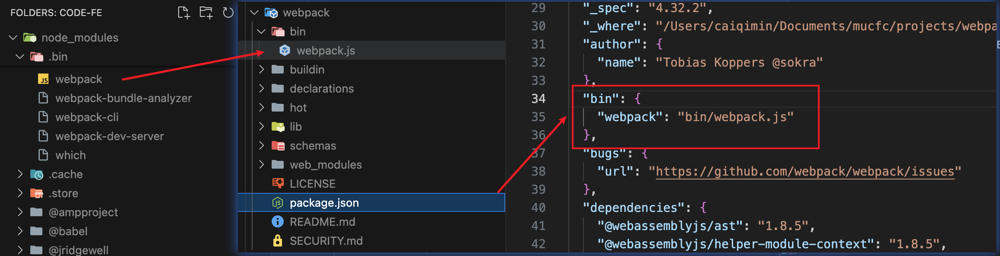
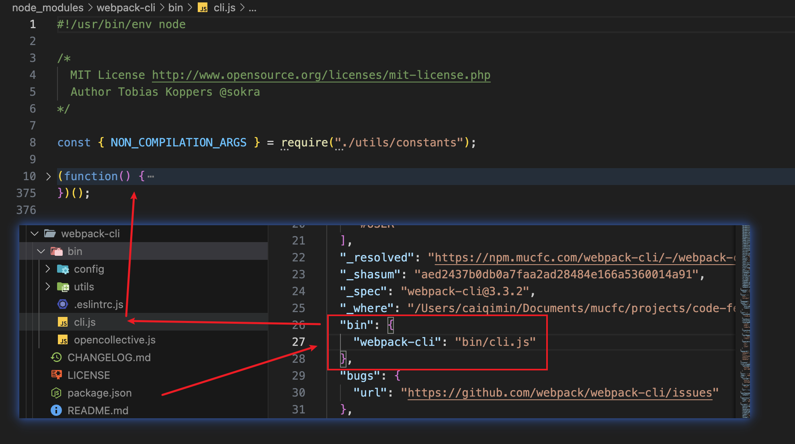

# 通过源码掌握webpack打包原理

## webpack启动过程分析

从运行 webpack 打包命令说起。

当我们执行 `npm run build` 命令或者直接在控制台执行 `npx webpack --config webpack.prod.js` 命令时，命令行工具会去寻找 `node_modules/.bin` 目录是否存在 `webpack` 文件，如果存在，则执行 `webpack` 文件，否则报错。

而 `node_modules/.bin` 目录下的 `webpack` 文件，是一个软链接文件，它的源文件是 `node_modules/webpack/bin/webpack.js` 文件。

npm 包要在 `package.json` 文件中声明 `bin` 字段，才会在 `node_modules/.bin` 目录下生成软链接文件。



### 分析webpack入口文件

`webpack` 命令执行的入口文件是 `node_modules/webpack/bin/webpack.js` 文件。

```js
// webpack.js

// @ts-ignore
process.exitCode = 0;

/**
 * @param {string} command process to run
 * @param {string[]} args commandline arguments
 * @returns {Promise<void>} promise
 */
const runCommand = (command, args) => {
	const cp = require("child_process");
	return new Promise((resolve, reject) => {
		const executedCommand = cp.spawn(command, args, {
			stdio: "inherit",
			shell: true
		});

		executedCommand.on("error", error => {
			reject(error);
		});

		executedCommand.on("exit", code => {
			if (code === 0) {
				resolve();
			} else {
				reject();
			}
		});
	});
};

/**
 * @param {string} packageName name of the package
 * @returns {boolean} is the package installed?
 */
const isInstalled = packageName => {
	try {
		require.resolve(packageName);

		return true;
	} catch (err) {
		return false;
	}
};

const CLIs = [
	{
		name: "webpack-cli",
		package: "webpack-cli",
		binName: "webpack-cli",
		alias: "cli",
		installed: isInstalled("webpack-cli"),
		recommended: true,
		url: "https://github.com/webpack/webpack-cli",
		description: "The original webpack full-featured CLI."
	},
	{
		name: "webpack-command",
		package: "webpack-command",
		binName: "webpack-command",
		alias: "command",
		installed: isInstalled("webpack-command"),
		recommended: false,
		url: "https://github.com/webpack-contrib/webpack-command",
		description: "A lightweight, opinionated webpack CLI."
	}
];

const installedClis = CLIs.filter(cli => cli.installed);

if (installedClis.length === 0) {
	const path = require("path");
	const fs = require("fs");
	const readLine = require("readline");

	let notify =
		"One CLI for webpack must be installed. These are recommended choices, delivered as separate packages:";

	for (const item of CLIs) {
		if (item.recommended) {
			notify += `\n - ${item.name} (${item.url})\n   ${item.description}`;
		}
	}

	console.error(notify);

	const isYarn = fs.existsSync(path.resolve(process.cwd(), "yarn.lock"));

	const packageManager = isYarn ? "yarn" : "npm";
	const installOptions = [isYarn ? "add" : "install", "-D"];

	console.error(
		`We will use "${packageManager}" to install the CLI via "${packageManager} ${installOptions.join(
			" "
		)}".`
	);

	const question = `Do you want to install 'webpack-cli' (yes/no): `;

	const questionInterface = readLine.createInterface({
		input: process.stdin,
		output: process.stderr
	});
	questionInterface.question(question, answer => {
		questionInterface.close();

		const normalizedAnswer = answer.toLowerCase().startsWith("y");

		if (!normalizedAnswer) {
			console.error(
				"You need to install 'webpack-cli' to use webpack via CLI.\n" +
					"You can also install the CLI manually."
			);
			process.exitCode = 1;

			return;
		}

		const packageName = "webpack-cli@3.3.2";

		console.log(
			`Installing '${packageName}' (running '${packageManager} ${installOptions.join(
				" "
			)} ${packageName}')...`
		);

		runCommand(packageManager, installOptions.concat(packageName))
			.then(() => {
				require(packageName); //eslint-disable-line
			})
			.catch(error => {
				console.error(error);
				process.exitCode = 1;
			});
	});
} else if (installedClis.length === 1) {
	const path = require("path");
	const pkgPath = require.resolve(`${installedClis[0].package}/package.json`);
	// eslint-disable-next-line node/no-missing-require
	const pkg = require(pkgPath);
	// eslint-disable-next-line node/no-missing-require
	require(path.resolve(
		path.dirname(pkgPath),
		pkg.bin[installedClis[0].binName]
	));
} else {
	console.warn(
		`You have installed ${installedClis
			.map(item => item.name)
			.join(
				" and "
			)} together. To work with the "webpack" command you need only one CLI package, please remove one of them or use them directly via their binary.`
	);

	// @ts-ignore
	process.exitCode = 1;
}
```

文件的主要内容如下：

```js
process.exitCode = 0; // 设置默认的退出码为0，表示正常执行
const runCommand = (command, args) => {...}; // 定义运行命令的函数
const isInstalled = packageName => {...}; // 判断某个包是否安装
const CLIs = [...]; // webpack 可用的CLI：webpack-cli和webpack-command
const installedClis = CLIs.filter(cli => cli.installed); // 判断是否安装过webpack-cli和webpack-command
// 根据安装数量进行相应处理
if (installedClis.length === 0) {...} // 都没安装，会提示用户进行安装
else if (installedClis.length === 1) {...} // 安装了其中一个，就会执行这个包package.json的bin字段指向的文件
else {...} // 两个都安装了，会报错，提示只能安装一个
```

因此，执行 webpack 命令最终执行的是 webpack-cli (或者 webpack-command) 命令。

