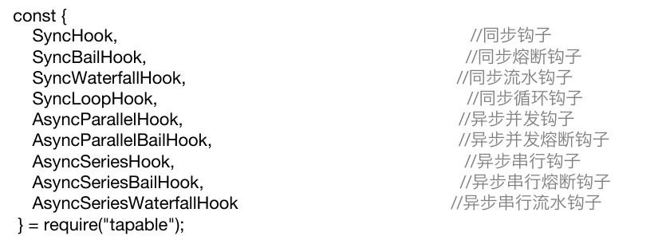
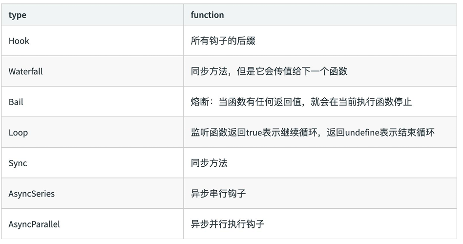

# 通过源码掌握webpack打包原理

## webpack启动过程分析

从运行 webpack 打包命令说起。

当我们执行 `npm run build` 命令或者直接在控制台执行 `npx webpack --config webpack.prod.js` 命令时，命令行工具会去寻找 `node_modules/.bin` 目录是否存在 `webpack` 文件，如果存在，则执行 `webpack` 文件，否则报错。

而 `node_modules/.bin` 目录下的 `webpack` 文件，是一个软链接文件，它的源文件是 `node_modules/webpack/bin/webpack.js` 文件。

npm 包要在 `package.json` 文件中声明 `bin` 字段，才会在 `node_modules/.bin` 目录下生成软链接文件。


### 分析webpack入口文件

`webpack` 命令执行的入口文件是 `node_modules/webpack/bin/webpack.js` 文件。

```js
// webpack.js

// @ts-ignore
process.exitCode = 0;

/**
 * @param {string} command process to run
 * @param {string[]} args commandline arguments
 * @returns {Promise<void>} promise
 */
const runCommand = (command, args) => {
	const cp = require("child_process");
	return new Promise((resolve, reject) => {
		const executedCommand = cp.spawn(command, args, {
			stdio: "inherit",
			shell: true
		});

		executedCommand.on("error", error => {
			reject(error);
		});

		executedCommand.on("exit", code => {
			if (code === 0) {
				resolve();
			} else {
				reject();
			}
		});
	});
};

/**
 * @param {string} packageName name of the package
 * @returns {boolean} is the package installed?
 */
const isInstalled = packageName => {
	try {
		require.resolve(packageName);

		return true;
	} catch (err) {
		return false;
	}
};

const CLIs = [
	{
		name: "webpack-cli",
		package: "webpack-cli",
		binName: "webpack-cli",
		alias: "cli",
		installed: isInstalled("webpack-cli"),
		recommended: true,
		url: "https://github.com/webpack/webpack-cli",
		description: "The original webpack full-featured CLI."
	},
	{
		name: "webpack-command",
		package: "webpack-command",
		binName: "webpack-command",
		alias: "command",
		installed: isInstalled("webpack-command"),
		recommended: false,
		url: "https://github.com/webpack-contrib/webpack-command",
		description: "A lightweight, opinionated webpack CLI."
	}
];

const installedClis = CLIs.filter(cli => cli.installed);

if (installedClis.length === 0) {
	const path = require("path");
	const fs = require("fs");
	const readLine = require("readline");

	let notify =
		"One CLI for webpack must be installed. These are recommended choices, delivered as separate packages:";

	for (const item of CLIs) {
		if (item.recommended) {
			notify += `\n - ${item.name} (${item.url})\n   ${item.description}`;
		}
	}

	console.error(notify);

	const isYarn = fs.existsSync(path.resolve(process.cwd(), "yarn.lock"));

	const packageManager = isYarn ? "yarn" : "npm";
	const installOptions = [isYarn ? "add" : "install", "-D"];

	console.error(
		`We will use "${packageManager}" to install the CLI via "${packageManager} ${installOptions.join(
			" "
		)}".`
	);

	const question = `Do you want to install 'webpack-cli' (yes/no): `;

	const questionInterface = readLine.createInterface({
		input: process.stdin,
		output: process.stderr
	});
	questionInterface.question(question, answer => {
		questionInterface.close();

		const normalizedAnswer = answer.toLowerCase().startsWith("y");

		if (!normalizedAnswer) {
			console.error(
				"You need to install 'webpack-cli' to use webpack via CLI.\n" +
					"You can also install the CLI manually."
			);
			process.exitCode = 1;

			return;
		}

		const packageName = "webpack-cli@3.3.2";

		console.log(
			`Installing '${packageName}' (running '${packageManager} ${installOptions.join(
				" "
			)} ${packageName}')...`
		);

		runCommand(packageManager, installOptions.concat(packageName))
			.then(() => {
				require(packageName); //eslint-disable-line
			})
			.catch(error => {
				console.error(error);
				process.exitCode = 1;
			});
	});
} else if (installedClis.length === 1) {
	const path = require("path");
	const pkgPath = require.resolve(`${installedClis[0].package}/package.json`);
	// eslint-disable-next-line node/no-missing-require
	const pkg = require(pkgPath);
	// eslint-disable-next-line node/no-missing-require
	require(path.resolve(
		path.dirname(pkgPath),
		pkg.bin[installedClis[0].binName]
	));
} else {
	console.warn(
		`You have installed ${installedClis
			.map(item => item.name)
			.join(
				" and "
			)} together. To work with the "webpack" command you need only one CLI package, please remove one of them or use them directly via their binary.`
	);

	// @ts-ignore
	process.exitCode = 1;
}
```

文件的主要内容如下：

```js
process.exitCode = 0; // 设置默认的退出码为0，表示正常执行
const runCommand = (command, args) => {...}; // 定义运行命令的函数
const isInstalled = packageName => {...}; // 判断某个包是否安装
const CLIs = [...]; // webpack 可用的CLI：webpack-cli和webpack-command
const installedClis = CLIs.filter(cli => cli.installed); // 判断是否安装过webpack-cli和webpack-command
// 根据安装数量进行相应处理
if (installedClis.length === 0) {...} // 都没安装，会提示用户进行安装
else if (installedClis.length === 1) {...} // 安装了其中一个，就会执行这个包package.json的bin字段指向的文件
else {...} // 两个都安装了，会报错，提示只能安装一个
```

因此，执行 webpack 命令最终执行的是 webpack-cli (或者 webpack-command) 命令。


## webpack-cli源码阅读

首先给出结论，webpack-cli 主要做了以下三件事：

- 引入 yargs，对命令行进行控制

- 分析命令行参数，对各个参数进行转换，组成编译配置项

- 引用 webpack，根据配置项进行编译和构建

### 分析不需要编译的命令

并不是所有命令都需要经过编译构建的过程，并不会实例化一个 webpack 对象，比如 `webpack init`。`NON_COMPILATION_ARGS` 就保存着不需要经过编译的命令。

```js
// node_modules\webpack-cli\bin\cli.js
const { NON_COMPILATION_ARGS } = require("./utils/constants");

const NON_COMPILATION_CMD = process.argv.find(arg => {
	if (arg === "serve") {
		global.process.argv = global.process.argv.filter(a => a !== "serve");
		process.argv = global.process.argv;
	}
	return NON_COMPILATION_ARGS.find(a => a === arg);
});

if (NON_COMPILATION_CMD) {
	return require("./utils/prompt-command")(NON_COMPILATION_CMD, ...process.argv);
}
```

```js
// 运行这8个命令不会实例化webpack对象，而是直接运行
const NON_COMPILATION_ARGS = [
	"init", // 创建一份webpack配置文件
	"migrate", // 进行webpack版本迁移
	"add", // 往webpack配置文件中添加属性
	"remove", // 从webpack配置文件中删除属性
	"serve", // 运行webpack-serve
	"generate-loader", // 生成webpack loader代码
	"generate-plugin", // 生成webpack plugin代码
	"info" // 返回与本地环境相关的一些信息
];
```

当输入了 `NON_COMPILATION_ARGS` 里面的命令，就会直接加载 `/utils/prompt-command` 文件，执行命令。文件的主要内容如下：

```js
module.exports = function promptForInstallation(packages, ...args) {
	const nameOfPackage = "@webpack-cli/" + packages;
	let packageIsInstalled = false;
	let pathForCmd;
	try {
		const path = require("path");
		const fs = require("fs");
		pathForCmd = path.resolve(process.cwd(), "node_modules", "@webpack-cli", packages);
		if (!fs.existsSync(pathForCmd)) {
			// 局部没有找到，就去全局找
			const globalModules = require("global-modules");
			pathForCmd = globalModules + "/@webpack-cli/" + packages;
			require.resolve(pathForCmd);
		} else {
			require.resolve(pathForCmd);
		}
		packageIsInstalled = true;
	} catch (err) {
		packageIsInstalled = false;
	}
	if (!packageIsInstalled) {
		...

		const question = `Would you like to install ${packages}? (That will run ${commandToBeRun}) (yes/NO) : `;

		console.error(`The command moved into a separate package: ${nameOfPackage}`);
		...
	} else {
		return runWhenInstalled(packages, pathForCmd, ...args);
	}
};
```

prompt-command 首先会查找是否安装了 `@webpack-cli/xxx` 对应的包，如果安装了就直接运行。如果没有安装，就提示用户是否要安装。

运行 `.\node_modules\.bin\webpack serve` 命令结果如下。


### webpack-cli 使用 yargs 分析命令

yargs 是命令行工具包，用于提供命令和分组参数，动态生成 help 帮助信息。


其中很重要的一个内容就是 group，区分每个命令的分组。GROUPS 存放在 `node_modules\webpack-cli\bin\utils\constants.js` 文件下。

除了这 8 组特殊命令，其余命令都放在 Options 之下，因此 webpack 一共有 9 类命令。

```js
// node_modules\webpack-cli\bin\utils\constants.js
const CONFIG_GROUP = "Config options:";
const BASIC_GROUP = "Basic options:";
const MODULE_GROUP = "Module options:";
const OUTPUT_GROUP = "Output options:";
const ADVANCED_GROUP = "Advanced options:";
const RESOLVE_GROUP = "Resolving options:";
const OPTIMIZE_GROUP = "Optimizing options:";
const DISPLAY_GROUP = "Stats options:";
const GROUPS = {
	CONFIG_GROUP,
	BASIC_GROUP,
	MODULE_GROUP,
	OUTPUT_GROUP,
	ADVANCED_GROUP,
	RESOLVE_GROUP,
	OPTIMIZE_GROUP,
	DISPLAY_GROUP
};
```


### 组装webpack配置参数options

修改webpack配置项有两种方法：1. 在webpack.config.js中修改；2. 在命令行中修改。

webpack-cli 接下来就会组装 webpack 配置，根据配置项加载对应的插件，保存到 options 变量之中，最后传递给 processOptions 方法。

```js
yargs.parse(process.argv.slice(2), (err, argv, output) => {
	let options;
	try {
		options = require("./utils/convert-argv")(argv);
	} catch (err) {
		...
	}
})
```

最后阅读 processOptions 函数。

processOptions 会创建一个 outputOptions 变量，表示输出的配置，根据传入的 options 参数进行组装，options 是输入的配置。

最后就是引入 webpack，创建 compiler 对象，根据是否配置 watch 参数来决定执行哪种构建方式，没有 watch 就执行 compiler 的 run 方法，启动构建过程。


### webpack-cli执行的结果

webpack-cli 对配置文件和命令行参数进行转换最终生成配置选项参数 options，最终会根据配置参数实例化 webpack 对象，然后执行构建流程。

## Tapable插件架构和Hooks设计

webpack 两个核心对象 Compiler 和 Compilation 都是继承 Tapable，所以要重点分析 Tapable。

### Tapable 是什么

Tapable 是一个类似于 Node.js 的 EventEmitter 的库, 主要是控制钩子函数的发布与订阅，控制着 webpack 的插件系统。

其实和 Taro 的 Events 事件机制有些类似，可以理解为事件的监听和触发。

webpack 在构建过程中会触发不同的 Hook，插件会监听 Hook，当 Hook 被触发时，就会执行相应的回调函数，从而在不同的阶段做不同的事情。

Tapable 库暴露了很多 Hook（钩子）类，为插件提供挂载的钩子。每个钩子代表一个关键事件节点，类似于生命周期。





### Tapable 的使用

Tapable 提供了绑定同步、异步钩子的方法，以及同步和异步钩子的执行事件方法。

绑定钩子，相当于监听事件，event 的 on 方法；执行钩子，相当于触发事件，event 的 emit 方法。

|Async*|Sync*|
|---|---|
|绑定：tapAsync/tapPromise/tap|绑定：tap|
|执行：callAsync/promise|执行：call|

基本用法示例：

```js
const { SyncHook } = require('tapable');

const hook1 = new SyncHook(["arg1", "arg2", "arg3"]);
// 订阅hook，为hook绑定回调函数
// 这个名称只是一个标识，hook1.call后两个回调都会执行
hook1.tap('hook1', (arg1, arg2, arg3) => console.log(arg1, arg2, arg3));
hook1.tap('hook2', (arg1, arg2, arg3) => console.log(arg1, arg2, arg3));
// 执行hook绑定的回调
hook1.call('arg1', 'arg2', 'arg3');
```

实际例子：

```js
const {
  SyncHook,
  AsyncSeriesHook,
} = require('tapable');

class Car {
  constructor() {
    this.hooks = {
      accelerate: new SyncHook(['newspeed']),
      brake: new SyncHook(),
      calculateRoutes: new AsyncSeriesHook(['source', 'target', 'routesList']),
    };
  }
}

const myCar = new Car();

// 绑定同步钩子
myCar.hooks.brake.tap('WarningLampPlugin', () => console.log('WarningLampPlugin'));

// 绑定同步钩子 并传参
myCar.hooks.accelerate.tap('LoggerPlugin', newSpeed => console.log(`Accelerating to ${newSpeed}`));

// 绑定一个异步Promise钩子
myCar.hooks.calculateRoutes.tapPromise('calculateRoutes tapPromise',
  (source, target, routesList, callback) => new Promise((resolve, reject) => {
    setTimeout(() => {
      console.log(`tapPromise to ${source} ${target} ${routesList}`);
      resolve();
    }, 1000);
  }));

myCar.hooks.brake.call();
myCar.hooks.accelerate.call(10);

console.time('cost');

// 执行异步钩子
myCar.hooks.calculateRoutes.promise('Async', 'hook', 'demo').then(() => {
  console.timeEnd('cost');
}, (err) => {
  console.error(err);
  console.timeEnd('cost');
});
```

在 Node.js 16.16.0 版本，tapable 1.1.3 版本中，上述代码的运行结果是：

```
WarningLampPlugin
Accelerating to 10
tapPromise to Async hook demo
cost: 1.006s
```

如果把绑定异步钩子的方法改为 `myCar.hooks.calculateRoutes.tapPromise`，则运行结果变为如下，有顺序差别。

```
WarningLampPlugin
Accelerating to 10
cost: 1.187ms     
tapPromise to Async hook demo
```

## Tapable 如何与 webpack 关联起来的

阅读 `node_modules\webpack\lib\webpack.js` 的如下代码。

可以得到两个结论：

- webpack 插件需要有一个 apply 方法，接受 compiler 参数。

- 插件会对 compiler 的 Hooks 进行监听，当 Hooks 触发时，插件就会执行相应的操作。

```js
let compiler;
if (Array.isArray(options)) {
	compiler = new MultiCompiler(
		Array.from(options).map(options => webpack(options))
	);
} else if (typeof options === "object") {
	options = new WebpackOptionsDefaulter().process(options);

	compiler = new Compiler(options.context);
	compiler.options = options;
	new NodeEnvironmentPlugin({
		infrastructureLogging: options.infrastructureLogging
	}).apply(compiler);
	if (options.plugins && Array.isArray(options.plugins)) {
		for (const plugin of options.plugins) {
			if (typeof plugin === "function") {
				plugin.call(compiler, compiler);
			} else {
				plugin.apply(compiler);
			}
		}
	}
	compiler.hooks.environment.call();
	compiler.hooks.afterEnvironment.call();
	// 注入webpack内部的插件
	compiler.options = new WebpackOptionsApply().process(options, compiler);
}
```

下面是模拟代码。

模拟 Compiler。

```js
// Compiler.js
const {
  SyncHook,
  AsyncSeriesHook,
} = require('tapable');

module.exports = class Compiler {
  constructor() {
    this.hooks = {
      accelerate: new SyncHook(['newspeed']),
      brake: new SyncHook(),
      calculateRoutes: new AsyncSeriesHook(['source', 'target', 'routesList']),
    };
  }

  run() {
    this.accelerate(10);
    this.break();
    this.calculateRoutes('Async', 'hook', 'demo');
  }

  accelerate(speed) {
    this.hooks.accelerate.call(speed);
  }

  break() {
    this.hooks.brake.call();
  }

  calculateRoutes() {
    this.hooks.calculateRoutes.promise(...arguments).then(() => {
    }, (err) => {
      console.error(err);
    });
  }
};
```

插件 my-plugin.js。真实的 Compiler 会有一百多个 Hook，插件其实一般只需要监听一两个。

```js
// my-plugin.js
const Compiler = require('./Compiler');

class MyPlugin {
  constructor() {}

  apply(compiler) {
    compiler.hooks.brake.tap('WarningLampPlugin', () => console.log('WarningLampPlugin'));
    compiler.hooks.accelerate.tap('LoggerPlugin', newSpeed => console.log(`Accelerating to ${newSpeed}`));
    compiler.hooks.calculateRoutes.tapPromise('calculateRoutes tapAsync', (source, target, routesList) => new Promise((resolve, reject) => {
      setTimeout(() => {
        console.log(`tapPromise to ${source} ${target} ${routesList}`);
        resolve();
      }, 1000);
    }));
  }
}
```

模拟插件执行。

```js
const myPlugin = new MyPlugin();
 
const options = {
	plugins: [myPlugin]
}

// 创建compiler对象
const compiler = new Compiler();

// 调用插件的apply方法，使其监听compiler的Hooks
for (const plugin of options.plugins) {
	if (typeof plugin === "function") {
		plugin.call(compiler, compiler);
	} else {
		plugin.apply(compiler);
	}
}

// 执行compiler的run方法，其中在关键时刻会触发对应的Hooks
compiler.run();
```