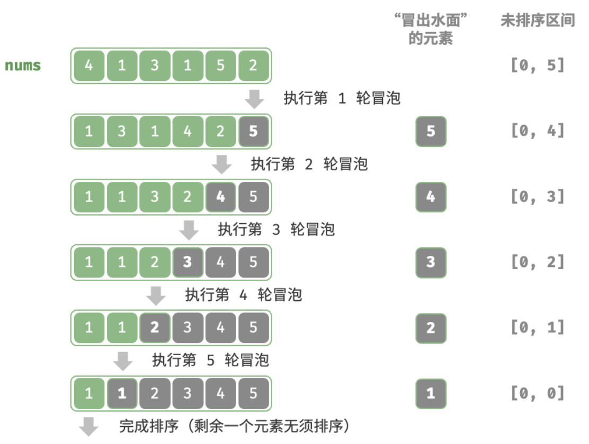

# 算法相关

[Hello算法](https://www.hello-algo.com/)

## 冒泡排序

冒泡排序（bubble sort）通过连续地比较与交换相邻元素实现排序。

从数组最左端开始向右遍历，依次比较相邻元素大小，如果 “左元素 > 右元素” 就交换二者。遍历完成后，最大的元素会被移动到数组的最右端。

算法流程：

1. 首先，对 𝑛 个元素执行“冒泡”，将数组的最大元素交换至正确位置。
2. 接下来，对剩余 𝑛 − 1 个元素执行“冒泡”，将第二大元素交换至正确位置。
3. 以此类推，经过 𝑛 − 1 轮“冒泡”后，前 𝑛 − 1 大的元素都被交换至正确位置。
4. 仅剩的一个元素必定是最小元素，无须排序，因此数组排序完成。



算法优化：

如果某轮“冒泡”中没有执行任何交换操作，说明数组已经完成排序，可直接返回结果。因此，可以增加一个标志位 flag 来监测这种情况，一旦出现就立即返回。

```js
function bubble(nums) {
  const len = nums.length;
  for (let i = len - 1;i > 0;i--) {
    let flag = false;
    for (let j = 0;j < i;j++) {
      if (nums[j] > nums[j+1]) {
        const temp = nums[j];
        nums[j] = nums[j+1];
        nums[j+1] = temp;
        flag = true;
      }
    }
    // 本轮冒泡没有交换元素，直接跳出循环
    if (!flag) break;
  }
}
```

冒泡排序的最差时间复杂度和平均时间复杂度仍为 𝑂(𝑛²) ；但当输入数组完全有序时，可达到最佳时间复杂度 𝑂(𝑛) 。