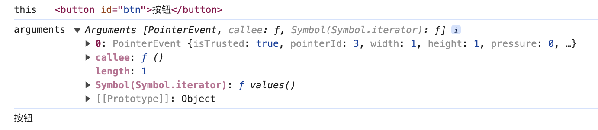
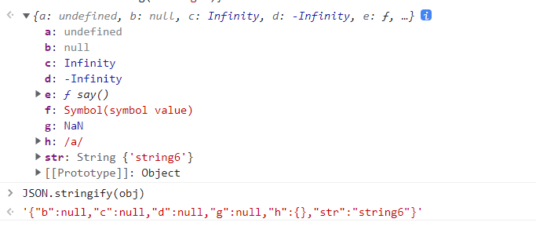
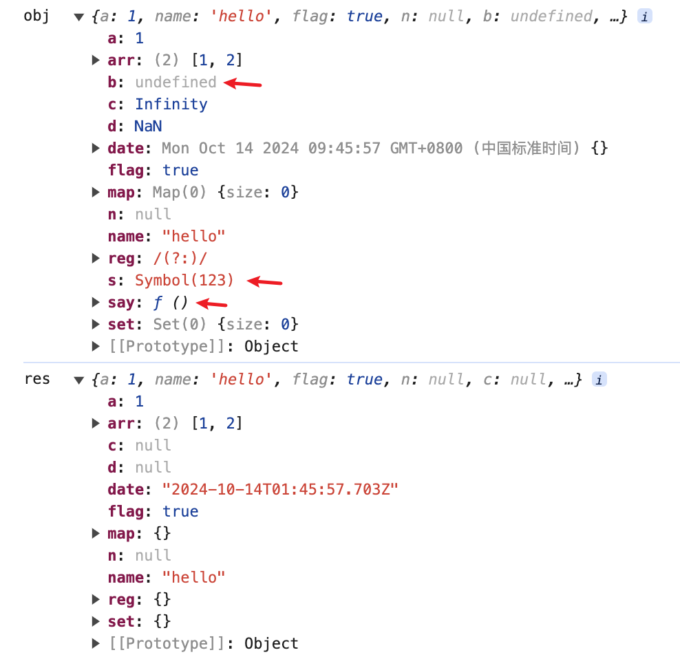

# 前端编程题

## debounce 防抖

防抖原理：连续触发事件，只有最后一次事件被触发 n 秒之后才会执行回调，是解决事件回调频繁调用的手段之一。

实现思路：

- 事件触发，设置定时器，在 n 秒之后调用回调
- 若 n 秒之内再次触发事件，则清空定时器并重新设置

注意事项：`this` 指向的修正、参数的正确传递。

```js
// 写法一：使用普通函数
function debounce(func, delay) {
  let timer = null;

  return function() {
    // 先清除定时器
    if (timer) {
      clearTimeout(timer);
    }

    const context = this;
    const args = arguments;
    // 设置定时器，delay 秒后执行回调
    timer = setTimeout(function() {
      // 修改this指向，指向调用者
      // 如果直接func()，this指向window，定时器里面
      func.apply(context, args);
    }, delay)
  }
}

// 写法二：使用箭头函数
function debounce(func, delay) {
  let timer = null

  return function() {
    if(timer) {
      clearTimeout(timer);
    }
    // 箭头函数没有this和arguments，用的是上层函数的，所以不用额外用变量记录
    timer = setTimeout(() => {
      func.apply(this, arguments);
    }, delay);
  }
}
```

```html
<button id="btn">按钮</button>
<script>
  const btn = document.getElementById('btn');
  btn.onclick = debounce(function() {
    // this应该指向btn
    console.log('this', this);
    // arguments有事件对象event
    console.log('arguments', arguments);
    // 打印出「按钮」
    console.log(arguments[0].target.innerText);
  }, 1000);
</script>
```


## throttle 节流

节流原理：连续触发事件，每隔 n 秒执行一次回调，解决事件回调频繁调用的手段之一。

实现思路：主要有两种，使用时间戳判断和定时器。

### 时间戳

主要流程：
- 一个变量 `now` 记录当前事件触发的时间戳，一个变量 `previous` 记录上一次触发的时间戳
- 事件触发，判断 `now` 与 `previous` 的差值是否大于时间间隔 `wait`。若大于则调用回调函数，并将 `previous` 更新为 `now` 的值
- 若 n 秒内再次触发事件，由于存在时间差节流阀，不会再次调用回调函数

```js
function throttle(func, wait) {
  let previous = 0;

  return function () {
    const now = +new Date();
    if (now - previous >= wait) {
      func.apply(this, arguments);
      previous = now;
    }
  };
}
```

### 定时器

主要流程：
- 事件触发，设置定时器，在 n 秒之后执行回调函数并清空定时器
- 若 n 秒内再次触发事件，不会做任何动作

这种写法是触发事件之等待 delay 后再执行回调。

```js
// 写法一：普通函数
function throttle(func, delay) {
  let timer = null;

  return function () {
    // 有定时器，停止后续操作
    if (timer) {
      return;
    }

    const context = this;
    const args = arguments;
    timer = setTimeout(() => {
      func.apply(context, args);
      // 要设置成null，用clearTimeout只是停掉计时器，timer还是会记录着定时器编号
      timer = null;
    }, delay);
  };
}

// 写法二：箭头函数
function throttle(func, delay) {
  let timer = null;
  return function() {
    if (timer) {
      return;
    }
    timer = setTimeout(() => {
      func.apply(this, arguments);
      timer = null;
    }, delay);
  }
}
```

这种写法是触发事件后马上执行回调，和时间戳的方式相同效果。

```js
function throttle2(func, delay) {
  let timer = null;
  return function () {
    if (timer) {
      return;
    }
    // 调用func的时机不同
    func.apply(this, arguments);
    timer = setTimeout(() => {
      timer = null;
    }, delay);
  };
}
```

也可以使用一个变量标志。

```js
function throttle(func, delay) {
  let flag = true;
  return function() {
    if (!flag) {
      return;
    }
    flag = false;
    setTimeout(() => {
      func.apply(this, arguments);
      flag = true;
    }, delay);
  }
}
```

### 结合体

时间戳和定时器方式各有独特的效果：时间戳会在事件触发的时候立即执行一次回调函数，定时器方式会在停止触发事件之后再执行一次回调函数。

这就是 `lodash` 和 `underscore` 工具库 `throttle` 方法的 `leading` 和 `trailing` 配置参数。

[Lodash throttle](https://www.lodashjs.com/docs/lodash.throttle#_throttlefunc-wait0-options){link=card}

```js
function throttle(func, wait, option) {
  if (typeof option !== 'object') {
    option = {};
  }
  let previous = 0;
  let timer = null;
  const { leading, trailing } = option;

  const throttled = function () {
    const context = this;
    const args = arguments;
    const now = +new Date();
    if (previous === 0 && leading === false) {
      previous = now;
    }
    const remaining = wait - (now - previous);

    if (remaining <= 0) {
      // 若时间戳先执行了，清空定时器
      if (timer) {
        clearTimeout(timer);
        timer = null;
      }
      func.apply(context, args);
      previous = now;
      return;
    }
    if (!timer && trailing === true) {
      timer = setTimeout(() => {
        // 若定时器先执行了，更新previous时间
        previous = +new Date();
        func.apply(context, args);
        clearTimeout(timer);
        timer = null;
      }, remaining);
    }
  };

  return throttled;
}
```

注意，若时间戳先执行了，则要清空定时器，若定时器先执行了，则要更新previous时间。否则如果不断触发事件，会出现执行两次回调的情况。

## unique 去重

数组去重，经典中的经典。

### 双重循环

双重循环，最原始同时也是兼容性最好的版本。

```js
function unique1(arr) {
  const res = [];
  for(let i = 0;i < arr.length;i++) {
    // 注意这里用 var，否则下面的判断无法取到 j
    // 当然也可以在外层定义好
    for(var j = 0;j < res.length;j++) {
      if(arr[i] === res[j]) {
        break;
      }
    }
    if(j === res.length) {
      res.push(arr[i]);
    }
  }
  return res;
}
```

使用数组的 `indexOf` 方法，可以简化代码。

```js
function unique2(arr) {
  const res = [];
  for(let i = 0;i < arr.length;i++) {
    if(res.indexOf(arr[i]) === -1) {
      res.push(arr[i]);
    }
  }
  return res;
}
```

### `underscore` 版本

`underscore` 的去重方法主要有两个额外参数：`isSorted` 和 `iteratee`。

`isSorted` 参数标识待去重的数组是否已经排好序，如果是排序好的数组使用更快捷的方法（判断当前元素是否与前一个元素相同，相同即重复，只需一次遍历）进行去重。

`iteratee` 传递一个自定义函数，对于数组每一个元素，是对该函数处理后的返回值进行比较，达到自定义去重规则的效果。

```js
function unique3(arr, isSorted, iteratee) {
  const res = [];
  // 存储自定义函数处理后的值
  const dealValueArr = [];
  // 排序情况下的前一个值
  const previousValue = undefined;

  for(let i = 0;i < arr.length;i++) {
    const value = arr[i];
    const dealValue = iteratee ? iteratee(value) : value;

    if(isSorted) {
      // 若是第一个元素或者和前一个元素不相同
      if(i === 0 || value !== previousValue) {
        res.push(value);
      }
      previousValue = value;
    } else if(iteratee) {
      if(dealValueArr.indexOf(dealValue) === -1) {
        // 注意res压入的是原始数组的值，不是经自定义函数处理后的返回值
        res.push(value);
        dealValueArr.push(dealValue);
      }
    } else {
      if(res.indexOf(value) === -1) {
        res.push(value);
      }
    }
  }
  return res;
}
```

### Object 键值对

该方法的主要思路是：把数组元素作为 key 值存入一个对象里面，在判断一个元素是否重复时，只需要看对象是否存在这个元素的 key 值。

`typeof item + JSON.stringify(item)` 的处理是为了保证 key 值唯一。

```js
function unique4(arr) {
  const obj = {};
  return arr.filter(function(item, index, array) {
    const keyValue = typeof item + JSON.stringify(item);
    return obj.hasOwnProperty(keyValue) ? false : (obj[keyValue] = true)
  })
}
```

### 不能 JSON 序列化的特殊值

json 是独立于编程语言的数据存储和表示格式，也就是说它只能存储各个语言通用的东西，JavaScript 特有的一些值无法正确 JSON 序列化。



:::tip
如图，`undefined`、JS 方法、`Symbol` 类型值经过 `stringify()` 处理后都丢失了。

`Infinity`、`NaN` 和数字相关的特殊值转换成了 `null`。

正则表达式转换成了空对象 `{}`。
:::

### 利用 ES6 新特性

扩展运算符天下无双。

```js
function unique5(arr) {
  return [...new Set(arr)];
}
```


## shallowClone 浅拷贝

### 手撸浅拷贝

```js
function shallowClone(obj) {
  // 不是对象直接返回
  if(obj === null || typeof obj !== 'object' || obj instanceof RegExp) {
    return obj;
  }

  // 对象循环拷贝
  const res = obj instanceof Array ? [] : {};
  // for...in 可以遍历自身和继承而来的可枚举属性
  for(let key in obj) {
    // 是对象自身的属性才拷贝，继承来的不拷贝
    if(obj.hasOwnProperty(key)) {
      res[key] = obj[key];
    }
  }
  return res;
}
```

由于 `typeof null` 的结果是 `object`，因此需要单独判断 `null` 值，否则拷贝 `null` 值会得到空对象 `{}`，比较怪异。

JS 发展到今天，除了手撸一个浅拷贝函数之外，还能使用 `Object.assign()`、`...扩展运算符` 浅拷贝对象和数组，`concat()`、`slice()` 浅拷贝数组。

### Object.assign()

Object.assign() 方法可以把任意多个对象的可枚举属性拷贝给目标对象，然后返回目标对象。

```js
var obj1 = { a: 10, b: { b: 20 }, c: { c: 30} };
var obj2 = Object.assign({}, obj1);
obj2.a = 100;
obj2.b = 200;
obj2.c.c = 300;

console.log(obj1); // { a: 10, b: { b: 20}, c: { c: 300 } }
console.log(obj2); // { a: 100, b: 200, c: { c: 300 } }
```

### lodash 的 _.clone 方法

使用 lodash 库提供的 _.clone 方法进行浅拷贝。

```js
var _ = require('lodash');
var obj1 = {
    a: 1,
    b: { f: { g: 1 } },
    c: [1, 2, 3]
};
var obj2 = _.clone(obj1);

console.log(obj1.b.f === obj2.b.f); // true
```

### 扩展运算符

```js
var obj = { a: 1 };
var obj2 = { ...obj };
```

### Array.prototype.concat()

浅拷贝数组。

```js
let arr = [1, 3, { username: 'kobe' }];
let arr2 = arr.concat();    
arr2[2].username = 'wade';
console.log(arr); //[ 1, 3, { username: 'wade' } ]
```

### Array.prototype.slice()

浅拷贝数组。

```js
let arr = [1, 3, { username: 'kobe' }];
let arr2 = arr.slice();    
arr2[2].username = 'wade';
console.log(arr); //[ 1, 3, { username: 'wade' } ]
```

[js深拷贝和浅拷贝及其实现方式](https://segmentfault.com/a/1190000039310119){link=static}

## deepClone 深拷贝

深拷贝就是在浅拷贝的基础上判断遍历拷贝的值是否为对象，如果是对象，则递归调用深拷贝函数。

### 手撸深拷贝
```js
function deepClone(obj) {
  if(obj === null || typeof obj === 'function' || typeof obj !== 'object' ||  instanceof RegExp) {
    return obj;
  }

  const res = obj instanceof Array ? [] : {};
  for(let key in obj) {
    if(obj.hasOwnProperty(key)) {
      res[key] = deepClone(obj[key]);
    }
  }
  return res;
}
```

上述方式是比较基础的深拷贝实现方式，能实现日常开发常见对象的拷贝，没有考虑 DOM 对象、时间对象等特殊情况。

不过也能应对日常开发的需求了，如果需要拷贝特殊对象再进行额外的考虑即可。例如像 RegExp 正则对象，如果不直接返回，而是进入后续的逻辑判断，就会返回一个空对象。

### `JSON`

使用 `JSON.stringify()` 和 `JSON.parse()` 方法实现深拷贝。

这种方法简单方便，但无法正确拷贝 JS 特有的数据类型，如 `undefined`、JS 方法、`Symbol`、`Infinity`、`NaN`。

- undefined、JS 函数、Symbol 直接丢失了。

- null、NaN、Infinity 转换成 null。

- date 日期对象转换成对应的日期时间字符串，正则对象、map、set 转换为空对象。

```js
const obj = {
  a: 1,
  name: 'hello',
  flag: true,
  n: null,
  b: undefined,
  say: function() {},
  s: Symbol(123),
  c: Infinity,
  d: NaN,
  arr: [1,2],
  date: new Date(),
  reg: new RegExp(),
  map: new Map(),
  set: new Set()
}

console.log('obj ', obj);
const res = JSON.parse(JSON.stringify(obj));
console.log('res ', res);
```



### `lodash`

使用 `lodash` 的 `cloneDeep()` 方法。

日常开发最佳解决方案，使用成熟的解决方案。缺点是需要额外引入第三方库。

```js
var _ = require('lodash');
var obj1 = {
  a: 1,
  b: { f: { g: 1 } },
  c: [1, 2, 3]
};
var obj2 = _.cloneDeep(obj1);
console.log(obj1.b.f === obj2.b.f); // false
```

### `MessageChannel`

一种比较少见的方式，利用 `MessageChannel` 消息通道接口。

```js
function deepClone(obj) {
  return new Promise((resolve) => {
    const { port1, port2 } = new MessageChannel();
    // port1 端口监听消息
    port2.onmessage = event => resolve(event.data);
    // port2 发送消息，会自动把 obj 进行深拷贝，port1 收到的就是拷贝好的对象
    port1.postMessage(obj);
  });
}

const obj = {};
const res = await deepClone(obj);
```

该方法好处是可以拷贝 `undefined` 和循环引用对象，但是不能拷贝 `Symbol类型数据`、方法对象，并且是异步的，使用起来要多写点代码。

:::details 结构化克隆算法
`postMessage` 发送的数据 `message` 将会被结构化克隆算法 (en-US) 序列化。这意味着你可以不受什么限制的将数据对象安全的传送给目标窗口而无需自己序列化。

结构化克隆算法用于复制复杂 JavaScript 对象的算法。通过来自 `Worker` 的 `postMessage()` 或使用 `IndexedDB` 存储对象时在内部使用。它通过递归输入对象来构建克隆，同时保持先前访问过的引用的映射，以**避免无限遍历循环**。
:::

:::details 结构化克隆不能做到的
- `Function` 对象是不能被结构化克隆算法复制的；如果你尝试这样子去做，这会导致抛出 `DATA_CLONE_ERR` 的异常。
- 企图去克隆 DOM 节点同样会抛出 `DATA_CLONE_ERR` 异常。
- 对象的某些特定参数也不会被保留
  - `RegExp` 对象的 `lastIndex` 字段不会被保留
  - 属性描述符，`setters` 以及 `getters`（以及其他类似元数据的功能）同样不会被复制。例如，如果一个对象用属性描述符标记为 `read-only`，它将会被复制为 `read-write`，因为这是默认的情况下。
  - 原形链上的属性也不会被追踪以及复制。
:::

相关链接：

[MDN MessageChannel](https://developer.mozilla.org/zh-CN/docs/Web/API/MessageChannel){link=card}

[MDN postMessage](https://developer.mozilla.org/zh-CN/docs/Web/API/Window/postMessage){link=card}

[MDN 结构化克隆算法](https://developer.mozilla.org/zh-CN/docs/Web/API/Web_Workers_API/Structured_clone_algorithm){link=card}

## 实现once函数，传入的函数只执行一次

实现一个 once 函数，要求传入的函数只能执行一次，且第二次及以后再调用时，仍会返回第一次执行的值。

```js
function once(func) {
  // 缓存函数调用结果
  let result;
  return function() {
    // func执行过一次，直接返回缓存的结果
    if (!func) {
      return result;
    }
    result = func.apply(this, arguments);
    // 表示func已经执行过一次
    func = null;
    return result;
  }
}

const obj = {}; 
obj.addOnce = once(function(a, b) {
  console.log(this);
  return a + b;
});
console.log(obj.addOnce(1,2)); // { addOnce: fn() } 3
console.log(obj.addOnce(3,4)); // 还是3，且不会再打印this
```

利用闭包，我们返回的新函数有两个 “私有” 的变量可以访问：

- 传入的 fn 函数。
- 额外声明的用于缓存结果的 result 变量。

当返回的新函数被调用时，我们先将参数传给 fn，拿到返回值缓存到 result。然后将 fn 设置为 undefined（或 null），用于标识别已经执行了一次，最后返回 result。

[JavaScript写一个 once 函数，让传入函数只执行一次](https://juejin.cn/post/7061973702451134477){link=static}

## 求数组最值

取出数组的最大值或最小值，以取出最大值为例。

### 遍历比较

最原始，同时也是兼容性最好的方式。

```js
function getMax(arr) {
  let res = -Infinity;
  for(let i = 0;i < arr.length;i++) {
    res = arr[i] > res ? arr[i] : res;
  }
  return res;
}
```

### `reduce` 方法

通过遍历数组最终得到一个值，可以考虑 `reduce` 方法。

```js
function getMax(arr) {
  return arr.reduce((pre, cur) => cur > pre ? cur : pre)
}

function getMax(arr) {
  return arr.reduce((pre, cur) => Math.max(pre, cur))
}
```

[MDN reduce](https://developer.mozilla.org/zh-CN/docs/Web/JavaScript/Reference/Global_Objects/Array/reduce){link=card}

### 排序

给数组排序好，那么最大值就是数组第一个或最后一个元素。

```js
function getMax(arr) {
  // 数组降序排序，首个元素即为最大值
  arr.sort((a, b) => b - a);
  return arr[0];
}
```

### `Math.max()` 方法

使用 JS 提供的 `Math.max()` 方法，可以方便求出数组的最大值。

其实准确来说，该方法是返回传入参数的最大值。如果要使用它求出数组的最大值，需要将数组转换成**逗号分隔的参数序列**，否则会把数组整体当作一个参数看待。

```js
Math.max(3,2,4,1); // 4
```
#### 数组转为参数序列

下面讨论如何把数组转换成参数序列，作为 `Math.max()` 的正确入参。

1. `Function.prototype.apply()`

`apply()` 方法可以把数组转成参数序列传递给调用函数。

```js
function getMax(arr) {
  return Math.max.apply(null, arr);
}
```

2. ES6 扩展运算符

```js
function getMax(arr) {
  return Math.max(...arr);
}
```

:::warning 注意事项
如果数组元素太多，扩展运算符和 `apply()` 方法可能会得到错误的结果，这是因为 JS 引擎存在参数长度的上限，参数数量太多会出现问题。
:::

:::details MDN 文档说明
注意：如果按上面方式调用 `apply`，有超出 JavaScript 引擎参数长度上限的风险。一个方法传入过多参数（比如一万个）时的后果在不同 JavaScript 引擎中表现不同。（JavaScriptCore 引擎中有被硬编码的参数个数上限：65536）。

这是因为此限制（实际上也是任何用到超大栈空间的行为的自然表现）是不明确的。一些引擎会抛出异常，更糟糕的是其他引擎会直接限制传入到方法的参数个数，导致参数丢失。比如：假设某个引擎的方法参数上限为 4（实际上限当然要高得多），这种情况下，上面的代码执行后，真正被传递到 `apply` 的参数为 `5, 6, 2, 3`，而不是完整的数组。
:::

[MDN max](https://developer.mozilla.org/zh-CN/docs/Web/JavaScript/Reference/Global_Objects/Math/max){link=card}

3. `eval()` 方法

```js
function getMax(arr) {
  return eval('Math.max(' + arr + ')');
}
```

`eval()` 方法的原理是发生了隐式类型转换，它会调用数组的 `toString()` 方法将其转换为字符串，就变成了参数序列。如 `[1,2,3] => "1,2,3"`。

但是呢，如果数组里面混入了一些蛇皮牛马，比如说对象、空数组、`null`、`undefined`，就可能会大红大紫地报错了。

为什么说**可能**呢，得看数组元素数量和具体的特殊值。只要看看这个数组调用 `toString()` 后的返回值即可知道是否会报错。

```js
[null, undefined, [], {}].toString(); // ',,,[object Object]'
[null, undefined].toString(); // ','
[null].toString(); // ''
```

空数组、`null`、`undefined` 转换后会变成空串，如果数组只包含一个这种元素，得到的结果也是空串，不会报错。如果是多个，就会出现逗号，此时会报 `Unexpected token ','` 的错误。

同理，对象就更是这样了，对象会转成 `[object Object]` 字符串，更加不行，会出现 `Unexpected identifier 'Object'` 的错误。


#### 注意事项

`Math.max()` 注意事项：

1. 如果没有参数，返回 `-Infinity`。

```js
Math.max(); // -Infinity
```

2. 如果其中一个参数无法转为数值，返回 `NaN`。

```js
Math.max('max', 1); // NaN
Math.max(-1, []); // 0
Math.max(5, [6]); // 6
Math.max(5, ['6']); //6
Math.max(5, [6, 1]); // NaN
Math.max(1, Symbol()) // Cannot convert a Symbol value to a number
```

:::tip 判断一个值是否可转为数值
要判断一个值是否可转为数值，使用 `Number()` 看看结果对不对即可。

常见的像非纯数字字符串(如 `123n`)、对象`{}`、函数、包含两个及以上元素的数组、只包含一个元素且该元素无法转成数值的数组(如 `['66n']`)。

特殊地，如果尝试转换 `Symbol` 类型值，会报错。
:::

3. 不要试图 `new Math()`。

`Math` 不是构造函数，不能 `new` 创建实例，会报错。

直接 `Math.max()` 使用，`max()` 是 `Math` 的静态方法。

```js
var n = new Math(); // Math is not a constructor
```

## 手写 call、apply、bind

### call

主要思路：将原函数挂载到指定对象上，接着通过该对象调用原函数，从而将函数的 this 指向指定对象，最后将函数从对象属性上删除。

难点：在 ES5 中，如何将 arguments 类数组的参数，转换为逗号分割的参数序列，给原函数传递参数。

```js
// ES5 实现
Function.prototype.myCall = function (obj) {
  // 如果 obj 为空，则挂载到全局对象上，Node 是 global
  // Object(obj) 是为了防止传入基本类型
  var context = obj ? Object(obj) : window;

  // 为了防止属性名冲突，拼接上当前时间戳
  var key = 'fn' + new Date().getTime();
  // var key = 'fn' + +new Date();
  context[key] = this;

  // 获取参数，从第二个开始，第一个是 context 
  var args = [];
  for (var i = 1;i < arguments.length;i++) {
    args.push(arguments[i]);
  }

  // 假设 args 是 [1, 2, 3]
  // 调用字符串：context[key](1,2,3)
  // 这样也可以：'context.' + key + '(' + args + ')'，结果是：context.fn1623844656(1,2,3)
  // 在这里，args 会自动调用数组的 toString 方法，转换为逗号分割的参数序列字符串 1,2,3
  var callStr = 'context[key](' + args + ')';
  // eval 函数将字符串当作 JS 代码执行
  var res = eval(callStr);

  // 删除临时添加的属性
  delete context[key];
  return res;
}
```

无注释版本：

```js
// ES5 实现
Function.prototype.myCall = function (obj) {
  var context = obj ? Object(obj) : window;

  var key = 'fn' + new Date().getTime();
  context[key] = this;

  var args = [];
  for (var i = 1;i < arguments.length;i++) {
    args.push(arguments[i]);
  }

  var callStr = 'context[key](' + args + ')';
  var res = eval(callStr);

  delete context[key];
  return res;
}

// 使用 Symbol
Function.prototype.myCall = function (obj) {
  var context = obj ? Object(obj) : window;

  // 每个 Symbol 都是独一无二的，不会冲突
  var key = Symbol();
  context[key] = this;

  var args = [];
  for (var i = 1;i < arguments.length;i++) {
    args.push(arguments[i]);
  }

  var callStr = 'context[key](' + args + ')';
  var res = eval(callStr);

  delete context[key];
  return res;
}

// ES6 实现
Function.prototype.myCall = function (obj, ...rest) {
  const context = obj ? Object(obj) : window;

  const key = Symbol();
  context[key] = this;

  const res = context[key](...rest);

  delete context[key];
  return res;
}
```

### apply

apply 的实现和 call 类似，区别就在于 apply 传递的参数是数组，而 call 传递的参数是逗号分割的参数序列。

```js
// ES5 实现
Function.prototype.myApply = function (context, args) {
  var context = context ? Object(context) : window;

  var key = 'fn' + new Date().getTime();
  context[key] = this;

  var callStr = 'context[key](' + args + ')';
  var res = eval(callStr);

  delete context[key];
  return res;
}

// ES6 实现
Function.prototype.myApply = function (context, args) {
  const context = context ? Object(context) : window;

  const key = Symbol();
  context[key] = this;

  const res = context[key](...args);

  delete context[key];
  return res;
}
```

### bind

实现 bind 的几个关键点：

- 改变 this 指向。

- bind 返回一个函数。

- 预设参数，即参数可以在 bind 中传递，也可以在 bind 返回的函数中传递。

- 需要保留原函数的原型 prototype。

- 需要判断 bind 返回的函数是否被 new 了。

```js
// ES5 的实现
Function.prototype.myBind = function (context) {
  // 保留原函数
  var fn = this;
  //  arg1 是 bind 函数里传递的参数，从第 2 个开始
  var arg1 = Array.prototype.slice.call(arguments, 1);

  // 返回的新函数
  var result = function() {
    //  arg2是调用新函数时传递的参数
    var arg2 = Array.prototype.slice.call(arguments);
    // 如果这个新函数被 new 了，直接取 this
    return fn.apply(this instanceof result ? this : context, arg1.concat(arg2));
  }

  // 维护原型链
  result.prototype = fn.prototype;
  return result;
}

// ES6 的实现
Function.prototype.myBind = function (context, ...arg1) {
  const fn = this;
  const result = function(...arg2) {
    return fn.apply(this instanceof result ? this : context, [...arg1, ...arg2]);
  }
  result.prototype = fn.prototype;
  return result;
}
```

## 手写 Promise.all 和 Promise.race

[手写promise的方法（all、race、allSettled、any、finally），你会几个](https://blog.csdn.net/weixin_45774485/article/details/122462081){link=static}

### Promise.all

要点：

- Promise.all() 方法接收一个 iterable 类型数据（如数组、字符串）。下面的实现代码没有做这一步判断。

:::tip 检查是否是可迭代数据
通过检查数据的 `Symbol.iterator` 是不是 `function` 来判断是否为可迭代对象。

```js
const arr = [];
arr[Symbol.iterator]; // ƒ values() { [native code] }

const a = 1;
a[Symbol.iterator]; // undefined
```
:::
[[JS] 检查一个对象是否可迭代](https://blog.csdn.net/sinat_36246371/article/details/103671711){link=static}

- 返回一个 promise 实例。

- 当所有 promise 都成功，返回的 promise 才会成功，并且成功的结果是所有 promise 的成功返回值组成的数组。

- 当有一个 promise 失败了，返回的 promise 就会失败，并且失败的结果是第一个失败 promise 的结果。

- 如果传入一个空数组，返回一个成功状态的 promise，且成功结果是一个空数组。

```js
Promise.myAll = function(arr) {
  // 传入的Promise个数
  const len = arr.length;
  const res = new Array(len);
  // 进入fullfilled状态的promise个数
  let count = 0;
  // 如果传入空数组，直接返回一个已fulfilled状态的promise
  if (len === 0) {
    return Promise.resolve(arr);
  }
  return new Promise((resolve, reject) => {
    for (let i = 0; i < len; i++) {
      // Promise.resolve可将非Promise对象转为Promise对象
      Promise.resolve(arr[i]).then((value) => {
        // 成功的结果保存在res对应索引位置
        res[i] = value;
        // 成功promise个数+1
        count += 1;
        // 若全部promise都成功，则返回结果
        if (count === len) {
          resolve(res);
        }
      }, (err) => {
        // 有一个promise失败，直接进入失败状态
        reject(err);
      })
    }
  })
}

const promise1 = Promise.resolve(3);
const promise2 = 42;
const promise3 = new Promise((resolve, reject) => {
  setTimeout(resolve, 1000, "foo1");
});

Promise.myAll([promise1, promise2, promise3]).then((value) => {
  console.log('val ', value);
}, (err) => {
  console.log('err ', err);
}); // val [3, 42, "foo1"]
```

### Promise.race

要点：

- 传入的参数也是 iterable 类型数据。

- 返回一个 promise 实例。

- 只要传入的 promise 有一个状态发生改变，返回的 promise 状态就会改变，结果就是状态改变的 promise 的结果。

- 如果传入一个空数组，返回的 promise 一直保持在 pending 状态。

```js
Promise.myRace = function(arr) {
  return new Promise((resolve, reject) => {
    for (let i = 0;i < arr.length;i++) {
      // 只要有一个promise状态改变了，就调用函数
      Promise.resolve(arr[i]).then(resolve, reject);
    }
  })
}

// 和下面的写法是一样的
Promise.myRace = function(arr) {
  return new Promise((resolve, reject) => {
    for (let i = 0;i < arr.length;i++) {
      Promise.resolve(arr[i]).then((res) => {
        resolve(res);
      }, (err) => {
        reject(err);
      })
    }
  })
}

const promise3 = new Promise((resolve, reject) => {
  setTimeout(resolve, 1000, "foo1");
});
const promise4 = new Promise((resolve, reject) => {
  setTimeout(resolve, 200, "foo2");
});
const promise5 = new Promise((resolve, reject) => {
  setTimeout(reject, 100, "foo3");
});

Promise.myRace([promise3, promise4, promise5]).then((value) => {
  console.log('val ', value);
}, (err) => {
  console.log('err ', err);
}); // err foo3
```

## 用 ES5 实现 const

由于ES5环境没有block的概念，所以是无法百分百实现const，只能是挂载到某个对象下，要么是全局的window，要么就是自定义一个object来当容器。

```js
function _const(key, value) {
  var globalObject = typeof window === 'undefined' ? global : window;
  // 给全局对象设置属性
  Object.defineProperty(globalObject, key, {
    // 设置不可枚举，模拟const定义的值「遍历全局对象无法找到」的效果
    enumerable: false,
    configurable: false,
    get() {
      return value;
    },
    set() {
      // 只要赋值就报错
      throw new Error('Assignment to constant variable.')
    }
  })
};

_const('a', 10)
console.log(a)
delete a
console.log(a)
// 因为const定义的属性在global下也是不存在的，所以用到了enumerable: false来模拟这一功能
for (let item in window) {
  // 因为不可枚举，所以不执行
  if (item === 'a') {
    console.log(window[item])
  }
}
a = 10 // 报错

_const('obj', { age: 22 });
console.log(obj); // { age: 22 }
obj.age = 24;
obj.name = 'hello';
console.log(obj); // { age: 24, name: 'hello' }
obj = { name: 'world' }; // 报错
```

[如何在 ES5 环境下实现一个const ？](https://juejin.cn/post/6844903848008482824){link=static}

[如何用es5实现const](https://blog.csdn.net/Alive_tree/article/details/107839058){link=static}

## js 继承

继承的本质就是复制，即重写子类原型对象，从而让子类的实例得以复用父类定义的属性和方法。

### 原型链继承

原理：把子类构造函数的原型对象，指向父类构造函数的实例。

```js
function Person() {
  this.age = 40;
  this.name = 'jack';
  this.list = [1];
}
Person.prototype.showAge = function() {
  console.log(this.age);
}

function Student() {
  this.no = 1;
}

// 关键语句，将子类构造函数的原型，指向父类的实例
Student.prototype = new Person();

var stu1 = new Student();
stu1.showAge(); // 40
console.log(stu1.name); // jack
console.log(stu1.age); // 40
```

优点：简单，可以继承父类构造函数和原型对象里定义的属性和方法。

缺点：

- 子类在实例化对象的时候，不能向父类构造函数传参。

- 原型对象中的引用类型数据会被所有子类实例共享，在一个子类实例中对引用类型数据的修改，会影响到其它实例对象。

```js
var stu1 = new Student();
var stu2 = new Student();
stu1.list.push(2);
console.log(stu2.list); // [1, 2]，stu2的list被污染了
```

### 构造函数继承

原理：子类构造函数通过call或apply调用父类构造函数，从而实现属性的继承。

```js
function Person(name, age) {
  this.age = age;
  this.name = name;
  this.personSay = function() {
    console.log('personSay...')
  }
}
Person.prototype.showAge = function() {
  console.log(this.age);
}

function Student(name, age) {
  // 关键语句，通过call调用父类构造函数，将父类构造函数里的属性方法拷贝一份到子类实例
  Person.call(this, name, age);
  this.no = 1;
}

var stu1 = new Student('Ben', 88);
console.log(stu1.age); // 88
stu1.personSay(); // personSay...
stu1.showAge(); // TypeError: stu1.showAge is not a function
```

优点：子类每个实例都有自己的属性，不会互相污染。

缺点：

- 无法继承父类原型对象里的属性和方法。

- 无法重用父类构造函数里定义的方法，每次创建子类实例都会创建一遍方法，影响性能。（方法也是一个对象，会占用内存）

### 组合式继承

原理：结合原型链继承和构造函数继承。

用原型链继承父类原型对象的属性和方法，用构造函数继承父类构造函数定义的属性和方法。

```js
function Person(name, age) {
  this.age = age;
  this.name = name;
  this.personSay = function() {
    console.log('personSay...')
  };
  this.list = [1];
}
Person.prototype.showAge = function() {
  console.log(this.age);
}

function Student(name, age) {
  // 关键语句
  Person.call(this, name, age);
  this.no = 1;
}
// 关键语句
Student.prototype = new Person();
// 这种写法算是一种优化，减少一次执行父类构造函数，效果相同。其实这么写就变成了寄生组合式继承了。
// Student.prototype = Object.create(Person.prototype);
// 重写Student.prototype的constructor属性，使其指向Student
Student.prototype.constructor = Student;

var stu1 = new Student('hello', 77);
stu1.showAge(); // 77
stu1.personSay(); // personSay...
console.log(stu1.name); // hello

var stu2 = new Student('world', 88);
stu1.list.push(2,3);
console.log(stu2.list); // [1]，引用类型数据不会被污染
```

缺点：

- 执行了两次父类构造函数，开销较大。

- 父类构造函数的属性方法创建了两份，一份在 Student.prototype 上，一份在子类实例上。实例的属性覆盖了原型对象的属性。

### 原型式继承

原理：利用一个空对象作为中介，将某个对象直接赋值给空对象构造函数的原型。

```js
function object(obj){
  function F(){}
  F.prototype = obj;
  return new F();
}

var person = {
  name: "Nicholas",
  friends: ["Shelby", "Court", "Van"]
};

var anotherPerson = object(person);
anotherPerson.name = "Greg";
anotherPerson.friends.push("Rob");

var yetAnotherPerson = object(person);
yetAnotherPerson.name = "Linda";
yetAnotherPerson.friends.push("Barbie");

alert(person.friends);   //"Shelby,Court,Van,Rob,Barbie"
```

缺点：

- 原型链继承多个实例的引用类型属性指向相同，存在篡改的可能。

- 无法传递参数。

另外，ES5中存在Object.create()的方法，能够代替上面的object方法。

### 寄生式继承

原理：在原型式继承的基础上，增强对象，返回构造函数。

```js
function createAnother(original){
  var clone = object(original); // 通过调用 object() 函数创建一个新对象
  clone.sayHi = function(){  // 以某种方式来增强对象
    alert("hi");
  };
  return clone; // 返回这个对象
}
```

函数的主要作用是为构造函数新增属性和方法，以增强函数。

```js
var person = {
  name: "Nicholas",
  friends: ["Shelby", "Court", "Van"]
};
var anotherPerson = createAnother(person);
anotherPerson.sayHi(); //"hi"
```

缺点（同原型式继承）：

- 原型链继承多个实例的引用类型属性指向相同，存在篡改的可能。
- 无法传递参数

### 🌟寄生组合式继承

原理：结合借用构造函数传递参数和寄生模式实现继承。

```js
function inheritPrototype(subType, superType){
  // 创建对象，创建父类原型的一个副本
  var prototype = Object.create(superType.prototype);
  // 增强对象，弥补因重写原型而失去的默认的 constructor 属性
  prototype.constructor = subType;
  // 指定对象，将新创建的对象赋值给子类的原型
  subType.prototype = prototype;
}

// 父类初始化实例属性和原型属性
function SuperType(name){
  this.name = name;
  this.colors = ["red", "blue", "green"];
}
SuperType.prototype.sayName = function(){
  alert(this.name);
};

// 借用构造函数传递增强子类实例属性（支持传参和避免篡改）
function SubType(name, age){
  SuperType.call(this, name);
  this.age = age;
}

// 将父类原型指向子类
inheritPrototype(SubType, SuperType);
// 其实这个函数可以用两行代码替代
// SubType.prototype = Object.create(SuperType.prototype);
// SubType.prototype.constructor = SubType;

// 新增子类原型属性
SubType.prototype.sayAge = function(){
  alert(this.age);
}

var instance1 = new SubType("xyc", 23);
var instance2 = new SubType("lxy", 23);

instance1.colors.push("2"); // ["red", "blue", "green", "2"]
instance1.colors.push("3"); // ["red", "blue", "green", "3"]
```

这个例子的高效率体现在它只调用了一次 SuperType 构造函数，并且因此避免了在 SubType.prototype 上创建不必要的、多余的属性。

这是最成熟的方法，也是现有库的实现方法。

### 混入方式继承多个对象

```js
function MyClass() {
  // 继承多个父类的构造函数的属性
  SuperClass.call(this);
  OtherSuperClass.call(this);
}

// 继承原型对象上的东西
// 继承一个类
MyClass.prototype = Object.create(SuperClass.prototype);
// 混合其它
Object.assign(MyClass.prototype, OtherSuperClass.prototype);
// 重新指定constructor
MyClass.prototype.constructor = MyClass;

MyClass.prototype.myMethod = function() {};

var obj = new MyClass();
```

Object.assign 会把 OtherSuperClass 原型上的函数拷贝到 MyClass 原型上，使 MyClass 的所有实例都可用 OtherSuperClass 的方法。

### ES6 类继承

extends 关键字主要用于类声明或者类表达式中，以创建一个类，该类是另一个类的子类。其中 constructor 表示构造函数，一个类中只能有一个构造函数，有多个会报出 SyntaxError 错误,如果没有显式指定构造方法，则会添加默认的 constructor 方法。

```js
class Rectangle {
  constructor(height, width) {
    this.height = height;
    this.width = width;
  }
  
  get area() {
    return this.calcArea()
  }
  
  calcArea() {
    return this.height * this.width;
  }
}

const rectangle = new Rectangle(10, 20);
console.log(rectangle.area); // 输出 200

class Square extends Rectangle {
  constructor(length) {
    super(length, length);
    // 如果子类中存在构造函数，则需要在使用“this”之前首先调用 super()。
    this.name = 'Square';
  }

  get area() {
    return this.height * this.width;
  }
}

const square = new Square(10);
console.log(square.area); // 输出 100
```

extends 继承的核心代码如下，其实现和上述的寄生组合式继承方式一样。

```js
function _inherits(subType, superType) {
  // 创建对象，创建父类原型的一个副本
  // 增强对象，弥补因重写原型而失去的默认的constructor 属性
  // 指定对象，将新创建的对象赋值给子类的原型
  subType.prototype = Object.create(superType && superType.prototype, {
    constructor: {
      value: subType,
      enumerable: false,
      writable: true,
      configurable: true
    }
  });
  
  if (superType) {
    Object.setPrototypeOf 
      ? Object.setPrototypeOf(subType, superType) 
      : subType.__proto__ = superType;
  }
}
```