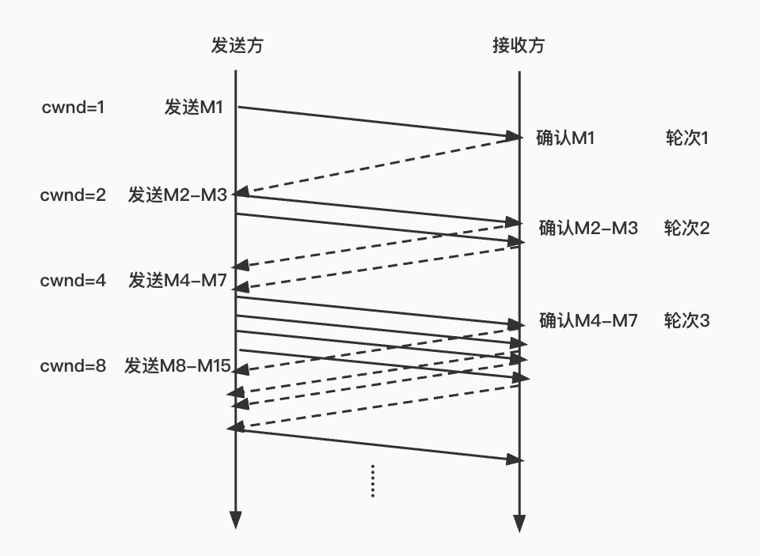
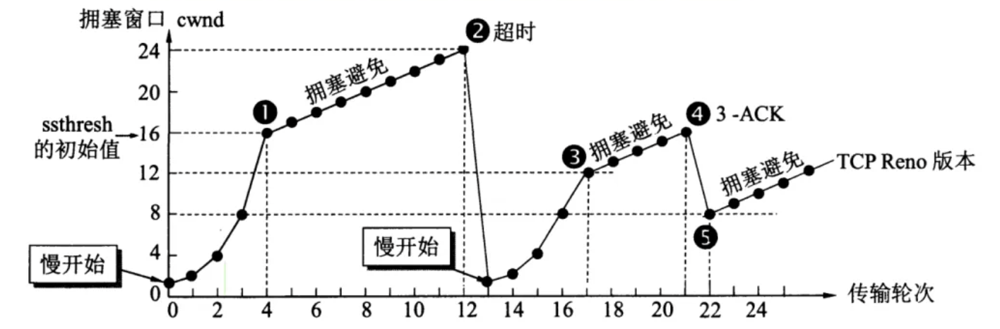
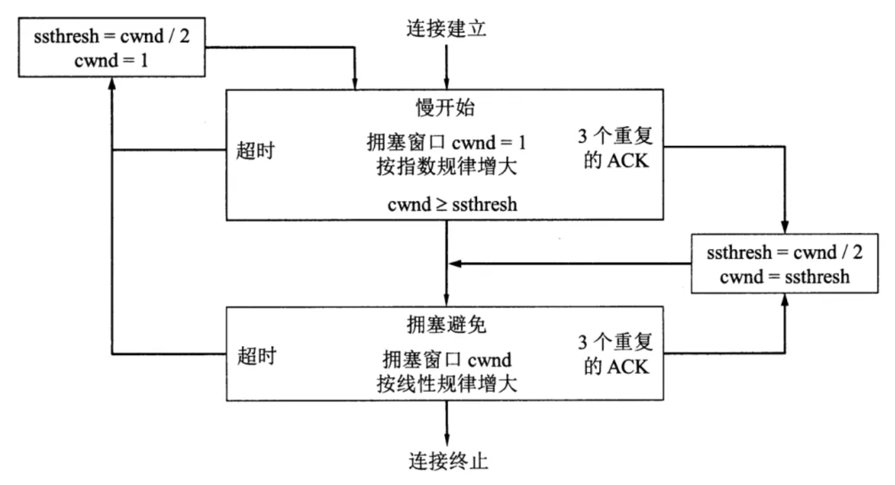

# 计算机网络

## HTTP2.0 之前的发展

[HTTP协议发展历史](https://www.cnblogs.com/AhuntSun-blog/p/12021886.html){link=static}

### HTTP/0.9

- 只有 GET 命令，没有 HEADER 等描述数据的信息。

### HTTP/1.0

- 增加了很多命令，如 POST、PUT 等。

- 增加了状态码和 HEADER 相关信息。

- 增加了缓存。

### HTTP/1.1

- 持久连接，不会关闭 TCP 连接。

- 增加了 pipeline，可以在同⼀个 TCP 连接⾥⾯发送多个 http 请求，不过这是串⾏的。

- 增加了头部 host，即可以在同⼀台服务器(物理服务器)上同时跑多个 web 服务。

## HTTP2.0 特性

[有关HTTP2.0详解](https://zhuanlan.zhihu.com/p/452042342){link=static}

### 头部信息压缩

在 HTTP2.0 中，使用了 HPACK（HTTP2 头部压缩算法）压缩格式对传输的 header 进行编码，减少了 header 的大小。

同时在两端维护索引表，用于记录出现过的 header，后面在传输过程中就可以传输已经记录过的 header 键名，对端收到数据之后，就可以通过键名找到对应的值。

### 推送功能

在请求 html 的同时，服务器端可以主动把 html 里面所引用到的 css 和 js 文件推送到客户端，这样 html、css、js 的发送就是并行而不是串行的，整体的传输效率和性能得到提高。

在 HTTP2.0 中，服务器可以对一个客户端的请求发送多个响应。如果客户端发送了一个请求，服务器可能会响应网页内容、logo 以及样式表，因为它知道客户端会用到这些东西。这样不但减少了数据传送的冗余步骤，也加快了页面的响应速度，提高了用户体验。

推送功能的限制：服务器主动推送的资源必须遵守同源策略。也就是说，服务器不能随便将第三方的资源推送给客户端，而必须经过双方的确认才行。

### 二进制分帧

所有传输的数据都会被分割，并采⽤⼆进制格式编码。

### 多路复用

在 HTTP1.x 中，我们经常会使用雪碧图、使用多个域名等方式来进行优化，这是因为浏览器限制了同一个域名下的请求数量。当页面需要请求很多资源的时候，队头阻塞（Head of line blocking）会导致在达到最大请求时，资源需要等待其它资源请求完成后才能继续发送。

HTTP2.0 中，基于二进制分帧层，HTTP2.0 可以在共享 TCP 连接的基础上同时发送请求和响应。

HTTP 消息被分解为独立的帧，而不破坏消息本身的语义，交错发出去。另一端根据流标识符和首部将它们重新组装起来。通过该技术，可以避免 HTTP 旧版本的队头阻塞问题，提高传输性能。

#### 如何确认优先级？

把 HTTP 消息分为很多独立帧后，就可以通过优化这些帧的交错和传输顺序进一步优化性能。

HTTP2.0 中，不同浏览器拥有不同的优先级树，对于不同的资源优先级会不同。例如，html、css、阻塞性js、影响 LCP 等指标的图片的优先级会比较高，并且优先级并不是静态不变的。

在 HTTP3 中进行了统一，取消了优先级树，建立 8 个等级的优先级表，支持自定义优先级。不过不同浏览器还是存在不同的资源优先级表现。

## HTTP 持久连接

HTTP1.0 协议中并未定义持久连接的实现方式，但是一些服务端和客户端开始使用了这种方式进行持久连接。

如果浏览器支持 `keep-alive`，它会在请求头中添加 `Connection: Keep-Alive`，服务器收到请求，作出响应的时候，它也会在响应头中添加相同的 HTTP 头部。

在完成响应之后的一段时间内会保持 TCP 连接。客户端知道服务端支持持久连接，因此在发送另一个请求时，会直接使用同一个连接发送请求。这种持久连接将一直保持，直到客户端或服务端认为无需继续维持时主动中断连接，或者使用 `Connection: close` 字段通知对方可以关闭连接。

在 HTTP1.1 中，默认所有连接都是持续连接，除非任意一方在请求的时候明确声明不支持持久连接。HTTP1.1 的持久连接不需要使用独立的 keep-alive 信息，但是出于兼容性考虑，实现上通常还是会像 HTTP1.0 一样添加 `Connection: Keep-Alive` 字段。

HTTP2.0 协议要求双⽅必须⽀持复⽤连接。HTTP3.0 因为使⽤基于 UDP 的 QUIC 协议，故此不存在“连接”的概念，⾃然⽆需提供持久连接。

持久连接的不足：

持久连接只有在客户端需要发送多于一个请求时才能发挥优势。在客户端只需要发起一个请求的场景下，持久连接会导致客户端请求完成之后的一段时间内，仍然与服务端保持不必要的连接，反而导致性能下降。

## HTTP 长连接短连接

### 1. HTTP协议与TCP/IP协议的关系

HTTP 的长连接和短连接本质上是 TCP 的长连接和短连接。HTTP 属于应用层协议，在传输层使用 TCP 协议，在网络层使用 IP 协议。IP 协议主要解决网络路由和寻址问题，TCP 协议主要解决如何在 IP 层之上可靠的传递数据包，使网络的另一端收到发送端发出的所有包，并且顺序和发出顺序一致。TCP 有可靠、面向连接的特点。

### 2. 如何理解HTTP协议是无状态的

HTTP 协议是无状态的，这指的是协议对事务处理没有记忆能力，服务器不知道客户端是什么状态。也就是说，打开一个服务器上的网页，和你之前打开这个服务器上的网页之间没有任何联系。HTTP 是一个无状态的面向连接的协议，无状态不代表 HTTP 不能保持 TCP 连接，更不能代表 HTTP 使用的是 UDP 协议（无连接）。

### 3. 什么是长连接、短连接

在 HTTP1.0 中，默认使用的是短连接。也就是说，浏览器和服务器每进行一次 HTTP 操作，就建立一次连接，但任务结束就中断连接。如果客户端浏览器访问的某个 HTML 页面中包含其它资源，例如 JS 文件、图片、css 文件等，浏览器每遇到一个资源，就会建立一个 HTTP 会话。

从 HTTP1.1 起，默认使用长连接，用以保持连接特性。使用长连接通常会在头部信息中添加 `Connection: Keep-Alive` 字段，实际上就是 HTTP 持久连接。

HTTP协议的长连接和短连接，实质上是TCP协议的长连接和短连接。

### 4. TCP 短连接

我们模拟一下 TCP 短连接的情况，client 向 server 发起连接请求，server 收到请求，双方建立连接。client 向 server 发送消息，server 响应 client，这样一次读写就完成了，此时双方任何一个都可以发起 close 操作。不过一般都是 client 先发起 close 操作，一般的 server 不会回复完立即关闭连接，当然不排除有特殊情况。短连接一般只会在客户端和服务器之间传递一次读写操作。

短连接的优点：管理简单，存在的连接都是有用的连接，不需要额外的控制手段。

缺点：如果客户请求频繁，将在 TCP 的建立和关闭操作上浪费时间和带宽。

### 5. TCP 长连接

再模拟一下 TCP 长连接的情况。client 向 server 发起连接，server 接受连接，双方建立连接。完成一次读写之后，它们之间的连接不会主动关闭，后续的读写操作会继续使用这个连接。

说一下 TCP 的保活功能，保活功能主要为服务器应用提供，服务器应用希望知道客户主机是否崩溃，是否需要使用资源。如果客户端已经消失，使得服务器保留一个半开放的连接，而服务器又在等待来自客户端的数据，就会造成连接冗余资源浪费。保活功能就是试图在服务器端检测到这种半开放连接。

如果一个给定的连接在两小时内没有动作，则服务器会向客户端发送一个探测报文，客户端主机可能处于以下 4 个状态之一：

- 客户主机正常运行，并且从服务器可达。客户的 TCP 响应正常，而服务器也知道对方是正常的，服务器会在两小时后将保活定时器复位。

- 客户主机已经崩溃，并且已经关闭或正在重新启动。在这种情况下，客户的 TCP 没有响应，服务器收不到对探测的响应数据，并在 75 秒后超时。服务器总共会发送 10 个探测报文，每个间隔 75 秒。如果服务器收不到一个响应，就认为客户主机已经关闭，并终止连接。

- 客户主机崩溃，并已经重新启动。服务器将收到一个对其保活探测的响应，但这个响应是一个复位，使得服务器终止这个连接。

- 客户主机正常运行，但服务器不可达，这种情况与第二种情况类似，服务器收不到探测报文的响应，终止连接。

长连接优点：省去较多的 TCP 建立和关闭的操作，减少浪费，节约时间。

缺点：如果客户端的长连接越来越多，可能会造成服务器的崩溃。此时服务端需要采取一些策略，如关闭一些长时间没有读写事件发生的连接，这样可以避免一些恶意连接导致服务受损；如果条件再允许就可以以客户端机器为颗粒度，限制每个客户端的最大长连接数，避免某些客户端连累后端服务。

### 6. 使用场景

长连接多用于操作频繁，点对点的通讯的情况，而且连接数量不能太多。例如，数据库的连接使用长连接。

像 Web 网站的 HTTP 服务一般使用短连接，因为长连接对服务器来说会耗费一定资源，像 Web 网站数目庞大的客户端连接，使用短连接会大大减轻服务器的压力。如果每个用户都占用一个长连接，服务器可能承受不住压力。因此并发量大，每个用户都无需频繁操作的情况下，使用短连接更合适。

[HTTP长连接和短连接](https://www.cnblogs.com/0201zcr/p/4694945.html){link=static}

## TCP 保活功能

TCP 的保活功能，它是一种用于检测和维护 TCP 连接存活状态的机制。主要目的是确保 TCP 连接在长时间无数据交换的情况下仍然保持活跃，并及时发现处理连接中断的情况。TCP 保活功能通过定期发送保活探测报文来工作，如果对方主机在一定时间内没有响应，则会认为连接已经断开，并采取相应的措施。

### 保活机制的原理

- 保活探测报文：当 TCP 连接建立后，开启保活功能的一端会启动一个计时器。当计时器数值到达0后（即经过 `tcp_keepalive_time` 时间后），会发送一个保活探测报文。这个报文不包含任何数据，或者包含一个无意义的字节。

- 参数设置：TCP 保活功能的三个重要参数包括：`tcp_keepalive_time`（保活探测报文的发送间隔）、`tcp_keepalive_probes`（在未收到响应时发送保活探测报文的次数）和 `tcp_keepalive_intvl`（两次保活探测报文之间的间隔）。

### 保活功能的作用

- 探测连接对端的状态：通过保活探测报文，可以及时发现客户端或服务器端是否由于意外断电、死机、崩溃、重启等原因导致连接中断。

- 防止中间设备因超时删除连接：中间设备（如防火墙）可能会因为长时间没有数据交换的连接而将其从连接表中删除，导致后续报文传输失败。保活机制可以维持这些连接，避免因中间设备的问题导致应用异常。

### 应用场景与问题

应用场景：

- 长连接：在需要保持长时间连接的应用中，如即时通讯、在线游戏等，TCP保活机制可以有效地检测并维护连接的存活状态。

- NAT穿越：NAT（Network Address Translation）网络地址转换，是一种用于隐藏内部网络IP地址的技术。在通过 NAT 设备的网络环境中，保活机制可以防止 NAT 设备因连接空闲而回收连接，从而保证连接的稳定性。

可能带来的问题：

- 增加网络流量：保活探测报文会增加网络流量，尤其是在大量连接的情况下。

- 影响电池寿命：对于移动设备来说，保活探测报文会增加设备的功耗，从而影响电池寿命。

## 队头阻塞问题

简要介绍看这两篇文章，HTTP2.0 的队头阻塞和 TCP 的队头阻塞问题。

[HTTP/2做错了什么？刚刚辉煌2年就要被弃用了！？](https://blog.51cto.com/u_13626762/4945161){link=static}

[HTTP 3.0彻底放弃TCP，TCP到底做错了什么？](https://blog.51cto.com/u_13626762/5731626){link=static}

深入分析介绍看这篇文章，长文预警！

[关于队头阻塞（Head-of-Line blocking），看这一篇就足够了](https://zhuanlan.zhihu.com/p/330300133){link=static}

## HTTP 和 HTTPS

HTTPS：以安全为目标的 HTTP 通道，简单而言就是 HTTP 的安全版，它在 HTTP 下加入了 SSL 层。

SSL（Secure Socket Layer）是安全套接层，目的是保证数据传输的安全和完整。

TLS（Transport Layer Security）是传输层安全，它是 SSL 的改进版。

SSL 位于应用层和传输层之间，处理的对象是数据流，加密算法是 RC4 对称加密。

HTTP 和 HTTPS 的主要区别：

- HTTPS 协议需要到 ca 申请证书，一般免费证书较少，因此需要一定费用。

- HTTP 是超文本传输协议，信息是明文传输，HTTPS 则是具有安全性的 SSL 加密传输协议。

- HTTP 和 HTTPS 使用的是完全不同的连接方式，使用端口也不同，前者是 80，后者是 443。

- HTTP 的连接很简单，是无状态的；HTTPS 协议是由 SSL+HTTP 协议构建的可进行加密传输、身份认证的网络协议，比 HTTP 协议安全。

[HTTP与HTTPS的区别](https://www.cnblogs.com/wqhwe/p/5407468.html){link=static}

## SSL 和 TLS

TLS 传输层安全性协议，它的前身是 SSL 安全套接层，目的是为互联网通信提供安全及数据完整性保障。

SSL 包含记录层（Record Layer）和传输层。记录层确定传输层数据的封装格式。传输层使用 X.509 认证，之后利用非对称加密验算来对通信方做身份认证，之后交换对称密钥作为会话密钥（Session Key）。这个会话密钥是用来将通信双方交换的资源进行加密，保证两个应用间通信的保密性和可靠性，使用户和服务器之间的通信不被攻击者窃听。

TLS 协议的优势是与高层的应用层协议（如 HTTP、FTP、Telnet）无耦合。应用层协议能透明地运行在 TLS 协议之上，由 TLS 协议进行建立加密通道需要的协商和认证。应用层协议传送的数据在通过 TLS 协议时都会被加密，从而保证通信的私密性。

TLS 协议是可选的，必须配置客户端和服务器才能使用。主要有两种方式：

1. 使用统一的 TLS 协议端口，例如用于 HTTPS 的端口 443。

2. 客户端请求服务器连接到 TLS 时，使用特定的协议机制，例如电子邮件常用的 STARTTLS。

一旦客户端和服务器都同意使用 TLS 协议，它们通过使用一个握手过程协商出一个有状态的连接，来传输数据。通过握手，客户端和服务器协商各种参数用于建立安全连接。

TLS 在互联网上为 HTTP 等应用程序提供身份验证、加密、完整性，其基础是公钥基础设施。这是因为公钥基础设施普遍商业运营。TLS 协议的设计在某种程度上能够使主从架构应用程序通讯预防窃听、干扰和消息伪造。

TLS包含⼏个基本阶段：

1. 对等协商⽀持的TLS版本，和⽀持的密码包。

2. 基于⾮对称密钥的身份认证，通常是基于PKI证书的身份认证。服务器将其X.509证书发送给客户端，由客户端验证服务器的身份。如果服务器要验证客户端的证书，则客户端可能会将客户端证书发送给服务器。通常仅验证服务器，不验证客户端。

3. 基于对称密钥的数据加密。客户端⽣成随机数作为会话密钥，并使⽤服务器公钥（服务器公钥在服务器证书中）加密会话密钥，最后将已加密的会话密钥发送给服务器。由服务器的私钥解密出会话密钥。最后使⽤此会话密钥加密数据。TLS也可以使⽤预共享密钥（PSK）作为对称密钥。

在第⼆步基于⾮对称加密的身份认证中，可能存在中间⼈攻击的情况，需要引⼊消息摘要（同时使⽤双⽅的公私钥）和CA证书解决。

[SSL协议原理详解](https://blog.csdn.net/qq_38265137/article/details/90112705){link=static}

[SSL与TLS到底有何区别，一见分晓](https://blog.csdn.net/luo_boke/article/details/114220450){link=static}

加密相关各种概念明晰：

[数字签名/数字证书/对称/非对称加密/CA 等概念明晰](https://juejin.cn/post/7032540460774080543){link=static}

## HTTP3.0

- 基于 QUIC 协议：HTTP3.0 使用基于 UDP 的 QUIC 协议来传输数据。相较于 TCP 协议，QUIC 协议可以提供更快的连接建立和传输速度，减少了网络延迟和丢包率。

- 队头阻塞（HOL）问题得到更好地解决，让不同的流之间真正的实现相互独立传输，互不干扰。

- 集成了 TLS 加密：HTTP3.0 集成了 TLS 加密，从而保护网络传输的安全性。

- 0-RTT 连接：HTTP3.0 支持 0-RTT 连接，即客户端可以在没有建立连接的情况下向服务器发送请求，从而进一步减少网络延迟和页面加载时间。

- 切换网络时的连接保持：当用户的网络发生切换时，比如从办公室或家里出门，WiFi 断开，网络切换为4G。基于 TCP 协议，切换网络后，IP 会改变，因此之前的连接不能继续保持。而基于 UDP 的 QUIC 协议，可以内建与 TCP 中不同的连接标识方法，从而在网络完成切换之后，恢复之前与服务器的连接。

[HTTP1.0、HTTP2.0、HTTP 3.0及HTTPS简要介绍](https://blog.csdn.net/glpghz/article/details/106063833){link=static}

## UDP 如何保证连接可靠性

- 前向纠错（Forward Error Correction，FEC）：HTTP3.0 使用 FEC 技术来纠正数据包的丢失。即在发送数据包的同时，发送一些冗余数据，接收方可以利用这些冗余数据来还原丢失的数据包，从而提高数据的可靠性。

- 重传机制：HTTP3.0 在 QUIC 中实现了自己的重传机制，当发生数据包丢失或损坏时，会进行重传，确保数据的可靠传输。

- 拥塞控制：HTTP3.0 基于 QUIC 实现了自己的额拥塞控制机制，可以根据网络实时情况自适应地调整数据传输的速率，避免网络拥堵和数据包丢失。

[Http 2.0和http3.0对⽐之前的版本, 分别做了哪些改进?](https://www.yuque.com/__workers/brucecai-svygq/iaetod/gtpqtct2n9tzaiki/pdf?key=exports%3Apdf%3Adoc%3A175195566%3A1719327309000-73bf0fee&export_type=pdf&copyright_watermark=&image_copyright_watermark=&x-yuque-fc-token=q0ELo7G4tw9sU6xN-fouJQ%3D%3D%7CwUro1s8VK8HoxER8_QNeWpwp2RGbJ2_H5llz7Mf1nTE%3D){link=static}

## 流量控制

- 何为流量控制？目的？

流量控制是作⽤于接收者的，它是控制发送者的发送速度从⽽使接收者来得及接收，防⽌分组丢失的。

由滑动窗⼝协议（连续 ARQ 协议）实现。滑动窗⼝协议既保证了分组⽆差错、有序接收，也实现了流量控制。主要的⽅式就是接收⽅返回的 ACK 中会包含⾃⼰的接收窗⼝的⼤⼩，并且利⽤⼤⼩来控制发送⽅的数据发送。

- 流量控制引发的死锁？怎么避免死锁的发⽣？

当发送者收到了⼀个窗⼝为0的应答，发送者便停⽌发送，等待接收者的下⼀个应答。但是如果这个窗⼝不为 0 的应答在传输过程丢失，发送者⼀直等待下去，⽽接收者以为发送者已经收到该应答，等待接收新数据，这样双⽅就相互等待，从⽽产⽣死锁。

为了避免流量控制引发的死锁，TCP使⽤了持续计时器。

每当发送者收到⼀个零窗⼝的应答后就启动该计时器，时间⼀到便主动发送报⽂询问接收者的窗⼝⼤⼩。

若接收者仍然返回零窗⼝，则重置该计时器继续等待；若窗⼝不为0，则表示应答报⽂丢失了，此时重置发送窗⼝后开始发送，这样就避免了死锁的产⽣。

- 流量控制和拥塞控制的区别

拥塞控制：拥塞控制是作用于网络的，它是防止过多的数据注入到网络中，避免出现网络负载过大的情况；常用的方法就是：（1）慢开始、拥塞避免（2）快重传、快恢复。

流量控制：流量控制是作用于接收者的，它是控制发送者的发送速度从而使接收者来得及接收，防止分组丢失的。

## 拥塞控制

发送方维持一个叫做 **「拥塞窗口 cwnd」**（congestion window）的状态变量。拥塞窗口的大小取决于网络的拥塞程度，并且动态地在变化。发送方让自己的发送窗口等于拥塞窗口，另外考虑到接受方的接收能力，发送窗口可能小于拥塞窗口。

### 慢开始算法（指数增加）

主要思路：不要一开始就发送大量的数据，先探测一下网络的拥塞程度，也就是说由小到大逐渐增加拥塞窗口的大小。

这里用报文段的个数作为拥塞窗口的大小举例说明慢开始算法，实际的拥塞窗口大小是以字节为单位的。

一个传输轮次所经历的时间其实就是往返时间 RTT，每经过一个传输轮次（transmission round），拥塞窗口 cwnd 就翻倍。

为了防止 cwnd 增长过大引起网络拥塞，还需设置一个慢开始门限 `ssthresh` 状态变量。ssthresh的用法如下：

- 当 cwnd < ssthresh 时，使用慢开始算法。

- 当 cwnd > ssthresh 时，改用拥塞避免算法。

- 当 cwnd = ssthresh 时，慢开始与拥塞避免算法任意。

### 拥塞避免算法（线性增加）

拥塞避免算法让拥塞窗口缓慢增长，即每经过一个往返时间 RTT 就把发送方的拥塞窗口 cwnd 加1，而不是加倍。这样拥塞窗口按线性规律缓慢增长。

无论是在慢开始阶段还是在拥塞避免阶段，只要发送方判断网络出现拥塞（其根据就是没有按时收到确认，虽然没有收到确认可能是其他原因的分组丢失，但是因为无法判定，所以都当做拥塞来处理），就把慢开始门限 ssthresh 设置为出现拥塞时的发送窗口大小的一半（但不能小于2）。然后把拥塞窗口 cwnd 重新设置为1，执行慢开始算法。

这样做的目的就是要迅速减少主机发送到网络中的分组数，使得发生拥塞的路由器有足够时间把队列中积压的分组处理完毕。

:::warning 关于乘法减小和加法增大：
乘法减小（Multiplicative Decrease）和加法增大（Additive Increase）。

「乘法减小」指的是无论是在慢开始阶段还是在拥塞避免阶段，只要发送方判断网络出现拥塞，就把慢开始门限 ssthresh 设置为出现拥塞时的发送窗口大小的一半，并执行慢开始算法，所以当网络频繁出现拥塞时，ssthresh 下降的很快，以大大减少注入到网络中的分组数。

『加法增大』是指执行拥塞避免算法后，使拥塞窗口缓慢增大，以防止过早出现拥塞。

常合起来成为 AIMD 算法。
:::

注意：「拥塞避免」并不完全能够避免阻塞，而是使网络比较不容易出现拥塞。

### 快重传算法

当报文段在网络中丢失，但实际上网络未发生拥塞，为了避免超时使发送方启动慢开始算法，降低传输效率，让发送方尽早知道发生了个别报文段的丢失。

快重传要求接收方在收到一个失序的报文段后就立即发出重复确认，而不要等到自己发送数据时捎带确认。为的是使发送方及早知道有报文段没有到达对方，可提高网络吞吐量约20%。

快重传算法规定，发送方只要一连收到三个重复确认，就应当立即重传对方尚未收到的报文段，而不必继续等待设置的重传计时器时间到期。

### 快恢复算法

- 当发送方连续收到三个重复确认时，把 ssthresh 门限设置为当前 cwnd 的一半，即 `ssthresh = cwnd/ 2`，同时设置拥塞窗口 `cwnd = ssthresh`，然后执行拥塞避免算法，使 cwnd 缓慢增大。

### 总结

完整的拥塞控制流程图：

注意点：

- 在慢开始阶段，如果就收到 3 个重复确认，也是执行 `ssthresh = cwnd / 2，cwnd = ssthresh`，启动拥塞避免算法。

- 在慢开始阶段，如果就发生超时，执行 `ssthresh = cwnd / 2，cwnd = 1`，重新启动慢开始算法。

参考文章：

快重传的ssthresh设置描述有误：[TCP流量控制、拥塞控制](https://zhuanlan.zhihu.com/p/37379780){link=static}

描述更准确：[TCP的拥塞控制方法](https://mp.weixin.qq.com/s?__biz=Mzg5MzE2MDcyMQ==&mid=2247484590&idx=1&sn=a4b9662087356c2ec3d89b422561d3b3&chksm=c1b73a7fc2b5b265704acd66e5c1c9655b68ceb669af5820a75effc24ee5edb4802c0fb137ae#rd)

## HTTP 状态码

### 总览

| 状态码 | 代表状态                | 含义                     |
| ------ | ----------------------- | ------------------------ |
| 1xx    | information 信息        | 请求正在处理             |
| 2xx    | success 成功            | 请求成功                 |
| 3xx    | redirection 重定向      | 需要进行附加操作完成请求 |
| 4xx    | client error 客户端错误 | 客户端出错               |
| 5xx    | server error 服务端错误 | 服务端出错               |

### 4xx

| 状态码                     | 含义                                                                                         |
| -------------------------- | -------------------------------------------------------------------------------------------- |
| 400 Bad Request            | 请求报文存在语法错误，需修改再次发送                                                         |
| 401 Unauthorized           | 发送的请求需要有通过 HTTP 认证的认证信息或认证失败                                           |
| 403 Forbidden              | 服务器拒绝访问。**跨域**访问、未获得文件系统的访问授权、从未授权的 IP 发送请求都可能返回 403 |
| 404 Not Found              | 找不到请求的资源                                                                             |
| 415 Unsupported Media Type | 服务器无法处理请求附带的媒体格式，通过添加 `content-type` 请求头指明数据类型                 |

400 一般是两种情况：

- 前端传的参数类型或者名称与后台接收参数的实体类的属性类型或者名称不一致
- 前端提交 ajax 请求的数据应该是 json 格式字符串的，但是却没有将对象转换成 json 格式的字符串

401 和 403 的区别：

- 401 指客户端没有认证或认证失败，可以修改认证信息重试
- 403 指客户端认证成功了，但没有资格访问资源，且在获得权限之前不用再重试了

### 5xx

| 状态码                         | 含义                                               |
| ------------------------------ | -------------------------------------------------- |
| 500 Internal Server Error      | 服务端内部错误                                     |
| 501 Not Implemented            | 服务端无法完成请求，如无法识别请求方法             |
| 502 Bad Gateway                | 网关错误，可能是服务器没开或压力太大响应不过来     |
| 503 Service Unavailable        | 服务端处于超负载状态或正停机维护，暂时无法处理请求 |
| 504 Gateway Time-out           | 网关超时                                           |
| 505 HTTP Version Not Supported | 服务端不支持 HTTP 协议的版本                       |

#### 相关链接

- [HTTP Status 400 (HTTP400 状态码)](https://blog.csdn.net/qq_22182643/article/details/103103078/)

- [401 与 403 的区别](https://blog.csdn.net/condoleeA/article/details/104589824/)

- [HTTP 状态码 401 和 403 深度解析](https://juejin.cn/post/6844903590763429895)

- [HTTP 请求返回 415 错误码定位解决](https://majing.blog.csdn.net/article/details/78383772)

- [HTTP 状态码 502 深度解析](https://blog.csdn.net/Xu_pengtao/article/details/122884259)

## webSocket

在 webSocket 出现之前，实现实时通讯采用轮询的方式，耗费了大量的带宽和 CPU 资源。webSocket 更侧重于实时通信，而 HTTP2 更侧重于提高传输效率，所以两者的帧结构也有很大的区别。websocket 不像 HTTP2 那样定义流，也就不存在多路复用、优先级等特性。

特点：

- 全双工、二进制帧、协议名（ws、wss）、握手（需要握手才能正式收发数据）。

- 握手的过程为：客户端发送的请求中包含了 Upgrade: websocketConnection: Upgrade，以及一个 base 编码的密文，用于简单的认证密钥。服务器返回 Upgrade: websocketConnection: Upgrade 表示接受 websocket 协议的客户端连接，返回一个密钥用于验证客户端请求报文，防止误连接。

优点：

- 较少的控制开销：数据包头部协议较小，不同于 HTTP 每次请求需要携带完整的头部。

- 更强的实时性：相对于 HTTP 请求需要等待客户端发起请求服务端才能响应，延迟明显更少，允许服务端主动向客户端推送数据。

- 保持创连接状态：创建通信后，可省略状态信息，不同于 HTTP 每次请求需要携带身份验证。

- 更好的二进制支持：定义了二进制帧，更好处理二进制内容。

- 支持扩展：用户可以扩展 websocket 协议，实现部分自定义的子协议。

- 更好的压缩效果：websocket 在适当的扩展支持下，可以沿用之前内容的上下文，在传递类似的数据时，可以显著地提高压缩率。

应用：

- 弹幕

- 媒体聊天

- 协同编辑

- 基于位置的应用

- 体育实况更新

- 股票基金报价实时更新

[WebSocket 原理与应用](https://www.cnblogs.com/frank-link/p/14835705.html){link=static}

## TCP 三次握手

### 三次握手主要流程

三次握手的目的是连接服务器指定端口，建立连接，并同步连接双方的序列号和确认号，交换窗口大小信息。

第一次握手：

客户端发送请求报文，SYN 标志位设置为 1，初始化序列号 seq=x。随后客户端进入 SYN-SENT 状态。该报文不携带应用层数据。

第二次握手：

服务端收到客户端的 SYN 报文后，发送确认报文。SYN 和 ACK 标志位置为1，确认应答号 ACKnum=x+1，初始化序列号 seq=y，随后进入 SYN-RCVD 状态。该报文也不携带应用层数据。

第三次握手：

客户端收到服务端的 SYN+ACK 报文后，发送确认报文。ACK 标志位设置为1，SYN设置为0，确认应答号 ACKnum=y+1，随后客户端进入 ESTABLISHED 状态。该报文可以携带数据。

服务端收到客户端的确认报文后，也进入 ESTABLISHED 状态。

### 为什么需要三次？两次可以吗？四次呢？

三次握手是理论上建立可靠连接所需要的最少次数。

1、防止历史连接初始化了连接，避免资源浪费。

RFC 793 指出的 TCP 连接使用三次握手的主要原因：

> The principle reason for the three-way handshake is to prevent old duplicate connection initiations from causing confusion.
>
> 避免老的重复连接初始化造成混乱。

假设客户端第一次握手的 SYN 报文由于网络拥塞导致超时，此时客户端又重新发送了一次 SYN 报文。

在只有两次握手的情况下，如果服务端收到了旧的 SYN 报文，由于没第三次握手确认，马上就进入了 ESTABLISHED 状态，建立起了连接。但对于客户端来说，这是个历史冗余的连接。

而且服务端进入 ESTABLISHED 状态后，是可以发送数据的。因此如果只有两次握手，不能够阻止历史连接，服务端也白白发送了数据，造成了资源的浪费。

所以，要阻止掉历史连接，避免资源浪费，就需要三次握手。

2、同步双方初始序列号

客户端发送携带初始序列号的 SYN 报文后，需要服务端返回 ACK 应答报文，表示客户端的 SYN 报文已经被服务端成功接收。

同样地，服务端发送携带初始序列号的报文后，也需要得到客户端的回应，这样一来一回才能确保双方的序列号得到同步。

第一次握手让服务器端知道了客户端发送能⼒正常，第⼆次握⼿客户端知道服务器端接收和发送能⼒正常，⽽此时服务器端还不知道客户端接收能⼒是否正常，所以需要第三次握⼿。

总结：

- 通过三次握手可以防止历史连接的建立，避免不必要的资源浪费，帮助双方同步初始化序列号。序列号保证数据包不重复、不丢弃和按序传输。

- 不使用两次握手原因：无法阻止历史连接的建立，造成资源浪费，也无法可靠的同步双方序列号。

- 不使用四次握手原因：理论上，三次握手也可以建立可靠连接，因此不需要更多的次数。