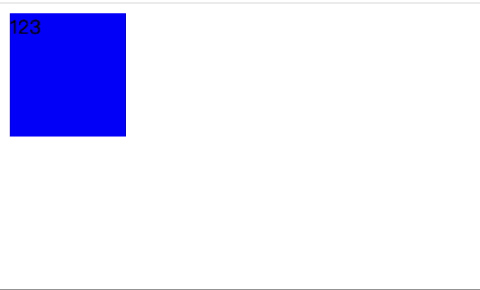

# css

## 1. css 盒子模型

css 盒子模型是 css 布局的基础。每个盒子由四个部分组成：内容（content）、内边距（padding）、边框（border）、外边距（margin）。

css 盒子模型分为两种：

- 标准盒子模型：在标准盒子模型当中，盒子的宽度和高度是指内容 content 的宽高，不包括内边距、边框。因此设置内边距和边框，会把盒子撑大。

- 怪异盒子模型（IE 盒子模型）：在怪异盒子模型当中，盒子的宽高包括了内边距和边框。因此设置内边距和边框，不会把盒子撑大。

可以通过设置 `box-sizing` 属性来改变盒子模型。

- `content-box`：标准盒子模型，默认值。

- `border-box`：怪异盒子模型。

## 2. css 百分比

css 不同属性的百分比值，参照的基准不一样。

1. 参照**父元素宽度**：padding、margin、width、text-indent。

2. 参照**父元素高度**：height。

3. 参照**父元素相同属性**：font-size、line-height。

4. 相对定位的元素，top、bottom 参照的是父元素 **内容（content）** 的高度，left、right 参照的是父元素内容的宽度。

5. 绝对定位的元素，参照的分别是**最近的定位元素包含 padding 的高度和宽度**。绝对定位的元素以最近的设置了定位的元素为参照元素，只要 position 不是 static 就算是设置了定位，因为 static 是默认值。

## 3. css 定位

### 静态定位 static

默认定位，相当于没有定位。

### 相对定位 relative

- 相对于元素原本的位置进行偏移
- 元素会浮起来，脱离标准流，但仍然占据原本的位置

### 绝对定位 absolute

- 相对于最近的具有定位属性的父元素进行偏移，若没有，则相对于 `body` 进行偏移
- 元素脱离标准流，且不占据原本的位置
- 通常是“子绝父相”

### 固定定位 fixed

- 相对于浏览器窗口进行偏移
- 不会随着浏览器窗口的滚动而滚动
- 可用于创建固定头部、底部

```css
// 创建全屏遮罩
.mask {
  position: fixed;
  top: 0;
  left: 0;
  right: 0;
  bottom: 0;
  background: rgba(0, 0, 0, 0.25);
}
```

#### 相关链接

[CSS 的几种定位详解](https://blog.csdn.net/weixin_38055381/article/details/81558288)

## 4. transform

### 平移(translate)

- translate 的平移不会影响其他元素的位置，有点类似 relative 定位。

- 百分比是相对于元素自身的**包含 padding 的宽高**。

- translate 对行内标签没有效果。

| 选项               | 说明                        |
| ------------------ | --------------------------- |
| translate(x,y)     | 同时向 x 轴和 y 轴平移      |
| translateX(x)      | 向 x 轴平移                 |
| translateY(y)      | 向 y 轴平移                 |
| translateZ(z)      | 向 z 轴平移                 |
| translate3d(x,y,z) | 同时向 x 轴、y 轴、z 轴平移 |

一种实现水平垂直居中的方法：定位+平移。

```css
.father {
  position: relative;
  width: 100px;
  height: 100px;
  background: red;
}

.son {
  position: absolute;
  top: 50%; /* 相对于父元素 */
  left: 50%; /* 相对于父元素 */
  transform: translate(-50%, -50%); /* 相对于自身宽高 */
  width: 50px;
  height: 50px;
  background: blue;
}
```

### 旋转(rotate)

- 度数单位是 deg，旋转非零的角度都需要加上单位。

- 正数-顺时针，负数-逆时针。

- 默认旋转中心是元素的中心点。

- `transform-origin` 设置旋转的中心点。默认中心点是 `50% 50%`。可以设置像素 px 或方位名词 top、bottom、left、right、center。

- `transform-origin` 以元素自身为基准，起点是元素的左上角。

- 如果是 3D 还有个 z 轴，`transform-origin: 50% 50% 0`。

| 选项                | 说明                         |
| ------------------- | ---------------------------- |
| rotate(deg)         | 旋转 deg 度                  |
| rotateX(deg)        | 绕 x 轴旋转 deg 度           |
| rotateY(deg)        | 绕 y 轴旋转 deg 度           |
| rotateZ(deg)        | 绕 z 轴旋转 deg 度           |
| rotate3d(x,y,z,deg) | 绕 x、y、z 轴同时旋转 deg 度 |

```css
transform: rotate(45deg);

/* 假设元素宽高都是20px，下面三个写法的旋转中心点相同 */
transform-origin: 50% 50%;
transform-origin: 10px 10px;
transform-origin: center center;
```

### 缩放(scale)

可以设置不同的中心点(`transform-origin`)进行缩放，默认元素中心点进行缩放，不影响其它盒子。

| 选项                | 说明                         |
| ------------------- | ---------------------------- |
| scale(x,y) | 2D 缩放                 |
| scale3d(x,y,z) | 3D 缩放           |
| scaleX(x) | x 轴缩放           |
| scaleY(y) | y 轴缩放          |
| scaleZ(z) | z 轴缩放 |

### 倾斜(skew)

2D 倾斜，在 2D 里做 3D 透视图。

|选项|说明|
|--|--|
|skew(x,y)|x 轴倾斜 x 度，y 轴倾斜 y 度|
|skewX(x)|x 轴倾斜 x 度|
|skewY(y)|y 轴倾斜 y 度|

### 综合写法

- 顺序会影响转换的效果，比如旋转会改变坐标轴的方向。

- 一般把平移放在最前面。

```css
.son {
  transform: translate(100px, 100px) rotate(45deg) scale(2, 2);
}
```

### matrix

css 矩阵，涵盖了上述所有属性。

`transform: matrix(scaleX, skewY, skewX, scaleY, translateX, translateY)`：matrix 的六个值分别代表缩放 x 轴、倾斜 y 轴、倾斜 x 轴、缩放 y 轴、平移 x 轴、平移 y 轴。

```css
.son {
  transform: matrix(1, 0, 0, 1, 0, 0);
}
```

## 5. transition

### 简介

transition 翻译过来就是「过渡」，是指元素的某个属性（如 background-color）从某个值（如 red）变到另一个值（如 green）的过程，这是一个状态的改变。

这个状态的改变需要有某一个条件来触发，比如常见的 `:hover`、`:focus` 等。

### 例子

```html
<!DOCTYPE html>
<html lang="en">
<head>
  <meta charset="UTF-8">
  <meta name="viewport" content="width=device-width, initial-scale=1.0">
  <title>Document</title>
  <style>
    .father {
      width: 100px;
      height: 100px;
      background-color: red;
      /* transition 可以设置多个属性的过渡 */
      transition: transform ease-in 1s, background-color ease-in 1s;
    }
    .father:hover {
      transform: translate(100px, 100px) rotate(180deg) scale(2);
      background-color: green;
    }
  </style>
</head>
<body>
  <div class="father">123</div>
</body>
</html>
```


当鼠标移入元素时，元素的 transform 和 background-color 属性发生变化，此时就会触发 transition，产生动画。鼠标移出时，属性也发生变化，也会触发 transition 产生动画。

因此 transition 产生动画的条件是其设置的 css 属性发生变化，而这种变化需要事件触发。

### 用法

复合语法：`transition: property duration timing-function delay;`

|属性|说明|
|--|--|
|transition-property|过渡的属性|
|transition-duration|过渡的持续时间|
|transition-timing-function|过渡的动画函数|
|transition-delay|过渡的延迟时间，比如延迟 1s 才开始过渡|

`transition-timing-function` 的值包括以下几种：

- ease：默认值，动画效果由慢到快到慢。

- linear：匀速变化。

- ease-in：慢速开始，逐渐变快。

- ease-out：快速开始，逐渐变慢。

- ease-in-out：慢速开始和结束，中间部分加速。结合了 ease-in 和 ease-out 特点。

### 不足

- 需要事件触发，无法在网页加载时自动发生。

- 一次性的，不能重复发生，除非重复触发事件。

- 只能定义开始和结束状态，不能定义中间的状态。

## 6. animation 动画

animation 可以看作是 transition 的增强版，它可以定义更加丰富的动画效果，可操作性更强。

### 使用

```html
<!DOCTYPE html>
<html lang="en">
<head>
  <meta charset="UTF-8">
  <meta name="viewport" content="width=device-width, initial-scale=1.0">
  <title>Document</title>
  <style>
    .father {
      width: 100px;
      height: 100px;
      background-color: red;
      animation: myanimation 2s linear 0.5s infinite alternate running forwards;
    }

    .father:hover {
      animation-play-state: paused;
    }

    @keyframes myanimation {
      0% {
        background-color: blue;
      }
      25% {
        width: 80px;
      }
      50% {
        border: 10px solid pink;
      }
      100% {
        width: 160px;
        height: 160px;
      }
    }
  </style>
</head>
<body>
  <div class="father">123</div>
</body>
</html>
```

可以用 from、to 关键词设置开始和结束状态，相当于 0% 和 100%。

```css
@keyframes myanimation {
  from {
    background-color: blue;
  }
  to {
    width: 160px;
    height: 160px;
  }
}
```



### 属性

|属性|说明|
|--|--|
|@keyframes|定义动画|
|animation|复合属性，可以同时设置多个属性|
|animation-name|定义动画的名称|
|animation-duration|定义动画的持续时间|
|animation-timing-function|定义动画的速度曲线，默认为 ease|
|animation-delay|定义动画的延迟时间，默认为 0|
|animation-iteration-count|定义动画的播放次数，默认为 1 次，infinite 设置无数次|
|animation-direction|定义动画是否反向播放，默认值 normal，alternate 设置反向播放|
|animation-fill-mode|定义动画结束后的状态，forwards 停在结束位置，backwards 返回开始位置|
|animation-play-state|定义动画是否正在运行，默认为running，paused 暂停，经常和鼠标经过配合使用|

复合写法：`animation: name duration timing-function delay iteration-count direction fill-mode play-state`。

顺序其实可以打乱，但是持续时间 duration 和延迟时间 delay 必需按顺序，因为无法区分，其它属性关键字不同，可以通过设置的值区分是哪个属性。

各个属性详细讲解见：

[CSS3-animation动画详解](https://juejin.cn/post/6970883520168198158){link=static}

### animation和transition的区别

1. 触发条件不同。transition 通常和 hover 等事件配合使用，由事件触发。animation 则可以立即播放。

2. 循环。animation 可以设定循环次数，transition 只能播放一次，除非反复触发事件。

3. 精确性。animation 可以设定每一帧的样式和时间。transition 只能设定开始和结束样式。

4. 与 JavaScript 的交互。animation 和 js 的交互不是很紧密，因为它可以独立完成所有事情。transition 和 js 结合后更强大，js 设置要变化的样式，transition 负责动画效果。

[CSS动画：animation、transition、transform、translate傻傻分不清](https://juejin.cn/post/6844903615920898056){link=static}

## 7. css 动画和 js 动画

### css 动画

css 动画借助浏览器内部的**插值机制**来生成渲染画面，简洁高效。

transition 需要提供起始和结束两个关键帧，首屏渲染的结果可以当作是起始关键帧，结束关键帧可以搭配 js 脚本或者 css 伪类选择器来创建。如果只有起始关键帧，transition 属性不生效。

animation 至少会包含两个关键帧，因此即使没有 css 伪类或 js 脚本的帮助，也可以独立实现动画。

### js 动画

js 动画，既包括在脚本钟修改元素类名或动画样式的方式，也包括区别于【关键帧动画】的另一种形式，即【逐帧动画】。

逐帧动画不再借助浏览器内部的插值机制来生成渲染画面，而是将对应的逻辑在 JavaScript 中实现。

每一帧的状态都由 js 来计算生成，然后借助 requestAnimationFrame 来将动画中的每一帧传递到渲染管线中。我们可以使用任何自定义的时间函数来执行动画，也可以同时方便地管理多个对象的多个不同动画。

js 动画在细节控制能力、过程管理能力以及多对象管理能力上都要比纯 css 动画更强大。但是 js 代码运行在主线程中，主线程的实时工况会对动画的流畅度造成极大影响。

js 动画可以借助 velocity.js 来实现。velocity.js 是一个非常易用的轻量级动画库，它包含了 jQuery 中 $.animate()方法的全部功能，但比 jQuery 更流畅。

[Web高性能动画及渲染原理（1）CSS动画和JS动画](https://www.cnblogs.com/dashnowords/p/11680067.html){link=static}

### 两者对比

1. 性能

- js 动画：js 动画可以在更复杂的动画场景下提供更多的控制和灵活性，但它的性能取决于代码的质量。不合理的 js 动画可能导致性能问题，因为它们通常需要大量的计算。

- css 动画：css 动画通常更具有性能优势，因为浏览器可以使用硬件加速来处理它们，而不需要 JavaScript 的运行时计算。css 动画通常更加流畅和高效，特别是在简单的过渡效果中。

2. 适用场景

- js 动画：适用于需要更多控制和互动性的场景，例如游戏、用户交互和需要基于条件的动画。js 动画可以响应用户的输入，并在运行时根据条件调整动画。

- css 动画：适用于简单的过渡效果、页面加载动画、滑动效果、渐变等。css 动画是为了更好的性能和可维护性而设计的，适合许多常见的动画需求。

3. 可维护性

- js 动画：js 动画可能需要更多的代码和维护工作，特别是对于复杂的动画效果，它们通常需要手动处理动画的每一帧。

- css 动画：css 动画通常更容易维护，因为它们将动画效果与样式分开，可以在样式表中轻松修改动画的属性和参数。
