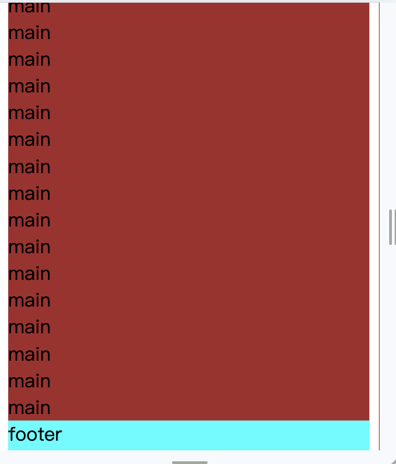

# css

## 1. css 盒子模型

css 盒子模型是 css 布局的基础。每个盒子由四个部分组成：内容（content）、内边距（padding）、边框（border）、外边距（margin）。

css 盒子模型分为两种：

- 标准盒子模型：在标准盒子模型当中，盒子的宽度和高度是指内容 content 的宽高，不包括内边距、边框。因此设置内边距和边框，会把盒子撑大。

- 怪异盒子模型（IE 盒子模型）：在怪异盒子模型当中，盒子的宽高包括了内边距和边框。因此设置内边距和边框，不会把盒子撑大。

可以通过设置 `box-sizing` 属性来改变盒子模型。

- `content-box`：标准盒子模型，默认值。

- `border-box`：怪异盒子模型。

## 2. css 百分比

css 不同属性的百分比值，参照的基准不一样。

1. 参照**父元素内容的宽度**：padding、margin、width、text-indent。

```html
<!DOCTYPE html>
<html lang="en">
<head>
  <style>
    .father {
      width: 400px;
      background-color: blue;
      box-sizing: border-box;
      padding: 50px;
    }
    .son {
      width: 50%;
      background-color: aqua;
    }
  </style>
</head>
<body>
  <div class="father">
    父元素
    <div class="son">
      子元素
    </div>
  </div>
</body>
</html>
```

上述代码中，son 的宽度是 150px。

由于 father 设置了怪异盒子模型，因此它的 width = 内容宽度 + padding + border。现在左右 padding 总共 100px，因此内容宽度为 300px。

son 的 50% 宽度是参照父元素内容的宽度，所以 son 的宽度是 150px。

2. 参照**父元素内容的高度**：height。

3. 参照**父元素相同属性**：font-size、line-height。

4. 相对定位的元素，top、bottom 参照的是父元素 **内容（content）** 的高度，left、right 参照的是父元素内容的宽度。

5. 绝对定位的元素，参照的分别是**最近的定位元素包含 padding 的高度和宽度**。绝对定位的元素以最近的设置了定位的元素为参照元素，只要 position 不是 static 就算是设置了定位，因为 static 是默认值。

## 3. css 定位

### 静态定位 static

默认定位，相当于没有定位。

### 相对定位 relative

- 相对于元素原本的位置进行偏移
- 元素会浮起来，脱离标准流，但仍然占据原本的位置

### 绝对定位 absolute

- 相对于最近的具有定位属性的父元素进行偏移，若没有，则相对于 `body` 进行偏移
- 元素脱离标准流，且不占据原本的位置
- 通常是“子绝父相”

### 固定定位 fixed

- 相对于浏览器窗口进行偏移
- 不会随着浏览器窗口的滚动而滚动
- 可用于创建固定头部、底部

```css
// 创建全屏遮罩
.mask {
  position: fixed;
  top: 0;
  left: 0;
  right: 0;
  bottom: 0;
  background: rgba(0, 0, 0, 0.25);
}
```

#### 相关链接

[CSS 的几种定位详解](https://blog.csdn.net/weixin_38055381/article/details/81558288)

## 4. transform

### 平移(translate)

- translate 的平移不会影响其他元素的位置，有点类似 relative 定位。

- 百分比是相对于元素自身的**包含 padding 的宽高**。

- translate 对行内标签没有效果。

| 选项               | 说明                        |
| ------------------ | --------------------------- |
| translate(x,y)     | 同时向 x 轴和 y 轴平移      |
| translateX(x)      | 向 x 轴平移                 |
| translateY(y)      | 向 y 轴平移                 |
| translateZ(z)      | 向 z 轴平移                 |
| translate3d(x,y,z) | 同时向 x 轴、y 轴、z 轴平移 |

一种实现水平垂直居中的方法：定位+平移。

```css
.father {
  position: relative;
  width: 100px;
  height: 100px;
  background: red;
}

.son {
  position: absolute;
  top: 50%; /* 相对于父元素 */
  left: 50%; /* 相对于父元素 */
  transform: translate(-50%, -50%); /* 相对于自身宽高 */
  width: 50px;
  height: 50px;
  background: blue;
}
```

### 旋转(rotate)

- 度数单位是 deg，旋转非零的角度都需要加上单位。

- 正数-顺时针，负数-逆时针。

- 默认旋转中心是元素的中心点。

- `transform-origin` 设置旋转的中心点。默认中心点是 `50% 50%`。可以设置像素 px 或方位名词 top、bottom、left、right、center。

- `transform-origin` 以元素自身为基准，起点是元素的左上角。

- 如果是 3D 还有个 z 轴，`transform-origin: 50% 50% 0`。

| 选项                | 说明                         |
| ------------------- | ---------------------------- |
| rotate(deg)         | 旋转 deg 度                  |
| rotateX(deg)        | 绕 x 轴旋转 deg 度           |
| rotateY(deg)        | 绕 y 轴旋转 deg 度           |
| rotateZ(deg)        | 绕 z 轴旋转 deg 度           |
| rotate3d(x,y,z,deg) | 绕 x、y、z 轴同时旋转 deg 度 |

```css
transform: rotate(45deg);

/* 假设元素宽高都是20px，下面三个写法的旋转中心点相同 */
transform-origin: 50% 50%;
transform-origin: 10px 10px;
transform-origin: center center;
```

### 缩放(scale)

可以设置不同的中心点(`transform-origin`)进行缩放，默认元素中心点进行缩放，不影响其它盒子。

| 选项                | 说明                         |
| ------------------- | ---------------------------- |
| scale(x,y) | 2D 缩放                 |
| scale3d(x,y,z) | 3D 缩放           |
| scaleX(x) | x 轴缩放           |
| scaleY(y) | y 轴缩放          |
| scaleZ(z) | z 轴缩放 |

### 倾斜(skew)

2D 倾斜，在 2D 里做 3D 透视图。

|选项|说明|
|--|--|
|skew(x,y)|x 轴倾斜 x 度，y 轴倾斜 y 度|
|skewX(x)|x 轴倾斜 x 度|
|skewY(y)|y 轴倾斜 y 度|

### 综合写法

- 顺序会影响转换的效果，比如旋转会改变坐标轴的方向。

- 一般把平移放在最前面。

```css
.son {
  transform: translate(100px, 100px) rotate(45deg) scale(2, 2);
}
```

### matrix

css 矩阵，涵盖了上述所有属性。

`transform: matrix(scaleX, skewY, skewX, scaleY, translateX, translateY)`：matrix 的六个值分别代表缩放 x 轴、倾斜 y 轴、倾斜 x 轴、缩放 y 轴、平移 x 轴、平移 y 轴。

```css
.son {
  transform: matrix(1, 0, 0, 1, 0, 0);
}
```

## 5. transition

### 简介

transition 翻译过来就是「过渡」，是指元素的某个属性（如 background-color）从某个值（如 red）变到另一个值（如 green）的过程，这是一个状态的改变。

这个状态的改变需要有某一个条件来触发，比如常见的 `:hover`、`:focus` 等。

### 例子

```html
<!DOCTYPE html>
<html lang="en">
<head>
  <meta charset="UTF-8">
  <meta name="viewport" content="width=device-width, initial-scale=1.0">
  <title>Document</title>
  <style>
    .father {
      width: 100px;
      height: 100px;
      background-color: red;
      /* transition 可以设置多个属性的过渡 */
      transition: transform ease-in 1s, background-color ease-in 1s;
    }
    .father:hover {
      transform: translate(100px, 100px) rotate(180deg) scale(2);
      background-color: green;
    }
  </style>
</head>
<body>
  <div class="father">123</div>
</body>
</html>
```


当鼠标移入元素时，元素的 transform 和 background-color 属性发生变化，此时就会触发 transition，产生动画。鼠标移出时，属性也发生变化，也会触发 transition 产生动画。

因此 transition 产生动画的条件是其设置的 css 属性发生变化，而这种变化需要事件触发。

### 用法

复合语法：`transition: property duration timing-function delay;`

|属性|说明|
|--|--|
|transition-property|过渡的属性|
|transition-duration|过渡的持续时间|
|transition-timing-function|过渡的动画函数|
|transition-delay|过渡的延迟时间，比如延迟 1s 才开始过渡|

`transition-timing-function` 的值包括以下几种：

- ease：默认值，动画效果由慢到快到慢。

- linear：匀速变化。

- ease-in：慢速开始，逐渐变快。

- ease-out：快速开始，逐渐变慢。

- ease-in-out：慢速开始和结束，中间部分加速。结合了 ease-in 和 ease-out 特点。

### 不足

- 需要事件触发，无法在网页加载时自动发生。

- 一次性的，不能重复发生，除非重复触发事件。

- 只能定义开始和结束状态，不能定义中间的状态。

## 6. animation 动画

animation 可以看作是 transition 的增强版，它可以定义更加丰富的动画效果，可操作性更强。

### 使用

```html
<!DOCTYPE html>
<html lang="en">
<head>
  <meta charset="UTF-8">
  <meta name="viewport" content="width=device-width, initial-scale=1.0">
  <title>Document</title>
  <style>
    .father {
      width: 100px;
      height: 100px;
      background-color: red;
      animation: myanimation 2s linear 0.5s infinite alternate running forwards;
    }

    .father:hover {
      animation-play-state: paused;
    }

    @keyframes myanimation {
      0% {
        background-color: blue;
      }
      25% {
        width: 80px;
      }
      50% {
        border: 10px solid pink;
      }
      100% {
        width: 160px;
        height: 160px;
      }
    }
  </style>
</head>
<body>
  <div class="father">123</div>
</body>
</html>
```

可以用 from、to 关键词设置开始和结束状态，相当于 0% 和 100%。

```css
@keyframes myanimation {
  from {
    background-color: blue;
  }
  to {
    width: 160px;
    height: 160px;
  }
}
```


### 属性

|属性|说明|
|--|--|
|@keyframes|定义动画|
|animation|复合属性，可以同时设置多个属性|
|animation-name|定义动画的名称|
|animation-duration|定义动画的持续时间|
|animation-timing-function|定义动画的速度曲线，默认为 ease|
|animation-delay|定义动画的延迟时间，默认为 0|
|animation-iteration-count|定义动画的播放次数，默认为 1 次，infinite 设置无数次|
|animation-direction|定义动画是否反向播放，默认值 normal，alternate 设置反向播放|
|animation-fill-mode|定义动画结束后的状态，forwards 停在结束位置，backwards 返回开始位置|
|animation-play-state|定义动画是否正在运行，默认为running，paused 暂停，经常和鼠标经过配合使用|

复合写法：`animation: name duration timing-function delay iteration-count direction fill-mode play-state`。

顺序其实可以打乱，但是持续时间 duration 和延迟时间 delay 必需按顺序，因为无法区分，其它属性关键字不同，可以通过设置的值区分是哪个属性。

各个属性详细讲解见：

[CSS3-animation动画详解](https://juejin.cn/post/6970883520168198158){link=static}

### animation和transition的区别

1. 触发条件不同。transition 通常和 hover 等事件配合使用，由事件触发。animation 则可以立即播放。

2. 循环。animation 可以设定循环次数，transition 只能播放一次，除非反复触发事件。

3. 精确性。animation 可以设定每一帧的样式和时间。transition 只能设定开始和结束样式。

4. 与 JavaScript 的交互。animation 和 js 的交互不是很紧密，因为它可以独立完成所有事情。transition 和 js 结合后更强大，js 设置要变化的样式，transition 负责动画效果。

[CSS动画：animation、transition、transform、translate傻傻分不清](https://juejin.cn/post/6844903615920898056){link=static}

## 7. css 动画和 js 动画

### css 动画

css 动画借助浏览器内部的**插值机制**来生成渲染画面，简洁高效。

transition 需要提供起始和结束两个关键帧，首屏渲染的结果可以当作是起始关键帧，结束关键帧可以搭配 js 脚本或者 css 伪类选择器来创建。如果只有起始关键帧，transition 属性不生效。

animation 至少会包含两个关键帧，因此即使没有 css 伪类或 js 脚本的帮助，也可以独立实现动画。

### js 动画

js 动画，既包括在脚本钟修改元素类名或动画样式的方式，也包括区别于【关键帧动画】的另一种形式，即【逐帧动画】。

逐帧动画不再借助浏览器内部的插值机制来生成渲染画面，而是将对应的逻辑在 JavaScript 中实现。

每一帧的状态都由 js 来计算生成，然后借助 requestAnimationFrame 来将动画中的每一帧传递到渲染管线中。我们可以使用任何自定义的时间函数来执行动画，也可以同时方便地管理多个对象的多个不同动画。

js 动画在细节控制能力、过程管理能力以及多对象管理能力上都要比纯 css 动画更强大。但是 js 代码运行在主线程中，主线程的实时工况会对动画的流畅度造成极大影响。

js 动画可以借助 velocity.js 来实现。velocity.js 是一个非常易用的轻量级动画库，它包含了 jQuery 中 $.animate()方法的全部功能，但比 jQuery 更流畅。

[Web高性能动画及渲染原理（1）CSS动画和JS动画](https://www.cnblogs.com/dashnowords/p/11680067.html){link=static}

### 两者对比

1. 性能

- js 动画：js 动画可以在更复杂的动画场景下提供更多的控制和灵活性，但它的性能取决于代码的质量。不合理的 js 动画可能导致性能问题，因为它们通常需要大量的计算。

- css 动画：css 动画通常更具有性能优势，因为浏览器可以使用硬件加速来处理它们，而不需要 JavaScript 的运行时计算。css 动画通常更加流畅和高效，特别是在简单的过渡效果中。

2. 适用场景

- js 动画：适用于需要更多控制和互动性的场景，例如游戏、用户交互和需要基于条件的动画。js 动画可以响应用户的输入，并在运行时根据条件调整动画。

- css 动画：适用于简单的过渡效果、页面加载动画、滑动效果、渐变等。css 动画是为了更好的性能和可维护性而设计的，适合许多常见的动画需求。

3. 可维护性

- js 动画：js 动画可能需要更多的代码和维护工作，特别是对于复杂的动画效果，它们通常需要手动处理动画的每一帧。

- css 动画：css 动画通常更容易维护，因为它们将动画效果与样式分开，可以在样式表中轻松修改动画的属性和参数。

## 8、三列布局

[【CSS】圣杯布局和双飞翼布局（包括完整代码）](https://blog.csdn.net/weixin_42678675/article/details/118542011){link=static}

### 圣杯布局

主要思路：浮动 + margin-left + 相对定位。

1. 写一个大容器 container，里面包含 middle、left、right 三个 div。middle 放在前面。

2. container 下面的三个容器浮动，且写上高度 200px。left、right 设置宽度 200px。给 container 设置 `padding: 0 200px`，给 left 和 right 留下空间。

3. 给 middle 宽度写上 100%，此时 left 和 right 被挤到第二行。

4. 给 left 的 **margin-left 设置为 -100%**，此时 left 回到第一行左边，即 left 的左边框和 middle 的左边框重叠。

5. 此时 left 会覆盖 middle。**给 left 设置 `position: relative`，再设置 `right: 200px`**，使其向左移动自身宽度，露出被覆盖的 middle。

6. 给 right 的 **margin-right 设置 -200px**，此时 right 回到第一行右边。

（这里的 margin-right设置为负值还是不太明白，如果是margin-left为-200px，效果是right的右边和middle的右边重叠，会覆盖住middle，不符合要求）

> margin-right 能让 right 元素被其自身右方的空白元素覆盖上去，相当于自身宽度被消除，从而能浮动到 middle 上去

7. 此时 container 因为子元素浮动，高度会为 0，为它增加 `overflow: hidden`，使其变为 BFC，显示正常高度。

8. 此时如果页面缩的很小会出现显示混乱的问题，可以给 container 加上 min-width 属性，或者使用双飞燕布局来解决。

:::tip 为什么在 container 加 padding，而不是在 middle 加？
因为 middle 的宽度设置为 100%，设置了 padding 也是占满全屏宽度，给大容器设置，才能够给 left 和 right 留下位置。
:::

```html
<!DOCTYPE html>
<html lang="en">
<head>
  <meta charset="UTF-8">
  <meta name="viewport" content="width=device-width, initial-scale=1.0">
  <title>Document</title>
  <style>
    .container {
      padding: 0 200px;
      overflow: hidden;
      min-width: 400px;
    }
    .left {
      background-color: red;
      width: 200px;
      height: 200px;
      float: left;
      margin-left: -100%;
      position: relative;
      right: 200px;
    }
    .middle {
      background-color: blue;
      float: left;
      height: 200px;
      width: 100%;
    }
    .right {
      background-color: green;
      width: 200px;
      height: 200px;
      float: left;
      margin-right: -200px;
    }
    .header, .footer {
      background-color: purple;
      min-width: 800px;
    }
  </style>
</head>
<body>
  <div class="header">header box</div>
  <div class="container">
    <div class="middle">middle box</div>
    <div class="left">left box</div>
    <div class="right">right box</div>
  </div>
  <div class="footer">footer box</div>
</body>
</html>
```

写法2：也可以实现三列效果，写法更容易懂。

思路：float 浮动 + margin-left/right 移动位置

- 三个盒子就按照从左到右 left、middle、right 的顺序排列。

- 外容器 container 设置 `padding: 0 200px`，用于给 left、right 两个盒子留出空间。

- 三个盒子设置左浮动，设置高度为 200px，middle 设置宽度为 100%，left、right 设置宽度为 200px。此时三个盒子分别在三行，因为 middle 宽度为 100%。

- left 盒子的 margin-left 设置为 -200px，往左边挪动自身宽度。此时 middle 和 left 在同一行，且 left 的右边框和 middle 左边框重合。

- right 盒子的 margin-right 设置为 -200px，往左边挪动位置，使之左边框和 middle 右边贴合，三个盒子在同一行展示。

```html
<!DOCTYPE html>
<html lang="en">
<head>
  <meta charset="UTF-8">
  <meta name="viewport" content="width=device-width, initial-scale=1.0">
  <title>Document</title>
  <style>
    .container {
      overflow: hidden;
      padding: 0 200px;
      min-width: 400px;
    }
    .left {
      background-color: red;
      width: 200px;
      height: 200px;
      float: left;
      margin-left: -200px;
    }
    .middle {
      background-color: blue;
      float: left;
      height: 200px;
      width: 100%;
    }
    .right {
      background-color: green;
      width: 200px;
      height: 200px;
      float: left;
      margin-right: -200px;
    }
    .header, .footer {
      background-color: purple;
      min-width: 800px;
    }
  </style>
</head>
<body>
  <div class="header">header box</div>
  <div class="container">
    <div class="left">left box</div>
    <div class="middle">middle box</div>
    <div class="right">right box</div>
  </div>
  <div class="footer">footer box</div>
</body>
</html>
```

### 双飞燕布局

思路：浮动（不使用相对定位）

1. 设置三个容器，分别是 middle、left、right。middle 模块放在前面，里面嵌套一个 middle_in 模块，用 margin 为 left 和 right 两个盒子预留空间，解决 left 和 right 占住中间元素位置的问题，且不用相对定位。

2. 让三个盒子左浮动，且 left 和 right 宽度设置为 200px，middle 宽度设置为 100%，此时 left 和 right 被撑到第二行。为三个盒子设置高度。

3. 让 middle_in 继承高度 100%，left 模块的 margin-left 设置为 -100%，right 的 margin-left 设置为 -200px，这样 left 和 right 会移动到第一行的左边和右边，并且压住了 middle 模块。

4. 为 middle_in 设置 margin，解决被压住的问题。

5. 为 container 设置 `overflow: hidden`，使其变为 BFC，高度显示正常。

```html
<!DOCTYPE html>
<html lang="en">
<head>
  <meta charset="UTF-8">
  <meta name="viewport" content="width=device-width, initial-scale=1.0">
  <title>Document</title>
  <style>
    .container {
      overflow: hidden;
    }
    .middle {
      width: 100%;
      height: 200px;
      float: left;
    }
    .middle_in {
      background-color: red;
      margin: 0 200px;
      height: 100%;
    }
    .left {
      background-color: green;
      float: left;
      width: 200px;
      height: 200px;
      /* margin 的百分比是以父元素的宽度为基准，因此-100%相当于移动到了第一行最左边 */
      margin-left: -100%;
    }
    .right {
      background-color: blue;
      float: left;
      width: 200px;
      height: 200px;
      margin-left: -200px;
    }
  </style>
</head>
<body>
  <div class="container">
    <div class="middle">
      <div class="middle_in">middle box</div>
    </div>
    <div class="left">left box</div>
    <div class="right">right box</div>
  </div>
</body>
</html>
```

### flex 布局

思路：使用 [flex 布局]()。

1. 设置三个容器，分别是 middle、left、right。middle 模块放在前面，设置高度。

2. 外部容器设置 `display: flex`，开启 flex 布局。

3. middle 模块设置 `flex: 1`，自动占满剩余的空间。

4. left 和 right 模块设置宽度。

5. 三个模块设置 order 排序。如果 middle 模块放中间，就不用额外设置 order 排序。

```html
<!DOCTYPE html>
<html lang="en">
<head>
  <meta charset="UTF-8">
  <meta name="viewport" content="width=device-width, initial-scale=1.0">
  <title>Document</title>
  <style>
    .container {
      display: flex;
    }
    .middle {
      background-color: red;
      flex: 1;
      height: 200px;
      order: 1;
    }
    .left {
      background-color: green;
      width: 200px;
      height: 200px;
      order: 0;
    }
    .right {
      background-color: blue;
      width: 200px;
      height: 200px;
      order: 3;
    }
  </style>
</head>
<body>
  <div class="container">
    <div class="middle">middle box</div>
    <div class="left">left box</div>
    <div class="right">right box</div>
  </div>
</body>
</html>
```

最简洁版本：

```html
<!DOCTYPE html>
<html lang="en">
<head>
  <meta charset="UTF-8">
  <meta name="viewport" content="width=device-width, initial-scale=1.0">
  <title>Document</title>
  <style>
    .container {
      display: flex;
    }
    .middle {
      background-color: red;
      flex: 1;
      height: 200px;
    }
    .left {
      background-color: green;
      width: 200px;
      height: 200px;
    }
    .right {
      background-color: blue;
      width: 200px;
      height: 200px;
    }
  </style>
</head>
<body>
  <div class="container">
    <div class="left">left box</div>
    <div class="middle">middle box</div>
    <div class="right">right box</div>
  </div>
</body>
</html>
```

## 9、margin 为负值会发生什么

1. margin-left 为负值，元素自身向左移动。

2. margin-top 为负值，元素自身向上移动。

3. margin-right 为负值，元素自身不动，其右边的元素向左移动。

4. margin-bottom 为负值，元素自身不动，其下边的元素向上移动。

```html
<style>
  .container {
    display: flex;
  }
  .left {
    background-color: red;
    width: 200px;
    height: 200px;
    margin-right: -100px;
  }
  .right {
    background-color: green;
    width: 200px;
    height: 200px;
  }
</style>

<div class="container">
  <div class="left">left box</div>
  <div class="right">right box</div>
</div>
```


```html
<style>
  .left {
    background-color: red;
    width: 200px;
    height: 200px;
    margin-bottom: -100px;
  }
  .right {
    background-color: green;
    width: 200px;
    height: 200px;
  }
</style>

<div class="container">
  <div class="left">left box</div>
  <div class="right">right box</div>
</div>
```


[【CSS】margin 为负值会发生什么你想不到的事？](https://blog.csdn.net/weixin_42678675/article/details/118514164){link=static}

## 10、粘连布局

粘连布局，sticky layout：

- 当 main 的高度足够长时，紧跟在其后面的元素 footer 会跟在其后面。

- 当 main 元素比较短时（比如小于屏幕高度），footer 则「粘连」在屏幕底部。




### 方法一

布局：wrap 包裹 main 容器，main 容器中包含文字内容。wrap 下面则是 footer。

样式设置：

1. 当内容高度小于屏幕高度时，要保证 wrap 最低高度为屏幕高度，设置 `min-height: 100%`，并且 html、body 也需要设置 `height: 100%`，保证屏幕高度能够被 wrap 继承。

2. 此时 footer 刚好被挤到屏幕底部之外，即上边框和屏幕底部重合，看不到 footer。因此需要给 footer 设置 `margin-top: -30px`，向上移动自身高度。

3. 当内容高度大于屏幕高度时，为了避免 footer 和 main 的内容重叠，需要给 main 设置 `padding-bottom: 30px`，保证 main 底部留出空间，避免和 footer 重叠。

```html
<!DOCTYPE html>
<html lang="en">
<head>
  <meta charset="UTF-8">
  <meta name="viewport" content="width=device-width, initial-scale=1.0">
  <title>Document</title>
  <style>
    * {
      margin: 0;
      padding: 0;
    }
    html, body {
      height: 100%;
    }
    #wrap {
      min-height: 100%;
    }
    /* 内容区需要让出⼀部分区域，防⽌内容被盖住 */
    #main {
      background-color: brown;
      padding-bottom: 30px;
    }
    #footer {
      background-color: aqua;
      height: 30px;
      margin-top: -30px;
    }
  </style>
</head>
<body>
  <div id="wrap">
    <div id="main">
      main<br />
      main<br />
      main<br />
      main<br />
      main<br />
      main<br />
      main<br />
      main<br />
      main<br />
      main<br />
      main<br />
      main<br />
      main<br />
      main<br />
      main<br />
      main<br />
      main<br />
    </div>
  </div>
  <div id="footer">footer</div>
</body>
</html>
```

### 方法二

和方法一类似，唯一不同点就是把 footer 向上挪动的方式不同，通过给 wrap 设置 `margin-bottom: -30px` 来实现。

```html
<!DOCTYPE html>
<html lang="en">
<head>
  <meta charset="UTF-8">
  <meta name="viewport" content="width=device-width, initial-scale=1.0">
  <title>Document</title>
  <style>
    * {
      margin: 0;
      padding: 0;
    }
    html, body {
      height: 100%;
    }
    #wrap {
      min-height: 100%;
      margin-bottom: -30px;
    }
    /* 内容区需要让出⼀部分区域，防⽌内容被盖住 */
    #main {
      background-color: brown;
      padding-bottom: 30px;
    }
    #footer {
      background-color: aqua;
      height: 30px;
    }
  </style>
</head>
<body>
  <div id="wrap">
    <div id="main">
      main<br />
      main<br />
      main<br />
      main<br />
      main<br />
      main<br />
      main<br />
      main<br />
      main<br />
      main<br />
      main<br />
      main<br />
      main<br />
      main<br />
      main<br />
      main<br />
      main<br />
    </div>
  </div>
  <div id="footer">footer</div>
</body>
</html>
```

### 方法三：flex

布局：container 容器包裹 main 和 footer。

样式设置：

1. container 容器设置 `height: 100vh`，保证高度为屏幕高度。

2. container 容器设置 `display: flex`，`flex-direction: column`，`justify-content: space-between`，开启 flex 布局，设置主轴方向从上到下，子元素排列方式为两侧贴边再平分剩余空间。

3. footer 设置高度即可。

```html
<!DOCTYPE html>
<html lang="en">
<head>
  <meta charset="UTF-8">
  <meta name="viewport" content="width=device-width, initial-scale=1.0">
  <title>Document</title>
  <style>
    * {
      margin: 0;
      padding: 0;
    }
    #container {
      height: 100vh;
      display: flex;
      flex-direction: column;
      justify-content: space-between;
    }
    #main {
      background-color: brown;
    }
    #footer {
      background-color: aqua;
      height: 30px;
    }
  </style>
</head>
<body>
  <div id="container">
    <div id="main">
      main<br />
      main<br />
      main<br />
      main<br />
      main<br />
      main<br />
      main<br />
      main<br />
      main<br />
      main<br />
      main<br />
      main<br />
      main<br />
      main<br />
      main<br />
      main<br />
      main<br />
    </div>
    <div id="footer">footer</div>
  </div>
</body>
</html>
```

## 11、两列布局

两列布局：一列有内容撑开，另一列自适应剩余宽度。

### 方法一：float + BFC

1. left 模块设置浮动。此时 right 模块会被覆盖。

2. 给 right 模块设置 `overflow: hidden`，开启 BFC。BFC 不会与浮动元素重叠，解决覆盖问题。

```html
<!DOCTYPE html>
<html lang="en">
<head>
  <meta charset="UTF-8" />
  <meta name="viewport" content="width=device-width, initial-scale=1.0" />
  <title>Document</title>
  <style>
    .left {
      float: left;
      background-color: pink;
    }
    .right {
      overflow: hidden;
      background-color: yellow;
    }
  </style>
</head>
<body>
  <div class="parent">
    <div class="left">
      left column content
    </div>
    <div class="right">
      right column content<br />
      right column content<br />
      right column content<br />
    </div>
  </div>
</body>
</html>
```

### 方法二：flex

flex 实现起来非常简单。

```html
<!DOCTYPE html>
<html lang="en">
<head>
  <meta charset="UTF-8" />
  <meta name="viewport" content="width=device-width, initial-scale=1.0" />
  <title>Document</title>
  <style>
    .parent {
      display: flex;
    }
    .left {
      background-color: pink;
    }
    .right {
      flex: 1;
      background-color: yellow;
    }
  </style>
</head>
<body>
  <div class="parent">
    <div class="left">
      left column content
    </div>
    <div class="right">
      right column content<br />
      right column content<br />
      right column content<br />
    </div>
  </div>
</body>
</html>
```

## 12、z-index

元素的层叠关系，是一门大大的学问。

### 没有z-index的日子

没有使用 z-index 的时候，元素的层叠关系由2个因素决定。

1. 是否设置了 position 属性。position 属性设置为 relative、absolute、fixed、sticky 的元素层级比没有设置 position 属性（即 position 为 static）的元素高。而没有设置 position 的元素中，设置了 float 属性的元素层级比没有设置 float 的元素高。

2. 元素的顺序。同类型的元素遵循「后来居上」的原则。


在上图中，div1、2、3、4 设置了 position 属性，因此它们的层级高于 div 5、6。

按照「后来居上」的原则，div1、2、3、4 的层级顺序是 4、3、2、1。

而对于 div5、6，虽然 6 的出场顺序比 5 要晚，但由于 div5 设置了 `float: right`，因此 div5 的层级比 div6 高。

综上，整体的层级顺序是：4、3、2、1、5、6。

### 层叠上下文

1、层叠上下文理解

层叠上下文，Stacking Context，可以理解为盖楼论。

z-index 存在的背景是 Stacking Context，也就是说，**z-index 只有在层叠上下文中才会生效**。

> 构建层叠上下文仿佛盖楼：
>
> `<html>` 元素是地基，所有楼都从地基开始盖的。
>
> 每产生一个层叠上下文，相当于盖一座楼，z-index 相当于楼的高度。

2、产生层叠上下文的方式

- 元素的 position 设置为 absolute 或 relative，且 z-index 不为 auto（默认值）。

- 元素的 position 设置为 fixed 或 sticky。

- 元素是 flex 容器的**子元素**（元素自己本身设置 flex 是不会产生的），且 z-index 不为 auto。

- 元素是 grid 容器的**子元素**，且 z-index 不为 auto。

- 元素设置了 opacity，且值小于 1。

- 元素有以下任意一项的值，且值不为 none :
  - transform
  - filter
  - perspective
  - clip-path
  - mask / mask-image / mask-border

- 元素有 isolation 值且值为 isolate。

- 元素有 mix-blend-mode 值且值不为 normal。

- 元素有 -webkit-overflow-scrolling 值且值为 touch。

3、层叠上下文嵌套

在嵌套的层叠上下文中，子层叠上下文被限制在父层叠上下文中。**无论子层叠上下文的 z-index 设置得多大，都无法突破父层叠上下文**。

因此，要比较两个元素的层级，首先要看它们的父层叠上下文是否相等。

父元素平等，子元素才有比较的意义。也是个拼爹的属性。

4、Antd 的 Modal 组件

Ant Design 的 Modal 组件，就是使用 position: fixed 的方式产生层叠上下文，并且 z-index 设置为 1000。


[为什么你的 z-index 又不管用了——最通俗易懂的 z-index 的使用讲解](https://zhuanlan.zhihu.com/p/340371083){link=static}

## 13、CSS 单位

CSS 单位包括绝对单位和相对单位。

### 绝对单位

#### `px`

在 CSS 中，1 像素被定义为 1/96 英寸。但具体效果取决于设备的情况。

#### `cm`

在 CSS 中，1 cm 大约是 37.8 pixels。

#### `mm`

在 CSS 中，1 mm 大约是 3.78 pixels。

#### `in`

在 CSS 中，1 in 大约是 96 pixels。

#### `pt`

在 CSS 中，1 pt 大约是 1/72 英寸，即 1.333 像素。

#### `pc`

在 CSS 中，1 pc 大约是 16 pixels。

### 相对单位

#### `em`

当 `em` 和 `font-size` 属性一起使用时，`em` 是相对于父元素的字体大小而言的。

```css
.father {
  font-size: 16px;
}
.son {
  /* son 的字体大小是 24px */
  font-size: 1.5em; 
}
.grandson {
  /* grandson 的字体大小是 32px */
  font-size: 2em;
}
```

当 `em` 和 `width` 这类属性一起使用时，`em` 是相对于元素自身字体大小而言的。

```css
.father {
  font-size: 16px;
  /* father 的宽度是 32px */
  width: 2em;
  background-color: aqua;
}
```

#### `rem`

`rem` 是相对于根元素（即 `<html>` 元素）的字体大小而言的。

在大多数浏览器中，默认字体大小是 16px，因此 html 元素的字体大小是 16px。

如果用户改变了 html 元素的字体大小，那么 `rem` 的值也会改变。

#### `%`

百分比。详见[CSS百分比](#_2-css-百分比)

#### `vw`

视口宽度，1vw 为视口宽度的 1%，100vw 就是视口宽度。

#### `vh`

视口高度，1vh 为视口高度的 1%，100vh 就是视口高度。

常用来设置元素高度铺满整个屏幕。

#### `vmin` 和 `vmax`

vmin 是指视口宽度和高度的较小者，vmax 是较大的那个。

例如，一个视口的宽度是 1000px，高度是 600px，那么 100vmin 等于 600px，100vmax 等于 1000px。

即 1vmin 为 6px，1vmax 为 10px。

#### `ex`

在 CSS 中，1ex 是字体 x 的高度。

但是，由于小写字母 x 大小会随字体的不同有很大变化，因此 ex 单位很少被使用。

#### `ch`

在 CSS 中，1ch 是字体 0 字符的宽度。

和 ex 类似，由于 0 的宽度会随字体的不同有较大差异，因此 ch 单位也用的不多。

[CSS 单位指南](https://www.freecodecamp.org/chinese/news/css-unit-guide/){link=static}

## 14、CSS 常见布局

1. 静态布局：在 PC 端布局，在移动设备单独设计布局，两套布局使用不同的域名进行区分。

2. 流式布局：页面元素的宽度按屏幕分辨率进行调整，用百分比定义宽度，用 px 设置固定高度。这个中布局的缺点是，在过大或者过小的屏幕会显示异常，例如屏幕很宽的时候，由于高度是固定的，元素就会被拉的很扁。使用 vh、vw 可以更好的实现流式布局。

3. 自适应布局：分别为不同分辨率的屏幕定义不同的静态布局，使用媒体查询切换不同尺寸的样式。

4. 响应式布局：结合了流式布局和自适应布局。搭配媒体查询技术，分别为不同分辨率的屏幕定义不同的布局，同时在每个布局中，应用流式布局的理念，即页面元素宽度随着窗口调整而自动适配。

5. rem 弹性布局：改变浏览器宽度（搭配媒体查询或 JS，根据屏幕的大小来动态控制 html 元素的 font-size），页面所有元素的宽高都等比例缩放，也就是大屏幕下导航是横的，小屏幕下还是横的，只不过变小了。

6. 单列布局、两列自适应布局、三列自适应布局。

7. 对于移动端而言，rem + @media 是不错的方案。

[静态布局、自适应布局、流式布局、响应式布局、弹性布局等的概念和区别](https://www.cnblogs.com/yanayana/p/7066948.html#!comments){link=static}

[响应式布局和自适应布局详解](http://caibaojian.com/356.html){link=static}

## 16、rem 和 em 的区别

1. 相对基准

rem 是相对于根元素的字体大小，而 em 是相对于父元素的字体大小。

因此，如果改变了根元素的字体大小，所有使用 rem 单位的元素都会相应地调整大小。

而对于使用 em 单位的元素，只有当其父元素的字体大小改变时，它们的大小才会改变。

2. 计算方式

使用 rem 单位进行单位换算时，只需要知道根元素的字体大小即可。

而使用 em 单位时，需要逐级计算每个父元素的字体大小。

3. 简洁性和可维护性

使用 rem 单位可以简化样式表的编写，因为只需要设置根元素的字体大小，其它元素的大小都可以使用 rem 单位进行计算，这是得页面的维护更加方便。

而使用 em 单位时，需要逐级设置每个父元素的字体大小，会增加维护的复杂性。

4. 响应式设计

由于 rem 单位的相对基准是固定的，因此在实现响应式设计方面，rem 单位具有更大的优势。只需要在根元素上设置字体大小，就可以影响整个页面的尺寸。

而 em 单位则需要考虑父元素的字体大小，这在实现响应式设计中可能会更加复杂。

5. 兼容性

rem 单位在一些旧版本的浏览器中不被支持，而 em 单位在所有浏览器都被支持。

因此，在使用 rem 单位时，需要考虑浏览器的兼容性问题。

## 17、根据设计稿确定网页rem大小

根据设计稿尺寸，以及屏幕宽度，怎么计算确定网页 1rem 的大小，即 html 元素的字体大小。

计算公式：`1rem = (屏幕实际宽度 / 设计稿宽度) * 事先确定好的比例`。

这个比例是指 rem 和 px 之间的比例关系，比如 1rem = 100px，这是我们自己确定的比例。

举个例子：

现在设计稿宽度是 800px，屏幕的宽度是 1920px，比例关系是 1rem = 1px。

那么网页上 `1rem = (1920 / 800) * 1 = 2.4px`。

可以这么理解，`(屏幕实际宽度 / 设计稿宽度)` 就是网页的 px 与 设计稿的 px 的缩放比例，然后再乘以 rem 和 px 的比例，就得到网页的 1rem 对应多少 px。

```js
// multiple是倍数，默认是1，也可以自定义
const computedFontStyle = (clientWidth, designWidth, multiple = 1) => {
  return (clientWidth / designWidth) * multiple;
};

// 每次屏幕宽度改变时，改变html标签的font-size
window.onresize = () => {
  // 获取html对象
  const docEl = document.documentElement;
  // 获取网页宽度
  const clientWidth = docEl.clientWidth;
  // 计算html的font-size
  const rootFontStyle = computedFontStyle(clientWidth, 800);
  docEl.setAttribute("style", `font-size: ${rootFontStyle}px`);
};
```

[根据设计稿，计算出网页REM的大小，有那么难吗？](https://segmentfault.com/a/1190000041434714){link=static}