# JavaScript

## JS 有哪些数据类型

7 大基本数据类型：`Number、String、Boolean、Null、Undefined、Symbol、BigInt`。

引用数据类型：`Object`。

`Array、Date、RegExp、Map、Set` 等本质上都属于 `Object`，`typeof` 出来的结果都是 `object`。

:::tip 拓展
1、`BigInt` 是否为基本数据类型存在争议。有一种说法是，`BigInt` 不是 JS 的基本数据类型，它是 ES10 新增的数据类型，表示任意大的整数，本质上还是属于 `Number`的数据类型。

2、基本数据类型使用的是栈内存，引用数据类型使用的是堆内存。

3、基本数据类型大小固定、所占内存空间小，因此在栈中存储。

4、引用数据类型大小不固定、所占内存空间较大，若在栈中存储，会影响程序的运行性能，因此在堆中存储。同时，引用数据类型在栈中存储的是指针，指向堆中实体的起始地址。
:::

## 怎么判断 JS 数据类型

[判断JS数据类型的四种方法](https://www.cnblogs.com/onepixel/p/5126046.html){link=static}

### `typeof` 判断

```js
// 7大基本数据类型
typeof 123 // number
typeof 'abc' // string
typeof true // boolean
typeof undefined // undefined
typeof null // object
typeof Symbol() // symbol
typeof BigInt(123) // bigint

// 引用数据类型
typeof {} // object
typeof [] // object
typeof new Date() // object
typeof /abc/ // object
typeof new Map() // object
typeof new Set() // object
typeof function () {} // function，特殊情况
```

### `instanceof` 判断

`instanceof` 通过判断构造函数的 `prototype` 原型对象，是否在实例对象的原型链上，来判断实例对象的数据类型。

该方法可以正确判断引用数据类型，但不能判断基本数据类型。

```js
666 instanceof Number // false
'str' instanceof String // false
true instanceof Boolean // false
Symbol(123) instanceof Symbol // false
BigInt(123) instanceof BigInt // false

[] instanceof Array // true
{} instanceof Object // true
function () {} instanceof Function // true
new Date() instanceof Date // true
/abc/ instanceof RegExp // true
new Map() instanceof Map // true
new Set() instanceof Set // true
```

:::danger instanceof 的缺陷
instanceof 操作符的问题在于，它假定只有一个全局执行环境。如果网页中包含多个框架，那实际上就存在两个以上不同的全局执行环境，从而存在两个以上不同版本的构造函数。

如果从一个框架向另一个框架传入一个数组，那么传入的数组与第二个框架原生创建的数组分别具有不同的构造函数。

一个例子就是，网页中有多个 iframe，每个 iframe  是相互独立的全局执行环境，都有各自的 Array。

```js
var iframe = document.createElement('iframe')
document.body.appendChild(iframe)
xArray = window.frames[0].Array
var arr = new xArray(1,2,3)
arr instanceof Array // false
```

为了解决这个问题，ECMAScript 提供了 Array.isArray() 来判断一个值是否为数组，不用管是在哪个全局执行环境创建的。

Array.isArray() 本质上检测的是对象的 `[[Class]]` 值，这是对象的一个内部属性，里面包含了对象的类型信息，格式为 [object Xxx]，Xxx 就是对应的具体类型。对于数组而言，`[[Class]]` 的值就是 [object Array]。

:::

[如何理解《JavaScript高程》第六章中Array.from中提到的instanceof的问题](https://segmentfault.com/q/1010000040302948){link=static}

[[学习笔记] JavaScript 检测数组](https://segmentfault.com/a/1190000002937174){link=static}

### `constructor` 判断

`constructor` 属性返回实例对象的构造函数，可以用来判断基本数据类型。

```js
var a

// 基本数据类型
a = 123
a.constructor === Number // true
a = 'abc'
a.constructor === String // true
a = true
a.constructor === Boolean // true
Symbol(123).constructor === Symbol // true`
BigInt(123).constructor === BigInt // true

// 引用数据类型
a = []
a.constructor === Array // true
a = {}
a.constructor === Object // true
a = function () {}
a.constructor === Function // true
a = new Date()
a.constructor === Date // true
a = /abc/
a.constructor === RegExp // true
```

### `Object.prototype.toString.call` 判断

`Object.prototype.toString.call` 方法用于将一个对象转换为字符串，返回一个字符串。

```js
Object.prototype.toString.call(123) // [object Number]
Object.prototype.toString.call('abc') // [object String]
Object.prototype.toString.call(true) // [object Boolean]
Object.prototype.toString.call(undefined) // [object Undefined]
Object.prototype.toString.call(null) // [object Null]
Object.prototype.toString.call(Symbol(123)) // [object Symbol]
Object.prototype.toString.call(BigInt(123)) // [object BigInt]
Object.prototype.toString.call({}) // [object Object]
Object.prototype.toString.call([]) // [object Array]
Object.prototype.toString.call(function () {}) // [object Function]
```

:::tip 为何不直接使用 obj.toString 的形式判断？
`toString()` 是 `Object` 原型的方法，其功能是返回对象的具体类型。

但 `Array, Function` 等构造函数的原型都重写了 `toString` 方法，因此实例对象直接调用 `toString` 使用的是重写后的方法，而非 `Object` 原型上的 `toString`。

```js
arr = [1, 2, 'hello']
arr.toString() // '1,2,hello'

func = function () {
  console.log('hello')
}
func.toString() // 'function () { console.log('hello') }'

a = 123
a.toString() // '123'
a = true
a.toString() // 'true'
```
:::

## valueOf() 和 toString()方法

### valueOf()

valueOf 是 Object.prototype 上的方法，它的作用是将 this 指向的数据转换为对象。如果数据本身就是对象，就会直接返回这个数据，否则就会将其转换为对象再返回。

但很多内置对象都会重写这个方法，来适应实际需求。

valueOf() 作用在基本数据类型上，可以理解为调用了对应的包装类方法，返回对象。

```js
// 基本数据类型不能直接调用 Object.prototype 上的方法
var valueOf = Object.prototype.valueOf;

valueOf.call(666); // Number {666}
valueOf.call('hello'); // String {'hello'}
valueOf.call(false); // Boolean {false}

// Uncaught TypeError: Cannot convert undefined or null to object
valueOf.call(null);
valueOf.call(undefined);
```

valueOf() 方法作用在引用数据类型上，有些对象重写了 valueOf() 方法，不是返回原本的对象。

|对象|valueOf 返回值|
|--|--|
|Object|对象本身|
|Array|数组本身|
|Date|时间戳|
|Function|函数本身|
|Boolean|返回原始布尔值|
|Number|返回原始数值|
|String|返回原始字符串|

```js
const obj = { age: 18 };
const arr = [1,2,3];
const time = new Date();
const func = function () {};
const bool = new Boolean(false);
const num = new Number(888);
const str = new String('hello');

obj.valueOf(); // {age: 18}
arr.valueOf(); // [1,2,3]
time.valueOf(); // 1729044501685
func.valueOf(); // f() {}，函数本身
bool.valueOf(); // false
num.valueOf(); // 888
str.valueOf(); /// 'hello'
```

### toString()

toString 是 Object.prototype 上的方法，它返回一个表示该对象的字符串。

1、Object.prototype.toString() 判断对象类型

Object.prototype.toString() 返回 `"[object Type]"`，这里的 `Type` 是对象的类型。

如果对象有 `Symbol.toStringTag` 属性，其值是一个字符串，则它的值将被用作 `Type`。

很多内置对象，例如 `Map`、`Symbol` 都有 `Symbol.toStringTag`。一些早年的对象没有，但仍然有一个特殊的标签作为 `Type`。

特殊地，`arguments` 对象返回的是 `[object Arguments]`。

```js
Object.prototype.toString.call(123) // [object Number]
Object.prototype.toString.call('abc') // [object String]
Object.prototype.toString.call(true) // [object Boolean]
Object.prototype.toString.call(undefined) // [object Undefined]
Object.prototype.toString.call(null) // [object Null]
Object.prototype.toString.call(Symbol(123)) // [object Symbol]
Object.prototype.toString.call(BigInt(123)) // [object BigInt]
Object.prototype.toString.call({}) // [object Object]
Object.prototype.toString.call([]) // [object Array]
Object.prototype.toString.call(function () {}) // [object Function]

function func() {
  return Object.prototype.toString.call(arguments); // [object Arguments]
}
```

```js
const obj = { age: 18 };
obj[Symbol.toStringTag] = 'TestType';
Object.prototype.toString.call(obj); // [object TestType]

const obj = { age: 18 };
obj[Symbol.toStringTag] = 888;
Object.prototype.toString.call(obj); // [object Object]
```

2、toString() 转换规则

和 valueOf() 一样，很多内置对象也重写了 toString() 方法，以适应实际需求。

|对象|toString 返回值|
|--|--|
|Object|"[object Object]"|
|Array|以逗号分隔的字符串，数组每个元素分别调用 toString()，再把结果用逗号连接起来|
|Date|时间字符串|
|Function|声明函数的JS源代码字符串|
|Boolean|"true" 或 "false"|
|Number|"数字值"|
|String|"字符串"|

```js
const arr = [1,2,3, new Date(), { age: 11 }];
const time = new Date();
const func = function () { console.log(11); };
const bool = new Boolean(false);
const num = new Number(888);
const str = new String('hello');

arr.toString(); // '1,2,3,Wed Oct 16 2024 11:02:40 GMT+0800 (中国标准时间),[object Object]'
time.toString(); // 'Wed Oct 16 2024 10:59:45 GMT+0800 (中国标准时间)'
func.toString(); // 'function () { console.log(11); }'
bool.toString(); // 'false'
num.toString(); // '888'
str.toString(); // 'hello'
```

### 对象转换为数字

在需要将对象转换为数字时：

1、调用 valueOf() 方法，如果返回基本数据类型（string、number、boolean、undefined、null），则将这个结果转换为数字，转换失败返回 NaN。

2、调用 toString() 方法，如果返回基本数据类型（string、number、boolean、undefined、null），则将这个结果转换为数字，转换失败返回 NaN。

3、转换失败，报错。

Symbol 也是基本数据类型，但是它转换成数字时，会报错。

例子1：

```js
// 保存原始的valueOf
var valueOf = Object.prototype.valueOf;
var toString = Object.prototype.toString;

// 添加valueOf日志
Object.prototype.valueOf = function() {
    console.log('valueOf');
    return valueOf.call(this);
};
// 添加toString日志
Object.prototype.toString = function() {
    console.log('toString');
    return toString.call(this);
};
var a = {};
console.log(++a);
```

输出结果：

```js
valueOf
toString
NaN
```

分析：

1、valueOf 返回对象本身，不是基本类型，继续执行 toString。

2、toString 返回 "[object Object]"，是基本类型，将其转换为数字得到 NaN。

例子2：

```js
// 保存原始的valueOf
var valueOf = Object.prototype.valueOf;
var toString = Object.prototype.toString;

// 添加valueOf日志
Object.prototype.valueOf = function() {
    console.log('valueOf');
    // 返回原始值
    return '666';
};
// 添加toString日志
Object.prototype.toString = function() {
    console.log('toString');
    return toString.call(this);
};
var a = {};
console.log(++a);
```

输出结果：

```js
valueOf
667 // 666 + 1 = 667
```

例子3：valueOf 返回 Symbol。

```js
// 保存原始的valueOf
var valueOf = Object.prototype.valueOf;
var toString = Object.prototype.toString;

// 添加valueOf日志
Object.prototype.valueOf = function() {
    console.log('valueOf');
    return Symbol(111);
};
// 添加toString日志
Object.prototype.toString = function() {
    console.log('toString');
    return toString.call(this);
};
var a = {};
console.log(++a);
```

输出结果：

```js
valueOf
TypeError: Cannot convert a Symbol value to a number
```

例子4：toString() 返回对象。

```js
// 保存原始的valueOf
var valueOf = Object.prototype.valueOf;
var toString = Object.prototype.toString;

// 添加valueOf日志
Object.prototype.valueOf = function() {
    console.log('valueOf');
    return valueOf.call(this);
};
// 添加toString日志
Object.prototype.toString = function() {
    console.log('toString');
    return [];
};
var a = {};
console.log(++a);
```

输入结果：

```js
valueOf
toString
TypeError: Cannot convert object to primitive value
```

### 对象转换为字符串

和转换为数字类似，在需要将对象转换为字符串时：

1、调用 valueOf() 方法，如果返回基本数据类型（string、number、boolean、undefined、null），则将这个结果转换为字符串并返回。

2、调用 toString() 方法，如果返回基本数据类型（string、number、boolean、undefined、null），则将这个结果转换为字符串并返回。

3、转换失败，报错。

Symbol 也是基本数据类型，但是它转换成字符串时，会报错。

例子1：

```js
// 保存原始的valueOf
var valueOf = Object.prototype.valueOf;
var toString = Object.prototype.toString;

// 添加valueOf日志
Object.prototype.valueOf = function() {
    console.log('valueOf');
    return valueOf.call(this);
};
// 添加toString日志
Object.prototype.toString = function() {
    console.log('toString');
    return toString.call(this);
};
var a = {};
console.log('love' + a);
```

输出结果：

```js
valueOf
toString
love[object Object]
```

分析：

1、valueOf 返回对象本身，不是基本类型，继续执行 toString。

2、toString 返回 "[object Object]"，是基本类型，将其转换为字符串最终打印 "love[object Object]"。

例子2：valueOf 返回基本类型数据和Symbol。

```js
Object.prototype.valueOf = function() {
  console.log('valueOf');
  return null;
  // 返回Symbol
  return Symbol();
};
var a = {};
console.log('love' + a);
```

输出结果：

```js
valueOf
lovenull

// 返回Symbol报错
valueOf
TypeError: Cannot convert a Symbol value to a string
```

例子3：toString 返回对象。

```js
// 保存原始的valueOf
var valueOf = Object.prototype.valueOf;
var toString = Object.prototype.toString;

// 添加valueOf日志
Object.prototype.valueOf = function() {
    console.log('valueOf');
    return valueOf.call(this);
};
// 添加toString日志
Object.prototype.toString = function() {
    console.log('toString');
    return {};
};
var a = {};
console.log('love' + a);
```

输出结果：

```js
valueOf
toString
TypeError: Cannot convert object to primitive value
```

:::warning 特殊情况：alert()
如果是 alert() 函数将对象转换为字符串，则先执行 toString() 再执行 valueOf()。

```js
// 保存原始的valueOf
var valueOf = Object.prototype.valueOf;
var toString = Object.prototype.toString;

// 添加valueOf日志
Object.prototype.valueOf = function () {
    console.log('valueOf');
    return valueOf.call(this);
};
// 添加toString日志
Object.prototype.toString = function () {
    console.log('toString');
    return this;
};
var a = {};
alert(a);

// 输出结果：
toString
valueOf
Uncaught TypeError: Cannot convert object to primitive value
```
:::

### 一道面试题

```js
var a = {};
var b = {};
var c = {};
c[a] = 1;
c[b] = 2;

console.log(c[a]);
console.log(c[b]);
```

js 中对象的属性名是以字符串形式存储的（ES6 后 Symbol 也可以作为属性名），因此当对象用作属性名时，会被转换为字符串。

根据转换规则，a、b 都会被转换为 "[object Object]"，因此实际上 c 只有一个键值对，即 `{ "[object Object]": 2 }`。

所以最终结果是打印出两个 2。

### 总结

- valueOf() 和 toString() 哪个优先级更高？

valueOf() 优先级更高。当 valueOf() 没有被重写，并且返回基本类型数据时，才会调用 toString()。

但 alert() 将对象转换为字符串是特殊情况，会优先调用 toString()，toString() 没有返回基本类型数据才调用 valueOf()。

- 是不是所有场景都会调用 valueOf() 和 toString()？

不是。对象转换为数字、字符串会调用，转换为布尔值不会。

[聊一聊valueOf和toString](https://juejin.cn/post/6844903967097356302){link=static}

[Object.prototype.toString()](https://developer.mozilla.org/zh-CN/docs/Web/JavaScript/Reference/Global_Objects/Object/toString){link=static}

## 基本数据类型为何能调用方法？

基本数据类型都有其对应的包装类，能够调用方法是因为进行了自动封装。

## `null` 和 `undefined` 的区别

相同点：

`undefined` 和 `null` 都是基本数据类型，都只有一个值，`undefined` 和 `null`。

不同点：

- `undefined` 代表未定义，使用 `var` 定义变量但没赋值就是 `undefined`，函数没有返回值则返回的也是 `undefined`。`null` 代表空对象，一般用于初始化可能为对象的变量。

- `undefined` 可以放在赋值语句的左边，`null` 不可以。可以通过 `void 0` 安全地获得 `undefined`。

```js
undefined = 3; // 不报错
null = 3; // Uncaught SyntaxError: Invalid left-hand side in assignment

void 0 === undefined; // true
```

- `typeof undefined` 返回 `undefined`。`typeof null` 返回 `object`，这是个历史遗留问题。

- `undefined == null` 返回 true，`undefined === null` 返回 false。

## `new` 一个构造函数发生什么事

1. 创建一个空对象。

2. 将这个空对象的 `__proto__` 属性指向构造函数的原型对象 `prototype`。

3. 将构造函数的 `this` 指向这个新对象，并执行构造函数的代码。

4. 如果构造函数有返回值，则返回该值。如果没有，则返回这个创建的新对象。

一个标准的 `new` 过程效果如下。

```js
function Person(name) {
  this.name = name
}
Person.prototype.sayHello = function () {
  console.log('hello, my name is ' + this.name)
}

const person = new Person('kimmy')

person.name // kimmy
person.sayHello() // hello, my name is kimmy
```

手动实现一个 `new` 运算。

```js
function myNew() {
  // 创建空对象
  const obj = {}
  // 获取构造函数，约定第一个参数是构造函数
  // 将 arguments 第一个元素弹出来，就是构造函数
  const constructorFunc = Array.prototype.shift.call(arguments)
  // 空对象的__proto__指向构造函数的prototype
  obj.__proto__ = constructorFunc.prototype
  // 构造函数的this指向空对象，并执行构造函数
  const result = constructorFunc.apply(obj, arguments)
  // 如果构造函数有返回值，则返回该值，否则返回空对象
  return typeof result === 'object' ? result : obj
}

const myPerson = myNew(Person, 'kimmy')
person.name // kimmy
person.sayHello() // hello, my name is kimmy
```

## `new` 一个箭头函数会怎样

箭头函数没有 `this`，没有 `prototype`，也不能使用 `arguments` 参数，无法 `new` 一个箭头函数。

## 原型链和原型对象

### 如何理解原型链？

:::tip 回答思路
首先说什么是原型，为什么设计原型（共享属性和方法），再说属性和方法的查找顺序，自然而然谈到了原型链。原型链可以隐身到继承，继承结合构造函数和原型。
:::

1、为什么设计原型

当我们使用 new 构造函数的方式创建实例时，定义在构造函数内部的方法会在每个实例里都创建一遍，这样一来就造成了内存空间的浪费，因为这些方法的功能都是相同的，没有必要多次创建。

因此原型就被设计出来解决这个问题，每个构造函数都有一个原型对象 prototype，在原型里定义的方法和属性可以被所有的实例对象共享。因此，通过将方法定义在原型对象 prototype 上，就能避免方法的重复创建。

2、原型链是什么

每个实例对象都有一个 `__proto__` 属性，指向它的构造函数的原型对象 prototype，而原型对象 prototype 它本身也是一个对象，它也有 `__proto__` 属性，指向它自己的构造函数的原型对象，这样一层一层往上走，就形成了原型链。原型链的终点是 Object 构造函数的原型对象，它的 `__proto__` 属性指向 null。

3、属性和方法的查找顺序

原型链实际上提供了一条查询属性和方法的路径，当我们要访问一个对象的属性时，首先看这个对象本身是否存在这个属性，如果没有，再沿着原型链查找原型对象，一直到原型链的终点为止。如果都没有，则返回 undefined。

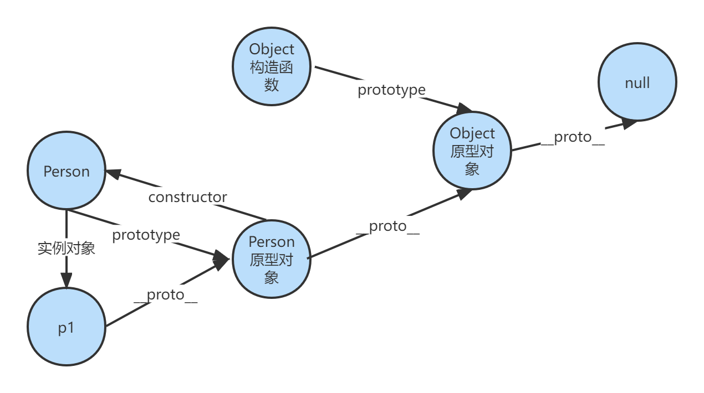

### Function、Object 之间微妙的关系

先看一道题，以下的代码输出什么？

```js
Object instanceof Function
Function instanceof Function
Object instanceof Object
Function instanceof Object
```

回顾一下 instanceof 的工作原理，它是判断构造函数的 prototype 属性是否存在于实例对象的原型链上。

Object、Function 是函数对象，可以看作是 new Function() 产生的，而 Object 构造函数的 prototype 存在于所有原型链上，因此上述代码都打印 true。

```js
Object instanceof Function // true
Function instanceof Function // true
Object instanceof Object // true
Function instanceof Object // true
```

下面看更复杂的例子。

```js
Function.__proto__ === Function.prototype

Function.__proto__.__proto__ === Object.prototype

Object.__proto__ === Function.prototype

Object.__proto__.__proto__ === Object.prototype
```

- Function.prototype 可以看作是一个对象，由 Object 构造函数创建。

- Object 可以看作一个函数，由 Function 构造函数创建。

- Function 可以 看作一个函数对象，由 Function 构造函数创建。

```js
// Function是一个函数对象，由Function构造函数创建
Function.__proto__ === Function.prototype // true

// Funtcion.prototype本身是一个对象，由Object构造函数创建
Function.__proto__.__proto__ === Object.prototype // true
Function.prototype.__proto__ === Object.prototype // true

// 原型对象的constructor指向构造函数
Function.__proto__.constructor === Function // true

// Object是一个函数对象，由Function构造函数创建
Object.__proto__ === Function.prototype // true

// Object.prototype本身是一个对象，由Object构造函数创建
Object.__proto__.__proto__ === Object.prototype // true
```

一图胜千言：

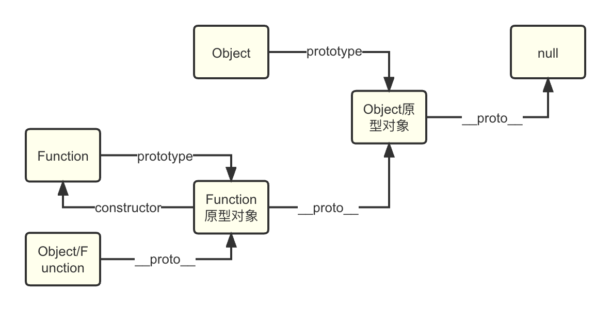

[浅谈 Function.prototype 和函数、Object 的关系](https://blog.csdn.net/Pang_Yue__Fairy/article/details/130570056){link=static}

### 创建对象的方法及它们的proto

1. 字面量创建

```js
const obj = {};
obj.__proto__ === Object.prototype // true
```

2. new Object创建

```js
const obj = new Object();
obj.__proto__ === Object.prototype // true
```

3. Object.create()创建

Object.create()创建一个对象，它的 __proto__ 指向第一个参数。

```js
const obj = Object.create({});
obj.__proto__; // {}
```

4. new构造函数创建

new 构造函数创建的对象，它的 __proto__ 指向构造函数的 prototype。

```js
function Person() {}
const person = new Person();
person.__proto__ === Person.prototype // true
```

### 和原型相关的方法

- Object.getPrototypeOf(obj)：获取对象的原型。

- Object.setPrototypeOf(obj, prototype)：设置对象的原型。

- obj.hasOwnProperty(prop)：判断对象是否包含自由属性 prop。

- obj.isPrototypeOf(obj2)：判断 obj2 是否在 obj 的原型链上，和 instanceof 类似。

- Object.create(obj)：创建一个新对象，它的原型指向obj。

实现继承：子类通过原型链继承父类的属性和方法。

```js
function Animal(name) {
 this.name = name;
}

Animal.prototype.sayName = function () {
 console.log(`My name is ${this.name}`);
};

function Dog(name, breed) {
 Animal.call(this, name); // 继承⽗类的属性
 this.breed = breed;
}

Dog.prototype = Object.create(Animal.prototype); // 继承⽗类的⽅法
Dog.prototype.constructor = Dog;
Dog.prototype.sayBreed = function () {
 console.log(`My breed is ${this.breed}`);
};

const dog = new Dog("Buddy", "Golden Retriever");
dog.sayName(); // My name is Buddy
dog.sayBreed(); // My breed is Golden Retriever
```

```js
// 多态
function Animal() {}

Animal.prototype.speak = function () {
 console.log("Animal speaks");
};

function Cat() {}
Cat.prototype = Object.create(Animal.prototype);
Cat.prototype.constructor = Cat;
Cat.prototype.speak = function () {
 console.log("Meow");
};

function Dog() {}
Dog.prototype = Object.create(Animal.prototype);
Dog.prototype.constructor = Dog;
Dog.prototype.speak = function () {
 console.log("Woof");
};

const cat = new Cat();
const dog = new Dog();
cat.speak(); // Meow
dog.speak(); // Woof
```

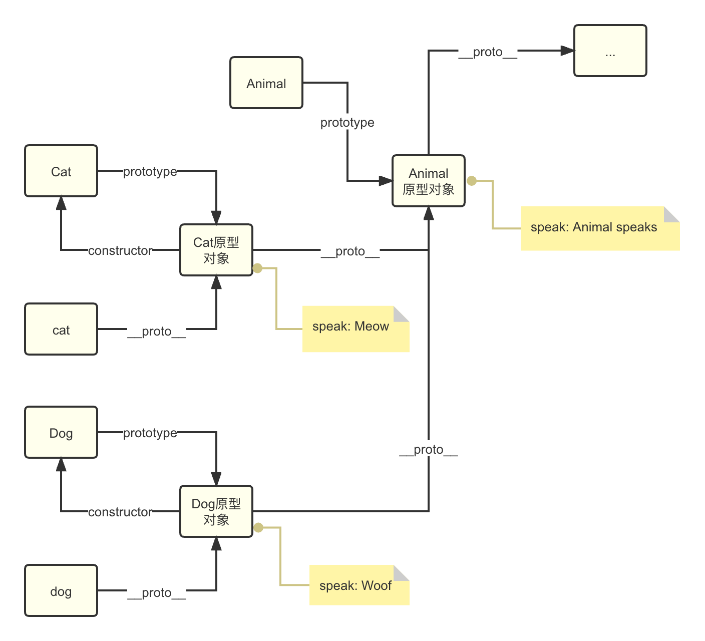

```js
// 修改对象
const person = { name: "John" };

Object.getPrototypeOf(person).sayHello = function () {
 console.log(`Hello, my name is ${this.name}`);
};

person.sayHello(); // 输出：Hello, my name is John
```

## `call() apply() bind()` 的作用

call、apply、bind 都能改变函数内部的 this 指向。

call 和 apply 都会调用函数，其中 apply 需要以数组的形式传递参数，数组中的元素作为参数传递给被调用的函数。

bind 不会调用函数，它返回一个改变了 this 指向的新函数。

call 和 bind 会将第二个参数及其之后的参数传入函数体内。

当需要改变函数内部 this 指向且要立即调用函数时，可使用 call、apply。

当需要改变函数内部 this 指向有不需要立刻调用函数的时候，可以使用 bind，如改变定时器内部的 this 指向。

```js
const max = Math.max.apply(null, [1, 2, 3]) // 3

btn.onclick = function () {
  this.disabled = true
  setTimeout(
    function () {
      this.disabled = false
    }.bind(this),
    1000
  )
}
```

看代码说结果

```js
function func(a, b, c) {
  console.log(a, b, c);
}
var func1 = func.bind(null, "linxin");

func("A", "B", "C"); 
func1(); 
func1("A", "B", "C"); 
func1("B", "C"); 
func.call(null, "linxin"); 
func.apply(null, ["a", "b", "c"]); 


// 结果分别是：
// A B C
// linxin undefined undefined
// linxin A B
// linxin B C
// linxin undefined undefined
// a b c
```

## bind 链式调用

看代码说结果。

```js
function fn(age) {
  console.log('🥬  ', arguments);
  console.log('🥬  ', this.name, age);
}
let obj1 = { name: 'obj1' };
let obj2 = { name: 'obj2' };
let obj3 = { name: 'obj3' };

let a = fn.bind(obj1, 10);
let b = a.bind(obj2, 20);
let c = b.bind(obj3, 30);

a(66);
b(77);
c(88);

fn.bind(obj1, 10).bind(obj2, 20).bind(obj3, 30)(40);
```

结果如下。

```js
// node 环境下的运行结果
🥬   [Arguments] { '0': 10, '1': 66 }
🥬   obj1 10
🥬   [Arguments] { '0': 10, '1': 20, '2': 77 }
🥬   obj1 10
🥬   [Arguments] { '0': 10, '1': 20, '2': 30, '3': 88 }
🥬   obj1 10
🥬   [Arguments] { '0': 10, '1': 20, '2': 30, '3': 40 }
🥬   obj1 10
```

1、bind() 方法会创建一个新函数。

2、bind()的第一个参数为新函数的 this 指向，后面的参数会作为新函数的前几个参数传入。

3、新函数在运行时，会调用原函数。

4、连续 bind 会产生闭包，算是函数柯里化的一种应用。

`fn.bind(obj1, 10).bind(obj2, 20).bind(obj3, 30)(40);` 相当于：

```js
let a = fn.bind(obj1, 10);
let b = a.bind(obj2, 20);
let c = b.bind(obj3, 30);
c(40);
```

c(40) 运行时，会调用 b 函数，并且把参数 30、40（bind 直接绑定的参数在前面） 传给 b 函数，b 函数的 this 指向 obj3。

b 运行时，调用 a 函数，传入参数 20、30、40。

a 运行时，调用 fn 函数，传入参数 10、20、30、40，fn 函数 this 指向 obj1。

即最后执行的时候相当于 `fn.call(obj1, 10, 20, 30, 40)`。

[连续bind返回值的个人理解](https://juejin.cn/post/6947353368687804453){link=static}

## 手写 call、apply、bind

### call

主要思路：将原函数挂载到指定对象上，接着通过该对象调用原函数，从而将函数的 this 指向指定对象，最后将函数从对象属性上删除。

难点：在 ES5 中，如何将 arguments 类数组的参数，转换为逗号分割的参数序列，给原函数传递参数。

```js
// ES5 实现
Function.prototype.myCall = function (context) {
  // 如果 context 为空，则挂载到全局对象上，Node 是 global
  // Object(context) 是为了防止传入基本类型
  var context = context ? Object(context) : window;

  // 为了防止属性名冲突，拼接上当前时间戳
  var key = 'fn' + new Date().getTime();
  context[key] = this;

  // 获取参数，从第二个开始，第一个是 context 
  var args = [];
  for (var i = 1;i < arguments.length;i++) {
    args.push(arguments[i]);
  }

  // 假设 args 是 [1, 2, 3]
  // 调用字符串：context[key](1,2,3)
  // 这样也可以：'context.' + key + '(' + args + ')'，结果是：context.fn1623844656(1,2,3)
  // 在这里，args 会自动调用数组的 toString 方法，转换为逗号分割的参数序列字符串 1,2,3
  var callStr = 'context[key](' + args + ')';
  // eval 函数将字符串当作 JS 代码执行
  var res = eval(callStr);

  // 删除临时添加的属性
  delete context[key];
  return res;
}
```

无注释版本：

```js
// ES5 实现
Function.prototype.myCall = function (context) {
  var context = context ? Object(context) : window;

  var key = 'fn' + new Date().getTime();
  context[key] = this;

  var args = [];
  for (var i = 1;i < arguments.length;i++) {
    args.push(arguments[i]);
  }

  var callStr = 'context[key](' + args + ')';
  var res = eval(callStr);

  delete context[key];
  return res;
}

// 使用 Symbol
Function.prototype.myCall = function (context) {
  var context = context ? Object(context) : window;

  // 每个 Symbol 都是独一无二的，不会冲突
  var key = Symbol();
  context[key] = this;

  var args = [];
  for (var i = 1;i < arguments.length;i++) {
    args.push(arguments[i]);
  }

  var callStr = 'context[key](' + args + ')';
  var res = eval(callStr);

  delete context[key];
  return res;
}

// ES6 实现
Function.prototype.myCall = function (context, ...rest) {
  const context = context ? Object(context) : window;

  const key = Symbol();
  context[key] = this;

  const res = context[key](...rest);

  delete context[key];
  return res;
}
```

### apply

apply 的实现和 call 类似，区别就在于 apply 传递的参数是数组，而 call 传递的参数是逗号分割的参数序列。

```js
// ES5 实现
Function.prototype.myApply = function (context, args) {
  var context = context ? Object(context) : window;

  var key = 'fn' + new Date().getTime();
  context[key] = this;

  var callStr = 'context[key](' + args + ')';
  var res = eval(callStr);

  delete context[key];
  return res;
}

// ES6 实现
Function.prototype.myApply = function (context, args) {
  const context = context ? Object(context) : window;

  const key = Symbol();
  context[key] = this;

  const res = context[key](...args);

  delete context[key];
  return res;
}
```

### bind

实现 bind 的几个关键点：

- 改变 this 指向。

- bind 返回一个函数。

- 预设参数，即参数可以在 bind 中传递，也可以在 bind 返回的函数中传递。

- 需要保留原函数的原型 prototype。

- 需要判断 bind 返回的函数是否被 new 了。

```js
// ES5 的实现
Function.prototype.myBind = function (context) {
  // 保留原函数
  var fn = this;
  //  arg1 是 bind 函数里传递的参数，从第 2 个开始
  var arg1 = Array.prototype.slice.call(arguments, 1);

  // 返回的新函数
  var result = function() {
    //  arg2是调用新函数时传递的参数
    var arg2 = Array.prototype.slice.call(arguments);
    // 如果这个新函数被 new 了，直接取 this
    return fn.apply(this instanceof result ? this : context, arg1.concat(arg2));
  }

  // 维护原型链
  result.prototype = fn.prototype;
  return result;
}

// ES6 的实现
Function.prototype.myBind = function (context, ...arg1) {
  const fn = this;
  const result = function(...arg2) {
    return fn.apply(this instanceof result ? this : context, [...arg1, ...arg2]);
  }
  result.prototype = fn.prototype;
  return result;
}
```

## JS 的包装类型是什么？

JS 中，基本类型是没有属性和方法的。为了便于操作基本类型，在调用基本类型的属性或方法时，JS 会隐式地将基本类型转换为对应的包装对象。

```js
const str = 'hello'
str.length // 5
str.toUpperCase() // 'HELLO'
```

通过 `Object()` 函数，也可以显式地将基本类型转换为包装对象。

```js
const str = 'hello'
Object(str) // String { "hello" }
const num = 123
Object(num) // Number { 123 }
```

通过 `valueOf()` 函数，可以将包装对象转换为基本类型。

```js
const str = 'hello'
const strObj = Object(str)
strObj.valueOf() // 'hello'
```

:::tip 看代码说结果

```js
const boo = new Boolean(false)
if (!boo) {
  console.log('boo is false') // 这段代码不会执行
}
```

上述代码不会打印 `boo is false`，因为 boo 是一个包装对象，本质上它已经是一个对象，因此 `if` 语句中是 `true`，打印语句不会执行。
:::

## 为什么会有 BigInt 的提案

JS 中 `Number.MAX_SAFE_INTEGER` 来表示最大的安全整数，它的值是 9007199254740991（即 2 的 53 次方减 1）。

在这个范围内的整数可以精确表示，没有精度丢失。当整数超过这个范围时，JS 可能会出现计算不准确的情况。

由于这个问题在进行大数计算时不得不依靠一些第三方库，因此官方提出了 BigInt 的提案来解决这个问题。

:::tip JS 的特殊数值

```js
Number.MAX_SAFE_INTEGER // 最大的安全整数，9007199254740991
Number.MAX_VALUE // 最大正浮点数，约为 1.7976931348623157e+308
Number.MIN_SAFE_INTEGER // 最小的安全整数，-9007199254740991
Number.MIN_VALUE // 最小正浮点数，约为 5e-324
```

:::

## 如何判断一个对象是空对象

### `Object.keys()`

```js
function isEmptyObject(obj) {
  return Object.keys(obj).length === 0
}
```

`Object.keys()` 返回一个由给定对象的所有可枚举自有属性的属性名组成的数组。

### `JSON.stringify()`

```js
function isEmptyObject(obj) {
  return JSON.stringify(obj) === '{}'
}
```

若对象包含不可枚举的自有属性，这种方法不准确。

## `const` 定义的变量的值可以修改吗

`const` 关键字保证的是栈内存中保存的值不能修改。

对于基本数据类型而言，栈内存中保存的就是实际的值，因此这个值无法被修改。

对于引用数据类型而言，栈内存中保存的是对象在堆内存中的**引用地址**，这个引用地址无法被修改，但是堆内存中的对象是可以被修改的。

## `this` 指向

1. 函数调用。`this` 指向函数的调用者。普通函数调用指向全局对象（非严格模式）或 `undefined` （严格模式）。对象函数的调用，指向该对象。
2. 全局上下文的函数调用。非严格模式下，在全局上下文中，`this` 指向全局对象，浏览器是 `window` 对象，Node.js 是 `global` 对象。严格模式下，`this` 指向 `undefined`。
3. 构造函数调用。使用 `new` 构造函数创建对象时，构造函数的 `this` 指向创建的实例对象。
4. 定时器、立即执行函数、匿名函数的指向，同第二点。
5. 箭头函数没有自己的 `this`，它的 `this` 指向在函数定义时就已经确定了，指向的是函数外层作用域的 `this`，且不会改变。
6. `bind()`、`call()`、`apply()` 等方法可以改变函数的 `this` 指向。

## 箭头函数和普通函数的区别

1. 箭头函数没有自己的 this，它的 this 指向在函数定义时就确定了，指向函数外层作用域的 this，并且不会改变，call、apply、bind 方法也无法改变箭头函数的 this 指向。
2. 箭头函数没有 arguments，在箭头函数里访问 arguments 得到的实际上是外层函数的 arguments。如果没有外层函数，也就是箭头函数在全局作用域内，使用 arguments 会报错。可以使用剩余参数来代替 arguments 访问箭头函数的参数列表。
3. 箭头函数没有原型对象 prototype。
4. 箭头函数不能用作构造函数，不可以使用 new 命令。在 new 一个构造函数时，首先会创建一个对象，接着把新对象的 `__proto__` 属性设置为构造函数的原型对象 prototype，接着把构造函数的 this 指向新对象。对于箭头函数而言，第一，它没有原型对象 prototype，第二，它没有自己的 this，所以不能用作构造函数。

## 作用域、执行上下文

### 作用域

1. 简单而言，作用域相当于一个区域，就是为了说明这个区域有多大，而不包括这个区域里面有什么东西。这个区域里面有什么东西是这个作用域对应的执行上下文要说明的内容。

2. JS 没有块级作用域，只有函数作用域和全局作用域。块级作用域就是定义在 {} 里的范围，比如 if() 和 for() 里那个 {} 的范围就叫做块级作用域。

3. 全局变量要在代码前端声明，函数中的变量要在函数体一开始的地方声明好。除了这两个地方，其它地方不要出现变量声明。否则会：内层变量会覆盖外层变量；用来计数的循环变量泄漏变成全局变量。使用 let 会解决 var 没有块级作用域的问题。

4. 作用域是在函数创建的时候就已经确定了，而不是函数调用的时候。

5. 作用域最大的用处就是隔离变量，不用作用域下的同名变量不会有冲突。

### 执行上下文

我们可以将执行上下文看作代码当前运行的环境。主要分为：全局执行上下文、函数执行上下文和 eval 函数执行上下文。

对于一个执行上下文，也可以称为当前 js 执行环境，包括了私有作用域、当前作用域中的变量、上层作用域、当前作用域对象 this。

执行上下文的建立过程：

1. 建立阶段（调用一个函数时，但在执行函数体内具体代码以前）：给参数赋值、声明函数、声明变量、初始化作用域链、确认上下文的 this 指向。

2. 代码执行阶段：变量赋值、执行其它代码。

在建立执行上下文的过程中，变量的声明不重要，重要的是变量的赋值。不管在建立阶段的时候一个属性的声明是怎样的，在执行阶段仍然可以被赋值为不同类型的值，这也是为什么 JavaScript 是弱类型的语言。

### 作用域和上下文的关系

作用域只是一个区域，一个抽象的概念，其中没有变量。

要通过作用域对应的执行上下文环境来获取变量的值。

同一个作用域下，不同的调用会产生不同的执行上下文环境，继而产生不同的变量值。

### 自由变量

> **不在自己作用域里的变量都叫自由变量**。

在 JavaScript 中，自由变量（Free Variable）是指在一个函数内部可以访问到的，但不是该函数参数或局部变量的变量。这些变量通常是定义在函数外部的全局变量，或者是函数所在作用域链（Scope Chain）中的上层作用域中的变量。

自由变量的概念主要出现在函数式编程和闭包（Closure）的讨论中。闭包是指一个函数可以访问并操作其外部作用域中的变量，即使该函数在其他地方被调用。

```js
// 全局变量 x，是函数 foo 的自由变量
var x = 10;

function foo() {
  // 访问全局变量 x，这里 x 是自由变量
  console.log(x);
}

foo(); // 输出: 10
```

### 作用域链

在自己所在作用域对应的执行上下文取值，如果取不到就到上一级作用域对应的执行上下文，直到全局作用域对应的执行上下文。

作用域链是因为自由变量才存在的，也是因为自由变量，作用域链才有意义。

```js
var aa = 22;

function a() {
  console.log(aa);
}

function b(fn) {
  var aa = 11;
  fn();
}

b(a); // 22
```

作用域在函数创建的时候就已经确定了，而不是函数调用的时候。

因此，上述例子中，函数 a 的上一级作用域是全局作用域，而不是函数 b 的作用域，所以向上一级作用域取变量 aa 的值是 22，不是 11。

```js
function a() {
  var age = 21;
  var height = 178;
  var weight = 70;
  function b() {
    // var 声明的变量有变量提升，在这个位置 age 已声明但未赋值，所以是 undefined
    console.log(age); // undefined
    console.log(height); // 178
    var age = 25;
    height = 180;
    console.log(age); // 25
    console.log(height); // 180
  }
  b();
  console.log(height); // 180
}
a();
```

[javascript执行上下文、作用域与闭包（第一篇）---执行上下文](https://blog.csdn.net/iamchuancey/article/details/78230791){link=static}

## 闭包

当一个内部函数引用了外部函数的变量，就产生了闭包。

在闭包里，函数调用完之后，其执行上下文环境不会立即被销毁。使用闭包会使变量保存在内存中，导致增加内存开销。

内部函数保持对外部函数作用域的引用，使得外部函数中的变量在内部函数执行时依然可用。

闭包的应用场景：

1. 实现计数器

闭包可以用来创建自己的计数器或计时器，这些计数器或计时器能够记住它们自己的计数或时间信息，而不会影响其他计数器或计时器。

```js
function makeCounter() {
  let count = 0;
  return function() {
    count++;
    return count;
  };
}

const counter1 = makeCounter();
const counter2 = makeCounter();

console.log(counter1()); // 输出: 1
console.log(counter1()); // 输出: 2
console.log(counter2()); // 输出: 1
```

2. 封装私有变量

闭包可以用来创建只能通过特定函数访问的私有变量。

```js
function person(name, age) {
  let _name = name;
  let _age = age;

  return {
    getName: function() {
      return _name;
    },
    getAge: function() {
      return _age;
    },
    setAge: function(age) {
      _age = age;
    }
  };
}

const p = person('John', 30);
console.log(p.getName()); // 输出: 'John'
p.setAge(31);
console.log(p.getAge()); // 输出: 31
```

3. 实现模块化

闭包可以用来实现简单的模块化模式，创建私有变量和方法，只暴露必要的接口。把操作函数暴露在外部，细节隐藏在内部。

```js
function module() {
  const arr = []

  function add(val) {
    arr.push(val);
  }

  function get(index) {
    return arr[index];
  }

  return { add, get}
}

const m = module();
m.add(22);
m.get(0); // 22
```

4. 循环注册点击事件

有问题的代码：

```js
var list = document.querySelectorAll('li');
for (var i = 0;i < list.length;i++) {
  list[i].onclick = function() {
    alert(i);
  }
}
```

首先，这段代码是产生了闭包的。匿名回调函数引用了外部作用的变量 i，由于闭包的作用，即使循环结束，i 值会保留在内存中。

但是每个事件监听器会共享一个 i 值，因此点击任意一个 li 元素，弹出的值是循环结束的 i 值，即 list.length，而不是点击的元素在数组中的索引。

修改方法一：将索引值保存到每个 li 元素中

```js
var list = document.querySelectorAll('li');
for (var i = 0;i < list.length;i++) {
  list[i].index = i;
  list[i].onclick = function() {
    // 函数的 this 指向就是对应的 li 元素
    alert(this.index);
  }
}
```

修改方法二：var 改为 let

let 声明的变量具有块级作用域，每个循环迭代都会创建一个新的 i 的绑定，这样每个点击事件监听器就会引用它自己的 i 的值。

```js
var list = document.querySelectorAll('li');
for (let i = 0;i < list.length;i++) {
  list[i].onclick = function() {
    alert(i);
  }
}
```

修改方法三：使用 IIFE 产生新闭包

使用立即执行函数表达式（IIFE）来创建一个新的作用域，将循环中的 i 值传递给这个新的作用域。

```js
var list = document.querySelectorAll('li');
for (var i = 0;i < list.length;i++) {
  list[i].onclick = (function(index) {
    return function() {
      console.log(index)
    }
  })(i)
}

var list = document.querySelectorAll('li');
for (var i = 0;i < list.length;i++) {
  (function(index) {
    list[i].onclick = function() {
      console.log(index);
    }
  })(i)
}
```

## var let const

### 块级作用域

ES5 只有全局作用域和函数作用域，没有块级作用域。在 ES6 之前，大部分人会选择使用闭包来解决这个问题，现在可以用 let 来解决问题。

var：只有全局作用域和函数作用域，没有块级作用域的概念。

let：有全局作用域、函数作用域和块级作用域的概念。块级作用域由花括号{}包裹起来，if 和 for 语句的 {} 也属于块级作用域，注意对象的 {}不是块级作用域。

### 变量提升、暂时性死区

var 声明的变量存在变量提升，let、const 没有。

在作用域内，使用 let 声明的变量之前，这个变量都是不可用的，称为暂时性死区（temporal dead zone，简称 TDZ）。

当前作用域顶部到这个变量声明位置的中间部分，都是 let 变量的死区，在死区中，禁止访问这个变量，否则会报错。

```js
if (true) {
  console.log(name);
  let name = 'let'; // Uncaught ReferenceError: Cannot access 'name' before initialization
}
```

### 重复声明

var 的变量可以重复声明，let、const 的变量不允许重复声明，即在相同作用域内不能够重复声明一个变量。

### 全局对象的属性

ES5 中全局对象的属性与全局变量基本是等价的，但是也有区别，比如通过var声明的全局变量不能使用delete从 window/global （ global是针对与node环境）上删除，不过在变量的访问上基本等价。

ES6 中做了严格的区分，使用 var 和 function 声明的全局变量依旧作为全局对象的属性，使用 let, const 命令声明的全局变量不属于全局对象的属性。

```js
var a = 10;
console.log(window.a); //10
console.log(this.a) //10

let b = 20;
console.log(window.b); // undefined
console.log(this.b) // undefined
```

### const 常量

const 声明的变量具有 let 声明的变量的特性。

除此之外，const 变量必须在声明的时候初始化，并且不可改变。

当变量是对象时，这里的不可改变是指变量指向的对象不可改变，但是对象内部的变化是不受限制的。

```js
const a = 1;
a = 2; // Uncaught TypeError: Assignment to constant variable.

const b; // Uncaught SyntaxError: Missing initializer in const declaration

const c = [];
c[1] = 2;

c = [1,2]; // Uncaught TypeError: Assignment to constant variable.
```

[总结下var、let 和 const 的区别](https://www.cnblogs.com/jing-tian/p/11073168.html){link=static}

### 看代码说结果

```js
// 1.
var b = 20;
const a = {
  b: 12,
  fn: function () {
    return function () {
      console.log(this.b);
    };
  },
};
a.fn()();

// 2.
const b = 20;
const a = {
  b: 12,
  fn: function () {
    return function () {
      console.log(this.b);
    };
  },
};
a.fn()();

// 3.
var b = 20;
const a = {
  b: 12,
  fn: function () {
    console.log(this.b);
  },
};
a.fn();

// 4.
var b = 20;
const a = {
  b: 12,
  fn: function () {
    console.log(b);
  },
};
a.fn();


// 结果分别是：20, undefined, 12, 20
```

## script 作用域

script 作用域可以理解为全局的块级作用域，它和全局作用域同级。

script 作用域和块级作用域的关系，就像全局作用域和函数作用域的关系。只有在全局中使用 let、const 定义变量，script 作用域才会被创建。

```js
debugger
var a = 'window a'

debugger
const b = 'script b'
debugger
{
    const c = 'Block c'
    debugger
}
function Fun() {
    const a = 'Fun a'
    var b = 'Fun b'
    debugger
}
Fun()
```

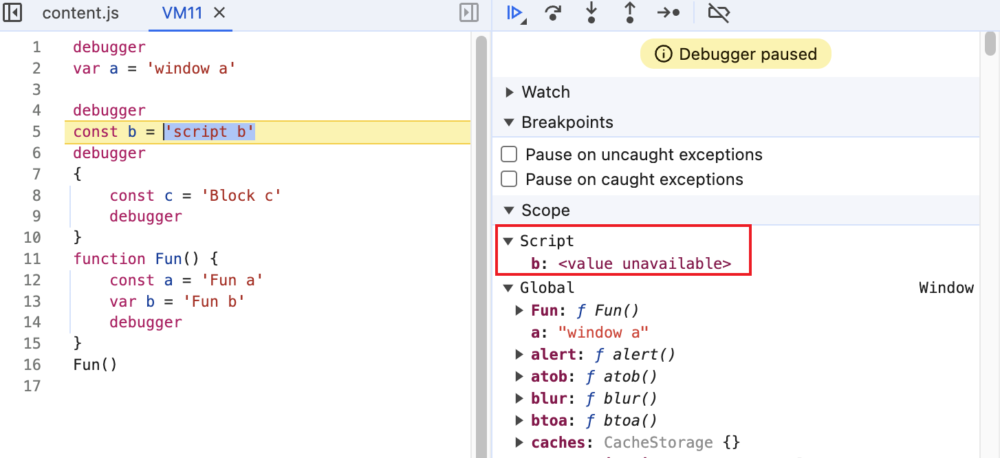

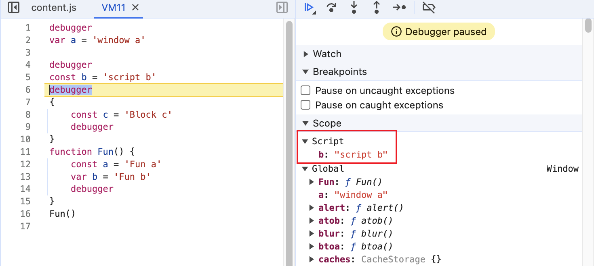


## 迭代器

### 迭代器是什么

迭代器（Iterator）是一种设计模式，它使你能够遍历数据集合（例如数组，字符串，映射，集合等）的元素。在JavaScript中，迭代器是一个对象，它必须实现一个next()方法。每次调用next()方法，迭代器都会返回一个包含两个属性的对象：value和done。value属性表示当前元素的值，done属性是一个布尔值，如果迭代完成则为true，否则为false。

迭代器的主要作用是提供一种统一的遍历数据结构的方法，尤其是对于复杂的数据结构（如图、树等），迭代器模式可以将遍历逻辑与数据结构本身分离，使得在不改变数据结构的前提下，可以方便地对数据进行遍历。

### 迭代器使用

通过 `Symbol.iterator` 获取迭代器。

```js
const arr = [1, 2, 3];
const iterator = arr[Symbol.iterator]();

console.log(iterator.next()); // { value: 1, done: false }
console.log(iterator.next()); // { value: 2, done: false }
console.log(iterator.next()); // { value: 3, done: false }
console.log(iterator.next()); // { value: undefined, done: true }
```

### 实现迭代器

```js
function createIterator(items) {
  let index = 0;
  return {
    next: function () {
      const value = items[index++];
      const done = index >= items.length;
      return { value, done };
    },
  };
}

const iterator = createIterator([1, 2, 3]);

console.log(iterator.next());
console.log(iterator.next());
console.log(iterator.next());
console.log(iterator.next());
```

:::danger 注意事项
`for...of` 循环会调用迭代器，如果循环的对象没事实现迭代器，则会报错。

普通对象没有实现迭代器，所以 `for...of` 循环会报错。

```js
const obj = { age: 11 };
for (const item of obj) {
  console.log(item);
} // Uncaught TypeError: obj is not iterable
```

给普通对象定义 `Symbol.iterator` 方法，添加迭代器。

```js
const obj = { age: 11 };

// 为对象添加一个 Symbol.iterator 方法
obj[Symbol.iterator] = function() {
  const keys = Object.keys(this);
  const values = Object.values(this);

  let index = 0;

  return {
    next: function() {
      // this指向外层的这个对象, { next: f() }
      console.log(this);
      if (index < keys.length) {
        const key = keys[index];
        const value = values[index];
        index += 1;
        return { value: `key: ${key}, value: ${value}`, done: false };
      } else {
        return { done: true };
      }
    }
  };
};

for (const item of obj) {
  console.log(item);
};
```
:::

## DOM 事件流

### DOM 事件流概述

事件流描述的是页面接收事件的顺序，它包含三个阶段：事件捕获阶段、目标阶段、事件冒泡阶段。

事件捕获阶段是指事件从 DOM 的最顶层节点开始，逐级向下传递到具体节点的过程。事件首先发生在 document 上，然后依次传递给 html、body 及其子节点，最后到达目标节点。

事件冒泡阶段相反，是指事件从目标节点开始，逐级向上传递到最顶层节点的过程。事件到达事件目标后不会停止，会逐层向上冒泡，直到 document 对象，和事件捕获阶段相反。

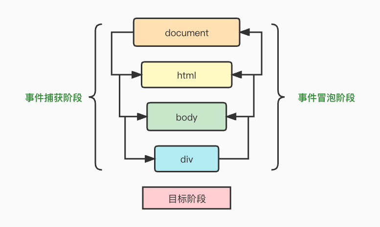

### DOM0级事件

DOM0级事件，是指通过「行内绑定」或「动态绑定」的方式进行事件绑定。

行内绑定：

```html
<input id="myButton" type="button" value="Click Me" onclick="alert('Hello1');" >
```

动态绑定：
```js
// 动态绑定
document.getElementById('myButton').onclick = function() {
  alert('Hello2');
}

// 删除事件处理程序
document.getElementById('myButton').onclick = null;
```

行内绑定和动态绑定的区别：

- 行内绑定：回调函数的 this 指向 window 对象。
- 动态绑定：回调函数的 this 指向绑定的 DOM 元素。

DOM0级事件最终只能绑定一个回调函数，在添加事件处理函数时，后面的事件会覆盖前面的事件。

另外，DOM0级事件具有较好的跨浏览器优势，兼容性较好。

### DOM2级事件

DOM2级事件，是指通过 addEventListener() 或 removeEventListener() 进行事件绑定和删除。

DOM2级事件中，可以对同一个元素的同一个事件绑定多个事件处理函数。

[关于DOM事件流、DOM0级事件与DOM2级事件](https://www.cnblogs.com/leophen/p/11405579.html){link=static}

[JS中DOM0,DOM2,DOM3级事件模型解析](https://www.jianshu.com/p/bbd6e600c0d3){link=static}

[五分钟了解DOM 事件模型](https://juejin.cn/post/6844903850323755021){link=static}

### 事件委托

事件委托：利用事件冒泡的特性，将里层的事件委托给外层，根据 event 对象的属性进行事件委托，改善性能。

当子节点数量过多的时候，不单独为每个子节点设置事件处理程序，而是把事件处理程序绑定在它们共同的父节点上，利用事件冒泡把事件传递给父节点，由父节点来处理事件。父节点可以通过 event.target 属性获取到事件触发的元素。

通过使用事件委托：

- 我们只操作了一次 DOM 节点，减少了与 DOM 节点的交互次数，提高了性能。

- 另外，使用事件委托也减少了函数的绑定数量，每个函数都是对象，都会占用一定的内存空间，因此可以减少内存占用。

```js
// 每个子节点的效果相同
ul.onclick = function(event) {
  var e = event || window.event;
  var target = e.target || e.srcElement;
  if (target.nodeName.toLowerCase() === 'li') {
    alert(target.innerHTML);
  }
}

// 每个子节点效果不同
box.onclick = function(event) {
  var e = event || window.event;
  var target = e.target || e.srcElement;
  if (target.nodeName.toLowerCase() === 'input') {
    switch(target.id) {
      case 'add':
        alert('add');
        break;
      case 'remove':
        alert('remove');
        break;
      case 'move': 
        alert('move');
        break;
      default:
        break;
    }
  }
}
```

### 事件监听函数 adddEventListener

`adddEventListener(event.type, handle, boolean)`：添加事件监听器，第三个参数默认为 false，表示在冒泡阶段触发事件。设置为 true 则表示在捕获阶段触发事件。

[addEventListener的第三个参数](https://juejin.cn/post/7081836998071156744){link=static}

### 阻止事件冒泡

`event.stopPropagation()`：阻止事件进一步传播，包括捕获、冒泡。根据事件监听器触发的阶段，决定什么时候阻止事件继续传播。

例如，adddEventListener 设置了在捕获阶段触发事件，则 stopPropagation 在捕获阶段就会阻止事件进一步传播，后续的目标阶段和冒泡阶段都不会触发了。

[关于js中事件的event.stopPropagation()方法的理解与举例说明](https://blog.csdn.net/zhizhan888/article/details/122094292){link=static}

```html
<div class="div1">
  div1
  <div class="div2">
    div2
    <div class="div3">
      div3
      <div class="div4">div4</div>
    </div>
  </div>
</div>
```

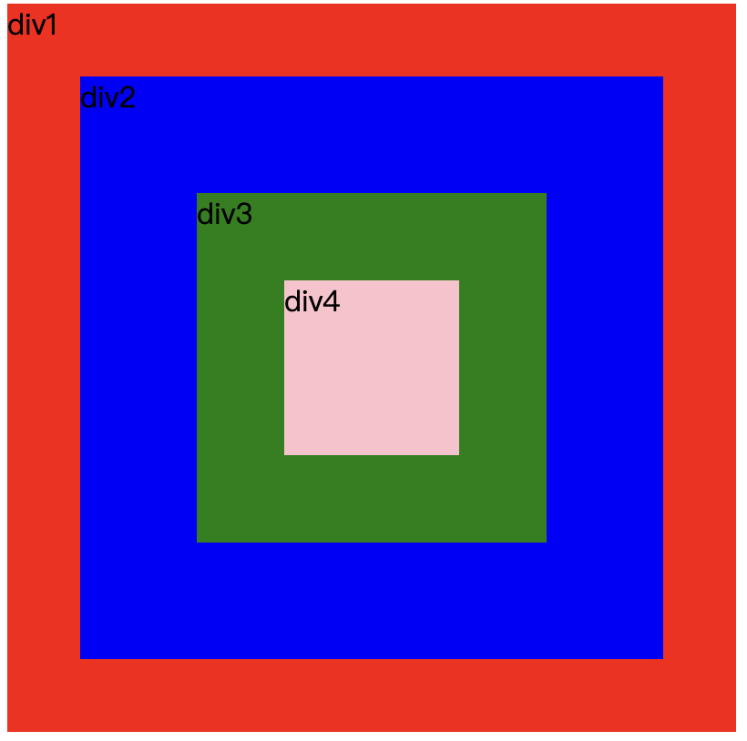

```js
var div1 = document.querySelector(".div1");
var div2 = document.querySelector(".div2");
var div3 = document.querySelector(".div3");
var div4 = document.querySelector(".div4");

div1.addEventListener("click", clickhandler1, true);
div2.addEventListener("click", clickhandler2);
div3.addEventListener("click", clickhandler3, true);
div4.addEventListener("click", clickhandler4);

function clickhandler1(e) {
  console.log("div1");
}
function clickhandler2(e) {
  console.log("div2");
}
function clickhandler3(e) {
  console.log("div3");
  e.stopPropagation();
}
function clickhandler4(e) {
  console.log("div4");
}

// 点击div4，输出结果：div1 div3
```

`event.cancelBubble = true`，阻止冒泡。

## event loop

为了协调事件、用户交互、脚本、渲染、网络任务等，浏览器必须使用事件循环。

JavaScript 是单线程的，在执行代码时只能按顺序执行。为了解决代码执行时的阻塞，js 是异步的。例如，在遇到 setTimeout 时，js 不会等定时器内容执行完再去执行之后的代码，而是先执行后面的代码，等时间到了之后再去执行定时器。

基于这种异步的规则，JavaScript 有一套自己的执行代码规则，来保证代码能够高效无阻塞地运行，这种规则就是事件循环。

Node 和浏览器都给 js 提供了运行的环境，但是两者的运行机制稍有差异。

## 属性遍历

### `for...in`

循环遍历对象**自身**和**继承**的**可枚举属性**（**不含Symbol属性**）。

可遍历的属性和 `Object.keys()` 返回的一样。

### `Object.keys()`

返回一个数组，包含**自身**的所有**可枚举属性**（**不含Symbol属性**）。

```js
const sym = Symbol();
const obj = {
  age: 666,
  name: 'Ben'
};
obj[sym] = 'symbol';

Object.defineProperty(obj, 'hobby', {
  value: 'football',
  enumerable: false,
});

// [ 'age', 'name' ]
console.log(Object.keys(obj));
```

### `Object.getOwnPropertyNames(obj)`

返回一个数组，包含对象**自身**的所有属性（不含Symbol属性和原型链属性，但是包括不可枚举属性）。

```js
const sym = Symbol();
const obj = {
  age: 666,
  name: 'Ben'
};
obj[sym] = 'symbol';

Object.defineProperty(obj, 'hobby', {
  value: 'football',
  enumerable: false,
});

// [ 'age', 'name', 'hobby' ]
console.log(Object.getOwnPropertyNames(obj));
```

有趣的 Object 不可枚举属性：

```js
Object.keys(Object); // []

Object.getOwnPropertyNames(Object);
// ['length', 'name', 'prototype', 'assign', 'getOwnPropertyDescriptor', 'getOwnPropertyDescriptors', 'getOwnPropertyNames', 'getOwnPropertySymbols', 'hasOwn', 'is', 'preventExtensions', 'seal', 'create', 'defineProperties', 'defineProperty', 'freeze', 'getPrototypeOf', 'setPrototypeOf', 'isExtensible', 'isFrozen', 'isSealed', 'keys', 'entries', 'fromEntries', 'values', 'groupBy']
```

### `Reflect.ownKeys(obj)`

返回一个数组，包含对象**自身**的所有属性（包括Symbol属性以及不可枚举属性）。

```js
const sym = Symbol();
const obj = {
  age: 666,
  name: 'Ben'
};
obj[sym] = 'symbol';

Object.defineProperty(obj, 'hobby', {
  value: 'football',
  enumerable: false,
});

// [ 'age', 'name', 'hobby', Symbol() ]
console.log(Reflect.ownKeys(obj));
```

### `Object.prototype.hasOwnProperty()`

判断对象自身属性中是否具有指定的属性（包括不可枚举属性，不包含从原型链上继承的属性、不包括Symbol属性）。

存在返回 true，否则返回 false。

```js
const sym = Symbol();
const obj = {
  age: 666,
  name: 'Ben'
};
obj[sym] = 'symbol';
Object.defineProperty(obj, 'hobby', {
  value: 'football',
  enumerable: false,
});

console.log(obj.hasOwnProperty('sym')); // false
console.log(obj.hasOwnProperty('age')); // true
console.log(obj.hasOwnProperty('name')); // true
console.log(obj.hasOwnProperty('hobby')); // true
```

### `Object.defineProperty(obj, prop, descriptor)`

在一个对象上定义一个新的属性，或者修改已有属性的描述符，并返回该对象。


```js
const obj = {};
Object.defineProperty(obj, 'hobby', {
  value: 'football',
  enumerable: false,
});
```

### `Object.prototype.propertyIsEnumerable()`

判断指定属性是否可枚举。

```js
const obj = {};

Object.defineProperty(obj, 'hobby', {
  value: 'football',
  enumerable: false,
});

console.log(obj.propertyIsEnumerable('hobby')); // false
```

### `Object.getOwnPropertyDescriptor(obj, prop)`

返回指定对象上指定自有属性的属性描述符，不会找原型链上的属性。

```js
const obj = {};

Object.defineProperty(obj, 'hobby', {
  value: 'football',
  enumerable: false,
});

/**
{
  value: 'football',
  writable: false,
  enumerable: false,
  configurable: false
}
*/
console.log(Object.getOwnPropertyDescriptor(obj, 'hobby'));
```

## 堆内存和栈内存的区别

栈（stack），是自动分配的内存空间，它由系统自动释放。

堆（heap），是动态分配的内存，大小不确定，也不会自动释放。

JavaScript 中的内存也分为栈内存和堆内存，一般而言：

- 栈内存中存放的是存储对象的地址，而堆内存存放的是存储对象的具体内容。

- 对于原始类型的值而言，其地址和具体内容都存放在栈内存中。

- 对于引用类型的值，其地址存放在栈内存中，而具体内容存放在堆内存中。

栈内存的运行效率比堆内存高，空间相对于堆内存而言较小。因此将构造简单的原始类型数据放在栈内存中，将构造复杂的引用类型数据放在堆内存中，不影响栈的效率。

```js
var str = 'hello'; // 'hello' 存在栈中
var obj = { value: 'hello' }; // obj 存在栈中，{ value: 'hello' } 存在堆中，通过栈里的变量 obj（地址）访问
```

栈与堆的垃圾回收：

- 栈内存中的变量一般在它当前执行环境结束时就会被销毁，被垃圾回收机制回收。

- 堆内存中的变量则不会，因为不确定其它地方是否存在对它的引用。堆内存的变量只有在所有对它的引用都结束时才会被回收。

- 闭包中的变量不保存在栈内存中，而是保存在堆内存中。这也是为什么函数调用之后闭包黑能引用到函数内的变量。

:::tip Questions
1、const 定义的变量能修改吗？

不能改。

对于基本类型的数据而言，栈内存存放的就是数据本身，const 定义的变量不能改。

对于引用类型的数据而言，栈内存存放的是指向对象的指针，const 定义的其实是这个指针，指针本身不能改，但是指针指向的对象本身的属性是可以改的。

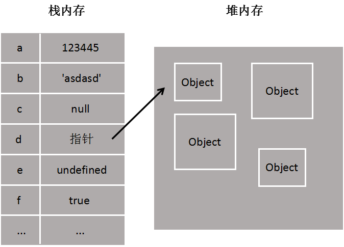

2、为什么 null 作为 object 类型却存在栈内存中？

栈内存中的变量一般都是已知大小或者有范围上限的，是一种简单存储。而堆内存存储的数据一般大小是不确定的。

这是为什么 null 会存在栈内存中，它的大小是固定的。

3、看代码说结果。

```js
var a = new String('123');
var b = String('123');
var c = '123';
console.log(a==b, a===b, b==c, b===c, a==c, a===c);
// true false true true true false

null === null; // true
```

new String() 返回的是大小不确定的对象，存在堆内存中。

工厂模式和直接字面量赋值出来的是字符串，是基本类型数据，存在栈内存中。
:::

[14-JS堆和栈内存-闭包与内存泄露 - 闭包之所以能访问父函数的局部变量是因为这些变量存放在堆内存中](https://www.cnblogs.com/haoqiyouyu/p/14683600.html){link=static}

## 函数柯里化

[柯里化函数（Currying），什么是柯里化，为什么要进行柯里化，高级柯里化函数的实现](https://blog.csdn.net/m0_52409770/article/details/123359123){link=static}

### 柯里化概述

柯里化（Currying）是把接受多个参数的函数，转换成接受一个参数的函数，并且这个新函数会返回一个函数。

它是一种函数的转换，例如将 `f(a,b,c)` 转换成 `f(a)(b)(c)`。

举个简单的例子：

```js
// curry(f) 执行柯里化转换
function curry(f) {
  return function(a) {
    return function(b) {
      return f(a, b);
    };
  };
}

// 用法
function sum(a, b) {
  return a + b;
}

let curriedSum = curry(sum);

alert( curriedSum(1)(2) ); // 3
```

柯里化函数 curry() 对传入的函数执行柯里化，从原来的 `f(a,b)` 转换成 `f(a)(b)` 执行。

可以理解为，把 sum 函数的 a、b 两个参数，变成了先用一个函数接收 a，接着返回一个函数去接收处理 b 参数。

lodash 也实现了柯里化函数：[`_curry`](https://lodash.com/docs#curry)。

### 柯里化的应用场景

1、参数复用

柯里化后的函数可以记住之前传入的参数，从而实现参数的复用。

假设有一个用于格式化和输出信息的日志函数 `log(date, importance, message)`。

```js
function log(date, importance, message) {
  alert(`[${date.getHours()}:${date.getMinutes()}] [${importance}] ${message}`);
}
```

经过柯里化之后，可以复用参数。

```js
// 函数柯里化
log = _.curry(log);

// 固定第一个参数为当前时间
const logNow = log(new Date());
// 假设有很多地方需要logNow，就不用重复传递当前日期时间了，让参数得以复用
logNow('INFO', 'message');
logNow('ERROR', 'message');

// 还可以继续固定第二个参数
const debugNow = logNow('DEBUG');
debugNow('message');
```

2、延迟执行

柯里化后的函数可以在需要的时候才进行计算，从而实现延迟执行。

如上述例子，debugNow 函数并没有立即执行，而是等待 message 参数传入之后才执行打印工作，从而实现了延迟执行。

### 柯里化的实现

原始函数的参数数量是确定的。

```js
function curry(func) {
  return function curried(...args) {
    // func.length 是函数的参数个数
    if (args.length >= func.length) {
      return func.apply(this, args);
    } else {
      return function(...args2) {
        return curried.apply(this, args.concat(args2));
      }
    }
  }
}
```

```js
function sum(a, b, c) {
  return a + b + c;
}

let curriedSum = curry(sum);

alert( curriedSum(1, 2, 3) ); // 6，仍然可以被正常调用
alert( curriedSum(1)(2,3) ); // 6，对第一个参数的柯里化
alert( curriedSum(1)(2)(3) ); // 6，全柯里化
```

- 如果传入的 `args` 长度大于等于原始函数的参数个数（`func.length`），直接调用原函数。

- 否则，返回一个偏函数，它将重新调用 `curried`，将之前传入的参数和新的参数一并传入。

- 直到参数数量足够，才调用原函数，得到最终结果。

### 参数不确定柯里化实现

原始函数参数个数不确定。

面试题：实现如下一个累乘函数。

```js
curry(1)(2)(3) = 6;
curry(1,2,3) = 6;
curry(1,2)(3) = 6;
curry(1)(2)(3)(4) = 24;
curry(1)(2)(3)(4)(5) = 120;
```

方法一：

```js
function curry(...args) {
  function multiple(arr) {
    return arr.reduce((a, b) => a * b, 1);
  }

  // 假设要求第一层参数没传，返回1
  if (args.length <= 0) {
    return 1;
    // 或者选择抛出一个错误
    // return new Error('Please pass params');
  }

  return function fn(...args2) {
    // 判断有没有传递参数，如果有，存储参数，返回fn
    if (args2.length > 0) {
      args.push(...args2);
      return fn;
    }
    // 没有传递参数，调用累乘方法计算累乘结果并返回
    return multiple(args);
  }
}

console.log(curry()); // 1
console.log(curry(1,2)(3)(4,5)); // [Function: fn]
console.log(curry(1,2)(3)(4,5)()); // 120
```

方法一其实并不完全符合要求，注意最后的调用方式，它需要 `()` 调用不传递参数，才会执行最后的累乘方法返回最终结果。

[函数柯里化实现sum(1)(2)(3)(4)...无限累加](https://blog.csdn.net/wingxabc/article/details/111167582){link=static}

方法二：

利用浏览器控制台会隐式调用 `toString()` 方法。

```js
function curry() {
  const args = Array.prototype.slice.call(arguments);

  const inner = function() {
    args.push(...arguments);
    return inner;
  }
  inner.toString = function() {
    return args.reduce((a, b) => a * b, 1);
  }
  return inner;
}

console.log(curry(1,2)(3)(4,5)); // [Function: inner] { toString: [Function (anonymous)] }
console.log(curry(1,2)(3)(4,5).toString()); // 120
```

但实际上，无论是 `curry(1,2)(3)(4,5)` 还是 `console.log(curry(1,2)(3)(4,5))`，浏览器都不会隐式调用 `toString()` 方法。

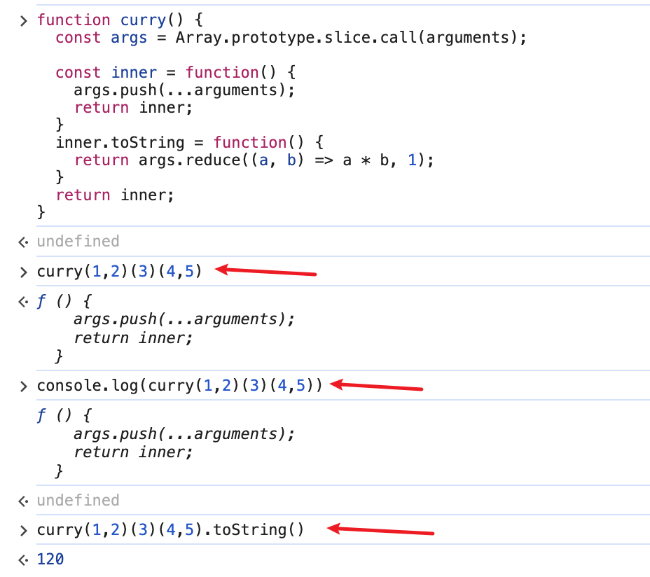

浏览器调用 `alert()` 方法才能隐式调用 `toString()` 方法。

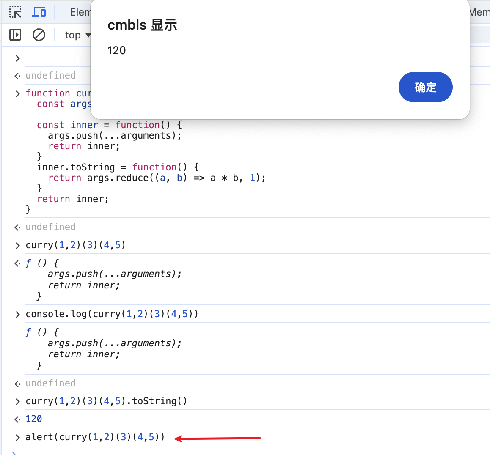

[js面试高频题：函数柯里化的实现（彻底弄懂）](https://blog.csdn.net/double_sweet1/article/details/122786636){link=static}

## 事件循环 event loop

### 事件循环概述

为了协调事件，比如用户交互、脚本、渲染、网络任务等，浏览器必须使用事件循环。

JS 是单线程的，在执行代码时只能够按顺序执行。为了避免 JS 代码执行时的阻塞，所以 JS 是异步的，比如在遇到定时器 setTimeout 时，不会停下来等待定时器到期，而是继续执行后面的代码，等定时器到期了，再执行定时器的回调函数。

基于这种异步的机制，JS 有一套自己执行代码的规则，来保证代码可以高效无阻塞地运行，这种规则就是事件循环。

Nodejs 和浏览器的事件循环机制稍有差异。

### 浏览器的事件循环机制

事件循环的主要过程是，从宏任务队列中取出一个宏任务开始执行，在执行过程中如果遇到其它宏任务，则添加到宏任务队列当中；如果遇到微任务，则添加到微任务队列当中。

等执行完此次宏任务之后，开始执行微任务队列的微任务。在执行微任务的过程中如果又遇到宏任务，则添加到宏任务队列；遇到微任务，添加到微任务队列。

等清空微任务队列之后，再从宏任务队列取出下一个宏任务，重复上述过程直到所有任务都完成为止。

常见的宏任务：script标签整体代码、setTimeout、setInterval、setImmediate、I/O、requestAnimationFrame。

常见的微任务：Promise.then catch finally、process.nextTick、MutationObserver、async/await（本质上也是Promise）。

|宏任务|浏览器|Node|
|-|-|-|
|I/O|✅|✅|
|setTimeout|✅|✅|
|setInterval|✅|✅|
|setImmediate|✖|✅|
|requestAnimationFrame|✅|✖|

|微任务|浏览器|Node|
|-|-|-|
|Promise.then catch finally|✅|✅|
|process.nextTick|✖|✅|
|MutationObserver|✅|✖|
|async/await|✅|✅|

### Node的事件循环机制

> Node.js采用V8作为js的解析引擎，而I/O处理方面使用了自己设计的libuv，libuv是一个基于事件驱动的跨平台抽象层，封装了不同操作系统一些底层特性，对外提供统一的API，事件循环机制也是它里面的实现。

Node 的事件循环包含 6 个阶段，如下图所示。

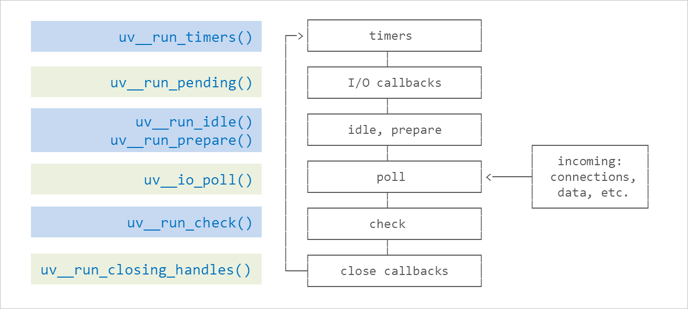

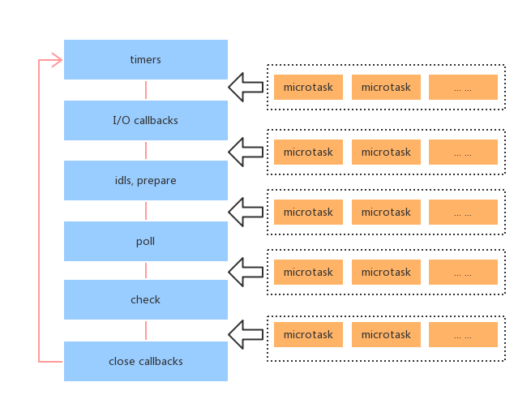

每个阶段的含义：

- timers: 这个阶段执行定时器队列中的回调如 setTimeout() 和 setInterval()。

- I/O callbacks: 这个阶段执行几乎所有的回调。但是不包括close事件，定时器和setImmediate()的回调。

- idle, prepare: 这个阶段仅在内部使用，可以不必理会。

- poll: 等待新的I/O事件，node在一些特殊情况下会阻塞在这里。

- check: setImmediate()的回调会在这个阶段执行。

- close callbacks: 例如socket.on('close', ...)这种close事件的回调。

:::danger setImmediate和setTimeout(fn,0)的区别
在 ⽂件 I/O、⽹络 I/O 中，setImmediate()会先于 setTimeout(fn,0)。

其他⼀般情况下，setTimeout(fn,0)会先于 setImmediate()。因为在 poll 阶段后，⻢上就进⼊ check 队列，从⽽进⾏ setImmediate 的回调。后⾯循环了之后才到 setTimeout()。

但是把它们放到⼀个 I/O 回调⾥⾯，就⼀定是 setImmediate() 先执⾏，因为 poll 阶段后⾯就是check 阶段。

后面有例子说明。
:::

### 浏览器和Node的区别

主要体现在对微任务的处理时机的不同：

浏览器中，微任务在当前宏任务执行完成之后执行。

Node.js 中，微任务会在事件循环的各个阶段之间执行。也就是会在每个阶段的所有宏任务执行完后，去执行微任务。

举个例子：

```js
setTimeout(()=>{
    console.log('timer1')
    Promise.resolve().then(function() {
        console.log('promise1')
    })
}, 0)

setTimeout(()=>{
    console.log('timer2')
    Promise.resolve().then(function() {
        console.log('promise2')
    })
}, 0)

//浏览器输出结果
timer1
promise1
timer2
promise2

//Node输出结果
timer1
timer2
promise1
promise2
```

因为 setTimout 都属于 Node.js 事件循环的 timers 阶段，因此会执行完两个setTimeout，然后执行微任务。

在以往的 Node 版本中，也就是 11.0 之前， JS 的执⾏栈的顺序是：执⾏同类型的所有宏任务 -> 在间隙时间执⾏微任务 ->event loop 完毕执⾏下⼀个 event loop。

⽽在最新版本的 11.0 之后，NodeJS 为了向浏览器靠⻬，对底部进⾏了修改，最新的执⾏栈顺序和浏览器的执⾏栈顺序已经是⼀样了：执⾏⾸个宏任务 -> 执⾏宏任务中的微任务 -> event loop 执⾏完毕执⾏下⼀个eventloop。

因此，其实现在 **Node.js 和浏览器的事件循环机制都是相同的了**。

### 代码题

看代码说结果。

```js
async function say() {
  await new Promise((resolve) => setTimeout(() => {
    resolve();
    new Promise((res) => {
      console.log('timout in await');
      res();
    }).then(() => console.log('then in await'))
  }, 0));
  console.log('await finish');
}
say();

setTimeout(() => {
  console.log(3)
})

new Promise((resolve) => {
  console.log(4)
  resolve();
}).then(() => {
  console.log(5)
  process.nextTick(() => {
    console.log(6)
  })
})

process.nextTick(() => {
  console.log(1);
  process.nextTick(() => {
    console.log('nextTick in nextTick');
  });
  new Promise((resolve) => {
    console.log(8);
    resolve();
  }).then(() => {
    console.log(7)
  })
})

new Promise((resolve) => {
  console.log(10)
}).then(() => {
  console.log(9)
})

console.log(2)

const fs = require('fs');

fs.readFile('./package.json', () => {
  setTimeout(() => {
    console.log('fs => timeout');
  });
  setImmediate(() => {
    console.log('fs => setImmediate');
  })
});

setTimeout(() => {
  console.log('timeout666');
}, 0);

setImmediate(() => {
  console.log('setImmediate');
});

setTimeout(() => {
  console.log('timeout');
});

process.nextTick(() => {
  console.log('nextTick');
});

console.log('last');
```

在 Node 14.18.1 版本的运行结果如下：

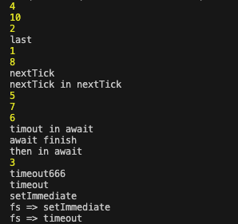

要点如下：

- await 的 Promise 状态完成后，后面的代码就添加到微任务队列中，相当于 then()。因此 `await finish` 在 `then in await` 之前。

- 微任务执行过程中如果又遇到微任务，则会继续添加到微任务队列中。

- Promise 要状态改变才会执行 then 函数，添加微任务，因此 `console.log(9)` 这行没有打印，因为没有执行 resolve()。

- 在文件 I/O 中，setImmediate() 会优先于 setTimeout(fn, 0)。因此 `fs => setImmediate` 在 `fs => timeout` 之前。

- 其它一般情况下，setTimeout(fn, 0) 会先于 setImmediate()。因此 `timeout666` 和 `timeout` 都在 `setImmediate` 之前。

- process.nextTick() 的优先级要永远高于 Promise 的微任务。因此 `1` 和 `nextTick`、`nextTick in nextTick` 在 `console.log(5)` 之前。

[从setTimeout和Promise的执行顺序来了解JS的执行机制](https://juejin.cn/post/6855129007558492174){link=static}

[setTimeout和setImmediate以及process.nextTick的区别](https://blog.csdn.net/lijingdan123123/article/details/121088267){link=static}

[JavaScript中事件循环和Nodejs中事件循环](https://blog.csdn.net/u014465934/article/details/89176879){link=static}

## 事件循环进阶

重点文章：

[深入解析 EventLoop 和浏览器渲染、帧动画、空闲回调的关系](https://zhuanlan.zhihu.com/p/142742003){link=static}

问题：

1. 每一轮 Event Loop 都会伴随着渲染吗？
2. requestAnimationFrame 在哪个阶段执行，在渲染前还是后？在 microTask 的前还是后？
3. requestIdleCallback 在哪个阶段执行？如何去执行？在渲染前还是后？在 microTask 的前还是后？
4. resize、scroll 这些事件是何时去派发的

总结：

1. 事件循环不一定每轮都伴随着重渲染，决定浏览器视图是否渲染的因素很多，例如屏幕刷新率、页面性能、页面是否在后台执行等。
2. requestAnimationFrame 在屏幕渲染之前执行，非常适合用来做动画。
3. requestIdleCallback 在屏幕渲染之后执行，并且是否有空执行要看浏览器的调度，如果要求它在某个时间内强制执行，可以设置 timeout 参数。
4. resize 和 scroll 事件其实⾃带节流，它只在 Event Loop 的渲染阶段去派发事件到
EventTarget 上。

### Dom 渲染时机

一般而言，Dom 渲染发生在微任务队列清空之后，下一个宏任务开始之前。由于 UI 线程和 js 线程互斥的关系，页面真正的渲染与浏览器的刷新频率也有关。

GUI 渲染线程和 JS 引擎线程互斥，由于 JS 是可操纵 DOM 的，如果在修改这些元素属性同时渲染界面，即 JS 线程和渲染线程同时运行。那么渲染线程前后获得的元素数据可能不一致。

因此，为了防止渲染出现不可预期的结果，GUI 渲染线程总是等待当前 JS 线程的任务清空后，把统一收集到的 DOM 操作提交给渲染线程，进行一次有效的屏幕更新。

### requestAnimationFrame() 执行时机

requestAnimationFrame() 会在重新渲染前调用。

但至于什么时候重新渲染，其实才是最主要的问题，得看浏览器的想法。

浏览器执行任务的顺序：

1. 从task任务队列中取第一个task（比如setTimeout、setIntervel的回调，也可以将同一轮循环中的所有同步代码看作是一个宏任务），执行它。

2. 执行微任务队列里的所有微任务。

3. 浏览器判断是否更新渲染屏幕，如果需要重新绘制，则执行步骤4-13，如果不需要重新绘制，则流程回到步骤1，这样不断循环。

4. 触发resize、scroll事件，建立媒体查询（执行一个任务中如果生成了微任务，则执行完任务该后就会执行所有的微任务，然后再执行下一个任务）。

5. 建立css动画（执行一个任务中如果生成了微任务，则执行完该任务后就会执行所有的微任务，然后再执行下一个任务）。

6. 执行requestAnimationFrame回调（执行一个任务中如果生成了微任务，则执行完该任务后就会执行所有的微任务，然后再执行下一个任务）。

7. 执行 IntersectionObserver 回调（执行一个任务中如果生成了微任务，则执行完该任务后就会执行所有的微任务，然后再执行下一个任务）。

8. 更新渲染屏幕。

9. 浏览器判断当前帧是否还有空闲时间，如果有空闲时间，则执行步骤10-12。

10. 从 requestIdleCallback回调函数队列中取第一个，执行它。

11. 执行微任务队列里的所有微任务。

12. 流程回到步骤9，直到requestIdleCallback回调函数队列清空或当前帧没有空闲时间。

13. 流程回到步骤1，这样不断循环。

一个例子：

[rAF在EventLoop的表现](https://www.cnblogs.com/zhangmingzhao/p/18028506){link=static}

```js
setTimeout(() => {
  console.log("setTimeout");
}, 0);
Promise.resolve()
  .then(() => {
    console.log(2);
  })
  .then(() => {
    console.log(3);
  });
new Promise((resolve) => {
  console.log(4);
  resolve();
}).then(() => {
    console.log(5);
    return 6;
  })
  .then(Promise.resolve(7))
  .then((res) => {
    console.log(res);
  });
setTimeout(() => {
    console.log('setTimeout2');
});
requestAnimationFrame(() => {
  console.log("animation");
});
```

在 Chrome 130.0.6723.70，屏幕刷新率 120FPS， 中可以试出三种结果：

- 4 2 5 3 6 animation setTimeout setTimeout2

- 4 2 5 3 6 setTimeout setTimeout2 animation

- 4 2 5 3 6 setTimeout animation setTimeout2

其中第一、二种试出的概率较高，第三种较低。

按照上述的任务顺序，可以这样来理解：

- 第一种情况，清空完微任务队列后，浏览器马上执行了一次渲染，因此打印了 animation，两个定时器宏任务放到下一帧中执行。

- 第二种情况，清空完微任务队列，执行完两个定时器宏任务，浏览器才决定要渲染，所以 animation 最后打印。

- 第三种情况，同理可得，清空完微任务队列，执行了第一个定时器宏任务，浏览器决定渲染，因此打印了 animation。剩余的定时器宏任务留到下一帧执行。

⚠️ 所以难搞清楚的其实是浏览器渲染的时机，你无法精准预测浏览器会何时进行重新渲染。

[requestAnimationFrame和requestIdleCallback是宏任务还是微任务](https://juejin.cn/post/7134972903816167455){link=static}

### 其它参考文章

[dom操作执行的执行与渲染在javascript事件循环机制的哪个阶段](https://blog.csdn.net/m0_37756431/article/details/135272473){link=static}

[dom更新到底在javascript事件循环的哪个阶段？「前端每日一题v22.11.17」](https://juejin.cn/post/7167001630242504734){link=static}

[熟悉requestidlecallback到了解react ric polyfill实现](https://juejin.cn/post/6844904196345430023){link=static}

[requestAnimationFrame的polyfill](https://cloud.tencent.com/developer/article/1195363){link=static}

## JS 反射机制以及 Reflect 详解

JS 反射机制就是提供了一组检查和操作对象内部属性和方法的 API。

Reflect 是一个内建对象而不是函数对象，不能用 new 去构造一个实例，它提供了方法去拦截 JS 的一些操作，且它的所有属性和方法都是静态的。

```js
const a = new Reflect(); // TypeError: Reflect is not a constructor
```

ES6 为了操作对象而提供了新的 API。它将 Object 对象的一些明显属于语言内部的方法（例如 `Object.defineProperty`），放到 Reflect 对象上。

它可以搭配 Proxy 使用，为 Proxy 的 handler 提供了与 Object 对象同名同作用的 API。

对象的接口过于复杂，我们需要一个专门的对象来做这个事情，Reflect 的诞生将内部接口无差别的反射出来，且对象接口属于强类型语言的反射，把它们分散到静态方法并不合适，ES6 将其收敛到 Reflect 是对语言的进一步规范，是元变成概念的特性，也可使性能得到提升。

### ES6 引入反射机制的原因

#### 1. 统一对象操作接口

在 S6 之前，JavaScript 中已经存在一些用于操作对象的方法，如 `Object.defineProperty()`、`Object.getOwnPropertyDescriptor()` 等。然而，这些方法分布在不同的对象上，没有一个统一的接口。通过引入 Reflect 对象，ES6 将这些方法统一起来，使得开发者能够更方便地使用这些方法，而不需要记住多个 API。

#### 2. 更好地处理错误

Reflect 方法在操作失败时会返回 `false`，而不是抛出异常。这使得开发者能够更容易地处理错误，而不需要使用 `try...catch` 语句。此外，Reflect 方法还能够返回更详细的错误信息，有助于调试。

#### 3. 更好地支持代理

ES6 引入了 Proxy 对象，用于创建代理对象，以便在访问或修改对象属性时执行自定义操作。Reflect 对象提供了一组与 Proxy 对象相对应的 API，使得开发者能够更方便地实现代理功能。

#### 4. 更好地元编程支持

反射机制使得开发者能够在运行时检查和修改对象的属性和方法，从而实现更高级的编程技巧，如元编程。

元编程是指编写能够在运行时修改自身或其他程序的代码，这在某些场景下非常有用，例如框架和库的开发。

#### 5. 更好的兼容性

Reflect 对象提供了一组与 EC6 之前版本中类似的方法，这使得开发者能够更容易地将旧代码迁移到新版本的 JavaScript 中。

总之，ES6 引入反射机制的主要原因是为了提供一种统一、易于使用且功能强大的方式来操作对象，从而提高代码的可读性、可维护性和可扩展性。

### Reflect 详解

[JS 反射机制及 Reflect 详解](https://www.cnblogs.com/Leophen/p/14838608.html){link=static}

其它参考文章：

[ES6设计反射Reflect的意义是什么？(除了把key in obj、delete这些方式函数化)?](https://www.zhihu.com/question/276403215){link=static}

## XHR 和 fetch

### 概述

xhr 和 fetch 都是获取远端数据的方式。

Fetch API是在2015年提出的，并在2017年正式成为W3C的推荐标准。而XHR是在1999年微软公司发布IE浏览器5.0版时引入的，用于在浏览器与服务器之间进行异步通信。

XHR（XMLHttpRequest）是一种在浏览器中用于与服务器进行异步通信的API，通过发送HTTP请求并处理服务器返回的数据，实现异步获取各种格式的数据(如xml、json、html等)，以实现页面的无刷新更新和动态交互。

Fetch API是基于Promise的，用于在JavaScript中发出HTTP请求。它是XHR的升级版，提供了更简洁的语法和更好的错误处理机制。

### xhr

在 fetch 出现之前，发送异步请求默认都是通过 Ajax，它的底层使用了宿主环境的 xhr 对象来实现异步请求。

XMLHttpRequest 是一个构造函数，创建的对象用于和服务器进行交互。通过 XMLHttpRequest 可以在不刷新页面的情况下请求特定 URL，即允许网页在不影响用户操作的情况下，更新页面的局部内容。

Ajax 是 XHR 的一个实例。

```js
var xhr = new XMLHttpRequest();
xhr.open("get","example.php", true);
xhr.send();
xhr.onreadystatechange = function(){
  if(xhr.readyState === 4){
    if(xhr.status == 200){
      console.log(xhr.responseText);
    }
  }
}
```

xhr 的详细用法见：

[AJAX XHR-请求](https://www.w3cschool.cn/ajax/ajax-xmlhttprequest-send.html){link=static}

### fetch

Fetch API 提供了一个 JavaScript 接口，用于发起网络请求和处理响应。它还提供了一个全局 fetch() 方法，该方法提供了一种简单、合理的方式来跨网络异步获取资源。

fetch 默认返回一个 Promise 对象，支持 async 和 await，使用它可以更加简洁地编写 http 请求逻辑。fetch 还可以简易地配置请求头的参数。

fetch 是原生 JS 方法，没有使用 XMLHttpRequest 对象，因此使用 fetch 不需要引用 http 的类库。

fetch 不管请求处理成功还是失败，都会触发 Promise 的 resolve 状态回调。这一点和 Ajax 有所不同。fetch 只有当网络故障导致请求发送失败或者跨域的时候才会触发 reject 的回调。

可以通过 response 对象的 ok 属性判断是否是真正的成功。

fetch 默认不携带 cookie，要使用 cookie 需要添加配置项：`fetch(url, { credentials: 'include' })`。

```js
fetch('flowers.jpg').then(function(response) {
  if(response.ok) {
    return response.blob();
  }
  throw new Error('Network response was not ok.');
}).then(function(myBlob) { 
  var objectURL = URL.createObjectURL(myBlob); 
  myImage.src = objectURL; 
}).catch(function(error) {
  console.log('There has been a problem with your fetch operation: ', error.message);
});
```

```js
// 所有情况都携带cookie
fetch('https://example.com', {
  credentials: 'include'  
})
// 目前改为默认是same-origin
// 同源的情况下带cookie
fetch('https://example.com', {
  credentials: 'same-origin'  
})
// 忽略cookie
fetch('https://example.com', {
  credentials: 'omit'  
})
```

fetch 更多参数：

```js
fetch(url, {
  body: JSON.stringify(data), // must match 'Content-Type' header
  cache: 'no-cache', // *default, no-cache, reload, force-cache, only-if-cached
  credentials: 'same-origin', // include, same-origin, *omit
  headers: {
    'user-agent': 'Mozilla/4.0 MDN Example',
    'content-type': 'application/json'
  },
  method: 'POST', // *GET, POST, PUT, DELETE, etc.
  mode: 'cors', // no-cors, cors, *same-origin
  redirect: 'follow', // manual, *follow, error
  referrer: 'no-referrer', // *client, no-referrer
})
```

[XHR 和 Fetch 的使用详解和区别总结](https://blog.csdn.net/weixin_41275295/article/details/100699978){link=static}

## Web Worker

[Web Worker 使用教程](https://www.ruanyifeng.com/blog/2018/07/web-worker.html){link=static}

### 概述

JS  是单线程模型，所有任务只能在一个线程上完成，一次只能做一件事。

Web Worker 允许主线程创造 worker 线程，将一些任务分配给它运行。在主线程运行的同时，worker 线程在后台运行，互不干扰。等到 worker 线程完成任务，再把结果返回给主线程。

这样一来，一些计算密集型或高延迟的任务，就可以被 worker 线程负担，主线程（通常负责 UI 交互就会很流畅，不会被阻塞或者拖慢。

worker 线程一旦创建成功，就会始终运行，不会被主线程上的活动（如用户点击按钮、提交表单）打断。这样有利于随时响应主线程的通信。但是，这样也使得 worker 比较耗费资源，不应该过度使用，一旦使用完毕，就应该关闭。

Web Worker 的限制：

- 同源限制

分配给 worker 线程运行的脚本文件，必须和主线程的脚本文件同源。

- 文件限制

Worker 线程无法读取本地文件，即无法打开本机的文件系统 `file://`，它所加载的脚本，必须来自网络。

- DOM 限制

Worker 线程所在的全局对象，和主线程不一样，无法读取主线程所在网页的 DOM，也无法使用 document、window、parent 这些对象。但可以使用 navigator 和 location 对象。

- 脚本限制

Worker 线程不能使用 `alert()` 和 `confirm()` 方法，但可以使用 XMLHttpRequest 对象发出 AJAX 请求。

- 通信限制

Worker 线程和主线程不在同一个上下文环境，它们不能直接通信，必须通过消息完成。`postMessage` 发送消息，`onmessage` 监听消息。

### API

#### 一、主线程

主线程通过 `Worker()` 构造函数，创建 Worker 线程。

该函数接收两个参数，第一个是脚本的网址，必须遵守同源策略，且只能加载 JS 脚本；第二个参数是配置对象，可以用来指定 Worker 的名称，用来区分多个 Worker 线程。

如果脚本下载失败，Worker 就会默默失败。

```js
var worker = new Worker('worker.js', { name: 'worker111' });
```

`Worker()` 构造函数返回一个 Worker 对象，主线程可通过 Worker 线程对象提供的属性方法操作 Worker 线程。

```bash
Worker.onerror：指定 error 事件的监听函数。

Worker.onmessage：指定 message 事件的监听函数，发送过来的数据在 Event.data 属性中。

Worker.onmessageerror：指定 messageerror 事件的监听函数。发送的数据无法序列化成字符串时，会触发这个事件。

Worker.postMessage()：向 Worker 线程发送消息。

Worker.terminate()：立即终止 Worker 线程。
```

#### 二、Worker 线程

Web Worker 有自己的全局对象，不是主线程的 window，而是一个专门为 Worker 定制的全局对象。因此定义在 window 上面的对象和方法，不是全部都可以使用。

```shell
self.name：Worker 的名字。该属性只读，由构造函数指定。

self.onmessage：指定 message 事件的监听函数。

self.onmessageerror：指定 messageerror 事件的监听函数。发送的数据无法序列化成字符串时，会触发这个事件。

self.close()：关闭 Worker 线程。

self.postMessage()：向产生这个 Worker 线程的线程发送消息。

self.importScripts
```

### 基本使用

#### 一、主线程

```js
// 创建worker线程
var worker = new Worker('work.js', { name: 'workerTest' });

// 向Worker线程发送消息
worker.postMessage('Hello World');
worker.postMessage({ method: 'echo', args: ['Work'] });

// 监听Worker线程发回来的消息
worker.onmessage = function (event) {
  // 事件对象的 data 属性包含发送回来的数据
  console.log('Received message ' + event.data);
  worker.postMessage('Work done!');
}

// 监听Worker线程是否发生错误
worker.onerror(function (event) {
  console.log([
    'ERROR: Line ', e.lineno, ' in ', e.filename, ': ', e.message
  ].join(''));
});
worker.addEventListener('error', function (event) {
  // ...
});

// 关闭Worker线程
worker.terminate();
```

#### 二、Worker 线程

`self` 和 `this` 是 Worker 线程的全局对象。Worker 线程的代码写在加载的网络脚本里面。

监听来自主线程的消息，并向主线程发送消息。

```js
// 监听来自主线程的消息
self.addEventListener('message', function (e) {
  // 同样的，主线程的数据是事件对象的 data 属性
  var data = e.data;
  switch (data.type) {
    case 'start':
      // 向主线程发送消息
      self.postMessage('WORKER STARTED: ' + data.msg);
      break;
    case 'stop':
      self.postMessage('WORKER STOPPED: ' + data.msg);
      // 在Worker内部关闭Worker线程
      self.close();
      break;
    default:
      self.postMessage('Unknown command: ' + data.msg);
  };
}, false);

// 也可以使用 onmessage 写法
self.onmessage = function (e) {
  self.postMessage('Received: ' + e.data);
}

// 可以省略掉 self
addEventListener('message', function (e) {
  postMessage('You said: ' + e.data);
}, false);
```

Worker 内部加载其它脚本。

```js
importScripts('script1.js');
// 加载多个脚本
importScripts('script1.js', 'script2.js');
```

Worker 内部监听错误。

```js
self.onerror = function (e) {}
```

Worker 关闭自身。

```js
self.close();
```

### 使用场景
