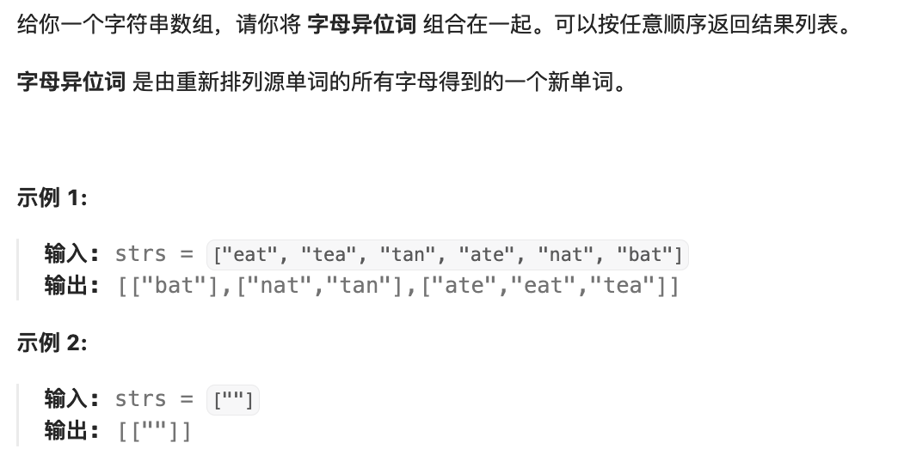
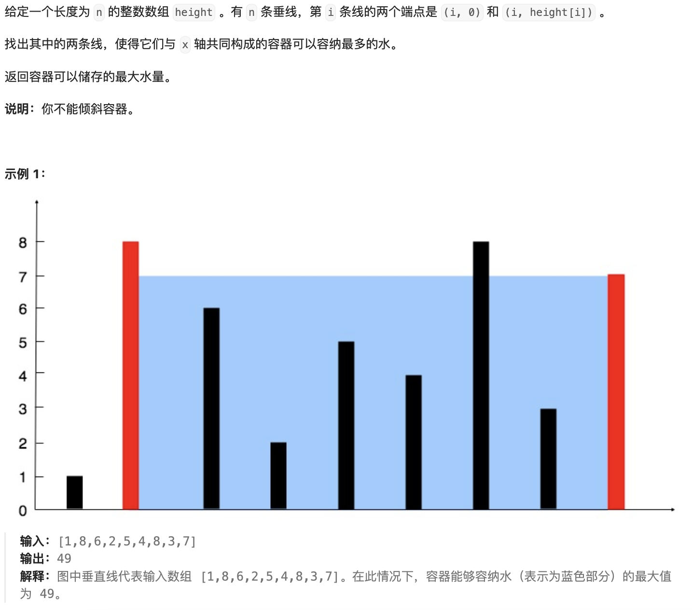
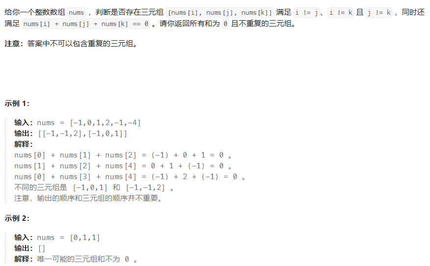
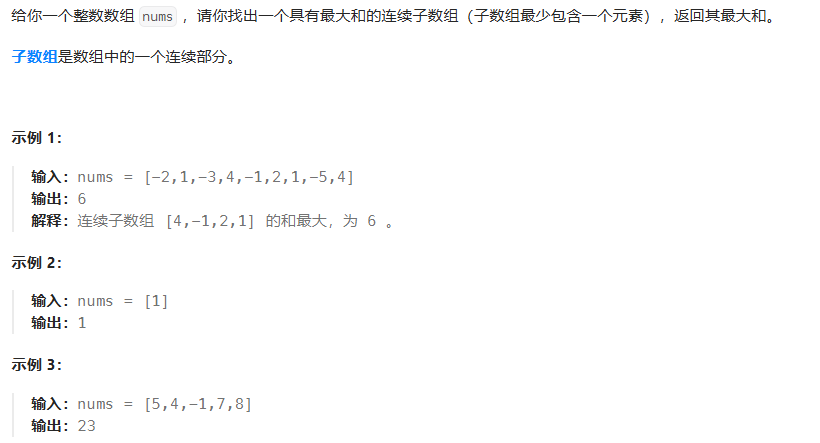
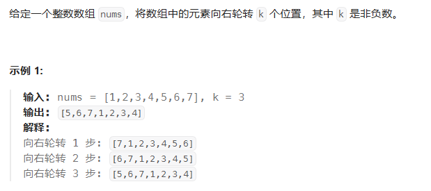
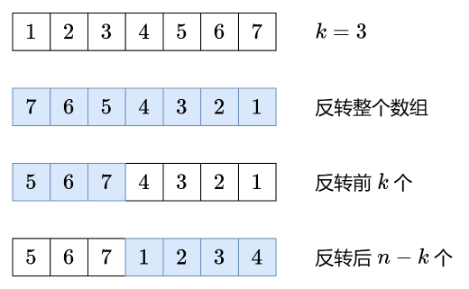
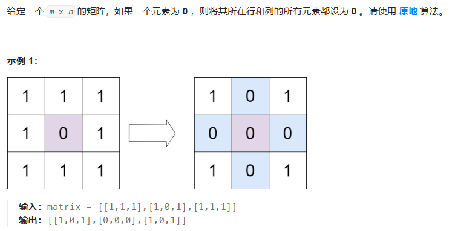
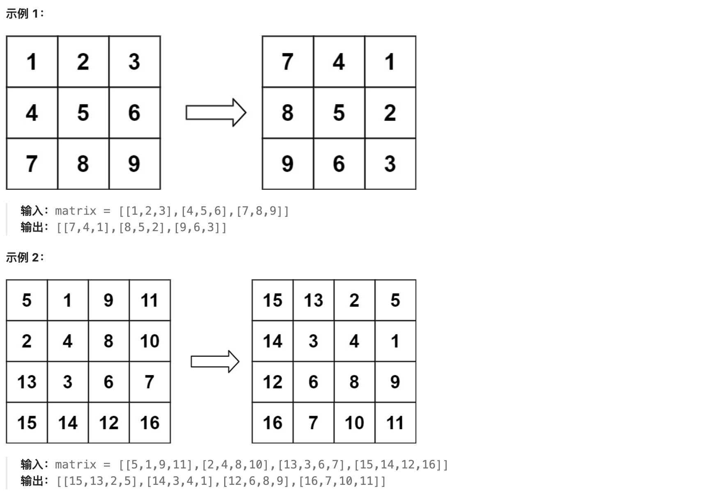
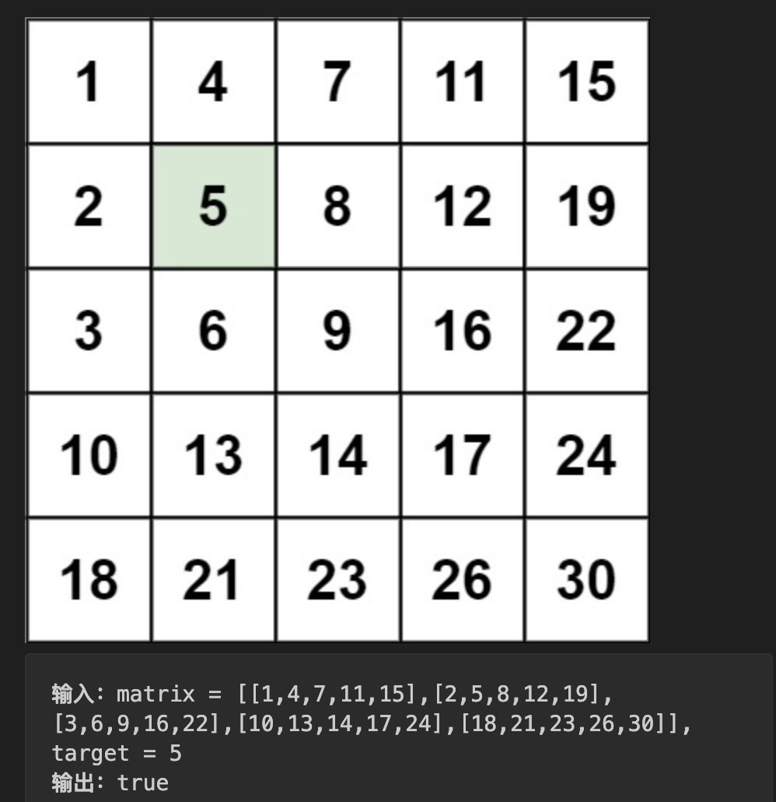

## 哈希

### 1. [两数之和](https://leetcode.cn/problems/two-sum/description/)

题目：

给定一个整数数组 nums 和一个整数目标值 target，请你在该数组中找出 和为目标值 target 的那 两个 整数，并返回它们的数组下标。

你可以假设每种输入只会对应一个答案。但是，数组中同一个元素在答案里不能重复出现。

你可以按任意顺序返回答案。

```
输入：nums = [2,7,11,15], target = 9
输出：[0,1]
解释：因为 nums[0] + nums[1] == 9 ，返回 [0, 1] 。
```

代码：

```js
/**
 * @param {number[]} nums
 * @param {number} target
 * @return {number[]}
 */
var twoSum = function (nums, target) {
  const map = new Map()
  for (let i = 0; i < nums.length; i++) {
    const gap = target - nums[i]
    if (map.has(nums[i])) {
      return [map.get(nums[i]), i]
    }
    map.set(gap, i)
  }
  return []
}
```

### 49.字母异位词分组

标签：哈希表

题目：



代码：

```js
var groupAnagrams = function (strs) {
  var map = new Map()
  for (var i = 0; i < strs.length; i++) {
    var str = strs[i]
    // 排序好的字符串作为key
    var sortStr = Array.from(str).sort().join('')
    if (map.has(sortStr)) {
      map.get(sortStr).push(str)
    } else {
      map.set(sortStr, [str])
    }
  }
  // map.values()返回迭代器，需要转换为数组
  return Array.from(map.values())
}
```

### 128. [最长连续序列](https://leetcode.cn/problems/longest-consecutive-sequence/description/)

标签：哈希表、并查集

题目：


思路：

方法一：排序遍历。排序时间复杂度是O(nlogn)，不符合题目要求。

方法二：哈希表

核心思路：对于 nums 中的元素 x，以 x 为起点，不断查找下一个数 `x+1,x+2,⋯` 是否在 nums 中，并统计序列的长度。

为了做到 O(n) 的时间复杂度，需要两个关键优化：

把 nums 中的数都放入一个哈希集合（Set去重）中，这样可以 O(1) 判断数字是否在 nums 中。

如果 x−1 在哈希集合中，则不以 x 为起点。为什么？因为以 x−1 为起点计算出的序列长度，一定比以 x 为起点计算出的序列长度要长！这样可以避免大量重复计算。比如 `nums=[3,2,4,5]`，从 3 开始，我们可以找到 3,4,5 这个连续序列；而从 2 开始，我们可以找到 2,3,4,5 这个连续序列，一定比从 3 开始的序列更长。

⚠注意：遍历元素的时候，要遍历哈希集合，而不是 nums！Set 是去重后的数字。如果 `nums=[1,1,1,…,1,2,3,4,5,…]`（前一半都是 1），遍历 nums 的做法会导致每个 1 都跑一个 O(n) 的循环，总的循环次数是 O(n²)，会超时。

代码：

```js
// 方法一：排序遍历
var longestConsecutive = function (nums) {
  if (nums.length === 0) {
    return 0
  }
  // 先给数组排序
  nums.sort((a, b) => a - b)
  var count = 1
  var max = 1
  for (var i = 0; i < nums.length; i++) {
    var cur = nums[i]
    var next = nums[i + 1]
    // 相同元素跳过
    if (cur === next) {
      continue
    }
    // 下一个元素比当前元素大1，则计数器加1
    if (cur + 1 === next) {
      count += 1
    } else {
      // 重置计数器
      count = 1
    }
    // 更新最大值
    max = Math.max(count, max)
  }
  return max
}

// 方法二：哈希表
var longestConsecutive = function(nums) {
  var res = 0;
  var set = new Set(nums); // 把 nums 转成哈希集合
  for (var x of set) { // 遍历哈希集合
    if (set.has(x - 1)) {
      continue;
    }
    // x 是序列的起点
    var y = x + 1;
    while (set.has(y)) { // 不断查找下一个数是否在哈希集合中
      y++;
    }
    // 循环结束后，y-1 是最后一个在哈希集合中的数
    // 从 x 到 y-1 一共 y-x 个数
    res = Math.max(res, y - x); 
  }
  return res;
};
```

## 双指针

### 283.[移动零](https://leetcode.cn/problems/move-zeroes/description/)

标签：快慢指针

题目：


代码：

```js
// 如果数组没有0，那么快慢指针始终指向同一个位置，每个位置自己和自己交换
// 如果数组有0，快指针先走一步，此时慢指针对应的就是0，所以要交换
var moveZeroes = function (nums) {
  var slow = 0, fast = 0;
  while (fast < nums.length) {
    if (nums[fast] !== 0) {
      var tmp = nums[slow];
      nums[slow] = nums[fast];
      nums[fast] = tmp;
      slow += 1;
    }
    fast += 1;
  }
}
```

### 11.[盛最多水的容器](https://leetcode.cn/problems/container-with-most-water/description/)

标签：头尾双指针

题目：



思路：

初始化双指针分别在数组两端，每次循环数值小的一边向内移动一格，并更新最大面积，直到两个指针相遇。

代码：

```js
var maxArea = function (height) {
  var head = 0, tail = height.length - 1;
  var max = 0;
  while (head !== tail) {
    var h = Math.min(height[head], height[tail]);
    var long = tail - head;
    max = Math.max(max, h * long);

    if (height[head] < height[tail]) head += 1;
    else tail -= 1;
  }
  return max;
}
```

### 15. [三数之和](https://leetcode.cn/problems/3sum/description/)

标签：头尾双指针、排序

题目：



代码：

```js
var threeSum = function (nums) {
  // 先按升序排序
  nums.sort((a, b) => a - b);
  var res = [];
  for (var k = 0;k < nums.length - 2;k++) {
    // 如果最小的元素都大于0，直接break，后面的都大于0
    if (nums[k] > 0) break;
    // 跳过相同的元素组合
    if (k > 0 && nums[k] === nums[k - 1]) continue;
    var i = k + 1, j = nums.length - 1;
    while (i < j) {
      var sum = nums[k] + nums[i] + nums[j];
      if (sum === 0) {
        // 记录组合
        res.push([nums[k], nums[i], nums[j]]);
        // i和j向内移动，并跳过重复的值，防止记录了重复的结果
        while (i < j && nums[i] === nums[++i]);
        while (i < j && nums[j] === nums[--j]);
      } else if (sum < 0) {
        // sum小于0，说明偏小，需要i向内移动，来增大sum
        while (i < j && nums[i] === nums[++i]);
      } else {
        // sum大于0，说明偏大，需要j向内移动，来减小sum
        while (i < j && nums[j] === nums[--j]);
      }
    }
  }
  return res;
}
```

### 42.[接雨水](https://leetcode.cn/problems/trapping-rain-water/description/)

标签：头尾双指针、数组

题目：


主要思路：计算每个位置能接的水的数量，求和。每个位置能接的数量，是左边最高的柱子和右边最高的柱子中较小的那个，减去当前位置的值。

代码：

```js
// 方法一：用数组存储前缀和后缀最大值
var trap = function (height) {
  var len = height.length;
  // 计算出前缀最大值，用数组存储
  var preMax = new Array(len);
  preMax[0] = height[0];
  for (var i = 1;i < len;i++) {
    preMax[i] = Math.max(preMax[i - 1], height[i]);
  }

  // 计算后缀最大值，用数组存储
  var sufMax = new Array(len);
  sufMax[len - 1] = height[len - 1];
  for (var j = len - 2;j > -1;j--) {
    sufMax[j] = Math.max(sufMax[j + 1], height[j]);
  }

  // 每个位置能接的水的数量，为当前位置的前缀和后缀最大值的较小者，减去当前位置的值
  var res = 0;
  for (var k = 0;k < len;k++) {
    res += Math.min(preMax[k], sufMax[k]) - height[k];
  }
  return res;
}

// 方法二：用头尾双指针优化
var trap = function (height) {
  var left = 0, right = height.length - 1;
  var leftMax = 0, rightMax = 0;
  var res = 0;
  while (left < right) {
    leftMax = Math.max(leftMax, height[left]);
    rightMax = Math.max(rightMax, height[right]);
    if (leftMax < rightMax) {
      res += leftMax - height[left];
      left += 1;
    } else {
      res += rightMax - height[right];
      right -= 1;
    }
  }
  return res;
}
```

## 滑动窗口

### 3. [无重复字符的最长子串](https://leetcode.cn/problems/longest-substring-without-repeating-characters/description/)

标签：哈希表、左右指针

题目：


代码：

```js
var lengthOfLongestSubstring = function (s) {
  // map记录每个字符以及目前为止最后一次出现的位置
  var map = new Map();
  // 注意左指针从 -1 开始
  var left = -1;
  var res = 0;
  for (var right = 0;right < s.length;right++) {
    var ch = s[right];
    // 如果是重复字符，则更新左指针
    if (map.has(ch)) {
      // 更新左指针
      left = Math.max(left, map.get(ch));
    }
    // 记录当前字符以及索引
    map.set(ch, right);
    // 更新最大长度
    res = Math.max(res, right - left);
  }
  return res;
}

// 如果左指针初始化为0，则代码修改如下
var lengthOfLongestSubstring = function(s) {
  var map = new Map();
  var res = 0;
  // 初始化为0
  var left = 0;
  for (var right = 0;right < s.length;right++) {
    var ch = s[right];
    if (map.has(ch)) {
      // left更新为最后一次位置+1
      left = Math.max(left, map.get(ch) + 1);
    }
    map.set(ch, right);
    // 长度计算改变
    res = Math.max(res, right - left + 1);
  }
  return res;
}
```

### 438. [找到字符串中所有字母异位词](https://leetcode.cn/problems/find-all-anagrams-in-a-string/description/)

标签：双指针、数组、字符串、滑动窗口

题目：


思路：

假设 p 的长度是 n。

定长滑窗：枚举 s 的所有长为 n 的子串 s′，如果 s′ 的每种字母的出现次数，和 p 的每种字母的出现次数都相同，那么 s′ 是 p 的异位词。

代码：

```js
// 代码纯享版
var findAnagrams = function (s, p) {
  var res = [];
  var arrP = new Array(26).fill(0);
  var arrS = new Array(26).fill(0);

  for (var c of p) {
    arrP[c.charCodeAt() - 'a'.charCodeAt()] += 1;
  }

  for (var right = 0;right < s.length;right++) {
    arrS[s[right].charCodeAt() - 'a'.charCodeAt()] += 1;
    var left = right - p.length + 1;
    if (left < 0) {
      continue;
    }
    if (arrP.join('') === arrS.join('')) {
      res.push(left);
    }
    arrS[s[left].charCodeAt() - 'a'.charCodeAt()] -= 1;
  }
  return res;
}

// 数组弄长一点，代码简洁一点
var findAnagrams = function(s, p) {
  var len = s.length;
  // 'z' 的 charCodeAt() 为 122，其实123就可以了，128好看点
  var arrS = new Array(128).fill(0);
  var arrP = new Array(128).fill(0);
  for (var ch of p) {
    arrP[ch.charCodeAt()] += 1;
  }
  var res = [];
  for (var right = 0; right < len; right++) {
    arrS[s[right].charCodeAt()] += 1;
    var left = right - p.length + 1;
    if (left < 0) {
      continue;
    }
    if (arrS.toString() === arrP.toString()) {
      res.push(left);
    }
    arrS[s[left].charCodeAt()] -= 1;
  }
  return res;
}
```

```js
// 详细注释版
var findAnagrams = function (s, p) {
  var res = [];
  // 统计 p 每种字母出现次数
  var arrP = new Array(26).fill(0);
  // 统计 s 长为 len(p) 的子串 s' 每种字母的出现次数
  var arrS = new Array(26).fill(0);
  for (var c of p) {
    // charCodeAt() 返回字符的 Unicode 编码值，'a' 的 charCodeAt() 为 97
    arrP[c.charCodeAt() - 'a'.charCodeAt()] += 1;
  }

  for (var right = 0; right < s.length; right++) {
    // 开始记录子串 s' 每种字母的出现次数
    // 右端点字母进入窗口
    arrS[s[right].charCodeAt() - 'a'.charCodeAt()] += 1;
    const left = right - p.length + 1;
    // 窗口长度不足 len(p)
    if (left < 0) {
      continue;
    }
    // s' 和 p 的每种字母的出现次数都相同
    if (arrP.join('') === arrS.join('')) {
      // 记录子串的起始索引位置
      res.push(left);
    }
    // 左端点字母离开窗口
    arrS[s[left].charCodeAt() - 'a'.charCodeAt()] -= 1;
  }
  return res;
};
```

## 子串

### 560. [和为 K 的子数组](https://leetcode.cn/problems/subarray-sum-equals-k/description/)

标签：哈希表、前缀和

题目：


代码：

```js
// 方法一：双重遍历，时间复杂度O(n^2)
var subarraySum = function (nums, k) {
  var count = 0;
  for (var i = 0;i < nums.length;i++) {
    var sum = 0;
    for (var j = i;j < nums.length;j++) {
      sum += nums[j];
      if (sum === k) {
        count += 1;
      }
    }
  }
  return count;
}
```

```js
// 方法二：前缀和 + 哈希表，时间复杂度O(n)
var subarraySum = function (nums, k) {
  var map = new Map();
  map.set(0, 1);
  var prefix = 0;
  var count = 0;
  for (var num of nums) {
    prefix += num;
    if (map.has(prefix - k)) {
      count += map.get(prefix - k);
    }
    if (map.has(prefix)) {
      map.set(prefix, map.get(prefix) + 1);
    } else {
      map.set(prefix, 1);
    }
  }
  return count;
}

// 使用普通对象代码会更加简洁,但效率没有map高
var subarraySum = function (nums, k) {
  var obj = { 0: 1 };
  var prefix = 0;
  var count = 0;
  for (var num of nums) {
    prefix += num;
    if (obj[prefix - k]) {
      count += obj[prefix - k];
    }
    if (obj[prefix]) {
      obj[prefix] += 1;
    } else {
      obj[prefix] = 1;
    }
  }
  return count;
}
```

### 239. [滑动窗口最大值](https://leetcode.cn/problems/sliding-window-maximum/description/)

标签：单调递减队列、数组

题目：


代码：

```js
var maxSlidingWindow = function (nums, k) {
  if (nums.length === 0 || k === 0) {
    return [];
  }
  var deque = [];
  var res = [];
  // i、j 分别表示滑动窗口的左右边界
  for (var i = 1 - k, j = 0; j < nums.length; i++, j++) {
    // 滑动窗口往右移动时，首先删除队列中不存在于窗口中的元素
    if (i > 0 && deque[0] === nums[i - 1]) {
      deque.shift();
    }

    // 保证队列的单调递减，将队列中所有小于当前元素的元素删除
    while (deque.length > 0 && deque[deque.length - 1] < nums[j]) {
      deque.pop();
    }

    // 将当前元素加入队列
    deque.push(nums[j]);
    // 当滑动窗口的宽度为 k 时，将当前窗口的最大值加入结果数组
    // deque是单调递减队列，第一个元素是最大的
    if (i >= 0) {
      res.push(deque[0]);
    }
  }
  return res;
}
```

### 76. [最小覆盖子串](https://leetcode.cn/problems/minimum-window-substring/description/)

标签：双指针、数组、字符串、滑动窗口

题目：


代码：

```js
var isCovered = function (arrS, arrT) {
  // 一定要注意是小于等于 ≤ ！
  for (var i = 'A'.charCodeAt(); i <= 'Z'.charCodeAt(); i++) {
    if (arrS[i] < arrT[i]) {
      return false;
    }
  }
  for (var j = 'a'.charCodeAt(); j <= 'z'.charCodeAt(); j++) {
    if (arrS[j] < arrT[j]) {
      return false;
    }
  }
  return true;
}

var minWindow = function (s, t) {
  var len = s.length;
  // 'z'的charCodeAt()为122，所以其实长度123就够用了
  var arrS = new Array(128).fill(0);
  var arrT = new Array(128).fill(0);
  // 记录t中每个字符的出现次数
  for (var ch of t) {
    arrT[ch.charCodeAt()] += 1;
  }

  var ansLeft = -1, ansRight = len;
  var left = 0;
  for (var right = 0; right < len; right++) {
    // 右端点字母进入窗口
    arrS[s[right].charCodeAt()] += 1;
    while (isCovered(arrS, arrT)) {
      // 如果找到更短的子串，则更新ansLeft和ansRight
      if (right - left < ansRight - ansLeft) {
        ansLeft = left;
        ansRight = right;
      }
      // 左端点字母离开窗口
      arrS[s[left].charCodeAt()] -= 1;
      left += 1;
    }
  }
  return ansLeft < 0 ? '' : s.substring(ansLeft, ansRight + 1);
}
```

## 普通数组

### 53. [最大子数组和](https://leetcode.cn/problems/maximum-subarray/description/)

标签：动态规划、数组

题目：



思路：

- 动态规划的是首先对数组进行遍历，当前最大连续子序列和为 sum，结果为 ans
- 如果 sum > 0，则说明 sum 对结果有增益效果，则 sum 保留并加上当前遍历数字
- 如果 sum <= 0，则说明 sum 对结果无增益效果，需要舍弃，则 sum 直接更新为当前遍历数字
- 每次比较 sum 和 ans的大小，将最大值置为ans，遍历结束返回结果

代码：

```js
var maxSubArray = function (nums) {
  var res = nums[0];
  // sum 表示当前最大的子数组之和
  var sum = 0;
  for (var n of nums) {
    if (sum > 0) {
      sum += n;
    } else {
      sum = n;
    }
    res = Math.max(res, sum);
  }
  return res;
}
```

### 56. [合并区间](https://leetcode.cn/problems/merge-intervals/description/)

标签：排序、数组

题目：


思路：

用数组 merged 存储最终的答案。

首先，将列表中的区间按照**左端点**升序排序。然后将第一个区间加入 merged 数组中，并按顺序依次考虑之后的每个区间：

如果当前区间的左端点在数组 merged 中最后一个区间的右端点之后，那么它们不会重合，我们可以直接将这个区间加入数组 merged 的末尾；

否则，它们重合，我们需要用当前区间的右端点更新数组 merged 中最后一个区间的右端点，将其置为二者的较大值。

代码：

```js
var merge = function (intervals) {
  intervals.sort((a, b) => a[0] - b[0]);
  var res = [];
  for (var p of intervals) {
    var len = res.length;
    // 若列表为空，或当前区间和上一个区间不重合，直接添加
    if (len <= 0 || p[0] > res[len - 1][1]) {
      res.push(p);
    } else {
      // 区间重合，更新 res 中最后一个区间的右端点
      res[len - 1][1] = Math.max(p[1], res[len - 1][1]);
    }
  }
  return res;
}
```

### 189. [旋转数组](https://leetcode.cn/problems/rotate-array/description/)

标签：数组、双指针

题目：



思路：

方法一：使用额外的数组。

可以使用额外的数组来将每个元素放至正确的位置。用 n 表示数组的长度，我们遍历原数组，将原数组下标为 i 的元素放至新数组下标为 `(i+k) mod n` 的位置，最后将新数组拷贝至原数组即可。

方法二：数组翻转。

该方法基于如下的事实：当我们将数组的元素向右移动 k 次后，尾部 `k mod n` 个元素会移动至数组头部，其余元素向后移动 `k mod n` 个位置。

该方法为数组的翻转：首先将所有元素翻转，这样尾部的 `k mod n` 个元素就被移至数组头部，再翻转 [0, (k mod n) − 1] 区间的元素和 [k mod n, n−1] 区间的元素即能得到最后的答案。



代码：

```js
// 方法一：使用额外的数组
var rotate = function (nums, k) {
  var len = nums.length;
  var arr = new Array(len);
  for (var i = 0; i < len; i++) {
    arr[(i + k) % len] = nums[i];
  }
  for (var j = 0; j < len; j++) {
    nums[j] = arr[j];
  }
}

// 方法二：翻转数组
var rotate = function (nums, k) {
  var reverse = function (start, end) {
    while (start <= end) {
      [nums[start], nums[end]] = [nums[end], nums[start]];
      start += 1;
      end -= 1;
    }
  }
  var len = nums.length;
  k = k % len;
  reverse(0, len - 1);
  reverse(0, k - 1);
  reverse(k, len - 1);
}
```

### 238. [除自身以外数组的乘积](https://leetcode.cn/problems/product-of-array-except-self/description/)

标签：数组、双指针

题目：


思路：

```
原数组：       [1       2       3       4]
左部分的乘积：   1       1      1*2    1*2*3
右部分的乘积： 2*3*4    3*4      4      1
结果：        1*2*3*4  1*3*4   1*2*4  1*2*3*1
```

当前位置的结果就是它左部分的乘积再乘以它右部分的乘积。因此需要进行两次遍历，第一次遍历用于求左部分的乘积，第二次遍历在求右部分的乘积的同时，再将最后的计算结果一起求出来。

代码：

```js
var productExceptSelf = function (nums) {
  var len = nums.length;
  var res = new Array(len).fill(1);
  var left = 0, right = len - 1;
  var lp = 1, rp = 1;
  while (left < len && right >= 0) {
    res[left] *= lp;
    res[right] *= rp;
    lp *= nums[left++];
    rp *= nums[right--];
  }
  return res;
}

// 使用除法的做法
var productExceptSelf = function(nums) {
  var len = nums.length;
  var product = 1;
  var zeroCount = 0;
  var zeroIndex = -1;
  for (var k = 0;k < len;k++) {
    if (nums[k] !== 0) {
      // 计算所有非零元素的乘积
      product *= nums[k];
    } else {
      zeroCount += 1;
      zeroIndex = k;
    }
  }
  
  var res = new Array(len).fill(0);
  // 有两个及以上0，结果就都是0
  if (zeroCount >= 2) {
    return res;
  }

  // 有1个0，除了0那一位，其它都是0
  if (zeroCount === 1) {
    res[zeroIndex] = product;
    return res;
  }

  // 没有0，每个位置的值就是所有元素乘积除以自身
  for (var i = 0;i < nums.length;i++) {
    res[i] = product / nums[i];
  }
  return res;
}
```

### 41. [缺失的第一个正数](https://leetcode.cn/problems/first-missing-positive/description/)

标签：哈希表、数组

题目：


思路：

方法二：

实际上，对于一个长度为 N 的数组，**其中没有出现的最小正整数只能在 `[1,N+1]` 中**。这是因为如果 `[1,N]` 都出现了，那么答案是 N+1，否则答案是 `[1,N]` 中没有出现的最小正整数。

我们对数组进行遍历，对于遍历到的数 x，如果它在 [1,N] 的范围内，那么就将数组中的第 x−1 个位置（注意：数组下标从 0 开始）打上「标记」。在遍历结束之后，如果所有的位置都被打上了标记，那么答案是 N+1，否则答案是最小的没有打上标记的位置加 1。

由于我们只在意 [1,N] 中的数，因此我们可以先对数组进行遍历，把不在 [1,N] 范围内的数修改成任意一个大于 N 的数（例如 N+1）。这样一来，数组中的所有数就都是正数了，因此我们就可以将「标记」表示为「负号」。算法的流程如下：

- 将数组中所有小于等于 0 的数修改为 N+1；

- 遍历数组中的每一个数 x，它可能已经被打了标记，因此原本对应的数为 ∣x∣，其中 ∣∣ 为绝对值符号。如果 ∣x∣∈[1,N]，那么我们给数组中的第 ∣x∣−1 个位置的数添加一个负号。注意如果它已经有负号，不需要重复添加；

- 在遍历完成之后，如果数组中的每一个数都是负数，那么答案是 N+1，否则答案是第一个正数的位置加 1。

方法三：置换

把 1 这个数放到下标为 0 的位置， 2 这个数放到下标为 1 的位置，按照这种思路整理一遍数组。然后我们再遍历一次数组，第 1 个遇到的它的值不等于下标的那个数，就是我们要找的缺失的第一个正数。


代码：

```js
// 方法一：哈希表，空间复杂度O(n)不满足要求
var firstMissingPositive = function(nums) {
  var map = new Map();
  for (var n of nums) {
    map.set(n, n);
  }
  var k = 1;
  while (true) {
    if (!map.has(k)) {
      return k;
    }
    k += 1;
  }
}

// 方法二：数组，空间复杂度O(1)
var firstMissingPositive = function(nums) {
  var len = nums.length;
  // 将数组中所有小于等于 0 的数修改为 N+1
  for (var i = 0;i < len;i++) {
    if (nums[i] <= 0) {
      nums[i] = len + 1;
    }
  }
  for (var j = 0;j < len;j++) {
    // 将 |num| - 1 位置的元素添加负号
    var num = Math.abs(nums[j]);
    if (num <= len) {
      nums[num - 1] = -Math.abs(nums[num - 1]);
    }
  }
  for (var k = 0;k < len;k++) {
    if (nums[k] > 0) {
      return k + 1;
    }
  }
  return k + 1;
}

// 方法三：置换，空间复杂度O(1)
var firstMissingPositive = function(nums) {
  var len = nums.length;
  for (var i = 0;i < len;i++) {
    // 只需要处理正整数，把x放到下标为x-1的位置
    // 注意这里不能用变量接收nums[i]，因为nums[i]的值会改变
    while(nums[i] > 0 && nums[i] <= len && nums[nums[i] - 1] !== nums[i]) {
      var temp = nums[i];
      nums[i] = nums[nums[i] - 1];
      nums[temp - 1] = temp;
    }
  }
  for (var j = 0;j < len;j++) {
    if (nums[j] !== j + 1) {
      return j + 1;
    }
  }
  return len + 1;
}
```

## 矩阵

### 73. [矩阵置零](https://leetcode.cn/problems/set-matrix-zeroes/description/)

标签：标记数组

题目：



思路：

方法一：使用标记数组，空间复杂度为 O(m+n)

用两个标记数组分别记录每一行和每一列是否有0出现。

首先遍历输入数组一次，如果某个元素为 0，那么就将该元素所在的行和列所对应标记数组的位置置为 true。最后我们再次遍历该数组，用标记数组更新原数组即可。

方法二：使用两个标记变量，空间复杂度为 O(1)

可以用矩阵的第一行和第一列代替方法一中的两个标记数组，以达到 O(1) 的额外空间。但这样会导致原数组的第一行和第一列被修改，无法记录它们是否原本包含 0。因此我们需要额外使用两个标记变量分别记录第一行和第一列是否原本包含 0。

在实际代码中，首先预处理出两个标记变量，接着使用其他行与列去处理第一行与第一列，然后反过来使用第一行与第一列去更新其他行与列，最后使用两个标记变量更新第一行与第一列即可。

代码：

```js
// 方法一：使用标记数组
var setZeroes = function(matrix) {
  // m 为行数，n 为列数
  var m = matrix.length, n = matrix[0].length;
  var row = new Array(m).fill(false);
  var col = new Array(n).fill(false);

  // 遍历矩阵，记录下0所在的行和列
  for (var i = 0;i < m;i++) {
    for (var j = 0;j < n;j++) {
      if (matrix[i][j] === 0) {
        row[i] = col[j] = true;
      }
    }
  }

  // 遍历矩阵，更新原矩阵，将0所在行和列的元素置为0
  for (var i = 0;i < m;i++) {
    for (var j = 0;j < n;j++) {
      if (row[i] || col[j]) {
        matrix[i][j] = 0;
      }
    }
  }
}

// 方法二：使用两个标记变量
var setZeroes = function(matrix) {
  var m = matrix.length, n = matrix[0].length;
  var rowFlag = false, colFlag = false;

  // 记录第一行和第一列是否原本包含 0
  for (var j = 0;j < n;j++) {
    if (matrix[0][j] === 0) {
      rowFlag = true;
    }
  }
  for (var i = 0;i < m;i++) {
    if (matrix[i][0] === 0) {
      colFlag = true;
    }
  }

  // 从第二行第二列开始遍历，将0所在的行和列记录到第一行和第一列
  for (var i = 1;i < m;i++) {
    for (var j = 1;j < n;j++) {
      if (matrix[i][j] === 0) {
        matrix[0][j] = matrix[i][0] = 0;
      }
    }
  }

  // 再从第二行第二列开始遍历，根据第一行第一列更新矩阵元素是否为0
  for (var i = 1;i < m;i++) {
    for (var j = 1;j < n;j++) {
      if (matrix[0][j] === 0 || matrix[i][0] === 0) {
        matrix[i][j] = 0;
      }
    }
  }

  // 根据标记变量更新第一行和第一列
  if (rowFlag) {
    for (var j = 0;j < n;j++) {
      matrix[0][j] = 0;
    }
  }
  if (colFlag) {
    for (var i = 0;i < m;i++) {
      matrix[i][0] = 0;
    }
  }
}
```

### 54. [螺旋矩阵](https://leetcode.cn/problems/spiral-matrix/description/)

标签：矩阵，四指针

题目：

给你一个 m 行 n 列的矩阵 matrix ，请按照 顺时针螺旋顺序 ，返回矩阵中的所有元素。


思路：

- 从左到右，顶部一层遍历完往下移一位，top++；
- 从上到下，遍历完右侧往左移一位，right--；
- 从右到左，判断top <= bottom，即是否上下都走完了。遍历完底部上移，bottom--；
- 从下到上，判断left <= right，遍历完左侧右移，left++；

代码：

```js
var spiralOrder = function(matrix) {
  if (!matrix.length || !matrix[0].length) return [];
  var rows = matrix.length, cols = matrix[0].length;
  var left = 0, right = cols - 1, top = 0, bottom = rows - 1;
  var res = [];
  while (left <= right && top <= bottom) {
    for (var i = left;i <= right;i++) {
      res.push(matrix[top][i]);
    }
    top += 1;
    for (var i = top;i <= bottom;i++) {
      res.push(matrix[i][right]);
    }
    right -= 1;
    if (top <= bottom) {
      for (var i = right;i >= left;i--) {
        res.push(matrix[bottom][i]);
      }
    }
    bottom -= 1;
    if (left <= right) {
      for (var i = bottom;i >= top;i--) {
        res.push(matrix[i][left]);
      }
    }
    left += 1;
  }
  return res;
}
```

### 48. [旋转图像](https://leetcode.cn/problems/rotate-image/description/)

标签：矩阵、四指针

题目：

给定一个 n × n 的二维矩阵 matrix 表示一个图像。请你将图像顺时针旋转 90 度。

你必须在 原地 旋转图像，这意味着你需要直接修改输入的二维矩阵。请不要 使用另一个矩阵来旋转图像。



思路：

**方法一：辅助矩阵，时间复杂度为 O(n^2)，空间复杂度为 O(n^2)。**

矩阵顺时针旋转 90º 后，可找到以下规律：

- 「第i行」元素旋转到「第n−1−i列」元素；
- 「第j列」元素旋转到「第j行」元素；

对于矩阵任意第i行、第j列元素matrix[i][j]，矩阵旋转 90º 后「元素位置旋转公式」为：

`matrix[i][j] -> matrix[j][n - 1 - i]`，原索引位置和旋转后的索引位置。

因此，可以创建一个辅助矩阵，将旋转后的元素赋给辅助矩阵，最后将辅助矩阵赋给原矩阵。

**方法二：原地修改，时间复杂度为 O(n^2)，空间复杂度为 O(1)。**

方法一不满足题目要求的原地修改要求。

类似 54-螺旋矩阵，利用四个指针螺旋遍历，交换元素。先交换最外层一圈，接着逐步交换内圈，依次类推。


代码：

```js
// 方法一：辅助矩阵
var rotate = function(matrix) {
  var n = matrix.length;
  // 注意不能写成 clone = new Array(n).fill(new Array(n))
  // 这样写实际上clone每一行都是同一个数组的引用！
  var clone = new Array(n);
  for (var i = 0;i < n;i++) {
    clone[i] = new Array(n);
    for (var j = 0;j < n;j++) {
      clone[i][j] = matrix[i][j];
    }
  }
  for (var i = 0;i < n;i++) {
    for (var j = 0;j < n;j++) {
      matrix[j][n - 1 - i] = clone[i][j];
    }
  }
}

// 方法二：原地修改
var rotate = function(matrix) {
  var n = matrix.length;
  var left = 0, right = n - 1, top = 0, bottom = n - 1;
  while (left <= right && top <= bottom) {
    // 每次处理一圈 ， i代表从角开始第几个元素，从0开始
    for (var i = 0;i < right - left;i++) {
      // 暂存左上角元素
      var temp = matrix[top][left + i];
      // 左下角元素赋给左上角
      matrix[top][left + i] = matrix[bottom - i][left];
      // 右上角元素赋给左下角
      matrix[bottom - i][left] = matrix[bottom][right - i];
      // 右上角元素赋给右上角
      matrix[bottom][right - i] = matrix[top + i][right];
      // 最后将暂存的左上角元素赋给右上角
      matrix[top + i][right] = temp;
    }
    left += 1;
    right -= 1;
    top += 1;
    bottom -= 1;
  }
}
```

### 240. [搜索旋转排序数组 II](https://leetcode.cn/problems/search-in-rotated-sorted-array-ii/description/)

标签：二分查找、矩阵

题目：

编写一个高效的算法来搜索 `m x n` 矩阵 `matrix` 中的一个目标值 `target` 。该矩阵具有以下特性：

- 每行的元素从左到右升序排列。
- 每列的元素从上到下升序排列。



思路：

方法一：暴力枚举，时间复杂度为 O(m * n)，会超时。

方法二：二分查找，时间复杂度为 O(mlogn)。也会超时。

方法三：贪心查找。时间复杂度为 O(m + n)。

从矩阵右上角开始查找，如果元素等于目标值，则返回 true；如果元素大于目标值，则向左移动一列；如果元素小于目标值，则向下移动一行。充分利用矩阵的有序性。

代码：

```js
// 方法二：二分查找
var searchMatrix = function(matrix, target) {
  for (var row of matrix) {
    var searchRes = search(row, target);
    if (searchRes >= 0) {
      return true;
    }
  }
  return false;
}

var search = function(nums, target) {
  var left = 0, right = nums.length - 1;
  while (left <= right) {
    var mid = Math.floor((left + right) / 2);
    if (nums[mid] === target) {
      return mid;
    }
    if (nums[mid] < target) {
      left = mid + 1;
    } else {
      right = mid - 1;
    }
  }
  return -1;
}

// 方法三：贪心查找
var searchMatrix = function(matrix, target) {
  var m = matrix.length, n = matrix[0].length;
  var x = 0, y = n - 1;
  while (x < m && y >= 0) {
    if (matrix[x][y] === target) {
      return true;
    }
    if (matrix[x][y] < target) {
      x += 1;
    } else {
      y -= 1;
    }
  }
  return false;
}
```