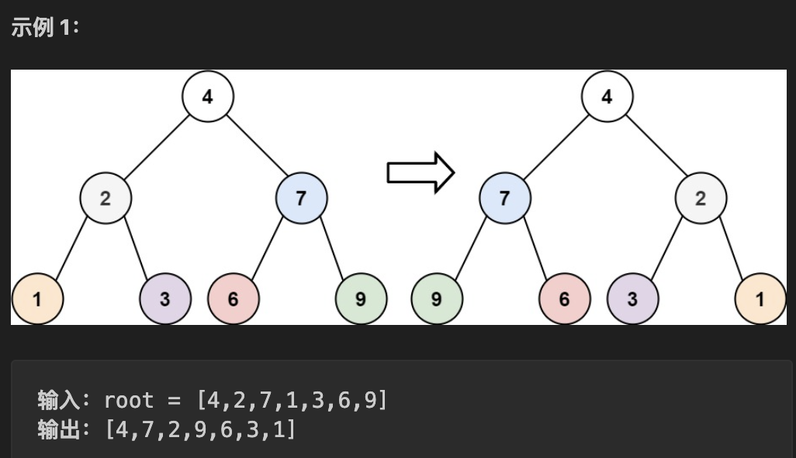
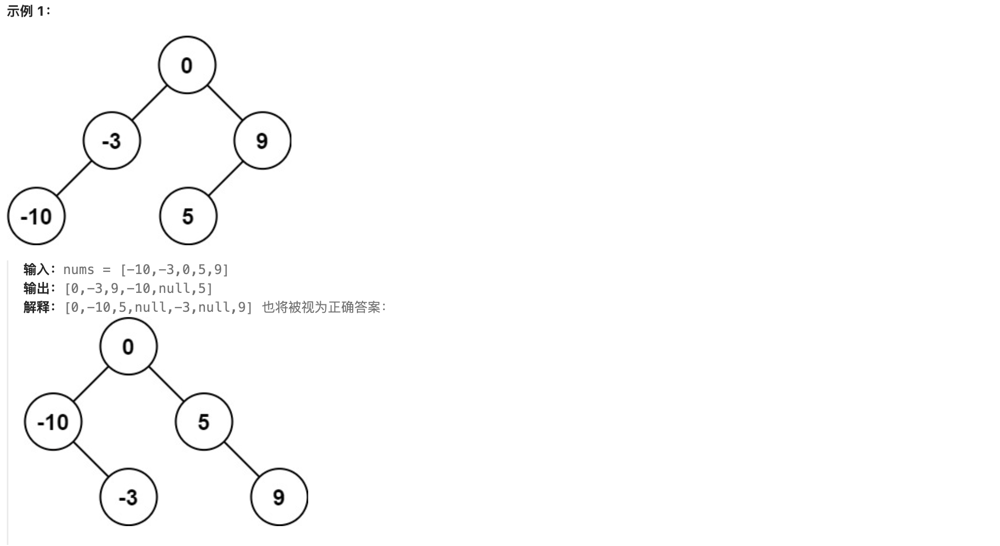
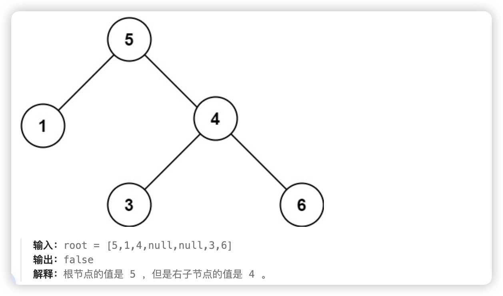
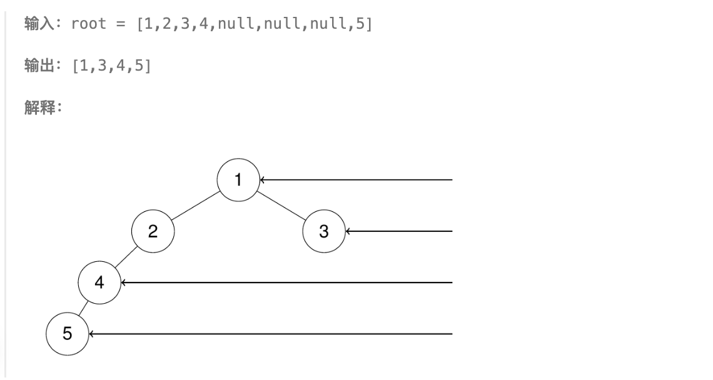
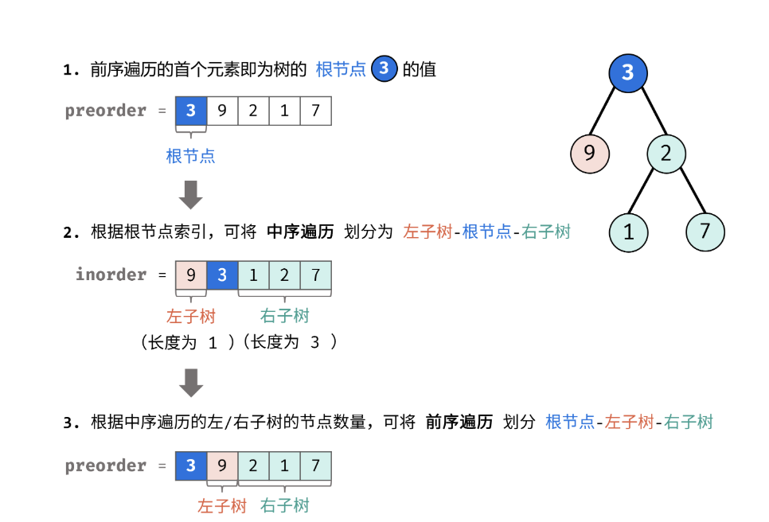
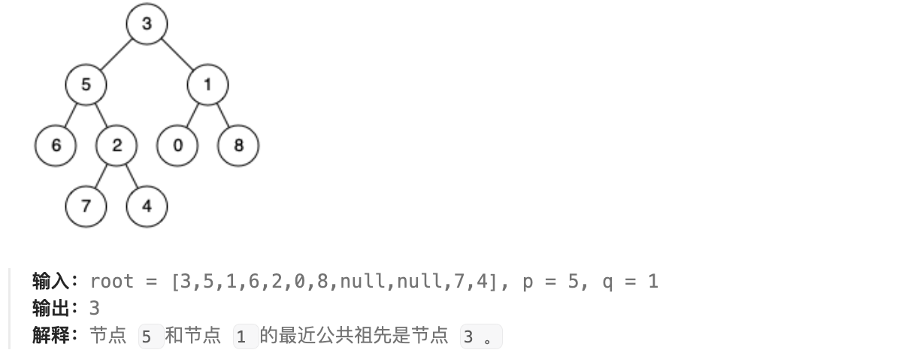
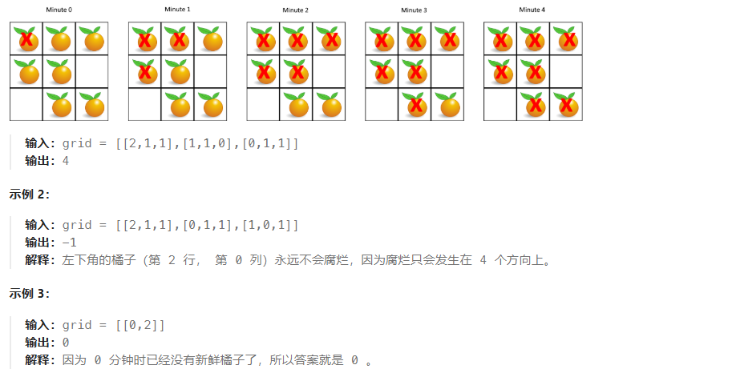
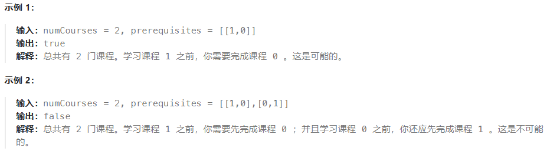

## 二叉树

### 94.[二叉树的中序遍历](https://leetcode.cn/problems/binary-tree-inorder-traversal/description/)

标签：深度优先搜索、递归

题目：


代码：

```js
// 方法一：递归
var inorderTraversal = function (root) {
  var res = []
  inorder(root, res)
  return res
}

var inorder = function (root, res) {
  if (!root) {
    return
  }
  inorder(root.left, res)
  res.push(root.val)
  inorder(root.right, res)
}

// 方法二：迭代
var inorderTraversal = function (root) {
  var res = [];
  var stack = [];
  while(root || stack.length) {
    while(root) {
      stack.push(root);
      root = root.left;
    }
    root = stack.pop();
    res.push(root.val);
    root = root.right;
  }
  return res;
}
```

### 104.[二叉树的最大深度](https://leetcode.cn/problems/maximum-depth-of-binary-tree/description/)

标签：深度优先搜索、递归、广度优先搜索、队列

题目：

给定一个二叉树 root，返回其最大深度。

二叉树的 最大深度 是指从根节点到最远叶子节点的最长路径上的节点数。


思路：

方法一：深度优先搜索（递归）

二叉数的最大深度，等于其左子树的最大深度和右子树的最大深度中的较大值，加 1。

时间复杂度 O(n)，空间复杂度 O(n)，最差情况下（当树退化为链表时），递归深度可达到 n。

方法二：广度优先搜索（队列）

树的层序遍历 / 广度优先搜索往往利用 队列 实现。

关键点： 每遍历一层，则计数器 +1 ，直到遍历完成，则可得到树的深度。

用一个临时数组 temp 存储下一层的节点，遍历完当层之后，把 temp 赋值给 queue。

时间复杂度 O(n)，空间复杂度 O(n)， 最差情况下（当树平衡时），队列 queue 同时存储 N/2 个节点。

代码：

```js
// 方法一：深度优先搜索
var maxDepth = function (root) {
  if (!root) return 0;
  return Math.max(maxDepth(root.left), maxDepth(root.right)) + 1;
}

var maxDepth = function (root) {
  if (!root) return 0;
  var left = maxDepth(root.left);
  var right = maxDepth(root.right);
  return Math.max(left, right) + 1;
}

// 方法二：广度优先搜索
var maxDepth = function (root) {
  if (!root) return 0;
  var res = 0;
  var queue = [root];
  while (queue.length) {
    var temp = [];
    // 遍历当前层的节点
    for (var node of queue) {
      // 将当前节点的左右子节点加入临时数组
      if (node.left) temp.push(node.left);
      if (node.right) temp.push(node.right);
    }
    res += 1;
    queue = temp;
  }
  return res;
}
```

### 226.[翻转二叉树](https://leetcode.cn/problems/invert-binary-tree/description/)

标签：递归、深度优先搜索、广度优先搜索、队列

题目：

给你一棵二叉树的根节点 root ，翻转这棵二叉树，并返回其根节点。



思路：

方法一：深度优先搜索（递归）

翻转二叉数，相当于先翻转左右子树，再交换左右子节点。时间复杂度 O(n)，空间复杂度 O(n)，最差情况下（当二叉树退化为链表），递归时系统需使用 O(N) 大小的栈空间。

方法二：广度优先搜索（队列）

利用队列，遍历所有节点，并交换每个节点的左右子节点。

代码：

```js
// 方法一：深度优先搜索（递归）
var invertTree = function (root) {
  if (!root) return null;
  var left = invertTree(root.left);
  var right = invertTree(root.right);
  root.left = right;
  root.right = left;
  return root;
}

// 方法二：广度优先搜索（队列）
var invertTree = function (root) {
  if (!root) return null;
  var deque = [root];
  while (deque.length) {
    var node = deque.pop();
    if (node.left) deque.push(node.left);
    if (node.right) deque.push(node.right);
    // 交换左右子节点
    [node.left, node.right] = [node.right, node.left];
  }
  return root;
}
```

### 101.[对称二叉树](https://leetcode.cn/problems/symmetric-tree/description/)

标签：递归、深度优先搜索、广度优先搜索、队列

题目：

给你一个二叉树的根节点 root ， 检查它是否轴对称。


思路：

方法一：深度优先搜索（递归）

如果一个树的左子树与右子树镜像对称，那么这个树是对称的。因此问题转化为：如何判断左子树和右子树是对称的？应该满足以下条件：

- 它们的两个根结点具有相同的值。

- 每个树的右子树都与另一个树的左子树镜像对称。

方法二：广度优先搜索（队列）

初始化时我们把根节点入队两次。

每次提取两个结点并比较它们的值（队列中每两个连续的结点应该是相等的，而且它们的子树互为镜像），然后将两个结点的左右子结点按相反的顺序插入队列中。

当队列为空时，或者我们检测到树不对称（即从队列中取出两个不相等的连续结点）时，该算法结束。

代码：

```js
// 方法一：递归
var isSymmetric = function(root) {
  return !root || check(root.left, root.right);
}

var check = function(p, q) {
  // 左右子节点都是空的，是对称
  if (!p && !q) return true;
  // 只有一边空的，或者值不相同，不是对称
  if (!p || !q || p.val !== q.val) return false;
  return check(p.left, q.right) && check(p.right, q.left);
}

// 方法二：队列
var isSymmetric = function(root) {
  return check(root, root);
}
var check = function(p, q) {
  var queue = [p, q];
  while (queue.length) {
    var n1 = queue.shift();
    var n2 = queue.shift();
    if (!n1 && !n2) continue;
    if (!n1 || !n2 || n1.val !== n2.val) return false;
    queue.push(n1.left, n2.right);
    queue.push(n1.right, n2.left);
  }
  return true;
}
```

### 543.[二叉树的直径](https://leetcode.cn/problems/diameter-of-binary-tree/description/)

标签：递归

题目：

给你一棵二叉树的根节点，返回该树的 直径 。

二叉树的 直径 是指树中任意两个节点之间最长路径的 长度 。这条路径可能经过也可能不经过根节点 root 。

两节点之间路径的 长度 由它们之间边数表示。

树中节点数目在范围 [1, 10的四次方] 内


思路：

路径的长度，等于经过的节点数减一。因此，求直径，就是求所有路径经过的最大节点数减一。

任意一条路径均可以被看作由某个节点为起点，从其左儿子和右儿子向下遍历的路径拼接得到。也就是左子树和右子树的深度加一。

代码：

```js
var diameterOfBinaryTree = function (root) {
  var count = 1;
  // 求当前节点为根节点的树，的最大深度
  var depth = function(node) {
    if (!node) return 0;
    var left = depth(node.left);
    var right = depth(node.right);
    // 左子树和右子树的深度加一
    count = Math.max(count, left + right + 1);
    return Math.max(left, right) + 1;
  }
  depth(root);
  return count - 1;
}
```

### 102.[二叉树的层序遍历](https://leetcode.cn/problems/binary-tree-level-order-traversal/description/)

标签：广度优先搜索、队列

题目：

给你二叉树的根节点 root，返回其节点值的层序遍历。（即逐层地，从左到右访问所有节点）。


注意：这题要求的返回值类型是 `number[][]`，即每一层的节点值要用一个数组存起来。

代码：

```js
var levelOrder = function (root) {
  if (!root) return [];
  var res = [];
  var queue = [root];
  while (queue.length) {
    // 存储下一层节点
    var nextLevel = [];
    // 存储这一层节点
    var curLevel = [];
    for (var node of queue) {
      curLevel.push(node.val);
      if (node.left) nextLevel.push(node.left);
      if (node.right) nextLevel.push(node.right);
    }
    res.push(curLevel);
    queue = nextLevel;
  }
  return res;
}
```

### 108.[将有序数组转换为二叉搜索树](https://leetcode.cn/problems/convert-sorted-array-to-binary-search-tree/description/)

标签：二叉搜索树、数组、递归

题目：

给你一个整数数组 nums，其中元素已经按 升序 排列，请你将其转换为一棵 平衡 二叉搜索树。

平衡二叉树，是指该树所有节点的左右子树的高度相差不超过 1。



思路：

BST 的中序遍历是升序的，因此本题等同于根据中序遍历的序列恢复二叉搜索树。

因此我们可以以升序序列中的任一个元素作为根节点，以该元素左边的升序序列构建左子树，以该元素右边的升序序列构建右子树，这样得到的树就是一棵二叉搜索树。

又因为本题要求高度平衡，因此我们需要选择**升序序列的中间元素**作为根节点。如果序列长度为奇数，刚好有中间元素，如果序列长度为偶数，方便起见就选择左边元素为中间元素。

代码：

```js
var sortedArrayToBST = function (nums) {
  return helper(nums, 0, nums.length - 1);
}
var helper = function (nums, left, right) {
  if (left > right) {
    return null;
  }
  var mid = Math.floor((left + right) / 2);
  // 创建根节点
  var root = new TreeNode(nums[mid]);
  // 以根元素左边的升序序列构建左子树
  root.left = helper(nums, left, mid - 1);
  // 以根元素右边的升序序列构建右子树
  root.right = helper(nums, mid + 1, right);
  return root;
}
```

### 98.[验证二叉搜索树](https://leetcode.cn/problems/validate-binary-search-tree/description/)

标签：二叉搜索树

题目：

给你一个二叉树的根节点 root ，判断其是否是一个有效的二叉搜索树。有效二叉搜索树定义如下：

- 节点的左子树只包含 小于 当前节点的数。

- 节点的右子树只包含 大于 当前节点的数。

- 所有左子树和右子树自身必须也是二叉搜索树。



思路：

#### 方法一

二叉搜索树的中序遍历结果（左-根-右）是升序的序列，因此可以先保存中序遍历的结果，然后遍历数组，判断数组是否为严格升序。

#### 方法二：遍历

使用栈模拟中序遍历的过程，如果当前遍历的节点值小于上一次的节点值，则说明不是二叉搜索树。

#### 方法三：递归

设计一个递归函数 `helper(root, lower, upper)` 来递归判断，函数表示考虑以 root 为根的子树，判断子树中所有节点的值是否都在 `(l,r)` 的范围内（注意是开区间）。如果 root 节点的值 val 不在 `(l,r)` 的范围内说明不满足条件直接返回，否则我们要继续递归调用检查它的左右子树是否满足，如果都满足才说明这是一棵二叉搜索树。

根据二叉搜索树的性质，在递归调用左子树时，我们需要把上界 upper 改为 `root.val`，即调用 `helper(root.left, lower, root.val)`，因为左子树里所有节点的值均小于它的根节点的值。同理递归调用右子树时，我们需要把下界 lower 改为 `root.val`，即调用 `helper(root.right, root.val, upper)`。

函数递归调用的入口为 `helper(root, -inf, +inf)`， inf 表示一个无穷大的值。

代码：

```js
// 方法一：中序遍历，判断是否升序
var isValidBST = function (root) {
  var arr = [];
  inorder(root, arr);
  for (var i = 1; i < arr.length; i++) {
    if (arr[i] <= arr[i - 1]) {
      return false;
    }
  }
  return true;
}
var inorder = function (root, arr) {
  if (!root) return;
  inorder(root.left, arr);
  arr.push(root.val);
  inorder(root.right, arr);
}

// 方法二：遍历
var isValidBST = function (root) {
  var stack = [];
  var mini = -Infinity;
  while (stack.length || root) {
    while (root) {
      stack.push(root);
      root = root.left;
    }
    root = stack.pop();
    if (root.val <= mini) {
      return false
    }
    mini = root.val;
    root = root.right;
  }
  return true
}

// 方法三：递归
var isValidBST = function(root) {
  return helper(root, -Infinity, Infinity);
};
var helper = function(root, lower, upper) {
  if (!root) return true;
  if (root.val <= lower || root.val >= upper) return false;
  return helper(root.left, lower, root.val) && helper(root.right, root.val, upper);
}
```

### 230.[二叉搜索树中第K小的元素](https://leetcode.cn/problems/kth-smallest-element-in-a-bst/description/)

标签：二叉搜索树

题目：

给定一个二叉搜索树的根节点 root ，和一个整数 k ，请你设计一个算法查找其中第 k 小的元素（从 1 开始计数）。

思路：

二叉搜索树的中序遍历结果是升序数组。中序遍历后，第 k 小的元素就是数组中的第 k - 1 个元素。

树中的节点数为 n ，1 <= k <= n。

代码：

```js
var kthSmallest = function(root, k) {
  var arr = [];
  inorder(root, arr);
  return arr[k - 1];
};
var inorder = function(root, arr) {
  if (!root) return;
  inorder(root.left, arr);
  arr.push(root.val);
  inorder(root.right, arr);
}
```

### 199.[二叉树的右视图](https://leetcode.cn/problems/binary-tree-right-side-view/description/)

标签：二叉树、队列、递归

题目：

给定一个二叉树的根节点 root，想象自己站在它的右侧，按照从顶部到底部的顺序，返回从右侧所能看到的节点值。



思路：

方法一：层序遍历，取出每一层最后一个节点，就是右侧看到的节点。（记这个，复用层序遍历已有代码）

方法二：递归，优先扫描右叶子递归，add结果集的时候判断下该层级是不是有元素。

代码：

```js
// 方法一：层序遍历
var rightSideView = function (root) {
  if (!root) return [];
  var queue = [root];
  var res = [];
  while (queue.length) {
    var cur = [];
    var next = [];
    for (var node of queue) {
      cur.push(node.val);
      if (node.left) next.push(node.left);
      if (node.right) next.push(node.right);
    }
    res.push(cur[cur.length - 1]);
    queue = next;
  }
  return res;
}

// 方法二：递归
var rightSideView = function(root) {
  var res = [];
  var scan = function(node, level) {
    if (!node) return;
    if (res.length <= level) {
      res.push(node.val);
    }
    scan(node.right, level + 1);
    scan(node.left, level + 1);
  }
  scan(root, 0);
  return res;
};
```

### 114.[二叉树展开为链表](https://leetcode.cn/problems/flatten-binary-tree-to-linked-list/description/)

标签：二叉树、前序遍历、递归

题目：

给你二叉树的根结点root ，请你将它展开为一个单链表：

- 展开后的单链表应该同样使用 TreeNode ，其中 right 子指针指向链表中下一个结点，而左子指针始终为 null 。
- 展开后的单链表应该与二叉树 先序遍历 顺序相同。

进阶：你可以使用原地算法（O(1) 额外空间）展开这棵树吗？

思路：

#### 方法一（记这个，思路简单）

先执行前序遍历，将结果保存到数组中，接着遍历数组，将数组中的元素按要求依次连接起来。时间复杂度和空间复杂度都是O(n)。

代码：

```js
// 方法一：先前序遍历，再连接节点
var flatten = function(root) {
  var arr = [];
  preorder(root, arr);
  for (var i = 0;i < arr.length;i++) {
    arr[i].right = arr[i + 1] || null;
    arr[i].left = null;
  }
};
var preorder = function(root, arr) {
  if (!root) return;
  arr.push(root);
  preorder(root.left, arr);
  preorder(root.right, arr);
}
```

### 105.[从前序与中序遍历序列构造二叉树](https://leetcode.cn/problems/construct-binary-tree-from-preorder-and-inorder-traversal/description/)

标签：哈希表、递归

题目：

给定两个整数数组 preorder 和 inorder ，其中 preorder 是二叉树的先序遍历， inorder 是同一棵树的中序遍历，请构造二叉树并返回其根节点。


思路：

- 前序遍历的首元素 为 树的根节点 node 的值。
- 在中序遍历中搜索根节点 node 的索引 ，可将 中序遍历 划分为 `[ 左子树 | 根节点 | 右子树 ]` 。
- 根据中序遍历中的左（右）子树的节点数量，可将 前序遍历 划分为 `[ 根节点 | 左子树 | 右子树 ]` 。



通过以上三步，可确定三个节点：1.树的根节点、2.左子树根节点、3.右子树根节点。

根据分治思想，对于树的左、右子树，仍可复用以上方法划分子树的左右子树。

代码：

```js
var buildTree = function(preorder, inorder) {
  var map = new Map();
  // 存储中序遍历节点及对应的索引
  for (var i = 0;i < inorder.length;i++) {
    map.set(inorder[i], i);
  }
  
  var build = function(preLeft, preRight, midLeft, midRight) {
    if (preLeft > preRight) {
      return null;
    }
    // 前序遍历左边界是根节点
    var root = new TreeNode(preorder[preLeft]);
    // 获取根节点在中序遍历数组中的索引
    var midIndex = map.get(preorder[preLeft]);
    // 中序遍历数组，左子树的长度
    var leftLength = midIndex - midLeft;
    // 递归构建左右子树
    // 前序遍历数组中，根节点下一个值就是左子树的左边界，即左子树根节点。左子树右边界的下一个值就是右子树的左边界
    // 中序遍历数组中，根节点左右分别就是左右子树
    root.left = build(preLeft + 1, preLeft + leftLength, midLeft, midIndex - 1);
    root.right = build(preLeft + leftLength + 1, preRight, midIndex + 1, midRight);
    return root;
  }

  return build(0, preorder.length - 1, 0, inorder.length - 1);
};
```

### 437.[路径总和 III](https://leetcode.cn/problems/path-sum-iii/description/)

标签：递归、前缀和

题目：

给定一个二叉树的根节点 root ，和一个整数 targetSum ，求该二叉树里节点值之和等于 targetSum 的 路径 的数目。

路径不需要从根节点开始，也不需要在叶子节点结束，但是路径方向必须是向下的（只能从父节点到子节点）。


思路：

#### 方法一：深度优先搜索

穷举所有的可能，访问每一个节点 node，检测以 node 为起始节点且向下延深的路径有多少种。我们递归遍历每一个节点的所有可能的路径，然后将这些路径数目加起来即为返回结果。

定义 rootSum(p,val) 表示以节点 p 为起点向下且满足路径总和为 val 的路径数目。我们对二叉树上每个节点 p 求出 rootSum(p,targetSum)，然后对这些路径数目求和即为返回结果。

代码：

```js
var pathSum = function(root, targetSum) {
  if (!root) return 0;
  var res = rootSum(root, targetSum);
  res += pathSum(root.left, targetSum);
  res += pathSum(root.right, targetSum);
  return res;
}

var rootSum = function(root, targetSum) {
  if (!root) return 0;
  var res = 0;
  var val = root.val;
  if (val === targetSum) {
    res += 1;
  }
  res += rootSum(root.left, targetSum - val);
  res += rootSum(root.right, targetSum - val);
  return res;
}
```

### 236.[二叉树的最近公共祖先](https://leetcode.cn/problems/lowest-common-ancestor-of-a-binary-tree/description/)

标签：递归

题目：

给定一个二叉树, 找到该树中两个指定节点的最近公共祖先。

百度百科中最近公共祖先的定义为：“对于有根树 T 的两个节点 p、q，最近公共祖先表示为一个节点 x，满足 x 是 p、q 的祖先且 x 的深度尽可能大（一个节点也可以是它自己的祖先）。”



[思路](https://leetcode.cn/problems/lowest-common-ancestor-of-a-binary-tree/solutions/240096/236-er-cha-shu-de-zui-jin-gong-gong-zu-xian-hou-xu/?envType=study-plan-v2&envId=top-100-liked)：

若 root 是 p,q 的 最近公共祖先 ，则只可能为以下情况之一：

- p 和 q 在 root 的子树中，且分列 root 的 异侧（即分别在左、右子树中）;
- p=root ，且 q 在 root 的左或右子树中；
- q=root ，且 p 在 root 的左或右子树中；

递归解析：

终止条件：

- 当越过叶节点，则直接返回 null ；
- 当 root 等于 p,q ，则直接返回 root ；

递推工作：

- 开启递归左子节点，返回值记为 left ；
- 开启递归右子节点，返回值记为 right ；

返回值： 根据 left 和 right ，可展开为四种情况；

- 当 left 和 right 同时为空 ：说明 root 的左 / 右子树中都不包含 p,q ，返回 null ；

- 当 left 和 right 同时不为空 ：说明 p,q 分列在 root 的 异侧 （分别在 左 / 右子树），因此 root 为最近公共祖先，返回 root ；

- 当 left 为空 ，right 不为空 ：p,q 都不在 root 的左子树中，直接返回 right 。具体可分为两种情况：

  - p,q 其中一个在 root 的 右子树 中，此时 right 指向 p（假设为 p ）；

  - p,q 两节点都在 root 的 右子树 中，此时的 right 指向 最近公共祖先节点 ；

- 当 left 不为空 ， right 为空 ：与情况 3. 同理；

```js
var lowestCommonAncestor = function(root, p, q) {
  // 只要当前根节点是p和q中的任意一个，就返回
  if (!root || root === p || root === q) {
    return root;
  }
  // 根节点不是p和q中的任意一个，就继续分别往左子树和右子树找p和q
  var left = lowestCommonAncestor(root.left, p, q);
  var right = lowestCommonAncestor(root.right, p, q);
  // p和q都没找到，那就没有
  if (!left && !right) return null;
  // 左子树没有p也没有q，就返回右子树的结果
  if (!left) return right;
  // 右子树没有p也没有q，就返回左子树的结果
  if (!right) return left;
  // 左右子树都找到p和q了，那就说明p和q分别在左右两个子树上，所以此时的最近公共祖先就是root
  return root;
}
```

### 124. [二叉树中的最大路径和](https://leetcode.cn/problems/binary-tree-maximum-path-sum/description/)

标签：递归

题目：

给你一个二叉树的根节点 root ，返回其 最大路径和 。


思路：

可以看作是，543题二叉树的直径的提高版。

代码：

```js
var maxPathSum = function(root) {
  // 最大路径和，初始化为负无穷大，因为节点可以为负数
  var res = -Infinity;
  var depth = function(node) {
    if (!node) return 0;
    // 左、右子树提供的最大路径和
    var left = depth(node.left);
    var right = depth(node.right);
    // 当前子树内部最大路径和，即左右子树最大路径和加上当前节点值
    res = Math.max(res, left + right + node.val);
    // 当前子树对外提供的最大和
    const outputMaxSum = Math.max(left, right) + node.val;
    return Math.max(outputMaxSum, 0);
  }
  depth(root);
  return res;
};
```

## 图论

### 200. [岛屿数量](https://leetcode.cn/problems/number-of-islands/description/)

标签：深度优先搜索、网格类DFS问题

题目：

给你一个由 '1'（陆地）和 '0'（水）组成的的二维网格，请你计算网格中岛屿的数量。

岛屿总是被水包围，并且每座岛屿只能由水平方向和/或竖直方向上相邻的陆地连接形成。

此外，你可以假设该网格的四条边均被水包围。


[思路-岛屿类问题的通用解法、DFS 遍历框架](https://leetcode.cn/problems/number-of-islands/solutions/211211/dao-yu-lei-wen-ti-de-tong-yong-jie-fa-dfs-bian-li-/?envType=study-plan-v2&envId=top-100-liked)：

岛屿类问题 DFS 框架代码。

```java
void dfs(int[][] grid, int r, int c) {
  // 判断网格点是否在网格矩阵内
  if (!inArea(grid, r, c)) {
      return;
  }
  // 如果这个格子不是岛屿，直接返回
  if (grid[r][c] != 1) {
      return;
  }
  grid[r][c] = 2; // 将格子标记为「已遍历过」
  
  // 访问上、下、左、右四个相邻结点
  dfs(grid, r - 1, c);
  dfs(grid, r + 1, c);
  dfs(grid, r, c - 1);
  dfs(g~rid, r, c + 1);
}

// 判断坐标 (r, c) 是否在网格中
boolean inArea(int[][] grid, int r, int c) {
  return 0 <= r && r < grid.length && 0 <= c && c < grid[0].length;
}
```

代码：

```js
var numIslands = function(grid) {
  var res = 0;
  for (var i = 0;i < grid.length;i++) {
    for (var j = 0;j < grid[0].length;j++) {
      // 注意题目给的是字符串 '1'
      if (grid[i][j] === '1') {
        // 遍历陆地
        area(grid, i, j);
        // 遍历完陆地及其相邻的所有陆地，得到岛屿数+1
        res += 1;
      }
    }
  }
  return res;
};

var area = function(grid, i, j) {
  if (!inArea(grid, i, j)) {
    return;
  }
  if (grid[i][j] !== '1') {
    return;
  }
  // 标记为已遍历
  grid[i][j] = '2';
  // 访问上、下、左、右四个相邻网格点
  area(grid, i - 1, j);
  area(grid, i + 1, j);
  area(grid, i, j - 1);
  area(grid, i, j + 1);
}

var inArea = function(grid, i, j) {
  return i >= 0 && i < grid.length && j >= 0 && j < grid[0].length;
}
```

### 994. [腐烂的橘子](https://leetcode.cn/problems/rotting-oranges/description/)

标签：广度优先搜索

题目：

在给定的 m x n 网格 grid 中，每个单元格可以有以下三个值之一：

- 值 0 代表空单元格；
- 值 1 代表新鲜橘子；
- 值 2 代表腐烂的橘子。

每分钟，腐烂的橘子 周围 4 个方向上相邻 的新鲜橘子都会腐烂。

返回 直到单元格中没有新鲜橘子为止所必须经过的最小分钟数。如果不可能，返回 -1 。



代码：

```js
var orangesRotting = function(grid) {
  // 新鲜橘子个数
  var fresh = 0;
  // 腐烂橘子的位置
  var badPosition = [];
  for (var i = 0;i < grid.length;i++) {
    for (var j =0;j < grid[0].length;j++) {
      if (grid[i][j] === 1) {
        fresh += 1;
      } else if (grid[i][j] === 2) {
        badPosition.push([i, j]);
      }
    }
  }

  var mins = 0;
  // 当还有新鲜橘子，且还有未遍历的腐烂橘子
  while (fresh && badPosition.length) {
    mins += 1;
    var curBad = badPosition;
    badPosition = [];
    // 遍历已经腐烂橘子位置
    for (var [x, y] of curBad) {
      var nearPosition = [[x - 1, y], [x + 1, y], [x, y - 1], [x, y + 1]];
      // 相邻四个方向的节点
      for (var [i, j] of nearPosition) {
        // 如果在网格内，且有新鲜橘子
        if (i >= 0 && i < grid.length && j >= 0 && j < grid[0].length && grid[i][j] === 1) {
          // 将新鲜橘子腐烂掉
          grid[i][j] = 2;
          // 新鲜橘子数量减一
          fresh -= 1;
          // 记录下腐烂橘子的位置
          badPosition.push([i, j]);
        }
      }
    }
  }
  // 如果跳出循环后还有新鲜橘子，说明这个橘子不会被腐烂掉
  return fresh ? -1 : mins;
};
```

### 207. [课程表](https://leetcode.cn/problems/course-schedule/description/)

标签：广度优先搜索BFS

题目：

你这个学期必须选修 numCourses 门课程，记为 0 到 numCourses - 1 。

在选修某些课程之前需要一些先修课程。 先修课程按数组 prerequisites 给出，其中 `prerequisites[i] = [ai, bi]` ，表示如果要学习课程 ai 则 必须 先学习课程  bi 。

例如，先修课程对 `[0, 1]` 表示：想要学习课程 0 ，你需要先完成课程 1 。

请你判断是否可能完成所有课程的学习？如果可以，返回 true ；否则，返回 false 。



[思路](https://leetcode.cn/problems/course-schedule/solutions/250377/bao-mu-shi-ti-jie-shou-ba-shou-da-tong-tuo-bu-pai-/)：

每门课程的入度为 n，说明其先修课程数量为 n。

BFS 前的准备工作：

- 每门课的入度需要被记录，我们关心入度值的变化。
- 课程之间的依赖关系也要被记录，我们关心选当前课会减小哪些课的入度。
- 因此我们需要选择合适的数据结构，去存这些数据：
- 入度数组：课号 0 到 n - 1 作为索引，通过遍历先决条件表求出对应的初始入度。
- 邻接表：用哈希表记录依赖关系（也可以用二维矩阵，但有点大）。key：课号，value：依赖这门课的后续课（数组）

怎么判断能否修完所有课？

BFS 结束时，如果仍有课的入度不为 0，无法被选，完成不了所有课。否则，能找到一种顺序把所有课上完。

或者：用一个变量 count 记录入列的顶点个数，最后判断 count 是否等于总课程数。

代码：

```js
var canFinish = function(numCourses, prerequisites) {
  // 入度数组
  var inDegree = new Array(numCourses).fill(0);
  var map = new Map();
  for (var i = 0;i < prerequisites.length;i++) {
    var after = prerequisites[i][0];
    var pre = prerequisites[i][1];
    // 求每门课的初始入度
    inDegree[after] += 1;
    // 记录每门课以及依赖于它的后修课
    if (map.has(pre)) {
      map.get(pre).push(after);
    } else {
      map.set(pre, [after]);
    }
  }

  var queue = [];
  // 入度为0的课程入列，说明可以选修了
  for (var i = 0;i < inDegree.length;i++) {
    if (inDegree[i] === 0) queue.push(i);
  }

  var count = 0;
  while(queue.length) {
    // 选修一门课
    var cur = queue.shift();
    // 已修课数目+1
    count += 1;
    var afterCourses = map.get(cur);
    // 如果这门课有后修课
    if (afterCourses && afterCourses.length) {
      for (var course of afterCourses) {
        // 后修课的入度减一
        inDegree[course] -= 1;
        // 如果入度减为零，则入列
        if (inDegree[course] === 0) {
          queue.push(course);
        }
      }
    }
  }
  // 选了的课等于总课数，返回true，否则false
  return count === numCourses;
};
```

:::danger 代码坑点
`map.get(pre).push(after);` 和 `map.set(pre, map.get(pre).push(after));` 是不一样的！

前者是直接修改 pre 键对应的数组，将 after 添加到数组末尾。

后者覆盖了 pre 键对应的数组，导致数据丢失。因为 `Array.push` 方法返回的是修改后数组的长度！而不是新数组！这段代码等价于 `map.set(pre, newLength)`，将 pre 对应的值从数组变成了数字，导致原数组被覆盖。
:::

### 208. [实现 Trie (前缀树)](https://leetcode.cn/problems/implement-trie-prefix-tree/description/)

标签：字符串、哈希表、数组

题目：

Trie（发音类似 "try"）或者说 前缀树 是一种树形数据结构，用于高效地存储和检索字符串数据集中的键。这一数据结构有相当多的应用情景，例如自动补全和拼写检查。

请你实现 Trie 类：

- Trie() 初始化前缀树对象。
- void insert(String word) 向前缀树中插入字符串 word 。
- boolean search(String word) 如果字符串 word 在前缀树中，返回 true（即，在检索之前已经插入）；否则，返回 false 。
- boolean startsWith(String prefix) 如果之前已经插入的字符串 word 的前缀之一为 prefix ，返回 true ；否则，返回 false 。


代码：

```js

var Trie = function() {
  this.arr = [];
  this.map = new Map();
};

/** 
 * @param {string} word
 * @return {void}
 */
Trie.prototype.insert = function(word) {
  this.arr.push(word);
  this.map.set(word, word);
};

/** 
 * @param {string} word
 * @return {boolean}
 */
Trie.prototype.search = function(word) {
  return this.map.get(word) || false;
};

/** 
 * @param {string} prefix
 * @return {boolean}
 */
Trie.prototype.startsWith = function(prefix) {
  return this.arr.find(item => item.startsWith(prefix)) || false;
};

/** 
 * Your Trie object will be instantiated and called as such:
 * var obj = new Trie()
 * obj.insert(word)
 * var param_2 = obj.search(word)
 * var param_3 = obj.startsWith(prefix)
 */
```
