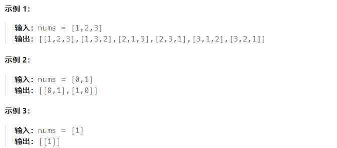
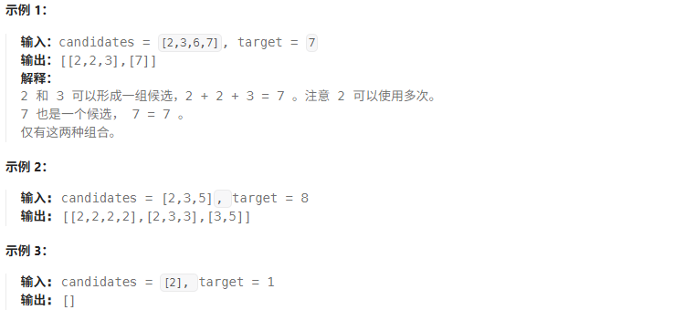

## 回溯

### 46. [全排列](https://leetcode.cn/problems/permutations/description/)

标签：递归、回溯

题目：

给定一个不含重复数字的数组 nums ，返回其所有可能的全排列。你可以按任意顺序返回答案。



代码：

```js
var permute = function(nums) {
  var res = [];
  // 记录已经使用过的数字
  var used = {};
  var dfs = function(path) {
    // 个数足够了
    if (path.length === nums.length) {
      // 拷贝一份path，加入结果数组
      res.push(path.slice());
      return;
    }
    for (var num of nums) {
      if (used[num]) continue; // 使用过，则跳过
      path.push(num);
      used[num] = true;
      dfs(path); // 基于当前选了的数，进行递归
      path.pop(); // 上一句递归结束，回溯，将最后选的数pop出来
      used[num] = false; // 恢复记录
    }
  }
  // 递归入口，传空数组
  dfs([]);
  return res;
};
```

### 78. [子集](https://leetcode.cn/problems/subsets/description/)

标签：位运算、回溯、数组

题目：

给你一个整数数组 nums ，数组中的元素 互不相同 。返回该数组所有可能的子集（幂集）。

解集 不能 包含重复的子集。你可以按 任意顺序 返回解集。

> 输入：nums = [1,2,3]
> 输出：[[],[1],[2],[1,2],[3],[1,3],[2,3],[1,2,3]]

思路：

每个子集可以用一个二进制序列表示，索引是从右到左，例如 110 表示子集 [2,3]，每个二进制序列代表一个十进制数字，因此所有的二进制序列 0 到 2的n次方-1。

代码：

```js
var subsets = function(nums) {
  var res = [];
  var n = nums.length;
  // 遍历所有二进制序列，1 << n 表示 2的n次方
  // 2的n次方还可以写为 2 ** n，Math.pow(2, n)
  for (var mask = 0; mask < (1 << n); mask++) {
    var arr = [];
    // 检查mask的每一位
    for (var i = 0;i < n;i++) {
      // 判断mask第i位是否为1，如果第i位是1，则选中nums[i]
      // 2 ** i，Math.pow(2, i)
      if (mask & (1 << i)) {
        arr.push(nums[i]);
      }
    }
    res.push(arr);
  }
  return res;
}
```

:::tip 位运算
`1 << n` 是一个位运算表达式，表示将数字 1 的二进制表示向左移动 n 位。

<< 是左移运算符，作用是将一个数的二进制位整体向左移动指定的位数，并在右侧补 0。`1 << n` 的结果是： 1 * 2 的 n 次方。

`1 << 5` 是 1 左移 5 位，右侧补零，左移 5 位 → 100000（即 32），也就是 2的5次方。
:::

### 17. [电话号码的字母组合](https://leetcode.cn/problems/letter-combinations-of-a-phone-number/description/)

标签：回溯、哈希表、字符串

题目：


代码：

```js
var letterCombinations = function(digits) {
  var res = [];
  var n = digits.length;
  if (n === 0) return res;

  var map = new Map();
  map.set('2', ['a', 'b', 'c']);
  map.set('3', ['d', 'e', 'f']);
  map.set('4', ['g', 'h', 'i']);
  map.set('5', ['j', 'k', 'l']);
  map.set('6', ['m', 'n', 'o']);
  map.set('7', ['p', 'q', 'r', 's']);
  map.set('8', ['t', 'u', 'v']);
  map.set('9', ['w', 'x', 'y', 'z']);
  res = map.get(digits[0]);
  if (n === 1) return res;

  // 遍历剩下的数字，逐步生成所有可能的组合
  for (var i = 1; i < n; i++) {
    var temp = [];
    // 遍历当前结果数组中的每一个组合
    for (var s1 of res) {
      // 获取当前数字对应的字母列表
      var next = map.get(digits[i]);
      // 将当前组合与新数字对应的每个字母拼接，生成新的组合
      for (var s2 of next) {
        temp.push(s1 + s2);
      }
    }
    res = temp;
  }
  return res;
}
```

### 39. [组合总和](https://leetcode.cn/problems/combination-sum/description/)

标签：回溯、数组

题目：

给你一个 无重复元素 的整数数组 candidates 和一个目标整数 target ，找出 candidates 中可以使数字和为目标数 target 的 所有 不同组合 ，并以列表形式返回。你可以按 任意顺序 返回这些组合。

candidates 中的 同一个 数字可以 无限制重复被选取 。如果至少一个数字的被选数量不同，则两种组合是不同的。 

对于给定的输入，保证和为 target 的不同组合数少于 150 个。



代码：

```js
var combinationSum = function(candidates, target) {
  var state = [];
  candidates.sort((a, b) => a - b);
  var res = [];
  var start = 0;
  backtrack(state, target, candidates, start, res);
  return res;
};
var backtrack = function(state, target, choices, start, res) {
  // 子集和等于 target 时，记录解
  if (target === 0) {
    // 注意要拷贝state！否则后面state变化会影响到res的值，传的是引用
    res.push([...state]);
    return;
  }
  // 遍历所有选择
  // 剪枝二：从 start 开始遍历，避免生成重复子集
  for (var i = start;i < choices.length; i++) {
    // 剪枝一：若子集和超过 target ，则直接结束循环
    // 这是因为数组已排序，后边元素更大，子集和一定超过 target
    if (target - choices[i] < 0) {
      break;
    }
    // 做出选择，更新target、start
    state.push(choices[i]);
    // 进行下一轮选择
    backtrack(state, target - choices[i], choices, i, res);
    // 回退：撤销选择，恢复到之前的状态
    state.pop();
  }
}
```

### 22. [括号生成](https://leetcode.cn/problems/generate-parentheses/description/)

标签：递归、回溯

题目：

数字 n 代表生成括号的对数，请你设计一个函数，用于能够生成所有可能的并且 有效的 括号组合。

> 输入：n = 3
>
> 输出：["((()))","(()())","(())()","()(())","()()()"]

代码：

```js
var generateParenthesis = function(n) {
  if (n === 0) {
    return [];
  }
  var res = [];
  dfs('', n, n, res);
  return res;
};
/**
 * cur 当前递归结果
 * left 左括号可以使用的个数
 * right 右括号可以使用的个数
 */
var dfs = function(cur, left, right, res) {
  // 递归终止的时候，直接把它添加到结果集
  if (left === 0 && right === 0) {
    res.push(cur);
    return;
  }
  //  剪枝（左括号可以使用的个数严格大于右括号可以使用的个数，才剪枝)
  if (left > right) {
    return;
  }
  if (left > 0) {
    dfs(cur + '(', left - 1, right, res);
  }
  if (right > 0) {
    dfs(cur + ')', left, right - 1, res);
  }
}
```

### 79. [单词搜索](https://leetcode.cn/problems/word-search/description/)

标签：深度优先搜索、回溯

题目：

给定一个 m x n 二维字符网格 board 和一个字符串单词 word 。如果 word 存在于网格中，返回 true ；否则，返回 false 。

单词必须按照字母顺序，通过相邻的单元格内的字母构成，其中“相邻”单元格是那些水平相邻或垂直相邻的单元格。同一个单元格内的字母不允许被重复使用。


思路：

遍历二维字符网格，对每一个网格进行 DFS。按照上、右、下、左的方向进行递归，使用 或 连接，只要找到一条路径即可。

递归终止条件：行或列索引越界、当前字符与目标字符不相同，返回 false；已遍历的字符长度与目标字符串长度相等，返回 true。

访问当前字符后，需要将字符置为空，表示已访问；递归后需要还原为初始值，避免影响后续的递归。

代码：

```js
var exist = function(board, word) {
  for (var i = 0; i < board.length; i++) {
    for (var j = 0; j < board[0].length; j++) {
      if (dfs(board, word, i, j, 0)) return true;
    }
  }
  return false;
}
var dfs = function(board, word, i, j, k) {
  // 行或列索引越界、当前字符与目标字符不相同
  if (i < 0 || i >= board.length || j < 0 || j >= board[0].length || board[i][j] !== word[k]) return false;
  // 已遍历的字符长度与目标字符串长度相等
  if (k === word.length - 1) return true;
  // 访问当前字符后，需要将字符置为空，表示已访问
  board[i][j] = '';
  var res = dfs(board, word, i - 1, j, k + 1) || dfs(board, word, i + 1, j, k + 1) || dfs(board, word, i, j - 1, k + 1) || dfs(board, word, i, j + 1, k + 1);
  // 还原为初始值，避免影响后续的递归
  board[i][j] = word[k];
  return res;
}
```

### 131. [分割回文串](https://leetcode.cn/problems/palindrome-partitioning/description/)

标签：回溯、深度优先搜索

题目：

给你一个字符串 s，请你将 s 分割成一些 子串，使每个子串都是 回文串 。返回 s 所有可能的分割方案。

> 输入：s = "aab"
>
> 输出：[["a","a","b"],["aa","b"]]
>
> 输入：s = "a"
>
> 输出：[["a"]]

代码：

```js
var partition = function(s) {
  var n = s.length;
  var res = [];
  var temp = [];
  var dfs = function(i) {
    // 分割完毕
    if (i === n) {
      // 记住要拷贝一份
      res.push(temp.slice());
      return;
    }
    // 枚举子串的结束位置
    for (var j = i;j < n;j++) {
      if (helper(s, i, j)) {
        // 分割
        temp.push(s.substring(i, j + 1));
        dfs(j + 1);
        // 恢复现场
        temp.pop();
      }
    }
  }
  dfs(0);
  return res;
};
// 判断是否为回文字符串
var helper = function(s, left, right) {
  while (left < right) {
    if (s[left] !== s[right]) return false;
    left += 1;
    right -= 1;
  }
  return true;
}
```

### 51. [N 皇后](https://leetcode.cn/problems/n-queens/description/)

标签：回溯、数组

题目：

按照国际象棋的规则，皇后可以攻击与之处在同一行或同一列或同一斜线上的棋子。

n 皇后问题 研究的是如何将 n 个皇后放置在 n×n 的棋盘上，并且使皇后彼此之间不能相互攻击。

给你一个整数 n ，返回所有不同的 n 皇后问题 的解决方案。

每一种解法包含一个不同的 n 皇后问题 的棋子放置方案，该方案中 `'Q'` 和 `'.'` 分别代表了皇后和空位。


[思路](https://leetcode.cn/problems/n-queens/solutions/398929/nhuang-hou-by-leetcode-solution/?envType=study-plan-v2&envId=top-100-liked)

代码：

```js
var solveNQueens = function(n) {
  var res = [];
  // 记录每个皇后的位置，数组索引是行，元素值是列
  var queens = new Array(n).fill(-1);
  // 判断所在列是否已经有皇后
  var columns = new Set();
  // 判断所在对角线是否已经有皇后，1是左上到右下的斜线，2是右上到左下的斜线
  var diagonal1 = new Set();
  var diagonal2 = new Set();
  var row = new Array(n).fill(".");

  // 生成棋盘排列结果
  function generateBoard() {
    var board = [];
    for (var i = 0;i < n;i++) {
      row[queens[i]] = "Q";
      board.push(row.join(''));
      row[queens[i]] = ".";
    }
    return board;
  }

  function backtrack(row) {
    if (row === n) {
      var board = generateBoard();
      res.push(board);
    } else {
      for (var i = 0;i < n;i++) {
        // 如果列或者对角线已经有皇后，则跳过
        if (columns.has(i) || diagonal1.has(row - i) || diagonal2.has(row + i)) {
          continue;
        }
        queens[row] = i;
        columns.add(i);
        diagonal1.add(row - i);
        diagonal2.add(row + i);
        backtrack(row + 1);
        // 恢复现场
        columns.delete(i);
        diagonal1.delete(row - i);
        diagonal2.delete(row + i);
      }
    }
  }

  backtrack(0);
  return res;
};
```

## 二分查找

### 35.[搜索插入位置](https://leetcode.cn/problems/search-insert-position/description/)

标签：二分查找

题目：


代码：

```js
var searchInsert = function (nums, target) {
  var len = nums.length;
  if (nums[len - 1] < target) {
    return len;
  }
  var left = 0, right = len - 1;
  while (left <= right) {
    var mid = Math.floor((left + right) / 2);
    if (nums[mid] === target) {
      return mid;
    } else if (nums[mid] < target) {
      left = mid + 1;
    } else {
      right = mid - 1;
    }
  }
  return left;
}
```

### 74.[搜索二维矩阵](https://leetcode.cn/problems/search-a-2d-matrix/description/)

标签：二分查找

题目：

给你一个满足下述两条属性的 m x n 整数矩阵：

- 每行中的整数从左到右按非严格递增顺序排列。
- 每行的第一个整数大于前一行的最后一个整数。

给你一个整数 target ，如果 target 在矩阵中，返回 true ；否则，返回 false 。


思路：

方法一：遍历查找。没有利用题目给的矩阵特性。

方法二：二分查找。利用题目给的矩阵特性。

由于矩阵的每一行是递增的，且每行的第一个数大于前一行的最后一个数，如果把矩阵每一行拼在一起，我们可以得到一个递增数组。

例如示例 1，三行拼在一起得：`a=[1,3,5,7,10,11,16,20,23,30,34,60]`。

代码实现时，并不需要真的拼成一个长为 mn 的数组 a，而是将 a[i] 转换成矩阵中的行号和列号。例如示例 1，i=9 对应的 a[i]=30，由于矩阵有 n=4 列，所以 a[i] 在 `Math.floor(i/n)=2` 行，在 `i mod n=1` 列。

代码：

```js
// 方法一：遍历查找
var searchMatrix = function(matrix, target) {
  var m = matrix.length;
  var n = matrix[0].length;
  for(var i = 0;i < m;i++) {
    for (var j = 0;j < n;j++) {
      if (matrix[i][j] === target) return true;
    }
  }
  return false;
};

// 方法二：二分查找
var searchMatrix = function(matrix, target) {
  var m = matrix.length;
  var n = matrix[0].length;
  var left = 0, right = m*n - 1;

  while (left <= right) {
    var mid = Math.floor((left + right) / 2);
    // 转换成矩阵中的行号和列号
    var row = Math.floor(mid / n);
    var col = mid % n;
    var val = matrix[row][col];
    if (val === target) {
      return true;
    } else if (val < target) {
      left = mid + 1;
    } else {
      right = mid - 1;
    }
  }
  return false;
};
```

### 34.[在排序数组中查找元素的第一个和最后一个位置](https://leetcode.cn/problems/find-first-and-last-position-of-element-in-sorted-array/description/)

标签：二分查找

题目：

给你一个按照非递减顺序排列的整数数组 nums，和一个目标值 target。请你找出给定目标值在数组中的开始位置和结束位置。

如果数组中不存在目标值 target，返回 [-1, -1]。

你必须设计并实现时间复杂度为 O(log n) 的算法解决此问题。

> 输入：nums = [5,7,7,8,8,10], target = 8
>
> 输出：[3,4]
> 
> 输入：nums = [5,7,7,8,8,10], target = 6
>
> 输出：[-1,-1]

思路：

找第一个元素，就是找第一个元素的位置。

找最后一个元素，就是找第一个比目标值大的元素的位置，然后减一。

代码：

```js
var searchRange = function(nums, target) {
  var res = [-1, -1];
  var leftIndex = binarySearch(nums, target, false);
  var rightIndex = binarySearch(nums, target, true) - 1;
  // 检查索引是否符合要求，避免数组没有元素的情况
  if (leftIndex <= rightIndex && rightIndex < nums.length && nums[leftIndex] === target && nums[rightIndex] === target) {
    res = [leftIndex, rightIndex];
  }
  return res;
};
var binarySearch = function(nums, target, bound) {
  var left = 0, right = nums.length - 1;
  var res = nums.length;
  while (left <= right) {
    var mid = Math.floor((left + right) / 2);
    // 找第一个元素，值等于target的都需要移动right指针
    // 找最后一个元素，值等于target的都需要移动left指针
    if ((!bound && nums[mid] >= target) || (bound && nums[mid] > target)) {
      right = mid - 1;
      res = mid;
    } else {
      left = mid + 1;
    }
  }
  return res;
}
```

### 33.[搜索旋转排序数组](https://leetcode.cn/problems/search-in-rotated-sorted-array/description/)

标签：二分查找

题目：

整数数组 nums 按升序排列，数组中的值 互不相同 。

在传递给函数之前，nums 在预先未知的某个下标 k（0 <= k < nums.length）上进行了 旋转，使数组变为 [nums[k], nums[k+1], ..., nums[n-1], nums[0], nums[1], ..., nums[k-1]]（下标 从 0 开始 计数）。例如， [0,1,2,4,5,6,7] 在下标 3 处经旋转后可能变为 [4,5,6,7,0,1,2] 。

给你 旋转后 的数组 nums 和一个整数 target ，如果 nums 中存在这个目标值 target ，则返回它的下标，否则返回 -1 。

你必须设计一个时间复杂度为 O(log n) 的算法解决此问题。

> 输入：nums = [4,5,6,7,0,1,2], target = 0
>
> 输出：4
>
> 输入：nums = [4,5,6,7,0,1,2], target = 3
>
> 输出：-1
>
> 输入：nums = [1], target = 0
>
> 输出：-1

思路：

将数组从中间分开成左右两部分的时候，一定有一部分的数组是有序的。拿示例来看，我们从 6 这个位置分开以后数组变成了 [4, 5, 6] 和 [7, 0, 1, 2] 两个部分，其中左边 [4, 5, 6] 这个部分的数组是有序的，其他也是如此。

如果 [l, mid - 1] 是有序数组，且 target 的大小满足 `[nums[l],nums[mid])`，则我们应该将搜索范围缩小至 [l, mid - 1]，否则在 [mid + 1, r] 中寻找。

如果 [mid, r] 是有序数组，且 target 的大小满足 `(nums[mid+1],nums[r]]`，则我们应该将搜索范围缩小至 [mid + 1, r]，否则在 [l, mid - 1] 中寻找。

代码：

```js
var search = function(nums, target) {
  var len = nums.length;
  if (len === 0) return -1;
  if (len === 1) return nums[0] === target ? 0 : -1;

  var left = 0, right = len - 1;
  while (left <= right) { 
    var mid = Math.floor((left + right) / 2);
    if (nums[mid] === target) return mid;
    // 左边是有序数组
    if (nums[0] <= nums[mid]) {
      // target 在左边，注意 <= 小于等于
      if (nums[0] <= target && target < nums[mid]) {
        right = mid -1;
      } else {
        left = mid + 1;
      }
    } else {
      // 右边是有序数组，且 target 在右边
      if (nums[mid] < target && target <= nums[len - 1]) {
        left = mid + 1;
      } else {
        right = mid - 1;
      }
    }
  }
  return -1;
};
```

### 153.[寻找旋转排序数组中的最小值](https://leetcode.cn/problems/find-minimum-in-rotated-sorted-array/description/)

标签：二分查找

题目：

已知一个长度为 n 的数组，预先按照升序排列，经由 1 到 n 次 旋转 后，得到输入数组。例如，原数组 nums = [0,1,2,4,5,6,7] 在变化后可能得到：

- 若旋转 4 次，则可以得到 [4,5,6,7,0,1,2]
- 若旋转 7 次，则可以得到 [0,1,2,4,5,6,7]

注意，数组 [a[0], a[1], a[2], ..., a[n-1]] 旋转一次 的结果为数组 [a[n-1], a[0], a[1], a[2], ..., a[n-2]] 。

给你一个元素值 互不相同 的数组 nums ，它原来是一个升序排列的数组，并按上述情形进行了多次旋转。请你找出并返回数组中的 最小元素 。

你必须设计一个时间复杂度为 O(log n) 的算法解决此问题。

> 输入：nums = [3,4,5,1,2]
> 
> 输出：1
>
> 解释：原数组为 [1,2,3,4,5] ，旋转 3 次得到输入数组。

思路：

思路和第 33 题类似，将数组从中间分开成左右两部分的时候，一定有一边的数组是升序的。

以数组第一个元素作为比较基准，如果 mid 左边的数组是升序的，那么最小元素就在 mid 的右边，执行 left = mid + 1；否则 mid 右边的数组是升序的，那么最小元素只可能在 mid 的左边，执行 right = mid - 1。

每次计算 mid 完，都与第一个元素进行比较，更新最小值。

代码：

```js
var findMin = function(nums) {
  var left = 0, right = nums.length - 1;
  var res = nums[0];
  while (left <= right) {
    var mid = Math.floor((left + right) / 2);
    // 更新最小值
    res = Math.min(res, nums[mid]);
    // 左边数组是升序的，更小的值只可能在 mid 的右边
    if (nums[0] <= nums[mid]) {
      left = mid + 1;
    } else {
      right = mid - 1;
    }
  }
  return res;
};
```

## 栈

### 20.[有效的括号](https://leetcode.cn/problems/valid-parentheses/description/)

标签：栈

题目：

给定一个只包括 `'('，')'，'{'，'}'，'['，']'` 的字符串 s ，判断字符串是否有效。

有效字符串需满足：

- 左括号必须用相同类型的右括号闭合。
- 左括号必须以正确的顺序闭合。
- 每个右括号都有一个对应的相同类型的左括号。

> 输入：s = "()"
> 
> 输出：true
>
> 输入：s = "()[]{}"
> 
> 输出：true
>
> 输入：s = "(]"
> 
> 输出：false

思路：

遍历字符串，如果遇到左括号，则将左括号入栈；如果遇到右括号，则判断栈顶的左括号是否匹配，如果匹配则出栈，否则返回 false。

最后判断栈是否为空，如果为空则返回 true，否则返回 false，避免存在多余的左括号。

代码：

```js
var isValid = function(s) {
  var map = new Map([['(',')'], ['[',']'], ['{', '}']]);
  var stack = [];
  for (var str of s) {
    if (map.has(str)) {
      stack.push(str);
    } else if (map.get(stack.pop()) !== str) {
      return false;
    }
  }
  return stack.length === 0;
};
```

### 155.[最小栈](https://leetcode.cn/problems/min-stack/description/)

标签：栈

题目：

设计一个支持 `push ，pop ，top` 操作，并能在常数时间内检索到最小元素的栈。

实现 `MinStack` 类:

- `MinStack()` 初始化堆栈对象。
- `void push(int val)` 将元素val推入堆栈。
- `void pop()` 删除堆栈顶部的元素。
- `int top()` 获取堆栈顶部的元素。
- `int getMin()` 获取堆栈中的最小元素。


代码：

```js
var MinStack = function() {
  this.arr = [];
};

/** 
 * @param {number} val
 * @return {void}
 */
MinStack.prototype.push = function(val) {
  this.arr.push(val);
};

/**
 * @return {void}
 */
MinStack.prototype.pop = function() {
  this.arr.pop();
};

/**
 * @return {number}
 */
MinStack.prototype.top = function() {
  return this.arr[this.arr.length - 1];
};

/**
 * @return {number}
 */
MinStack.prototype.getMin = function() {
  return Math.min(...this.arr);
};

/** 
 * Your MinStack object will be instantiated and called as such:
 * var obj = new MinStack()
 * obj.push(val)
 * obj.pop()
 * var param_3 = obj.top()
 * var param_4 = obj.getMin()
 */
```

## 堆
