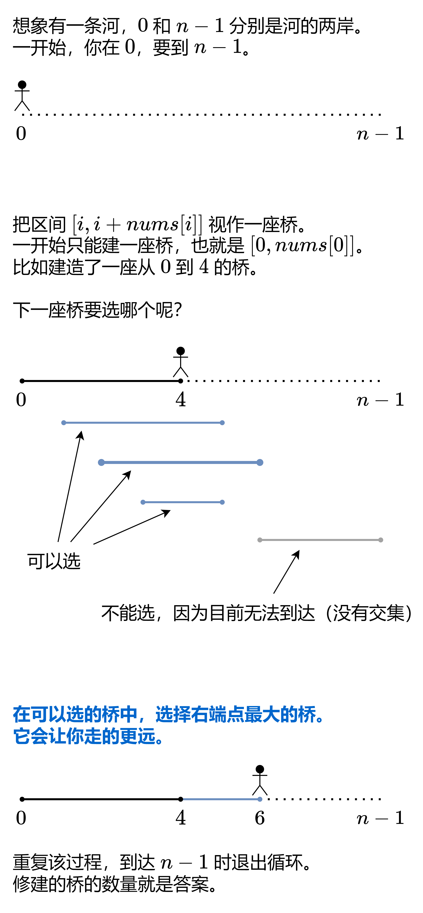
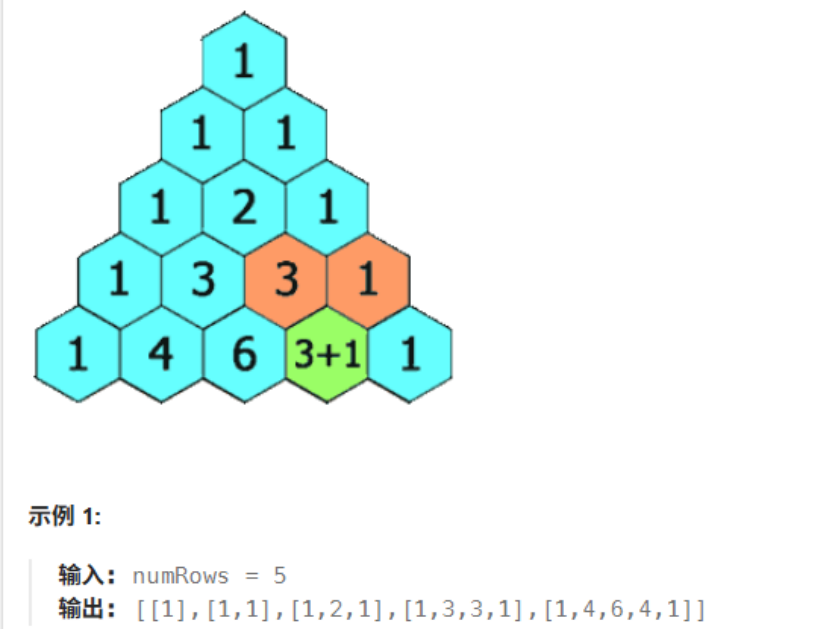

# LC T 100

## 贪心算法

### 121. [买卖股票的最佳时机](https://leetcode.cn/problems/best-time-to-buy-and-sell-stock/description/)

标签：动态规划、数组

题目：

给定一个数组 prices ，它的第 i 个元素 `prices[i]` 表示一支给定股票第 i 天的价格。

你只能选择 某一天 买入这只股票，并选择在 未来的某一个不同的日子 卖出该股票。设计一个算法来计算你所能获取的最大利润。

返回你可以从这笔交易中获取的最大利润。如果你不能获取任何利润，返回 0 。

示例：

> 输入：[7,1,5,3,6,4]
> 
> 输出：5
> 
> 解释：在第 2 天（股票价格 = 1）的时候买入，在第 5 天（股票价格 = 6）的时候卖出，最大利润 = 6-1 = 5 。注意利润不能是 7-1 = 6, 因为卖出价格需要大于买入价格；同时，你不能在买入前卖出股票。

思路：

如果第i天卖出股票，则最大利润为(该天的股价-前面天数中最小的股价)，然后与已知的最大利润比较，如果大于则更新当前最大利润的值。

因此，需要两个变量，一个记录最小股价，一个记录最大利润。

代码：

```js
var maxProfit = function(prices) {
  var minprices = Infinity;
  var res = 0;
  for (var p of prices) {
    minprices = Math.min(minprices, p);
    res = Math.max(res, p - minprices);
  }
  return res;
}
```

### 55. [跳跃游戏](https://leetcode.cn/problems/jump-game/description/)

标签：贪心算法、数组、动态规划

题目：

给你一个非负整数数组 nums ，你最初位于数组的 第一个下标 。数组中的每个元素代表你在该位置可以跳跃的最大长度。

判断你是否能够到达最后一个下标，如果可以，返回 true ；否则，返回 false 。

示例：

> 输入：nums = [2,3,1,1,4]
> 
> 输出：true
> 
> 解释：可以先跳 1 步，从下标 0 到达下标 1, 然后再从下标 1 跳 3 步到达最后一个下标。

思路：

使用一个变量记录可以跳跃的最远距离。遍历数组，如果当前位置在最远距离之内，说明这个位置可以到达，更新最远跳跃距离。否则返回 false，最后一个元素肯定是不可达的。

代码：

```js
var canJump = function(nums) {
  // 最远跳跃距离
  var maxJump = 0;
  for (var i = 0;i < nums.length;i++) {
    // 当前位置大于最远距离，说明不可达，直接返回false
    if (i > maxJump) {
      return false;
    }
    // 更新最远跳跃距离
    maxJump = Math.max(maxJump, i + nums[i]);
  }
  return true;
}
```

### 45. [跳跃游戏 II](https://leetcode.cn/problems/jump-game-ii/description/)

标签：贪心算法、数组、动态规划

题目：

给定一个长度为 n 的 0 索引整数数组 nums。初始位置为 nums[0]。

每个元素 nums[i] 表示从索引 i 向后跳转的最大长度。换句话说，如果你在 nums[i] 处，你可以跳转到任意 nums[i + j] 处:

0 <= j <= nums[i]，i + j < n

返回到达 nums[n - 1] 的最小跳跃次数。生成的测试用例可以到达 nums[n - 1]。

示例：

> 输入: nums = [2,3,1,1,4]
> 
> 输出: 2
> 
> 解释: 跳到最后一个位置的最小跳跃数是 2。从下标为 0 跳到下标为 1 的位置，跳 1 步，然后跳 3 步到达数组的最后一个位置。

思路：

方法一：

我们的目标是到达数组的最后一个位置，因此我们可以考虑最后一步跳跃前所在的位置，该位置通过跳跃能够到达最后一个位置。

如果有多个位置通过跳跃都能够到达最后一个位置，那么我们应该如何进行选择呢？直观上来看，我们可以「贪心」地选择距离最后一个位置最远的那个位置，也就是对应下标最小的那个位置。因此，我们可以从左到右遍历数组，选择第一个满足要求的位置。

找到最后一步跳跃前所在的位置之后，我们继续贪心地寻找倒数第二步跳跃前所在的位置，以此类推，直到找到数组的开始位置。

时间复杂度：O(n²)，其中 n 是数组长度。有两层嵌套循环，在最坏的情况下，例如数组中的所有元素都是 1，position 需要遍历数组中的每个位置，对于 position 的每个值都有一次循环。

方法二：



时间复杂度：O(n)，其中 n 是数组长度。

代码：

```js
// 方法一
var jump = function (nums) {
  var steps = 0;
  var position = nums.length - 1;
  while (position > 0) {
    for (var i = 0;i < position;i++) {
      if (i + nums[i] >= position) {
        position = i;
        steps += 1;
      }
    }
  }
  return steps;
}

// 方法二
var jump = function (nums) {
  var res = 0;
  // 能到达的最远距离
  var maxDistance = 0;
  // 当前这座桥的右端点
  var curRight = 0;
  // 遍历到 n - 2 就好，n-1已经是终点了
  for (var i = 0; i < nums.length - 1; i++) {
    // 更新最远距离
    maxDistance = Math.max(maxDistance, i + nums[i]);
    // 当前桥的右端点已经到达了，则要建新桥，即更新右端点为最远距离，同时次数加1
    if (i >= curRight) {
      curRight = maxDistance;
      res += 1;
    }
  }
  return res;
}
```

### 763. [划分字母区间](https://leetcode.cn/problems/partition-labels/description/)

标签：哈希表、双指针、字符串、贪心

题目：

给你一个字符串 s 。我们要把这个字符串划分为尽可能多的片段，同一字母最多出现在一个片段中。例如，字符串 "ababcc" 能够被分为 ["abab", "cc"]，但类似 ["aba", "bcc"] 或 ["ab", "ab", "cc"] 的划分是非法的。

注意，划分结果需要满足：将所有划分结果按顺序连接，得到的字符串仍然是 s 。

返回一个表示每个字符串片段的长度的列表。

示例：

> 输入：s = "ababcbacadefegdehijhklij"
> 
> 输出：[9,7,8]
> 
> 解释：划分结果为 "ababcbaca"、"defegde"、"hijhklij" 。每个字母最多出现在一个片段中。
> 
> 像 "ababcbacadefegde", "hijhklij" 这样的划分是错误的，因为划分的片段数较少。

思路：

每个字母第一个出现的下标和最后一次出现的下标，一定在同一个片段里。

- 遍历字符串，记录每个字母最后一次出现的下标。

- 初始化两个变量 start、end 为 0。从左往右遍历字符串，每次更新 end，取 end 和当前字母最后一次下标的较大者。

- 当访问到 end 位置时，当前片段就结束，长度为 end - start + 1。接着令 start = end + 1，继续下一次遍历。

- 重复上述过程直到遍历完成字符串。

代码：

```js
var partitionLabels = function(s) {
  // 记录每个字母最后出现的位置
  var map = new Map();
  for (var i = 0;i < s.length;i++) {
    map.set(s[i], i);
  }
  var start = 0, end = 0;
  var res = [];
  for (var i = 0;i < s.length;i++) {
    var lastIndex = map.get(s[i]);
    // 更新 end，取较大的字母最后位置
    end = Math.max(end, lastIndex);
    // 访问到end，当前片段结束
    if (i >= end) {
      res.push(end - start + 1);
      start = end + 1;
    }
  }
  return res;
};
```

## 动态规划

### 70. [爬楼梯](https://leetcode.cn/problems/climbing-stairs/description/)

标签：动态规划

题目：

假设你正在爬楼梯。需要 n 阶你才能到达楼顶。

每次你可以爬 1 或 2 个台阶。你有多少种不同的方法可以爬到楼顶呢？假设你正在爬楼梯。需要 n 阶你才能到达楼顶。

每次你可以爬 1 或 2 个台阶。你有多少种不同的方法可以爬到楼顶呢？

示例：

> 输入：n = 2
> 
> 输出：2
> 
> 解释：有两种方法可以爬到楼顶。1 阶 + 1 阶、2 阶

思路：

设跳上 n 级台阶有 f(n) 种跳法。在所有跳法中，最后一步只有两种情况： 跳上 1 级或 2 级台阶。

1. 当为 1 级台阶： 剩 n−1 个台阶，此情况共有 f(n−1) 种跳法。
2. 当为 2 级台阶： 剩 n−2 个台阶，此情况共有 f(n−2) 种跳法。

即 f(n) 为以上两种情况之和，即状态转移方程为：f(n)=f(n−1)+f(n−2)。并且 f(0)=1 , f(1)=1 , f(2)=2 。

时间复杂度：O(n)，若新建长度为 n 的 dp 列表，则空间复杂度：O(n)。

由于 dp 列表第 i 项只与第 i−1 和第 i−2 项有关，因此只需要初始化三个整形变量 sum, a, b ，利用辅助变量 sum 使 a,b 两数字交替前进即可 （具体实现见代码） 。由于省去了 dp 列表空间，因此空间复杂度降至 O(1) 。

代码：

```js
var climbStairs = function(n) {
  var dp = new Array(n + 1);
  dp[1] = 1;
  dp[2] = 2;
  for (var i = 3; i <= n; i++) {
    dp[i] = dp[i - 1] + dp[i - 2];
  }
  return dp[n];
}

var climbStairs = function(n) {
  var left = 1, right = 1, sum = 0;
  for(var i = 2;i <= n;i++) {
    sum = left + right;
    left = right;
    right = sum;
  }
  return right;
}
```

### 118. [杨辉三角](https://leetcode.cn/problems/pascals-triangle/description/)

标签：动态规划、数组

题目：

给定一个非负整数 numRows，生成「杨辉三角」的前 numRows 行。



思路：

把杨辉三角的每一排左对齐：

```js
[1]
[1,1]
[1,2,1]
[1,3,3,1]
[1,4,6,4,1]
```
 
设要计算的二维数组是 c，计算方法如下：

每一排的第一个数和最后一个数都是 1，即 `c[i][0]=c[i][i]=1`。
其余数字，等于左上方的数，加上正上方的数，即 `c[i][j]=c[i−1][j−1]+c[i−1][j]`。例如 4=1+3, 6=3+3 等。

代码：

```js
var generate = function(numRows) {
  var res = [];
  for (var i = 0;i < numRows;i++) {
    // 当前这行初始化数组
    var row = new Array(i + 1).fill(1);
    for (var j = 1;j < row.length - 1;j++) {
      // 计算除去头尾，中间元素的值
      row[j] = res[i - 1][j - 1] + res[i - 1][j];
    }
    res.push(row);
  }
  return res;
}
```

### 198. [打家劫舍](https://leetcode.cn/problems/house-robber/description/)

标签：动态规划、数组

题目：

你是一个专业的小偷，计划偷窃沿街的房屋。每间房内都藏有一定的现金，影响你偷窃的唯一制约因素就是相邻的房屋装有相互连通的防盗系统，如果两间相邻的房屋在同一晚上被小偷闯入，系统会自动报警。

给定一个代表每个房屋存放金额的非负整数数组，计算你 不触动警报装置的情况下 ，一夜之内能够偷窃到的最高金额。

示例：

```
输入：[2,7,9,3,1]
输出：12
解释：偷窃 1 号房屋 (金额 = 2), 偷窃 3 号房屋 (金额 = 9)，接着偷窃 5 号房屋 (金额 = 1)。
偷窃到的最高金额 = 2 + 9 + 1 = 12 。
```

思路：

只有 1 个房屋，那最高金额就是这个房屋的金额。如果有 2 个房屋，那最高金额就是两个房屋中金额较大的那个。

如果有 k(k>2) 个房屋，那么对于第 k 间房屋，有 2 种选择，选择偷窃或者不偷窃。

- 若选择偷窃第 k 间房屋，那么第 k-1 个房屋就不能偷了，最高金额就是【前 k-2 个房屋的最高金额 + 第 k 间房屋金额】。

- 若选择不偷窃第 k 间房屋，那么最高金额就是【前 k-1 个房屋最高金额】。

因此，状态转移方程如下：

`dp[i] = max(dp[i-2]+nums[i], dp[i-1])`，其中 `dp[0] = nums[0]，dp[1] = max(nums[0], nums[1])`。

时间复杂度：O(n)。

代码：

```js
var rob = function(nums) {
  var dp = [];
  // 边界条件
  dp[0] = nums[0];
  dp[1] = Math.max(nums[0], nums[1]);
  // 从3间房屋开始计算
  for (var i = 2; i < nums.length; i++) {
    dp[i] = Math.max(dp[i-2] + nums[i], dp[i-1]);
  }
  // 返回最后一个元素，即为最高金额
  return dp[nums.length - 1];
}
```

上述方法使用了数组存储结果。考虑到每间房屋的最高总金额只和该房屋的前两间房屋的最高总金额相关，因此可以使用滚动数组，在每个时刻只需要存储前两间房屋的最高总金额。空间复杂度降为 O(1)。

```js
var rob = function(nums) {
  var len = nums.length;
  // 处理特殊情况，否则会报错
  if (len === 0) return 0;
  if (len === 1) return nums[0];

  var left = nums[0];
  var right = Math.max(nums[0], nums[1]);
  var sum = 0;
  for (var i = 2; i < len; i++) {
    sum = Math.max(left + nums[i], right);
    left = right;
    right = sum;
  }
  return right;
}
```

### 279. [完全平方数](https://leetcode.cn/problems/perfect-squares/description/)

标签：动态规划、广度优先搜索

题目：

给你一个整数 n ，返回 和为 n 的完全平方数的最少数量 。

完全平方数 是一个整数，其值等于另一个整数的平方；换句话说，其值等于一个整数自乘的积。例如，1、4、9 和 16 都是完全平方数，而 3 和 11 不是。

示例：

> 输入：n = 12
> 
> 输出：3 
> 
> 解释：12 = 4 + 4 + 4

思路：

- 首先初始化长度为 n+1 的数组 dp，每个位置都为 0
- 如果 n 为 0，则结果为 0
- 对数组进行遍历，下标为 i，每次都将当前数字先更新为最大的结果，即 `dp[i]=i`，比如 i=4，最坏结果为 `4=1+1+1+1` 即为 4 个数字
- 动态转移方程为：`dp[i] = MIN(dp[i], dp[i - j * j] + 1)`，i 表示当前数字，j*j 表示平方数
- 时间复杂度：`O(n∗sqrt(n))`，sqrt 为平方根

代码：

```js
var numSquares = function(n) {
  var dp = new Array(n + 1).fill(0);
  for (var i = 1;i <= n;i++) {
    dp[i] = i;
    for (var j = 1;j * j <= i;j++) {
      dp[i] = Math.min(dp[i], dp[i - j * j] + 1);
    }
  }
  return dp[n];
}
```

### 322. [零钱兑换](https://leetcode.cn/problems/coin-change/description/)

标签：动态规划、广度优先搜索

题目：

给你一个整数数组 coins ，表示不同面额的硬币；以及一个整数 amount ，表示总金额。

计算并返回可以凑成总金额所需的 最少的硬币个数 。如果没有任何一种硬币组合能组成总金额，返回 -1 。

你可以认为每种硬币的数量是无限的。

```shell
示例 1：
输入：coins = [1, 2, 5], amount = 11
输出：3 
解释：11 = 5 + 5 + 1

示例 2：
输入：coins = [2], amount = 3
输出：-1

示例 3：
输入：coins = [1], amount = 0
输出：0
```

思路：

可以按照爬楼梯的思路来想，amount 为目标台阶，每一步只能走 coins 数组中的台阶数，dp[i] 表示到达第i级台阶所需的最小步数，那么自然可以想到 `dp[i] = min( dp[ i-coins[j] ] )+1` ，其中 `i - coins[j] >= 0` 且 `j∈[ 0, len(coins) ]`。如果 `i - coins[j] < 0` 说明走不到目标台阶i，会超出台阶i。

时间复杂度：O(Sn)，其中 S 是金额，n 是面额数。空间复杂度：O(S)。

代码：

```js
var coinChange = function(coins, amount) {
  // dp[i] 表示到达第 i 个台阶所需最小的步数，初始化为 正无穷大
  var dp = new Array(amount + 1).fill(Infinity);
  dp[0] = 0;
  for (var i = 1;i <= amount;i++) {
    for (var j = 0;j < coins.length;j++) {
      // 每次可以跳 conis[j] 步，不能超出 i 阶台阶
      if (coins[j] <= i) {
        // 跳了coins[j]步后，还剩下 i-coins[j]阶台阶，所以就是跳到台阶 i-coins[j]所需最小步数 + 1
        dp[i] = Math.min(dp[i], dp[i - coins[j]] + 1);
      }
    }
  }
  // 无法跳到目标台阶时，dp[i] 为正无穷大，因此要判断一下
  return dp[amount] > amount ? -1 : dp[amount];
}
```

### 139. [单词拆分](https://leetcode.cn/problems/word-break/description/)

标签：哈希表、动态规划

题目：

给你一个字符串 s 和一个字符串列表 wordDict 作为字典。如果可以利用字典中出现的一个或多个单词拼接出 s 则返回 true。

注意：不要求字典中出现的单词全部都使用，并且字典中的单词可以重复使用。

```shell
示例 1：
输入: s = "leetcode", wordDict = ["leet", "code"]
输出: true
解释: 返回 true 因为 "leetcode" 可以由 "leet" 和 "code" 拼接成。

示例 2：
输入: s = "applepenapple", wordDict = ["apple", "pen"]
输出: true
解释: 返回 true 因为 "applepenapple" 可以由 "apple" "pen" "apple" 拼接成。注意，你可以重复使用字典中的单词。

示例 3：
输入: s = "catsandog", wordDict = ["cats", "dog", "sand", "and", "cat"]
输出: false
```

代码：

```js
var wordBreak = function(s, wordDict) {
  var n = s.length;
  var set = new Set(wordDict);
  var dp = new Array(n + 1).fill(false);
  dp[0] = true;
  for (var i = 1;i <= n;i++) {
    for (var j = 0;j < i;j++) {
      if (dp[j] && set.has(s.substring(j, i))) {
        dp[i] = true;
        break;
      }
    }
  }
  return dp[n];
}
```

## 多维动态规划

## 技巧
