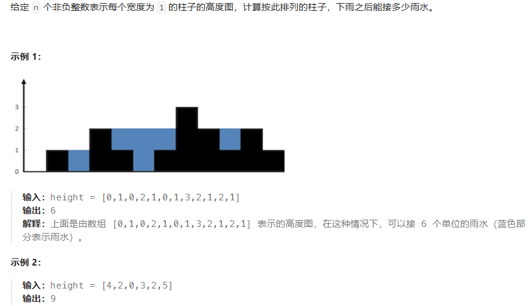
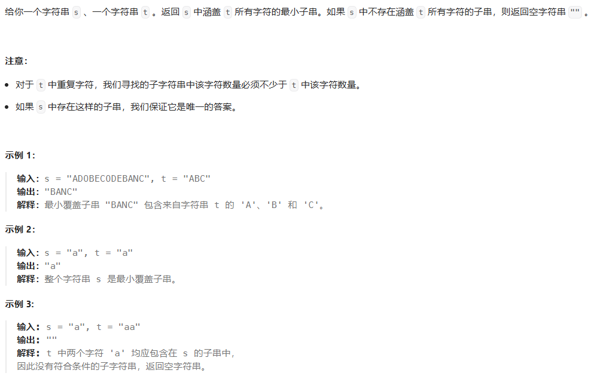

# LC T 100

## 哈希

### 1. [两数之和](https://leetcode.cn/problems/two-sum/description/)

题目：

给定一个整数数组 nums 和一个整数目标值 target，请你在该数组中找出 和为目标值 target 的那 两个 整数，并返回它们的数组下标。

你可以假设每种输入只会对应一个答案。但是，数组中同一个元素在答案里不能重复出现。

你可以按任意顺序返回答案。

```
输入：nums = [2,7,11,15], target = 9
输出：[0,1]
解释：因为 nums[0] + nums[1] == 9 ，返回 [0, 1] 。
```

代码：

```js
/**
 * @param {number[]} nums
 * @param {number} target
 * @return {number[]}
 */
var twoSum = function (nums, target) {
  const map = new Map()
  for (let i = 0; i < nums.length; i++) {
    const gap = target - nums[i]
    if (map.has(nums[i])) {
      return [map.get(nums[i]), i]
    }
    map.set(gap, i)
  }
  return []
}
```

### 49.字母异位词分组

标签：哈希表

题目：


代码：

```js
var groupAnagrams = function (strs) {
  var map = new Map()
  for (var i = 0; i < strs.length; i++) {
    var str = strs[i]
    // 排序好的字符串作为key
    var sortStr = Array.from(str).sort().join('')
    if (map.has(sortStr)) {
      map.get(sortStr).push(str)
    } else {
      map.set(sortStr, [str])
    }
  }
  // map.values()返回迭代器，需要转换为数组
  return Array.from(map.values())
}
```

### 128. [最长连续序列](https://leetcode.cn/problems/longest-consecutive-sequence/description/)

标签：哈希表、并查集

题目：


思路：

方法一：排序遍历。排序时间复杂度是O(nlogn)，不符合题目要求。

方法二：哈希表

核心思路：对于 nums 中的元素 x，以 x 为起点，不断查找下一个数 `x+1,x+2,⋯` 是否在 nums 中，并统计序列的长度。

为了做到 O(n) 的时间复杂度，需要两个关键优化：

把 nums 中的数都放入一个哈希集合（Set去重）中，这样可以 O(1) 判断数字是否在 nums 中。

如果 x−1 在哈希集合中，则不以 x 为起点。为什么？因为以 x−1 为起点计算出的序列长度，一定比以 x 为起点计算出的序列长度要长！这样可以避免大量重复计算。比如 `nums=[3,2,4,5]`，从 3 开始，我们可以找到 3,4,5 这个连续序列；而从 2 开始，我们可以找到 2,3,4,5 这个连续序列，一定比从 3 开始的序列更长。

⚠注意：遍历元素的时候，要遍历哈希集合，而不是 nums！Set 是去重后的数字。如果 `nums=[1,1,1,…,1,2,3,4,5,…]`（前一半都是 1），遍历 nums 的做法会导致每个 1 都跑一个 O(n) 的循环，总的循环次数是 O(n²)，会超时。

代码：

```js
// 方法一：排序遍历
var longestConsecutive = function (nums) {
  if (nums.length === 0) {
    return 0
  }
  // 先给数组排序
  nums.sort((a, b) => a - b)
  var count = 1
  var max = 1
  for (var i = 0; i < nums.length; i++) {
    var cur = nums[i]
    var next = nums[i + 1]
    // 相同元素跳过
    if (cur === next) {
      continue
    }
    // 下一个元素比当前元素大1，则计数器加1
    if (cur + 1 === next) {
      count += 1
    } else {
      // 重置计数器
      count = 1
    }
    // 更新最大值
    max = Math.max(count, max)
  }
  return max
}

// 方法二：哈希表
var longestConsecutive = function(nums) {
  var res = 0;
  var set = new Set(nums); // 把 nums 转成哈希集合
  for (var x of set) { // 遍历哈希集合
    if (set.has(x - 1)) {
      continue;
    }
    // x 是序列的起点
    var y = x + 1;
    while (set.has(y)) { // 不断查找下一个数是否在哈希集合中
      y++;
    }
    // 循环结束后，y-1 是最后一个在哈希集合中的数
    // 从 x 到 y-1 一共 y-x 个数
    res = Math.max(res, y - x); 
  }
  return res;
};
```

## 双指针

### 283.[移动零](https://leetcode.cn/problems/move-zeroes/description/)

标签：快慢指针

题目：


代码：

```js
// 如果数组没有0，那么快慢指针始终指向同一个位置，每个位置自己和自己交换
// 如果数组有0，快指针先走一步，此时慢指针对应的就是0，所以要交换
var moveZeroes = function (nums) {
  var slow = 0, fast = 0;
  while (fast < nums.length) {
    if (nums[fast] !== 0) {
      var tmp = nums[slow];
      nums[slow] = nums[fast];
      nums[fast] = tmp;
      slow += 1;
    }
    fast += 1;
  }
}
```

### 11.[盛最多水的容器](https://leetcode.cn/problems/container-with-most-water/description/)

标签：头尾双指针

题目：


思路：

初始化双指针分别在数组两端，每次循环数值小的一边向内移动一格，并更新最大面积，直到两个指针相遇。

代码：

```js
var maxArea = function (height) {
  var head = 0, tail = height.length - 1;
  var max = 0;
  while (head !== tail) {
    var h = Math.min(height[head], height[tail]);
    var long = tail - head;
    max = Math.max(max, h * long);

    if (height[head] < height[tail]) head += 1;
    else tail -= 1;
  }
  return max;
}
```

### 15. [三数之和](https://leetcode.cn/problems/3sum/description/)

标签：头尾双指针、排序

题目：


代码：

```js
var threeSum = function (nums) {
  // 先按升序排序
  nums.sort((a, b) => a - b);
  var res = [];
  for (var k = 0;k < nums.length - 2;k++) {
    // 如果最小的元素都大于0，直接break，后面的都大于0
    if (nums[k] > 0) break;
    // 跳过相同的元素组合
    if (k > 0 && nums[k] === nums[k - 1]) continue;
    var i = k + 1, j = nums.length - 1;
    while (i < j) {
      var sum = nums[k] + nums[i] + nums[j];
      if (sum === 0) {
        // 记录组合
        res.push([nums[k], nums[i], nums[j]]);
        // i和j向内移动，并跳过重复的值，防止记录了重复的结果
        while (i < j && nums[i] === nums[++i]);
        while (i < j && nums[j] === nums[--j]);
      } else if (sum < 0) {
        // sum小于0，说明偏小，需要i向内移动，来增大sum
        while (i < j && nums[i] === nums[++i]);
      } else {
        // sum大于0，说明偏大，需要j向内移动，来减小sum
        while (i < j && nums[j] === nums[--j]);
      }
    }
  }
  return res;
}
```

### 42.[接雨水](https://leetcode.cn/problems/trapping-rain-water/description/)

标签：头尾双指针、数组

题目：



主要思路：计算每个位置能接的水的数量，求和。每个位置能接的数量，是左边最高的柱子和右边最高的柱子中较小的那个，减去当前位置的值。

代码：

```js
// 方法一：用数组存储前缀和后缀最大值
var trap = function (height) {
  var len = height.length;
  // 计算出前缀最大值，用数组存储
  var preMax = new Array(len);
  preMax[0] = height[0];
  for (var i = 1;i < len;i++) {
    preMax[i] = Math.max(preMax[i - 1], height[i]);
  }

  // 计算后缀最大值，用数组存储
  var sufMax = new Array(len);
  sufMax[len - 1] = height[len - 1];
  for (var j = len - 2;j > -1;j--) {
    sufMax[j] = Math.max(sufMax[j + 1], height[j]);
  }

  // 每个位置能接的水的数量，为当前位置的前缀和后缀最大值的较小者，减去当前位置的值
  var res = 0;
  for (var k = 0;k < len;k++) {
    res += Math.min(preMax[k], sufMax[k]) - height[k];
  }
  return res;
}

// 方法二：用头尾双指针优化
var trap = function (height) {
  var left = 0, right = height.length - 1;
  var leftMax = 0, rightMax = 0;
  var res = 0;
  while (left < right) {
    leftMax = Math.max(leftMax, height[left]);
    rightMax = Math.max(rightMax, height[right]);
    if (leftMax < rightMax) {
      res += leftMax - height[left];
      left += 1;
    } else {
      res += rightMax - height[right];
      right -= 1;
    }
  }
  return res;
}
```

## 滑动窗口

### 3. [无重复字符的最长子串](https://leetcode.cn/problems/longest-substring-without-repeating-characters/description/)

标签：哈希表、左右指针

题目：


代码：

```js
var lengthOfLongestSubstring = function (s) {
  // map记录每个字符以及目前为止最后一次出现的位置
  var map = new Map();
  // 注意左指针从 -1 开始
  var left = -1;
  var res = 0;
  for (var right = 0;right < s.length;right++) {
    var ch = s[right];
    if (map.has(ch)) {
      // 更新左指针
      left = Math.max(left, map.get(ch));
    }
    // 记录当前字符以及索引
    map.set(ch, right);
    // 更新最大长度
    res = Math.max(res, right - left);
  }
  return res;
}
```

### 438. [找到字符串中所有字母异位词](https://leetcode.cn/problems/find-all-anagrams-in-a-string/description/)

标签：双指针、数组、字符串、滑动窗口

题目：


思路：

假设 p 的长度是 n。

定长滑窗：枚举 s 的所有长为 n 的子串 s′，如果 s′ 的每种字母的出现次数，和 p 的每种字母的出现次数都相同，那么 s′ 是 p 的异位词。

代码：

```js
// 代码纯享版
var findAnagrams = function (s, p) {
  var res = [];
  var arrP = new Array(26).fill(0);
  var arrS = new Array(26).fill(0);

  for (var c of p) {
    arrP[c.charCodeAt() - 'a'.charCodeAt()] += 1;
  }

  for (var right = 0;right < s.length;right++) {
    arrS[s[right].charCodeAt() - 'a'.charCodeAt()] += 1;
    var left = right - p.length + 1;
    if (left < 0) {
      continue;
    }
    if (arrP.join('') === arrS.join('')) {
      res.push(left);
    }
    arrS[s[left].charCodeAt() - 'a'.charCodeAt()] -= 1;
  }
  return res;
}

// 数组弄长一点，代码简洁一点
var findAnagrams = function(s, p) {
  var len = s.length;
  // 'z' 的 charCodeAt() 为 122，其实123就可以了，128好看点
  var arrS = new Array(128).fill(0);
  var arrP = new Array(128).fill(0);
  for (var ch of p) {
    arrP[ch.charCodeAt()] += 1;
  }
  var res = [];
  for (var right = 0; right < len; right++) {
    arrS[s[right].charCodeAt()] += 1;
    var left = right - p.length + 1;
    if (left < 0) {
      continue;
    }
    if (arrS.toString() === arrP.toString()) {
      res.push(left);
    }
    arrS[s[left].charCodeAt()] -= 1;
  }
  return res;
}
```

```js
// 详细注释版
var findAnagrams = function (s, p) {
  var res = [];
  // 统计 p 每种字母出现次数
  var arrP = new Array(26).fill(0);
  // 统计 s 长为 len(p) 的子串 s' 每种字母的出现次数
  var arrS = new Array(26).fill(0);
  for (var c of p) {
    // charCodeAt() 返回字符的 Unicode 编码值，'a' 的 charCodeAt() 为 97
    arrP[c.charCodeAt() - 'a'.charCodeAt()] += 1;
  }

  for (var right = 0; right < s.length; right++) {
    // 开始记录子串 s' 每种字母的出现次数
    // 右端点字母进入窗口
    arrS[s[right].charCodeAt() - 'a'.charCodeAt()] += 1;
    const left = right - p.length + 1;
    // 窗口长度不足 len(p)
    if (left < 0) {
      continue;
    }
    // s' 和 p 的每种字母的出现次数都相同
    if (arrP.join('') === arrS.join('')) {
      // 记录子串的起始索引位置
      res.push(left);
    }
    // 左端点字母离开窗口
    arrS[s[left].charCodeAt() - 'a'.charCodeAt()] -= 1;
  }
  return res;
};
```

## 子串

### 560. [和为 K 的子数组](https://leetcode.cn/problems/subarray-sum-equals-k/description/)

标签：哈希表、前缀和

题目：


代码：

```js
// 方法一：双重遍历，时间复杂度O(n^2)
var subarraySum = function (nums, k) {
  var count = 0;
  for (var i = 0;i < nums.length;i++) {
    var sum = 0;
    for (var j = i;j < nums.length;j++) {
      sum += nums[j];
      if (sum === k) {
        count += 1;
      }
    }
  }
  return count;
}
```

```js
// 方法二：前缀和 + 哈希表，时间复杂度O(n)
var subarraySum = function (nums, k) {
  var map = new Map();
  map.set(0, 1);
  var prefix = 0;
  var count = 0;
  for (var num of nums) {
    prefix += num;
    if (map.has(prefix - k)) {
      count += map.get(prefix - k);
    }
    if (map.has(prefix)) {
      map.set(prefix, map.get(prefix) + 1);
    } else {
      map.set(prefix, 1);
    }
  }
  return count;
}

// 使用普通对象代码会更加简洁,但效率没有map高
var subarraySum = function (nums, k) {
  var obj = { 0: 1 };
  var prefix = 0;
  var count = 0;
  for (var num of nums) {
    prefix += num;
    if (obj[prefix - k]) {
      count += obj[prefix - k];
    }
    if (obj[prefix]) {
      obj[prefix] += 1;
    } else {
      obj[prefix] = 1;
    }
  }
  return count;
}
```

### 239. [滑动窗口最大值](https://leetcode.cn/problems/sliding-window-maximum/description/)

标签：单调递减队列、数组

题目：


代码：

```js
var maxSlidingWindow = function (nums, k) {
  if (nums.length === 0 || k === 0) {
    return [];
  }
  var deque = [];
  var res = [];
  // i、j 分别表示滑动窗口的左右边界
  for (var i = 1 - k, j = 0; j < nums.length; i++, j++) {
    // 滑动窗口往右移动时，首先删除队列中不存在于窗口中的元素
    if (i > 0 && deque[0] === nums[i - 1]) {
      deque.shift();
    }

    // 保证队列的单调递减，将队列中所有小于当前元素的元素删除
    while (deque.length > 0 && deque[deque.length - 1] < nums[j]) {
      deque.pop();
    }

    // 将当前元素加入队列
    deque.push(nums[j]);
    // 当滑动窗口的宽度为 k 时，将当前窗口的最大值加入结果数组
    // deque是单调递减队列，第一个元素是最大的
    if (i >= 0) {
      res.push(deque[0]);
    }
  }
  return res;
}
```

### 76. [最小覆盖子串](https://leetcode.cn/problems/minimum-window-substring/description/)

标签：双指针、数组、字符串、滑动窗口

题目：



代码：

```js
var isCovered = function (arrS, arrT) {
  // 一定要注意是小于等于 ≤ ！
  for (var i = 'A'.charCodeAt(); i <= 'Z'.charCodeAt(); i++) {
    if (arrS[i] < arrT[i]) {
      return false;
    }
  }
  for (var j = 'a'.charCodeAt(); j <= 'z'.charCodeAt(); j++) {
    if (arrS[j] < arrT[j]) {
      return false;
    }
  }
  return true;
}

var minWindow = function (s, t) {
  var len = s.length;
  // 'z'的charCodeAt()为122，所以其实长度123就够用了
  var arrS = new Array(128).fill(0);
  var arrT = new Array(128).fill(0);
  // 记录t中每个字符的出现次数
  for (var ch of t) {
    arrT[ch.charCodeAt()] += 1;
  }

  var ansLeft = -1, ansRight = len;
  var left = 0;
  for (var right = 0; right < len; right++) {
    // 右端点字母进入窗口
    arrS[s[right].charCodeAt()] += 1;
    while (isCovered(arrS, arrT)) {
      // 如果找到更短的子串，则更新ansLeft和ansRight
      if (right - left < ansRight - ansLeft) {
        ansLeft = left;
        ansRight = right;
      }
      // 左端点字母离开窗口
      arrS[s[left].charCodeAt()] -= 1;
      left += 1;
    }
  }
  return ansLeft < 0 ? '' : s.substring(ansLeft, ansRight + 1);
}
```

## 普通数组

### 53. [最大子数组和](https://leetcode.cn/problems/maximum-subarray/description/)

标签：动态规划、数组

题目：


思路：

- 动态规划的是首先对数组进行遍历，当前最大连续子序列和为 sum，结果为 ans
- 如果 sum > 0，则说明 sum 对结果有增益效果，则 sum 保留并加上当前遍历数字
- 如果 sum <= 0，则说明 sum 对结果无增益效果，需要舍弃，则 sum 直接更新为当前遍历数字
- 每次比较 sum 和 ans的大小，将最大值置为ans，遍历结束返回结果

代码：

```js
var maxSubArray = function (nums) {
  var res = nums[0];
  // sum 表示当前最大的子数组之和
  var sum = 0;
  for (var n of nums) {
    if (sum > 0) {
      sum += n;
    } else {
      sum = n;
    }
    res = Math.max(res, sum);
  }
  return res;
}
```

### 56. [合并区间](https://leetcode.cn/problems/merge-intervals/description/)

标签：排序、数组

题目：


思路：

用数组 merged 存储最终的答案。

首先，将列表中的区间按照**左端点**升序排序。然后将第一个区间加入 merged 数组中，并按顺序依次考虑之后的每个区间：

如果当前区间的左端点在数组 merged 中最后一个区间的右端点之后，那么它们不会重合，我们可以直接将这个区间加入数组 merged 的末尾；

否则，它们重合，我们需要用当前区间的右端点更新数组 merged 中最后一个区间的右端点，将其置为二者的较大值。

代码：

```js
var merge = function (intervals) {
  intervals.sort((a, b) => a[0] - b[0]);
  var res = [];
  for (var p of intervals) {
    var len = res.length;
    // 若列表为空，或当前区间和上一个区间不重合，直接添加
    if (len <= 0 || p[0] > res[len - 1][1]) {
      res.push(p);
    } else {
      // 区间重合，更新 res 中最后一个区间的右端点
      res[len - 1][1] = Math.max(p[1], res[len - 1][1]);
    }
  }
  return res;
}
```

### 189. [旋转数组](https://leetcode.cn/problems/rotate-array/description/)

标签：数组、双指针

题目：


思路：

方法一：使用额外的数组。

可以使用额外的数组来将每个元素放至正确的位置。用 n 表示数组的长度，我们遍历原数组，将原数组下标为 i 的元素放至新数组下标为 `(i+k) mod n` 的位置，最后将新数组拷贝至原数组即可。

方法二：数组翻转。

该方法基于如下的事实：当我们将数组的元素向右移动 k 次后，尾部 `k mod n` 个元素会移动至数组头部，其余元素向后移动 `k mod n` 个位置。

该方法为数组的翻转：首先将所有元素翻转，这样尾部的 `k mod n` 个元素就被移至数组头部，再翻转 [0, (k mod n) − 1] 区间的元素和 [k mod n, n−1] 区间的元素即能得到最后的答案。


代码：

```js
// 方法一：使用额外的数组
var rotate = function (nums, k) {
  var len = nums.length;
  var arr = new Array(len);
  for (var i = 0; i < len; i++) {
    arr[(i + k) % len] = nums[i];
  }
  for (var j = 0; j < len; j++) {
    nums[j] = arr[j];
  }
}

// 方法二：翻转数组
var rotate = function (nums, k) {
  var reverse = function (start, end) {
    while (start <= end) {
      [nums[start], nums[end]] = [nums[end], nums[start]];
      start += 1;
      end -= 1;
    }
  }
  var len = nums.length;
  k = k % len;
  reverse(0, len - 1);
  reverse(0, k - 1);
  reverse(k, len - 1);
}
```

### 238. [除自身以外数组的乘积](https://leetcode.cn/problems/product-of-array-except-self/description/)

标签：数组、双指针

题目：


思路：

```
原数组：       [1       2       3       4]
左部分的乘积：   1       1      1*2    1*2*3
右部分的乘积： 2*3*4    3*4      4      1
结果：        1*2*3*4  1*3*4   1*2*4  1*2*3*1
```

当前位置的结果就是它左部分的乘积再乘以它右部分的乘积。因此需要进行两次遍历，第一次遍历用于求左部分的乘积，第二次遍历在求右部分的乘积的同时，再将最后的计算结果一起求出来。

代码：

```js
var productExceptSelf = function (nums) {
  var len = nums.length;
  var res = new Array(len).fill(1);
  var left = 0, right = len - 1;
  var lp = 1, rp = 1;
  while (left < len && right >= 0) {
    res[left] *= lp;
    res[right] *= rp;
    lp *= nums[left++];
    rp *= nums[right--];
  }
  return res;
}

// 使用除法的做法
var productExceptSelf = function(nums) {
  var len = nums.length;
  var product = 1;
  var zeroCount = 0;
  var zeroIndex = -1;
  for (var k = 0;k < len;k++) {
    if (nums[k] !== 0) {
      // 计算所有非零元素的乘积
      product *= nums[k];
    } else {
      zeroCount += 1;
      zeroIndex = k;
    }
  }
  
  var res = new Array(len).fill(0);
  // 有两个及以上0，结果就都是0
  if (zeroCount >= 2) {
    return res;
  }

  // 有1个0，除了0那一位，其它都是0
  if (zeroCount === 1) {
    res[zeroIndex] = product;
    return res;
  }

  // 没有0，每个位置的值就是所有元素乘积除以自身
  for (var i = 0;i < nums.length;i++) {
    res[i] = product / nums[i];
  }
  return res;
}
```

### 41. [缺失的第一个正数](https://leetcode.cn/problems/first-missing-positive/description/)

标签：哈希表、数组

题目：


思路：

方法二：

实际上，对于一个长度为 N 的数组，**其中没有出现的最小正整数只能在 `[1,N+1]` 中**。这是因为如果 `[1,N]` 都出现了，那么答案是 N+1，否则答案是 `[1,N]` 中没有出现的最小正整数。

我们对数组进行遍历，对于遍历到的数 x，如果它在 [1,N] 的范围内，那么就将数组中的第 x−1 个位置（注意：数组下标从 0 开始）打上「标记」。在遍历结束之后，如果所有的位置都被打上了标记，那么答案是 N+1，否则答案是最小的没有打上标记的位置加 1。

由于我们只在意 [1,N] 中的数，因此我们可以先对数组进行遍历，把不在 [1,N] 范围内的数修改成任意一个大于 N 的数（例如 N+1）。这样一来，数组中的所有数就都是正数了，因此我们就可以将「标记」表示为「负号」。算法的流程如下：

- 将数组中所有小于等于 0 的数修改为 N+1；

- 遍历数组中的每一个数 x，它可能已经被打了标记，因此原本对应的数为 ∣x∣，其中 ∣∣ 为绝对值符号。如果 ∣x∣∈[1,N]，那么我们给数组中的第 ∣x∣−1 个位置的数添加一个负号。注意如果它已经有负号，不需要重复添加；

- 在遍历完成之后，如果数组中的每一个数都是负数，那么答案是 N+1，否则答案是第一个正数的位置加 1。

方法三：置换

把 1 这个数放到下标为 0 的位置， 2 这个数放到下标为 1 的位置，按照这种思路整理一遍数组。然后我们再遍历一次数组，第 1 个遇到的它的值不等于下标的那个数，就是我们要找的缺失的第一个正数。


代码：

```js
// 方法一：哈希表，空间复杂度O(n)不满足要求
var firstMissingPositive = function(nums) {
  var map = new Map();
  for (var n of nums) {
    map.set(n, n);
  }
  var k = 1;
  while (true) {
    if (!map.has(k)) {
      return k;
    }
    k += 1;
  }
}

// 方法二：数组，空间复杂度O(1)
var firstMissingPositive = function(nums) {
  var len = nums.length;
  // 将数组中所有小于等于 0 的数修改为 N+1
  for (var i = 0;i < len;i++) {
    if (nums[i] <= 0) {
      nums[i] = len + 1;
    }
  }
  for (var j = 0;j < len;j++) {
    // 将 |num| - 1 位置的元素添加负号
    var num = Math.abs(nums[j]);
    if (num <= len) {
      nums[num - 1] = -Math.abs(nums[num - 1]);
    }
  }
  for (var k = 0;k < len;k++) {
    if (nums[k] > 0) {
      return k + 1;
    }
  }
  return k + 1;
}

// 方法三：置换，空间复杂度O(1)
var firstMissingPositive = function(nums) {
  var len = nums.length;
  for (var i = 0;i < len;i++) {
    // 只需要处理正整数，把x放到下标为x-1的位置
    // 注意这里不能用变量接收nums[i]，因为nums[i]的值会改变
    while(nums[i] > 0 && nums[i] <= len && nums[nums[i] - 1] !== nums[i]) {
      var temp = nums[i];
      nums[i] = nums[nums[i] - 1];
      nums[temp - 1] = temp;
    }
  }
  for (var j = 0;j < len;j++) {
    if (nums[j] !== j + 1) {
      return j + 1;
    }
  }
  return len + 1;
}
```

## 矩阵

### 73. [矩阵置零](https://leetcode.cn/problems/set-matrix-zeroes/description/)

标签：标记数组

题目：


思路：

方法一：使用标记数组，空间复杂度为 O(m+n)

用两个标记数组分别记录每一行和每一列是否有0出现。

首先遍历输入数组一次，如果某个元素为 0，那么就将该元素所在的行和列所对应标记数组的位置置为 true。最后我们再次遍历该数组，用标记数组更新原数组即可。

方法二：使用两个标记变量，空间复杂度为 O(1)

可以用矩阵的第一行和第一列代替方法一中的两个标记数组，以达到 O(1) 的额外空间。但这样会导致原数组的第一行和第一列被修改，无法记录它们是否原本包含 0。因此我们需要额外使用两个标记变量分别记录第一行和第一列是否原本包含 0。

在实际代码中，首先预处理出两个标记变量，接着使用其他行与列去处理第一行与第一列，然后反过来使用第一行与第一列去更新其他行与列，最后使用两个标记变量更新第一行与第一列即可。

代码：

```js
// 方法一：使用标记数组
var setZeroes = function(matrix) {
  // m 为行数，n 为列数
  var m = matrix.length, n = matrix[0].length;
  var row = new Array(m).fill(false);
  var col = new Array(n).fill(false);

  // 遍历矩阵，记录下0所在的行和列
  for (var i = 0;i < m;i++) {
    for (var j = 0;j < n;j++) {
      if (matrix[i][j] === 0) {
        row[i] = col[j] = true;
      }
    }
  }

  // 遍历矩阵，更新原矩阵，将0所在行和列的元素置为0
  for (var i = 0;i < m;i++) {
    for (var j = 0;j < n;j++) {
      if (row[i] || col[j]) {
        matrix[i][j] = 0;
      }
    }
  }
}

// 方法二：使用两个标记变量
var setZeroes = function(matrix) {
  var m = matrix.length, n = matrix[0].length;
  var rowFlag = false, colFlag = false;

  // 记录第一行和第一列是否原本包含 0
  for (var j = 0;j < n;j++) {
    if (matrix[0][j] === 0) {
      rowFlag = true;
    }
  }
  for (var i = 0;i < m;i++) {
    if (matrix[i][0] === 0) {
      colFlag = true;
    }
  }

  // 从第二行第二列开始遍历，将0所在的行和列记录到第一行和第一列
  for (var i = 1;i < m;i++) {
    for (var j = 1;j < n;j++) {
      if (matrix[i][j] === 0) {
        matrix[0][j] = matrix[i][0] = 0;
      }
    }
  }

  // 再从第二行第二列开始遍历，根据第一行第一列更新矩阵元素是否为0
  for (var i = 1;i < m;i++) {
    for (var j = 1;j < n;j++) {
      if (matrix[0][j] === 0 || matrix[i][0] === 0) {
        matrix[i][j] = 0;
      }
    }
  }

  // 根据标记变量更新第一行和第一列
  if (rowFlag) {
    for (var j = 0;j < n;j++) {
      matrix[0][j] = 0;
    }
  }
  if (colFlag) {
    for (var i = 0;i < m;i++) {
      matrix[i][0] = 0;
    }
  }
}
```

### 54. [螺旋矩阵](https://leetcode.cn/problems/spiral-matrix/description/)

标签：矩阵，四指针

题目：

给你一个 m 行 n 列的矩阵 matrix ，请按照 顺时针螺旋顺序 ，返回矩阵中的所有元素。


思路：

- 从左到右，顶部一层遍历完往下移一位，top++；
- 从上到下，遍历完右侧往左移一位，right--；
- 从右到左，判断top <= bottom，即是否上下都走完了。遍历完底部上移，bottom--；
- 从下到上，判断left <= right，遍历完左侧右移，left++；

代码：

```js
var spiralOrder = function(matrix) {
  if (!matrix.length || !matrix[0].length) return [];
  var rows = matrix.length, cols = matrix[0].length;
  var left = 0, right = cols - 1, top = 0, bottom = rows - 1;
  var res = [];
  while (left <= right && top <= bottom) {
    for (var i = left;i <= right;i++) {
      res.push(matrix[top][i]);
    }
    top += 1;
    for (var i = top;i <= bottom;i++) {
      res.push(matrix[i][right]);
    }
    right -= 1;
    if (top <= bottom) {
      for (var i = right;i >= left;i--) {
        res.push(matrix[bottom][i]);
      }
    }
    bottom -= 1;
    if (left <= right) {
      for (var i = bottom;i >= top;i--) {
        res.push(matrix[i][left]);
      }
    }
    left += 1;
  }
  return res;
}
```

### 48. [旋转图像](https://leetcode.cn/problems/rotate-image/description/)

标签：矩阵、四指针

题目：

给定一个 n × n 的二维矩阵 matrix 表示一个图像。请你将图像顺时针旋转 90 度。

你必须在 原地 旋转图像，这意味着你需要直接修改输入的二维矩阵。请不要 使用另一个矩阵来旋转图像。


思路：

**方法一：辅助矩阵，时间复杂度为 O(n^2)，空间复杂度为 O(n^2)。**

矩阵顺时针旋转 90º 后，可找到以下规律：

- 「第i行」元素旋转到「第n−1−i列」元素；
- 「第j列」元素旋转到「第j行」元素；

对于矩阵任意第i行、第j列元素matrix[i][j]，矩阵旋转 90º 后「元素位置旋转公式」为：

`matrix[i][j] -> matrix[j][n - 1 - i]`，原索引位置和旋转后的索引位置。

因此，可以创建一个辅助矩阵，将旋转后的元素赋给辅助矩阵，最后将辅助矩阵赋给原矩阵。

**方法二：原地修改，时间复杂度为 O(n^2)，空间复杂度为 O(1)。**

方法一不满足题目要求的原地修改要求。

类似 54-螺旋矩阵，利用四个指针螺旋遍历，交换元素。先交换最外层一圈，接着逐步交换内圈，依次类推。


代码：

```js
// 方法一：辅助矩阵
var rotate = function(matrix) {
  var n = matrix.length;
  // 注意不能写成 clone = new Array(n).fill(new Array(n))
  // 这样写实际上clone每一行都是同一个数组的引用！
  var clone = new Array(n);
  for (var i = 0;i < n;i++) {
    clone[i] = new Array(n);
    for (var j = 0;j < n;j++) {
      clone[i][j] = matrix[i][j];
    }
  }
  for (var i = 0;i < n;i++) {
    for (var j = 0;j < n;j++) {
      matrix[j][n - 1 - i] = clone[i][j];
    }
  }
}

// 方法二：原地修改
var rotate = function(matrix) {
  var n = matrix.length;
  var left = 0, right = n - 1, top = 0, bottom = n - 1;
  while (left <= right && top <= bottom) {
    // 每次处理一圈 ， i代表从角开始第几个元素，从0开始
    for (var i = 0;i < right - left;i++) {
      // 暂存左上角元素
      var temp = matrix[top][left + i];
      // 左下角元素赋给左上角
      matrix[top][left + i] = matrix[bottom - i][left];
      // 右上角元素赋给左下角
      matrix[bottom - i][left] = matrix[bottom][right - i];
      // 右上角元素赋给右上角
      matrix[bottom][right - i] = matrix[top + i][right];
      // 最后将暂存的左上角元素赋给右上角
      matrix[top + i][right] = temp;
    }
    left += 1;
    right -= 1;
    top += 1;
    bottom -= 1;
  }
}
```

### 240. [搜索旋转排序数组 II](https://leetcode.cn/problems/search-in-rotated-sorted-array-ii/description/)

标签：二分查找、矩阵

题目：

编写一个高效的算法来搜索 `m x n` 矩阵 `matrix` 中的一个目标值 `target` 。该矩阵具有以下特性：

- 每行的元素从左到右升序排列。
- 每列的元素从上到下升序排列。


思路：

方法一：暴力枚举，时间复杂度为 O(m * n)，会超时。

方法二：二分查找，时间复杂度为 O(mlogn)。也会超时。

方法三：贪心查找。时间复杂度为 O(m + n)。

从矩阵右上角开始查找，如果元素等于目标值，则返回 true；如果元素大于目标值，则向左移动一列；如果元素小于目标值，则向下移动一行。充分利用矩阵的有序性。

代码：

```js
// 方法二：二分查找
var searchMatrix = function(matrix, target) {
  for (var row of matrix) {
    var searchRes = search(row, target);
    if (searchRes >= 0) {
      return true;
    }
  }
  return false;
}

var search = function(nums, target) {
  var left = 0, right = nums.length - 1;
  while (left <= right) {
    var mid = Math.floor((left + right) / 2);
    if (nums[mid] === target) {
      return mid;
    }
    if (nums[mid] < target) {
      left = mid + 1;
    } else {
      right = mid - 1;
    }
  }
  return -1;
}

// 方法三：贪心查找
var searchMatrix = function(matrix, target) {
  var m = matrix.length, n = matrix[0].length;
  var x = 0, y = n - 1;
  while (x < m && y >= 0) {
    if (matrix[x][y] === target) {
      return true;
    }
    if (matrix[x][y] < target) {
      x += 1;
    } else {
      y -= 1;
    }
  }
  return false;
}
```

## 链表

### 160. [相交链表](https://leetcode.cn/problems/intersection-of-two-linked-lists/description/)

标签：双指针、哈希表

题目：


代码：

```js
var getIntersectionNode = function (headA, headB) {
  if (headA === null || headB === null) {
    return null
  }
  var a = headA,
    b = headB
  while (a !== b) {
    a = a ? a.next : headB
    b = b ? b.next : headA
  }
  return a
}
```

### 206. [反转链表](https://leetcode.cn/problems/reverse-linked-list/description/)

题目：


标签：双指针、递归

代码：

```js
var reverseList = function (head) {
  var pre = null,
    cur = head
  while (cur) {
    var tmp = cur.next
    cur.next = pre
    pre = cur
    cur = tmp
  }
  return pre
}
```

### 234. [回文链表](https://leetcode.cn/problems/palindrome-linked-list/description/)

标签：栈、递归

题目：


代码：

```js
// 方法一：先用数组记录下链表所有元素，再用双指针判断是否回文
var isPalindrome = function (head) {
  var arr = [],
    p = head
  while (p) {
    arr.push(p.val)
    p = p.next
  }
  for (var i = 0, j = arr.length - 1; i < j; i++, j--) {
    if (arr[i] !== arr[j]) {
      return false
    }
  }
  return true
}

// 方法二：栈存储，再遍历比较弹出
var isPalindrome = function (head) {
  var stack = [],
    p = head
  while (p) {
    stack.push(p.val)
    p = p.next
  }
  while (head) {
    if (head.val !== stack.pop()) {
      return false
    }
    head = head.next
  }
  return true
}

// 方法二优化：相当于只需要比较链表前半部分和后半部分即可
var isPalindrome = function (head) {
  var stack = [],
    p = head
  var len = 0
  while (p) {
    stack.push(p.val)
    p = p.next
    len++
  }
  len = len / 2
  while (len-- >= 0) {
    if (head.val !== stack.pop()) {
      return false
    }
    head = head.next
  }
  return true
}

// 方法三：递归，难理解
var p = null

var isPalindrome = function (head) {
  p = head
  return check(head)
}

var check = function (head) {
  if (!head) {
    return true
  }
  var res = check(head.next) && p.val === head.val
  p = p.next
  return res
}

// 帮助理解方法三：逆序打印链表
var printList = function (head) {
  if (!head) {
    return
  }
  printList(head.next)
  console.log(head.val)
}
```

### 141. [环形链表](https://leetcode.cn/problems/linked-list-cycle/description/)

标签：双指针、哈希表

题目：

给你一个链表的头节点 head ，判断链表中是否有环。

如果链表中有某个节点，可以通过连续跟踪 next 指针再次到达，则链表中存在环。为了表示给定链表中的环，评测系统内部使用整数 pos 来表示链表尾连接到链表中的位置（索引从 0 开始）。注意：pos 不作为参数进行传递。仅仅是为了标识链表的实际情况。

如果链表中存在环，则返回 true。 否则，返回 false。


代码：

```js
// 双指针：快慢指针
var hasCycle = function (head) {
  var slow = head,
    fast = head
  while (fast && fast.next) {
    slow = slow.next
    fast = fast.next.next
    if (slow === fast) {
      return true
    }
  }
  return false
}
```

### 142. [环形链表 II](https://leetcode.cn/problems/linked-list-cycle-ii/description/)

标签：哈希表、双指针、快慢指针

题目：


代码：

```js
// 方法一：遍历链表，哈希表存储每个节点的地址，若哈希表里有重复的地址，则返回该地址，即为环的入口
var detectCycle = function (head) {
  var map = new Map()
  var p = head
  while (p) {
    if (map.has(p)) {
      return p
    }
    map.set(p)
    p = p.next
  }
  return p
}

// 方法二：快慢双指针。
// 首先快慢指针找到第一次重合的节点，接着快指针从头开始，两个指针相遇的节点即为环的入口
var detectCycle = function (head) {
  var slow = head,
    fast = head
  while (true) {
    // 没有环，返回null
    if (!fast || !fast.next) {
      return null
    }
    slow = slow.next
    fast = fast.next.next
    // 找到重合的第一个节点
    if (slow === fast) {
      break
    }
  }

  // 快指针返回头节点
  fast = head
  while (slow !== fast) {
    slow = slow.next
    fast = fast.next
  }
  return slow
}
```

### 21. [合并两个有序链表](https://leetcode.cn/problems/merge-two-sorted-lists/description/)

标签：递归、双指针

题目：


代码：

```js
// 方法一：遍历链表存到数组，排好序，返回一个新链表
var mergeTwoLists = function (l1, l2) {
  if (!l1 && !l2) {
    return null
  }
  var arr = []
  while (l1) {
    arr.push(l1.val)
    l1 = l1.next
  }
  while (l2) {
    arr.push(l2.val)
    l2 = l2.next
  }
  arr.sort((a, b) => a - b)
  var head = new ListNode(),
    p = head
  for (var i = 0; i < arr.length; i++) {
    p.val = arr[i]
    if (i < arr.length - 1) {
      p.next = new ListNode()
      p = p.next
    }
  }
  return head
}

// 方法二：快慢链表
var mergeTwoLists = function (l1, l2) {
  var head = new ListNode(),
    p = head
  while (l1 && l2) {
    if (l1.val <= l2.val) {
      p.next = l1
      l1 = l1.next
    } else {
      p.next = l2
      l2 = l2.next
    }
    p = p.next
  }
  p.next = l1 || l2
  return head.next
}
```

### 2. [两数相加](https://leetcode.cn/problems/add-two-numbers/description/)

标签：链表、pre 指针

题目：


代码：

```js
var addTwoNumbers = function (l1, l2) {
  var pre = new ListNode(0)
  var cur = pre

  // 进位
  var carry = 0
  while (l1 || l2) {
    var a = l1 ? l1.val : 0
    var b = l2 ? l2.val : 0
    // 求和
    var sum = a + b + carry
    // 注意此处要向下取整，计算进位
    carry = Math.floor(sum / 10)
    // 取余数
    sum = sum % 10

    cur.next = new ListNode(sum)
    cur = cur.next
    if (l1) {
      l1 = l1.next
    }
    if (l2) {
      l2 = l2.next
    }
  }
  if (carry > 0) {
    cur.next = new ListNode(carry)
  }
  return pre.next
}
```

### 19. [删除链表的倒数第 N 个结点](https://leetcode.cn/problems/remove-nth-node-from-end-of-list/description/)

标签：pre 指针、双指针

题目：


代码：

```js
// 思路：快指针先移动 n 步，接着两个指针共同移动，直到快指针到尾部，此时慢指针刚到到达被删除节点的前一个节点
var removeNthFromEnd = function (head, n) {
  // 技巧：好用的 pre 指针
  var pre = new ListNode()
  pre.next = head
  // 初始化快慢指针为 pre 指针
  var slow = pre,
    fast = pre
  // fast 先移动 n 步
  while (n > 0) {
    fast = fast.next
    n -= 1
  }
  // 快慢指针一起向前移动，直到快指针到末尾
  while (fast.next) {
    slow = slow.next
    fast = fast.next
  }
  // 删除节点
  slow.next = slow.next.next
  // 返回 pre.next，head 可能被删除
  return pre.next
}
```

### 24. [两两交换链表中的节点](https://leetcode.cn/problems/swap-nodes-in-pairs/description/)

标签：递归、迭代、pre 指针

题目：


代码：

```js
// 方法一：递归
var swapPairs = function (head) {
  // 终止条件：当前无节点或只有一个节点，无法交换
  if (!head || !head.next) {
    return head
  }

  // 递归调用单元：head 连接后面完成交换的子链表，next 连接 head，完成交换
  var temp = head.next
  head.next = swapPairs(temp.next)
  temp.next = head

  // 返回值：完成交换的子链表
  return temp
}

// 方法二：迭代
var swapPairs = function (head) {
  var pre = new ListNode()
  pre.next = head
  var p = pre
  while (p.next && p.next.next) {
    var start = p.next
    var end = p.next.next
    start.next = end.next
    end.next = start
    p.next = end
    p = start
  }
  return pre.next
}
```

### 25. [K 个一组翻转链表](https://leetcode.cn/problems/reverse-nodes-in-k-group/description/)

标签：dummy 指针

题目：


代码：

```js
// 反转链表
var reverse = function (head) {
  var pre = null,
    cur = head
  while (cur) {
    var temp = cur.next
    cur.next = pre
    pre = cur
    cur = temp
  }
  return pre
}

var reverseKGroup = function (head, k) {
  var dummy = new ListNode()
  dummy.next = head
  var p = dummy
  var tail = dummy

  while (p.next) {
    // 找到要反转的K链表的头尾节点
    var start = p.next
    for (var i = 0; i < k; i++) {
      tail = tail.next
      // 如果不够k个节点，则直接返回
      if (!tail) {
        return dummy.next
      }
    }

    // 记录下尾节点下一个节点
    var next = tail.next
    // 先断开链表，否则后面一整条链表都会进行反转
    tail.next = null
    p.next = reverse(start)
    // 反转之后，start就变成尾节点
    start.next = next

    // 进行下一组的初始化
    p = start
    tail = p
  }
  return dummy.next
}
```

### 138. [随机链表的复制](https://leetcode.cn/problems/copy-list-with-random-pointer/description/)

标签：哈希表

题目：


代码：

```js
var copyRandomList = function (head) {
  if (!head) {
    return null
  }
  var map = new Map()
  var cur = head
  // 遍历链表，建立原链表节点和新链表节点的对应关系
  while (cur) {
    map.set(cur, new Node(cur.val))
    cur = cur.next
  }

  cur = head
  // 遍历链表，构建新链表节点的next指针和random指针
  while (cur) {
    // 链表尾节点的 next 必须指向 null，否则会报错
    map.get(cur).next = map.get(cur.next) || null
    map.get(cur).random = map.get(cur.random)
    cur = cur.next
  }
  return map.get(head)
}
```

### 148. [排序链表](https://leetcode.cn/problems/sort-list/description/)

标签：排序

题目：


代码：

```js
// 最简单的方法，用数组接收，排序，再生成链表
var sortList = function (head) {
  var arr = []
  while (head) {
    arr.push(head.val)
    head = head.next
  }
  arr.sort((a, b) => a - b)
  var dummy = new ListNode()
  var pre = dummy
  for (var i = 0; i < arr.length; i++) {
    var node = new ListNode(arr[i])
    pre.next = node
    pre = node
  }
  return dummy.next
}
```

### 23. [合并 K 个排序链表](https://leetcode.cn/problems/merge-k-sorted-lists/description/)

标签：归并排序

题目：


代码：

```js
// 最简单的方法，遍历，用数组接收所有节点值，排序，再生成链表
var mergeKLists = function (lists) {
  var arr = []
  for (var i = 0; i < lists.length; i++) {
    var head = lists[i]
    while (head) {
      arr.push(head.val)
      head = head.next
    }
  }

  arr.sort((a, b) => a - b)
  var dummy = new ListNode()
  var pre = dummy
  for (var j = 0; j < arr.length; j++) {
    var node = new ListNode(arr[j])
    pre.next = node
    pre = node
  }
  return dummy.next
}
```


## 二叉树

### 94.[二叉树的中序遍历](https://leetcode.cn/problems/binary-tree-inorder-traversal/description/)

标签：深度优先搜索、递归

题目：


代码：

```js
// 方法一：递归
var inorderTraversal = function (root) {
  var res = []
  inorder(root, res)
  return res
}

var inorder = function (root, res) {
  if (!root) {
    return
  }
  inorder(root.left, res)
  res.push(root.val)
  inorder(root.right, res)
}

// 方法二：迭代
var inorderTraversal = function (root) {
  var res = [];
  var stack = [];
  while(root || stack.length) {
    while(root) {
      stack.push(root);
      root = root.left;
    }
    root = stack.pop();
    res.push(root.val);
    root = root.right;
  }
  return res;
}
```

### 104.[二叉树的最大深度](https://leetcode.cn/problems/maximum-depth-of-binary-tree/description/)

标签：深度优先搜索、递归、广度优先搜索、队列

题目：

给定一个二叉树 root，返回其最大深度。

二叉树的 最大深度 是指从根节点到最远叶子节点的最长路径上的节点数。


思路：

方法一：深度优先搜索（递归）

二叉数的最大深度，等于其左子树的最大深度和右子树的最大深度中的较大值，加 1。

时间复杂度 O(n)，空间复杂度 O(n)，最差情况下（当树退化为链表时），递归深度可达到 n。

方法二：广度优先搜索（队列）

树的层序遍历 / 广度优先搜索往往利用 队列 实现。

关键点： 每遍历一层，则计数器 +1 ，直到遍历完成，则可得到树的深度。

用一个临时数组 temp 存储下一层的节点，遍历完当层之后，把 temp 赋值给 queue。

时间复杂度 O(n)，空间复杂度 O(n)， 最差情况下（当树平衡时），队列 queue 同时存储 N/2 个节点。

代码：

```js
// 方法一：深度优先搜索
var maxDepth = function (root) {
  if (!root) return 0;
  return Math.max(maxDepth(root.left), maxDepth(root.right)) + 1;
}

var maxDepth = function (root) {
  if (!root) return 0;
  var left = maxDepth(root.left);
  var right = maxDepth(root.right);
  return Math.max(left, right) + 1;
}

// 方法二：广度优先搜索
var maxDepth = function (root) {
  if (!root) return 0;
  var res = 0;
  var queue = [root];
  while (queue.length) {
    var temp = [];
    // 遍历当前层的节点
    for (var node of queue) {
      // 将当前节点的左右子节点加入临时数组
      if (node.left) temp.push(node.left);
      if (node.right) temp.push(node.right);
    }
    res += 1;
    queue = temp;
  }
  return res;
}
```

### 226.[翻转二叉树](https://leetcode.cn/problems/invert-binary-tree/description/)

标签：递归、深度优先搜索、广度优先搜索、队列

题目：

给你一棵二叉树的根节点 root ，翻转这棵二叉树，并返回其根节点。


思路：

方法一：深度优先搜索（递归）

翻转二叉数，相当于先翻转左右子树，再交换左右子节点。时间复杂度 O(n)，空间复杂度 O(n)，最差情况下（当二叉树退化为链表），递归时系统需使用 O(N) 大小的栈空间。

方法二：广度优先搜索（队列）

利用队列，遍历所有节点，并交换每个节点的左右子节点。

代码：

```js
// 方法一：深度优先搜索（递归）
var invertTree = function (root) {
  if (!root) return null;
  var left = invertTree(root.left);
  var right = invertTree(root.right);
  root.left = right;
  root.right = left;
  return root;
}

// 方法二：广度优先搜索（队列）
var invertTree = function (root) {
  if (!root) return null;
  var deque = [root];
  while (deque.length) {
    var node = deque.pop();
    if (node.left) deque.push(node.left);
    if (node.right) deque.push(node.right);
    // 交换左右子节点
    [node.left, node.right] = [node.right, node.left];
  }
  return root;
}
```

### 101.[对称二叉树](https://leetcode.cn/problems/symmetric-tree/description/)

标签：递归、深度优先搜索、广度优先搜索、队列

题目：

给你一个二叉树的根节点 root ， 检查它是否轴对称。


思路：

方法一：深度优先搜索（递归）

如果一个树的左子树与右子树镜像对称，那么这个树是对称的。因此问题转化为：如何判断左子树和右子树是对称的？应该满足以下条件：

- 它们的两个根结点具有相同的值。

- 每个树的右子树都与另一个树的左子树镜像对称。

方法二：广度优先搜索（队列）

初始化时我们把根节点入队两次。

每次提取两个结点并比较它们的值（队列中每两个连续的结点应该是相等的，而且它们的子树互为镜像），然后将两个结点的左右子结点按相反的顺序插入队列中。

当队列为空时，或者我们检测到树不对称（即从队列中取出两个不相等的连续结点）时，该算法结束。

代码：

```js
// 方法一：递归
var isSymmetric = function(root) {
  return !root || check(root.left, root.right);
}

var check = function(p, q) {
  // 左右子节点都是空的，是对称
  if (!p && !q) return true;
  // 只有一边空的，或者值不相同，不是对称
  if (!p || !q || p.val !== q.val) return false;
  return check(p.left, q.right) && check(p.right, q.left);
}

// 方法二：队列
var isSymmetric = function(root) {
  return check(root, root);
}
var check = function(p, q) {
  var queue = [p, q];
  while (queue.length) {
    var n1 = queue.shift();
    var n2 = queue.shift();
    if (!n1 && !n2) continue;
    if (!n1 || !n2 || n1.val !== n2.val) return false;
    queue.push(n1.left, n2.right);
    queue.push(n1.right, n2.left);
  }
  return true;
}
```

### 543.[二叉树的直径](https://leetcode.cn/problems/diameter-of-binary-tree/description/)

标签：递归

题目：

给你一棵二叉树的根节点，返回该树的 直径 。

二叉树的 直径 是指树中任意两个节点之间最长路径的 长度 。这条路径可能经过也可能不经过根节点 root 。

两节点之间路径的 长度 由它们之间边数表示。

树中节点数目在范围 [1, 10的四次方] 内


思路：

路径的长度，等于经过的节点数减一。因此，求直径，就是求所有路径经过的最大节点数减一。

任意一条路径均可以被看作由某个节点为起点，从其左儿子和右儿子向下遍历的路径拼接得到。也就是左子树和右子树的深度加一。

代码：

```js
var diameterOfBinaryTree = function (root) {
  var count = 1;
  // 求当前节点为根节点的树，的最大深度
  var depth = function(node) {
    if (!node) return 0;
    var left = depth(node.left);
    var right = depth(node.right);
    // 左子树和右子树的深度加一
    count = Math.max(count, left + right + 1);
    return Math.max(left, right) + 1;
  }
  depth(root);
  return count - 1;
}
```

### 102.[二叉树的层序遍历](https://leetcode.cn/problems/binary-tree-level-order-traversal/description/)

标签：广度优先搜索、队列

题目：

给你二叉树的根节点 root，返回其节点值的层序遍历。（即逐层地，从左到右访问所有节点）。


注意：这题要求的返回值类型是 `number[][]`，即每一层的节点值要用一个数组存起来。

代码：

```js
var levelOrder = function (root) {
  if (!root) return [];
  var res = [];
  var queue = [root];
  while (queue.length) {
    // 存储下一层节点
    var nextLevel = [];
    // 存储这一层节点
    var curLevel = [];
    for (var node of queue) {
      curLevel.push(node.val);
      if (node.left) nextLevel.push(node.left);
      if (node.right) nextLevel.push(node.right);
    }
    res.push(curLevel);
    queue = nextLevel;
  }
  return res;
}
```

### 108.[将有序数组转换为二叉搜索树](https://leetcode.cn/problems/convert-sorted-array-to-binary-search-tree/description/)

标签：二叉搜索树、数组、递归

题目：

给你一个整数数组 nums，其中元素已经按 升序 排列，请你将其转换为一棵 平衡 二叉搜索树。

平衡二叉树，是指该树所有节点的左右子树的高度相差不超过 1。


思路：

BST 的中序遍历是升序的，因此本题等同于根据中序遍历的序列恢复二叉搜索树。

因此我们可以以升序序列中的任一个元素作为根节点，以该元素左边的升序序列构建左子树，以该元素右边的升序序列构建右子树，这样得到的树就是一棵二叉搜索树。

又因为本题要求高度平衡，因此我们需要选择**升序序列的中间元素**作为根节点。如果序列长度为奇数，刚好有中间元素，如果序列长度为偶数，方便起见就选择左边元素为中间元素。

代码：

```js
var sortedArrayToBST = function (nums) {
  return helper(nums, 0, nums.length - 1);
}
var helper = function (nums, left, right) {
  if (left > right) {
    return null;
  }
  var mid = Math.floor((left + right) / 2);
  // 创建根节点
  var root = new TreeNode(nums[mid]);
  // 以根元素左边的升序序列构建左子树
  root.left = helper(nums, left, mid - 1);
  // 以根元素右边的升序序列构建右子树
  root.right = helper(nums, mid + 1, right);
  return root;
}
```

### 98.[验证二叉搜索树](https://leetcode.cn/problems/validate-binary-search-tree/description/)

标签：二叉搜索树

题目：

给你一个二叉树的根节点 root ，判断其是否是一个有效的二叉搜索树。有效二叉搜索树定义如下：

- 节点的左子树只包含 小于 当前节点的数。

- 节点的右子树只包含 大于 当前节点的数。

- 所有左子树和右子树自身必须也是二叉搜索树。


思路：

#### 方法一

二叉搜索树的中序遍历结果（左-根-右）是升序的序列，因此可以先保存中序遍历的结果，然后遍历数组，判断数组是否为严格升序。

#### 方法二：遍历

使用栈模拟中序遍历的过程，如果当前遍历的节点值小于上一次的节点值，则说明不是二叉搜索树。

#### 方法三：递归

设计一个递归函数 `helper(root, lower, upper)` 来递归判断，函数表示考虑以 root 为根的子树，判断子树中所有节点的值是否都在 `(l,r)` 的范围内（注意是开区间）。如果 root 节点的值 val 不在 `(l,r)` 的范围内说明不满足条件直接返回，否则我们要继续递归调用检查它的左右子树是否满足，如果都满足才说明这是一棵二叉搜索树。

根据二叉搜索树的性质，在递归调用左子树时，我们需要把上界 upper 改为 `root.val`，即调用 `helper(root.left, lower, root.val)`，因为左子树里所有节点的值均小于它的根节点的值。同理递归调用右子树时，我们需要把下界 lower 改为 `root.val`，即调用 `helper(root.right, root.val, upper)`。

函数递归调用的入口为 `helper(root, -inf, +inf)`， inf 表示一个无穷大的值。

代码：

```js
// 方法一：中序遍历，判断是否升序
var isValidBST = function (root) {
  var arr = [];
  inorder(root, arr);
  for (var i = 1; i < arr.length; i++) {
    if (arr[i] <= arr[i - 1]) {
      return false;
    }
  }
  return true;
}
var inorder = function (root, arr) {
  if (!root) return;
  inorder(root.left, arr);
  arr.push(root.val);
  inorder(root.right, arr);
}

// 方法二：遍历
var isValidBST = function (root) {
  var stack = [];
  var mini = -Infinity;
  while (stack.length || root) {
    while (root) {
      stack.push(root);
      root = root.left;
    }
    root = stack.pop();
    if (root.val <= mini) {
      return false
    }
    mini = root.val;
    root = root.right;
  }
  return true
}

// 方法三：递归
var isValidBST = function(root) {
  return helper(root, -Infinity, Infinity);
};
var helper = function(root, lower, upper) {
  if (!root) return true;
  if (root.val <= lower || root.val >= upper) return false;
  return helper(root.left, lower, root.val) && helper(root.right, root.val, upper);
}
```

### 230.[二叉搜索树中第K小的元素](https://leetcode.cn/problems/kth-smallest-element-in-a-bst/description/)

标签：二叉搜索树

题目：

给定一个二叉搜索树的根节点 root ，和一个整数 k ，请你设计一个算法查找其中第 k 小的元素（从 1 开始计数）。

思路：

二叉搜索树的中序遍历结果是升序数组。中序遍历后，第 k 小的元素就是数组中的第 k - 1 个元素。

树中的节点数为 n ，1 <= k <= n。

代码：

```js
var kthSmallest = function(root, k) {
  var arr = [];
  inorder(root, arr);
  return arr[k - 1];
};
var inorder = function(root, arr) {
  if (!root) return;
  inorder(root.left, arr);
  arr.push(root.val);
  inorder(root.right, arr);
}
```

### 199.[二叉树的右视图](https://leetcode.cn/problems/binary-tree-right-side-view/description/)

标签：二叉树、队列、递归

题目：

给定一个二叉树的根节点 root，想象自己站在它的右侧，按照从顶部到底部的顺序，返回从右侧所能看到的节点值。


思路：

方法一：层序遍历，取出每一层最后一个节点，就是右侧看到的节点。（记这个，复用层序遍历已有代码）

方法二：递归，优先扫描右叶子递归，add结果集的时候判断下该层级是不是有元素。

代码：

```js
// 方法一：层序遍历
var rightSideView = function (root) {
  if (!root) return [];
  var queue = [root];
  var res = [];
  while (queue.length) {
    var cur = [];
    var next = [];
    for (var node of queue) {
      cur.push(node.val);
      if (node.left) next.push(node.left);
      if (node.right) next.push(node.right);
    }
    res.push(cur[cur.length - 1]);
    queue = next;
  }
  return res;
}

// 方法二：递归
var rightSideView = function(root) {
  var res = [];
  var scan = function(node, level) {
    if (!node) return;
    if (res.length <= level) {
      res.push(node.val);
    }
    scan(node.right, level + 1);
    scan(node.left, level + 1);
  }
  scan(root, 0);
  return res;
};
```

### 114.[二叉树展开为链表](https://leetcode.cn/problems/flatten-binary-tree-to-linked-list/description/)

标签：二叉树、前序遍历、递归

题目：

给你二叉树的根结点root ，请你将它展开为一个单链表：

- 展开后的单链表应该同样使用 TreeNode ，其中 right 子指针指向链表中下一个结点，而左子指针始终为 null 。
- 展开后的单链表应该与二叉树 先序遍历 顺序相同。

进阶：你可以使用原地算法（O(1) 额外空间）展开这棵树吗？

思路：

#### 方法一（记这个，思路简单）

先执行前序遍历，将结果保存到数组中，接着遍历数组，将数组中的元素按要求依次连接起来。时间复杂度和空间复杂度都是O(n)。

代码：

```js
// 方法一：先前序遍历，再连接节点
var flatten = function(root) {
  var arr = [];
  preorder(root, arr);
  for (var i = 0;i < arr.length;i++) {
    arr[i].right = arr[i + 1] || null;
    arr[i].left = null;
  }
};
var preorder = function(root, arr) {
  if (!root) return;
  arr.push(root);
  preorder(root.left, arr);
  preorder(root.right, arr);
}
```

### 105.[从前序与中序遍历序列构造二叉树](https://leetcode.cn/problems/construct-binary-tree-from-preorder-and-inorder-traversal/description/)

标签：哈希表、递归

题目：

给定两个整数数组 preorder 和 inorder ，其中 preorder 是二叉树的先序遍历， inorder 是同一棵树的中序遍历，请构造二叉树并返回其根节点。


思路：

- 前序遍历的首元素 为 树的根节点 node 的值。
- 在中序遍历中搜索根节点 node 的索引 ，可将 中序遍历 划分为 `[ 左子树 | 根节点 | 右子树 ]` 。
- 根据中序遍历中的左（右）子树的节点数量，可将 前序遍历 划分为 `[ 根节点 | 左子树 | 右子树 ]` 。


通过以上三步，可确定三个节点：1.树的根节点、2.左子树根节点、3.右子树根节点。

根据分治思想，对于树的左、右子树，仍可复用以上方法划分子树的左右子树。

代码：

```js
var buildTree = function(preorder, inorder) {
  var map = new Map();
  // 存储中序遍历节点及对应的索引
  for (var i = 0;i < inorder.length;i++) {
    map.set(inorder[i], i);
  }
  
  var build = function(preLeft, preRight, midLeft, midRight) {
    if (preLeft > preRight) {
      return null;
    }
    // 前序遍历左边界是根节点
    var root = new TreeNode(preorder[preLeft]);
    // 获取根节点在中序遍历数组中的索引
    var midIndex = map.get(preorder[preLeft]);
    // 中序遍历数组，左子树的长度
    var leftLength = midIndex - midLeft;
    // 递归构建左右子树
    // 前序遍历数组中，根节点下一个值就是左子树的左边界，即左子树根节点。左子树右边界的下一个值就是右子树的左边界
    // 中序遍历数组中，根节点左右分别就是左右子树
    root.left = build(preLeft + 1, preLeft + leftLength, midLeft, midIndex - 1);
    root.right = build(preLeft + leftLength + 1, preRight, midIndex + 1, midRight);
    return root;
  }

  return build(0, preorder.length - 1, 0, inorder.length - 1);
};
```

### 437.[路径总和 III](https://leetcode.cn/problems/path-sum-iii/description/)

标签：递归、前缀和

题目：

给定一个二叉树的根节点 root ，和一个整数 targetSum ，求该二叉树里节点值之和等于 targetSum 的 路径 的数目。

路径不需要从根节点开始，也不需要在叶子节点结束，但是路径方向必须是向下的（只能从父节点到子节点）。


思路：

#### 方法一：深度优先搜索

穷举所有的可能，访问每一个节点 node，检测以 node 为起始节点且向下延深的路径有多少种。我们递归遍历每一个节点的所有可能的路径，然后将这些路径数目加起来即为返回结果。

定义 rootSum(p,val) 表示以节点 p 为起点向下且满足路径总和为 val 的路径数目。我们对二叉树上每个节点 p 求出 rootSum(p,targetSum)，然后对这些路径数目求和即为返回结果。

代码：

```js
var pathSum = function(root, targetSum) {
  if (!root) return 0;
  var res = rootSum(root, targetSum);
  res += pathSum(root.left, targetSum);
  res += pathSum(root.right, targetSum);
  return res;
}

var rootSum = function(root, targetSum) {
  if (!root) return 0;
  var res = 0;
  var val = root.val;
  if (val === targetSum) {
    res += 1;
  }
  res += rootSum(root.left, targetSum - val);
  res += rootSum(root.right, targetSum - val);
  return res;
}
```

### 236.[二叉树的最近公共祖先](https://leetcode.cn/problems/lowest-common-ancestor-of-a-binary-tree/description/)

标签：递归

题目：

给定一个二叉树, 找到该树中两个指定节点的最近公共祖先。

百度百科中最近公共祖先的定义为：“对于有根树 T 的两个节点 p、q，最近公共祖先表示为一个节点 x，满足 x 是 p、q 的祖先且 x 的深度尽可能大（一个节点也可以是它自己的祖先）。”


[思路](https://leetcode.cn/problems/lowest-common-ancestor-of-a-binary-tree/solutions/240096/236-er-cha-shu-de-zui-jin-gong-gong-zu-xian-hou-xu/?envType=study-plan-v2&envId=top-100-liked)：

若 root 是 p,q 的 最近公共祖先 ，则只可能为以下情况之一：

- p 和 q 在 root 的子树中，且分列 root 的 异侧（即分别在左、右子树中）;
- p=root ，且 q 在 root 的左或右子树中；
- q=root ，且 p 在 root 的左或右子树中；

递归解析：

终止条件：

- 当越过叶节点，则直接返回 null ；
- 当 root 等于 p,q ，则直接返回 root ；

递推工作：

- 开启递归左子节点，返回值记为 left ；
- 开启递归右子节点，返回值记为 right ；

返回值： 根据 left 和 right ，可展开为四种情况；

- 当 left 和 right 同时为空 ：说明 root 的左 / 右子树中都不包含 p,q ，返回 null ；

- 当 left 和 right 同时不为空 ：说明 p,q 分列在 root 的 异侧 （分别在 左 / 右子树），因此 root 为最近公共祖先，返回 root ；

- 当 left 为空 ，right 不为空 ：p,q 都不在 root 的左子树中，直接返回 right 。具体可分为两种情况：

  - p,q 其中一个在 root 的 右子树 中，此时 right 指向 p（假设为 p ）；

  - p,q 两节点都在 root 的 右子树 中，此时的 right 指向 最近公共祖先节点 ；

- 当 left 不为空 ， right 为空 ：与情况 3. 同理；

```js
var lowestCommonAncestor = function(root, p, q) {
  // 只要当前根节点是p和q中的任意一个，就返回
  if (!root || root === p || root === q) {
    return root;
  }
  // 根节点不是p和q中的任意一个，就继续分别往左子树和右子树找p和q
  var left = lowestCommonAncestor(root.left, p, q);
  var right = lowestCommonAncestor(root.right, p, q);
  // p和q都没找到，那就没有
  if (!left && !right) return null;
  // 左子树没有p也没有q，就返回右子树的结果
  if (!left) return right;
  // 右子树没有p也没有q，就返回左子树的结果
  if (!right) return left;
  // 左右子树都找到p和q了，那就说明p和q分别在左右两个子树上，所以此时的最近公共祖先就是root
  return root;
}
```

### 124. [二叉树中的最大路径和](https://leetcode.cn/problems/binary-tree-maximum-path-sum/description/)

标签：递归

题目：

给你一个二叉树的根节点 root ，返回其 最大路径和 。


思路：

可以看作是，543题二叉树的直径的提高版。

代码：

```js
var maxPathSum = function(root) {
  // 最大路径和，初始化为负无穷大，因为节点可以为负数
  var res = -Infinity;
  var depth = function(node) {
    if (!node) return 0;
    // 左、右子树提供的最大路径和
    var left = depth(node.left);
    var right = depth(node.right);
    // 当前子树内部最大路径和，即左右子树最大路径和加上当前节点值
    res = Math.max(res, left + right + node.val);
    // 当前子树对外提供的最大和
    const outputMaxSum = Math.max(left, right) + node.val;
    return Math.max(outputMaxSum, 0);
  }
  depth(root);
  return res;
};
```

## 图论

### 200. [岛屿数量](https://leetcode.cn/problems/number-of-islands/description/)

标签：深度优先搜索、网格类DFS问题

题目：

给你一个由 '1'（陆地）和 '0'（水）组成的的二维网格，请你计算网格中岛屿的数量。

岛屿总是被水包围，并且每座岛屿只能由水平方向和/或竖直方向上相邻的陆地连接形成。

此外，你可以假设该网格的四条边均被水包围。


[思路-岛屿类问题的通用解法、DFS 遍历框架](https://leetcode.cn/problems/number-of-islands/solutions/211211/dao-yu-lei-wen-ti-de-tong-yong-jie-fa-dfs-bian-li-/?envType=study-plan-v2&envId=top-100-liked)：

岛屿类问题 DFS 框架代码。

```java
void dfs(int[][] grid, int r, int c) {
  // 判断网格点是否在网格矩阵内
  if (!inArea(grid, r, c)) {
      return;
  }
  // 如果这个格子不是岛屿，直接返回
  if (grid[r][c] != 1) {
      return;
  }
  grid[r][c] = 2; // 将格子标记为「已遍历过」
  
  // 访问上、下、左、右四个相邻结点
  dfs(grid, r - 1, c);
  dfs(grid, r + 1, c);
  dfs(grid, r, c - 1);
  dfs(g~rid, r, c + 1);
}

// 判断坐标 (r, c) 是否在网格中
boolean inArea(int[][] grid, int r, int c) {
  return 0 <= r && r < grid.length && 0 <= c && c < grid[0].length;
}
```

代码：

```js
var numIslands = function(grid) {
  var res = 0;
  for (var i = 0;i < grid.length;i++) {
    for (var j = 0;j < grid[0].length;j++) {
      // 注意题目给的是字符串 '1'
      if (grid[i][j] === '1') {
        // 遍历陆地
        area(grid, i, j);
        // 遍历完陆地及其相邻的所有陆地，得到岛屿数+1
        res += 1;
      }
    }
  }
  return res;
};

var area = function(grid, i, j) {
  if (!inArea(grid, i, j)) {
    return;
  }
  if (grid[i][j] !== '1') {
    return;
  }
  // 标记为已遍历
  grid[i][j] = '2';
  // 访问上、下、左、右四个相邻网格点
  area(grid, i - 1, j);
  area(grid, i + 1, j);
  area(grid, i, j - 1);
  area(grid, i, j + 1);
}

var inArea = function(grid, i, j) {
  return i >= 0 && i < grid.length && j >= 0 && j < grid[0].length;
}
```

### 994. [腐烂的橘子](https://leetcode.cn/problems/rotting-oranges/description/)

标签：广度优先搜索

题目：

在给定的 m x n 网格 grid 中，每个单元格可以有以下三个值之一：

- 值 0 代表空单元格；
- 值 1 代表新鲜橘子；
- 值 2 代表腐烂的橘子。

每分钟，腐烂的橘子 周围 4 个方向上相邻 的新鲜橘子都会腐烂。

返回 直到单元格中没有新鲜橘子为止所必须经过的最小分钟数。如果不可能，返回 -1 。


代码：

```js
var orangesRotting = function(grid) {
  // 新鲜橘子个数
  var fresh = 0;
  // 腐烂橘子的位置
  var badPosition = [];
  for (var i = 0;i < grid.length;i++) {
    for (var j =0;j < grid[0].length;j++) {
      if (grid[i][j] === 1) {
        fresh += 1;
      } else if (grid[i][j] === 2) {
        badPosition.push([i, j]);
      }
    }
  }

  var mins = 0;
  // 当还有新鲜橘子，且还有未遍历的腐烂橘子
  while (fresh && badPosition.length) {
    mins += 1;
    var curBad = badPosition;
    badPosition = [];
    // 遍历已经腐烂橘子位置
    for (var [x, y] of curBad) {
      var nearPosition = [[x - 1, y], [x + 1, y], [x, y - 1], [x, y + 1]];
      // 相邻四个方向的节点
      for (var [i, j] of nearPosition) {
        // 如果在网格内，且有新鲜橘子
        if (i >= 0 && i < grid.length && j >= 0 && j < grid[0].length && grid[i][j] === 1) {
          // 将新鲜橘子腐烂掉
          grid[i][j] = 2;
          // 新鲜橘子数量减一
          fresh -= 1;
          // 记录下腐烂橘子的位置
          badPosition.push([i, j]);
        }
      }
    }
  }
  // 如果跳出循环后还有新鲜橘子，说明这个橘子不会被腐烂掉
  return fresh ? -1 : mins;
};
```

### 207. [课程表](https://leetcode.cn/problems/course-schedule/description/)

标签：广度优先搜索BFS

题目：

你这个学期必须选修 numCourses 门课程，记为 0 到 numCourses - 1 。

在选修某些课程之前需要一些先修课程。 先修课程按数组 prerequisites 给出，其中 `prerequisites[i] = [ai, bi]` ，表示如果要学习课程 ai 则 必须 先学习课程  bi 。

例如，先修课程对 `[0, 1]` 表示：想要学习课程 0 ，你需要先完成课程 1 。

请你判断是否可能完成所有课程的学习？如果可以，返回 true ；否则，返回 false 。


[思路](https://leetcode.cn/problems/course-schedule/solutions/250377/bao-mu-shi-ti-jie-shou-ba-shou-da-tong-tuo-bu-pai-/)：

每门课程的入度为 n，说明其先修课程数量为 n。

BFS 前的准备工作：

- 每门课的入度需要被记录，我们关心入度值的变化。
- 课程之间的依赖关系也要被记录，我们关心选当前课会减小哪些课的入度。
- 因此我们需要选择合适的数据结构，去存这些数据：
- 入度数组：课号 0 到 n - 1 作为索引，通过遍历先决条件表求出对应的初始入度。
- 邻接表：用哈希表记录依赖关系（也可以用二维矩阵，但有点大）。key：课号，value：依赖这门课的后续课（数组）

怎么判断能否修完所有课？

BFS 结束时，如果仍有课的入度不为 0，无法被选，完成不了所有课。否则，能找到一种顺序把所有课上完。

或者：用一个变量 count 记录入列的顶点个数，最后判断 count 是否等于总课程数。

代码：

```js
var canFinish = function(numCourses, prerequisites) {
  // 入度数组
  var inDegree = new Array(numCourses).fill(0);
  var map = new Map();
  for (var i = 0;i < prerequisites.length;i++) {
    var after = prerequisites[i][0];
    var pre = prerequisites[i][1];
    // 求每门课的初始入度
    inDegree[after] += 1;
    // 记录每门课以及依赖于它的后修课
    if (map.has(pre)) {
      map.get(pre).push(after);
    } else {
      map.set(pre, [after]);
    }
  }

  var queue = [];
  // 入度为0的课程入列，说明可以选修了
  for (var i = 0;i < inDegree.length;i++) {
    if (inDegree[i] === 0) queue.push(i);
  }

  var count = 0;
  while(queue.length) {
    // 选修一门课
    var cur = queue.shift();
    // 已修课数目+1
    count += 1;
    var afterCourses = map.get(cur);
    // 如果这门课有后修课
    if (afterCourses && afterCourses.length) {
      for (var course of afterCourses) {
        // 后修课的入度减一
        inDegree[course] -= 1;
        // 如果入度减为零，则入列
        if (inDegree[course] === 0) {
          queue.push(course);
        }
      }
    }
  }
  // 选了的课等于总课数，返回true，否则false
  return count === numCourses;
};
```

:::danger 代码坑点
`map.get(pre).push(after);` 和 `map.set(pre, map.get(pre).push(after));` 是不一样的！

前者是直接修改 pre 键对应的数组，将 after 添加到数组末尾。

后者覆盖了 pre 键对应的数组，导致数据丢失。因为 `Array.push` 方法返回的是修改后数组的长度！而不是新数组！这段代码等价于 `map.set(pre, newLength)`，将 pre 对应的值从数组变成了数字，导致原数组被覆盖。
:::

### 208. [实现 Trie (前缀树)](https://leetcode.cn/problems/implement-trie-prefix-tree/description/)

标签：字符串、哈希表、数组

题目：

Trie（发音类似 "try"）或者说 前缀树 是一种树形数据结构，用于高效地存储和检索字符串数据集中的键。这一数据结构有相当多的应用情景，例如自动补全和拼写检查。

请你实现 Trie 类：

- Trie() 初始化前缀树对象。
- void insert(String word) 向前缀树中插入字符串 word 。
- boolean search(String word) 如果字符串 word 在前缀树中，返回 true（即，在检索之前已经插入）；否则，返回 false 。
- boolean startsWith(String prefix) 如果之前已经插入的字符串 word 的前缀之一为 prefix ，返回 true ；否则，返回 false 。


代码：

```js

var Trie = function() {
  this.arr = [];
  this.map = new Map();
};

/** 
 * @param {string} word
 * @return {void}
 */
Trie.prototype.insert = function(word) {
  this.arr.push(word);
  this.map.set(word, word);
};

/** 
 * @param {string} word
 * @return {boolean}
 */
Trie.prototype.search = function(word) {
  return this.map.get(word) || false;
};

/** 
 * @param {string} prefix
 * @return {boolean}
 */
Trie.prototype.startsWith = function(prefix) {
  return this.arr.find(item => item.startsWith(prefix)) || false;
};

/** 
 * Your Trie object will be instantiated and called as such:
 * var obj = new Trie()
 * obj.insert(word)
 * var param_2 = obj.search(word)
 * var param_3 = obj.startsWith(prefix)
 */
```

## 回溯

### 46. [全排列](https://leetcode.cn/problems/permutations/description/)

标签：递归、回溯

题目：

给定一个不含重复数字的数组 nums ，返回其所有可能的全排列。你可以按任意顺序返回答案。


代码：

```js
var permute = function(nums) {
  var res = [];
  // 记录已经使用过的数字
  var used = {};
  var dfs = function(path) {
    // 个数足够了
    if (path.length === nums.length) {
      // 拷贝一份path，加入结果数组
      res.push(path.slice());
      return;
    }
    for (var num of nums) {
      if (used[num]) continue; // 使用过，则跳过
      path.push(num);
      used[num] = true;
      dfs(path); // 基于当前选了的数，进行递归
      path.pop(); // 上一句递归结束，回溯，将最后选的数pop出来
      used[num] = false; // 恢复记录
    }
  }
  // 递归入口，传空数组
  dfs([]);
  return res;
};
```

### 78. [子集](https://leetcode.cn/problems/subsets/description/)

标签：位运算、回溯、数组

题目：

给你一个整数数组 nums ，数组中的元素 互不相同 。返回该数组所有可能的子集（幂集）。

解集 不能 包含重复的子集。你可以按 任意顺序 返回解集。

> 输入：nums = [1,2,3]
> 输出：[[],[1],[2],[1,2],[3],[1,3],[2,3],[1,2,3]]

思路：

每个子集可以用一个二进制序列表示，索引是从右到左，例如 110 表示子集 [2,3]，每个二进制序列代表一个十进制数字，因此所有的二进制序列 0 到 2的n次方-1。

代码：

```js
var subsets = function(nums) {
  var res = [];
  var n = nums.length;
  // 遍历所有二进制序列，1 << n 表示 2的n次方
  // 2的n次方还可以写为 2 ** n，Math.pow(2, n)
  for (var mask = 0; mask < (1 << n); mask++) {
    var arr = [];
    // 检查mask的每一位
    for (var i = 0;i < n;i++) {
      // 如果第i位是1，则选中nums[i]
      // 2 ** i，Math.pow(2, i)
      if (mask & (1 << i)) {
        arr.push(nums[i]);
      }
    }
    res.push(arr);
  }
  return res;
}
```

:::tip 位运算
`1 << n` 是一个位运算表达式，表示将数字 1 的二进制表示向左移动 n 位。

<< 是左移运算符，作用是将一个数的二进制位整体向左移动指定的位数，并在右侧补 0。`1 << n` 的结果是： 1 * 2 的 n 次方。

`1 << 5` 是 1 左移 5 位，右侧补零，左移 5 位 → 100000（即 32），也就是 2的5次方。
:::

### 17. [电话号码的字母组合](https://leetcode.cn/problems/letter-combinations-of-a-phone-number/description/)

标签：回溯、哈希表、字符串

题目：


代码：

```js
var letterCombinations = function(digits) {
  var res = [];
  var n = digits.length;
  if (n === 0) return res;

  var map = new Map();
  map.set('2', ['a', 'b', 'c']);
  map.set('3', ['d', 'e', 'f']);
  map.set('4', ['g', 'h', 'i']);
  map.set('5', ['j', 'k', 'l']);
  map.set('6', ['m', 'n', 'o']);
  map.set('7', ['p', 'q', 'r', 's']);
  map.set('8', ['t', 'u', 'v']);
  map.set('9', ['w', 'x', 'y', 'z']);
  res = map.get(digits[0]);
  if (n === 1) return res;

  // 遍历剩下的数字，逐步生成所有可能的组合
  for (var i = 1; i < n; i++) {
    var temp = [];
    // 遍历当前结果数组中的每一个组合
    for (var s1 of res) {
      // 获取当前数字对应的字母列表
      var next = map.get(digits[i]);
      // 将当前组合与新数字对应的每个字母拼接，生成新的组合
      for (var s2 of next) {
        temp.push(s1 + s2);
      }
    }
    res = temp;
  }
  return res;
}
```

### 39. [组合总和](https://leetcode.cn/problems/combination-sum/description/)

标签：回溯、数组

题目：

给你一个 无重复元素 的整数数组 candidates 和一个目标整数 target ，找出 candidates 中可以使数字和为目标数 target 的 所有 不同组合 ，并以列表形式返回。你可以按 任意顺序 返回这些组合。

candidates 中的 同一个 数字可以 无限制重复被选取 。如果至少一个数字的被选数量不同，则两种组合是不同的。 

对于给定的输入，保证和为 target 的不同组合数少于 150 个。


代码：

```js
var combinationSum = function(candidates, target) {
  var state = [];
  candidates.sort((a, b) => a - b);
  var res = [];
  var start = 0;
  backtrack(state, target, candidates, start, res);
  return res;
};
var backtrack = function(state, target, choices, start, res) {
  // 子集和等于 target 时，记录解
  if (target === 0) {
    // 注意要拷贝state！否则后面state变化会影响到res的值，传的是引用
    res.push([...state]);
    return;
  }
  // 遍历所有选择
  // 剪枝二：从 start 开始遍历，避免生成重复子集
  for (var i = start;i < choices.length; i++) {
    // 剪枝一：若子集和超过 target ，则直接结束循环
    // 这是因为数组已排序，后边元素更大，子集和一定超过 target
    if (target - choices[i] < 0) {
      break;
    }
    // 做出选择，更新target、start
    state.push(choices[i]);
    // 进行下一轮选择
    backtrack(state, target - choices[i], choices, i, res);
    // 回退：撤销选择，恢复到之前的状态
    state.pop();
  }
}
```

### 22. [括号生成](https://leetcode.cn/problems/generate-parentheses/description/)

标签：递归、回溯

题目：

数字 n 代表生成括号的对数，请你设计一个函数，用于能够生成所有可能的并且 有效的 括号组合。

> 输入：n = 3
>
> 输出：["((()))","(()())","(())()","()(())","()()()"]

代码：

```js
var generateParenthesis = function(n) {
  if (n === 0) {
    return [];
  }
  var res = [];
  dfs('', n, n, res);
  return res;
};
/**
 * cur 当前递归结果
 * left 左括号可以使用的个数
 * right 右括号可以使用的个数
 */
var dfs = function(cur, left, right, res) {
  // 递归终止的时候，直接把它添加到结果集
  if (left === 0 && right === 0) {
    res.push(cur);
    return;
  }
  //  剪枝（左括号可以使用的个数严格大于右括号可以使用的个数，才剪枝)
  if (left > right) {
    return;
  }
  if (left > 0) {
    dfs(cur + '(', left - 1, right, res);
  }
  if (right > 0) {
    dfs(cur + ')', left, right - 1, res);
  }
}
```

### 79. [单词搜索](https://leetcode.cn/problems/word-search/description/)

标签：深度优先搜索、回溯

题目：

给定一个 m x n 二维字符网格 board 和一个字符串单词 word 。如果 word 存在于网格中，返回 true ；否则，返回 false 。

单词必须按照字母顺序，通过相邻的单元格内的字母构成，其中“相邻”单元格是那些水平相邻或垂直相邻的单元格。同一个单元格内的字母不允许被重复使用。


思路：

遍历二维字符网格，对每一个网格进行 DFS。按照上、右、下、左的方向进行递归，使用 或 连接，只要找到一条路径即可。

递归终止条件：行或列索引越界、当前字符与目标字符不相同，返回 false；已遍历的字符长度与目标字符串长度相等，返回 true。

访问当前字符后，需要将字符置为空，表示已访问；递归后需要还原为初始值，避免影响后续的递归。

代码：

```js
var exist = function(board, word) {
  for (var i = 0; i < board.length; i++) {
    for (var j = 0; j < board[0].length; j++) {
      if (dfs(board, word, i, j, 0)) return true;
    }
  }
  return false;
}
var dfs = function(board, word, i, j, k) {
  // 行或列索引越界、当前字符与目标字符不相同
  if (i < 0 || i >= board.length || j < 0 || j >= board[0].length || board[i][j] !== word[k]) return false;
  // 已遍历的字符长度与目标字符串长度相等
  if (k === word.length - 1) return true;
  // 访问当前字符后，需要将字符置为空，表示已访问
  board[i][j] = '';
  var res = dfs(board, word, i - 1, j, k + 1) || dfs(board, word, i + 1, j, k + 1) || dfs(board, word, i, j - 1, k + 1) || dfs(board, word, i, j + 1, k + 1);
  // 还原为初始值，避免影响后续的递归
  board[i][j] = word[k];
  return res;
}
```

### 131. [分割回文串](https://leetcode.cn/problems/palindrome-partitioning/description/)

标签：回溯、深度优先搜索

题目：

给你一个字符串 s，请你将 s 分割成一些 子串，使每个子串都是 回文串 。返回 s 所有可能的分割方案。

> 输入：s = "aab"
>
> 输出：[["a","a","b"],["aa","b"]]
>
> 输入：s = "a"
>
> 输出：[["a"]]

代码：

```js
var partition = function(s) {
  var n = s.length;
  var res = [];
  var temp = [];
  var dfs = function(i) {
    // 分割完毕
    if (i === n) {
      // 记住要拷贝一份
      res.push(temp.slice());
      return;
    }
    // 枚举子串的结束位置
    for (var j = i;j < n;j++) {
      if (helper(s, i, j)) {
        // 分割
        temp.push(s.substring(i, j + 1));
        dfs(j + 1);
        // 恢复现场
        temp.pop();
      }
    }
  }
  dfs(0);
  return res;
};
// 判断是否为回文字符串
var helper = function(s, left, right) {
  while (left < right) {
    if (s[left] !== s[right]) return false;
    left += 1;
    right -= 1;
  }
  return true;
}
```

## 二分查找

### 35.[搜索插入位置](https://leetcode.cn/problems/search-insert-position/description/)

标签：二分查找

题目：


代码：

```js
var searchInsert = function (nums, target) {
  var len = nums.length
  if (nums[len - 1] < target) {
    return len
  }
  var left = 0,
    right = len - 1
  while (left < right) {
    // 除以 2 向下取整
    var mid = (left + right) >> 1
    if (nums[mid] === target) {
      return mid
    } else if (nums[mid] < target) {
      // 注意 left 要加 1，不然向下取整可能会导致死循环
      left = mid + 1
    } else {
      right = mid
    }
  }
  return left
}
```

## 栈

## 堆

## 贪心算法

## 动态规划

## 多维动态规划

## 技巧
