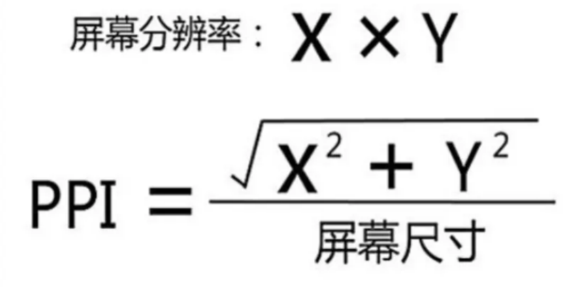

# 移动端相关内容

## PWA 技术

一、PWA 概述

[一文读懂什么是 PWA（Progressive Web App）](https://blog.csdn.net/sunyctf/article/details/136003062){link=static}

二、PWA 相关技术解析

[前端应该了解的PWA](https://juejin.cn/post/6844903603967115272){link=static}

[【PWA学习】3. 让你的 WebApp 离线可用](https://www.jianshu.com/p/0121d1793d01){link=static}

三、搭建一个简易的 PWA 应用

[PWA介绍及快速上手搭建一个PWA应用](https://segmentfault.com/a/1190000014639473){link=static}

四、PWA 在国内的未来

[小程序鼻祖 —— 在国内逐渐消亡的 PWA 可以带给我们哪些启示？](https://segmentfault.com/a/1190000041729491){link=static}

## 视口 viewport

三种视口：布局视口、理想视口、视觉视口。

- 布局视口：可以简单理解为就是 HTML 元素的宽度。在 PC 端上，布局视口默认等于浏览器窗口的宽度。

- 理想视口：设备屏幕宽度。

- 视觉视口：用户可以看到的区域宽度。

利用 meta 标签控制移动端视口的终极方案，也是现在基本固定的写法：

```html
<meta content="width=device-width,initial-scale=1,user-scalable=no" name="viewport">
```

- 将 width 设置为 device-width，使「布局视口」=「理想视口」，initial-scale 设置为 1，使「视觉视口」=「理想视口」/ 1 = 「理想视口」，从而实现三个视口相等。

- meta viewport 标签只对移动端浏览器有效，对 PC 端浏览器是无效的

[详解meta-viewport标签中的width和initial-scale属性](https://blog.csdn.net/leman314/article/details/111936863){link=static}

## 移动端适配

移动端适配的目标是，在不同的移动端设备中网页显示相同的效果。要求严格的公司甚至要求不同设备每行显示的字数都一样。

几种常见的适配方案：

- rem 布局

- vm/vh 布局

- 百分比布局

- 响应式布局

-  px 为主，搭配 vw/vh、媒体查询与 flex 进行布局

参考文章：

[移动端适配的5种方案](https://juejin.cn/post/6953091677838344199){link=static}

[一次说清楚，以后不要再问移动端怎么适配了！](https://zhuanlan.zhihu.com/p/267774232){link=static}

## 移动端兼容性问题

[移动端兼容性问题集锦】兼容性问题及解决方案](https://juejin.cn/post/6901940698518732808){link=static}

### 安卓兼容性问题

1. border-radius:50%不圆，因为，使⽤了rem布局，在部分机型上出现的问题，设置具体的px数值，不⽤50%即可。

2. line-height 不居中。Android 在排版计算的时候参考了 primyfont 字体的相关属性。

primyfont 的查找是看 `font-family` ⾥哪个字体在fonts.xml ⾥第⼀个匹配上，⽽原⽣ Android 下中⽂字体是没有 family name 的，导致匹配上的始终不是中⽂字体，所以解决这个问题就要 `fontfamily` ⾥显式申明中⽂，或者通过什么⽅法保证所有字符都fallback到中⽂字体。

针对Android 7.0+设备：`<html>`上设置 lang 属性：`<html lang="zh-cmn-Hans">`，同时 fontfamily 不指定英⽂，如 font-family: sans-serif 。

针对MIUI 8.0+设备：设置 font-family:miui 。这个⽅案就是显式声明中⽂的⽅案。

3. input的 placeholder 偏上。`input { line-height:normal; }`。

4. font-weight 设置 500 和 600 是⽆效的。如果缺少 500 ，那么会向下取值400。加粗可以设置 bold。

### IOS 兼容性问题

1. 滚动穿透，设置大容器 wrap，添加属性 `overflow: hidden`。

2. 滚动不流畅。设置 `-webkit-overflow-scrolling: touch`。

3. 滚动时，动画停止。

IOS 中，touch 的优先级高。当系统接收到 touch 事件后会优先响应，此时会暂停屏幕上包括 JS、css 的渲染。不光是 css 动画不动了，哪怕页面没有加载完，如果手指头还停留在屏幕上，页面也不会继续加载，直到手松开。（移动端滚动推荐使用 better-scroll 插件）

4. 当键盘弹起时，fixed 会失效，输入框被遮挡，手动滚动至底部即可。或者把页面滚动改为容器内滚动。

5. 底部安全距离。

6. 旋转字体变大：`-webkit-text-size-adjust: none`。

### 移动端点击事件 300ms 延迟

双击缩放(double tap to zoom)，这也是会有上述 300 毫秒延迟的主要原因。双击缩放，即用手指在屏幕上快速点击两次，iOS 自带的 Safari 浏览器会将网页缩放至原始比例。

假定这么一个场景。用户在 iOS Safari 里边点击了一个链接。由于用户可以进行双击缩放或者单击跳转的操作，当用户一次点击屏幕之后，浏览器并不能立刻判断用户是确实要打开这个链接，还是想要进行双击操作。因此，iOS Safari 就等待 300 毫秒，以判断用户是否再次点击了屏幕。

鉴于 iPhone 的成功，其他移动浏览器都复制了 iPhone Safari 浏览器的多数约定，包括双击缩放，几乎现在所有的移动端浏览器都有这个功能。

解决方法：

1. fastclick: FastClick 的原理是在 touchend 阶段调用 event.preventDefault，然后通过 document.createEvent 创建一个自定义事件 MouseEvents，再通过 eventTarget.dispatchEvent 触发对应目标元素上绑定的 click 事件。

2. 禁止缩放：会把双手缩放页禁止掉。

```html
<meta name="viewport" content="user-scalable=no" />
或者
<meta name="viewport" content="initial-scale=1,maximum-scale=1" />
```

3. 设置 `width=device-width`，会保留双手缩放。

```html
<meta name="viewport" content="width=device-width" />
```

4. 设置指针事件

```css
html {
  touch-action: manipulation;
}
```

[移动端300ms延迟原因及解决方案](https://juejin.cn/post/6844904031026937864){link=static}

[移动端点击事件延迟的诞生消亡史](https://cloud.tencent.com/developer/article/1668429){link=static}

### 音视频相关

1. 自动播放

- iOS Safari、IPhone Safari 中不支持，但在 webview 中可能被开启。iOS 开发文档明确说明蜂窝网络下不允许 autoplay。

- Chrome 中，设置 mouted 后可以自动播放。

- 微信中不允许⾃动播放。但是可以借助 WeixinJSBridge 实现。

2. 单例

- ios safari 中的⾳频对象是单例的，ios 中⽆法播放多个⾳频⽂件。

3. 循环播放

ios 部分机型不⽀持循环播放。解决⽅案：监听播放完成事件 ended，⼿动触发播放。

4. 其它

ios 视频⾃动全屏播放：设置内联属性 `playsinline webkit-playsinline`。


### 移动端 1px 问题

1px 问题指的是在一些 Retina 屏幕的机型上，移动端页面的 1px 会变得很粗，呈现出不止 1px 的效果。

原因很简单：css 中的 1px 并不能和移动设备上的 1px 画上等号。它们之间的比例关系有一个专门的属性来描述：设备像素比。

```bash
# 设备像素⽐
window.devicePixelRatio = 设备的物理像素 / CSS像素
```

⼀个物理像素等于多少个设备像素取决于移动设备的屏幕特性(是否是Retina)和⽤户缩放⽐例。

> 把原先元素的 border 去掉，然后利⽤ `:before` 或者 `:after` 重做 border ，并 transform 的 scale 缩⼩⼀半，原
先的元素相对定位，新做的 border 绝对定位。

解决方案：

#### 1、伪元素先放⼤后缩⼩

在⽬标元素的后⾯追加⼀个 `::after` 伪元素，让这个元素布局为 absolute 之后、整个伸展开铺在⽬标元素上，然后把它的宽和⾼都设置为⽬标元素的两倍，border 值设为 1px。接着借助 CSS 动画特效中的放缩能⼒，把整个伪元素缩⼩为原来的 50%。此时，伪元素的宽⾼刚好可以和原有的⽬标元素对⻬，⽽ border 也缩⼩为了 1px 的⼆分之⼀，间接地实现了 0.5px 的效果。(dpr为2的情况)

```css
.scale {
  position: relative;
  border: none;
}
.scale::after {
  content: '';
  position: absolute;
  bottom: 0;
  background: #000;
  width: 100%;
  height: 1px;
  transform: scaleY(0.5);
  transform-origin: 0 0;
}
```

#### 2、rem+系统缩放

- 主体适配采⽤ rem 适配，并放⼤ rem 的基值(dpr 倍)。

- 再通过系统缩放 缩回 dpr 倍，initial-scale=1/dpr。

```js
var dpr = window.devicePixelRatio||1;
var styleNode = document.createElement("style");
var w = document.documentElement.clientWidth*dpr/16;
styleNode.innerHTML="html{font-size:"+w+"px!important}";
document.head.appendChild(styleNode);

var scale = 1/dpr;
var meta = document.querySelector("meta[name='viewport']");
meta.content="width=device-width,initial-scale="+scale;
```

#### 3、响应式+变换缩放

通过meta视⼝标签根据不同的dpr对不同的⻚⾯进⾏缩放。这需要通过 JS 进⾏动态的设置。简单的说，假如想设置 1px 的线，在 dpr=2 情况下，⻚⾯就缩放到原来的⼀半，此时就会正常显示 1px 的线；在 dpr=3 的情况下，⻚⾯就缩放到原来的三分之⼀，此时也能够正常显示 1px 的线。

```css
@media only screen and (-webkit-device-pixel-ratio:2 ) {
  #test{
  transform: scaleY(.5);
  }
}
@media only screen and (-webkit-device-pixel-ratio:3 ) {
  #test{
  transform: scaleY(.333333333333333333);
  }
}
```

[移动端1px问题解决方案](https://juejin.cn/post/6959736170158751780){link=static}

[移动端1px实现方式](https://juejin.cn/post/7025806468255334408){link=static}

### 禁⽌数字识别为电话号码

```html
<meta name="format-detection" content="telephone=no">
```

### transition闪屏

```css
.box {
  -webkit-transform-style: preserve-3d;
  -webkit-backface-visibility: hidden;
  -webkit-perspective: 1000;
}
```

### CSS3 动画卡顿

可以开启 GPU 硬件加速，但使用硬件加速的时候也要注意，因为这个也有坑，不合理使用反而会让应用越来越卡。

[CSS3 动画在 iOS 上为什么会因为页面滚动也停止？](https://www.zhihu.com/question/24268253){link=static}

## 移动端像素

设备像素（dp）：也叫物理像素。指的是显示器上的真实像素，每个像素的大小是屏幕固有的属性，屏幕出厂以后就不会再改变。平时常说的 1920*1080 像素分辨率就是设备像素单位，UI 设计稿的像素单位也是按照设备像素。

CSS 像素：在 CSS 规范中，长度单位可以分为两类，绝对单位和相对单位。

px 是一个相对单位，相对的是设备像素。一般情况下，页面缩放比为1，1个CSS像素等于1个设备独立像素。

css 像素又具有两个方面的相对性：

- 在同一个设备上，每1个css像素代表的设备像素是可以变化的，比如调整屏幕分辨率。

- 在不同设备之间，每1个css像素代表的设备像素是可以变化的，比如两个型号的手机。

#### 设备独立像素dip

设备独立像素dip，css像素=设备独立像素=逻辑像素。与设备无关的逻辑像素，代表可以通过程序控制使用的虚拟像素。

为什么会出现设备独立像素这种虚拟像素单位的概念，下面举个例子说明。

iPhone 3GS 和 iPhone 4/4s 的尺寸都是 3.5 寸，但前者的分辨率是 320*480，后者的分辨率是 640*960。这意味着，iPhone 3GS 有 320 个物理像素，iPhone 4/4s 有 640 个物理像素。

如果我们按照真实的物理像素进行布局，比如按照 320 物理像素进行布局，到了 640 物理像素的手机上就会有一半的空白。为了避免这种问题出现，就产生了虚拟像素单位。

我们统一 iPhone 3GS 和 iPhone 4/4s 都是 320 个虚拟像素，只是在 iPhone 3GS 上，最终 1 个虚拟像素换算成 1 个物理像素，而在 iPhone 4/4s 中，1 个虚拟像素最终换算成 2 个物理像素。

1 个虚拟像素被换算成多少个物理像素，这个数值我们称为设备像素比，即 dpr。

:::warning 分辨率与 ppi
分辨率：

- 对于屏幕，分辨率一般表示屏幕上显示的物理像素总和。比如，我们说 iPhone6 屏幕分辨率是 750*1334 px。

- 对于图像，概念等同于图像尺寸、图像大小、像素尺寸等。比如，我们说的 20*20px 的icon。

ppi（pixel per inch），每英寸像素。表示每英寸所包含的像素点数目，更确切的说法应该是像素密度。数值越高，说明屏幕能以更高密度显示图像。


:::

dpr（device pixel ratio），设备像素比，代表设备独立像素到设备像素的转换关系，在 JavaScript 中可以通过 `window.devicePixelRatio` 获取。

dpr = 物理像素数 / 逻辑像素数，在某一个方向上，x方向或y方向。

iPhone12 的设备独立像素为 390*844，分辨率像素宽高为 1170*2532，所以 iPhone12 的 dpr 为 1170/390=3。

当设备像素比为 3:1 时，使用 9（3*3）个设备像素显示 1 个css像素。

当 dpr 为 3，那么 1px 的css像素宽度对应 3px 的物理像素宽度，1px 的 css 像素高度对应 3px 物理像素高度。

参考文章：

[揭秘移动端px,dpi,dpr](https://cloud.tencent.com/developer/article/1842222)

[移动端适配大全---原理和方案](https://juejin.cn/post/7032685883769913380#heading-6)

[web前端面试系列-css像素](https://vue3js.cn/interview/css/dp_px_dpr_ppi.html#%E4%BA%8C%E3%80%81%E4%BB%8B%E7%BB%8D)

[CSS像素、物理像素、逻辑像素、设备像素比、PPI、Viewport](https://zhuanlan.zhihu.com/p/91636704)

## 移动端布局及计算转化过程

重点：[最后一次探究 1px](https://jelly.jd.com/article/5f5a4b31da524a0147e97da0)

[移动端适配方案详解](https://juejin.cn/post/7132037611060740103#heading-6)