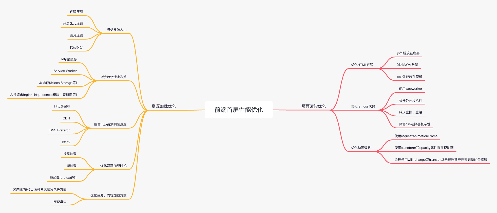

# 性能优化

## SPA 单页面应用的理解

### SPA 概述

SPA (Single Page Application) 是指在页面初始化的时候加载相应的 HTML、css、JS 文件，加载完后不会因为用户的操作而进行页面重载或跳转，内容变化利用路由机制实现。

优点：

- 良好的交互体验。

用户在访问应用页面是不会频繁的去切换浏览页面，从而避免了页面的重新加载。

- 前后端分离。

单页Web应用可以和 RESTful 规约一起使用，通过 REST API 提供接口数据，并使用 Ajax 异步获取，这样有助于分离客户端和服务器端工作。

更进一步，在客户端也可以分解为静态页面和页面交互两个部分。

- 减轻服务器压力。

服务器只用出数据就可以，不用管展示逻辑和页面合成，吞吐能力会提高几倍。

- 共用一套后端代码。

不用修改后端程序代码就可以同时用于 Web 界面、手机、平板等多种客户端。

缺点：

- 首屏加载速度慢。

- 不利于SEO优化。

- 不能使用浏览器前进后退功能。

### SPA 优化

1、首屏加载慢

原因：网络延迟、资源文件过大、重复加载、加载脚本时的阻塞渲染。

优化：

- 使用路由懒加载，减少入口文件大小，按需加载。

- UI 框架按需加载。例如 element-ui 只引入用到的组件，不要全部引入。

- 设置骨架屏，提升用户视觉体验。

- 静态资源本地缓存。

- 防止组件重复下载。在 webpack 中配置 CommonsChunkPlugin，为 minChunks 设置具体的值，表示把使用 n 次及以上的包抽离出来，放入公共依赖文件，避免重复加载组件。

- 图片资源压缩：雪碧图、使用在线字体图标等。

- 开启 Gzip 压缩，compression-webpack-plugin 对资源文件进行压缩。

- 使用 SSR，即在服务端渲染，再发送给浏览器。

- 复用页面组件，在加载初始页面的时候会完全加载，然后逐渐替换更新新的页面片段。

2、前进后退优化

保存历史路由信息。在页面切换的时候，也可以使用骨架屏，防止空屏出现。

3、SEO 优化

页面的 `#` 替换成 `#!`，解决难被搜索引擎抓取到的问题。

[浅谈前端SPA（单页面应用](https://blog.csdn.net/cmzhuang/article/details/94334619){link=static}

[面试官：SPA（单页应用）首屏加载速度慢怎么解决？](https://blog.csdn.net/weixin_44475093/article/details/110675962){link=static}

### 前端首屏性能优化



## 接口优化

### 接口数量收敛

问题：接口调用数量多，且存在重复调用。

解决思路：

- 相同接口请求合并成一个。对于请求参数不同，但是接口 id 相同的请求，考虑是否可以根据接口特性，通过合并参数，将多个接口请求合并为一个，减少接口请求次数。

- 前端可将某些基础信息缓存起来，如用户信息，后续可从缓存中获取，减少页面请求。

- 对于同一类型的数据，如最近三天账单、最近一个月账单，后台可改造接口，提供聚合接口一次性返回所有信息，减少前端接口请求次数。

### 接口调用顺序调整

问题：接口调用顺序不合理，如串行请求、请求时机过于靠后。

解决思路：

- 没有依赖关系的接口，将串行请求改为并行请求，避免滥用 await 关键字。

- 接口请求发起时机尽可能提前。比如都在页面初始化之后立即发起请求。

- 和当前页面无关的接口，不要放在当前页面请求。比如，和首页无关的接口，不要放在首页发起请求。

### 组件接口优化

问题：

- 组件内部的接口请求存在不必要的串行。

- 页面接口请求阻塞了组件内部接口调用。

- 每个组件内部都各自调用接口，可能会导致重复请求同一个接口，且页面无法控制这些接口的调用。

解决思路：

- 没有依赖关系的接口，串行改为并行。

- 存在弱关系依赖的接口（比如后调用的接口，需要根据先调用接口的结果判断是否发起请求，但请求参数不依赖于先调用接口的结果），如果大部分场景都会调用到后面的接口，可考虑统一并行调用，再根据结果判断是否使用数据。

- 页面的接口请求，尽量不要阻塞组件的接口调用。对于大部分业务场景都会展示的组件，可以考虑初始化页面时默认渲染组件，待页面请求完毕相关接口之后，再根据状态数据判断组件是否隐藏。从而提前了组件内部的接口调用时机。

- 比较好的方案是：组件内部不发起接口请求，由页面统一查询之后，以参数形式将结果传入组件。将组件的请求控制权都上交给页面，有利于页面对接口进行统一调度。

### 控制接口只调用一次

通过代码实现，相同接口只调用一次。提供参数让业务方决定是否强制调用接口。

方式一：通过事件监听方式。

```js
// api/user/index.js
// 用户接口定义
const getUserInfoApi = async (params) => {
  try {
    const res = await fetch('/api/user/info', { params });
    return res;
  } catch (e) {
    return {};
  }
}

// 控制用户接口只调用一次
const getUserInfoApiOnce = async (params, force = false) => {
  // 若强制调用接口，则直接调用接口
  if (force) {
    const res = await getUserInfoApi(params);
    // 将接口数据存储到mobx中
    store.setUserInfo(res);
    return res;
  }

  return new Promise(async (resolve) => {
    const { userInfo } = store || {};
    // 如果userInfo是空对象{}，说明有一个请求正在执行，此时监听queryUserInfo事件，等请求执行完成后，会发送接口结果
    if (userInfo && Object.keys(userInfo).length === 0) {
      Taro.eventCenter.on('queryUserInfo', (res) => {
        resolve(res);
      })
    } else if (!userInfo) {
      // userInfo 默认值是null，因此userInfo为空说明是第一个请求
      // 将userInfo设置为空对象，表示有一个请求正在执行，拦截后续请求
      store.setUserInfo({});
      const res = await getUserInfoApi(params);
      store.setUserInfo(res);
      // 接口请求完成后，触发queryUserInfo事件，发送接口结果
      Taro.eventCenter.trigger('queryUserInfo', res);
      resolve(res);
    } else {
      // 若userInfo有值，则直接返回
      resolve(userInfo);
    }
  })
}
```

方式二：通过标识记录

```js
// api/user/index.js
// 用户接口定义
const getUserInfoApi = async (params) => {
  try {
    const res = await fetch('/api/user/info', { params });
    return res;
  } catch (e) {
    return {};
  }
}

let pendingPromise = null;

// 控制用户接口只调用一次
const getUserInfoApiOnce = async (params, force = false) => {
  if (!force && pendingPromise) {
    return pendingPromise;
  }

  try {
    pendingPromise = getUserInfoApi(params);
    const res = await pendingPromise;
    store.setUserInfo(res);
    return res;
  } catch (e) {
    pendingPromise = null;
    return {};
  }
}
```

## 资源优化

### 无用页面清除

废弃的页面清除下线，缩减包体积大小，减少资源请求耗时。

### 优化构建包体积

问题：

- 资源包拆分不合理，某个包文件会成为性能瓶颈。若某个 js 文件很大，其它 js 文件需要等最大的 js 文件加载完成才能被解析，最大文件的加载时间会成为性能瓶颈。

- 包体积不能太大，也不能太小。

解决思路：

- 把体积很大的包拆分到其它 js 文件中，让所有包文件大小保持基本一致，尽可能让所有 js 文件请求同时结束，避免 js 加载瓶颈。

- 非首屏需要的组件，不要打入首屏的包中。比如验证码组件、vconsole（一个用于调试的工具）。可设置为链接预请求（prefetch），它和预加载（preload）的区别在于，它是闲时下载，不会阻塞首屏 chunk 的下载。

- 体积较小的 chunk 包进行合并，较小的构建脚本它的等待时间会比加载时间还长。构建脚本最优的状态是每个 chunk 体积基本保持一致，不要太大或太小。

### 抽取公共模块

对于每个业务模块都需要使用到的 js 内容，可放在在线脚本中，进入首页时即可加载，其它模块直接使用缓存，无需重复加载。

比如，可以把 lodash 打入在线脚本中，在构建脚本中声明这个依赖走线上的脚本，不再打入 chunk 中，减小包体积。

### js 资源预加载

在 head 标签里面使用 link 标签进行 js 文件预加载，提前加载好 js 文件，等到使用的时候就可以直接使用。

html底部script标签使用js文件。

```html
<head>
  <link rel="preload" as="script" href="hello.js" />
</head>
<body>
  <div id="app"></div>
  <script src="hello.js"></script>
</body>
```

### 域名预连接

使用 link 标签进行域名预连接，对后续需要使用的域名提前建立好连接，减少等待时间。

```html
<link rel="preconnect" href="https://love.you1.com" />
<link rel="preconnect" href="https://love.you2.com" />
<link rel="preconnect" href="https://love.you3.com" />
```

### 图片资源优化

- 小 icon 可以直接使用 base64 打入页面，减少图片请求次数。

- 对于比较大的图片，可对图片进行压缩。非首屏使用的图片可使用懒加载。

### postcss 不再兼容太旧版本浏览器

目前的 postcss 配置，在 css 文件编译后产生大量不需要的前缀样式内容，造成 css 文件体积过大。

现状：

```js
browsers: ['last 3 versions', 'Android >= 4.1', 'ios >= 8']
```

如今 IOS 版本已经较高，IOS8 基本没有用户使用，可以省去为兼容 IOS8 额外产生的 css 内容。

修改为：

```js
browsers: ['last 3 versions', 'Android >= 5', 'ios >= 9.3']
```

调整后总包体积下降 500+KB。要在兼容性和性能之间取得平衡。

## 其它技术层面优化

1、数据对象压缩精简：store某一个状态对象避免存储太多数据信息，可拆分为多个状态。

2、优化store状态的更新导致相同数据也会重新渲染的逻辑。

3、优化页面的state结构，避免setData数据量过大的问题。

4、标准通用的功能模板化，针对不同渠道插件化、差异配置化，降低应用复杂程度。

## 业务流程精简优化

精简业务流程，用户完成一个业务操作不要跳转太多页面，这样也可能会减少接口请求次数。

业务精简了，接口请求也少了，很好理解。

## 小程序性能优化

### 业务模块切换为 H5

小程序业务功能切换到 H5 形态，只保留首页、人脸识别这类高度依赖原生能力的模块，从而减小包体积大小。

小程序原生页面 VS H5页面：

- 原生页面是把前端代码直接转换为小程序的原生代码，可直接运行在小程序中，可以直接调用手机原生功能，如人脸识别、拍照等。

- H5 页面就是浏览器看到的网页，它需要创建 H5 容器 webview 才能在小程序中展示。虽然 H5 页面可以通过 JS Bridge 调用原生功能，但功能会受到限制，而且可能会有其它问题。

- 小程序业务要迁移到 H5，是因为可以减小小程序包体积大小，H5页面不需要打入小程序的包中。

- 小程序如何区分原生页面和 H5 页面：小程序给路由添加白名单，如果跳转命中该路由，则打开一个webview，展示H5页面。

### 优化代码包

结合大厂小程序分包实现方案，优化小程序主包和分包划分。

下载耗时是启动耗时中的重要瓶颈，在用户首次访问小程序或小程序版本更新时，代码包的下载会对启动耗时造成影响。耗时长短与网络环境、代码包压缩后大小、是否命中增量更新有关。

### 小程序代码按需注入

一般情况下，小程序启动时，启动页面依赖的所有代码包（主包、分包、插件包、扩展库等）的所有JS代码会全部合并注入，包括其它未访问的页面以及未用到的自定义组件，同时所有页面和自定义组件的JS代码会被立刻执行。这造成很多没有使用的代码在小程序运行环境中注入执行，影响注入耗时和内存占用。

通过启用按需注入，避免不必要的代码注入和执行，以降低小程序的启动时间和运行内存。

### 优化setData

优化setData逻辑、setData数据大小，提高首页渲染速度，缩短首屏加载渲染时间，优化小程序启动耗时。

异步setData触发绘制的首屏内容展示不一定会计入启动耗时统计，但会延迟用户看到页面内容的时间，影响用户体验。与支付宝启动性能指标不同，微信首屏内容展示不计入启动性能。

微信以Page.onReady事件触发标志小程序启动过程完成。
