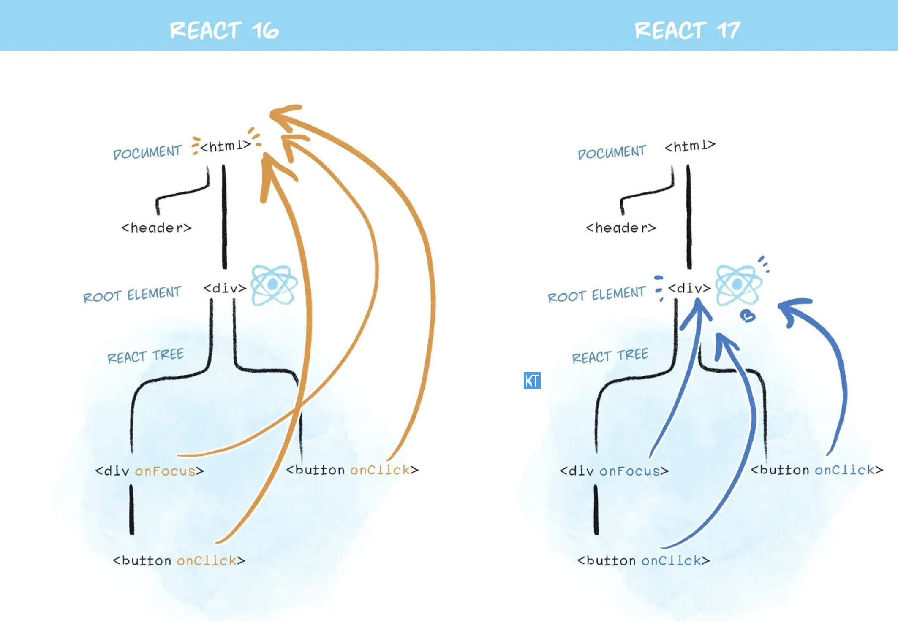

# React

## React的事件机制

[React事件机制](https://juejin.cn/post/7068649069610024974){link=static}

[【React 面经】React 中的事件机制详解](https://blog.csdn.net/lph159/article/details/144159559){link=static}

### React事件机制概述

React实现了一套自己的事件系统，称为合成事件（SyntheticEvent）。

React 合成事件（SyntheticEvent）是 「React 模拟原生 DOM 事件所有能力的一个事件对象」，可以理解为浏览器原生事件的跨浏览器包装器。

它根据 W3C 规范来定义合成事件，兼容所有浏览器，拥有与浏览器原生事件相同的接口。

也就是在 react 中，我们绑定的事件 onClick 等，并不是原生事件，而是由原生事件合成的 React 事件，比如 click 事件合成为 onClick 事件。

### 为什么使用合成事件？

#### 1、进行浏览器兼容，实现跨浏览器的一致性。

React 的合成事件会抹平不同浏览器事件对象之间的差异，屏蔽不同浏览器的底层差异，实现跨浏览器的一致性，提供统一的 API。

不同浏览器（尤其是旧版 IE）对原生事件的处理存在差异（如事件对象属性、事件传播方式等）。合成事件提供统一的 API（如 `e.preventDefault()`, `e.stopPropagation()`），屏蔽底层浏览器差异，开发者无需再写浏览器兼容代码。

#### 2、性能优化

通过事件委托、事件池机制，React 合成事件有效减少了内存消耗和事件绑定开销，优化了性能。

事件委托：React 将所有事件绑定到**根节点**（而非每个具体元素），大幅减少内存占用和绑定开销。

事件池机制：事件对象可能会被频繁创建和回收，因此 React 引入事件池，在事件池中获取或释放事件对象。即 React 事件对象不会被释放掉，而是存放进一个数组中，当事件触发，就从这个数组中弹出，避免频繁地去创建和销毁(垃圾回收) 。React 17 已经移除了事件池机制，因为现代浏览器的性能已经足够优秀了。

#### 3、安全和稳定性

**避免内存泄漏**：React 会自动管理事件绑定与销毁（组件卸载时移除事件监听）。

**防止意外操作**：合成事件对象是原生事件的包装层，避免开发者直接操作原生事件可能引发的副作用（如随意调用 `stopPropagation` 破坏其他库的逻辑）。

### 合成事件特点

#### 1、事件委托

React 不会将事件处理函数直接绑定到真实的 DOM 节点上，而是统一绑定到根元素上，利用事件冒泡触发事件处理函数，从而减少事件绑定开销。

在 React 16 中，事件处理函数统一绑定到 document 元素上；在 React 17 之后，绑定到 React 的根DOM容器上，即 `ReactDOM.render(app， container)` 这个容器。

这样好处是有利于微前端的，微前端一个前端系统中可能有多个应用，如果继续采取全部绑定在 document 上，那么可能多应用下会出现问题。也利于多个 React 版本共存。

根元素可以通过 `e.target` 获取到触发事件的元素。



#### 2、合成事件对象

事件处理函数接收到的并不是原生的 DOM 事件对象，而是 React 包装过的 SyntheticEvent 对象。这个对象与原生事件对象具有相同的接口，如 `stopPropagation()` 和 `preventDefault()`，并且这些方法是跨浏览器兼容的。

### React事件机制和JS原生事件的区别

(1) 事件绑定方式：
- 原生JS：通过 `addEventListener` 或直接在HTML中绑定（如onclick）。
- React：在JSX中直接以类似HTML属性的形式绑定，如 `onClick={handleClick}`，但实际是React自己处理绑定。

(2) 事件传播与委托：
- 原生JS：事件可以可以选择在哪个阶段监听，捕获或者冒泡阶段。
- React：React 事件只能在冒泡阶段监听，无法选择捕获阶段。

(3) 事件对象：
- 原生JS：事件对象是浏览器提供的。
- React：事件对象是合成事件（SyntheticEvent），它是原生事件对象的跨浏览器包装器。

(4) 事件处理函数中的this：
- 原生JS：事件处理函数中的 `this` 指向绑定事件的元素（除非使用箭头函数或 bind 改变了 this）。
- React：在类组件中，如果不使用箭头函数或 bind，那么事件处理函数的 this 会是 undefined（因为类的方法默认不会绑定 this）。通常在构造函数中绑定或者使用箭头函数来确保 this 指向组件实例。

(5) 阻止冒泡：
- 原生JS：通过 `event.stopPropagation()`。
- React：通过 `event.stopPropagation()`，但注意这里的 event 是合成事件。在合成事件中阻止冒泡只能阻止 React 事件的进一步传播，而原生事件仍然可以传播到 document（或根容器）上。

### 合成事件的事件池

为了减少内存的占用，React 对事件对象使用了事件池（Event Pooling）。每次事件被触发时，React 会从事件池中获取一个事件对象，事件处理完成后，事件对象会被重置并放回池中。这可以避免每次事件触发时都创建新的事件对象，从而优化性能。

React 事件池仅支持在 React 16 及更早版本中，在 React 17 已经不使用事件池。

```js
function handleChange(e) {
  console.log("原始数据：", e.target)
  setTimeout(() => {
    console.log("定时任务 e.target：", e.target); // null
    console.log("定时任务：e：", e); 
  }, 100);
}
function App() {
  return (
    <div className="App">
      <button onClick={handleChange}>测试事件池</button>
    </div>
  );
}

export default App;
```

上面例子中，定时器打印的是 null。在事件处理函数执行完毕后，会释放事件源到事件池中，清空属性。

在 React 16 及之前的版本，合成事件对象的事件处理函数全部被调用之后，所有属性都会被置为 null 。这时，如果我们需要在事件处理函数运行之后获取事件对象的属性，可以使用 React 提供的 `e.persist()` 方法，保留所有属性。

`event.persist()` 阻止了事件对象的复用，可以在异步操作中持久化事件对象，确保可以正确访问事件的属性。

```js
function handleChange(e) {
  // 只增加 persist() 执行
  e.persist();
  
  console.log("原始数据：", e.target)
  setTimeout(() => {
    console.log("定时任务 e.target：", e.target);
    console.log("定时任务：e：", e); 
  }, 100);
}
```

### 常见问题

1、合成事件对象怎么获取原生事件对象？

通过 `event.nativeEvent` 获取原生事件对象。