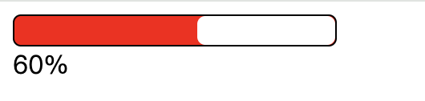

# 场景题

## 本地实现一个百分比进度条

使用 requestAnimationFrame 实现。

```html
<!DOCTYPE html>
<html lang="en">
<head>
  <meta charset="UTF-8">
  <meta name="viewport" content="width=device-width, initial-scale=1.0">
  <title>进度条</title>
  <style>
    #bar {
      width: 202px;
      height: 20px;
      border-radius: 5px;
      border: 1px solid black;
      box-sizing: border-box;
      background-color: red;
      /* 加过渡效果让动画更平滑 */
      transition: padding-left 0.1s linear;
    }
    #son-bar {
      width: 100%;
      height: 100%;
      background-color: #fff;
      border-radius: 5px;
    }
  </style>
</head>
<body>
  <div id="bar">
    <div id="son-bar"></div>
  </div>
  <div id="percentage">0</div>
  <script>
    let percentage = 0;
    let gapTime = 100;
    let lastTime = Date.now();
    let frameId = null;

    function updateProgressBar() {
      if (percentage >= 200) {
        cancelAnimationFrame(frameId);
        return;
      }
      percentage += 10;
      const percentageDiv = document.getElementById('percentage');
      percentageDiv.innerText = parseInt(percentage / 200 * 100) + '%';
      const bar = document.getElementById('bar');
      bar.style.paddingLeft = percentage + 'px';
    }

    function loop() {
      const nowTime = Date.now();
      // 控制执行间隔时间
      if (nowTime - lastTime >= gapTime) {
        updateProgressBar();
        lastTime = nowTime;
      }
      frameId = requestAnimationFrame(loop);
    }
    loop();
  </script>
</body>
</html>
```

使用 `setInterval()` 定时器。

```js
let percentage = 0;
let timer = null;
function updateProgressBar() {
  if (percentage >= 200) {
    clearInterval(timer);
    return;
  }
  percentage += 10;
  const percentageDiv = document.getElementById('percentage');
  percentageDiv.innerText = parseInt(percentage / 200 * 100) + '%';
  const bar = document.getElementById('bar');
  bar.style.paddingLeft = percentage + 'px';
}
setInterval(updateProgressBar, 100);
```



## 根据请求数据实现加载进度百分比

1、如果提前知道数据的大小，根据目前已经加载的内容，计算出百分比。

xhr 和 fetch 都可以提供这个功能，可以获取到总数据长度和已加载数据长度。

xhr：

xhr 提供了一个 `progress` 事件，可以监听请求进度。这个事件提供了一个对象，其中包含了 `total` 和 `loaded` 属性，分别表示总数据长度和已加载数据长度，根据这两个属性可以计算出进度百分比。

```js
const xhr = new XMLHttpRequest();
xhr.open('GET', 'http://localhost:3000/test');
xhr.onreadystatechange = function () {
  if (xhr.readyState === 4 && xhr.status === 200) {
    const data = xhr.responseText;
    console.log(data);
  }
}
xhr.addEventListener('progress', e => {
  const { loaded, total } = e;
  console.log(parseInt((loaded / total) * 100, 0) + '%');
  const percentage = parseInt((loaded / total) * 100, 0)
})
xhr.send()
```

fetch：

类似地，只要获取到这两个数据即可计算出百分比。fetch 没有监听函数，可以先通过请求头获取到 `content-length` 总长度，再使用数据流的 API `body.getReader` 获取响应体已经加载好的长度。

```js
fetch('http://localhost:3000/test')
  .then(async res => {
    if (!res || !res.body) {
      return
    }
    // 总长度
    const contentLength = res.headers.get('content-length');
    let total = contentLength ? parseInt(contentLength, 10) : 0;
    let loaded = 0;
    const reader = res.body.getReader();
    while (1) {
      const { done, value } = await reader.read()
      if (done) {
        break
      }
      // 已加载长度累加
      loaded += value.length
      this.percentage = parseInt((loaded / total) * 100, 0);
      console.log(parseInt((loaded / total) * 100, 0));
    }
  })
```

[获取请求响应的进度百分比，两种方法](https://blog.csdn.net/m0_74213811/article/details/140180614){link=static}

2、将资源分成多个小段，根据请求得到的个数，更新进度。

3、如果加载的资源是 html 文件，页面里可以嵌套一些 script 标签，通过标签里的代码，更新进度。

[JS怎么实现网页加载的进度百分比](https://www.zhihu.com/question/23682129){link=static}

[JS教程之实现加载图片时百分比进度](https://blog.csdn.net/disi7371/article/details/101187164){link=static}

[js 百分比显示页面加载进度](https://www.cnblogs.com/cyj7/p/4624263.html){link=static}

