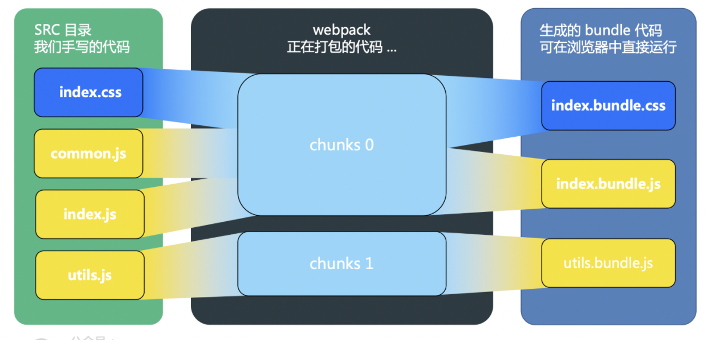
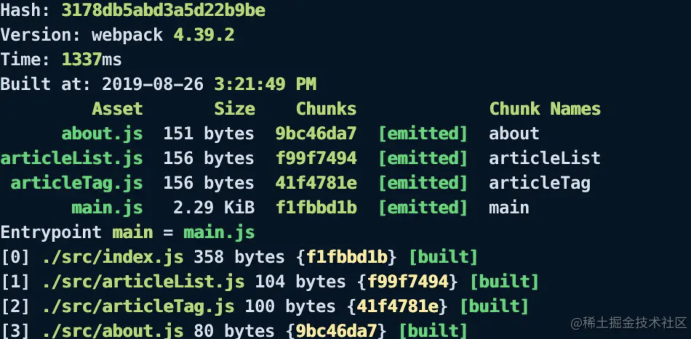

# webpack 深入学习

## webpack 与其它打包工具的不同

在浏览器中运行 JavaScript 有两种方法。

第一种方式，引用一些脚本来存放每个功能。这种方案很难扩展，因为加载太多脚本会导致网络瓶颈。

第二种方式，使用一个包含所有项目代码的大型 js 文件，但这会导致作用域、文件大小、可读性和可维护性方面的问题。

立即调用函数表达式（IIFE）的出现解决了大型项目的作用域问题。当脚本文件被封装在 IIFE 内部时，可以安全地拼接或安全地组合所有文件，而不必担心作用域冲突。因此诞生了一批 Gulp、Grunt 等任务执行器。

但是这样修改一个文件意味着必须重新构建整个文件，拼接可以做到容易地跨文件重用脚本，但却使构建结果的优化变得更加困难。如何判断代码是否实际被使用？即使你只用到 loadash 中的某个函数，也必须在构建结果中加入整个库，接着将它们压缩到一起。如何 treeshake 代码依赖？难以大规模地实现延迟加载代码块，这需要开发人员手动地进行大量工作。

[为什么选择webpack](https://webpack.docschina.org/concepts/why-webpack/){link=static}

## webapck 工作原理

通过 `fs.readFileSync` 读取入口文件，然后通过 `@babel/parser` 获取 ast 抽象语法树，借助 `@babel/core` 和 `@babel/preset-env`，把 ast 语法树转换成合适的代码，最后输出一个文件对象。

它会以一个或多个文件作为打包的入口，在 webpack 处理不同模块依赖时，会将代码分割成多个 chunk，每个 chunk 包含一个或多个模块，最后将整个项目所有文件编译组合成一个或多个 bundle 输出出去。

一个 bundle 可以包含多个 chunk，也可以只包含一个 chunk。

## chunk

chunk 代码块，是 webpack 根据功能拆分出来的。webpack 在处理模块依赖关系时，会将代码分割成多个 chunk，每个 chunk 包含一个或多个模块。

chunk 的生成是由 webpack 的代码分割功能实现的，可以手动配置或自动分割。chunk 是 webpack 的内部概念，不会直接输出到文件系统中。

默认情况下，webpack 会在 dist 输出 chunk 生成的 bundle，文件名就是 chunk 名称。该名称最终会体现在 bundle 的命名上，最终随着 bundle 输出。

### entry 生成 chunk

output.filename 配置输出 chunk 名字。

### 按需加载（异步）产生的 chunk

按需加载（异步）的模块也会产生 chunk，这个 chunk 名称可以在代码中使用 webpackChunkName 自行定义。

如果需要打包时使用 chunk 名称，则需要在 output.chunkFilename 中引用。

```js
module.exports = {
  output: { chunkFilename: "[name].js" },
}

import(/* webpackChunkName: "async-model" */ "./async-model");
```

### 代码分割产生的 chunk

在 webpack5 中代码分割使用 SplitChunkPlugin 插件实现，这个插件内置在 webpack 中，使用时直接用配置的方式即可。

代码分割时也会产生 chunk。

```js
// webpack.config.js
module.exports = {
  entry: {
    index2: './src/index2.js',
    index3: './src/index3.js'
  },
  optimization: {
    // 取值 'multiple' 或 true 都可，根据入口产生多个运行时chunk
    runtimeChunk: 'multiple',
    splitChunks: {
      chunks: 'all',
      cacheGroups: {
        vendor: {
          name: 'vendor',
          test: /node_modules/,
          priority: 10,
          reuseExistingChunk: true,
        },
        common: {
          name: 'common',
          minSize: 0,
          minChunks: 2,
          priority: -10,
          reuseExistingChunk: true
        }
      },
    }
  }
}

// index.js
console.log('🥬  ', 111);

// index2.js
import "./index";
import $ from 'jquery';
console.log('🥬 222 ', $);

// index3.js
import "./index";
console.log('🥬 333 ');
```

上述代码，总共会产生 6 个chunk。

- 两个入口分别分配到名称为 index2 和 index3 的 chunk 中。

- `runtimeChunk: 'multiple'` 的声明，会抽离 webpack 运行时代码到单独的 chunk 中。有两个入口，因此有两份运行时 chunk。

- jquery 符合 cacheGroups.vendor 规则，抽离到名为 vendor 的 chunk 中。

- index.js 符合 cacheGroups.common 规则，抽离到名为 common 的 chunk 中。

## bundle

bundle 是 webpack 输出的最终文件，包含了所有的代码和依赖，可以直接在浏览器中运行。

bundle 就是最终输出一个或多个的文件，大部分情况下一个 chunk 至少会产生一个 bundle，但不完全是一对一的关系。

比如我们在模块中引用图片，又经过 url-loader 打包到外部；或者是引用了样式，通过 extract-text-webpack-plugin 抽离出来，这样一个 chunk 就会出现产生多个 bundle 的情况。

在 webpack 中，可以通过配置来控制 bundle 的数量和大小。

简而言之，bundle 是 chunk 在构建完成的呈现。

## chunk 和 bundle 的区别

简单来说，chunk 是 webpack 在处理模块依赖关系时产生的中间文件，而 bundle 则是最终的输出文件。chunk 是 webpack 内部的概念，不会直接输出到文件系统中，而 bundle 则是 webpack 输出的最终文件，可以直接在浏览器中运行。

:::tip
module、chunk、bundle 其实就是同一份代码，在不同转换场景下的三个名称。

我们直接写出来的是 module，webpack 处理时是 chunk，最后生成的浏览器可直接运行的是 bundle。
:::



index.css 和 common.js 在 index.js 中被引⼊，打包⽣成的 index.bundle.css 和n index.bundle.js 都属于 chunk 0，utils.js 因为是独⽴打包的，它⽣成的 utils.bundle.js 属于 chunk 1。

⼀般来说⼀个 chunk 对应⼀个 bundle，⽐如上图中的 utils.js -> chunks 1 -> utils.bundle.js；但也有例外，⽐如说上图中，就⽤ MiniCssExtractPlugin 从 chunks 0 中抽离出了 index.bundle.css ⽂件。

[webpack 中module、chunk 、bundle 的区别](https://juejin.cn/post/7005530386641977374){link=static}

[webpack——module、chunk和bundle的区别](https://blog.csdn.net/qq_17175013/article/details/119753186){link=static}

## filename & chunkFilename

通过 output 的 filename 和 chunkFilename 控制 chunk 输出的 bundle 命名。

[output中chunkFilename和filename的区别](https://juejin.cn/post/6844904166150651917){link=static}

MiniCssExtractPlugin 也同样有这些字段：

[Webpack - css 文件的代码分割](https://github.com/VenenoFSD/Learn-Webpack4/issues/17){link=static}

## 命名(hash)

webpack 文件打包一般有三种 hash：hash、chunkhash、contenthash。

- hash 是项目级别的，使用 hash 的缺点是，加入只修改了其中一个文件，但是所有文件的文件名里的 hash 都是相同的。

- chunkhash 根据不同的入口文件(entry)进行依赖文件解析，构建对应的 chunk，生成对应的哈希值。

- contenthash 是针对文件内容级别的，只有自己模块的内容改变，哈希值才会改变。

[从源码看webpack的hash策略](https://juejin.cn/post/6844903942384517127){link=static}

[webpack中文件打包 hash、chunkhash、contenthash 的区别](https://juejin.cn/post/7078589390422802440){link=static}

可以使用 webpack 提供的模板字符串定义 bundle 文件名，下面是常用的模板字符串。

|模板|描述|稳定性|
|--|--|--|
|[name]|chunk 的名称|只要chunk名称不修改就不会变化|
|[hash]|根据所有 chunk 生成的 hash|工程某个chunk被修改就会引起变化|
|[chunkhash]|根据chunk生成的hash值|某个chunk被修改，只会引起被修改的chunk的hash|
|[contenthash]|根据bundle内容生成的hash|chunk中某个bundle被修改，只会引起被修改的bundle的hash|

:::warning 注意事项
1. JS 文件的指纹设置 `'[name][chunkhash:8].js'`。

JS 文件为什么不用 contenthash？

因为 JS 引入了 css 模块，若 css 改变，css 使用的是 contenthash，那么 css 的指纹变了。但对于引入 css 的 JS 模块来说，它的内容是没有发生变化的。

因此如果 js 文件使用 contenthash，则 js 模块的指纹不变，导致 js 无法引入更新后的 css 文件。

2. css 文件的指纹设置 `'[name][contenthash:8].css'`。

css 文件为什么不用 chunkhash？

js 使用的是 chunkhash，如果 js 模块发生改变，则 chunkhash 也会改变，导致它引入的 css 模块的 chunkhash 也跟着改变。

但这是不合理的，因为 css 文件本身的内容并没有发生改变。

因此 css 使用 contenthash，只与其自身内容有关，无视被哪个 js 模块引用。

3. Images/Fonts 的指纹设置 `'[name][hash:8].[ext]'`。

注意，图片字体的 hash，和 css、js 的 hash 概念不同，是按内容生成的，不是按编译生成的。
:::

## chunkId

webpack 在随着 chunk 生成 bundle 时，会输出一个 chunkId。



生产环境下 chunkId 是以自增的数字命名，因此增加 chunk 或减少 chunk 时，会导致顺序乱掉。

chunkId 变了，那么引用到该 chunkId 的文件内容也变了，导致缓存失效。因此我们要固定 chunkId。

chunkId 生成策略：

- false：不使用任何算法，通过插件提供自定义算法。

- natural：自然数 ID。

- named：使用 name 值作为 ID，可读性高。

- size：数字 ID，依据最小的初始下载大小。

- total-size：数字 ID，依据最小的总下载大小。

- deterministic: 在不同的编译中不变的短数字 ID。有利于长期缓存，生产模式默认开启。

```js
module.exports = {
  optimization: {
    chunkIds: 'deterministic',
  }
}
```

[深入理解webpack的chunkId对线上缓存的思考](https://juejin.cn/post/6844903924818771981){link=static}

## manifest

webpack manifest 是一个特殊的文件，它用于记录 webpack 编译后的所有资产（包括 JavaScript、css、图像等）的映射关系。这个映射关系可以帮助我们在代码中更方便地引用这些资产，并且在更新资产时，不用担心因为引用资源的路径改变导致的问题。

通常情况下，webpack manifest 会在生产构建中启用，并将其写入到磁盘的一个特定位置，以便在运行时可以快速访问。在生产环境使用 webpack manifest 可以提高应用程序的性能和可靠性。

## 长缓存

[持久化缓存caching（注意id问题）](https://johninch.github.io/Roundtable/Question-Bank/webpack/chunkhash.html#%E6%96%87%E4%BB%B6%E6%8C%87%E7%BA%B9chunkhash){link=static}

[持久性缓存来提高构建性能](https://juejin.cn/post/7136876121886785550#heading-1){link=static}

[webpack缓存原理](https://zhuanlan.zhihu.com/p/376543854){link=static}

[深度解析webpack5持久化缓存](https://juejin.cn/post/7088552132260921352){link=static}

## 开发环境添加缓存

cache + snapshot：相关的配置决定了缓存内存生成 snapshot 时所采用的策略(timestamps|content hash|timestamps + content hash)，而这个策略最终会影响到缓存是否失效，即 webpack 是否决定来使用缓存。

hard-source-webpack-plugin 和 cache-loader 都是用来优化 webpack 打包性能的插件，它们的作用是缓存 webpack 的构建结果，以避免每次重新构建都需要重新执行耗时的操作，从而提高打包速度。

然而，这两个插件的工作方式和适用场景略有不同。

hard-source-webpack-plugin 会缓存 webpack 的中间输出文件（即构建过程中生成的代码），并且会将缓存存储到本地磁盘中。这个插件适用于比较大型的项目，它可以显著地减少重新构建的时间，特别是在增量构建(incremental build)场景下表现优秀。

cache-loader 则是一个通用的 loader，它可以用来缓存任何 loader 的输出结果，包括 JavaScript、css、图片等。这个插件会将 loader 的输出结果存储到内存中，所以相对于 hard-source-webpack-plugin，它的缓存速度更快，但是存储的内容也更有限。cache-loader 适用于需要频繁使用的 loader，例如 babel-loader、sass-loader 等。

如果需要缓存 webpack 的中间输出文件，那么使用 hard-source-webpack-plugin 插件。

如果只需要缓存某个 loader 的输出结果，那么使用 cache-loader 插件更方便。

当然，也可以一起使用，进一步提高 webpack 的打包速度。

## 打包

### 提取公共代码

每个分离出来的 chunk 会包含 webpack 的 runtime 代码（用来解析和加载模块之类的运行时代码），所以即使该 chunk 没有改变，同一个 chunk 其它代码改变了，chunkhash 的值也会改变，因此需要提取这部分代码，单独打成一个 chunk。

```js
module.exports = {
  optimization: {
    runtimeChunk: {
      name: 'manifest',
    }
  }
}
```

### 固定 moduleId

模块 id 默认是按引入的顺序排序的，所以即使文件内容没有改变，引入文件的顺序变动了，chunkhash 可能也会变动，因此模块 id 的排序规则也要改变。

development 下默认采用路径的方式。

```js
module.exports = {
  optimization: {
    namedModules: true
  }
}
```

生产环境使用全路径，有点太长，可以使用 HashedModuleIdsPlugin 插件来根据路径生成 hash。

### 固定 chunkId

默认情况，生产环境下 chunkId 是以自增的数字命名，因此增加 chunk 或减少 chunk 时，会导致顺序乱掉。所以我们要固定 chunkId。

```js
module.exports = {
  optimization: {
    // 默认情况下，开发环境为 true，生产环境为 false
    namedChunks: true
  }
}
```
:::tip 为什么默认情况下，开发环境为 true，生产环境为 false？
固定 chunkId 会导致：打包大小增加一点；chunk 名称暴露。
:::

### contenthash

chunkhash 根据不同的入口文件进行依赖文件解析、构建对应的 chunk，生成对应的哈希值。只要我们不改动代码，就可以保证其哈希值不受影响。

css 文件使用 contenthash，这样不受 js 模块变化影响。

js 内部会引用 css 文件，共同组成一个 chunk。

### runtime 和 manifest

webpack 通过 runtime 和 manifest 来管理所有模块的交互。

:::tip runtime
runtime，以及伴随的 manifest 数据，主要是指：在浏览器运行过程中，webpack 用来连接模块化应用程序所需的所有代码。它包含：在模块交互时，连接模块所需的加载和解析逻辑。包括已经加载到浏览器中的连接模块逻辑，以及尚未加载模块的延迟加载逻辑。
:::

:::tip manifest
当 compiler 开始执⾏、解析和映射应⽤程序时，它会保留所有模块的详细要点。这个数据集合称为 "manifest"。

当完成打包并发送到浏览器时，runtime 会通过 manifest 来解析和加载模块。⽆论你选择哪种 模块语法，那些 import 或 require 语句现在都已经转换为 webpack_require ⽅法，此⽅法指向模块标识符(module identifier)。

通过使⽤manifest 中的数据，runtime 将能够检索这些标识符，找出每个标识符背后对应的模块。
:::

runtime 和 manifest 是一个每次打包都可能变化的不稳定因素，所以它会导致一些问题。比如，我们对整个项目的文章在做一次打包，打包结果如下，结果发现什么也没改动，但是 hash 全部发生变化，原因就是 runtime 和 manifest 这些所谓的样板文件。

```bash
                Asset           Size            Chunks                            Chunk Names
          css/app.2f3933e.css   52 bytes       0  [emitted] [immutable]         app
        css/list.2f3933e.css    1.5 KiB       1  [emitted] [immutable]         list
      css/vendors.2f3933e.css   71.2 KiB       2  [emitted] [immutable]         vendors
  css/vendors.2f3933e.css.gz   7.85 KiB          [emitted]
                  index.html   1.33 KiB          [emitted]
            js/app.2f3933e.js   6.63 KiB       0  [emitted] [immutable]         app
          js/list.2f3933e.js   50.9 KiB       1  [emitted] [immutable]         list
  js/list.2f3933e.js.LICENSE  120 bytes          [emitted]
        js/list.2f3933e.js.gz     15 KiB          [emitted]
        js/vendors.2f3933e.js    340 KiB       2  [emitted] [immutable]  [big]  vendors
js/vendors.2f3933e.js.LICENSE  423 bytes          [emitted]
      js/vendors.2f3933e.js.gz   91.8 KiB          [emitted]
            js/work.2f3933e.js  188 bytes       3  [emitted] [immutable]         work
```

如何解决这个问题？我们可以把 runtime 和 manifest 提取出来，去掉这两个不稳定因素，接着打包发现 hash 并未改变，但是多了一个 manifest 文件。

```js
module.exports = {
  runtimeChunk: {
    name: 'manifest',
  }
}
```

再次打包代码，不断打包 hash 都不会变。

[一文搞懂webpack hash持久化](https://juejin.cn/post/7110748046853406756){link=static}

## webpack VS vite

思考：webpack 按需加载和 vite 按需加载的区别。

vite 主要有以下特点：

- 快速的冷启动。

- 即时的模块热更新。

- 真正的按需编译。

### 冷启动

webpack 等传统构建式打包工具，在冷启动开发服务器时，首先会将我们的整个代码库中的源代码和 node_modules 进行转换、编译(Babel、PostCSS)和打包，最终将打包好的文件推送到浏览器。

vite、snowpack 这类非构建式打包工具，在冷启动开发服务器时，无需分析模块依赖，也不需要编译，通过 ES Module 自动向依赖的资源发出请求，因此启动速度非常快。当浏览器请求某个模块时，再根据需要对模块内容进行编译。

### 热更新

在 webpack 中，当代码某个依赖发生改变，webpack 会检查当前的依赖关系并重新打包。当依赖关系复杂时，就算只修改一个文件，热更新的速度也会越来越慢。在实践中我们发现，即使是 HMR，更新速度也会随着应用规模的增长而显著下降。

在 vite 中，HMR 是在原生 ESM 上执行的。当编辑一个文件时，vite 只需要精确地使已编辑的模块一起最近的 HMR 边界之间的链失效（大多数时候只需要模块本身），使 HMR 更新始终快速，无论应用的大小。同时 vite 利用 http 来加速整个页面的重新加载，对于源码模块的请求会根据 304 状态码进行协商缓存，而外部依赖模块的请求则会设置为强缓存，因此一旦被缓存它们将不需要再次请求。

### 打包一致性

在构建这一块，vite 在开发服务器与产品最终构建结果没有 webpack 一致性强。

主要原因是，为了在生产环境获得最佳的加载性能和兼容性，还是需要将代码进行 tree-shaking、懒加载和 chunk 分割（以获得更好的缓存），所以 vite 选择了 rollup 进行产品最终构建打包。

[前端工程化vite与webpack的优缺点对比](https://juejin.cn/post/7109475126810411044){link=static}

[rollup，vite以及webpack比较与介绍](https://juejin.cn/post/7097493230572273700#heading-26){link=static}

## 热更新原理

webpack 热更新，是基于 WDS(webpack-dev-server)的模块热替换，只需要局部刷新页面上发生变化的模块，同时可以保留当前的页面状态，比如复选框的选中状态、输入框的输入等，增量更新。

1. WDS 工作流程。

- 启动 webpack，生成 compiler 实例。compiler 上有很多方法，比如可以启动 webpack 所有编译工作，以及监听本地文件的变化。

- 使用 express 框架启动本地 server，让浏览器可以请求本地的静态资源。

- 本地 server 启动之后，再去启动 websocket 服务。通过 websocket，可以建立本地服务和浏览器的双向通信，这样就可以实现当本地文件发生变化，立马告知浏览器可以热更新代码。

2. 监听文件变化。

此时用到了 webpack-dev-middleware 库。很多人分不清 webpack-dev-middleware 和 webpack-dev-server 的区别。webpack-dev-server 只负责启动服务和前置准备工作，所有文件相关的操作都抽离到 webpack-dev-middleware 库了，主要是本地文件的编译和输出以及监听。职责的划分更清晰。

此时调用 compiler.watch 方法，改方法主要做了 2 件事。

- 首先对本地文件代码进行编译打包，也就是 webpack 的一系列编译流程。

- 其次，编译结束后，开启对本地文件的监听，当文件发生变化，重新编译，编译完成之后继续监听。

为什么代码的改动保存会自动编译、重新打包？这一系列的重新检测编译归功于 compiler.watch 方法。监听本地文件的变化主要通过**文件的生成时间**是否有变化。

3. 通知浏览器进行热更新。此时浏览器得到的 bundle 文件里面，内嵌了两个重要的代码逻辑片段，即 websocket 的客户端以及 HotModuleReplacementPlugin。

websocket 和服务端连接，并注册了 2 个监听事件。

- hash 事件，更新最新一次打包后的 hash 值。

- ok 事件，进行热更新检查。

4. 浏览器开始热更新

websocket 监听到 ok 事件后调用 module.hot.check 开始热更新，该方法利用上一次保存的 hash 值，发送 ajax 请求；请求结果获取热更新模块，以及下次热更新的 hash 标识，并进入热更新准备阶段。

发送 ajax 请求时，使用的是 JSONP 的方法，因为 json 获取的代码可以直接执行，立马进行热更新。

5. 热替换流程。

删除旧模块，将新的模块添加到 modules 中，通过 `__webpack_require__` 执行相关模块的代码。

[轻松理解webpack热更新原理](https://juejin.cn/post/6844904008432222215#heading-7){link=static}

[webpack热加载的实现原理](https://juejin.cn/post/6885348399924084744){link=static}

[webpack热更新原理-连阿珍都看懂了](https://blog.csdn.net/bigname22/article/details/127362168){link=static}

## esbuild 为何这么快

1. js 是单线程串行，esbuild 是新开一个进程，然后多线程并行，充分发挥多核优势。

2. go 是纯机器码，肯定要比 JIT 快。

3. 不使用 AST，优化了构建流程。

[rollup，vite以及webpack比较与介绍](https://juejin.cn/post/7097493230572273700#heading-26){link=static}

## 常用的 loader 和 plugin

### loader

- babel-loader：把 ES6 转换成 ES5

- less-loader：将less代码转换成CSS

- css-loader：加载 CSS，⽀持模块化、压缩、⽂件导⼊等特性

- style-loader：把 CSS 代码注⼊到 JavaScript 中，通过 DOM 操作去加载 CSS

- eslint-loader：通过 ESLint 检查 JavaScript 代码

- vue-loader：加载 Vue.js 单⽂件组件

- cache-loader: 可以在⼀些性能开销较⼤的 Loader 之前添加，⽬的是将结果缓存到磁盘⾥

- file-loader：把⽂件输出到⼀个⽂件夹中，在代码中通过相对 URL 去引⽤输出的⽂件 (处理图⽚和字体)

- url-loader：与 file-loader 类似，区别是⽤户可以设置⼀个阈值，⼤于阈值时返回其 publicPath，⼩于阈值时返回⽂件 base64 形式编码 (处理图⽚和字体)

### plugin

- CopyWebpackPlugin：将单个⽂件或整个⽬录复制到构建⽬录

- HtmlWebapckPlugin：简单创建 HTML ⽂件，⽤于服务器访问

- MiniCssExtractPlugin: 分离样式⽂件，CSS 提取为独⽴⽂件，⽀持按需加载 (替代extract-text-Webpack-plugin)

- ParallelUglifyPlugin: 多进程执⾏js代码压缩，提升构建速度

- TerserWebpackPlugin，多进程执⾏js代码压缩，⽀持抽离注释⽂件以及⽀持多种压缩⽅式（terserMinify、UglifyJS、SWC等）

- postcss-sprites：自动生成精灵图

[使用 webpack 的各种插件提升你的开发效率](https://juejin.cn/post/6844903795512573966){link=static}

## Scope Hoisting

### 是什么

Scope Hoisting 是 webpack 作用域提升，它是 webpack 的内置优化，在生产环境打包时会自动开启。

在没有开启 scope hoisting 时，webpack 会将每个模块的代码放在一个独立的函数环境中，这样做是为了保证模块的作用域互不干扰。

而 scope hoisting 的作用相反，是把多个模块的代码合并到一个函数作用域中执行。在这一过程中，webpack 会按照正确顺序合并模块代码，同时对涉及的标识符做适当处理以避免重名。

这样做的好处是减少了函数调用，对运行效率有一定提升，同时也降低了打包体积。

但 scope hoisting 的启用是有前提的，如果遇到某些模块多次被其它模块引用，或者使用了动态导入的模块，或者是非 ESM 的模块，都不会有 scope hoisting。

### 打包结果示例

```js
// main.js
export default "hello world";

// index.js
import str from "./main.js";
console.log(str);
```

没有使用 scope hoisting 的打包结果如下：

```js
[
  (function (module, __webpack_exports__, __webpack_require__) {
    var __WEBPACK_IMPORTED_MODULE_0__main_js__ = __webpack_require__(1);
    console.log(__WEBPACK_IMPORTED_MODULE_0__main_js__["a"]);
  }),
  (function (module, __webpack_exports__, __webpack_require__) {
    __webpack_exports__["a"] = ('hello world');
  })
]
```

使用 scope hoisting 的打包结果如下：

```js
[
  (function (module, __webpack_exports__, __webpack_require__) {
    var main = ('hello world');
    console.log(main);
  })
]
```

对比两种打包方式输出的代码，可以看到，启用 scope hoisting 后，函数声明变成一个，main.js 中定义的内容直接注入到 index.js 中。

这么做有两点好处：

- **代码体积更小**，因为函数声明语句会产生大量代码，导致包体积增加，模块越多越明显。

- 代码在运行时，因为创建的函数作用域更少，**内存开销也随之变小**。

### 原理

scope hoisting 的实现原理很简单：分析出模块之间的依赖关系，尽可能将打散的模块合并到一个函数中，前提是不能造成代码冗余。因此，**只有那些被引用了一次的模块才能被合并**。

由于 scope hoisting 需要分析出模块之间的依赖关系，因此源码**必需采用 ES6 模块化语句**，否则无法生效。

### 自动开启

将 webpack 的 mode 设置为 production，scope hoisting 会自动开启。

```js
module.exports = {
  mode: 'production'
}
```

### 手动开启

在 webpack 中已经内置了 scope hoisting，所以用起来很简单，只需要配置 ModuleConcatenationPlugin 插件。

```js
const webpack = require('webpack');
module.exports = {
  plugins: [
    new webpack.optimize.ModuleConcatenationPlugin()
  ]
}
```

[了不起的 Webpack Scope Hoisting 学习指南](https://juejin.cn/post/6850418110983241741){link=static}

## 资源管理:file-loader&url-loader

[Webpack 中 file-loader 和 url-loader 的区别](https://juejin.cn/post/7000225935215558687){link=static}

## 分片、按需加载

require.ensure 或 require.include 实现依赖前置。

[Webpack 实用技巧高效实战](https://mp.weixin.qq.com/s/MRhEJOiijLVsbHH6BoQisw){link=static}

## webpack 实现动态打包换肤

首次加载只引用默认主题文件，其它的可以到切换的时候再引入。

因此只需要解决编译多套 css 输出的问题，和不让 css 注入 HTML 的问题就好。

[webpack 换肤功能多主题/配色样式打包解决方案](https://juejin.cn/post/6844903596992135182#heading-3){link=static}

[前端构建工具vite进阶系列(三) -- 静态资源与css模块化的处理](https://juejin.cn/post/7206909221806981175#heading-2){link=static}

[基于 webpack 项目接入 vite 你可能需要注意的点](https://juejin.cn/post/7129128214735093791){link=static}

## webpack 处理 css

处理 css-loader 中的 @import 需要使用 importLoaders。

[如何使用webpack提取和压缩CSS并处理兼容性](https://juejin.cn/post/7083776122587971597){link=static}