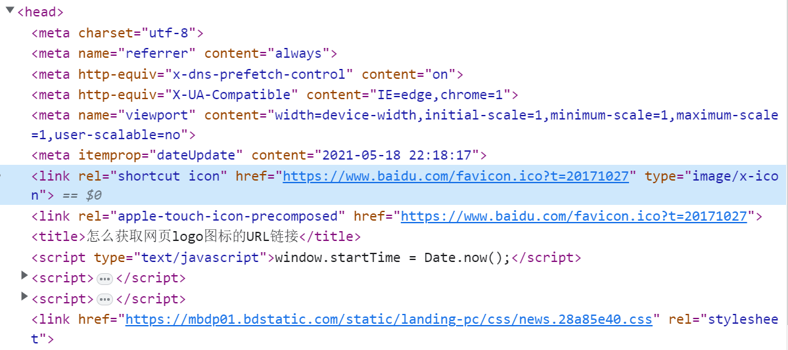
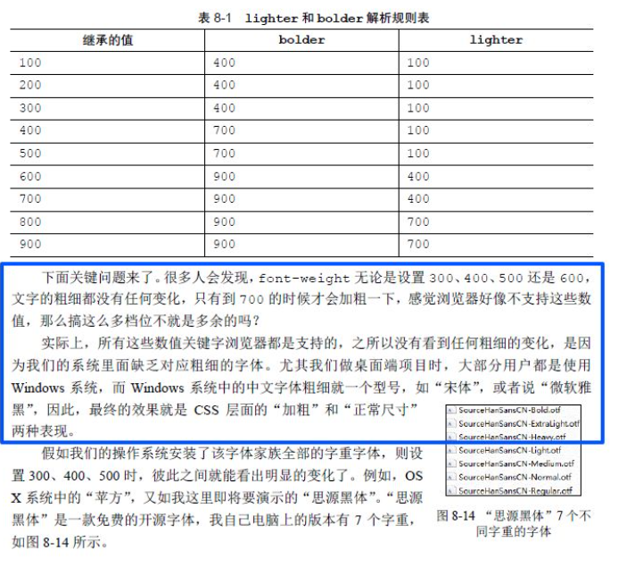

# 文章

## 2023

1、解决国内 GitHub 无法访问的问题

[github 不能访问，解决方案](https://blog.51cto.com/u_15812342/5723921){link=card}

:::tip GitHub 无法访问，主要有三种解决方法：

- 使用 [github520](https://github.com/521xueweihan/GitHub520)
- 配置 github 的 IP 到 host 文件中
- kExUe 上网解决一切问题

:::

2、DNS 做了什么

文章详细介绍了 DNS 的相关内容，从而让我们理解 github520 背后的工作原理。

[搞懂 DNS 做了什么，再试试 GitHub520 项目的加速效果](https://blog.csdn.net/a419240016/article/details/106514040){link=card}

3、GitHub 如何配置 SSH Keys

[Github 配置 ssh key 的步骤（大白话+包含原理解释）](https://blog.csdn.net/weixin_42310154/article/details/118340458){link=card}

:::tip
GitHub 配置了 SSH Keys 后，即可使用 ssh 链接与 GitHub 仓库进行远程交互，而无需 HTTPS 链接。

ssh 链接的好处是，当你无法访问 GitHub 时，也能通过 ssh 链接向仓库推送代码。
:::

4、GitHub 配置 personal access token

现在 GitHub 不再使用密码认证，转而使用 personal access token 进行认证，文章介绍了如何配置使用 personal access token。

[github 配置使用 personal access token 认证](https://www.jianshu.com/p/ab5977d763e9){link=card}

5、如何制作 GitHub 小徽章

文章介绍了如何制作与使用类似  的小图标。

[Github 上的小徽章制作与应用指南](https://www.cnblogs.com/singerw/p/14127815.html){link=card}
[如何在你的 GitHub 仓库介绍上加上小图标？](https://www.bilibili.com/read/cv16327331){link=card}

6、怎么获取网页 logo 图标的 URL 链接

[怎么获取网页 logo 图标的 URL 链接](https://baijiahao.baidu.com/s?id=1700106073888091496){link=card}

:::tip 获取网站 favicon 图标链接

- 网站首页后拼接 `/favicon.ico`，一般都会出来
- 点击 F12，寻找带有 `icon` 值的 `link` 标签

:::



7、用 CSS 画 `√、×` 等符号

文章介绍了如何用纯 CSS 去画出勾 √、叉 ×、三角形 △、大于号 ＞ 几类常见符号。

[简单的使用 css 画勾、叉、三角、大于号](https://blog.csdn.net/Luxuriant_tree/article/details/83181888){link=card}

8、CSS 实现超长文字溢出省略号

[CSS-文字溢出的省略号显示](https://blog.csdn.net/m0_72650596/article/details/127027051){link=card}

:::tip CSS 实现超长文字溢出省略号

超长文字溢出主要分为两类：单行溢出和多行溢出。

单行溢出比较常见：

```CSS
white-space: nowrap;
overflow: hidden;
text-overflow: ellipsis;
```

多行溢出只适用于 webkit 内核的浏览器：

```CSS
overflow: hidden;
text-overflow: ellipsis;
display: -webkit-box;
-webkit-line-clamp: 2;
-webkit-box-orient: vertical;
```

:::

9、CSS3 阴影效果使用

文章详细介绍了 CSS3 阴影属性 `box-shadow` 的使用方法。

```CSS
box-shadow: 1px 1px 1px #999;
```

[CSS3 阴影实现方法及技巧全解](https://www.w3cschool.cn/css3/css3-shadow.html){link=card}

10、`flv.js` API 中文文档

高手翻译的 `flv.js` API 中文文档。
[flv.js 中文 API 文档](https://www.jianshu.com/p/b58356b465c4){link=card}

官网 GitHub。
[flv.js API](https://github.com/bilibili/flv.js/blob/master/docs/api.md){link=card}

11、老板管理手册

红极一时的老板管理手册。

[全网都在疯传的《老板管理手册》(转)](https://zhuanlan.zhihu.com/p/537042061){link=card}

12、git 回退指定版本

[GIT 回退到指定版本的两种方法（reset/revert）](https://blog.csdn.net/L1147484597/article/details/128480953){link=card}

:::tip git 回退指定版本
git 回退到指定版本的两种方法：`git reset` 和 `git revert`。

- `git reset --hard 目标版本号`：会覆盖目标版本之后的所有版本
- `git revert -n 目标版本号`：仅仅撤销目标版本的提交，生成一个新的版本

:::

13、工作之余如何学习提升自我？

> 你要做的是，结合自己的目标和实际工作，确定自己的学习方向，在打实基础之外，学习有可能应用到你工作中的知识点

学以致用，不要为学而学，消费是生产的第一动力，实践是学习的第一目标。

[冴羽答读者问：如何学习更有计划性、提升更稳更快？](https://segmentfault.com/a/1190000042178486){link=card}

14、JS 正则表达式完整教程

大佬写的 JS 正则表达式教程，非常详实细致，可以说看完就是学会了。

[JS 正则表达式完整教程（略长）](https://juejin.cn/post/6844903487155732494){link=card}

15、`flv.js` 优化方案

文章介绍了前端直播常见的技术方案、`flv.js` 的基本原理及其优化方案。

[flv.js 的追帧、断流重连及实时更新的直播优化方案](https://www.cnblogs.com/xiahj/p/flvExtend.html){link=card}

16、TS 入门教程文章

文章详细介绍了 Typescript，是入门 TS 的不二首选。

[2023 typescript 史上最强学习入门文章(2w 字)](https://juejin.cn/post/7018805943710253086){link=card}

17、冴羽系列博客

冴羽大佬写的系列博客，包括 JavaScript 深入系列、JavaScript 专题系列、underscore 系列、ES6 系列等等，写得十分清晰详实。

[冴羽系列博客](https://github.com/mqyqingfeng/Blog){link=card}

18、小程序页面栈溢出报错 `navigateTo fail page limit exceeded`

小程序页面栈最多十层，反复使用 `navigateTo` 跳转页面，压入页面栈，会导致报错。

[小程序页面跳转，页面栈提示”navigateTo fail page limit exceeded“错误，解决办法](https://blog.csdn.net/qq_35310623/article/details/108082712){link=card}

19、`rpx` 和 `px` 单位的区别

`px` 是固定单位，`1px` 就是 1 像素；`rpx` 是自适应单位，根据屏幕的实际尺寸变化，`1rpx` 可能等于不同的像素。

[微信小程序中 rpx 和 px 的区别？](https://blog.csdn.net/weixin_43356308/article/details/115081242){link=card}

20、`!.` 是什么意思？

`!.` 是 TS 中的语法，称为非空断言操作符。它和 JS 的可选链操作符 `?.` 完全没有关系。

`!.` 是告诉 TS，这个值我保证不为空，TS 你可以不用进行检查。

因此，不建议使用 `!.`，因为实际上你并不能保证值不为空。

[Non-null Assertion Operator (Postfix!)](https://www.typescriptlang.org/docs/handbook/2/everyday-types.html#non-null-assertion-operator-postfix-){link=card}

[js 中‘!.’是什么意思？](https://www.zhihu.com/question/459179143){link=card}

21、何为 Docker？

文章介绍了 Docker 的基本知识，比较通俗易懂。

Docker 其实是一个容器。容器：搭建一套给程序运行的环境。只隔离应用程序运行时环境，共享操作系统。与虚拟机相比，更轻量级、占用资源更少。

[什么是 Docker？看这一篇干货文章就够了！](https://zhuanlan.zhihu.com/p/187505981){link=card}

22、SSH 登录 GitHub 报错 `Connection to xxx port 22: ...`

:::danger 最近使用 ssh 登录 GitHub 时报错
kex_exchange_identification: read: Software caused connection abort

banner exchange: Connection to xxx port 22: Software caused connection abort

fatal: Could not read from remote repository.

Please make sure you have the correct access rights and the repository exists.
:::

修改 ssh 的默认端口为 443 即可。

[坑：ssh: connect to host github.com port 22: Connection refused](https://zhuanlan.zhihu.com/p/521340971){link=card}

23、日常开发提升技术的 13 条建议

文章总结了平常开发过程当中 13 条提升自我技术的建议，小处着手，实用。


[我差点把同事卷跑了。。。](https://mp.weixin.qq.com/s/JQo9inrZ6eoBazDnxvkD8A){link=card}

24、nvm 的安装与基本使用

nvm 是管理 node 版本的快捷工具，使用它可以十分方便地切换 node 版本。

文章详细介绍了 nvm 的安装步骤与常用命令的使用。

```bash
nvm list     // 查看已安装的 node 版本
nvm install <version>       // 安装某个版本的 node，如：nvm install 12.22.22
nvm use <version>      // 使用某一版本的 node
nvm uninstall <version>   // 卸载指定版本的 node
```

[nvm 详细安装步骤以及使用（window10 系统）](https://blog.csdn.net/Anony_me/article/details/124153201){link=card}

25、运行 `nvm use xxx` 命令报权限不足

使用管理员身份运行 cmd 即可。

[nvm use 报错：You do not have sufficient privilege to perform this operation](https://blog.csdn.net/JudyC/article/details/121702250){link=card}

26、标准普尔家庭资产配置图

标准普尔家庭资产配置图是世界公认最合理的适合多数家庭的资产分配方式，可以参考学习，来对自己的资产进行配置。

需要注意几点：

- 该资产配置图是一个参考，每个人的实际情况都不同，需要灵活变通
- 此处的 10% 之类的百分比，基数是资产，而非收入。
- 每隔一段时间，需要进行资产的再配置。例如每隔半年时间，需对资产重新进行配置，这时候增加了半年的工资，这半年的收入也成为了资产的一部分。

[读懂“标准普尔家庭资产配置图”](https://zhuanlan.zhihu.com/p/357228526){link=card}

27、Taro 的 `Image` 图片组件宽高自适应

微信小程序给图片的宽高设置了固定值，因此无法通过设置 CSS 属性来实现宽高自适应。

使用 `Image` 的 `mode` 属性，设置为 `widthFix` 即可宽度不变，高度自适应。

```jsx
<Image src={imagePath} mode="widthFix" onClick={() => this.bigImage(imagePath)} />
```

[微信小程序——image 图片组件宽高自适应方法](https://blog.csdn.net/weixin_42326144/article/details/104817585){link=card}

[image 属性说明](https://developers.weixin.qq.com/miniprogram/dev/component/image.html){link=card}

28、Taro 全屏预览图片

`Taro.previewImage()` 方法，传入 `urls` 和 `current` 参数，分别是图片链接列表、当前预览的图片链接。

```js
bigImage = (url) => {
  const { imageSrcs } = this.state
  Taro.previewImage({
    current: url, // 当前显示图片的http链接
    urls: imageSrcs, // 需要预览的所有图片http链接列表
  })
}
```

[Taro.previewImage](https://taro-docs.jd.com/docs/apis/media/image/previewImage){link=card}

29、QPS 为何物？

QPS，Queries Per Second，每秒钟处理的请求数量。

2000 万 QPS 的场景：春晚抢红包。

[同事们天天谈论的 QPS、TPS、RT、吞吐量等词儿究竟是什么意思？](https://baijiahao.baidu.com/s?id=1764021596169092019){link=card}

## 2024

### 1、Chrome Perfonrmance 性能分析入门

文章介绍了 Chrome Performance 性能分析工具的基本使用。

[Chrome Performance 页面性能分析指南](https://zhuanlan.zhihu.com/p/163474573){link=card}

### 2、`block` 标签的作用

`block` 标签是微信小程序中的标签，充当一个容器，类似于 `view`。

:::tip GPT 的回答
`block` 标签在微信小程序中主要用作包装元素，它不会在页面上进行渲染，只接受控制属性。

使用 `block` 标签可以将多个组件包装起来，并在其内部使用 `wx:if` 控制属性。这样可以一次性判断多个组件标签是否需要显示，类似于 `view` 标签的功能。

例如，如果需要渲染一个包含多节点的结构块，可以使用 `block` 标签包裹 `wx:for` 语句，从而控制这一块的逻辑。

`block` 标签的中文翻译是‘块’，它的作用类似于一个容器，可以包含其他组件和逻辑，使得代码更加模块化和易于维护。
:::

[微信小程序中，block 的作用](https://www.cnblogs.com/a973692898/p/13131660.html){link=card}

### 3、某些移动安卓设备 `font-weight: 600` 不生效

在某些安卓的移动端设备上，`font-weight: 600` 不生效，字体并没有加粗。这是因为在某些设备上，缺少对某些字体的粗细支持。

一般而言，绝大多数设备支持对 400 和 700 的粗细字体样式。也就是常见的 `font-weight: normal` 和 `font-weight: bold`。

而苹果设备对字体粗细的支持程度做的比安卓好很多，可以看到不同数值粗细的变化。



[font-weight 失效移动安卓处理方法](https://blog.csdn.net/weixin_41697143/article/details/104517239){link=card}

### 4、iPhone 如何安装 whistle 证书

简要步骤：

- 扫描 whistle 二维码，用 Safari 下载证书。
- 安装证书。
- 开启信任证书。

[whistle苹果手机安装证书步骤](https://blog.csdn.net/qq_44859233/article/details/123834624){link=card}

### 5、SSR、SSG、CSR 前端渲染技术

SSR（Server Side Rendering）是服务器端渲染，SSG（Static Site Generation）是静态站点生成，CSR（Client Side Rendering）是客户端渲染。

文章介绍了三者的优缺点。

[一文搞懂：什么是SSR、SSG、CSR？前端渲染技术全解析](https://segmentfault.com/a/1190000044882791){link=card}

[服务端渲染 (SSR)](https://cn.vuejs.org/guide/scaling-up/ssr.html){link=card}

### 6、离线包简介

文章对 H5 离线包进行了基本介绍。

:::warning 离线包
离线包 是将包括 HTML、JavaScript、CSS 等页面内静态资源打包到一个压缩包内。预先下载该离线包到本地，然后通过客户端打开，直接从本地加载离线包，从而最大程度地摆脱网络环境对 H5 页面的影响。
:::

[离线包简介](https://help.aliyun.com/document_detail/59594.html){link=card}

### 7、H5 是什么

文章介绍了手机 APP 开发的基本概念，H5 其实就是混合应用（hybrid app）。

:::tip APP 技术分类
- 原生应用，native app
- Web 应用，Web app
- 混合应用，hybrid app
:::

[H5 手机 App 开发入门：概念篇](https://ruanyifeng.com/blog/2019/12/hybrid-app-concepts.html){link=card}

### 8、多个git仓库之间cherry-pick操作

文章介绍了如何在多个 git 仓库之间进行 cherry-pick 操作。例如，将 A 仓库某个分支的某个 commit 迁移到 B 仓库的分支上。

1. 在 B 仓库中，本地添加 A 库：`git remote add Aorigin https://xxx`;

2. `git fetch Aorigin` 同步 A 库的分支信息；

3. 在 B 库中所需分支上，执行 cherry-pick操作：`git cherry-pick [commitId]`，即可将 A 库的某个 commit 迁移到 B 库的分支上。

[多个git项目库之间的cherry-pick操作](https://blog.csdn.net/qq_40102178/article/details/123378200){link=card}

### 9、`splitChunks` 拆包重点属性详解

文章对 webpack 的 `splitChunks` 拆包配置重点属性进行了详细讲解，包括 `chunks`、`minSize`、`maxAsyncRequests`、`maxInitialRequests`、`cacheGroups` 属性。

```js
module.exports = {
  optimization: {
    splitChunks: {
      // 同步导入、异步导入的公共模块都会被抽离出来
      chunks: 'all',
      // 如果chunk体积小于10B，则不打包
      minSize: 10,
      // chunk体积大于500B的，则会被分包，每个chunk体积不得大于500B
      maxSize: 500,
      // 自定义chunk分组
      cacheGroups: {
        vendor: {
          name: 'vendor',
          test: /[\\/]node_modules[\\/]/,
          // 若某个模块同时匹配到vendor和utils，优先匹配高优先级的，即会被打包在utils生成的chunk中
          priority: 10,
          // 是否重用已存在的代码块，一般开启，可减少生成的chunk数量，优化浏览器缓存效率
          reuseExistingChunk: true,
        },
        utils: {
          name: 'utils',
          test: /[\\/]utils[\\/]/,
          priority: 20,
          reuseExistingChunk: true,
        }
      },
    }
  }
}
```

[webpack 拆包：关于 splitChunks 的几个重点属性解析](https://segmentfault.com/a/1190000042093955){link=card}

### 10、lighthouse 使用和性能优化

lighthouse 是一个开源工具，用于评估网站性能、可访问性、性能、可维护性等维度。

可以直接在 Chrome DevTools 中使用，也可以通过命令行工具使用。

[前端性能测试工具 Lighthouse(灯塔)使用](https://juejin.cn/post/7220230543005253691){link=card}

[利用LightHouse进行合理的页面性能优化，看这一篇就够了！](https://blog.csdn.net/Zong_0915/article/details/131773108){link=card}

### 11、Web 性能优化系列文章

Web 性能优化系列文章，包括 webpack 分包、图片优化、css 优化等内容，值得好好学习。

[Web 性能优化：理解及使用 JavaScript 缓存](https://segmentfault.com/a/1190000018589996){link=card}

### 12、Mac 录屏和制作 GIF 动图

在 Mac 上，按下 Shift-Command-5 以打开“截屏”并显示工具。

使用 keynote 来制作 GIF 动图。

[在 Mac 上截屏或录屏](https://support.apple.com/zh-cn/guide/mac-help/mh26782/mac){link=card}

[Mac上快速将视频转化为GIF动图](https://blog.csdn.net/ww2011/article/details/131651866){link=card}

### 13、requestAnimationFrame 介绍

文章介绍了 requestAnimationFrame 的含义、基本使用、性能优化、使用场景、兼容性等内容，看完可以对 requestAnimationFrame 有一个基本的了解。

[浅析requestAnimationFrame的用法与优化](https://segmentfault.com/a/1190000044314827){link=card}

### 14、postcss 为何物

文章从新人的角度详细介绍了 postcss 是什么，很适合对 postcss 没有概念的人初次了解 postcss。

[PostCSS 是个什么鬼东西？](https://segmentfault.com/a/1190000003909268){link=card}

### 15、前端实现PDF预览常见方案

小程序可以使用官方提供的 API：wx.openDocument(Object object)。

H5 可以使用 iframe 第三方插件 pdf.js。

[wx.openDocument(Object object)](https://developers.weixin.qq.com/miniprogram/dev/api/file/wx.openDocument.html){link=card}

[前端实现 PDF 预览的常见方案](https://juejin.cn/post/7143088940953075743){link=card}

[微信小程序使用webview打开pdf文档及显示网页内容](https://blog.csdn.net/blue__k/article/details/123401496){link=card}

### 16、什么是 CI/CD，持续集成、交付、部署？

> CI: Continuous Integration, CD: Continuous Delivery, CD: Continuous Deployment.

文章对 CI/CD 的基本概念进行了介绍，包括持续集成、持续交付、持续部署等内容，讲解比较通俗易懂，看完可以对持续集成、交付、部署有基本的概念。

持续部署，简单而言，就是提交代码后，自动构建，进行单元测试，自动部署到测试环境、预发布环境等，再自动部署到生产环境。

加快了代码提交到功能上线的整个流程的速度，保证新功能第一时间部署到生产环境被使用。

[一篇文章带你搞懂什么是 CI/CD - 持续集成、持续交付、持续部署？](https://blog.csdn.net/weixin_43750377/article/details/114160889){link=static}

### 17、跨域及其解决方案

文章详细介绍了跨域的相关概念，及其解决方案，总结得比较全面。

[JS中的跨域问题及解决办法汇总](https://blog.csdn.net/lareinalove/article/details/84107476){link=static}

### 18、express快速启动服务器

文章介绍了如何使用 express 快速启动本地服务器，十分简便。

[Express 项目启动](https://blog.csdn.net/weixin_44691608/article/details/109371958){link=static}

### 19、前端如何处理10万条数据

[前端工程师如何处理10万条数据](http://caibaojian.com/optimize-large-data.html){link=static}

### 20、Mac如何在finder中显示`.`开头文件

在 finder 里面按 ⌘⇧.（Cmd+Shift+.）键，即可切换隐藏文件的显示与隐藏。

[mac系统如何显示.开头的文件？](https://www.zhihu.com/question/40870712){link=static}

### 21、解决Windows删除node_modules太慢问题

安装 rimraf 工具，使用其进行删除。

```bash
npm install rimraf -g

rimraf node_modules
```

感觉并没有多快，也要三四分钟，不过是比直接删除快一点吧。

[如何快速删除node_modules文件夹（windows+linux）](https://blog.csdn.net/RingoH/article/details/117957190){link=static}

### 22、解决Chrome自动转换HTTPS的方法

第三种方法亲测有效。将该网站的不安全内容设置为允许。

[解决Chrome浏览器自动转换https的四种方法](https://blog.csdn.net/hgfzero/article/details/136912237){link=static}

### 23、纯CSS实现网格背景

作者介绍几种方法，使用纯 CSS，实现网页背景的网格效果。

[纯CSS实现网格背景](https://spacexcode.com/blog/pure-css-grid-line/){link=static}

### 24、快速开发AI的工作流模式

作者介绍了开发 AI 的工作流模式，不懂编程的人也能上手。

工作流模式：采用 AI 服务商提供的工作流（workflow），编排每个步骤，形成自动化操作。

一个免费的 AI 应用开发平台就是[扣子](https://www.coze.cn/)，这是字节跳动旗下的产品。

[AI 开发的捷径：工作流模式](https://www.ruanyifeng.com/blog/2024/10/coze.html){link=static}

### 25、前端常用公共CDN

文章罗列了常用的CDN。其中[字节跳动CDN](https://cdn.bytedance.com/)和[CDNJS](https://cdnjs.com/)可以访问。

[常用公共前端CDN库](https://segmentfault.com/a/1190000044938700){link=static}

### 26、vscode力扣插件使用

记得要登录，否则没法正常使用。

[vscode中配置 leetcode 插件](https://blog.csdn.net/chumingqian/article/details/138629649){link=static}

### 27、油猴插件

油猴（Tampermonkey）是一款浏览器插件，主要用于管理和运行用户脚本，以增强浏览器的功能和用户体验。‌ 它支持Chrome、Firefox、Safari等主流浏览器，用户可以通过安装油猴插件来定制网页内容、提高工作效率、屏蔽广告等。‌

油猴插件的主要功能包括：

- ‌定制网页‌：用户可以通过安装脚本自定义网页的样式、布局和功能。
- ‌提高效率‌：自动填写表单、批量下载图片等，节省大量时间。
- ‌屏蔽广告‌：屏蔽网页上的广告，提升浏览体验。
- ‌增强安全性‌：通过自定义脚本屏蔽跟踪器，保护用户隐私。

此外，油猴插件还具有以下特点：

- ‌灵活性‌：用户可以在 GreasyFork 等平台上找到大量的脚本资源，根据自己的需求选择安装。
- ‌安全性‌：虽然油猴本身是安全的，但用户需要谨慎选择脚本，避免潜在的安全风险。

[油猴插件，助力高效科研!](https://zhuanlan.zhihu.com/p/633014404){link=static}

## 2025

### 1、性能优化实战文章

性能优化系列实战文章，值得一看。

[前端性能优化实战 从 30s 到 2s](https://juejin.cn/post/7008072984858460196){link=static}

[关于首屏优化，我做了哪些](https://juejin.cn/post/7117515006714839047){link=static}

[尽早建立网络连接，以提升系统感知的网页速度](https://web.developers.google.cn/articles/preconnect-and-dns-prefetch?hl=zh-cn#resolve_domain_name_early_with_reldns-prefetch){link=static}

[带你玩转prefetch, preload, dns-prefetch，defer和async](https://segmentfault.com/a/1190000011577248){link=static}

[预加载系列一：DNS Prefetching 的正确使用姿势](https://segmentfault.com/a/1190000003944417){link=static}