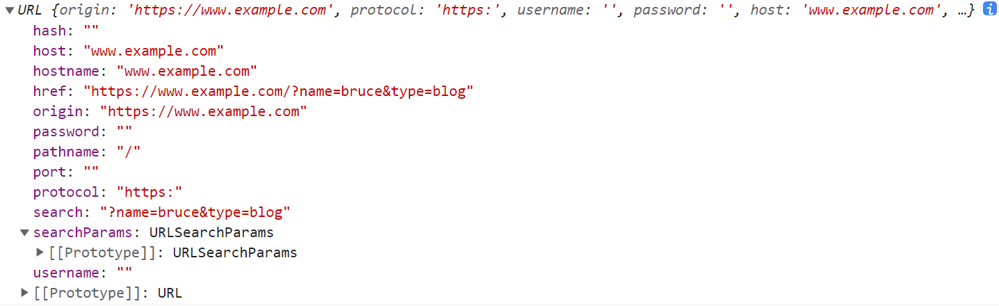

# 我的文章

## 如何获取 URL 查询参数值

### js 代码手撸

灵活度高，可进行更多自定义操作。

```js
const getSearchParams = (url) => {
  const searchIndex = url.indexOf('?')
  const searchParamsArray = url.slice(searchIndex + 1).split('&')
  return searchParamsArray.reduce((pre, cur) => {
    const [key, value] = cur.split('=')
    return {
      ...pre,
      [key]: decodeURIComponent(value),
    }
  }, {})
}

// { name: 'bruce', type: 'blog' }
getSearchParams('https://www.example.com?name=bruce&type=blog')
```

### 利用 `URLSearchParams`

```js
const searchParams = new URLSearchParams('name=bruce&type=blog')

searchParams.get('name') // 'bruce'
searchParams.has('type') // true
```

要把所有查询参数转换为对象，需要搭配使用 `entries()` 和 `Object.fromEntries()` 方法。

`entries()` 方法返回一个 `iterator`，还需进一步转换为对象。

```js
Object.fromEntries(searchParams.entries()) // { name: 'bruce', type: 'blog' }
```

需要注意的是，`URLSearchParams` 只能解析查询字符串，不能解析完整的 URL。因此若要使用其解析查询参数，需要事先提取出 URL 地址的查询字符串。

```js
const params = new URLSearchParams('https://www.example.com?name=bruce&type=blog')

params.get('name') // null
params.get('https://www.example.com?name') // 'bruce'
```

[MDN-URLSearchParams](https://developer.mozilla.org/zh-CN/docs/Web/API/URLSearchParams){link=card}

### 利用 `URL`

```js
const params = new URL('https://www.example.com?name=bruce&type=blog')
const searchParams = params.searchParams

searchParams.get('name') // 'bruce'
searchParams.get('type') // 'blog'
```

`URL` 可对 URL 地址进行更多维度的解析，其中 `searchParams` 和 `URLSearchParams` 返回的对象相同。



[MDN-URL](https://developer.mozilla.org/zh-CN/docs/Web/API/URL){link=card}

## Blob 对象

`Blob`，英文全称 `binary large object`，是指二进制类型大对象。

Blob 对象表示不可变的、类似文件对象的原始数据。即它是类似文件对象的二进制数据，可以像操作 File 对象一样操作 Blob 对象。但话又说回来，File 其实是继承自 Blob。

### 创建 Blob 对象

#### Blob 构造函数

`new Blob(blobData[, options])`

- `blobData` 参数：必须是一个数组，数组每个元素连接起来构成 Blob 对象的数据。

- 可选参数 `options`：一个对象，为 Blob 对象配置属性。常用的是 type 属性，指明多媒体 MIME 类型，默认值为 ""。

```js
const blob = new Blob(['hello'], { type: 'text/html' })
const blob2 = new Blob(['hello'], { type: 'application/pdf' })

// 栗子：
var data1 = 'a'
var data2 = 'b'
var data3 = "<div style='color:red;'>This is a blob</div>"
var data4 = { name: 'abc' }

var blob1 = new Blob([data1])
var blob2 = new Blob([data1, data2])
var blob3 = new Blob([data3])
var blob4 = new Blob([JSON.stringify(data4)])
var blob5 = new Blob([data4])
var blob6 = new Blob([data3, data4])

console.log(blob1) // Blob {size: 1, type: ""}
console.log(blob2) // Blob {size: 2, type: ""}
console.log(blob3) // Blob {size: 44, type: ""}
console.log(blob4) // Blob {size: 14, type: ""}
console.log(blob5) // Blob {size: 15, type: ""}
console.log(blob6) // Blob {size: 59, type: ""}
```

Blob 对象的 `size` 属性代表大小，单位是字节。

和 localStorage、sessionStorage 一样，创建 Blob 对象时会先把数据转换成字符串。

`JSON.stringify(data4)` 的结果是 `"{"name": "abc"}"`，正好 14 个字节（不包括最外面的引号）。而创建 blob5 的时候，先调用 data4 的 `toString()` 方法，将对象转换为字符串 `"[Object Object]"`，正好 15 个字节，blob5 保存的数据实际上是 `"[Object Object]"`。

因此，无法将 `Symbol` 构建为 Blob 对象，因为 `Symbol` 类型的值无法转换成字符串。

```js
var s = Symbol()
var symbolBlob = new Blob([s])
```

#### slice() 方法

Blob 对象的 slice 方法返回一个新的 Blob 对象，包含源 Blob 对象指定范围的数据。
该方法与数组的 `slice` 方法用法类似。`contentType` 指明这个新的 Blob 对象的 `MIME` 类型。

```js
Blob.slice([start[, end[, contentType]]])
var data = "abcdef";
var blob1 = new Blob([data]);
var blob2 = blob1.slice(0,3);

console.log(blob1);  //输出：Blob {size: 6, type: ""}
console.log(blob2);  //输出：Blob {size: 3, type: ""}
```
