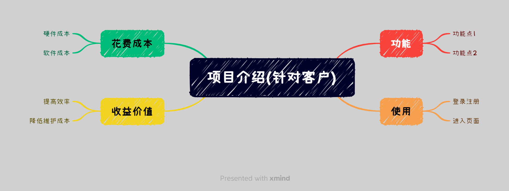

# 个人成长

## 言论

### 程序员的发展

1、毕业出来工作前三年，不要过于看重薪资之类的东西，首要任务是**夯实自己的技术基础**。

2、要**在某个细分领域研究得有深度**，这体现的是你的学习研究能力，以及对技术的热情。如果有需要，别人也会相信你能够在新的领域也可以快速成长。

3、学习知识，既要有广度，也要在某个细分点有深度。

4、**万不得已，不要去外包公司**。大部分面试官其实对外包是抱有歧视与偏见的。

5、如果可以，尽量去大公司镀镀金，如 BAT。既可以促进个人成长开阔视野，也能积累优质人脉资源，同时，有大厂资历的人，未来如果要去一些小公司的管理岗也相对更有优势。

6、不要闭塞在技术世界里，有机会**多和不同行业的人交流学习，多去看看外面的世界**，看看社会时代的热点和发展趋势。这有利于打开自己的格局，未来的转行。

7、搞搞副业也是很好的，很多打工人可能是某家公司的老板。自己的能力管不住名校高材生，但管一群文化水平比自己低的人还是可以的。

8、对于 35 岁的坎，不必过于焦虑。

- 提高自己的技术竞争力，社会淘汰的，始终是那些学艺不精的人；
- 锻炼除技术外的能力，如管理能力，去管理层；
- 去小公司，降低期望还是可以找到工作的；
- 回去二三线城市或者老家，开个店、搞搞副业，未尝不是一条道路；
- 考公务员；

**不要把自己局限得太死**。

9、每去一家公司，都想想自己想在这家公司获取学习什么，每一次跳槽除了薪资还有其它东西是你想要得到、提高的。比如如果想提高自己的管理沟通能力，可以申请多给自己机会做组长、项目经理等管理岗位。

### [关于开会与文档](https://www.ruanyifeng.com/blog/2023/11/weekly-issue-279.html)

[document first, meeting second](https://vadimkravcenko.com/shorts/proper-documentation/){link=card}

文档第一，开会第二。公司，尤其是初创公司，应少开会，多写文档。

1. 创业公司争分夺秒，会议非常浪费时间。当然，并非所有的会议都是不必要的，但是原则上，会议应该尽量不开，参加人员也应该尽量精简。

2. 不断开会恰恰表明一个更深层次的问题：缺乏清晰、可访问和可靠的文档。

如果每个流程都有文档，就不需要一个小时的会议来澄清。如果每个决定都有文档，就不需要满屋子的人来理解它的理由。如果每个团队都有文档，就不需要在新成员加入团队时进行小组讨论。

3. 会议创造了生产力的幻觉。你以为，开会提高了生产力，实际上它们正在阻碍它。

每一次不必要的会议都是一种浪费。那些时间本可以用来改进算法，哪怕用来学习或者休息也很好啊。从本质上看，减少会议不仅仅可以节省时间，还可以让大家更专注、更多创新和创造，这恰恰是创业公司的命脉。

4. **会议往往会自动膨胀**。你召集了半小时的会议，快速讨论一个小问题。结果，在会议中发现一个意想不到的问题非常重要，你们的争论就一口气持续了两个小时。

5. 会议不容易确定细节。你提到了一些别的事情，或者说话含糊不清，再或者双方沟通不畅，会议就会变得不那么清晰。解决方法到头来还是要写下来。

6. **会议往往偏向声音最大的人，而不一定偏向那些有最好想法的人**。这会扼杀创新和思想的多样性。作为对比，文档提供了公平的竞争环境，每个团队成员都可以表达他们的想法和见解，它促进了一种深思熟虑和反思的文化，而不是草率的判断和冲动的决定。

7. 结论：你的时间和资源最好花在记录上，而不是花在会议上。大多数会议很容易被一份精心起草的、提供相关数据和建议、并征求反馈意见的文件所取代。

:::tip comments

- 大部分时候写文档确实比开会好，但是问题是现在的人几乎不怎么仔细去看文档，如果没有人督促，懒惰属性会占据上风。如何更好的促进人们去写文档以及促进人们阅读文档是一个问题。

- 当领导其实不需要什么特别大的能力，往往团队里说话最多的人就成了领导。

:::

### 日常开发提升技术的 13 条建议

1、打好基础深入学习**语言特性**

2、熟悉掌握常用的**开发工具**

3、总结日常工作**踩过的坑**

4、阅读项目中**优秀的代码和设计文档**

5、总结通用的技术方案

6、参与技术讨论，积极技术分享

7、主人翁意识，积极攻克项目难题

8、思考项目中哪些可以提升效率

9、**熟悉业务**，让自己不容易被替代

10、多看看你的系统，可能存在哪些问题，如接口耗时

11、学以致用，将理论知识应用到实际项目中

12、阅读一些优秀**框架的源码**

13、**多编码**，养成变成习惯

## 项目管理

### 优秀项目评选的点

- 哪些事情地方可以提现出我们是一个 team，团队协作。

- 项目中最大的收获，可以应用到后续工作的东西。

- **目标要明确清晰，不需要很宏大的东西**。

- 具体的工作安排表，要有**具体的东西可以给别人感知**，或者具体的过程举几个例子。

- 项目的创新点，**每个需求不会是简单的重复**，肯定有不一样的地方，**不一定要多么复杂高大上的创新点，一个细微之处的创新即可**。

- 项目的难点，有困难就要有解决方法，说出是怎么解决的。

- 要有总结思考，回顾反思。从项目中反思有哪些东西以后需要做的、加强的（比如系统初始化资源太多太杂，需要整理一份文档，加快初始化资源创建速度），哪些是可以保持再接再厉的。

## 演讲与表达

### 讲什么

要点：**针对不同的目标听众，讲他们想要听到的要点**。

1、寻找要点

不同听众关注的方面不同。

对于客户，他们关心的是项目有什么功能、怎么使用、要花多少钱、能赚多少钱等。项目的背景、技术实现等要点他们并不关心。

对于领导，他们关心的是项目的成本、技术实现、价值等方面。项目背景不是他们想听的，因为他们对项目的背景可能比你还要清楚，毕竟项目是他们批下来的。

对于同事，他们关心的则是项目的背景、技术实现、价值等方面，他们可能对项目的背景不太了解。

接着用思维导图梳理内容要点，采用**目标-要点-细节**的形式。

2、过滤内容

针对已罗列的要点，从三个方面考虑是否可以剔除。

- 已知的：听众是否已经知道这个要点。如领导之于项目背景，领导可能已经很清楚项目的背景，可以提一嘴或者直接略过。

- 重复的：要点是否重复。如项目功能和怎么使用，在介绍功能点时可能已经顺带介绍怎么使用，可以考虑将二者合并。

- 无关的：要点是否是听众想听的。如客户之于技术实现，他们毫不关心。

3、提炼要点

电梯法则：在30s内说清主题。

如何在30s之内表达清楚自己的意图，并得到想要的答案。

想清楚，才能说清楚。

### 怎么准备演讲

3-3-30-3 principle。

- 3days：提前3天排练，对着大纲，对着听众。
- 3hours：提前3小时到现场排练，检查设备。
- 30minutes：感受现场和舞台氛围，再排练一遍。
- 3minutes：进入状态，让听众认识你。