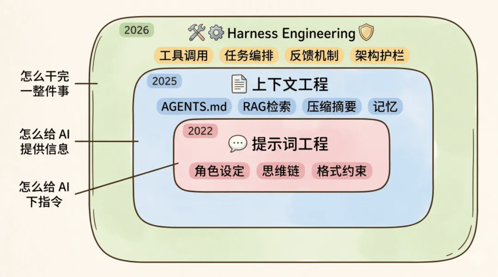

# Harness Engineering

[今年爆火的 Harness Engineering 是什么？一文彻底讲明白](https://mp.weixin.qq.com/s/fi6vXpQxNRzFhIpNGGwgWw){link=static}

Harness 不是什么新技术，它本质上是把我们已有的工程经验，系统地应用到 AI 上。

## Harness Engineering 是什么

Harness Engineering 驾驭工程。就是围绕 AI 模型搭建一整套工作流程和工作环境。

Agent = 模型 + Harness。

围绕 AI 模型搭建的工具、规则、流程、检查机制，全都属于 Harness 的范畴。

## 发展历程

### 1. 提示词工程

通过对话让 AI 听懂你的需求。

常用技巧：给 AI 设定角色、约束输出格式、用思维链让它一步步思考、给几个示例让它模仿。可以有效提高 AI 的输出质量。

```
你是一个资深的开发工程师。
请一步一步思考这个问题。
参考这个示例来回答。
使用 JSON 格式输出回答。
```

### 2. 上下文工程

更进一步，在对的时候把对的信息喂给 AI。

比如写 AGENTS.md 规则文件让 AI 了解项目背景，用 RAG 让 AI 能检索到相关资料，对过长的上下文做压缩和摘要。

### 3. Harness Engineering

除了关注给 AI 提供什么信息，还要关注给它配什么工具、大任务怎么拆分成小步骤分批完成、出了问题怎么自己检查和修复、怎么防止代码质量随着迭代慢慢下滑。

让 AI 持续靠谱地完成整个任务。

三者是层层包含的关系。

- 提示词是最内层，关注的是「怎么给 AI 下指令」
- 上下文包裹着提示词，关注的是「怎么给 AI 提供信息」
- Harness 把它们全部包在里面，关注的是「怎么让 AI 持续靠谱地干完一整件事」



## 5 个核心模块

Harness Engineering，其实就是把我们平时开发的一套流程规矩，搬到 AI 去。

### 1. 上下文架构：让 AI 了解项目背景和规矩

> 常见内容：AGENTS.md 规则文件、分层文档、上下文压缩、渐进式加载

开发之前，我们需要了解项目背景、需求内容、开发规范、设计方案等，AI 也是一样的。

AGENTS.md 文件就可以用来描述这些内容。

但是，AI 能处理的上下文空间是有限的，不能把所有规则都塞到一个文件里，这样反而会导致 AI 忽略了重要的信息。

OpenAI 团队的经验：

- 把 AGENTS.md 当成一个 目录 来用，只写大概 100 行的摘要和索引，然后在 docs/ 目录下放详细的设计文档。
- AGENTS.md 里面写清楚「前端规范看 docs/FRONTEND.md、安全相关看 docs/SECURITY.md」这样的指引，AI 需要什么就去读对应的文件。

这种 按需加载 的思路，就是上下文架构的核心。

### 2. 执行能力：给 AI 装上手脚和工具

> 核心内容：工具调用、Bash 终端、文件系统、MCP、Browser Use、Skills 技能包

执行能力指的是给 AI 配备工具，增强 AI 的能力，不然 AI 就只能输出文本。

例如，配一个终端环境来执行命令、给它文件系统来读写代码、给它浏览器来测试网页。

### 3. 任务编排：给 AI 安排好工作计划

> 核心内容：Plan Mode、任务拆分、增量开发、文档沉淀、SubAgents 并行执行

我们面对一个大需求大任务，都会拆分成多个小任务，一个一个完成。AI 也是一样的。

如果一下子让 AI 处理一个复杂的大任务，那么它的上下文空间很容易被耗尽，后面生成的内容质量会直线下降。

我们可以这样做：

- 拆分任务，每次只做一个功能点。可以使用 Plan Mode 让 AI 出方案，人工确认后再开始执行。
- 沉淀文档。每做完一个功能点，可以沉淀一下文档，说明当前完成了什么功能、用了什么技术方案、还有什么功能没做。这样就算新开窗口，AI 也能快速了解开发进度。
- 并行执行。对于多个独立的子任务，可以用 SubAgents 并行执行，提高效率。就是开多个窗口同时执行任务。其实我们平时的前后端并行开发，也是这个思路。

### 4. 反馈机制：让 AI 自己检查自己的工作

> 核心内容：Linter 代码检查、自动化测试、Browser Use 端到端测试、Agent 互审

我们开发完任务，肯定都要自测嘛，AI 也是一样的。

我们可以这样做：

- 自测。AI 开发完任务后，可以让它跑 Linter 检查代码语法规范、跑自动化测试验证功能、甚至打开浏览器自己跑一遍。
- 改 bug。测试没通过，AI 自己自动自取报错信息并修复问题。也可以人工检查，把错误信息反馈给 AI。
- code review。可以让多个 Agent 互审代码。

Claude Code、Codex 作为编码主力，Cursor、Trae、CodeBuddy 用来阅读代码，做 Code Review。

### 5. 架构护栏：防止代码越改越乱

> 核心内容：架构约束 Linter、Pre-commit Hooks、垃圾回收机制、Git 检查点

我们在代码评审时，遇到一些不符合架构规范的代码，会让开发者修改。AI 也是一样的。

我们可以这样做：

- 写一些 Linter 来强制执行架构层面的约束。这里的 Linter 查的是架构规则，比如 UI 层不能直接调用数据库层、模块间的依赖必须是单向的。通过 Pre-commit Hooks，如果违反了规则，就拦住。
- OpenAI 还搞了一套叫「垃圾回收」的机制，定期让 AI 扫描代码库，检查有没有偏离架构规范的地方，自动提交修复 PR，持续偿还技术债。
- Git 存档。每完成一个功能就用 Git 提交一次代码，记录代码的每个历史版本，相当于给项目打了一个存档点，万一后面改出了问题，可以随时恢复到之前的状态。

这里的 Linter 和检查代码格式的不同，可以通过分析代码的抽象语法树（AST）​ 和导入/依赖关系来实现。比如一个自定义规则可以解析所有 import 语句，如果发现位于 src/ui/ 目录下的文件引入了 src/database/ 目录下的模块，就直接报错，以此强制执行“UI不直接依赖数据库”的规则。

## 实战

现在从 0 开发一个系统。

### 1. 方案设计阶段

先人工思考核心的技术方案：比如前端要什么界面、需不需要后端、核心功能使用什么技术栈。这一步其实也可以用其他 AI 辅助思考。

接着把这个初始化方案丢给 AI，让它补充熙杰。并且开启 Plan Mode，先出方案人工确认，而不是直接写代码。

这里就是「上下文架构」和「任务编排」的应用。方案里面是包含了任务拆分的。

### 2. 编码开发阶段

给 AI 配备 Firecrawl、Context7 MCP，让 AI 能够抓取网页内容、获取最新的技术文档。（执行能力）

核心的视频下载功能做完后，让 AI 沉淀了一总结文档，记录当前的功能、架构和实现细节（任务编排、上下文架构），然后提交到 Git（架构护栏）。

### 3. 测试验证阶段

让 AI 自己打开浏览器测试，Browser Use。人工测试发现的问题也丢给 AI 修复。（反馈机制）

### 4. 功能扩展阶段

扩展的功能是相互独立的，可以并行开发，用 SubAgents 同时执行多个子任务。（任务编排）

同样地，完成一个功能点，沉淀文档，提交 Git。

## 如何快速上手

1）做项目之前先写好 AGENTS.md 规则文件，把项目背景、技术栈、代码规范都告诉 AI

2）先让 AI 出方案并人工确认，再动手写代码

3）用 MCP 和 Skills 给 AI 配好工具，让它能联网查资料、获取最新的信息

4）做完功能一定要让 AI 自己跑测试验证，确保能正常运行

5）每完成一个功能就让 AI 沉淀文档并提交代码，作为 AI 的「存档点」

以前做项目，工程师的核心工作是写代码。现在 AI 能帮我们写越来越多的代码了，但这也意味着我们得花更多精力在需求分析、方案设计、任务拆解、质量把关这些事情上。