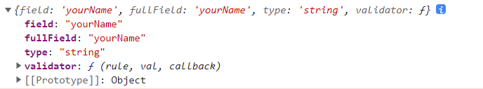
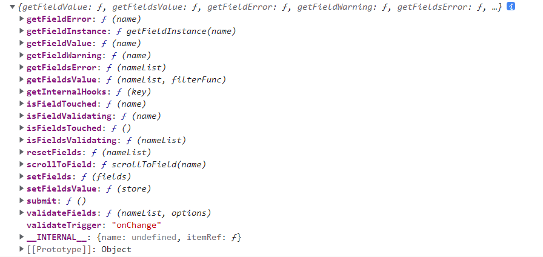
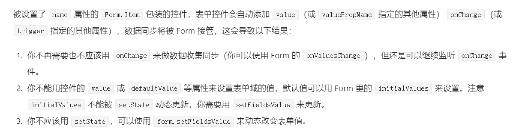
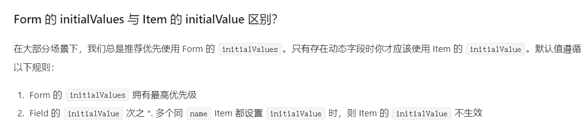
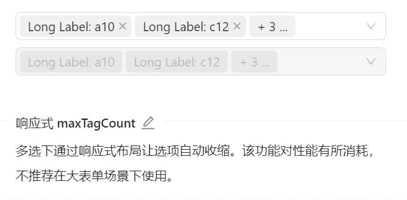

# Ant Design 用法与坑点总结

[Ant Design](https://ant.design/index-cn){link=card}

[Ant Design 国内高速镜像](https://ant-design.antgroup.com/index-cn){link=card}

## 前言

Ant Design 是蚂蚁出品的出色优秀的 React 组件库，相信使用 React 进行管理系统开发的小伙伴们或多或少都接触过 Ant Design。很多公司基于 React 开发的管理端系统也都是使用 Ant Design 的组件库。

因此，了解 Ant Design 的常见用法与坑点还是有必要的。

本系列文章针对 Ant Design 一些官方文档虽有提及，但是容易被忽略的，又比较重要常见的用法进行总结。同时对工作使用过程当中遇到的坑点进行归纳。

:::tip
文章使用的 4.x 版本的 Ant Design。
:::

## Form 触发表单验证

`Form.Item` 的 `rules` 表单验证规则，需要调用 `validateFields()` 方法触发表单验证才能真正阻止不符合规则的表单的提交。

如果仅仅定义了 `rules` 规则，而没有调用 `validateFields()` 方法进行验证，即使表单没通过校验，依然可以提交。

```jsx
const handleSubmit = async () => {
  // 触发表单验证，注意该方法是异步的
  await form.validateFields()
  submitForm()
}
```

```jsx
<Form.Item
  name="mobile"
  label="手机号码或座机"
  rules={[
    { required: true, message: '请输入手机号码或座机号码' },
    { pattern: /......../, message: '请输入正确的手机号或座机号' },
  ]}
>
  <Input placeholder="请输入手机号或座机号" />
</Form.Item>
```

## Form 自定义校验规则的两种写法

自定义表单校验规则灵活度更高，可以针对一些特殊场景、特殊规则进行设置。日常工作使用概率比较大。

**方式一：对象写法**

```jsx
<Form.Item
  name="mobile"
  label="手机号"
  rules={[
    {
      // rule 参数是 Form.Item 的校验规则 rules
      validator: (rule, value) => {
        if (!value) {
          return Promise.reject(new Error('请输入手机号'))
        }
        if (value.length > 11) {
          return Promise.reject(new Error('手机号不超过11位'))
        }
        return Promise.resolve()
      },
    },
  ]}
>
  <Input placeholder="请输入手机号" />
</Form.Item>
```

`itemProps` 具体内容：



**方式二：函数写法**

```jsx
<Form.Item
  name="password"
  label="账户密码"
  rules={[
    ({ getFieldValue }) => ({
      validator(_, value) {
        if (!value) {
          return Promise.reject(new Error('请输入账户密码'))
        }
        if (value === getFieldValue('password')) {
          console.log('getFieldValue() 方法获取对应字段名的值')
        }
        return Promise.resolve()
      },
    }),
  ]}
>
  <Input placeholder="请输入你的账户密码" />
</Form.Item>
```

方式二可以取到 `Form` 表单实例的所有方法：



相比而言，方式二的自由度更高，功能也相对更强大，因为提供了 `getFieldValue()` 等方法使用。

但个人认为，方式一的写法更加优雅，并且一般情况下，方式一也足够使用了，可以解决日常工作大部分自定义表单验证规则的场景。

[getFieldValue](https://ant.design/components/form-cn#forminstance){link=card}

## Select 下拉框设置初始值

在开发工作中，需要为 `Form` 表单中的 `Select` 下拉框设置初始值的情况也屡见不鲜。下面介绍两种常见的解决方式。

### 使用 `setFieldsValue()`

该方法通过利用 `Form` 表单实例提供的 `setFieldsValue()` 方法设置初始值，在页面初次展示即可调用该方法设置初始值。

```jsx
const showModal = () => {
  form.setFieldsValue({
    color: "red",
    ...
  });
  ...
}
```

```jsx
<Form.Item name="color" label="车辆外表颜色" rules={[{ required: true, message: '请选择车辆外表颜色' }]}>
  <Select placeholder="请选择车辆外表颜色" {...props}>
    <Option key={1} value="red">
      红色
    </Option>
    <Option key={2} value="yellow">
      黄色
    </Option>
    <Option key={3} value="blue">
      蓝色
    </Option>
  </Select>
</Form.Item>
```

### 使用 `initialValues` 属性

通过使用 `Form` 表单的 `initialValues` 属性，也能够为表单域设置初始值。

```jsx
const initialValues = { color: 'yellow' }

<Form form={form} initialValues={initialValues}>
  <Form.Item name="color" label="车辆外表颜色" rules={[{ required: true, message: '请选择车辆外表颜色' }]}>
    <Select placeholder="请选择车辆外表颜色" {...props}>
      <Option key={1} value="red">
        红色
      </Option>
      <Option key={2} value="yellow">
        黄色
      </Option>
      <Option key={3} value="blue">
        蓝色
      </Option>
    </Select>
  </Form.Item>
</Form>
```

### 使用 `initialValue` 属性

通过使用 `Form.Item` 的 `initialValue` 属性，单独为该表单项设置初始值，不影响其他表单项。

```jsx
<Form.Item name="color" label="车辆外表颜色" rules={[{ required: true, message: '请选择车辆外表颜色' }]} initialValue="blue">
  <Select placeholder="请选择车辆外表颜色" {...props}>
    <Option key={1} value="red">
      红色
    </Option>
    <Option key={2} value="yellow">
      黄色
    </Option>
    <Option key={3} value="blue">
      蓝色
    </Option>
  </Select>
</Form.Item>
```

### 错误：使用 `defaultValue` 属性

当时遇到这个问题时，我第一个想法是利用 `Select` 下拉框的 `defaultValue` 属性，来设置默认值，如下代码：

```jsx
<Form.Item name="color" label="车辆外表颜色">
  <Select defaultValue="red">
    <Option key={1} value="red">
      红色
    </Option>
    <Option key={2} value="yellow">
      黄色
    </Option>
    <Option key={3} value="blue">
      蓝色
    </Option>
  </Select>
</Form.Item>
```

但是该方法并不生效，这是因为 `Form.Item` 设置了 `name` 属性，Ant Design 增加了限制，导致其不生效。

:::tip
设置了  name  属性的  Form.Item  包裹的表单控件，**不能用控件的  value  或  defaultValue  来设置表单域的值，默认值可以用  Form  的  initialValues  来设置**。
:::

### 官网文档相关说明





相关链接：

[Form 表单](https://ant.design/components/form-cn){link=card}

## Input 输入框内容去除头尾空白

在填写 `Form` 表单时，我们往往会遇到这样的需求：`Input` 输入框输入的内容头尾不允许带有空格。有点类似于 `trim()` 方法的功能。

针对这个功能，整体上有 3 中实现思路：

- 在输入的过程中，禁止输入空白符
- 利用表单验证，如果头尾存在空格，则提示用户
- 提交表单时，自动去除头尾空白，用户无感

### 禁止输入空格

该方式利用 `Form.Item` 的 `getValueFromEvent` 属性，这个属性可以设置如何把输入的内容转换为表单项实际获取的值。需要传入一个函数。

```js
<Form.Item
  name="city"
  label="城市"
  getValueFromEvent={(e) => e.target.value.replace(/(^\s*)|(\s*$)/g, '')}
  // getValueFromEvent={(e) => { console.log(e.target); return e.target.value; }}
>
  <Input />
</Form.Item>
```

在上述代码中，`e.target.value` 即为输入框输入的值，而 `Form.Item` 表单项实际获取到的值是 `e.target.value.replace(/(^\s*)|(\s*$)/g, '')`。

这种方法在页面交互上表现为用户无法输入空格，其实用户体验并不友好，让人感觉更像是这个输入框有 bug，竟然不让我输入空格。

### 利用表单验证

使用上面提到的表单验证方法。

```js
<Form.Item name="city" label="城市" rules={[{ pattern: /(^\S)((.)*\S)?(\S*$)/, message: '前后不能有空格' }]}>
  <Input />
</Form.Item>
```

```js
<Form.Item
  name="city"
  label="城市"
  rules={[
    {
      validator: (_, value) => {
        const reg = /(^\s+)|(\s+$)/
        if (reg.test(value)) {
          return Promise.reject(new Error('前后不能有空格'))
        }
        return Promise.resolve()
      },
    },
  ]}
>
  <Input />
</Form.Item>
```

这里就体现出了自定义表单验证的优势，写法灵活，且在某些场景下能降低思考难度。`/(^\s+)|(\s+$)/` 和 `/(^\S)((.)*\S)?(\S*$)/` 这两个正则，显然前者更容易写出来，后面这个不查半天资料都难写。

### 提交表单调用 `trim()` 方法

这种方法就是随便用户输入，在提交表单的时候再使用 `trim()` 方法去除前后空格。

但是既然设置了这个规则，还是有必要让用户知道，给用户提示，因此综合下来第二种方法是比较推荐的解决办法。

## `Form.Item` 如何包裹多个标签内容

### 问题背景

开发工作中遇到一个需求：需要在开关表单项后面增加一句文本内容，如下图所示。


### 错误方法

不能直接把文本内容直接放在 `Form.Item` 里面，否则后面提交表单时 `form.getFieldsValue()` 无法正确获取开关的值。

```jsx
// 始终只能取到初始值
<Form.Item label="开关" name="isOpen" initialValue={false} valuePropName="checked">
  <Switch />
  <span>这是文本内容</span>
</Form.Item>
```

后面又尝试把文本内容放在 `Form.Item` 后面，但样式始终存在问题，`Form.Item` 如果增加自定义样式，其样式会乱，比如表单标签被开关挡住了，总之也不行。

### 解决方案

经过高人支招，了解了`Form.Item` 表单项如果需要在表单后面增加额外的标签组件，需将整体封装为一个大的组件写在 `FormItem` 内，否则 `form` 表单无法获取到正确的表单值。

```js
const SwitchCom = (props) => {
  const { value, type } = props

  const handleChangeSwitch = (val) => {
    form.setFieldsValue({ isOpen: val })
  }

  return (
    <div style={{ display: 'flex', alignItems: 'center' }}>
      <Switch checked={value} onChange={(val) => handleChangeSwitch(val)} />
      <span style={{ color: '#bfbfbf', marginLeft: '10px' }}>这是文本内容</span>
    </div>
  )
}
```

```jsx
<Form.Item label="开关" name="isOpen" initialValue={false}>
  <SwitchCom type="good" />
</Form.Item>
```

:::tip 注意事项
1、需要给 `Switch` 的 `onChange` 事件绑定函数，开关改变时手动修改表单的 `isOpen` 值。

2、`props` 里有表单的 `value` 值，若 `Form.Item` 设置了 `valuePropName` 就是对应的字符串，也可以传入自定义参数。
:::

## `Table` 合并单元格

`Table `合并单元格的写法，官网上的写法是错的.

```js
render: (text, record, index) => {
  return {
    children: text,
    props: {
      // 合并单元格
      rowSpan: [0, 5].includes(index) ? 5 : 0,
    },
  };
}
```

## 下拉框选择多个显示省略号

设置 `maxTagCount="responsive`，根据屏幕大小自适应展示多少个 tag。

```jsx
<Select mode="multiple" maxTagCount="responsive">
  <Option value="1">Option 1</Option>
  <Option value="1">Option 1</Option>
</Select>
```



## Input 输入框使用 defaultValue 内容无法改变

在遍历渲染时，多个 Input 输入框使用 defaultValue，只会记录第一个 Input 的初始值，后面的都和第一个一样。

解决方法：给 Input 输入框增加 key 属性。

```jsx
const columns = [
  {
    title: '名称',
    dataIndex: 'name',
    render: (text, record) => {
      return (
        <Input key={nanoid()} defaultValue={text} />
        <Input key={String(Date.now())} defaultValue={text} />
        // 这个不行，不知道为何
        <Input key={new Date().toTimeString()} defaultValue={text} />
      );
    },
  },
]
```

[react input的defaultValue不会变化](https://blog.csdn.net/weixin_42881588/article/details/124406364){link=card}