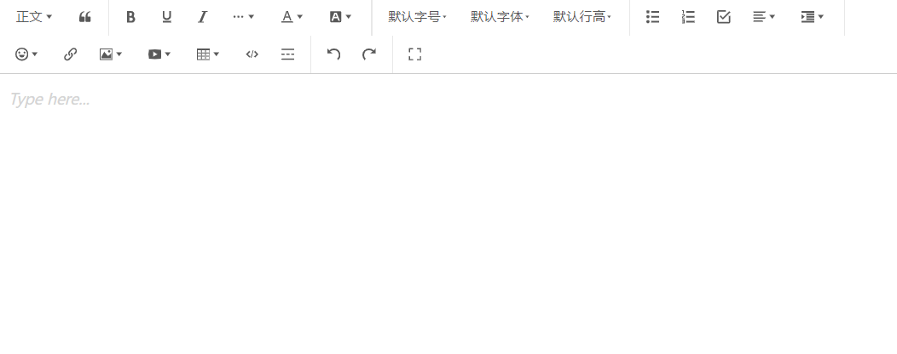

# 富文本编辑器

[wangEditor](https://www.wangeditor.com/){link=card}

## 前言

最近有一个需求，要做一个富文本编辑器，要有最基础的功能，比如字体样式加粗斜体、标题、字体颜色、插入图片等，同时还需要根据标题生成目录。

像这种功能肯定不能自己造轮子，于是调研了一些第三方开源富文本编辑器，最初的技术选型是 [braft-editor](https://github.com/margox/braft-editor)。但在开发时发现用起来不简便，在有经验的前辈的推荐下最终选择了 [wangEditor](https://www.wangeditor.com/)，功能丰富，用法也更简易。



:::tip
以下内容都基于 React 进行开发。
:::

## 安装

```sh
npm install @wangeditor/editor

npm install @wangeditor/editor-for-react
```

## 基础用法

```jsx
import React, { useState, useEffect } from 'react'
import { Editor, Toolbar } from '@wangeditor/editor-for-react'
import { IDomEditor, IEditorConfig, IToolbarConfig } from '@wangeditor/editor'
import '@wangeditor/editor/dist/css/style.css'

function MyEditor() {
  const [editor, setEditor] = useState(null)
  // 编辑器内容
  const [html, setHtml] = useState('<p>hello</p>')

  // 工具栏配置
  const toolbarConfig = {}

  // 编辑器配置
  const editorConfig = {
    placeholder: '请输入内容...',
  }

  // 及时销毁 editor
  useEffect(() => {
    return () => {
      if (editor == null) return
      editor.destroy()
      setEditor(null)
    }
  }, [editor])

  return (
    <>
      <div style={{ border: '1px solid #ccc', zIndex: 100 }}>
        <Toolbar editor={editor} defaultConfig={toolbarConfig} mode="default" style={{ borderBottom: '1px solid #ccc' }} />
        <Editor defaultConfig={editorConfig} value={html} onCreated={setEditor} onChange={(editor) => setHtml(editor.getHtml())} mode="default" style={{ height: '500px', overflowY: 'hidden' }} />
      </div>
      <div style={{ marginTop: '15px' }}>{html}</div>
    </>
  )
}

export default MyEditor
```

## 工具栏配置

## 图片自定义上传与回显

## 目录生成
