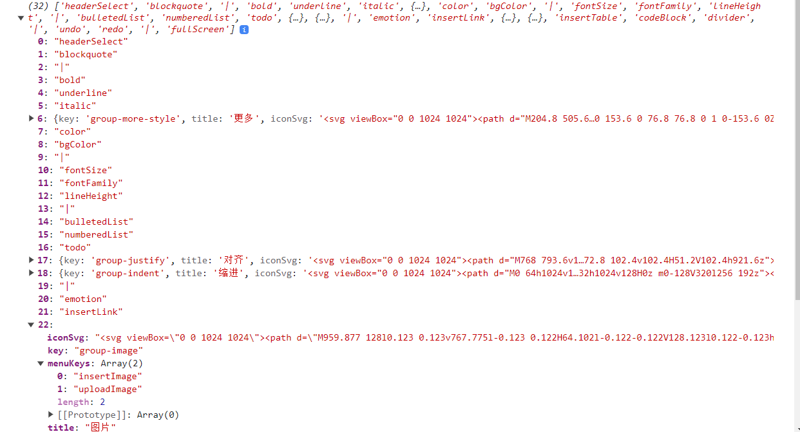
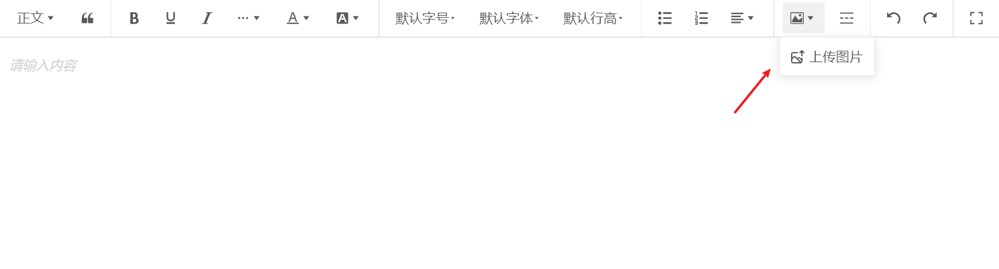
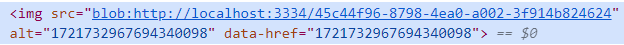

# 富文本编辑器

[wangEditor](https://www.wangeditor.com/){link=card}

## 前言

最近有一个需求，要做一个富文本编辑器，要有最基础的功能，比如字体样式加粗斜体、标题、字体颜色、插入图片等，同时还需要根据标题生成目录。

像这种功能肯定不能自己造轮子，于是调研了一些第三方开源富文本编辑器，最初的技术选型是 [braft-editor](https://github.com/margox/braft-editor)。但在开发时发现用起来不简便，在有经验的前辈的推荐下最终选择了 [wangEditor](https://www.wangeditor.com/)，功能丰富，用法也更简易。


:::tip
以下内容都基于 React 进行开发。
:::

## 安装

```sh
npm install @wangeditor/editor

npm install @wangeditor/editor-for-react
```

## 基础用法

```jsx
import React, { useState, useEffect } from 'react'
import { Editor, Toolbar } from '@wangeditor/editor-for-react'
import '@wangeditor/editor/dist/css/style.css'

function MyEditor() {
  const [editor, setEditor] = useState(null)
  // 编辑器内容
  const [html, setHtml] = useState('<p>hello</p>')

  // 工具栏配置
  const toolbarConfig = {}

  // 编辑器配置
  const editorConfig = {
    placeholder: '请输入内容...',
  }

  // 及时销毁 editor
  useEffect(() => {
    return () => {
      if (editor == null) return
      editor.destroy()
      setEditor(null)
    }
  }, [editor])

  return (
    <>
      <div style={{ border: '1px solid #ccc', zIndex: 100 }}>
        <Toolbar editor={editor} defaultConfig={toolbarConfig} mode="default" style={{ borderBottom: '1px solid #ccc' }} />
        <Editor defaultConfig={editorConfig} value={html} onCreated={setEditor} onChange={(editor) => setHtml(editor.getHtml())} mode="default" style={{ height: '500px', overflowY: 'hidden' }} />
      </div>
      <div style={{ marginTop: '15px' }}>{html}</div>
    </>
  )
}

export default MyEditor
```

## 工具栏配置
该富文本编辑器提供的功能太丰富了，实际上用不着那么多，而且有些特殊样式的回显存在问题，例如表格，因此需要隐藏工具栏某些工具菜单，不提供相关功能。

### `getConfig()` 获取工具栏配置

```js
import { DomEditor } from '@wangeditor/editor'
const toolbar = DomEditor.getToolbar(editor)
const curToolbarConfig = toolbar.getConfig()
console.log(curToolbarConfig.toolbarKeys) // 菜单的key顺序和分组
```
`curToolbarConfig.toolbarKeys` 的内容如下。




### `excludeKeys` 排除某些菜单
如果仅仅想排除掉某些菜单，其他都保留，可以使用 `excludeKeys` 来配置。

写菜单的 key 值即可，菜单 key 通过 `toolbarKeys` 获取查看。

```js
if (curToolbarConfig) {
  curToolbarConfig.excludeKeys = [
    'emotion', // 表情
    'insertTable', // 插入表格
    'insertImage', // 网络图片
  ];
}
```

可以看到，表情、插入表格、网络图片等菜单都隐藏了。



### 完整代码

```js
useEffect(() => {
  if (editor) {
    const toolbar = DomEditor.getToolbar(editor);
    const curToolbarConfig = toolbar?.getConfig();
    if (curToolbarConfig) {
      curToolbarConfig.excludeKeys = [
        'emotion',
        'insertTable',
        'insertImage',
      ];
    }
  }

  return () => {
    if (editor === null) return;
    editor.destroy();
    setEditor(null);
  };
}, [editor]);
```

## 图片自定义上传与回显

一般情况下，上传图片的时候就需要将图片存到后端，因此需调用后端接口。

可使用编辑器提供的 `customUpload` 方法自定义上传图片，在上传图片时调用接口存储图片，同时将图片插入到编辑器里。

```jsx
import React, { useState, useEffect } from 'react'
import { Editor, Toolbar } from '@wangeditor/editor-for-react'
import '@wangeditor/editor/dist/css/style.css'

function MyEditor() {
  const [editor, setEditor] = useState(null)
  // 编辑器内容
  const [html, setHtml] = useState('<p>hello</p>')

  // 工具栏配置
  const toolbarConfig = {}

  // 编辑器配置
  const editorConfig = {
    placeholder: '请输入内容...',
    MENU_CONF: {},
  }
  editorConfig.MENU_CONF.uploadImage = {
    async customUpload(file, insertFn) {
      const formData = new FormData();
      formData.append('file', file);
      const id = await xxx(formData);
      const url = window.URL.createObjectURL(file);
      const href = id;
      const alt = id;
      // 插入图片
      insertFn(url, alt, href);
    },
  };

  // 及时销毁 editor
  useEffect(() => {
    return () => {
      if (editor == null) return
      editor.destroy()
      setEditor(null)
    }
  }, [editor])

  return (
    <>
      <div style={{ border: '1px solid #ccc', zIndex: 100 }}>
        <Toolbar editor={editor} defaultConfig={toolbarConfig} mode="default" style={{ borderBottom: '1px solid #ccc' }} />
        <Editor defaultConfig={editorConfig} value={html} onCreated={setEditor} onChange={(editor) => setHtml(editor.getHtml())} mode="default" style={{ height: '500px', overflowY: 'hidden' }} />
      </div>
      <div style={{ marginTop: '15px' }}>{html}</div>
    </>
  )
}

export default MyEditor
```

:::tip 注意事项
`insertFn(url, alt, href)` 三个参数分别对应 `` 标签的 `src`、`alt`、`data-href` 属性，其中 `data-href` 是 wangEditor 为图片标签自定义的属性。
:::



## 文章图片回显

图片成功自定义上传后，就会面临下一个问题：如何回显文章图片。

文章编辑完成保存后，一般情况下我们会调用后端接口，将编辑器生成的 HTML 文本存储到后端。而文章的回显，就是把后端返回的 HTML 文本展示到编辑器里。

### 文章内容回显

若不考虑图片的回显，仅仅是文章文本内容的回显，操作非常简单，将返回的 HTML 文本设置到编辑器内容里即可。

```js
const getDocumentDetail = useCallback(async () => {
  try {
    const docContent = await api({ id });
    setHtml(docContent);
  } catch (err) {
    console.log(err);
  }
}, []);
```

### 图片链接替换

上传图片时，由于我们可以获得上传的文件的 `file` 对象，因此利用 `window.URL.createObjectURL` 方法即可直接生成本地的 `blob` 地址链接进行图片的展示。

但，在回显文章内容时，保存的 `blob` 链接已经不可再用。

因此，需要根据保存在 `` 标签里的 `data-href` 属性的图片 id 拼接出一个正确的图片地址，这个图片地址如何生成，需要后端接口配合。

再利用正则表达式，**将其 `` 标签的 `src` 属性替换为可使用的图片地址**，即可正确展示图片。

```js
const replaceImgReg = //g;

const getPicUrl = (id) => {
  // 根据后端提供的接口拼成可展示的图片链接
  return `https://pic/${id}`;
};

const getDocumentDetail = useCallback(async () => {
  try {
    const docContent = await api({ id });

    if (docContent) {
      const content = docContent.replace(
          replaceImgReg,
          (_, picId) => ``
        );
      setHtml(content);
    }
  } catch (err) {
    console.log(err);
  }
}, []);
```

## 目录生成

目录生成主要有两部分内容：编辑器内容改变实时生成目录、点击目录跳转到对应标题位置。

### 生成目录

生成目录的整理思路是：当编辑器内容发生改变时，遍历编辑器区域里的 `<h>` 标签，提取标签内的文本，得到文章的目录。

要点：

- wangEditor 的编辑器区域默认存在一个名为 `docContent` 的 id，可据此选择到编辑器区域元素。

- `querySelectorAll` 选择页面元素。

- `innerText` 属性提取标签文本。

- 给编辑器的标题标签设置 id 属性，点击目录跳转到标题需用到 id。

```js
useEffect(() => {
  const docContent = document.querySelector('#docContent');
  const eles = docContent?.querySelectorAll('h1,h2,h3,h4,h5,h6');
  const links = [];
  if (eles) {
    eles.forEach((item, index) => {
      links.push(item.innerText);
      item.setAttribute('id', `mulu${index}`);
    });
  }
  setCatalogList(links);
}, [html]);
```

### 点击目录跳到对应标题

主要思路：点击目录，将页面滚动到 id 对应的标题位置。

```jsx
const handleclickCatalog = (index) => {
  setTimeout(() => {
    const dom = document.getElementById(`mulu${index}`);
    if (dom) {
      dom.scrollIntoView();
    }
  }, 100);
};

<div>文档目录</div>
  {catalogList?.map((text, index) => {
    return (
      <a
        key={index}
        onClick={() => handleclickCatalog(index)}
      >
        {text}
      </a>
    );
  })}
</div>
```

`scrollIntoView` 方法简介：将调用这个方法的元素，移动到父元素（可滚动的）的可视区域。

[scrollIntoView](https://developer.mozilla.org/zh-CN/docs/Web/API/Element/scrollIntoView){link=card}

[滚动到可视区域](https://juejin.cn/post/7208367266533048378){link=card}