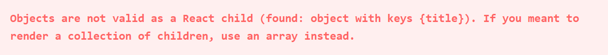
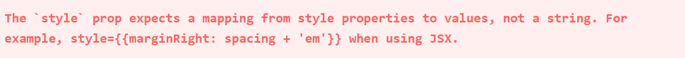
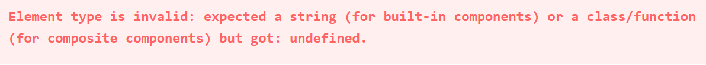
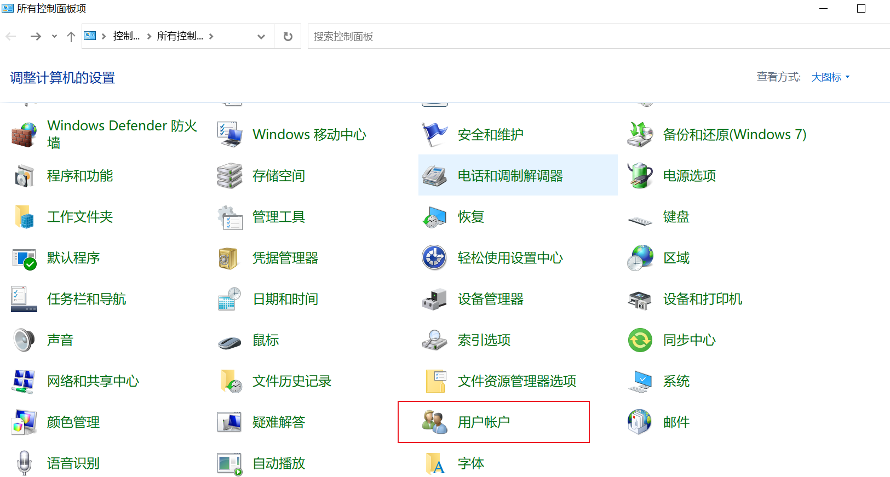
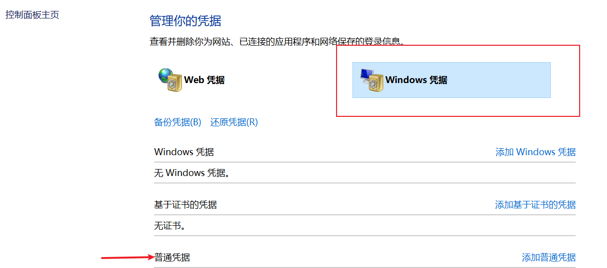
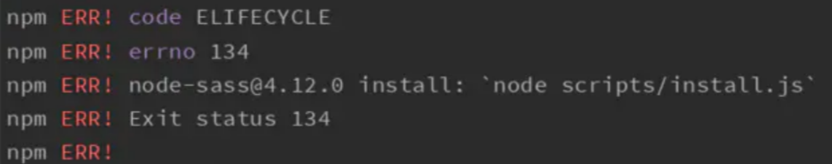
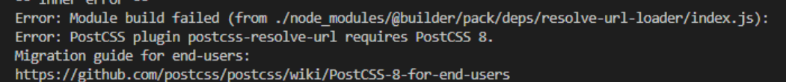

# 那些年，被各种 Error 折磨的瞬间

## React Error

### React error #31



错误原因：

React 的 render 函数只能渲染指定的返回值类型，包括 `string`、`number`、`JSX 对象`，以及它们组成的数组。

若返回了普通的对象，如 `{name: 'React'}`，则会报该错误。

```js
const obj = { name: 'react' };

function demo() {
  return (<>{obj}</>);
}
```

解决方法：渲染结构返回正确的类型。

[Error: Minified React error #31](https://legacy.reactjs.org/docs/error-decoder.html/?invariant=31&args%5B%5D=object%20with%20keys%20%7Btitle%7D&args%5B%5D=){link=card}

一个实际生产环境遇到该报错的案例，深入源码层面寻找剖析错误根源。

[React#31 error，让我熬夜让我秃](https://zhuanlan.zhihu.com/p/367874784){link=card}

### React error #62



错误原因：JSX 对象的 style，即行内样式书写有误。style 应为对象，不能是字符串。

```js
function demo() {
  return (
    <div style="color: red">
      demo text
    </div>
  );
}
```

解决方法：正确书写行内样式。

```js
function demo() {
  return (
    <div style={{ color: "red" }}>
      demo text
    </div>
  );
}
```

[Error: Minified React error #62](https://legacy.reactjs.org/docs/error-decoder.html/?invariant=62){link=card}

### React error #130



错误原因：JSX 节点没正确引入，是个 `undefined`。

```js
// 这里TabPane最终是个undefined
const { TabPane } = Tabs.TabPane;

function demo() {
  return (
    <TabPane>
      demo text
    </TabPane>
  );
}
```

解决方法：正确引入，确保是个正确的 JSX 节点。

```js
const { TabPane } = Tabs;

function demo() {
  return (
    <TabPane>
      demo text
    </TabPane>
  );
}
```

[Error: Minified React error #130](https://legacy.reactjs.org/docs/error-decoder.html/?invariant=130&args%5B%5D=undefined&args%5B%5D=){link=card}

### React error #185

错误原因：写了死循环，导致栈溢出。

在 `render` 方法或 `componentWillUpdate`、`componentDidUpdate` 钩子中调用 `setState` 可能会出现该错误。

```jsx
class demo extends React.Component {
  state = {
    loading: true,
  };

  render() {
    const { loading } = this.state;
    this.setState({ loading: !loading });
    return (<div>2322</div>);
  }
}
```

解决方法：不要再 `render` 等方法里调用 `setState`。

## Taro

### taro_base1.js Cannot read properties of undefined (reading 'call')

#### 问题描述

生产环境首页出现 JS 报错，导致页面异常：

```
TypeError: Cannot read properties of undefined (reading 'call')
```

**报错文件**：`https://example.com/taro_base1.js:1:1111`

**错误堆栈**：

```
TypeError: Cannot read properties of undefined (reading 'call')
  at nt.clearCallBacks (taro_base1.js:1:1111)
  at Ke (taro_base1.js:1:1234)
  at tt (taro_base1.js:1:3211)
```

#### 报错位置

`taro_base1.js` 是 Nervjs（Taro 1.x 的类 React 渲染引擎）的打包产物。报错位置还原后对应 Nervjs `Component` 基类的 `clearCallBacks` 方法：

```javascript
// Nervjs Component 基类
nt.prototype.clearCallBacks = function() {
  for (
    var e = this._pendingCallbacks.length;
    this._dirty ? this._pendingCallbacks.length : e;
  ) {
    this._pendingCallbacks.shift().call(this); // ← 报错在这里
    e--;
  }
};
```

当 `this._pendingCallbacks.shift()` 返回 `undefined` 时，对其调用 `.call(this)` 就会抛出 `Cannot read properties of undefined (reading 'call')`。

#### 直接原因：嵌套 setState 回调引发竞态条件

`init` 方法中，`onConfirm` 和 `onCancel` 使用了 **async 函数 + 双层嵌套 setState 回调** 的写法：

```typescript
// ❌ 修改前：嵌套 setState
onConfirm: async () => {
  this.setState(
    { isOpened: false },                                    // 第 1 层 setState
    () => this.setState({ isShow: false }, opt.onConfirm),  // 第 2 层 setState（在 clearCallBacks 循环中触发）
  );
},
```

**问题机制**：

1. 用户点击确认按钮，触发 `onConfirm`
2. 第 1 层 `setState({ isOpened: false }, callback)` 将 `callback` 推入 `_pendingCallbacks` 队列
3. Nervjs 执行组件更新（`Ke` 函数），更新完成后调用 `clearCallBacks()` 遍历执行队列中的回调
4. `clearCallBacks` 的 `for` 循环中，`shift()` 取出 callback 并执行
5. callback 内部又调用了第 2 层 `setState({ isShow: false }, opt.onConfirm)`，这会**在循环执行过程中再次向 `_pendingCallbacks` 数组推入新元素**，并触发新的组件更新
6. 由于 `_dirty` 状态在循环中发生变化，循环条件 `this._dirty ? this._pendingCallbacks.length : e` 的判断出现不一致
7. 最终 `shift()` 从已被清空的数组中取值，返回 `undefined`，触发 `.call(this)` 报错

简言之：**`setState` 回调中嵌套调用 `setState`，导致 Nervjs 内部的 `_pendingCallbacks` 队列在清理过程中被并发修改，产生了竞态条件。**

#### 解决方案

`example.tsx` — `init` 方法。

修改前：

```typescript
onConfirm: async () => {
  this.setState(
    { isOpened: false },
    () => this.setState({ isShow: false }, opt.onConfirm),
  );
},
onCancel: async () => {
  this.setState(
    { isOpened: false },
    () => this.setState({ isShow: false }, opt.onCancel),
  );
},
```

修改后：

```typescript
onConfirm: () => {
  this.setState({ isOpened: false, isShow: false }, () => {
    if (typeof opt.onConfirm === 'function') {
      opt.onConfirm();
    }
  });
},
onCancel: () => {
  this.setState({ isOpened: false, isShow: false }, () => {
    if (typeof opt.onCancel === 'function') {
      opt.onCancel();
    }
  });
},
```

修改要点：

| 修改点 | 说明 |
|--------|------|
| 合并 `setState` | 将 `{ isOpened: false }` 和 `{ isShow: false }` 合并为一次 `setState` 调用，消除嵌套，从根源上避免在 `clearCallBacks` 循环中再次修改 `_pendingCallbacks` |
| 去掉 `async` | 原函数体内没有 `await`，`async` 标记不必要，且会将函数返回值包装为 Promise，增加不确定性 |
| 增加 `typeof` 防御检查 | 在执行 `opt.onConfirm` / `opt.onCancel` 前检查其是否为函数，防止非函数值意外被调用 |

#### 经验总结

1. **避免在 `setState` 回调中嵌套 `setState`**：这是 Nervjs（以及早期 React）中容易引发竞态的反模式。如果需要同时更新多个状态，应合并为一次 `setState` 调用。
2. **生产环境压缩代码的排查思路**：通过错误堆栈中的字符偏移量（如 `1:38320`）定位到压缩代码的具体位置，再结合框架源码还原逻辑，是排查此类问题的有效方法。
3. **竞态条件难以稳定复现**：此类 bug 依赖特定的执行时序，在开发环境中不一定能触发，但在生产环境的特定机型/性能条件下会暴露。

## Git

### 根据远程分支创建本地分支报错

```bash
git checkout -b dev origin/dev
```

错误提示：
```bash

fatal: 'origin/dev' is not a commit and a branch 'dev' cannot be created from it
```
错误原因：远程没有 `dev` 这个分支。

解决方法：`git pull` 拉取最新远程代码，再执行创建分支命令。

### `fatal: Authentication failed for ''`

错误原因：git 账号改了密码，需要重新输入密码，但用户名或密码输错了。

解决方法：

1. 检查密码

先检查用户名和密码是否正确，本人就是用户名输错了。

2. git 命令

输入以下命令，删除本地 git 凭据，这样下次 git 就会要求输入用户名和密码。

```bash
git config --system --unset credential.helper
```

再输入以下命令，重新生成本地凭据文件，通常是 `~/.git-credentials`。

```bash
git config --global credential.helper store
```

最后再执行 `git pull` 命令，会提示输入账号密码。

3. 修改 Windows 用户凭据

入口：控制面板-用户账户-管理你的凭据-Windows凭据。

找到对应的 git 网站，编辑用户名和密码，保存即可。






### ssh 登录 GitHub 报错：Connection to xxx port 22: Software caused connection abort

修改 GitHub 的端口为 443。

```bash
# edit this file, if there not, create one
vim ~/.ssh/config

# add the content below to the file
# then it will use port 443 when ssh connect to github
Host github.com
Hostname ssh.github.com
Port 443

# test if it works
# if it works, it shows tip: Hi xxxxx! You've successfully authenticated, but GitHub does not provide shell access
ssh -T git@github.com
```

[ssh: connect to host github.com port 22: Connection refused](https://zhuanlan.zhihu.com/p/521340971){link=card}

### ssh 登录 Github 报错

ssh 登录 GitHub 报错：kex_exchange_identification: read: Connection reset by peer Connection reset by 20.205.243.166 port 22

[ssh 登录 GitHub 报错](https://www.cnblogs.com/liuhanxu/p/16025861.html){link=static}

## NPM

### npm ERR! code ELIFECYCLE



错误原因：`node_modules` 中下载的依赖包的版本，和 `package-lock.json` 中记录的版本发生冲突。

解决方法：清空缓存，删除 `node_modules` 和 `package-lock.json`，重新安装依赖包。

```bash
npm cache clean --force
# 强制删除 node_mudules 及其内容
rm -rf node_modules
rm package-lock.json
npm install
```

:::tip rm 命令
`rm` 命令是 Linux 中用于删除文件或目录的命令。有如下的参数。
- `-r` 递归删除目录及其内容。
- `-f` 强制删除文件，不给提示。
- `-i` 交互模式，在删除前给出提示。
- `-v` 显示删除的详细信息。
:::

### PostCSS plugin postcss-resolve-url requires PostCSS 8



错误原因：postcss 版本不对。

解决方法：重新安装对应版本。

```bash
npm install @postcss8.4.6 -D
```

### 安装依赖报错：npm WARN tar ENOENT: no such file or directory 

错误原因：依赖包有问题。

解决方法：删除 `package-lock.json`，重新安装依赖包。

```bash
rm package-lock.json
npm install
```

### eslint 编译报错 Cannot read property ‘range’ of null

具体看看文章，当时自己怎么解决的忘记了。

[彻底解决 Cannot read property ‘range‘ of null 错误的几个方案和后期造成的一劳永逸的方案](https://wanglaibin.blog.csdn.net/article/details/103904790){link=card}

[【解决方案】ESLINT 报错: Cannot read property 'range' of null](https://blog.csdn.net/u013243347/article/details/104426531){link=card}

## 小黑窗命令

### rm 删除命令报错

在 Windows cmd窗口运行 `rm -rf` 命令报错：`rm 不是内部或外部命令，也不是可运行的程序`。

错误原因：`rm -rf` 是 Linux 命令，在 Windows 中不支持。

解决方法：Windows 里使用 `rimraf` 命令。

### rimraf 命令报错

在 Windows cmd窗口运行 `rimraf` 命令报错：`rimraf 不是内部命令`

错误原因：`rimraf` 是 Node.js 包，在 Windows 中不支持。

解决方法：使用 `npm install -g rimraf` 命令全局安装，再输入命令。