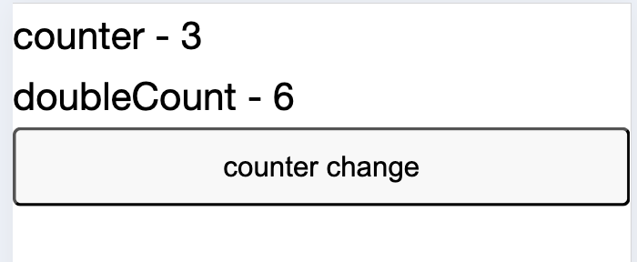
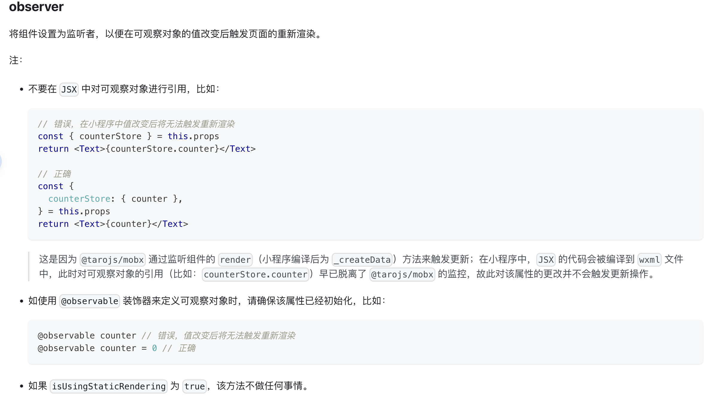
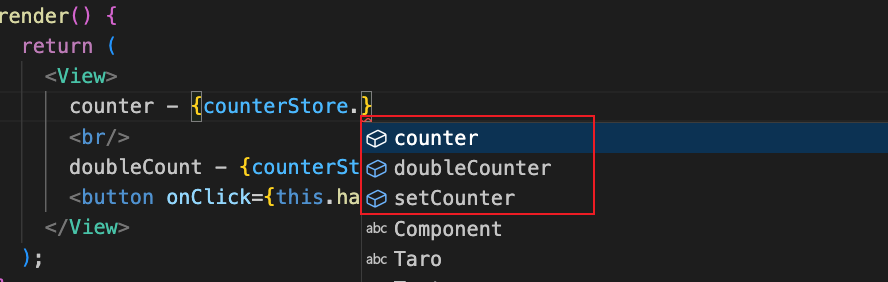
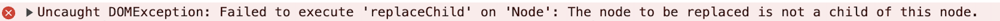

# Mobx 那些事儿

[Mobx](https://mobx.js.org/README.html){link=card}

[Mobx 中文文档](https://cn.mobx.js.org/){link=card}

[Taro 使用 Mobx](https://docs.taro.zone/en/docs/mobx/){link=card}

Mobx 的两个主要作用：

- 全局存储数据。
- 响应式修改页面。

其中后者是最重要的作用，当数据发生改变时，使用到该数据的页面自动更新数据。需要正确使用 Mobx 才能达到响应式效果（在类前增加 `@observer` 装饰器），否则就只是单纯地存储数据。

## Taro 中使用 Mobx

### 定义 `store`

```js
// src/store/counterStore.js
import { action, observable, computed } from 'mobx';

export default class CounterStore {
  /**
   * 计数君
   */
  @observable counter = 0;

  /**
   * 计算属性，计算两倍counter
   */
  @computed get doubleCounter() {
    return this.counter * 2;
  }

  @action.bound
  setCounter = (n) => {
    return this.counter = n;
  }
}
```

### 设置 store 入口

```js
// src/store/index.js
import CounterStore from './counterStore';

/**
 * store入口
 */
const store = {
  counterStore: new CounterStore(),
};

export default store;
```

### `Provider` 全局设置 store

```jsx
// app.jsx
import Taro, { Component } from '@tarojs/taro'
import { Provider } from '@tarojs/mobx'
import Index from './pages/index'
import store from './store/index'

class App extends Component {
  config = {
    pages: ['pages/index/index'],
    window: {
      backgroundTextStyle: 'light',
      navigationBarBackgroundColor: '#fff',
      navigationBarTitleText: 'WeChat',
      navigationBarTextStyle: 'black',
    },
  }

  render() {
    return (
      <Provider store={store}>
        <Index />
      </Provider>
    )
  }
}

Taro.render(<App />, document.getElementById('app'))
```

### `inject` 页面中注入使用 store

```jsx
import Taro, { Component } from '@tarojs/taro';
import { observer, inject } from '@tarojs/mobx'
import { View } from '@tarojs/components';

@inject('counterStore')
@observer // 实现响应式关键装饰器
class Test extends Component {
  handleClick = () => {
    const { counterStore } = this.props;
    counterStore.setCounter(counterStore.counter + 1);
  }

  render() {
    const { counterStore: { counter, doubleCounter }} = this.props;

    return (
      <View>
        counter - {counter}
        <br/>
        doubleCount - {doubleCounter}
        <button onClick={this.handleClick}>counter change</button>
      </View>
    );
  }
}

export default Test;
```
### 页面效果

点击按钮，counter 和 doubleCounter 都会自动更新。



### 官方文档用法补充

Taro 官方文档中特别说明不要在 JSX 中对可观察对象进行引用，否则值改变后无法触发重新渲染。



这应该只是针对小程序的限制，在 H5 中 `counterStore.counter` 的写法同样可以触发重新渲染。

```jsx
@inject('counterStore')
@observer
class Test extends Component {
  handleClick = () => {
    const { counterStore } = this.props;
    counterStore.setCounter(counterStore.counter + 1);
  }

  render() {
    const { counterStore } = this.props;

    return (
      <View>
        counter - {counterStore.counter}
        <br/>
        doubleCount - {counterStore.doubleCounter}
        <button onClick={this.handleClick}>counter change</button>
      </View>
    );
  }
}
```

## 自定义用法

使用官方文档的标准用法，在书写代码的过程中会存在两点不方便的地方。

1. 使用 store 无法触发代码提示。如果忘记 store 中的内容需要切换到 store 文件中查看复制。
2. 使用 store 需要 `this.props.xxxStore` 进行使用，不方便。虽然可以将 store 设置为类状态，但也需要 `this.xxxStore` 才可使用。



自定义用法通过在页面中直接引入 store，而非注入全局提供的 store，来解决以上两个问题。

```jsx
import Taro, { Component } from '@tarojs/taro';
import { observer, inject } from '@tarojs/mobx'
import { View } from '@tarojs/components';
import store from '../../store';

const { counterStore } = store || {};

@observer
class Test extends Component {
  handleClick = () => {
    counterStore.setCounter(counterStore.counter + 1);
  }

  render() {
    return (
      <View>
        counter - {counterStore.counter}
        <br/>
        doubleCount - {counterStore.doubleCounter}
        <button onClick={this.handleClick}>counter change</button>
      </View>
    );
  }
}

export default Test;
```

这样使用 mobx 同样可以响应式修改页面，且使用 store 时编辑器会提示 store 定义的数据内容，看到store 的注释，提高编程效率。

## Mobx 坑点:不能作为组件显示销毁的判断条件

Mobx 定义的状态，不能以 `show && <Component />` 的形式使用，否则会报错。

```js
// testStore.js
import { action, observable } from 'mobx';

export default class TestStore {
  @observable show = false;

  @action.bound
  setShow = (show) => {
    this.show = show;
  }
}
```

```jsx
import { Component } from '@tarojs/taro';
import { observer } from '@tarojs/mobx';
import MyComponent from '../components';
import MyComponent2 from '../components';
import store from '../store';
const { testStore } = store || {};

@observer
class Test extends Component {
  componentDidMount() {
    testStore.setShow(true);
  }

  render() {
    const { show } = testStore || {};
    return (
      <div>
        {show && <MyComponent />}
        {!show && <MyComponent2 />}
      </div>
    )
  }
}
```

上述代码运行会报如下错误：



要避免这个报错，需要使用 state 的状态来控制组件的显示隐藏。

```jsx
import { Component } from '@tarojs/taro';
import { observer } from '@tarojs/mobx';
import MyComponent from '../components';
import MyComponent2 from '../components';

@observer
class Test extends Component {
  state = {
    isShow: false,
  }

  componentDidMount() {
    this.setState({ isShow: true });
  }

  render() {
    const { isShow } = this.state;
    return (
      <div>
        {isShow && <MyComponent />}
        {!isShow && <MyComponent2 />}
      </div>
    )
  }
}
```

具体是什么原因导致的还未知，先当作一个固定用法经验之谈吧。