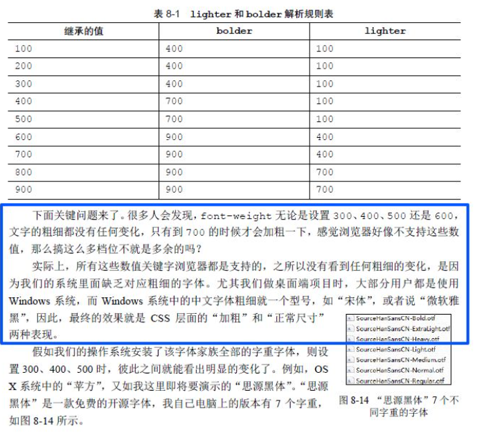
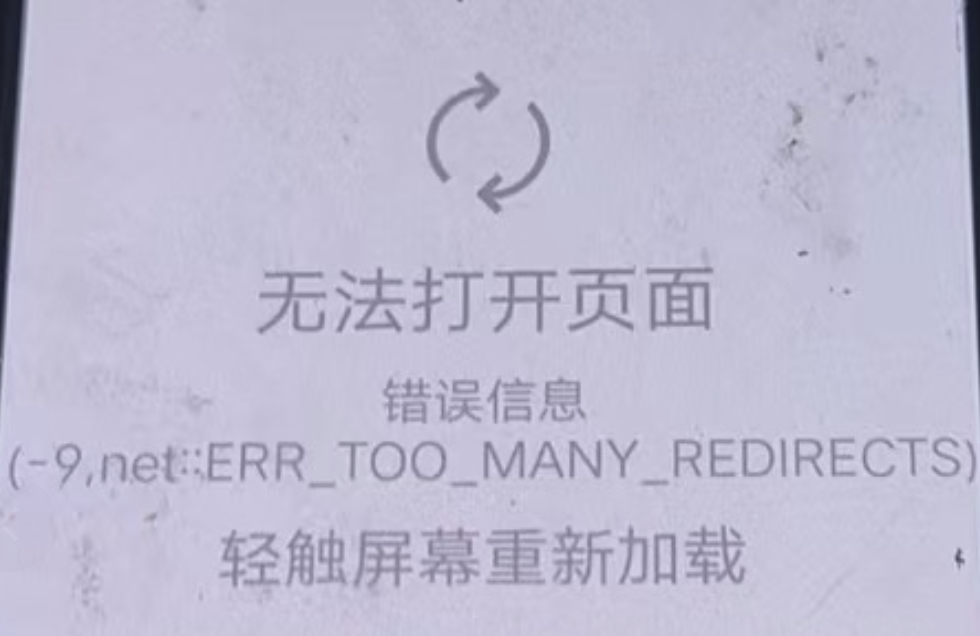
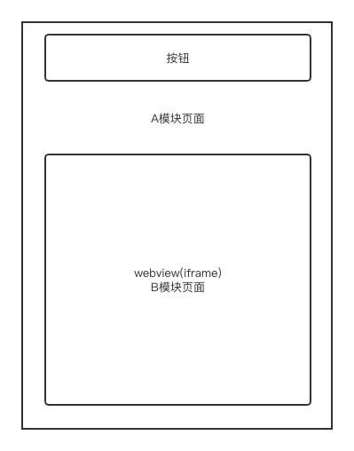

# 杂记

简要记录些工作中遇到的杂七杂八问题。

## 那些比较复杂的CSS选择器

1、`.radio:not(:last-child)::after`

选择所有不是其父元素最后一个子元素的 `.radio` 元素，并在其后插入伪元素。

也就是选择除了最后一个的其它所有 `.radio` 元素。

```html
<!DOCTYPE html>
<html lang="en">
  <head>
    <meta charset="UTF-8" />
    <meta name="viewport" content="width=device-width, initial-scale=1.0" />
    <title>Document</title>
    <style>
      .radio-group {
        display: flex;
        align-items: center;
      }
      .radio {
        position: relative;
        padding-right: 20px;
      }
      .radio:not(:last-child)::after {
        content: "|";
        position: absolute;
        right: 0;
        color: #333;
      }
    </style>
  </head>
  <body>
    <div class="radio-group">
      <label class="radio">Option 1</label>
      <label class="radio">Option 2</label>
      <label class="radio">Option 3</label>
      
      <div class="radio-group2">
        <label class="radio">Option 11</label>
        <label class="radio">Option 22</label>
        <label class="radio">Option 33</label>
      </div>
    </div>
  </body>
</html>
```

## iPhone 如何安装 whistle 证书

简要步骤：

- 扫描 whistle 二维码，用 Safari 下载证书。
- 安装证书。
- 开启信任证书。

[whistle苹果手机安装证书步骤](https://blog.csdn.net/qq_44859233/article/details/123834624){link=static}

## iOS手机无法安装 Charles 的 ssl 证书

新 IPhone 安装 Charles 证书有问题。

[iOS手机无法安装Charles 的ssl证书](https://blog.csdn.net/qq_43485197/article/details/132272661){link=static}

## 某些移动安卓设备 `font-weight: 600` 不生效

在某些安卓的移动端设备上，`font-weight: 600` 不生效，字体并没有加粗。这是因为在某些设备上，缺少对某些字体的粗细支持。

一般而言，绝大多数设备支持对 400 和 700 的粗细字体样式。也就是常见的 `font-weight: normal` 和 `font-weight: bold`。

而苹果设备对字体粗细的支持程度做的比安卓好很多，可以看到不同数值粗细的变化。



[font-weight 失效移动安卓处理方法](https://blog.csdn.net/weixin_41697143/article/details/104517239){link=card}

## iOS机型二级页面返回到首页不刷新问题

宿主环境：某银行APP，机型：iPhone。

### 法一：监听pageshow事件

解决代码：

```js
// 解决ios部分机型二级页返回不刷新的问题
window.onpageshow = async (event) => {
  if (event.persisted || (window.performance && window.performance.navigation.type === 2)) {
    if (isIOS()) {
      // 刷新页面操作
      this.refreshPage();
    }
  }
};
```

- `window.onpageshow` 事件在页面显示时触发，包括从缓存中恢复页面时。

- `event.persisted` 属性表明页面是否在缓存中加载的。

- `window.performance.navigation.type` 属性返回页面导航的类型，其中 2 表示页面通过浏览器的「前进」或「后退」按钮加载的。

### 法二：监听visibilitychange事件

解决代码：

```js
if (isIOS()) {
  document.addEventListener('visibilitychange', async () => {
    if (!document.hidden) {
      this.doThings();
    }
  });
}
```

`visibilitychange` 事件是用于检测页面可见性状态变化的事件。当页面从可见变为不可见（例如用户切换到其他标签页或最小化窗口），或从不可见变为可见时，会触发这个事件。

这个事件在处理需要根据页面可见性来执行某些操作的场景中非常有用，比如节省资源、暂停动画或重新加载数据。

`document.hidden` 表示页面是否隐藏的。

因此上述代码结合起来就是，判断页面从不可见变为可见的时候，执行相应操作。

## iOS机型二级页面返回,上一级页面状态没重置

机型：iPhone 14，系统：iOS 16.0.3。

问题描述：H5页面，从A页面跳转到B页面，在B页面调用 `Taro.navigateBack()` 后退路由，回到A页面，发现A页面的状态没有重置，从而导致其子组件重复执行了 `componentDidMount` 生命周期钩子。

而子组件的 `componentDidMount` 生命周期钩子又存在跳转到B页面的逻辑，因此导致页面来回跳转，陷入死循环。

问题代码模拟：

```js
// A.jsx
import SubComponent from '../SubComponent';

export default class AComponent extends Component {
  render() {
    const { showSub } = AStore || {};
    return (
      {showSub && <SubComponent />}
    )
  }
}

// SubComponent.jsx
export default class SubComponent extends Component {
  componentDidMount() {
    this.jumpToB();
  }
}
```

关键就在于 showSub，它的默认值是 false，其它机型从B页面返回的时候，它都会重置为 false，而在 iPhone14 中确始终是 true，导致 SubComponent 重复执行了 componentDidMount 生命周期钩子。

解决办法：针对 iOS 机型，在 componentDidMount 中增加变量判断，控制只执行一次初始化的跳转。由于没有办法精准判断 iPhone14，同时为了减少影响范围，只判断 iOS 机型，安卓机型不做处理。

```js
// SubComponent.jsx
let isIOSFirst = true;
export default class SubComponent extends Component {
  componentDidMount() {
    if (isIOS() && !isIOSFirst) {
      return;
    }
    if (isIOS()) {
      isIOSFirst = false;
    }
    this.jumpToB();
  }
}
```

## `ERR_TOO_MANY_REDIRECTS` 错误

当你在使用 Chrome 浏览器Q访问某个网站时，出现了 `xxX redirected you too many times. Try deleting your cookies.
ERR_TOO_MANY_REDIRECTS` 的错误消息，这表明浏览器在尝试加载网页时遇到了一些问题。这些问题通常与网站的重定向配置不当有关，导致浏览器无法正确加载页面。

`ERR_T0O_MANY_REDIRECTS` 错误通常意味着你访问的页面在短时间内经历了过多的重定向，可能是由于网站配置错误或浏览器中的某些数据（例如 Cookie）导致了无限循环的重定向。

实例分析：某电商网站的 `ERR_TOO_MANY_REDIRECTS` 案例

为了使概念更具体化，我们来看一个真实世界的案例。某电商网站在迁移到 HTTPS 后，突然开始收到大量用户报告的 `ERR_T0O_MANY_REDIRECTS` 错误。问题的根源在于网站配置了强制 HTTPS 重定向，但服务器端也有一个规则，试图将所有 HTTPS 请求重定向回 HTTP。这两个重定向规则相互冲突，导致了无限循环。

在调查过程中，开发团队首先删除了所有与重定向相关的 Cookies，但问题依旧存在。接着，他们检查了服务器的配置文件，发现了一个 `.htaccess` 文件中错误的重定向规则。在修复了该规则后，问题得到了有效解决。

这个案例强调了仔细检查服务器配置的重要性，尤其是在涉及到安全性（HTTPS）或复杂的网站结构时。



## iOS系统APP禁用手势返回

只针对 iOS 系统，安卓暂不支持。

```js
function gestureBack(options) {
  if (process.env.TARO_ENV === 'h5') {
    if (isApp() && isIOS()) {
      return new Promise((resolve, reject) => {
        try {
          window?.app?.Plugin.gesture(
            `app://frame/allowGesture?allow=${options.allow}`,
            (res) => {
              resolve(res);
            },
            (error) => {
              reject(error);
            }
          );
        } catch (error) {
          reject(ErrMsg.INVOKE_FAIL);
        }
      });
    } else {
      return Promise.reject(`当前环境不支持该API调用:APP手势返回`);
    }
  } else {
    return Promise.reject(`当前环境不支持该API调用:APP手势返回`);
  }
}
```

## APP禁止截屏录屏

```js
if (isApp() && isIOS()) {
  var callback = function (operation) {
    Taro.showToast({ title: `发现${operation}操作，请注意个人信息安全`, icon: 'none' });
  };
  window.app.NotificationPlugin.registerNoticeEvent('screenshot', () => callback('截屏'));
  window.app.NotificationPlugin.registerNoticeEvent('screenrecord', () => callback('录屏'));
}

if (isApp()) {
  const version = await getVersion();
  if (isAndroid() && versionCompare(version, '1.2.0') >= 0) {
    window.app.Plugin.secure('app://frame/setWindowSecure?secureFlag=1');
  }
}
```

## 页面字体大小异常问题

问题描述：在 iOS 机型上，某个模块的部分页面会出现字体大小异常的问题，可能变大或者变小，而且是偶发的，不是必现的，但就是有。

思路：页面整体的字体大小变大或者变小，可能是和根元素 html 的 font-size 有关系，设置有异常。

因此，去代码中搜索和设置根元素 font-size（fontSize）相关的代码，发现 index.html 文件中确有一段代码是根据页面宽度设置根元素 font-size。

```js
!(function (x) {
  function w() {
    var v, u, t, tes, s = x.document, r = s.documentElement, a = r.getBoundingClientRect().width;
    if (!v && !u) {
      var n = !!x.navigator.appVersion.match(/AppleWebKit.*Mobile.*/);
      v = x.devicePixelRatio;
      tes = x.devicePixelRatio;
      v = n ? v : 1, u = 1 / v;
    }
    if (a >= 640) {
      r.style.fontSize = "40px";
    } else {
      if (a <= 320) {
        r.style.fontSize = "20px";
      } else {
        r.style.fontSize = a / 320 * 20 + "px";
      }
    }
  }
  x.addEventListener("resize", function () {
    w();
  });
  w();
}(window));
```

代码根据根元素 html 的宽度动态设置根元素 font-size。经过打印日志排查，现在出现异常的时候就是根元素 font-size 变成了 40px 或者 20px，导致页面字体大小异常。

尝试了很多手段，例如使用 window.innerWidth、定时器延迟一段时间再执行 w 函数，但均无效。

:::tip
`window.document.documentElement.getBoundingClientRect().width` 返回的是 HTML 根元素的宽度。
:::

后面试着在 app.jsx 文件的 componentDidMount 中执行这段逻辑，理论上 index.html 文件这段代码的执行肯定会比 componentDidMount 中的代码先执行，但结果发现 compionentDidMount 中设置的 font-size 被 index.html 的覆盖了。

由此怀疑是不是和 resize 的监听再执行有关，又在 resize 中加了日志，发现确实是 resize 被触发导致 font-size 重新被设置了，而且取的根元素宽度还是 980px 或者 0，导致 font-size 设置异常。

解决方案：把 resize 的监听删除，问题解决。

但究竟是因为什么原因 resize 被触发导致 font-size 重新被设置，还不得而知。

{link=static}

## webview(iframe)多页面加载导致的问题

{link=static}

webview 是一个用来承载网页的容器，本质上是使用了 iframe 来打开了一个新的网页。

### 外层window对象调用属性出错

问题机型：Android。iOS 没有这个问题，挺奇怪的。

问题描述：

如下图所示，A模块页面使用了 WebView 容器，容器里打开了B模块页面，这种通常是打开协议之类的页面。



假设有一个公共方法可以设置按钮的点击函数。

现在每个模块加载的时候，都会调用公共方法设置按钮的点击函数，函数的内容大概如下，接收一个函数，将其挂载到 window 对象上，接着通过 window 对象调用改方法。

```js
function setBtnClick(callback) {
  const funcKey = `key_${new Date().getTime()}`
  window[funcKey] = callback;
  eval(`window.${funcKey}`);
}
```

现在出现的问题是：点击按钮报错了，`window.xxx is not a function`。

问题排查：

这个问题是在某个 APP 上发现的，在手机的 vConsole 调试组件里其实值打印了 `script error` 的错误，但是没有具体的报错信息。因此需要使用 USB 线连接到电脑上，使用 Chrome 调试手机网页。

连接电脑调试后，就清楚地看到，点击按钮时控制台打印了 `window.xxx is not a function` 的错误。

问题分析：

一开始加载A模块的页面，会调用公共方法，给 window 对象挂载一个 a 函数，按钮设置点击方法通过 `window.a()` 调用。

后面 WebView 加载B模块页面，又执行了同样的操作，给**iframe 的 window 对象**挂载一个 b 函数，按钮设置了点击方法为 `window.b()`。

这样导致最后按钮点击的时候，调用的是 `window.b()`，而外层的 window 对象实际上并没有 b 这个属性方法，所以就报错了。

解决方法：

WebView 加载完页面后，再次手动调用公共方法，重新给外层 window 挂载一个 c 方法，设置一遍按钮的点击函数调用它。

```jsx
onLoad = () => {
  setBtnClick(() => alert('click'));
}

<WebView src={src} onLoad={this.onLoad} />
```