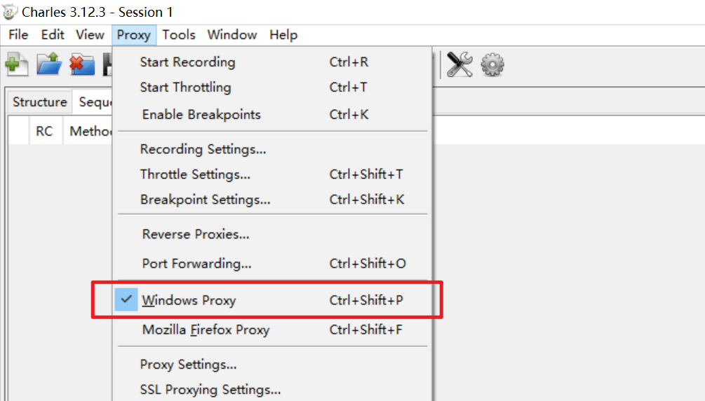
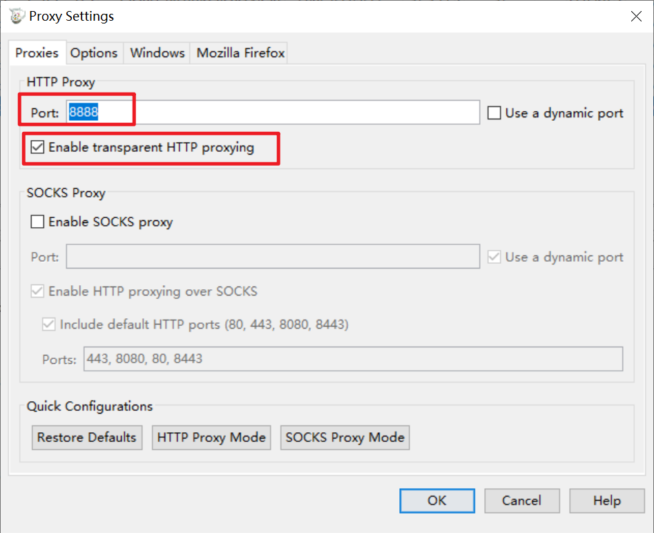
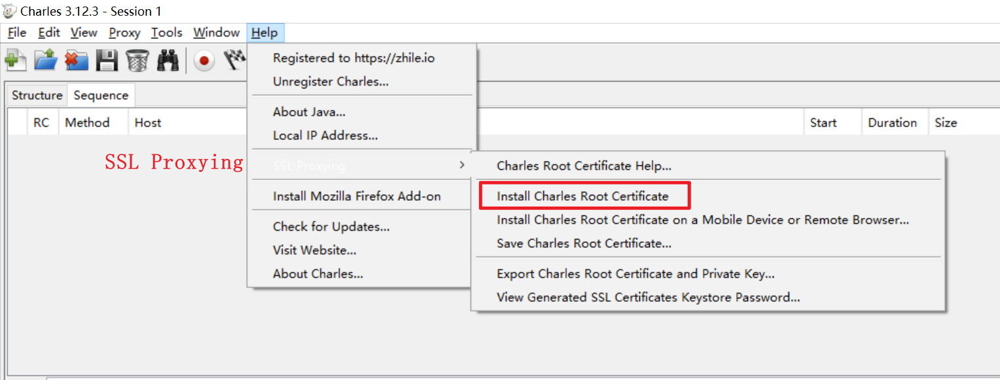
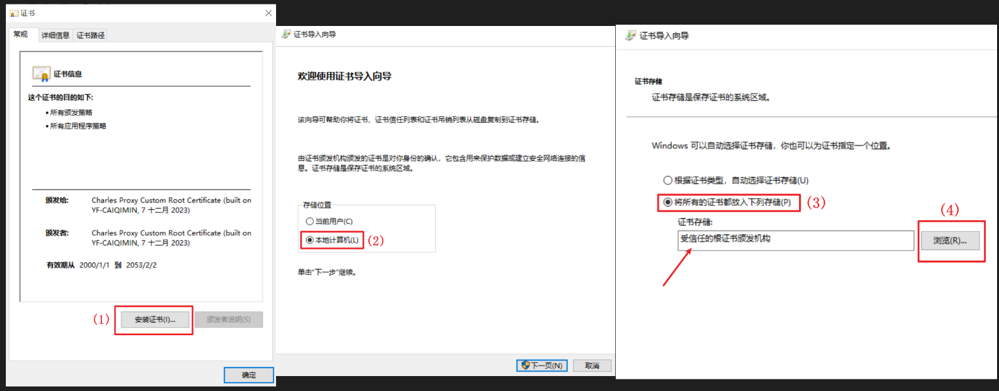
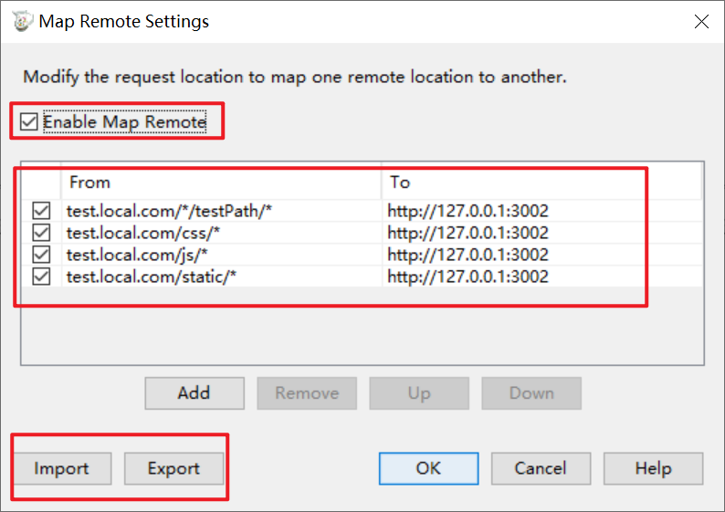

# 日常开发工具

## classnames

一个实用的工具库，方便我们根据条件动态组合类名。

安装 `classnames`。

```bash
npm install classnames
```

用法。

```jsx
import classNames from 'classnames';

class App extends React.Component {
  render() {
    return (
      <div className={classNames(
        'btn', 
        { 'btn--red': isRed },
        { 'btn--blue': isBlue}
      )}>
        Hello World!
      </div>
    );
  }
}
```

## moment

一个日期时间工具库，在 JavaScript 中解析、校验、操作和展示日期和时间。

[moment 中文网](https://momentjs.cn/){link=card}

[moment 英文网](https://momentjs.com/){link=card}

### 安装

```bash
npm install moment --save
```

### 格式化为日期时间字符串

注意 `HH:mm:ss` 和 `hh:mm:ss` 的区别，前者是24小时制，后者是12小时制。

```js
moment().format('YYYY-MM-DD HH:mm:ss'); // 2023-01-01 17:20:20
moment().format('YYYY-MM-DD hh:mm:ss'); // 2023-01-01 05:20:20
moment(new Date()).format('YYYY-MM-DD HH:mm:ss'); // 2023-01-01 17:20:20
moment(1703150359094).format('YYYY-MM-DD HH:mm:ss'); // 2023-12-21 17:19:19
```

### 计算时间差

使用 `moment().diff()`，计算两个时间的差值。

```js
moment().diff(Moment|String|Number|Date|Array);
moment().diff(Moment|String|Number|Date|Array, String);
moment().diff(Moment|String|Number|Date|Array, String, Boolean);
```

参数1：要判断的时间值，格式支持 `Moment|String|Number|Date|Array`。

参数2：比较的单位，可以为 `years, months, weeks, days, hours, minutes, seconds`，默认单位值毫秒。

参数3：是否保留小数。默认是截断小数点后的位数，取整数，如 0.5 返回 0。

如果前者时间比后者时间大，返回正值，相反则返回负值，因此也可以用来比较两个时间的大小。

```js
var a = moment('2023-12-22 16:18:15');
var b = moment('2023-12-22 16:18:10');

a.diff(b); // 5000
a.diff(b,'seconds'); // 5，表示a比b多5秒
a.diff(b, 'minutes'); // 0
a.diff(b, 'minutes', true); // 0.08333333333333333
b.diff(a); // -5000
```

### 判断两个时间大小

使用 `moment().diff()`，根据差值的正负判断时间的大小。

```js
// 正值：前者时间比后者时间大。
// 负值：前者时间比后者时间小。
// 0：前者时间和后者时间相等。
var a = moment('2023-12-22 16:18:15');
var b = moment('2023-12-22 16:18:10');

a.diff(b); // 5000
b.diff(a); // -5000
```

### 常用时间

```js
moment().format('YYYY-MM-DD'); // 今天
moment().add(1, 'day').format('YYYY-MM-DD'); // 明天
moment().subtract(1, 'day').format('YYYY-MM-DD'); // 昨天
moment().subtract(29, 'day').format('YYYY-MM-DD'); // 30天前
moment().startOf('month'); // 本月初
moment().endOf('month'); // 本月末
moment().startOf('week'); // 本周初
moment().endOf('week'); // 本周末
moment().month(moment().month() - 1).startOf('month'); // 上个月初
moment().month(moment().month() - 1).endOf('month'); // 上个月末
```

## NVM

nvm 是管理 node 版本的快捷工具，使用它可以十分方便地切换 node 版本。

### nvm 常用命令

```bash
nvm list     // 查看已安装的 node 版本
nvm install <version>       // 安装某个版本的 node，如：nvm install 12.22.22
nvm use <version>      // 使用某一版本的 node
nvm uninstall <version>   // 卸载指定版本的 node
```

### nvm 的安装

[nvm 详细安装步骤以及使用（window10 系统）](https://blog.csdn.net/Anony_me/article/details/124153201){link=card}

## serve

serve 在本地启动一个静态资源服务器，可以在本地运行查看项目打包的效果。

:::tip node版本≥14
serve v14 onwards requires Node v14 to run. Please use serve v13 if you cannot upgrade to Node v14.
:::

安装。

```bash
npm install -g serve
```

启动服务器，首先先打包完本地项目，一般会生成 `build` 或 `dist` 目录。

```bash
# 进入build或dist目录
serve

# 在项目根目录
serve -s build
serve -s dist

# 指定端口号
serve -p 3000
```

## Charles

Charles 是网络代理应用软件。

:::warning 提示
以下操作均在 Windows 系统下进行。Mac 系统自行查阅资料。
:::

### 安装

从[官网](https://www.charlesproxy.com/)下载无脑安装即可。

Charles 的注册码通行证，自行搜索找吧。

### 开启系统代理

路径：`Proxy -> Windows Proxy`。




### 抓取 http 网络包

路径：`Proxy -> Proxy Settings`。

端口填 8888，`Enable transparent HTTP proxying` 勾选上。



### 抓取 https 网络包

安装上 CA 证书即可。

路径：`Help -> SSL Proxying -> Install Charles Root Certificate`。



安装步骤，如图所示。



安装好后，查看有效期是否正确即可。

### 域名重定向

域名重定向，是指将指定的网络请求重定向到另一个地址。可以避免本地运行项目时的接口跨域问题。

路径：`Tools -> Map Remote`。



这个配置的含义是，将 `test.local.com` 的请求映射到本地的 3002 端口（本地项目运行的端口），也就是访问 `test.loca.com` 其实就是访问 `127.0.0.1:3002`。

如果直接访问 `127.0.0.1:3002`，会出现跨域问题，和接口的域名不一致。

配置好的域名重定向，可以导出成 `xml` 文件，下次使用可以一键导入。


## Nginx

[连前端都看得懂的《Nginx 入门指南》](https://juejin.cn/post/6844904129987526663){link=card}
